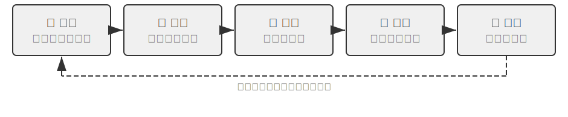

# Sự tự tiến hóa của #Agent

Các chương trước đã xây dựng hệ thống năng lực của Agent từ các kích thước khác nhau. Context Engineering (kỹ thuật ngữ cảnh) trong Chương 2 đặt nền tảng cho việc quản lý thông tin (bao gồm cả việc tải cơ chế Kỹ năng theo yêu cầu); cơ sở kiến thức và trí nhớ người dùng trong Chương 3 đạt được tính bền vững của kiến thức giữa các phiên; Chương 5 cho thấy cách Coding Agent tích lũy kinh nghiệm thông qua hệ thống tệp; đào tạo học tập sau củng cố trong Chương 7 củng cố chiến lược thành các tham số mô hình. Mỗi công nghệ này đều có trọng tâm riêng, nhưng chúng đều hướng đến cùng một câu hỏi: **Agent Làm thế nào để tiếp tục trở nên mạnh mẽ hơn?**

Ngay cả mô hình tiên tiến nhất vẫn trông trống rỗng như một nhân viên mới khi đối mặt với quy trình hoàn tiền của một công ty cụ thể, chiến lược khoa trương của một nhà điều hành nhất định hoặc phương thức gọi điện của API không được ưa chuộng. Việc thay đổi trọng số mô hình đòi hỏi nhiều dữ liệu và sức mạnh tính toán, đồng thời chu kỳ cập nhật thường có thể mất hàng tuần; trên thực tế, API mới xuất hiện trực tuyến, các dịch vụ cũ ngoại tuyến và nhu cầu của người dùng liên tục thay đổi. Agent cần một cơ chế tiến hóa nhẹ hơn và theo thời gian thực hơn để có thể tiếp tục mở rộng khả năng của mình mà không cần thay đổi các tham số mô hình.

Chương này khám phá cơ chế này: **Sự tự tiến hóa của Agent (Self-Evolution)**. Tự tiến hóa, tức là học tập từ bên ngoài, bao gồm hai chiều - thu thập kiến thức từ kinh nghiệm và tích cực khám phá và tạo ra các công cụ mới. Ý tưởng cốt lõi là tách kiến thức và quy trình khỏi các tham số mô hình và ngữ cảnh tạm thời, đồng thời chuyển chúng thành các tài nguyên bên ngoài bền vững, có thể truy xuất và tái sử dụng - các thư viện công cụ và cơ sở kiến thức. Đây không phải là giải pháp thay thế cho việc post-training mà là sự bổ sung: post-training giải quyết "cách làm cho mô hình thông minh hơn" và quá trình tự tiến hóa giải quyết "cách làm cho Agent có khả năng cao hơn".

## Tại sao Agent không tự động học

Những gì tôi đã nói trước đó là nhu cầu thực tế. Nhưng có một câu hỏi cơ bản hơn: **Nếu cửa sổ ngữ cảnh có thể dài vô hạn và tất cả các kết quả cuộc gọi công cụ và hội thoại mà Agent đã trải qua đều được đưa vào đó, liệu nó có thể tự động học mọi thứ không?**

Câu trả lời là không, và lý do nằm ở cơ chế chú ý đã được thảo luận ở Chương 2. Đây là điểm khởi đầu về mặt lý thuyết của chương này, đáng được xem xét ngắn gọn sau một vài chương.

Chương 2 nhấn mạnh nhiều lần: **Cơ chế nội tại của việc học ngữ cảnh giống như việc truy xuất hơn là lý luận**. Chú ý giỏi “tìm kiếm” - “Con mèo nào ở chuồng thứ 37?” Đánh một bước; nhưng lại không giỏi trong việc “tổng hợp số liệu thống kê” trong quá trình truyền bá về phía trước - “Có bao nhiêu con mèo đen trong 100 lồng?” Cái sau yêu cầu duyệt qua tất cả các bản ghi và duy trì trạng thái đếm. Bản chất là suy nghĩ hơn là thu hồi. Nói cách khác, nếu trải nghiệm ban đầu được đưa vào ngữ cảnh, mô hình có thể "ghi nhớ" nó nhưng sẽ không tự động "tinh chỉnh" nó thành các quy tắc có thể sử dụng lại. Ngay cả khi ngữ cảnh thực sự là vô hạn thì khoảng cách này vẫn tồn tại: thông tin có nhưng chưa ai hoàn thành bước nén từ “bản ghi cụ thể” đến “mẫu chung” cho mô hình. Hơn nữa, như Chương 2 "Tham nhũng ngữ cảnh" tiết lộ, ngữ cảnh càng dài và càng ồn ào thì sự chú ý càng bị loãng đi và càng khó truy xuất thông tin chính - ngữ cảnh không giới hạn không những không mang lại khả năng học tập tự động mà còn khiến chất lượng truy xuất tiếp tục giảm sút. Cái nhìn sâu sắc của Karpathy có thể được hiểu ngược lại: “trí nhớ kém” của mô hình là một đặc điểm chứ không phải là một khuyết điểm. Nó buộc chúng ta phải sàng lọc kiến thức một cách tích cực và rõ ràng, thay vì mong đợi mô hình tìm ra các quy tắc từ một lịch sử lâu dài. Điểm mấu chốt: **Việc học không diễn ra một cách tự động, nó phải được thiết kế rõ ràng**—đó là lý do tồn tại của chương này.

Và "tìm hiểu về thiết kế rõ ràng" sẽ không xuất hiện cho đến Chương 8. Một số nguyên mẫu đã được trình bày trong các chương trước, nhưng hầu hết chúng phục vụ nhu cầu trước mắt trong một phiên duy nhất hoặc ngay liền kề với một phiên: **Nén ngữ cảnh** trong Chương 2 sử dụng lệnh gọi LLM bổ sung để "thay thế" các bản ghi gốc cồng kềnh thành các kết luận được tính toán, chú ý điền vào một nửa còn thiếu của "sàng lọc"; **Agent trong Chương 2 Thanh trạng thái**, trong đó mã duy trì dần dần và xác định các kết luận chính trong ngữ cảnh, là mặt khác của cùng một đồng tiền; **bộ nhớ người dùng** trong Chương 3 đã thúc đẩy quá trình "học tập" qua các phiên - Agent tích lũy sự hiểu biết về người dùng trong cuộc trò chuyện này đến cuộc trò chuyện khác và dựa vào tính năng sắp xếp ngoại tuyến để làm cho thông tin ngày càng chính xác hơn.

Bộ nhớ người dùng trong Chương 3 bản thân nó là một dạng học tập, nhưng những gì được tích lũy là **thông tin**(sở thích, sự kiện, thói quen) về "người dùng là ai". Điều mà Chương 8 cần bù đắp là nửa còn lại, dài hạn hơn: thúc đẩy các chiến lược giải quyết vấn đề, quy trình vận hành, bài học rút ra từ những thất bại và thậm chí cả các công cụ mới được tóm tắt trong quá trình khám phá **khả năng** bền, có thể truy xuất và tái sử dụng, để Agent không chỉ "ghi nhớ nhiều hơn" mà còn "ngày càng trở nên có nhiều khả năng hơn". Kiểu học này lâu dài hơn và yêu cầu bắt đầu **hoạt động** Agent, vì vậy nó xứng đáng có một chương riêng - trước tiên hãy định vị nó từ góc độ vĩ mô.

## Ba mô hình học tập và định vị sự tự tiến hóa

Ba mô hình được giới thiệu trong Chương 1 (Hình 1-1) chỉ được sử dụng để so sánh định vị ở đây. **Post-training** sửa đổi trọng số mô hình và củng cố "trải nghiệm" thành "bộ nhớ cơ" thông qua RL, có tỷ lệ thành công cao và độ trễ thấp nhưng chi phí cập nhật cao và chu kỳ dài (chi tiết trong Chương 7); **In-Context Learning (học trong ngữ cảnh)**(In-Context Learning, ICL) cung cấp các ví dụ minh họa bằng các từ gợi ý để thích ứng tạm thời, chi phí thấp và hiệu quả nhanh chóng nhưng sẽ biến mất khi phiên kết thúc (xem Chương 1 và 2 để biết chi tiết); **External Learning (học bên ngoài tham số mô hình)** là con đường dễ bị các nhà phát triển bỏ qua nhất - gửi kiến thức vào các tệp, cơ sở kiến thức và công cụ bên ngoài mô hình, bền vững, có thể hiểu được và có thể sửa đổi bất kỳ lúc nào. Cả ba cộng tác thay vì cạnh tranh: Kiến thức thực tế được cung cấp cho RAG (xem Chương 3 để biết chi tiết) và bộ nhớ ngoài, các hành vi và định dạng ổn định được cung cấp cho quá trình đào tạo và củng cố sau, còn thông tin tạm thời hiện tại được cung cấp cho việc In-Context Learning (học trong ngữ cảnh).

Chương này tập trung vào con đường không làm thay đổi trọng lượng của mô hình - học tập từ bên ngoài, tương ứng với hai chiều được đề cập ở đầu chương: biến kinh nghiệm thành kiến thức và kỹ năng, và biến khả năng thành công cụ. (Điều này cần được phân biệt với Chương 5 "Mã tạo mã: Agent Bootstrap": ở đó nói về Agent tạo ra một hệ thống tương tự như chính nó. Chương này nói về sự phát triển của khả năng mà không thay đổi trọng số. Chương 3 giải quyết vấn đề "cách lưu và kiểm tra" cơ sở kiến thức, và chương này giải quyết "ai sẽ điền và cập nhật" - cách Agent tích cực tích lũy kinh nghiệm.)

Tại sao nó lại cần thiết? Trước tiên hãy xem xét một kịch bản tiêu cực. Giả sử đại diện dịch vụ khách hàng Agent lần đầu tiên xử lý quy trình hoàn tiền của một ngân hàng nhất định: sau 15 phút tìm hiểu—thực hiện ba cuộc gọi điện thoại và thử hai phương pháp—việc hoàn tiền cuối cùng đã hoàn tất thành công. Nếu nó thiếu khả năng học hỏi từ bên ngoài, lần tiếp theo nó gặp phải yêu cầu tương tự, nó sẽ phải mất lại 15 phút để thực hiện lại cùng một hành trình khám phá. Kinh nghiệm tích lũy lần này sẽ biến mất khi phiên kết thúc. Mấu chốt nằm ở chữ “tự chủ”: thay vì các kỹ sư con người chuẩn bị tài liệu cho Agent, Agent tổng hợp kinh nghiệm, xây dựng công cụ, cập nhật nền tảng kiến thức trong quá trình hoàn thành nhiệm vụ – giống như một chuyên gia dịch vụ khách hàng kỳ cựu tổ chức các quy định hoàn tiền rải rác thành một cuốn sổ tay có thể đọc bất cứ lúc nào và cập nhật độc lập theo tình huống mới. Triết lý cốt lõi là: Thay vì mong đợi mô hình ghi nhớ mọi thứ, tốt hơn là sử dụng sức mạnh tính toán bổ sung để tóm tắt, nén và cấu trúc trải nghiệm sau khi hoàn thành nhiệm vụ, sau đó lưu trữ nó trong một hệ thống bên ngoài bền bỉ và có thể truy xuất được. So với học tham số, phương pháp này có thể nhanh chóng tích lũy kiến thức có thể diễn giải, kiểm chứng và sửa chữa mà không cần đào tạo tốn kém; so với In-Context Learning (học trong ngữ cảnh), nó tránh được việc truy xuất không hiệu quả với lượng lớn thông tin gốc và đạt được tính bền vững giữa các phiên thông qua việc tổ chức có cấu trúc và tinh chỉnh tích cực.

Quan trọng hơn, External Learning (học bên ngoài tham số mô hình) cải thiện khả năng học tập của Agent từ "ghi nhớ thông tin" đến "khả năng xây dựng": nó không chỉ có thể tóm tắt kinh nghiệm thành kiến thức tóm tắt và lưu trữ trong cơ sở kiến thức để truy xuất sau này (RAPTOR được giới thiệu trong Chương 3 RAG Quy nạp hình cây cũng phù hợp để tinh chỉnh kinh nghiệm theo từng lớp - từ các bản ghi hoạt động cụ thể đến các quy tắc, sau đó đến các nguyên tắc). Nó cũng có thể gói gọn các quy trình hoạt động lặp đi lặp lại thành các công cụ có thể được thực thi chính xác để tạo thành một thư viện kỹ năng ngày càng phát triển. Ví dụ: Đại diện dịch vụ khách hàng Agent có thể học được ba điều khác nhau khi giúp khách hàng xử lý khoản tiền hoàn lại. Danh mục đầu tiên là một quy tắc cụ thể - "Việc hoàn tiền của Công ty A phải xác minh bốn chữ số cuối của thẻ tín dụng". Đây là kiến thức thực tế và có thể được lưu trữ trong cơ sở kiến thức; loại thứ hai là một công cụ chung - "Sử dụng Bảng 8-1 tóm tắt ba sản phẩm này được tạo ra bởi quá trình học tập hóa học bên ngoài.

Bảng 8-1 Ba sản phẩm của External Learning (học bên ngoài tham số mô hình)

| Mẫu sản phẩm | Mang nội dung | Ví dụ | Cách sử dụng |
|------|------|------|------|
| Nhập cơ sở kiến thức | Sự kiện và Quy tắc | "Ngân hàng này yêu cầu địa chỉ ngân hàng" | Tìm kiếm ngữ nghĩa hoặc Tìm kiếm chính xác `grep` |
| Công cụ mã chuyên dụng | Quy trình hoạt động lặp lại | "Trình tự gọi API để truy vấn số dư tài khoản" | Củng cố thành mã, gọi thông qua tham số |
| Tài liệu kỹ năng | Policy làm việc phức tạp nhưng luôn thay đổi | "Các phương pháp hay nhất để xử lý yêu cầu bồi thường bảo hiểm" | Tài liệu ngôn ngữ tự nhiên, tải theo yêu cầu |

Có một nguyên tắc đơn giản để xác định nên sử dụng biểu mẫu nào: **Thông tin thực tế thuần túy được lưu trữ trong cơ sở kiến thức, các tham số phức tạp và được sử dụng thường xuyên được viết dưới dạng mã (công cụ) và thường xuyên thay đổi và liên quan đến các phán đoán chiến lược được viết dưới dạng tài liệu (Kỹ năng)**. Hai cái sau đều là "tạo công cụ" - một hình thức học ngoại vi bậc cao hơn, không chỉ ngoại hóa "kiến thức" mà còn ngoại hóa và mã hóa "quy trình", chuyển từ "nghĩ lại mỗi lần" sang "tạo một lần và sử dụng lại nhiều lần", giống như viết các bước thành tập lệnh tự động sau khi triển khai máy chủ theo cách thủ công lần đầu tiên. Khung lựa chọn các công cụ và kỹ năng chuyên dụng đã được thảo luận chi tiết trong Chương 4.

Lập trường mà Chương 1 đưa ra cho Bài học cay đắng (The Bitter Lesson) — **đồng thuận về hướng đi, thực dụng về nhịp độ** — được thể hiện đầy đủ nhất chính ở học ngoại vi (External Learning). Không nén toàn bộ tri thức vào tham số, cũng không viết cứng quy trình thành các quy tắc if-else, mà để Agent chủ động xây dựng hệ sinh thái tri thức và công cụ bên ngoài, kéo dài logic mở rộng năng lực từ bên trong mô hình (quy mô tham số) ra thế giới bên ngoài (quy mô của công cụ và cơ sở tri thức). Việc chọn vật mang tri thức cũng tuân theo cùng một logic: phần lớn ký ức và kỹ năng bàn trong chương này được kết tủa dưới dạng Markdown cộng hệ thống tệp, thay vì dựa vào knowledge graph do con người thiết kế — loại sau chính xác hơn trong các lĩnh vực chuyên môn, nhưng ngôn ngữ tự nhiên mới là định dạng mà mô hình xử lý giỏi nhất, cộng thêm LLM làm khâu nén và sắp xếp, mới là con đường tổng quát không phụ thuộc vào cấu trúc tiên nghiệm của con người và có thể mở rộng liên tục theo năng lực của mô hình. Tất nhiên, bản thân học ngoại vi — lưu ở định dạng nào, tổ chức chỉ mục ra sao, khi nào thì chắt lọc — vẫn cần thiết kế kỹ thuật, và đó chính là biểu hiện của "thực dụng về nhịp độ".

## Tại sao Agent Học hỏi kinh nghiệm: từ “thông minh” đến “có tay nghề”

“Cựu chiến binh dịch vụ khách hàng” trước đây, người đã biên soạn các quy tắc rải rác thành sách hướng dẫn, đã chỉ ra chìa khóa để đi từ “thông minh” đến “có tay nghề cao”: khoảng cách thường không phải là mô hình không đủ thông minh mà là nhiều quy trình kinh doanh và kiến thức miền đang thay đổi linh hoạt và không công khai. Việc đơn thuần cải thiện các khả năng chung của mô hình cơ sở không thể giải quyết được các vấn đề phụ thuộc vào “kinh nghiệm” như vậy. Agent Rút kinh nghiệm và đây là loại kiến thức bạn cần học - để hủy đăng ký một dịch vụ nhất định, bạn cần điền vào một biểu mẫu cụ thể thay vì thực hiện các cuộc gọi điện thoại không hợp lệ, để tóm tắt các điều kiện áp dụng cho một ưu đãi nhất định (chẳng hạn như khách hàng kỳ cựu hoặc khách hàng cũ trong hơn hai năm), để đánh giá xem liệu có còn chỗ để đàm phán về báo giá băng thông rộng của một nhà mạng nhất định ở một địa điểm nhất định hay không. Tương tự như vậy, Coding Agent không hiểu các thông số mã và quy trình triển khai dành riêng cho dự án, đồng thời trình duyệt Agent không biết chiến lược chống thu thập dữ liệu và các thay đổi bố cục trang của một trang web nhất định - đây là những kiến thức miền thời gian thực không có trong dữ liệu đào tạo trước.

## Học hỏi kinh nghiệm

Sau khi hiểu được “tại sao phải học”, câu hỏi tiếp theo là “học như thế nào”. Việc thực hành kỹ thuật External Learning (học bên ngoài tham số mô hình) bắt đầu từ việc “ghi lại và sử dụng lại những trải nghiệm thành công”. Hai thử nghiệm sau đây chứng minh hai cách tích lũy kinh nghiệm bổ sung cho nhau: một cách tinh chỉnh các chiến lược cấp cao thành các bản tóm tắt kiến thức có thể tìm kiếm được (tương đương với "ghi chú ý tưởng giải quyết vấn đề") và cách còn lại củng cố các chuỗi hoạt động cụ thể thành các công cụ tự động có thể lặp lại (tương đương với "video hoạt động").

Bảng 8-2 phân loại cơ chế học tập trải nghiệm theo cấp độ để giúp người đọc hiểu được mối quan hệ giữa sàng lọc kiến thức, tổ chức kiến thức, ứng dụng kiến thức và hỗ trợ kỹ thuật.

Bảng 8-2 Agent trải nghiệm cơ chế học tập phân lớp

| Cấp độ | Cơ chế | Vấn đề gì cần giải quyết |
|------|------|-------------|
| Tinh luyện kiến thức | Tóm tắt chiến lược, ghi lại quy trình làm việc, phản ánh lỗi | Trích xuất kiến thức có thể tái sử dụng từ kinh nghiệm thành công và thất bại |
| Tổ chức tri thức | Kỹ năng, tích hợp giấc ngủ | Lưu trữ có cấu trúc và lập chỉ mục kiến thức |
| Ứng dụng kiến thức | Tối ưu hóa từ nhắc nhở hệ thống | Đưa kiến thức vào mẫu hành vi của Agent |
| Hỗ trợ kỹ thuật | Tiếp tục phiên giao nhau | Cho phép thực hiện các tác vụ dài liên tục |

Bốn cấp độ trên được đan xen trong nội dung tiếp theo - tóm tắt chiến lược, ghi lại quy trình làm việc và học hỏi từ những thất bại (tinh chỉnh kiến thức), chuyển đổi tự nhiên sang Kỹ năng và tích hợp giấc ngủ (tổ chức kiến thức), sau đó tối ưu hóa từ nhắc nhở hệ thống (ứng dụng kiến thức) và cuối cùng kết thúc bằng việc tiếp tục các nhiệm vụ dài trong nhiều phiên (hỗ trợ kỹ thuật).

> **Thử nghiệm 8-1 ★★: Học hỏi từ kinh nghiệm thành công: Tóm tắt chiến lược**
>
> Dự án `gaia-experience` là một dự án triển khai điển hình của ý tưởng "Tóm tắt chiến lược". Cái gọi là bản tóm tắt chiến lược nhằm cô đọng quá trình giải quyết vấn đề thành công thành một ghi chú kinh nghiệm có cấu trúc - ghi lại "phương pháp nào đã được sử dụng, những cạm bẫy đã gặp phải và các bước chính là gì" để tham khảo trực tiếp vào lần sau khi gặp phải vấn đề tương tự.
>
> Không phải tất cả các trajectory chạy đều đáng được chắt lọc thành kinh nghiệm - tiêu chí đánh giá là **khả năng chuyển giao**: Các bài học rút ra trong nhiệm vụ hiện tại có thể được sử dụng lại cho các nhiệm vụ tương tự trong tương lai không? Những sửa đổi chỉ có hiệu lực đối với một đầu vào cụ thể sẽ không được đưa vào bộ nhớ dài hạn.
>
> Thử nghiệm này sử dụng hai cơ sở hạ tầng chính. **AWorld Framework** là môi trường đánh giá và thực thi mã nguồn mở được thiết kế đặc biệt cho AI Agent. Nó cung cấp một bộ công cụ được tiêu chuẩn hóa (trình duyệt, hệ thống tệp, trình thông dịch mã, v.v.) và quy trình đánh giá tự động. Có thể hiểu đây là “lớp thi” của Agent. **GAIA** là một bộ tiêu chuẩn đánh giá cực kỳ thách thức nhằm đánh giá các khả năng chung của AI Agent thông qua các vấn đề phức tạp gồm nhiều bước đòi hỏi trí thông minh của con người để giải quyết - chẳng hạn như "tìm thông tin cụ thể trên trang web, xử lý thông tin đó bằng mã và tính toán câu trả lời", thường yêu cầu sử dụng kết hợp trình duyệt, trình quản lý tệp, trình thông dịch mã và suy luận logic phức tạp.
>
> Cải tiến cốt lõi là bổ sung vòng khép kín "ứng dụng học tập" hoàn chỉnh vào Agent trong khung AWorld. Trong **Chế độ học tập**, bất cứ khi nào Agent hoàn thành thành công nhiệm vụ GAIA, hệ thống sẽ tự động ghi lại trajectory hành động hoàn chỉnh của nó và sử dụng LLM để "phản ánh" và "tóm tắt" nó nhằm tạo ra bản tóm tắt trải nghiệm có cấu trúc. Bản tóm tắt này không chỉ chứa câu trả lời cuối cùng mà còn chắt lọc cách tiếp cận cốt lõi để giải quyết vấn đề, những hiểu biết sâu sắc và một chuỗi các công cụ để sử dụng hiệu quả. Những trải nghiệm này được vector hóa và lưu trữ trong cơ sở tri thức. Trong **Áp dụng Chế độ trải nghiệm**, khi Agent nhận được một nhiệm vụ mới, trước tiên, Agent sẽ tiến hành tìm kiếm ngữ nghĩa trong cơ sở kiến thức kinh nghiệm để tìm ra những trường hợp thành công tương tự nhất trong lịch sử và đưa những trải nghiệm này vào các từ gợi ý của hệ thống dưới dạng "ví dụ thành công" để cung cấp hướng dẫn cho việc ra quyết định. Các thí nghiệm đã chứng minh rằng điều này cải thiện đáng kể hiệu quả và tỷ lệ thành công khi giải quyết các vấn đề mới - Agent giải quyết càng nhiều nhiệm vụ, kinh nghiệm tích lũy càng phong phú và khả năng của nó càng trở nên mạnh mẽ hơn, hình thành một hệ thống tự phát triển theo chu kỳ tích cực.
>
> **Thử nghiệm 8-2 ★★: Học từ các tác vụ lặp đi lặp lại: Ghi và phát lại quy trình công việc**
>
> Dự án `browser-use-rpa` là một ví dụ tuyệt vời về ý tưởng "Ghi lại quy trình làm việc". Ý tưởng ghi lại quy trình làm việc tương tự như chức năng "ghi macro" của Excel: ghi lại các bước trong lần đầu tiên bạn vận hành chúng theo cách thủ công, sau đó chỉ cần nhấp vào "Phát lại" để tự động lặp lại chúng. Vấn đề cần giải quyết của dự án này là rất thực tế: nhiều thao tác lặp đi lặp lại được thực hiện trong trình duyệt (chẳng hạn như gửi email báo cáo, truy vấn thông tin trang web cụ thể), mặc dù các tham số cụ thể mỗi lần khác nhau (chẳng hạn như người nhận, từ khóa truy vấn), quy trình hoạt động cốt lõi đã được cố định. Sẽ là một sự lãng phí rất lớn về tài nguyên nếu để Agent luôn bắt đầu lại từ đầu và sử dụng các mô hình lớn đa phương thức đắt tiền để "khám phá lại" quy trình này - về cơ bản chỉ dựa vào việc In-Context Learning (học trong ngữ cảnh) mà không đưa những trải nghiệm thành công vào các công cụ có thể tái sử dụng. Cốt lõi của dự án là một thử nghiệm so sánh cuối cùng về hiệu quả và chi phí.
>
> Trong **Giai đoạn học tập**, Agent lần đầu tiên thực hiện các nhiệm vụ giống như con người thông qua chu trình quan sát-suy nghĩ-hành động đa phương thức của LLM. Mỗi khi LLM quyết định thực hiện một thao tác, hệ thống sẽ trích xuất thông tin định vị chính xác của phần tử được vận hành từ lịch sử của khung browser-use: trang web được hiển thị trong trình duyệt dưới dạng cây DOM (Mô hình đối tượng tài liệu, Mô hình đối tượng tài liệu) và mỗi nút, hộp nhập liệu và liên kết là một nút trên cây; XPath (Ngôn ngữ đường dẫn XML) sử dụng đường dẫn tệp tương tự `/html/body/div[2]/button[1]` Phương thức ghi trỏ đến một nút cụ thể. Các hoạt động được ghi lại dưới dạng các bước có cấu trúc: loại hoạt động (nhấp chuột, đầu vào, v.v.), XPath của phần tử đích, tham số hoạt động và thông tin xác minh sau thực thi (chẳng hạn như URL trang có thay đổi hay không, phần tử mong đợi có xuất hiện hay không). Sau khi tác vụ thành công, LLM tạo nhãn ngữ nghĩa (chẳng hạn như "Gửi email") và mô tả ("Trường người nhận, Trường chủ đề, Trường nội dung, Nút gửi"), được lưu trữ trong cơ sở kiến thức cùng với trình tự bước để tạo thành mục nhập "quy trình làm việc" được tham số hóa.
>
> Trong **Giai đoạn phát lại**, khi có tác vụ mới đến, hệ thống sẽ kết hợp sự tương đồng về ngữ nghĩa (vectơ nhúng) và các yếu tố chính để kiểm tra và khớp với quy trình công việc hiện có. Nếu khớp thành công, nó sẽ được thực hiện từng bước với tốc độ cao: cơ chế chờ (`page.locator(xpath).wait_for(state='visible', timeout=15000)`) của Playwright (thư viện tự động hóa trình duyệt nguồn mở) được sử dụng để đảm bảo phần tử được tải; mẫu được tham số hóa (chẳng hạn như "Nhập `{{email}}` vào trường người nhận") trích xuất giá trị tham số thực tế từ lệnh tác vụ hiện tại thông qua lệnh gọi LLM nhẹ mà không cần phải suy nghĩ trực quan hoàn chỉnh. Nếu một bước không thành công (không tìm thấy phần tử, hết thời gian chờ), điều đó có nghĩa là cấu trúc của trang web có thể đã thay đổi. Tại thời điểm này, hãy đánh dấu quy trình làm việc là "có thể đã lỗi thời", quay lại chế độ học tập và hoàn thành nhiệm vụ thông qua việc suy nghĩ lại LLM và tạo quy trình làm việc mới để thay thế quy trình cũ.
>
> **Tình huống chấp nhận**: Gửi email trong phiên bản web của Gmail.
>
> - Thực hiện lần đầu (giai đoạn tìm hiểu): "Gửi email đến test@example.com với chủ đề 'Email kiểm tra' và nội dung 'Đây là email kiểm tra'". Quan sát cách Agent nhận dạng nút "Soạn", hộp nhập người nhận, hộp nhập chủ đề và nội dung cũng như nút "Gửi" thông qua LLM đa phương thức. Ghi lại các bước thao tác, thời gian tiêu thụ và số lượng cuộc gọi LLM.
> - Thực hiện lặp lại (giai đoạn phát lại): "Gửi email đến another@example.com với chủ đề 'Kiểm tra tiếp theo' và nội dung 'Email kiểm tra thứ hai'". Hệ thống nhận dạng quy trình làm việc phù hợp, trích xuất các giá trị tham số mới và phát lại thao tác trực tiếp mà không cần suy nghĩ trực quan LLM. Thời gian so sánh và số lượng cuộc gọi sẽ giảm đáng kể.
> - Cập nhật kiến thức: Mô phỏng sửa đổi trang web (sửa đổi cấu trúc HTML để thay đổi XPath của một nút), xác minh rằng Agent có thể phát hiện lỗi quy trình làm việc và quay lại chế độ học tập, đồng thời tạo lại quy trình làm việc để cập nhật cơ sở kiến thức.
>
> Người ta dự kiến sẽ nhận thấy rằng: tốc độ thực hiện tác vụ trong giai đoạn phát lại được cải thiện đáng kể (gấp vài lần), chi phí cuộc gọi LLM giảm đáng kể và tỷ lệ thành công ổn định hơn.

Ghi lại quy trình làm việc không phải là một kỹ năng kỹ thuật biệt lập, đằng sau nó là một phương pháp tổng quát hơn. Voyager là kiến trúc Agent thế giới mở do nhóm NVIDIA đề xuất (xem chi tiết bên dưới), hệ thống hóa chu trình "thăm dò-kết tủa" trong thế giới ảo Minecraft: **Thực thi nhiệm vụ → Xác minh thành công → Lưu trữ chuỗi thao tác thành công trong thư viện kỹ năng → Truy xuất và tái sử dụng khi gặp nhiệm vụ tương tự**. Thử nghiệm 8-2 là việc triển khai tập hợp ý tưởng này trong các kịch bản tự động hóa trình duyệt - giai đoạn học tập tương ứng với "khám phá", cơ sở kiến thức về quy trình làm việc tương ứng với "thư viện kỹ năng" và phát lại và khôi phục lỗi tương ứng với "tái sử dụng truy xuất" và cải tiến liên tục.

Thí nghiệm 8-2 cũng bộc lộ hai liên kết mong manh nhất là "ghi-phát lại". Chỉ bằng cách xử lý chúng một cách rõ ràng thì cơ chế này mới thực sự đáng tin cậy [^preact]. Bước đầu tiên là **khi nào bạn dám tin vào việc phát lại**. Một cách tiếp cận đáng tin cậy hơn là biên dịch một chuỗi thao tác thành công thành một **chương trình máy trạng thái** nhỏ: mỗi trạng thái có một "vị ngữ xác minh" (một mẫu giao diện phải được thiết lập trên màn hình thực hiện tại). Trong khi phát lại, **sử dụng vị ngữ để kiểm tra màn hình thời gian thực trước mỗi hành động** - "Xem trước, sau đó hành động." Khi vị từ không được thiết lập hoặc hành động báo cáo lỗi, Agent hoàn chỉnh sẽ được trả về và trajectory mới được biên dịch lại thành một chương trình. Vì không cần lệnh gọi mô hình trong khi phát lại nên các tác vụ lặp lại vào bộ nhớ đệm có thể nhanh hơn 8,5–13 lần. Liên kết thứ hai là **Không lưu các chương trình xấu**: Sau khi biên dịch, hãy đặt lại môi trường ngay lập tức, phát lại từ đầu và sử dụng công cụ đánh giá đi kèm với điểm chuẩn để xác nhận rằng "lần này nó thực sự đã hoàn thành" trước khi thừa nhận nó vào thư viện - "xác minh trước khi lưu" này có thể chặn loại chương trình "phát lại phạm vi bao phủ 100% nhưng không thực sự hoàn thành công việc" (ví dụ: sau khi quá trình hoàn tất và nhấp vào Lưu, nhưng một trường nhất định thực sự trống). Nếu không có rào cản này, thư viện chương trình sẽ dần xuống cấp khi ngày càng có nhiều chương trình bị lỗi. Nó tóm gọn theo một nguyên tắc rõ ràng: **Bộ nhớ quy trình cũng phải có cổng xác minh để chu trình tự cải tiến không bị hỏng** - Đây là phiên bản nghiêm ngặt của "phát hiện lỗi quy trình làm việc, quay lại và học lại" trong thử nghiệm 8-2.

[^preact]: Biên dịch trajectory thành công thành chương trình máy trạng thái với các biến vị ngữ xác minh và thiết lập cổng "xác minh tiền gửi trước". Để biết cơ chế hoàn chỉnh, xem Li, Bojie. *PreAct: Computer-Using Agents nhanh hơn khi thực hiện các tác vụ lặp lại.* arXiv:2606.17929, 2026.

### Học từ thất bại

Tóm tắt chiến lược và bản ghi quy trình làm việc đều trích xuất kinh nghiệm từ **trajectory thành công** - Thử nghiệm 8-1 chỉ kích hoạt phản ánh và tóm tắt sau khi nhiệm vụ thành công. Nhưng kinh nghiệm thất bại cũng đáng được tích lũy và thậm chí còn mang nhiều thông tin hơn: thất bại rõ ràng loại trừ một con đường, trong khi thành công thường chỉ là một trong nhiều con đường khả dĩ. Có hai dạng trải nghiệm thất bại điển hình: **Thư viện mẫu lỗi**(ghi lại "trong những trường hợp và phương pháp nào sẽ thất bại và các tín hiệu thất bại là gì") và **quy tắc tiêu cực**("Không sử dụng phương pháp

Công việc tiêu biểu theo hướng này là Reflexion (Shinn và cộng sự, 2023) [^reflexion-2023]: Sau khi một nhiệm vụ thất bại, Agent sử dụng ngôn ngữ tự nhiên để phản ánh lý do thất bại (chẳng hạn như "Tôi nên xác minh danh tính của mình trước ở bước thứ ba thay vì gửi biểu mẫu trực tiếp") và lưu trữ văn bản phản ánh trong bộ nhớ phân đoạn; lần tới khi bạn thử thực hiện một nhiệm vụ tương tự, hãy đọc những suy nghĩ này dưới dạng ngữ cảnh bổ sung để tránh lặp lại những sai lầm tương tự. Toàn bộ quá trình không cập nhật bất kỳ tham số mô hình nào - Reflexion là một ví dụ kinh điển về "tiến hóa mà không thay đổi trọng số"; Kiểu phản ánh này được truyền tải bằng ngôn ngữ có lượng thông tin phong phú hơn nhiều so với phần thưởng vô hướng, điều này sẽ được thảo luận sau khi hệ thống nhắc nhở việc học. Một lối thoát quan trọng khác cho trải nghiệm lỗi là system prompt: việc tối ưu hóa tự động system prompt được thảo luận sau trong chương này là viết các quy tắc tiêu cực được trích ra từ các trường hợp lỗi (chẳng hạn như "Không bao giờ chuyển công việc thủ công do tranh chấp chính sách") vào system prompt, biến nó thành một ràng buộc hành vi có hiệu lực đối với tất cả các tác vụ tiếp theo.

[^reflexion-2023]: Shinn, N., et al. *Reflexion: Language Agents with Verbal Reinforcement Learning.* arXiv:2303.11366, 2023.

### Kỹ năng: Biến kiến thức miền thành các khả năng có cấu trúc

Hai cơ chế đầu tiên lần lượt ký gửi kinh nghiệm về “cách nghĩ” và “cách làm”. Cơ chế Kỹ năng đi theo con đường thứ ba - tinh chỉnh một cách có hệ thống kiến thức vận hành miền thành các mô-đun năng lực có cấu trúc có thể tải theo yêu cầu. Kỹ năng có thể được hiểu như một “cuốn sổ tay vận hành công việc”: nhân viên mới không cần phải bắt đầu lại từ đầu khi tham gia công việc. Họ có thể bắt đầu làm việc sau khi đọc hướng dẫn. Chương 2 thảo luận chi tiết về cơ chế Tiết lộ lũy tiến (Siêu dữ liệu → Quy trình cốt lõi → Chi tiết) của Kỹ năng và thiết kế tương thích với KV Cache. Phần này tập trung vào triết lý ngoại hóa kiến thức đằng sau Kỹ năng và việc tạo ra nó một cách tự động.

Giá trị cốt lõi của Kỹ năng là sử dụng văn bản mà con người có thể đọc được để mang kiến thức: cập nhật nhanh (không cần đào tạo lại mô hình), có thể xem lại (các chuyên gia con người có thể trực tiếp sửa đổi và cải thiện nó) và có thể chuyển giao (có thể sử dụng khi thay đổi mô hình hoặc hệ thống). Về bản chất, Kỹ năng chuyển đổi kiến thức miền bị mắc kẹt trong các tài liệu phi cấu trúc thành dạng có cấu trúc mà Agent có thể dễ dàng sử dụng - cho phép Agent sử dụng kiến thức thông qua khả năng tư duy và tìm kiếm chung thay vì mã hóa kiến thức cứng thành logic mã.

Hơn nữa, Skill Creator của Anthropic [^ch8-1] là một siêu khả năng có thể tạo ra các Kỹ năng khác. Nó hướng dẫn Agent tinh chỉnh kiến thức vận hành miền thành các Kỹ năng có cấu trúc thông qua quan sát, học tập và tóm tắt. Khi được yêu cầu tạo Kỹ năng cho một miền nhất định, Agent trước tiên hiểu các tình huống sử công cụ thể thông qua các cuộc trò chuyện với người dùng, sau đó phân tích từng kịch bản và xác định các tài nguyên có thể sử dụng lại, cuối cùng tạo gói Kỹ năng hoàn chỉnh chứa cấu trúc thư mục tiêu chuẩn, tập lệnh, tài liệu tham khảo, nội dung và tài liệu chính `SKILL.md`. Skill Creator cho phép Agent tự hoàn thành quá trình chuyển đổi kiến thức, hiện thực hóa chu trình tích lũy kiến thức khởi động: Agent không chỉ có thể sử dụng Kỹ năng mà còn có thể tạo ra Kỹ năng.

[^ch8-1]: Anthropic, “Skill Creator” , 2025. https://github.com/anthropics/skills/blob/main/skill-creator/SKILL.md

Cơ chế `CLAUDE.md` của Claude Code thể hiện các khả năng tương tự: chủ động đọc qua kho lưu trữ mã khi liên hệ lần đầu với nó, tạo hướng dẫn dự án chứa thông tin cốt lõi như thiết kế kiến trúc, thông số kỹ thuật mã hóa và phương pháp thử nghiệm, đồng thời liên tục tham khảo và cập nhật nó trong quá trình phát triển tiếp theo. Cơ chế tạo Kỹ năng tự động này cho phép mở rộng khả năng của Agent không còn bị giới hạn bởi thời gian và kiến thức sẵn có của các chuyên gia con người - khi Agent bước vào một lĩnh vực mới, nó có thể xây dựng các hướng dẫn vận hành thông qua khám phá và học tập độc lập và củng cố chúng thành Kỹ năng, đạt được sự chuyển đổi từ "dựa vào kiến thức được lập trình sẵn" sang "tích lũy kiến thức thông qua học tập trong thực tế".

Từ góc độ "tích lũy kinh nghiệm", hình thức cụ thể của đường dẫn tạo công cụ có thể được chia thành hai loại: công cụ mã chuyên dụng và Kỹ năng + người thực thi chung. Lựa chọn thế nào giữa hai cái, nguyên tắc nhận định đã được đưa ra ở bài viết trước, và Chương 4 đã có khuôn khổ đầy đủ nên tôi sẽ không nhắc lại ở đây; rơi vào kịch bản của phần này: các hoạt động với các tham số phức tạp và các cuộc gọi thường xuyên được gửi vào các công cụ mã (chẳng hạn như thư viện kỹ năng được Voyager tích lũy trong Minecraft, các tập lệnh được tham số hóa được tạo bởi bản ghi quy trình làm việc của trình duyệt) và các quy tắc kinh doanh có tính chiến lược và dễ thay đổi được viết vào các tài liệu Kỹ năng (chẳng hạn như `CLAUDE.md` của Claude Code). Các hệ thống thực tế thường sử dụng hỗn hợp cả hai hình thức.

### Học trong giấc ngủ: Sự phát triển tự chủ của trí nhớ người dùng

Các cơ chế học tập trải nghiệm đã thảo luận trước đó—tóm tắt chiến lược, ghi lại quy trình làm việc, tạo kỹ năng—tất cả đều diễn ra trong hoặc ngay sau khi thực hiện nhiệm vụ. Nhưng có một mối liên hệ quan trọng khác trong quá trình học tập của con người: **tích hợp trí nhớ trong khi ngủ**. Chương 2 đã sử dụng sự tương tự này khi thảo luận về việc nén ngữ cảnh—não xử lý thông tin cảm giác đầu vào trong ngày thành trí nhớ dài hạn nhỏ gọn; sự tương tự này không chỉ áp dụng cho việc nén ngữ cảnh trong một phiên duy nhất mà còn có thể được mở rộng để quản lý trải nghiệm qua các phiên: trải nghiệm rải rác có được trong ngày được sắp xếp lại, loại bỏ những thứ dư thừa và tích hợp với mạng lưới kiến thức hiện có trong khi ngủ, biến chúng thành những ký ức dài hạn nhỏ gọn hơn và dễ truy xuất hơn.

Đối tượng điển hình nhất của sự tích hợp ngoại tuyến này là ký ức của Agent về bản thân người dùng—bạn là ai, sở thích của bạn là gì và những sự thật bạn đã nói. Ở đây, trước tiên chúng ta phải làm rõ một sự hiểu lầm phổ biến: Agent giống như Claude Mã được tổ chức trong "ngủ" chủ yếu là **bộ nhớ người dùng** chứ không phải là cơ sở kiến thức được chia sẻ. Cơ sở kiến thức (RAG trong Chương 3) chứa các tài liệu miền không liên quan gì đến người dùng cụ thể. Chúng thường được đổ theo đợt thông qua đường ống ngoại tuyến và hiếm khi thay đổi; trong khi bộ nhớ người dùng là mô hình mà Agent tích lũy rải rác trong các cuộc trò chuyện và ngày càng hiểu bạn hơn - đó là phần cần được "tích hợp giấc ngủ" nhiều lần. Claude Code và Hermes được giới thiệu tiếp theo trong phần này lưu trữ loại bộ nhớ người dùng này. Trọng tâm là cách chúng phát triển độc lập.

Hãy làm rõ sự phân công lao động giữa phần này và Chương 3: Chương 3 nói về “cách lưu trữ và tìm kiếm” ký ức người dùng, đồng thời giới thiệu **thuật toán** để sắp xếp lớp lưu trữ bộ nhớ (tóm tắt cụm, phiên bản xung đột, v.v.), sẽ không được lặp lại ở đây; phần này tập trung vào **các vấn đề về kỹ thuật và tiến hóa**—khi nào cần sắp xếp, ai sẽ sắp xếp và theo hình thức nào để có thể sử dụng bộ nhớ chính xác hơn.

**Claude Code: Sử dụng Markdown để lưu trữ bộ nhớ người dùng.** Claude Code lưu trực tiếp ký ức của người dùng vào các tệp Markdown mà con người có thể đọc được: mỗi bộ nhớ là một tệp nhỏ có siêu dữ liệu (frontmatter), chỉ ghi lại một dữ kiện và được tóm tắt và điều hướng bằng tệp chỉ mục (`MEMORY.md`). Lợi ích của biểu mẫu này rất rõ ràng - cập nhật nhanh (chỉ cần thay đổi tệp, không cần đào tạo lại mô hình), có thể xem lại (người dùng có thể trực tiếp mở và sửa đổi) và có thể chuyển nhượng (có thể sử dụng để thay đổi mô hình hoặc hệ thống).

Nhưng ngoài việc “ghi chép” thì cũng cần có “sắp xếp”. Claude Code thiết kế phép ẩn dụ nhận thức về việc tích hợp giấc ngủ vào cơ chế tích hợp bộ nhớ chạy định kỳ trong nền. (Mô tả sau đây dựa trên hành vi của phiên bản công khai và phân tích cộng đồng và không phải là định nghĩa chính thức.) Ý tưởng thiết kế cốt lõi là: **Tích lũy kinh nghiệm và tích hợp bộ nhớ là hai quá trình độc lập và không nên hoàn thành trong cùng một khoảng thời gian** - Agent cũng yêu cầu "thời gian xem xét" chuyên dụng. Cụ thể, khi đáp ứng hai điều kiện giao phối (một khoảng thời gian nhất định đã trôi qua kể từ lần tích hợp cuối cùng và đã tích lũy đủ số phiên mới trong khoảng thời gian đó), hệ thống sẽ khởi động một phần tử con độc lập ở chế độ nền. Agent, thực hiện tích hợp bốn giai đoạn: **Định hướng**(đọc các chỉ mục bộ nhớ hiện có để hiểu bức tranh đầy đủ về kiến thức), **Thu thập tín hiệu mới**(Thu thập, tìm kiếm thông tin mới có giá trị từ các cuộc trò chuyện gần đây và phát hiện các sự kiện mâu thuẫn với ký ức hiện có), **Hợp nhất**(Hợp nhất, hợp nhất các tín hiệu mới vào các tệp chủ đề hiện có thay vì tạo các mục gần trùng lặp, chuyển đổi ngày tương đối thành ngày tuyệt đối và xóa các sự kiện cũ đã bị làm sai lệch), **Prune & Index**(Prune & Index, kiểm soát kích thước chỉ mục, loại bỏ các con trỏ cũ).

Quyết định thiết kế quan trọng nhất của cơ chế này là việc tích hợp bộ nhớ không được thực hiện trong quá trình tương tác của người dùng mà được hoàn thành không đồng bộ ở chế độ nền, hoàn toàn vô hình đối với người dùng. Cổng đôi và khóa phân tán đảm bảo rằng các phiên bản đồng thời sẽ không kích hoạt tích hợp nhiều lần và sẽ tự động quay lại và thử lại vào lần tiếp theo trong trường hợp thất bại; quyền của bộ tích hợp Agent cũng bị giới hạn nghiêm ngặt trong thư mục bộ nhớ và sẽ không vượt quá ranh giới. Từ góc độ vĩ mô hơn, nó thể hiện sự phát triển của toàn bộ vòng đời quản lý bộ nhớ người dùng từ "ghi mà không sắp xếp" sang "ghi-tích hợp-cắt tỉa" - nếu không tích hợp thường xuyên, thư viện bộ nhớ sẽ thoái hóa thành một kho thông tin tích lũy với tỷ lệ tín hiệu trên nhiễu thấp, điều này thực sự sẽ làm giảm chất lượng truy xuất; "Tích hợp giấc ngủ" thường xuyên giúp thư viện bộ nhớ nhỏ gọn, nhất quán và dễ điều hướng, giống như kiến thức của các chuyên gia con người không phải là một đống sự kiện vô tận mà là một sự hiểu biết có cấu trúc đã được sắp xếp nhiều lần.

**Hermes: Biến việc học độc lập thành một dịch vụ lâu dài.** Hermes, có nguồn mở bởi Nous Research vào năm 2026, còn đưa ý tưởng này đi xa hơn: đó là một quá trình (daemon) nằm trên máy của chính người dùng, tiếp tục tích lũy bộ nhớ qua các phiên và phát triển một cách tự động. Bộ nhớ của nó được chia thành bốn lớp [^hermes]: **Bộ nhớ từ nhắc nhở**(`MEMORY.md` và `USER.md`, được đưa vào khi phiên bắt đầu, cố tình giới hạn ở vài nghìn ký tự để "buộc" Agent chủ động), **Truy xuất phiên**(sử dụng chỉ mục toàn văn bản SQLite FTS5 để lưu trữ các phiên lịch sử, các đoạn được truy xuất trước tiên được xử lý bởi LLM Bổ sung lại bản tóm tắt, chỉ đưa vào các phần liên quan đến nhiệm vụ hiện tại), **Thư viện kỹ năng**(bộ nhớ thủ tục, sử dụng tiết lộ lũy tiến, chỉ tải tên kỹ năng và tóm tắt theo mặc định) và **Lớp mô hình hóa người dùng Honcho**(theo dõi thụ động tùy chọn, kiểu giao tiếp và kiến thức miền ở chế độ nền và mô tả "cách người dùng và Agent cùng phát triển" qua các phiên). Khi một tác vụ đáp ứng các điều kiện nhất định (chẳng hạn như gọi một công cụ hơn năm lần, khôi phục sau lỗi, nhận bản sửa lỗi của người dùng hoặc chạy qua một quy trình làm việc không rõ ràng), Hermes sẽ tự động củng cố trải nghiệm thành một kỹ năng có thể sử dụng lại và ưu tiên các bản cập nhật gia tăng thông qua các bản vá thay vì viết lại toàn bộ bài viết. Claude Code và Hermes đại diện cho các dạng tiến hóa tự chủ chính thống hiện nay của bộ nhớ người dùng - cả hai đều sử dụng văn bản/Markdown mà con người có thể đọc được làm vật mang.

[^hermes]: Nous Research, *Hermes: A Self-Improving Personal Agent*, 2026. https://hermes-agent.nousresearch.com/docs/

### Tự động tối ưu hóa các system prompt

Quay lại dòng chính của các system prompt: các cơ chế trong các phần trước đều ký gửi kinh nghiệm và bộ nhớ bên ngoài mô hình - cơ sở kiến thức, quy trình làm việc, tệp kỹ năng, bộ nhớ người dùng. Nhưng có một yếu tố mang lại trải nghiệm trực tiếp hơn - chính từ gợi ý của hệ thống.

Andrej Karpathy tin rằng một phương pháp học tập quan trọng đang bị thiếu trong mô hình học tập LLM hiện tại - "Học theo lời nhắc của hệ thống". Đào tạo trước là để tiếp thu kiến thức, còn điều chỉnh là trau dồi các hành vi theo thói quen. Cả hai phương pháp đều liên quan đến việc thay đổi các tham số mô hình. Nhưng nhiều quá trình học tập của con người giống như việc cập nhật "lời nhắc của hệ thống" hơn - khi bạn gặp một vấn đề và tìm ra điều gì đó, bạn sẽ viết nó ra cho chính mình bằng ngôn ngữ rõ ràng, chẳng hạn như "Lần tới khi gặp loại vấn đề này, bạn nên thử phương pháp này trước."

Karpathy chỉ ra rằng LLM giống như nhân vật chính của bộ phim "Memento" - mỗi khi tỉnh dậy, anh ấy không thể nhớ được chuyện gì đã xảy ra trước đó và chúng tôi cũng chưa đưa cho họ một cuốn nhật ký. Sau khi đọc lời nhắc của hệ thống dành cho Claude (khoảng 17.000 từ, tùy theo phiên bản), anh nhận thấy nó chứa rất nhiều chiến lược giải quyết vấn đề tổng quát, chẳng hạn như: "Nếu Claude được yêu cầu đếm từ, chữ cái và ký tự, nó sẽ suy nghĩ từng bước trước khi trả lời, đếm rõ ràng bằng cách gán một số cho mỗi chữ cái". Điều này nhằm giải quyết các vấn đề như "có bao nhiêu r trong quả dâu tây".

Karpathy tin rằng loại kiến thức này không nên do con người viết ra mà phải đến từ quá trình học hỏi nhanh chóng của hệ thống. Nó có điểm chung với học tập tăng cường - cả hai đều dựa vào các trường hợp thất bại để cải thiện hành vi trong tương lai. Tuy nhiên, thuật toán học của cả hai là khác nhau: học theo lời nhắc hệ thống trực tiếp sửa đổi văn bản từ lời nhắc của hệ thống, trong khi học tăng cường điều chỉnh các tham số mô hình thông qua việc giảm độ dốc. Hiệu suất dữ liệu trước đây cao hơn đáng kể do sự khác biệt về "chiều" của các kênh phản hồi. Đây là lời chỉ trích của Karpathy về **học tăng cường dựa trên kết quả**: tại một thời điểm chỉ có một phần thưởng kết quả vô hướng (chẳng hạn như "đúng/sai") và băng thông thông tin thấp hơn nhiều so với việc xem xét toàn bộ mô tả ngôn ngữ tự nhiên ("Thẻ ID phải được xác minh tại đây trước khi thực hiện quá trình hoàn tiền"). Bởi vì điều này, đối với cùng một lỗi, hệ thống sẽ nhắc nhở rằng việc học có thể tiếp thu nhiều thông tin hơn nhiều so với những thông tin "đúng/sai".

Tác giả tin rằng bản chất của việc học nhanh chóng của hệ thống là làm cho ranh giới quy tắc trở nên rõ ràng hơn thông qua các trường hợp đặc biệt. Hầu hết các quy tắc đều hoạt động tốt trong các tình huống điển hình, thách thức thực sự nằm ở vùng màu xám - "Chuyển hướng con người khi yêu cầu của người dùng nằm ngoài phạm vi" nghe có vẻ rõ ràng nhưng "chính sách về sự không hài lòng của người dùng" có được tính là nằm ngoài phạm vi không? Điều gì về ngoại lệ yêu cầu của người dùng? Chính những trường hợp đặc biệt này xác định ý nghĩa thực sự của các quy tắc.

So với học tăng cường, đòi hỏi phải thử và sai lặp đi lặp lại trên dữ liệu lớn để điều chỉnh trọng số, học nhanh của hệ thống có thể nhanh chóng học từ một hoặc một số ít trường hợp đặc biệt. Khi gặp trường hợp lỗi, bạn có thể thêm ngay các quy tắc rõ ràng vào lời nhắc của hệ thống mà không cần phải thu thập hàng nghìn mẫu tương tự để tinh chỉnh. Kiểu học này không chỉ hiệu quả về dữ liệu mà còn có thể diễn giải hoàn toàn - mọi quy tắc đều được viết bằng văn bản thuần túy và có thể được xem xét, sửa đổi và xóa. Khi các trường hợp khó khăn tiếp tục tích lũy, các lời nhắc của hệ thống dần dần phát triển thành một "sổ tay xử lý vấn đề" chi tiết, giống như một chuyên gia không ngừng cải thiện các ghi chú của mình trong công việc.

Làm thế nào để làm điều đó tự động? Điều quan trọng là giới thiệu Coding Agent. Bản thân các system prompt và mô tả công cụ là các tài liệu và mã, nằm rải rác trong nhiều tệp. Khi phát hiện các trường hợp cạnh, Coding Agent có thể: (1) đọc và hiểu các lời nhắc hệ thống hiện có cũng như phân tích cấu trúc quy tắc và ngữ cảnh lỗi; (2) tạo ra các khác biệt cấp mã chính xác cho biết những sửa đổi nào đã được thực hiện trong tệp nào và ở vị trí nào; (3) duy trì tính nhất quán và đảm bảo rằng các quy định mới không tạo ra sự thiếu nhất quán hoặc dư thừa. Việc đánh giá cuối cùng vẫn nằm trong tay các chuyên gia con người, những người xem xét những khác biệt này và xác định xem chúng có hợp lý hay không.

Tự động tối ưu hóa lời nhắc không chỉ là ý tưởng của Karpathy, đã có những nghiên cứu có hệ thống trong giới học thuật. DSPy[^dspy-2023] coi các từ nhắc là tham số có thể tối ưu hóa của chương trình: nhà phát triển chỉ khai báo "đầu vào là gì và đầu ra là gì" cho mỗi mô-đun và khung tự động tìm kiếm các kết hợp ví dụ và từ ngữ hướng dẫn trên bộ đánh giá, chuyển kỹ thuật xử lý từ nhắc nhở từ gỡ lỗi thủ công sang tối ưu hóa hệ thống. OPRO[^opro-2023] cho phép LLM tự hoạt động như một trình tối ưu hóa: sử dụng các từ gợi ý lịch sử và điểm số của chúng làm ngữ cảnh, cho phép mô hình đề xuất lặp đi lặp lại các cách viết lại tốt hơn, vượt qua các từ gợi ý được thiết kế thủ công trong các tác vụ như suy luận toán học. GEPA [^gepa-2025] được đề xuất vào năm 2025 còn tiến xa hơn: nó phản ánh ngôn ngữ tự nhiên về trajectory thất bại, phát triển các từ gợi ý phù hợp và duy trì các mặt trận Pareto (tức là một tập hợp các giải pháp ứng cử viên mà mỗi giải pháp đều có thế mạnh riêng và không thể bị vượt qua hoàn toàn bởi giải pháp khác, thay vì chỉ để lại một giải pháp "tối ưu" duy nhất) trong số nhiều ứng cử viên để duy trì các hướng tối ưu hóa bổ sung - vượt qua GRPO trong nhiều nhiệm vụ tinh chỉnh (thuật toán này đã được giới thiệu trong Chương 7) trong khi sử dụng ít mẫu hơn một đến hai bậc. GEPA thực hiện chính xác điều mà phần này gọi là “học tập nhanh chóng theo hệ thống” và các kết quả thực nghiệm của nó cũng hỗ trợ cho nhận định trước đó về lượng thông tin phản hồi.

[^dspy-2023]: Khattab, O., et al. *DSPy: Compiling Declarative Language Model Calls into Self-Improving Pipelines.* arXiv:2310.03714, 2023.

[^opro-2023]: Yang, C., et al. *Large Language Models as Optimizers.* arXiv:2309.03409, 2023.

[^gepa-2025]: Agrawal, L. A., et al. *GEPA: Reflective Prompt Evolution Can Outperform Reinforcement Learning.* arXiv:2507.19457, 2025.

Sự khác biệt giữa các khung tự động này và giải pháp "Coding Agent tạo khác biệt + đánh giá thủ công" nêu trên được phản ánh ở ba điểm. Một là ngoại tuyến và trực tuyến: các khung tự động hóa thường tối ưu hóa theo lô trên các bộ đánh giá ngoại tuyến, trong khi các giải pháp khác biệt phát triển từng phần với các trường hợp biên trong sản xuất. Thứ hai là có kiểm soát thủ công hay không: khung tự động được viết lại tự động từ đầu đến cuối, hiệu quả cao nhưng có thể tạo ra từ ngữ "kỳ lạ" quá phù hợp với bộ đánh giá; kế hoạch khác biệt vẫn có sự xem xét của con người và mỗi quy tắc đều có thể giải thích và chịu trách nhiệm, khiến nó phù hợp hơn với các tình huống có rủi ro cao như dịch vụ khách hàng. Thứ ba là liệu có cần một bộ đánh giá hay không: DSPy, OPRO và GEPA đều dựa vào các bộ nhiệm vụ được tính điểm để thúc đẩy tìm kiếm, trong khi sơ đồ khác biệt chỉ yêu cầu một trường hợp lỗi duy nhất cộng với một khoảng thời gian phản hồi của con người. Trong thực tế, cả hai có thể bổ sung cho nhau: sử dụng khung tự động hóa để hoàn thành việc tối ưu hóa hàng loạt các từ gợi ý ban đầu, sau đó sử dụng giải pháp khác biệt để phát triển liên tục sau khi lên mạng.

> **Thử nghiệm 8-3 ★★: Tự động tối ưu hóa các system prompt**
>
> **Mục tiêu thử nghiệm**: Triển khai cơ chế học hỏi nhanh chóng của hệ thống tự động dựa trên phản hồi của con người.
>
> **Giải pháp kỹ thuật**: Thiết kế quy trình học hỏi nhanh chóng của hệ thống dựa trên kịch bản dịch vụ khách hàng hàng không tau-bench. Quy tắc chuyển thủ công ban đầu cho Agent là "Chỉ chuyển yêu cầu nếu nó không thể được xử lý trong phạm vi hành động của bạn". Đánh giá cho thấy Agent đã bị chuyển hướng quá mức - chuyển hướng các tranh chấp chính sách sang con người ngay khi chúng gặp phải thay vì cố gắng giải thích chính sách cho người dùng. Phản hồi từ các chuyên gia về con người cho thấy rằng nên giải quyết tranh chấp bằng cách kiên nhẫn giải thích chính sách thay vì phủ nhận nó. Coding Agent đọc tệp từ nhắc nhở của hệ thống, xác định các quy tắc liên quan và tạo ra các sửa đổi chính xác: làm rõ ranh giới chuyển là "người dùng yêu cầu rõ ràng dịch vụ khách hàng thủ công + tình huống bảo mật khẩn cấp", thêm quy tắc tiêu cực là "không bao giờ chuyển do tranh chấp chính sách" và thực hiện sửa đổi cấp mã.
>
> **Nhóm điều khiển**: Các system prompt được điều chỉnh thủ công (không có quy trình tối ưu hóa tự động).
>
> **Tiêu chí chấp nhận/quan sát dự kiến**: Hiệu suất của các system prompt được tối ưu hóa sẽ không bị suy giảm trên nhóm tác vụ dành riêng ban đầu (hành vi đúng hiện tại sẽ không bị hủy do các quy tắc mới), đồng thời, tỷ lệ chính xác sẽ được cải thiện trên tập hợp trường hợp ranh giới gây ra chuyển giao quá mức - nghĩa là tranh chấp chính sách sẽ không còn được giải quyết nữa nhưng chính sách sẽ được cố gắng giải thích trước.

### Tiếp tục các nhiệm vụ dài giữa các phiên (Phụ lục hỗ trợ kỹ thuật)

Nói đúng ra, điều mà phần này thảo luận không phải là cơ chế sàng lọc kinh nghiệm, mà là **hỗ trợ kỹ thuật** tự phát triển (tương ứng với lớp "hỗ trợ kỹ thuật" trong Bảng 8-2): áp dụng khái niệm "bên ngoài" vào **quản lý trạng thái nhiệm vụ** để kinh nghiệm "đã học được" và "công việc chưa hoàn thành" có thể tồn tại qua các phiên. Nó giống với quy trình làm việc Coding Agent trong Chương 5 và được đưa vào chương này vì nó dựa trên cùng một kỹ thuật cốt lõi - ghi trạng thái bên ngoài mô hình. Quy mô của nhiều tác vụ (chẳng hạn như xây dựng một ứng dụng hoàn chỉnh từ đầu) vượt xa cửa sổ ngữ cảnh của một phiên duy nhất. Ngay cả khi bật tính năng nén ngữ cảnh, nó cũng không thể ngăn được hai loại vấn đề: nếu bạn cố gắng hoàn thành toàn bộ ứng dụng trong một phiên duy nhất, ngữ cảnh sẽ bị cạn kiệt trước tiên; nếu bạn chỉ hoàn thành một phần, tiến độ ở vòng tiếp theo sẽ không thể được khôi phục chính xác và việc hoàn thành sẽ bị đánh giá sớm.

Một cách tiếp cận ổn định hơn là chia tác vụ dài thành **Bộ khởi tạo Agent** và **Coding Agent**. Hai vai trò cộng tác - tương tự như người quản lý dự án, người đầu tiên phân chia nhiệm vụ và viết danh sách, sau đó kỹ sư hoàn thành từng mục trong danh sách. Trình khởi tạo Agent chỉ chạy một lần trong vòng đầu tiên, tạo danh sách tính năng có cấu trúc (chẳng hạn như `feature-list.json`), tập lệnh khởi tạo, cam kết git ban đầu và tệp tiến trình (chẳng hạn như `progress.json`), biến tác vụ thành trạng thái hệ thống tệp liên tục. Các phiên tiếp theo được Coding Agent thực thi theo chu kỳ: mỗi lần cảnh được khôi phục từ tệp tiến trình và nhật ký git, chức năng hiện tại cần triển khai sẽ được định vị, thử nghiệm được triển khai và chạy, trường `passes` của tệp tiến trình được cập nhật và mã được gửi và thoát. Các ràng buộc chính là: tiến trình được đặt trong tệp thay vì ngữ cảnh; danh sách chức năng sử dụng JSON thay vì Markdown (định dạng có cấu trúc phù hợp hơn để đọc và ghi mô hình ổn định); nhiệm vụ hoàn thành khi tất cả các chức năng trở thành `passes: true`. Bằng cách này, ngay cả khi nó gặp sự cố giữa chừng, bạn có thể tiếp tục trực tiếp từ trạng thái trong hệ thống tệp - khi tác vụ vượt quá nửa giờ, việc khôi phục sự cố không phải là tùy chọn mà là bắt buộc.

## Từ người sử dụng công cụ đến người tạo công cụ

Phần "Khám phá công cụ tích cực" của Chương 4 đã giải quyết vấn đề "tìm công cụ phù hợp từ các công cụ hiện có". Tiếp theo, chương này thảo luận về một khả năng tiến xa hơn: khi công cụ cần thiết hoàn toàn không tồn tại, Agent tự động khám phá và tạo ra công cụ mới như thế nào.

### Những hạn chế cơ bản của bộ công cụ được xác định trước

Hầu hết các hệ thống AI Agent hiện tại đều được xây dựng dựa trên một giả định ngầm định: một bộ công cụ đầy đủ có thể được xác định trước để xử lý hầu hết các tác vụ. Điều này có thể đúng trong một trường kín - một Agent dành riêng cho dịch vụ khách hàng có thể chỉ cần hàng tá công cụ. Nhưng nếu bạn muốn xây dựng một chiếc Agent thực sự phổ biến thì giả định này là quá lạc quan.

Khó khăn cơ bản nằm ở chỗ: số lượng công cụ cần thiết trong thế giới thực gần như không giới hạn và không thể liệt kê trước; ngay cả khi có những cái tương tự trong thư viện công cụ, các giao diện và tham số thường không hoàn toàn phù hợp với nhu cầu hiện tại và việc sử dụng không hiệu quả hoặc dễ xảy ra lỗi; chưa kể rằng một số lượng lớn các dịch vụ hữu ích không tồn tại trong các giao diện tiêu chuẩn thân thiện của Agent và việc điều chỉnh một giao diện này đòi hỏi phải phát triển thủ công. Cuối cùng, **mô hình được xác định trước sẽ khóa các ranh giới về khả năng của Agent đối với tầm nhìn xa và sự chuẩn bị của các kỹ sư con người**.

### Từ được xác định trước đến tự tiến hóa

Việc vượt qua giới hạn này đòi hỏi một sự thay đổi cơ bản: nâng **Agent từ người dùng công cụ lên người tạo ra công cụ**. Agent không còn thụ động chờ đợi con người chuẩn bị công cụ mà chủ động tìm kiếm, học hỏi, điều chỉnh và tạo ra các công cụ từ thế giới mở theo yêu cầu nhiệm vụ - đây chính xác là chiều hướng thứ hai của quá trình tự tiến hóa được đề cập ở đầu chương này: từ người sử dụng công cụ đến người tạo ra công cụ.

Ý tưởng cốt lõi là cung cấp cho Agent các khả năng cơ bản tối thiểu làm điểm khởi đầu và tự động mở rộng ranh giới khả năng thông qua tương tác với môi trường và sử dụng các tài nguyên bên ngoài. Như đề xuất trong bài viết của Alita [^alita-2025] - "định nghĩa trước tối thiểu, tự tiến hóa tối đa": một số lượng nhỏ các công cụ cơ bản được thiết kế tốt cung cấp khả năng cơ bản để tương tác với thế giới và cơ chế tự tiến hóa mang lại tiềm năng mở rộng không giới hạn trên cơ sở này.

[^alita-2025]: Qiu, J., et al. *Alita: Generalist Agent Enabling Scalable Agentic Reasoning with Minimal Predefinition and Maximal Self-Evolution.* arXiv:2505.20286, 2025.

Sự tự tiến hóa không phủ nhận giá trị của các công cụ được xác định trước mà xây dựng một hệ thống năng lực có thứ bậc.

Chìa khóa của sự thay đổi mô hình này là biến hệ sinh thái nguồn mở toàn cầu thành nhóm tài nguyên có sẵn cho Agent - khi gặp một nhiệm vụ mới, thay vì chờ con người chuẩn bị công cụ, hãy trực tiếp tìm kiếm thư viện gần nhu cầu nhất và viết mã keo để ghép chúng lại với nhau khi cần thiết. Tích lũy các công cụ bạn đã sử dụng và gọi trực tiếp cho chúng vào lần tới khi bạn gặp một nhiệm vụ tương tự mà không cần phải phát minh lại bánh xe.

### Agent Tìm và thực thi các công cụ độc lập với Internet

MCP (Model Context Protocol, được giới thiệu chi tiết trong Chương 4) là giao thức chuẩn để Agent khám phá và gọi các công cụ - có thể hiểu là "đặc tả giao tiếp của thị trường công cụ", qua đó Agent duyệt các công cụ có sẵn, hiểu các định dạng đầu vào và đầu ra và bắt đầu các cuộc gọi một cách đáng tin cậy. Lấy hệ thống Alita làm ví dụ và xem xét một nhiệm vụ cụ thể: “Trong video YouTube 360 VR do diễn viên lồng tiếng Gollum thuật lại từ Chúa tể của những chiếc nhẫn phát hành vào tháng 3 năm 2018, người kể chuyện đã đề cập trực tiếp đến con số nào sau khi những con khủng long lần đầu tiên được trình chiếu?” Nhiệm vụ này yêu cầu khả năng miền cụ thể – trích xuất và phân tích nội dung video. Agent sẽ không báo cáo "không thể hoàn thành" mà bắt đầu quá trình tự tiến hóa nhiều giai đoạn:

1. **Giai đoạn động não MCP**: Phân tích các yêu cầu của nhiệm vụ và xác định nhu cầu về "trình thu thập phụ đề video YouTube". Việc triển khai cụ thể là để LLM phân tích các yêu cầu nhiệm vụ và tạo một bộ mô tả công cụ ứng viên (chẳng hạn như "cần một công cụ có thể chụp phụ đề YouTube"), sau đó tìm kiếm các máy chủ hiện có phù hợp trong sổ đăng ký máy chủ MCP hoặc đánh dấu chúng là cần được tạo
2. **Giai đoạn thực thi Web Agent**: Tìm kiếm trong kho nguồn mở và tìm thư viện Python youtube-transcript-api (GitHub: jdepoix/youtube-transcript-api)
3. **Giai đoạn tổng hợp Agent của Trình quản lý**: Truy cập kho GitHub, đọc README và các ví dụ mã, hiểu lõi API và suy ra cấu hình môi trường và khung mã
4. **Giai đoạn thực thi Manager Agent**: Đóng gói kết quả học tập vào một công cụ tuân thủ giao thức MCP, trích xuất phụ đề video mục tiêu và phân tích nội dung để tìm ra câu trả lời "100000000"

Các công cụ mới tạo sẽ được lưu trong thư viện công cụ và có thể được sử dụng lại trực tiếp khi gặp các tác vụ phân tích video tương tự trong tương lai.

### Agent Công cụ viết code và tạo code mới

Tích hợp các công cụ hiện có từ hệ sinh thái nguồn mở là mô hình đầu tiên, nhưng không phải mọi nhu cầu đều có giải pháp làm sẵn. Agent cũng cần thể hiện khả năng thứ hai: **Viết mã từ đầu để tạo công cụ mới**.

Như đã định nghĩa ở đầu chương này, việc tạo công cụ là một hình thức External Learning (học bên ngoài tham số mô hình) bậc cao hơn—ở đây chúng ta tiến thêm một bước nữa và “quy trình” cũng được bên ngoài hóa và mã hóa thành các công cụ có thể được thực thi chính xác.

Điểm khác biệt chính ở đây là vị trí của mã: trong hệ thống Agent truyền thống, việc thực thi mã chỉ một lần - trình thông dịch Python được gọi để chạy tập lệnh nhằm hoàn thành tác vụ hiện tại và sau đó mã sẽ bị loại bỏ. Tình hình lại khác theo mô hình tự tiến hóa. Mục đích của việc viết mã Agent là tạo ra các công cụ mô-đun có thể tái sử dụng, được lưu giữ trong thư viện công cụ và không còn phụ thuộc vào ngữ cảnh hoặc bộ nhớ tham số tạm thời của mô hình. Điều này có hai ưu điểm: trải nghiệm không còn biến mất khi phiên kết thúc mà được tích lũy vĩnh viễn; hành vi của công cụ mã có tính xác định và có thể kiểm tra được, điều này đáng tin cậy hơn nhiều so với việc mỗi lần phải suy nghĩ lại mô hình.

Bản thân quá trình tạo tuân theo nhịp điệu thường xuyên của công nghệ phần mềm - từ đặc tả yêu cầu và thiết kế giao diện, đến lựa chọn và triển khai thuật toán, đến kiểm tra và xác minh, cuối cùng tạo ra một lược đồ phù hợp với giao thức MCP và đăng ký nó vào thư viện công cụ. So với các kỹ sư con người, Agent dễ mắc lỗi hơn trong việc hiểu nhu cầu, trực giác gỡ lỗi và mô tả điều kiện biên. Do đó, các hệ thống sản xuất thường dồn sức mạnh tính toán cao nhất vào quy trình xác minh thử nghiệm và sử dụng một số lượng lớn các thử nghiệm tự động để bù đắp cho sự không chắc chắn trong một vài bước đầu tiên.

### Voyager: Học hỏi không ngừng trong thế giới ảo Agent

Trước đây chúng ta đã thảo luận về cách Agent khám phá và tạo các công cụ một cách độc lập. Voyager đưa khái niệm này lên tầm cao mới trong thế giới ảo Minecraft: nó không chỉ sử dụng các công cụ mà còn tạo ra một thư viện kỹ năng có thể tái sử dụng từ những trải nghiệm thành công, thực sự nhận ra quá trình tự phát triển của "bạn càng sử dụng nó nhiều, bạn càng trở nên thành thạo hơn".

Du hành là một phương pháp External Learning (học bên ngoài tham số mô hình) điển hình trong thế giới mở. Minecraft Agent này cho phép học hỏi và tự phát triển liên tục bằng cách chắt lọc và biến mọi trải nghiệm thành công thành một công cụ mã thực thi.

Kiến trúc của nó thể hiện ba yếu tố chính:

**Trình tạo khóa học tự động** tự động đề xuất mục tiêu khám phá tiếp theo (chẳng hạn như "tìm quặng sắt" và "chế tạo cuốc sắt") dựa trên trạng thái hiện tại, các kỹ năng thành thạo và môi trường xung quanh của Agent. Mục tiêu nằm trong "vùng phát triển gần nhất" của Agent - không quá dễ cũng không quá khó, tương tự như thiết kế cấp độ trong trò chơi, với mức độ tiến triển dần dần.

**Thư viện kỹ năng** là cơ chế cốt lõi. Sau khi hoàn thành thành công một nhiệm vụ mới, chuỗi hành động sẽ được chắt lọc thành mã thực thi và được lưu trữ liên tục. Các kỹ năng được phân cấp và có thể kết hợp được - ví dụ: "làm một cái cuốc gỗ" sẽ yêu cầu các kỹ năng cơ bản như "chặt cây" và "làm ván". Khi đối mặt với một nhiệm vụ mới, bạn có thể nhanh chóng giải quyết nó bằng cách truy xuất và kết hợp các kỹ năng hiện có mà không cần phải bắt LLM mỗi lần phải suy nghĩ lại từ đầu.

**Cơ chế nhắc nhở lặp đi lặp lại** chịu trách nhiệm liên tục cải thiện các kỹ năng. Thu thập phản hồi (quan sát môi trường, thông báo lỗi, kết quả tự xác minh) khi lỗi, tích hợp phản hồi đó vào lời nhắc LLM để hướng dẫn tạo mã cải tiến và lặp lại nhiều lần cho đến khi ổn định.

Du hành khám phá một cách tự động trong Minecraft và kho kỹ năng của nó tiếp tục phát triển: bài báo báo cáo rằng nó mở khóa các cột mốc quan trọng của cây công nghệ như gỗ, đá, sắt và kim cương nhanh hơn đáng kể và phát hiện ra nhiều vật phẩm độc đáo hơn 3,3 lần so với các phương pháp cơ bản. Bản chất của khả năng học tập liên tục này là nó đạt được bước nhảy vọt từ "thích ứng tạm thời" sang "tích lũy lâu dài" thông qua External Learning (học bên ngoài tham số mô hình) - mọi khám phá thành công đều được chuyển thành công cụ mã có thể tái sử dụng. Nó chứng minh tính khả thi của mô hình này và cung cấp một kế hoạch chi tiết về phương pháp hoàn chỉnh để xây dựng Agent tự phát triển trong thế giới thực - thử nghiệm sau đây áp dụng nó cho kịch bản khám phá công cụ trong thế giới thực.

> **Thử nghiệm 8-4 ★★★：Agent Tìm các công cụ trên Internet để đạt được khả năng tự tiến hóa**
>
>
> 
>
>
> **Cấu hình công cụ cơ bản**: chỉ `web_search`, `read_webpage`, `code_interpreter`, `create_tool`, `search_tools`. Không có công cụ được xác định trước cho từng miền cụ thể.
>
> **Nhiệm vụ thứ nhất: Tìm hiểu nội dung video trên YouTube** - "Trong video YouTube 360 VR do diễn viên lồng tiếng Gollum kể lại trong phim Chúa tể của những chiếc nhẫn phát hành vào tháng 3 năm 2018, con số nào được người kể chuyện đề cập trực tiếp sau khi khủng long xuất hiện lần đầu tiên?" Quá trình dự kiến: Nhiệm vụ phân tích Agent, xác định nhu cầu về khả năng trích xuất phụ đề YouTube; tìm kiếm thư viện youtube-transcript-api và kho lưu trữ GitHub; đọc README và tài liệu để hiểu phương pháp cài đặt và giao diện; kiểm tra thư viện bằng trình thông dịch mã; viết mã đóng gói để gói chức năng trích xuất phụ đề vào một công cụ tiêu chuẩn; sử dụng công cụ mới để trích xuất phụ đề video mục tiêu và phân tích nội dung. Tiêu chí thành công: Đưa ra câu trả lời đúng "100000000".
>
> **Nhiệm vụ 2: Truy vấn dữ liệu tài chính theo thời gian thực** - "Tính đến ngày hôm nay, giá cổ phiếu NVIDIA (NVDA) mới nhất là bao nhiêu? Tăng hay giảm so với một tuần trước là bao nhiêu?" Quy trình dự kiến: Agent Xác định nhu cầu về khả năng dữ liệu chứng khoán theo thời gian thực; tìm kiếm dữ liệu tài chính có sẵn API (yfinance, Alpha Vantage, v.v.); đánh giá mức độ dễ sử dụng của nhiều giải pháp, liệu API có cần khóa, tính toàn vẹn dữ liệu hay không; chọn giải pháp phù hợp nhất và tạo công cụ truy vấn. Nếu API yêu cầu đăng ký nhưng không thể tự động thực hiện, Agent có thể chuyển sang một giải pháp thay thế thay vì ảo giác hoặc bỏ cuộc.
>
> Xác minh việc tái sử dụng công cụ: Khi thực hiện lại cùng một loại tác vụ, Agent phải truy xuất trực tiếp công cụ đã tạo từ thư viện công cụ thay vì thực hiện lại quá trình tìm kiếm và tạo.
>
> **Thách thức và Khó khăn**: Độ chính xác của tìm kiếm (có thể tìm thấy thư viện không phù hợp hoặc thông tin lỗi thời), hiểu tài liệu (một số tài liệu dự án nguồn mở chưa đầy đủ và cần được tổng hợp từ nhiều nguồn), cấu hình môi trường (một số thư viện có các phần phụ thuộc phức tạp hoặc yêu cầu hệ thống), khôi phục lỗi (lần thử đầu tiên có thể thất bại, Agent cần sửa lỗi), kiểm soát ảo ảnh (phải hoạt động dựa trên các kết quả và tài liệu tìm kiếm thực tế, không thể cho rằng sự tồn tại của một thư viện nhất định hoặc một API nhất định sử dụng ngoài không khí)).

### Tích lũy liên tục khả năng ba cấp

Học tập liên tục được phản ánh ở ba cấp độ:

- **Cấp độ công cụ**: Các công cụ được tạo thành công sẽ được lưu vào thư viện công cụ và các công cụ mới có thể được xây dựng dựa trên các công cụ hiện có để tạo thành một hệ thống phân cấp. Ví dụ: nếu lần đầu tiên bạn có công cụ "Nhận giá cổ phiếu", thì bạn có thể xây dựng công cụ "Phân tích danh mục đầu tư" bên trên công cụ đó.
- **Mức độ kiến thức**: Mọi việc tạo ra công cụ đều đi kèm với việc tích lũy kiến thức. Agent dần dần biết được thư viện mã nguồn mở nào phù hợp với loại tác vụ nào, API nào có thể sử dụng mà không cần xin key và thư viện nào thường gặp vấn đề về tương thích với môi trường hệ thống. Kiến thức này có thể được trích xuất thành các quy tắc heuristic hoặc thư viện trường hợp và gửi vào cơ sở kiến thức (xem Chương 3 để biết các cơ chế lưu trữ và truy xuất) để hướng dẫn việc tạo công cụ trong tương lai.
- **Cấp chiến lược**: Agent dần dần cải thiện chiến lược tự phát triển của mình thông qua thực hành lặp đi lặp lại - ban đầu nó có thể chọn sai thư viện, viết logic quá phức tạp và bỏ lỡ các điều kiện biên chính, nhưng thông qua phản hồi từ những thất bại và thành công, nó dần dần học cách đánh giá chính xác hơn chất lượng của các dự án nguồn mở, triển khai các chức năng chính xác hơn và thiết kế các thử nghiệm toàn diện hơn. Quá trình học tập tổng hợp này cho phép khả năng tự tiến hóa của Agent phát triển. Trong thời gian ngắn, loại siêu kinh nghiệm này có thể thông qua hệ thống nhắc nhở từ ngữ và kỹ năng tích lũy; sau khi ổn định lâu dài, nó có thể được củng cố thành các trọng số thông qua học tăng cường (xem Chương 7) - học tăng cường nằm ngoài phạm vi "không thay đổi trọng số" trong chương này.

Hai cấp độ đầu tiên là các ứng dụng trực tiếp của phương pháp External Learning (học bên ngoài tham số mô hình) - các công cụ được lưu trữ trong thư viện công cụ (chương này) và kiến thức được lưu trữ trong cơ sở kiến thức (Chương 3); cấp độ chiến lược cho thấy sự phân chia chuyển tiếp giữa External Learning (học bên ngoài tham số mô hình) và post-training: đầu tiên sử dụng các sóng mang bên ngoài có thể giải thích và sửa đổi để lặp lại nhanh chóng, sau đó củng cố nó thành các tham số sau khi chiến lược ổn định (Chương 7).

### Ranh giới an toàn của quá trình tự tiến hóa

Khả năng tự tiến hóa mang lại cho Agent tiềm năng mở rộng công suất mạnh mẽ, nhưng nó cũng mang đến những rủi ro bảo mật đặc biệt.

**Tấn công chuỗi cung ứng** là mối đe dọa trực tiếp nhất: khi Agent tự động tìm kiếm và cài đặt các thư viện nguồn mở từ mạng, các gói PyPI hoặc npm độc hại có thể được tự động tải xuống và thực thi. Điều này giống như việc cho phép nhân viên mới tự do truy cập Internet và tải xuống phần mềm - nếu không có hạn chế thì rất dễ bị lừa. Các biện pháp giảm thiểu bao gồm các công cụ đang chạy trong môi trường hộp cát, quét bảo mật tự động các công cụ mới được tạo, v.v.

**Sự thay đổi năng lực** là một rủi ro tiềm ẩn hơn: Agent Các chiến lược và công cụ được tích lũy qua quá trình học hỏi liên tục có thể dần dần đi chệch khỏi ý định ban đầu của nhà thiết kế, đặc biệt là trong các tình huống chạy dài hạn thiếu sự giám sát của con người. Các biện pháp đối phó bao gồm thiết lập danh sách trắng các loại công cụ được phép, giới hạn phạm vi phát triển của thư viện công cụ và thường xuyên xem xét thủ công các công cụ mới.

**Sự suy giảm chất lượng công cụ** cũng cần được chú ý: nếu các công cụ được tạo tự động thiếu thử nghiệm đầy đủ, chúng có thể tạo ra kết quả sai trong các trường hợp ranh giới và những lỗi này sẽ lan sang các tác vụ tiếp theo thông qua việc sử dụng lại công cụ - một công cụ có lỗi được gọi đi lặp lại và tác hại còn lớn hơn nhiều so với lỗi suy luận một lần.

**Ngộ độc bộ nhớ** là bề mặt tấn công nội sinh nhất của cơ chế tự viết. Nội dung Agent tiếp xúc trong quá trình thực thi tác vụ - văn bản trang web, đầu ra công cụ - có thể chứa các hướng dẫn được chèn độc hại (đưa gợi ý, xem Chương 2 và 4 để biết chi tiết). Nếu những nội dung này được coi là "trải nghiệm" và được tích lũy vào trí nhớ hoặc kỹ năng dài hạn mà không được xem xét, thì cuộc tấn công sẽ chuyển từ một lần sang dai dẳng: các mục nhập bị nhiễm độc vẫn tồn tại qua các phiên, ảnh hưởng đến các nhiệm vụ tiếp theo mỗi khi chúng được lấy lại. Cuộc tấn công này tinh vi hơn và khó xử lý hơn so với việc prompt injection nhở trong phiên - đó không phải là câu trả lời duy nhất mà chính là "kiến thức" của Agent. Có ba lớp phương pháp giảm nhẹ: **Đánh giá trước khi viết và đánh dấu nguồn**(ghi lại tác vụ và nguồn thông tin mà mỗi trải nghiệm xuất phát và thực hiện phát hiện chèn nội dung từ các nguồn không đáng tin cậy trước khi vào cơ sở dữ liệu); **Cách ly kênh trải nghiệm và lệnh**(trải nghiệm được truy xuất được đưa vào ngữ cảnh dưới dạng "tham chiếu" thay vì "lệnh", thông báo rõ ràng cho mô hình rằng nội dung trải nghiệm không có hiệu ứng lệnh); **Phát hiện tiêm trong khi truy xuất**(thực hiện quét bằng chế độ tiêm nhẹ đối với mục nhập trải nghiệm lần truy cập và hạ cấp mức sử dụng hoặc cảnh báo khi tìm thấy nội dung đáng ngờ). Bảo tồn kiến thức và phòng chống ngộ độc là hai mặt của cùng một đồng tiền: bảo vệ chống lại sự lỗi thời tự nhiên của kiến thức, bảo vệ chống lại sự lây nhiễm độc hại của kiến thức - cả hai đều yêu cầu cơ sở dữ liệu kinh nghiệm phải có cơ chế truy tìm và loại bỏ nguồn. (Cách cơ chế bảo tồn kiến thức phát hiện và loại bỏ trải nghiệm lỗi thời được xem là phần mở rộng cho câu hỏi 3.)

> **Thử nghiệm 8-5 ★★★: Tập dữ liệu đánh giá thiết kế cho Agent tự phát triển**
>
> Các thử nghiệm trước đây cho thấy Agent học hỏi kinh nghiệm, khám phá công cụ và tạo ra công cụ như thế nào. Nhưng làm thế nào để đánh giá được những khả năng tự phát triển này? Điều này đòi hỏi các bộ dữ liệu đánh giá được thiết kế đặc biệt—một bộ dữ liệu kiểm tra khả năng khám phá và tạo công cụ đồng thời tránh việc chỉ ghi nhớ các kiểu sử dụng công cụ cố định.
>
> Xây dựng các nhiệm vụ yêu cầu công cụ trong 20 lĩnh vực khác nhau (xử lý đa phương tiện, dữ liệu tài chính, tính toán khoa học, thông tin địa lý, mạng xã hội, điều khiển thiết bị IoT, v.v.), **Mô tả nhiệm vụ chỉ nêu mục tiêu và không ngụ ý tên công cụ** - chẳng hạn như "Nhận phụ đề của video YouTube" thay vì "Sử dụng youtube-transcript-api", "Truy vấn xu hướng giá theo thời gian thực của tiền điện tử" thay vì "Sử dụng CoinGecko API" - đảm bảo Agent Công cụ thực sự phải được tìm kiếm hoặc tạo. Bộ công cụ cơ bản thường bao gồm: tìm kiếm trên web, đọc trang web, trình thông dịch mã, tạo và đăng ký công cụ.
>
> Thiết kế bốn lớp xác minh thứ bậc:
>
> 1. **Tính chính xác của nhiệm vụ**: Nội dung phụ đề chính xác và dữ liệu tài chính thực tế
> 2. **Hiệu quả của việc khám phá công cụ**: Phân tích từ khóa tìm kiếm, các trang web đã truy cập và các thư viện đã chọn để xác định
> 3. **Công cụ tạo chất lượng**: xử lý lỗi, xác minh tham số, tính toàn vẹn tài liệu, sử dụng LLM-as-a-Judge được Rubric xếp hạng
> 4. **Khả năng sử dụng lại công cụ**: Có truy xuất trực tiếp công cụ đã tạo thay vì lặp lại tìm kiếm khi thực hiện tác vụ tương tự lần thứ hai hay không
>
> Chuẩn bị các giải pháp tham khảo (danh sách các thư viện nguồn mở được đề xuất và các ví dụ API điển hình) và các cạm bẫy đã biết (thư viện lỗi thời, API yêu cầu đăng ký trả phí, v.v.) cho từng nhiệm vụ.

## Tóm tắt chương này

Chương này thảo luận một cách có hệ thống về phương pháp của Agent để liên tục mở rộng khả năng của chính nó mà không sửa đổi trọng lượng mô hình - tự tiến hóa.

Trên cơ sở Chương 1 và 7, chương này trước tiên làm rõ vị trí của sự tự tiến hóa trong ba mô hình học tập - các thông số củng cố post-training (được mô tả chi tiết trong Chương 7, chương này chỉ mang tính chất so sánh), In-Context Learning (học trong ngữ cảnh) để thích ứng tạm thời. Chương này tập trung vào con đường tiến hóa không làm thay đổi trọng lượng của mô hình: học tập từ bên ngoài và phần mở rộng của nó - sau đó triển khai thực hành kỹ thuật của nó.

Chương này xoay quanh hai khía cạnh của sự tự tiến hóa. Một chiều là tích lũy kiến thức từ kinh nghiệm: tóm tắt chiến lược trau chuốt sự khôn ngoan trong việc ra quyết định, ghi lại quy trình làm việc và củng cố các quy trình vận hành, phản ánh theo phong cách Phản ánh để tích lũy bài học kinh nghiệm từ những thất bại, Kỹ năng cấu trúc kiến thức miền và tối ưu hóa từ ngữ nhắc nhở hệ thống để trích xuất các quy tắc từ các trường hợp khó khăn - cùng nhau tạo thành một cơ chế tích lũy "trở nên thành thạo hơn khi bạn làm điều đó"; chiều hướng khác là chủ động vượt qua ranh giới của các công cụ: tiến xa hơn nữa trên nền tảng "tìm công cụ phù hợp từ các công cụ hiện có" mà phần "Khám phá công cụ tích cực" của Chương 4 đã giải quyết - từ tìm kiếm trên Internet, tích hợp các thư viện hiện có, đến viết các công cụ mới từ đầu, Agent Từ người dùng công cụ đến người sáng tạo, Voyager cung cấp bản thiết kế hoàn chỉnh của mô hình này trong thế giới mở.

Tại thời điểm này, chúng tôi đã hoàn thành toàn bộ cuộc thảo luận về hệ thống năng lực cốt lõi Agent - từ kỹ thuật ngữ cảnh, thiết kế công cụ, tạo mã, phương pháp đánh giá, post-training mô hình cho đến tự phát triển. Hai chương tiếp theo chuyển quan điểm sang các ứng dụng tiên tiến. Chương tiếp theo sẽ khám phá cách Agent chuyển từ đầu vào và đầu ra văn bản đơn giản sang nhận thức đa phương thức và tương tác thời gian thực: đối thoại bằng giọng nói, Computer Use (tự động hóa GUI) và vận hành robot. Các kịch bản này chia sẻ hai thách thức cốt lõi—đa phương thức và thời gian thực—thúc đẩy sự phát triển cơ bản của kiến trúc Agent từ quy trình nối tiếp sang mô hình đầu cuối.

## Câu hỏi tư duy

1. ★★ Khả năng tìm kiếm và tích hợp độc lập các thư viện nguồn mở (tự tiến hóa) của Agent là cực kỳ mạnh mẽ nhưng nó cũng mang đến những rủi ro về bảo mật chuỗi cung ứng. Gói PyPI độc hại có thể được Agent tự động cài đặt và thực thi. Bạn sẽ giảm thiểu rủi ro này bằng cách nào?
2. ★★ Học tập trải nghiệm theo phong cách Du hành cho phép Agent mã hóa các kiểu sử dụng công cụ thành công thành các Kỹ năng có thể tái sử dụng. Nhưng khi thư viện Kỹ năng phát triển, việc lấy Kỹ năng chính xác sẽ trở thành một thách thức mới. Đây có phải là vấn đề đệ quy không - Agent có cần "Agent truy xuất kỹ năng" để quản lý Kỹ năng của chính nó không?
3. ★★★ External Learning (học bên ngoài tham số mô hình) mã hóa những trải nghiệm thành công thành các bản tóm tắt chiến lược hoặc kịch bản quy trình làm việc. Nhưng định nghĩa về "thành công" có thể thay đổi theo thời gian (chẳng hạn như cập nhật quy tắc kinh doanh). Kinh nghiệm lỗi thời không chỉ vô ích mà còn có thể có hại. Bạn sẽ thiết kế loại cơ chế "bảo tồn kiến thức" nào để phát hiện và loại bỏ những trải nghiệm lỗi thời?
4. ★★★ Ghi lại quy trình làm việc biến các chuỗi hoạt động thành công thành các công cụ tự động hóa có thể chơi lại. Tuy nhiên, API sẽ được cập nhật, giao diện người dùng sẽ được sửa đổi và quy trình làm việc được ghi lại có thể trở nên không hợp lệ bất kỳ lúc nào. Làm cách nào để bạn cho phép quy trình làm việc tự động sửa chữa khi hoàn cảnh thay đổi hoặc ít nhất là không tạo ra ảo tưởng rằng nhiệm vụ đã hoàn thành nếu có sự cố xảy ra?
5. ★★★ Ba mô hình học tập (post-training, In-Context Learning (học trong ngữ cảnh) và External Learning (học bên ngoài tham số mô hình)) tương ứng với ba vật chứa tri thức: tham số mô hình, cửa sổ ngữ cảnh và bộ nhớ ngoài. Nếu có nội quy nghiệp vụ cần đưa lên mạng gấp thì nên sử dụng phương pháp nào? Nếu câu trả lời của robot dịch vụ khách hàng cho người dùng quá dài dòng thì nên sử dụng phương pháp nào? Nếu bạn muốn kiểu PPT được tạo nhất quán nhất có thể với kiểu PPT hiện có của công ty, bạn nên sử dụng phương pháp nào? Những lựa chọn công nghệ này có liên quan đến khả năng của các mô hình hiện đang được sử dụng không?
6. ★★ Agent Khi tìm kiếm các công cụ trên Internet, làm thế nào để đánh giá liệu một thư viện mã nguồn mở có “dễ sử dụng” hay không? Agent Bạn có thể tự học cách đánh giá chất lượng của các dự án nguồn mở không?
7. ★★ Chương này coi quá trình tự tiến hóa của Agent là con đường “trở nên mạnh hơn mà không thay đổi thông số”. Tuy nhiên, Chương 7 chỉ ra rằng những cải thiện ở cấp độ chính sách cuối cùng đòi hỏi việc học tập tăng cường để củng cố. Đâu là ranh giới giữa hai đường dẫn này - loại cải tiến năng lực nào phù hợp cho việc ngoại hóa và loại cải tiến khả năng nào phù hợp để ghi tham số?
