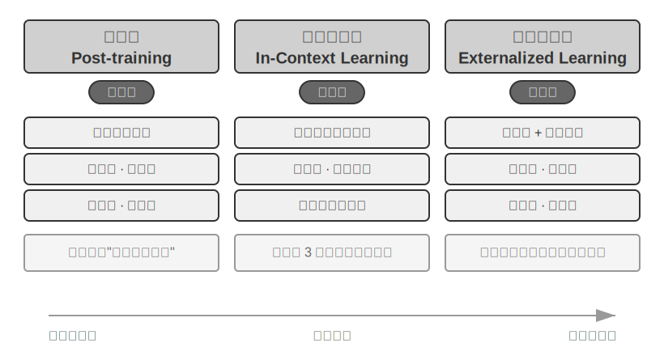
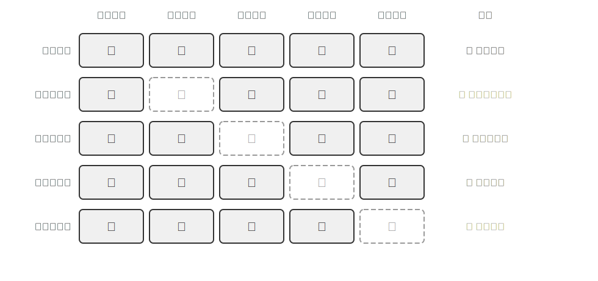
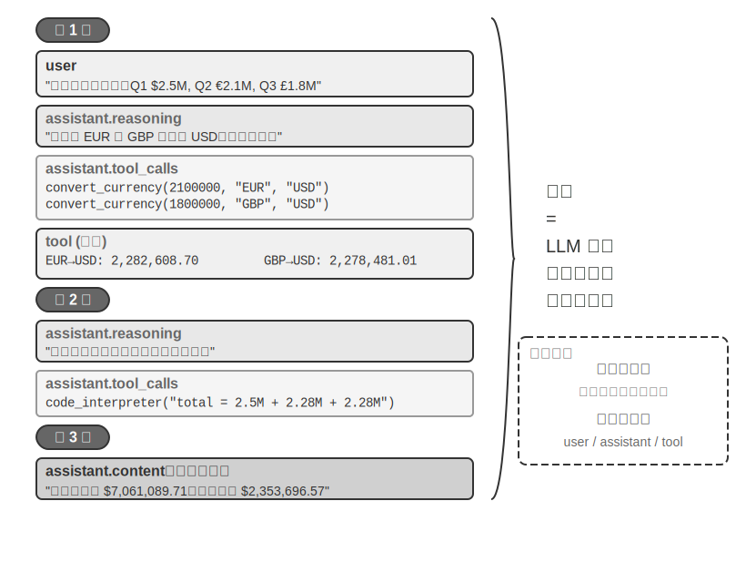
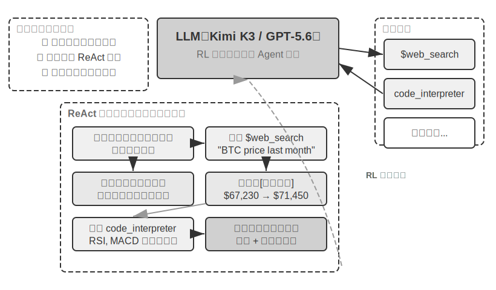
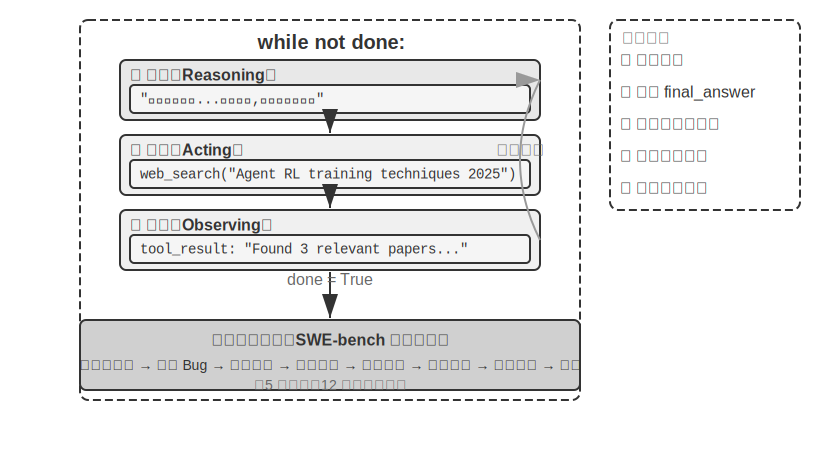

# AI Agent 入門

如果你用 Cursor 寫過程式碼，看它搜尋程式碼庫、編輯多個檔案、執行測試直到透過；用 Deep Research 調研過一個課題，看它反覆搜尋、閱讀，總結出一份完整報告；用 Manus 操控瀏覽器幫你完成線上任務；讓豆包手機助手幫你在手機上訂票、發訊息；或者讓 Pine AI 替你打電話給營運商協商降低帳單——你已經在使用 AI Agent 了。

這些產品的形態各異，但有一個共同點：它們不再是「你問一句、它答一句」的被動對話，而是能夠自主規劃執行步驟、呼叫各種工具完成任務，並根據結果不斷調整策略的智慧系統。AI Agent 正在成為我們與電腦互動的一種全新方式。

本章將帶你從實踐出發理解 AI Agent 的核心組成。我們將直接動手體驗現代 Agent 的能力，理解其背後的架構原理，掌握建構 Agent 系統的設計模式與最佳實踐。

> **閱讀提示**：本章是全書的概念地圖——它會快速引入 Agent 的核心公式、執行迴圈、工程框架和設計模式，為後續章節提供統一的術語和參照座標。初次閱讀時不必逐一記住所有概念，建議先建立整體印象；後續每一章都會展開講解本章提到的某一個方面，屆時可隨時回來對照。

## 現代 Agent = LLM + 上下文 + 工具

現代 Agent 系統的本質可以用一個簡潔的公式來表達：**Agent = LLM（大語言模型，Large Language Model）+ 上下文 + 工具**。這個公式簡潔而實用，但其中每個詞都需要做廣義的理解：

- **LLM 是 Agent 的大腦**：它不只是一組模型引數，而是 Agent 的整個決策核心——理解意圖、思考規劃、判斷。就像人類大腦不只是神經元的集合，還包括透過經驗塑造的思維方式，LLM 的能力也來自兩部分：**預訓練**所積累的世界知識與語言能力，以及**後訓練**所固化的決策策略——後者的具體技術（如監督微調與強化學習）將在第七章展開。
- **上下文是 Agent 的眼睛**：它不只是輸入給模型的那段文字，而是 Agent 在每個決策點能看到的全部資訊——環境資訊、使用者記憶、領域知識、自身狀態和任務進展。就像人類做決定時需要看清當前的狀況、回憶相關經驗、翻閱參考資料，Agent 的上下文視窗就是它當下能看到的一切。
- **工具是 Agent 的手腳**：它不只是幾個可呼叫的 API 函式，而是 Agent 能做的所有事情的集合——從預定義的工具呼叫到按需載入的專業技能（Skills），從動態生成程式碼創造新能力到委託子 Agent 協作，從主動與使用者溝通到響應外部事件。

換一種更直觀的說法：**Agent = 大腦 + 眼睛 + 手腳**。大腦負責思考和決策，眼睛提供思考所需的全部資訊，手腳將決策轉化為對現實世界的改變。

這三個元件恰好對應 RL（詳見第七章）中的三個核心概念。下面這張表格是**可選閱讀**——如果你沒有 RL 背景，完全可以跳過，不影響後續理解；它只是幫助有 RL 背景的讀者把已有知識和本書的術語對應起來：

| 直覺理解 | 實現元件 | 學術概念（可選） | 含義 |
|-----------|-----------|----------------------------|----------------------------------------------|
| **大腦** | LLM | **策略**（Policy） | Agent 決定「下一步做什麼」的決策邏輯——面對當前看到的資訊，從所有可選行動中挑出最合適的一個 |
| **眼睛** | 上下文 | **觀察空間**（Observation Space） | Agent 能看到的所有資訊——能看到什麼、讀到什麼、記住什麼、能訪問哪些系統 |
| **手腳** | 工具 | **動作空間**（Action Space） | Agent 能做的所有事情的集合——有哪些「手段」可用，從發訊息到執行程式碼再到操控介面 |

理解這三者的作用及其相互關係，是建構有效 Agent 系統的基礎。我們從最具體的手腳（工具）開始介紹，逐步深入到大腦（LLM）和眼睛（上下文）。先來看看不同型別的 Agent 如何在這三個維度上展開：

| Agent 產品 | 眼睛（感知） | 手腳（行動） | 策略 |
|----------------|----------------------|----------------------------|------------------------------|
| **Cursor 等 Coding Agent** | 需求文件、程式碼庫、終端機環境 | 開放式（內部思考、程式碼搜尋、檔案讀寫、執行命令等） | 增量開發：理解需求→搜尋相關程式碼→編輯程式碼→測試驗證→除錯修復 |
| **Deep Research 等搜尋 Agent** | 網路資源、學術資料庫、本地檔案 | 開放式（內部思考、搜尋查詢、網頁閱讀、摘要生成） | 迭代深化：根據已有資訊調整搜尋方向，逐步綜合出完整報告 |
| **Manus 等電腦操控 Agent** | 電腦螢幕、瀏覽器頁面、檔案系統 | 開放式（內部思考、點選、輸入、滾動、截圖、執行程式碼等） | 視覺感知+操作：觀察螢幕→識別目標元素→執行操作→驗證結果 |
| **豆包等手機助手 Agent** | 手機螢幕、已安裝的 App | 開放式（內部思考、點選、滑動、輸入、開啟 App 等） | 意圖理解+App 操控：理解使用者需求→定位目標 App→執行操作→確認完成 |
| **Pine AI 等個人辦事 Agent** | 使用者帳戶資訊、歷史帳單、服務商知識庫 | 開放式（內部思考、打電話、寄信、填表單、與使用者確認） | 多步驟任務執行：收集資訊→制定協商策略→聯絡服務商→談判→彙報結果 |

這些 Agent 系統有幾個共同特徵：它們都使用**開放式的動作空間**——不是從有限的幾個按鈕中選擇，而是能生成任意自然語言和程式碼；它們都能**內部思考**——在採取行動前先思考和規劃；它們都能**持續互動**——根據環境回饋不斷調整策略。這些能力正是來自大腦、眼睛和手腳——即 LLM、上下文和工具——的協同作用。

### 工具：Agent 的手腳

工具是 Agent 與外部世界互動的橋樑，就像人類的手腳一樣，讓 Agent 能夠從被動的觀察者變成主動的執行者。沒有工具，Agent 只能 「紙上談兵」；有了工具，它才能真正改變世界。

為了系統化地討論工具，可以根據 Agent 與外界互動的方向把工具分為五類。下面先快速過一遍每一類的代表場景，建立整體印象，後續章節會逐一展開。

**感知工具**讓 Agent 能訪問資訊：搜尋引擎提供即時網路資料，檔案系統讀取本地文件，API 和資料庫則對接外部服務和企業核心資料。

**執行工具**讓 Agent 改變世界：程式碼執行、檔案操作、系統命令、外部 API 呼叫——決策由此變成實際行動。

**協作工具**讓 Agent 與其他 Agent 分工合作：委託子 Agent 完成專項任務，在關鍵決策點請求人類確認，或在多 Agent 系統中協調行動。

**事件觸發工具**與前三類在呼叫方式上有本質的區別——它們不是 Agent 主動呼叫的，而是作為外部輸入來驅動 Agent 開始執行任務。比如收到一封新郵件、到了某個預定時間點、或另一個系統發出了 Webhook 回撥，這些事件會啟用 Agent，讓它開始後續的思考和行動。雖然事件觸發不是 Agent 主動呼叫的，但它是 Agent 與外部世界互動的通道之一，因此歸入廣義的工具體系。

**使用者溝通工具**是 Agent 主動與使用者建立連線、傳遞資訊的渠道。與執行工具改變外部世界不同，使用者溝通工具專注於資訊的傳遞和互動——透過文字訊息、語音通話、郵件等方式，將 Agent 的執行進展或主動關懷傳達給使用者。

以上五類工具的完整分類別本體系和設計原則將在第四章展開討論。工具設計的質量直接決定了 Agent 能走多遠——介面定義不清晰，模型就會亂用工具；錯誤處理位，工具一旦失敗就會變成 Agent 的死結；權限控制太寬泛，Agent 一旦出錯，後果就難以挽回。MCP（Model Context Protocol，模型上下文協定）標準的推廣，正在讓工具接入變得更像安裝外掛——生態在快速擴充套件，但設計原則不會過時。

**工具呼叫**（Tool Calling，也稱 Function Calling）是現代 LLM Agent 的一項核心能力，它讓模型能夠透過結構化的方式呼叫外部工具。這種能力將 LLM 從一個純粹的文字生成器轉變為能夠執行實際操作的智慧系統。本書後續統一使用「工具呼叫」這一術語。

工具呼叫的流程分為四步：首先，在上下文裡告訴模型有哪些工具可用（包括名稱、用途和引數）；然後，模型自主判斷要不要呼叫工具、呼叫哪個、傳什麼引數；接著，工具執行完畢後，結果被追加到上下文中；最後，模型據此決定下一步行動。這個迴圈就是後文要介紹的 ReAct 的基礎。

以一個查天氣的場景為例，四步流程在 API 層面的簡化表示如下：

```
第一步：宣告工具                    第二步：模型決定呼叫
tools: [{                          assistant: {
  name: "get_weather",               tool_calls: [{
  parameters: {                        function: "get_weather",
    city: "string"                     arguments: {city: "北京"}
  }                                  }]
}]                                 }

第三步：結果追加到上下文              第四步：模型基於結果回覆
tool: {                            assistant: {
  tool_call_id: "call_1",            content: "北京今天 28°C，晴。"
  content: '{"temp":28,"sky":"晴"}'  }
}
```

開發者只需要定義工具和執行工具呼叫，模型自主完成「要不要呼叫、調哪個、傳什麼引數」的決策。第二章將詳細展開這個 API 結構。

在為 Agent 設計工具時，應儘量保持工具的通用性，給 LLM 更大的發揮空間。例如，與其設計一個專用的計算器工具，不如提供一個 Python 程式碼直譯器，併為 Agent 建立一個安全的沙盒執行環境。與其設計一個記錄工作日誌的工具，不如提供檔案讀寫工具，併為 Agent 建立一個虛擬的檔案系統。通用的工具讓 Agent 能夠透過組合基礎能力來創造性地解決問題。

### LLM：Agent 的大腦

大語言模型（Large Language Model, LLM）是 Agent 的決策核心。收到使用者的請求後，它需要先解析真實意圖（使用者說的往往不是他真正想要的），再將模糊或複雜的任務拆解成可執行的步驟。執行過程中它還要持續判斷：下一步該做什麼、要不要呼叫工具、調哪個工具、傳什麼引數。這種「理解～規劃～執行」的能力來自預訓練所積累的知識，是工作流和自主 Agent 都依賴的基礎。

LLM Agent 的一個獨特能力是**內部思考**——在採取實際行動之前，Agent 可以先規劃與推演。這一過程不改變外部環境，卻能顯著提升後續行動的質量。LLM 之所以能夠進行有效的內部推演，得益於預訓練（Pre-training，即在海量網際網路文字上訓練，讓模型學會語言規律和世界知識）階段習得的能力——模型在推演時所遵循的是人類知識中已經沉澱下來的邏輯規則，包括數學定律、因果關係、問題分解策略等。因此 Agent 的推演不是盲目的隨機探索，而是在結構化的知識體系上展開。

這種結構化推演的能力，讓 LLM Agent 在面對全新任務時也能直接上手——下面透過零樣本和少樣本兩個概念分別說明。這種能力的直接體現是**零樣本泛化**（Zero-shot Generalization）：即使面對從未見過的任務，LLM Agent 也能透過組合已有知識來處理，無需任何示例。比如你從未教過它寫一首關於量子物理的詩，但它能根據已有的語言和物理知識生成一首像樣的作品。

更進一步，LLM Agent 還能透過極少的示例實現**少樣本適應**（Few-shot Adaptation）——只需在提示中給出兩三個示範例子，模型就能掌握一種新的任務模式。比如給它看幾條「使用者評論 -> 情感標籤」的例子，它就能學會對新評論做情感分類。簡單來說，零樣本是「沒有例子也能做」，少樣本是「看幾個例子就能學會」。

#### 模型即 Agent：當模型本身成為產品

「模型即 Agent」（Model as Agent）這一新正規化代表了 AI Agent 發展的最新方向。先進模型透過後訓練（特別是強化學習）將工具呼叫能力內化為原生能力：何時呼叫工具、調哪個、傳什麼引數，都由模型自己決定，無需人工編排。但這並不意味著框架層變得不重要了。恰相反，模型越強大，圍繞模型建構的 Harness 就越關鍵。Harness 這個詞原指馬具，即套在馬身上的韁繩與挽具，不是為了限制馬的奔跑能力，而是把這種力量引導到正確的方向上。換到 Agent 語境裡，模型是那匹強大但不可預測的馬，Harness 則是把它的能力引導成可靠任務執行的工程外殼。你也可以把它想象成賽車手周圍的整套保障系統：安全帶、賽道護欄、進站維修團隊。車手（模型）越快，這套系統越重要。在 Agent 中，Harness 包括上下文管理、工具介面、安全約束、驗證與糾正等基礎設施（詳見本章末節）。

模型自主決策的空間越大，出錯時的影響面也越大，因此需要更精細的約束、驗證和糾正機制來確保可靠性。模型廠商的真正優勢不是「讓框架變薄」，而是能對模型與外圍 Harness 進行協同最佳化，持續迭代。

但這裡懸著一個更深的問題：如果模型持續變強，今天這些 Harness 會不會最終被模型「吃掉」？Rich Sutton 在《苦澀的教訓》（The Bitter Lesson）中回顧了 AI 研究七十年間反覆上演的一幕[^ch1-1]：研究者一次次把自己對領域的理解編碼進系統，短期見效，長期卻總是輸給能隨算力與資料規模持續擴充套件的通用方法——搜尋與學習。以此衡量，Harness 裡的約束、驗證與糾正，有多少屬於「人的先驗」，註定會被模型內化？本書的立場是八個字：**方向認同，節奏務實**。方向上，本書不懷疑模型會持續吃掉 Harness——工具呼叫、長程規劃都曾靠外部編排，如今已是模型的原生能力；但在節奏上，這個「吃」遠比直覺慢：訓練以月計，模型也無法一次內化真實業務中所有的約束與偏好，模型此刻的能力邊界，就是 Harness 此刻的價值所在。因此 Harness 工程不是對苦澀的教訓的抵抗，而是這一教訓在工程時間尺度上的實踐：模型還做不穩的，Harness 先補上；模型每內化一層，Harness 就卸下一層，轉而兜底新的能力前沿。這條主線將貫穿全書——第二章從上下文工程的角度給出務實的回答，第八章討論 Agent 如何自己去發現知識與能力的結構，後記再回到「模型會不會吃掉 Harness」的完整答案。

[^ch1-1]: Sutton, Rich. "The Bitter Lesson", 2019. http://www.incompletenessideas.net/IncIdeas/BitterLesson.html

#### Agent 的學習機制：後訓練、上下文學習與外部化學習

前面討論了模型如何透過強化學習將工具呼叫的決策策略內化為原生能力。但 Agent 的學習不只發生在訓練階段——一些讀者一想到 Agent 從經驗中學習，就認為一定要訓練模型。事實上，後訓練並不是 Agent 從經驗中學習的唯一方法。Agent 的學習機制可以總結為三個互補的正規化（圖 1-1）：



- **後訓練（Post-training）**：透過強化學習將經驗固化到模型的引數中，提供最強的跨任務通用性，但更新成本高（詳見第七章）。
- **上下文學習（In-Context Learning）**：透過注意力機制（Attention Mechanism，即模型在處理輸入時決定「關注哪些資訊」的機制）在上下文中進行模式檢索式的快速適配。比如在提示詞中給模型看幾條客服對話的處理示例（如「使用者投訴→安撫+補償方案」），它就能用類似的方式處理新的客服對話——這就是上下文學習。能快速適應但臨時性強，會話結束就消失了。需要說明的是，雖然名字叫「學習」，但它的內部機制更接近**模式匹配而非真正的學習**。打個比方：如果給你看三道相同型別的數學題和答案，然後給你第四道，你大機率能照葫蘆畫瓢做出來——這就是上下文學習在做的事。但如果第四道題需要一種全新的解題思路，光看前三道題的答案是不夠的。換句話說，上下文學習讓模型能**套用已見過的模式**，但不能**發現全新的規律**——這一點與後訓練有本質區別（第二章將從注意力機制的角度詳細展開這個論斷）。
- **外部化學習（Externalized Learning）**：將知識和流程外部化為知識庫與可執行的工具程式碼，兼具永續性和可解釋性。

這三種正規化在不同的時間尺度上互補：後訓練提供基礎能力，上下文學習實現快速適應，外部化學習確保可靠性和效率。第八章將系統地比較三種正規化的協同關係。

打個比方：後訓練像是系統性學習教科書——學完後能力永久提升，但學習成本高；上下文學習像是臨場查閱參考資料——有資料就能做好，合上就忘；外部化學習像是整理個人筆記本——資訊持久儲存且隨時可查，但需要專門整理。

### 上下文：Agent 的眼睛

上下文是 Agent 在每個決策點能看到的全部資訊。就像一個人在做決策時需要看到桌上攤開的所有資料——任務說明、參考手冊、之前的溝通記錄、最新的資料——Agent 的上下文視窗就是它的「視野」。從 API 的視角看（詳見第二章），每次呼叫 LLM 時的上下文由以下五個部分構成：

- **系統提示詞**（System Prompt）：與使用者每次輸入的提示詞不同，系統提示詞由開發者編寫，在整個對話過程中保持不變，相當於 Agent 的「崗位說明書」——定義它的身份、權限和行為準則。透過提示工程（Prompt Engineering）精心設計系統提示詞，我們可以塑造 Agent 的工作方式。系統提示詞中還會包含跨會話儲存的**使用者記憶**（使用者偏好、歷史行為、背景設定等個人化資訊，詳見第三章）和動態注入的環境狀態。
- **工具定義**（Tool Definitions）：宣告 Agent 可用工具的名稱、功能描述和引數格式。沒有工具定義，Agent 就無法識別和呼叫任何工具——消融實驗（實驗 1-1）將驗證這一點。工具定義與系統提示詞一起構成對話中保持不變的**靜態字首**（這是基礎模式；2026 年以來，生產框架中工具的完整 schema 也可以按需動態載入到上下文末尾而不破壞字首，詳見第二章工具定義一節和第四章）。
- **使用者訊息**（User Messages）：來自使用者的輸入。使用者訊息中還可能包含透過 RAG（檢索增強生成，Retrieval-Augmented Generation，詳見第三章）動態檢索引入的**外部知識**——覆蓋訓練資料截止後的資訊或私有領域知識。
- **模型回覆**（Assistant Messages）：模型之前生成的回覆，最多包含三個部分——思考過程（`reasoning`，即內部思考鏈，保持思維連貫性和決策可解釋性）、文字內容（`content`，即對使用者的回覆）和工具呼叫請求（`tool_calls`，即 Agent 採取行動的方式）。在一次具體的回覆中，三者不一定同時出現：例如 Agent 決定呼叫工具時通常只有 `reasoning` + `tool_calls`，給出最終回答時通常只有 `reasoning` + `content`。
- **工具執行結果**（Tool Results）：Agent 框架執行工具後返回的結果。這些結果是 Agent 下一步思考的直接依據，也讓它能夠從執行結果中學習、避免重複犯錯。

前兩項（系統提示詞 + 工具定義）是靜態字首，後三項（使用者訊息 + 模型回覆 + 工具執行結果）是隨互動不斷增長的動態訊息歷史。這五個部分共同構成了 LLM 每次推理時的上下文。

要驗證每個元件是否都不可或缺，最直接的方法是**消融實驗**（Ablation Study）：就像醫生診斷時逐一排除病因——先去掉 A 元件看系統是否還正常，再去掉 B 元件，以此類推，從而判斷每個元件的貢獻。實驗 1-1 正是按這個思路對上述五個元件做了系統性測試，結果表明：去掉工具定義，Agent 完全喪失行動能力；缺少工具執行結果時，由於看不到上一步的回饋，Agent 會反覆呼叫同一個工具，陷入無限迴圈；模型回覆中的思考過程一旦被剝離，前後決策就開始互相矛盾；至於歷史訊息，沒有它 Agent 等於失憶，於是從頭開始整個任務流程，重複執行已完成的步驟。每個元件的作用都有實驗證據支撐，而不只是理論推斷。

### 實驗 1-1 ★★：上下文的關鍵作用

透過系統性的**消融實驗**（Ablation Study），我們探索了不同上下文元件對 Agent 行為的影響。實驗從上述五個部分中選取了四個元件測試——系統提示詞作為 Agent 的基本身份定義不參與消融，因為沒有系統提示詞，Agent 連基本的角色認知都沒有，測試沒有意義。如圖 1-2 所示，五組對照實驗包括：一組保留全部元件的完整基線，再加上四組各缺失一個元件的對照，以此觀察每個元件對 Agent 效能的影響。



實驗結果揭示了每個上下文元件不可替代的作用。**工具定義**（Tool Definitions，靜態字首的一部分）是 Agent 行動能力的基礎，沒有它，Agent 就無法識別和呼叫任何工具。**工具執行結果**（Tool Results）是閉環控制的關鍵，缺失它會導致 Agent「盲目」執行，陷入無限迴圈。**思考過程**（模型回覆中的 reasoning 部分）保留了 Agent 做出之前決策的原因，使思維流程更加連貫，避免做出前後矛盾的決策。**歷史訊息**（之前輪次的使用者訊息、模型回覆和工具執行結果）則防止了冗餘操作，保持任務執行的連貫性，避免重複犯同樣的錯誤。

這個實驗的關鍵洞察是：**上下文決定了 Agent 能看到什麼，而 Agent 只能基於它看到的資訊做決策**。就像一個人矇住眼睛就無法做出合理判斷一樣，缺失任何一個上下文元件，Agent 的決策能力都會嚴重退化——看不到工具定義就不知道有哪些工具可用，看不到之前的執行結果就不知道已經做過什麼。

### ReAct 迴圈

瞭解了 Agent 的三大元件後，一個自然的問題是：它們如何協同工作？ReAct 迴圈就是將 LLM、上下文和工具串聯起來的核心機制——讓我們看看一個 Agent 是如何一步步思考和行動的。

Agent 執行任務的核心模式叫做 **ReAct**（Reasoning + Acting）。雖然名字只體現了思考（Reasoning）和行動（Acting）兩個詞，但實際迴圈包含三個環節：模型先**思考**當前應該做什麼，然後呼叫工具**行動**，再**觀察**工具返回的結果並繼續思考下一步。這個「想→做→看→想→做→看」的迴圈不斷重複，直到任務完成。

讓我們透過一個多幣種收入彙總的具體例子來理解 Agent 的**軌跡**（trajectory）。軌跡是 Agent 在執行任務過程中不斷積累的訊息歷史——使用者訊息、模型回覆（包括思考過程和工具呼叫）、工具執行結果。每一次呼叫 LLM 時，它接收的完整上下文由**靜態字首**（系統提示詞 + 工具定義）和**軌跡**（動態訊息歷史）兩部分組成（圖 1-3）。這揭示了一個關鍵事實：**Agent 的上下文 = 靜態字首 + 軌跡**。具體地說，靜態字首對應前文五個元件中的前兩項（系統提示詞 + 工具定義），軌跡對應後三項（使用者訊息 + 模型回覆 + 工具執行結果，隨互動不斷增長）。基於這個完整上下文，LLM 生成下一步的響應，然後這個響應又追加到軌跡中，供下一次呼叫使用。



讓我們透過虛擬碼來理解 Agent 軌跡的結構：

```
軌跡 = [
  {role: “user” , content: “根據公司季度收入：Q1 2.5M 美元，Q2 2.1M 歐元，Q3 1.8M 英鎊，Q4 380M 日元，計算公司年度總收入和季度平均收入” },
  
  # 第一次迭代 - LLM 看到上述軌跡，生成響應
  {role: “assistant” , 
   reasoning: “需要將所有貨幣轉換為 USD...” ,
   content: “” ,  # 沒有直接回複使用者
   tool_calls: [
     {name: “convert_currency” , args: {amount: 2100000, from: “EUR” , to: “USD” }},
     {name: “convert_currency” , args: {amount: 1800000, from: “GBP” , to: “USD” }},
     {name: “convert_currency” , args: {amount: 380000000, from: “JPY” , to: “USD” }}
   ]},
  
  # Agent 框架執行工具，新增結果到軌跡
  {role: “tool” , content: “EUR->USD: 2282608.7” },
  {role: “tool” , content: “GBP->USD: 2278481.01” },
  {role: “tool” , content: “JPY->USD: 2541806.02” },
  
  # 第二次迭代 - LLM 看到完整軌跡，包括工具結果
  {role: “assistant” ,
   reasoning: “已獲得轉換結果，現在需要彙總計算...” ,
   content: “” ,
   tool_calls: [
     {name: “code_interpreter” , args: {code: “total = 2500000 + 2282608.7 + ...” }}
   ]},
  
  {role: “tool” , content: “Total: $9,602,895.73, Average: $2,400,723.93...” },
  
  # 第三次迭代 - LLM 看到完整軌跡，生成最終答案
  {role: “assistant” ,
   reasoning: “所有計算完成，總結結果...” ,
   content: “FINAL ANSWER: 總收入$9,602,895.73...” }
]
```

注意，軌跡中沒有顯示系統提示詞和工具定義——它們作為靜態字首，在每次 LLM 呼叫時都會被自動拼接在軌跡前面。

在我們的實驗中，這個迴圈展現得淋漓盡致。第一輪，Agent 分析任務後並行呼叫三個貨幣轉換工具；第二輪，基於轉換結果呼叫程式碼直譯器進行復雜計算；第三輪，確認所有計算完成後生成最終答案。整個過程僅用了 3 次迭代、4 次工具呼叫就完成了複雜的多步驟任務。

這種設計的精妙之處在於**上下文的累積性**。每次 LLM 呼叫都能看到完整的軌跡，這讓它能夠理解當前處於任務的哪個階段、之前嘗試了什麼、得到了什麼結果。就像人類解決問題時會不斷回顧和總結，Agent 透過軌跡保持著對整個任務的全域性認知。同時，軌跡的結構化特性也讓系統具有高度的可解釋性和可除錯性：使用者訊息、模型回覆（思考過程 + 工具呼叫）和工具執行結果都被清晰地區分開來。

軌跡不僅是執行的記錄，更是 Agent 能力的體現。透過分析大量的軌跡，我們可以發現 Agent 的行為模式、最佳化決策路徑、改進工具設計。軌跡資料甚至可以總結到知識庫中，或者透過強化學習來訓練更好的 Agent 模型，實現從經驗中學習的閉環最佳化。


理解了 Agent 的執行迴圈後，讓我們透過兩個實驗來感受不同模型如何驅動這個迴圈。

#### 實驗 1-2 ★：Kimi K3 原生 Agent 能力

這個實驗展示了 **Kimi K3** 的原生 Agent 能力，體現了「模型即 Agent」的新正規化。Kimi K3 由 Moonshot AI 於 2026 年釋出，是約 2.8 兆引數的混合專家（MoE, Mixture of Experts）模型——可以把 MoE 想象成一個專家團隊：面對不同型別的問題，系統會自動選擇最合適的幾位專家來作答，而不需要所有專家同時上陣，這樣既保證了能力又提高了效率。它擁有 100 萬 token 的上下文視窗、原生的視覺理解能力，以及始終開啟的「思考模式」（thinking mode）；模型透過強化學習訓練，將工具呼叫的**決策策略**內化為原生能力——何時呼叫工具、呼叫哪個、傳什麼引數都由模型自主決定，從而能夠自主完成網路搜尋等任務。需要說明的是，被內化的是「何時呼叫、如何呼叫」的決策，而 `web_search`、`code_runner` 等工具本身仍作為 API 層面的內建工具在服務端執行（Kimi 透過名為 Formula 的服務端指令碼引擎執行這些官方工具）。

關鍵觀察包括：模型透過 RL 訓練自然地學會了何時以及如何使用工具，用戶端無需再人工編寫工具呼叫的編排邏輯；模型自己決定何時搜尋、搜尋什麼，展現了真正的自主性；它能根據搜尋結果動態調整策略，自主判斷資訊是否充足。這裡需要釐清一個常見的誤解，關鍵在於分清兩件事的歸屬。**強化學習賦予模型的是決策能力**——何時該呼叫工具、呼叫哪個、傳入什麼引數、拿到結果後是否繼續、如何把幾十上百次呼叫串聯成連貫的推理，這些「用不用、怎麼用」的判斷被寫進了模型引數。**而工具本身及其執行則由 Agent 框架（或 API 內建工具）提供**——`web_search`、`code_runner` 的真實實現、程式碼沙盒環境、呼叫的發起與結果回傳，都在模型之外的基礎設施裡完成。RL 最佳化的是決策策略，而不是把搜尋引擎或程式碼沙盒「裝進」模型的權重。因此編排迴圈並沒有消失，而是從用戶端移到了服務端，同時決策權交給了模型[^ch1-2]。

[^ch1-2]: 感謝讀者 asdlem 透過 GitHub Issue #30 指出並釐清了「RL 內化的是工具呼叫決策策略、而非工具執行機制」這一區分。參見 https://github.com/bojieli/ai-agent-book/issues/30

Kimi K3 在 Agent 任務中的一個突出優勢是**長鏈工具呼叫的穩定性**——它能夠連續執行 200～300 次工具呼叫而保持思考的一致性，遠超多數模型在數十次呼叫後就開始退化的表現。K3 面向長週期程式設計與 Agent 工作負載最佳化，釋出時提供 K3 Max（面向對話與 Agent 任務）與 K3 Swarm Max（面向大規模並行處理）兩個規格。作為開源模型，它在軟體工程和 Agent 基準測試中展現了可與頂尖閉源系統比肩的效能，證明了透過強化學習賦予模型原生 Agent 能力這條路線的有效性。

#### 實驗 1-3 ★：GPT-5.6 原生 Deep Research 能力

第二個實驗使用 **OpenAI GPT-5.6**，展示先進模型如何藉助 API 內建工具，在服務端把 Deep Research 的「搜尋—閱讀—分析」編排迴圈閉環起來。GPT-5.6 提供了三種規格——Sol（旗艦前沿模型）、Terra（面向日常工作的均衡模型）和 Luna（快速經濟的輕量模型），均把工具呼叫的決策交由模型原生完成，用戶端無需自行搭建編排框架。一個便利的特性是**自由格式工具呼叫**（Freeform Tool Calling）——傳統方式中，模型呼叫工具時必須把所有引數打包成嚴格的 JSON 格式（一種結構化的資料格式），這就像填表格一樣有很多格式限制。自由格式工具呼叫（在 API 中透過 `type: "custom"` 的工具型別宣告）允許模型直接向工具傳送原始文字（比如一段 Python 程式碼、一條 SQL 查詢），省去了 JSON 轉義的麻煩。要說明的是，這是 API 引數格式的演進，而非模型架構的革新——用戶端的工具呼叫迴圈（偵測 `tool_calls` → 執行 → 回傳結果）邏輯保持不變，改變的只是引數從 JSON 字串變成了原始文字。GPT-5.6 還引入了 Verbosity 引數（控制輸出的詳略程度）和 Reasoning Effort 引數（調整思考的深度，Sol 新增了 max 檔位以獲得最充分的推理時間），使開發者能根據任務的複雜度精細控制模型行為。

GPT-5.6 配合 Responses API 的**網路搜尋和程式碼直譯器**內建工具——這正是 Deep Research 的核心：模型能夠自主搜尋網路獲取即時資訊，並編寫程式碼分析，實現「搜尋 -> 閱讀 -> 分析 -> 再搜尋」的迭代研究過程。例如，面對 「東協 10 國首都之間，最近的一對首都距離多少」 這樣的問題，GPT-5.6 會自動搜尋各國首都的地理座標，然後編寫 Python 程式碼計算所有首都對之間的大圓距離，最終找出最近的一對。又如 「搜尋最近一個月的位元幣走勢，做技術分析」 任務中，它能從多個金融資料來源獲取即時價格資料，運用專業的技術分析庫計算移動平均線、RSI、MACD 等技術指標，生成視覺化圖表並給出交易建議。

GPT-5.6 將 **OpenAI Deep Research** 產品的設計理念內化到了模型層面，引入了**意圖澄清過程**。當使用者提出研究需求後，GPT-5.6 不會立即動手執行，而是首先透過一系列問題來澄清使用者的真實意圖。以「搜尋最近一個月的位元幣走勢，做技術分析」為例，它會先問：「您偏好使用哪個資料來源？需要分析哪些技術指標？」透過這種互動式的意圖澄清，GPT-5.6 能夠生成更精準、更符合使用者需求的研究報告。

GPT-5.6 是「模型即 Agent」概念的一個成熟例項——網路搜尋、程式碼直譯器等作為 Responses API 的內建工具在服務端閉環執行，編排迴圈從用戶端移到了 API 服務端，從而簡化了用戶端實現；模型仍然輸出標準的工具呼叫，只是用戶端不必再自行搭建「搜尋—閱讀—分析」的編排框架。其中最值得關注的是意圖澄清機制：模型不會一收到任務就立即執行，而是先透過提問來確認使用者的真實需求，再製定研究策略。這讓「使用者說了什麼」和「使用者真正想要什麼」之間的差距，在任務執行之前就得到了彌合。

圖 1-4 展示了「模型即 Agent」正規化下原生工具呼叫的完整架構，以及 Kimi K3 / GPT-5.6 在實際任務中的 ReAct 執行過程。




## Harness 工程：模型之外的競爭力

到這裡你已經理解了 Agent 的核心工作原理——LLM 透過 ReAct 迴圈，在上下文的輔助下使用工具完成任務。前面的實驗證明了這套基本機制是有效的，但同時也暴露了明顯的脆弱點：模型可能產生幻覺（編造不存在的工具或引數）、選錯工具、或在遇到錯誤時無法自我恢復。一個能跑的 Demo 和一個可靠的產品之間還有巨大的鴻溝，而這些脆弱點正是 Harness 工程要解決的問題。本章前半部分回答了 Agent 是什麼，下半部分回答 Agent 如何在生產環境中可靠執行。

前面幾節建立了 **Agent = LLM + 上下文 + 工具** 的核心公式。這個公式描述了 Agent 的**內部組成**，即大腦、眼睛、手腳分別由什麼承擔。從 Harness 工程的視角看，還需要一個**工程實現**層面的視角：把 LLM 當作一個處理器核元件（Model），圍繞它建構的所有支撐程式碼統稱為 Harness。兩個視角並非替代關係，而是不同抽象層次上對同一系統的描述。之所以換用更通用的 「Model」 一詞，是因為 Harness 工程的原則適用於任何具備推理和工具呼叫能力的模型，不限於某種特定模型型別。Harness 的核心就是原公式中的「上下文 + 工具」，再加上三層保障機制：**約束**（限定 Agent 能做什麼、不能做什麼）、**驗證**（檢查 Agent 做得對不對）和**糾正**（做錯了怎麼補救）。

用方程展開生產形態下的完整組成：

> **Agent = LLM + [上下文 + 工具 + 約束 + 驗證 + 糾正] = Model + Harness**

最小可工作的 Agent 只需要 LLM、上下文與工具就能跑起來；而要讓它在生產環境中長期可靠運轉，還需要補全約束、驗證、糾正這三層工程外殼——約束防止越界、驗證發現錯誤、糾正恢復異常。這三層機制不是新增的「獨立模組」，而是圍繞「上下文 + 工具」建構的保障層。換句話說，最小公式是 Demo 視角，擴充套件公式是生產視角；後者完全包含前者，並在外圍加了一圈安全網。

舉個例子幫助理解：上下文中嵌入退款政策是「上下文」的範疇，而校驗退款金額不超過訂單金額則屬於「約束」；工具執行 API 呼叫是「工具」的範疇，而 API 超時後自動重試則屬於「糾正」。模型提供基礎的理解和推理能力，而 Harness 將這些能力引導、約束和放大為可靠的任務執行。設計和最佳化這套模型之外的基礎設施的工程實踐，就是 **Harness 工程**（Harness Engineering）。

用一個具體的例子來理解 Harness 的價值。假設你讓一個 Agent 幫使用者退掉 3 天前的訂單。**沒有 Harness 時**：模型看不到退款政策（缺上下文），不知道該調哪個 API（缺工具），直接編造一個退款結果回覆使用者（缺驗證），使用者發現退款根本沒發生（缺糾正）。**有了 Harness 後**：系統提示詞寫明瞭 7 天退款政策（上下文），Agent 呼叫 `query_order` 和 `process_refund` 工具完成操作（工具），框架校驗退款金額不超過訂單金額（約束），校驗資料庫狀態確認退款成功（驗證），如果 API 呼叫超時則自動重試（糾正）。同一個模型，有無 Harness，結果天壤之別。

回到本章前面給出的馬具隱喻：沒有 Harness 的模型就像脫韁的野馬，能力驚人，但無法可靠地完成任務。

更精確地說，模型之外的全部基礎設施都屬於 Harness。Harness 的核心是上下文與工具，圍繞它們建構了三類工程化保障機制：

| 功能 | 一句話職責 | 與上下文/工具的關係 |
|--------------------|----------------------------------------|-----------------------------------|
| **Context（上下文）** | 為模型提供感知資訊 | 核心能力 |
| **Tools（工具）** | 為模型提供行動手段 | 核心能力 |
| **Constrain（約束）** | 設定行為邊界——能做什麼、不能做什麼 | 圍繞上下文和工具建構的安全邊界 |
| **Verify（驗證）** | 自動判斷操作結果的對錯 | 圍繞工具執行結果建構的檢查機制 |
| **Correct（糾正）** | 發現問題時自動修正或回退 | 圍繞工具呼叫失敗建構的恢復機制 |

上下文與工具讓 Agent 「能做事」——理解任務並採取行動；約束、驗證與糾正讓 Agent 「不做錯事」——它們不是獨立於上下文和工具之外的東西，而是確保上下文和工具在生產環境中可靠運轉的工程實踐。在 Agent 產品的成熟度曲線上，兩者的重要性是不對稱的。

早期的 Agent 框架主要關注上下文與工具：給模型工具、給模型上下文，讓它「能做事」。而生產級 Agent 系統的重心已經轉向約束、驗證與糾正：確保工具呼叫是安全的、上下文是經過管理的、錯誤是可恢復的。

以 Claude Code 為例，它的 Harness 中絕大部分程式碼都是約束、驗證與糾正，而非上下文與工具——工具本身（檔案讀寫、命令執行、搜尋）只是一小部分，而圍繞這些工具建構的保障機制才是真正的核心。這些機制包括：

- **流程狀態管理**：追蹤 Agent 當前執行到哪一步
- **多層上下文壓縮**：當資訊太多時自動精簡
- **權限分類**：控制哪些操作需要使用者確認
- **熔斷器**（Circuit Breaker）：當錯誤連續發生時自動「斷電」停止重試——就像家裡電路短路時保險絲會自動跳電，防止整個系統崩潰
- **錯誤恢復機制**：捕獲異常、回滾到上一穩定狀態、重試或交還給人類

**產業正在從「能做事」向「可靠地做事」轉變，Harness 工程因此成為 Agent 系統的核心競爭力。**

### 從提示工程到 Loop 工程：工程正規化的演進

回顧 AI 應用工程的發展，可以看到一條清晰的演進弧線：

**軟體工程**（Software Engineering）是基礎——傳統的系統設計、架構、測試和部署實踐。**提示工程**（Prompt Engineering）是第一波創新——透過最佳化輸入給模型的自然語言指令來提升輸出質量。**上下文工程**（Context Engineering）是第二波——人們認識到單純最佳化提示詞還不夠，需要系統性地管理模型能看到的所有資訊（系統指令、工具定義、對話歷史、外部知識）。**Harness 工程**是第三波——它將視野從「模型能看到什麼」進一步擴充套件到「模型在什麼樣的系統中執行」，涵蓋了約束機制、驗證手段、回饋迴圈和錯誤恢復等模型之外的全部基礎設施。最新的一波是 **Loop 工程**（Loop Engineering）——它把視野從單次執行再擴充套件到跨輪次的持續自主運轉：誰來發現下一件該做的事、何時驗證、何時才算真正完成（第十章將結合多 Agent 協作系統展開）。

這五個階段不是替代關係，而是層層包含的：提示工程是上下文工程的子集，上下文工程是 Harness 工程的子集，Harness 工程是 Loop 工程的子集。每一層都在前一層的基礎上擴充套件了工程師的關注範圍和影響力。**當各家模型的能力越來越接近、不再是決定性的差異因素時，競爭優勢就轉移到了模型之外的工程實踐**。這一判斷在最近的工程實踐中得到驗證——LangChain 在 Terminal Bench 2.0（一個評估 Agent 在終端機環境中完成複雜任務能力的基準測試）上的實踐就是有力的例證：他們的 Coding Agent 從 52.8% 提升到 66.5%（從排行榜 30 名開外躍升至前 5），改變的不是模型，而是 Harness：讓 Agent 自動檢查自己的執行結果、偵測是否陷入了重複迴圈、最佳化思考策略等工程手段。OpenAI 的工程團隊也公開分享了類似的經驗——3 名工程師用 5 個月完成了約百萬行程式碼和近 1500 個 PR，達到傳統開發速度的約 10 倍。這一效率的背後不是模型有多強，而是 Harness 做對了。

### Harness 五個功能的核心原則

上面的表格列出了 Harness 的五個功能。下表進一步展開每個功能的核心設計原則和在本書中的對應章節，幫助讀者建立從概念到實踐的對映：

| 功能 | 核心原則 | 實際例子 | 詳見 |
|------|-----------------------------------------------|-----------------------------------|-------|
| **上下文** | 資訊充分性：讓 Agent 在每個決策點都基於足夠的資訊判斷 | 系統提示詞、知識庫、Agent 狀態列、Sidecar 旁路查詢 | 第二、三章 |
| **工具** | 介面清晰：工具命名直觀、引數有例子、邊界有說明 | MCP 工具、程式碼直譯器、搜尋工具 | 第四章 |
| **約束** | 故障安全預設值：所有能力預設關閉，必須顯式開放（類似手機 App 權限管理） | Claude Code 中每個工具預設需要使用者授權才能執行 | 第四章 |
| **驗證** | 輸入隔離：安全檢查只看結構化資料（如工具返回的 JSON 欄位），而不是模型自由生成的文字（因為攻擊者可能透過提示注入操縱模型輸出） | Linter 檢查、型別系統、工具呼叫結果校驗 | 第五、六章 |
| **糾正** | 在確認無法恢復之前，不暴露中間態（例如工具呼叫失敗時先靜默重試，不將半成品結果展示給使用者） | 靜默重試、接續生成、連續失敗時回退到人工判斷（熔斷機制） | 第二、五章 |

五個功能構成一個閉環：上下文與工具支撐決策，約束預防錯誤，驗證發現偏差，糾正閉合迴圈。缺少任何一個環節，系統都會出現可靠性缺口。在深入具體的編排模式和護欄設計之前，我們先明確建構 Agent 的核心原則和模型選擇策略——它們是後續所有設計決策的基礎。


### 建構有效 Agent 的核心原則

根據 Anthropic 的經驗，成功的 Agent 系統遵循三個核心原則。

**保持簡單**。從最簡單的方案開始，只在確實必要時才增加複雜度。直接的 API 呼叫優於複雜的框架，清晰的程式碼優於聰明的抽象。因為每多一層抽象都會成為以後除錯時新的盲區。

**保持透明**。明確顯示 Agent 的規劃步驟、執行日誌和決策軌跡——這不只是為了除錯方便，也是讓使用者建立信任的前提。因為黑箱裡的錯誤一旦發生，外部觀察者既無法定位也無法糾正。

**設計好工具介面（ACI，Agent-Computer Interface）**。ACI 強調的是從 Agent 視角設計介面（讓 Agent 容易理解和使用），而非傳統 API 從程式設計師視角設計介面。工具的命名和引數要直觀，容易誤用的地方要主動防呆，從設計上讓錯誤無法發生——比如 USB 介面只能從一個方向插入，就避免了使用者插反的錯誤。這種「用設計消除錯誤」的思路在製造業裡有一個專門的術語，叫**防呆**（Poka-yoke），源自豐田生產體系。設計不好的工具會讓再強的模型也頻繁出錯——因為模型與工具之間唯一的溝通通道就是介面本身，模糊的介面會被模型放大成系統性的錯誤。

以下三節展開 Harness 工程中三個獨立但重要的主題：模型選型、編排模式、護欄與安全性。它們都不屬於 Harness 五要素本身，但是工程實踐中繞不開的決策。

### 如何選擇模型

在討論編排模式之前，先回答一個實操問題：應該選什麼樣的模型來驅動 Agent？

模型是 Agent 的智慧基座，選對模型往往比最佳化提示詞更有效。由於模型迭代極快，本節不推薦具體的模型版本，而是提供一些選擇的方向。

**認識 「御三家」。** 目前 Agent 開發中最常用的三大閉源模型廠商是 OpenAI（GPT/o 系列）、Anthropic（Claude 系列）和 Google（Gemini 系列）。它們各有側重：Claude 在複雜推理、程式設計和工具呼叫方面表現突出，是目前 Agent 開發的熱門選擇；Gemini 擁有超長上下文視窗和強大的多模態能力，適合長文字與圖片、影片等多媒體場景；GPT/o 系列各方面能力均衡，使用者數量最多。選模型時不要只看排行榜，**要在你自己的任務上做評估**（見第六章）。

**國內模型。** 如果你的應用部署在國內或有較嚴格的成本預算，國內模型是務實的選擇。位元組跳動的豆包系列國內延遲極低，適合即時互動；月之暗面的 Kimi 是國內 Agent 能力較強的模型；Qwen 和 DeepSeek 等開源模型則在成本和可定製性方面有優勢。不同模型在工具呼叫方面的能力差異很大，選型前務必在具體場景中測試。國內模型通常透過火山引擎（豆包）、矽基流動（開源模型）等平臺的 API 訪問，海外模型則可以透過 OpenRouter 統一訪問。

**開源與閉源。** 閉源模型通常在能力上領先，但成本較高且受限於廠商的 API 策略。開源模型成本低、可私有化部署、支援微調定製，適合對成本敏感或有資料合規要求的場景。

**絕大多數 Agent 需要支援思考（Reasoning）的模型。** Agent 需要進行多步思考、工具選擇等複雜決策，不帶思考能力的模型在這些任務上表現往往很差。只有極少數場景例外——比如只執行單步簡單任務、或 Computer Use 中僅需點選固定位置的簡單 GUI 操作——此時不帶思考的模型也能勝任。但只要涉及多步思考或動態決策，就一定要選擇支援思考的模型。

**關注輸出速度和多模態能力。** 除了成本，還有兩個容易被忽視的維度。一是**輸出 token 的速度**：Agent 往往需要多輪推理，每輪都要等待模型輸出完成才能執行下一步，所以輸出速度直接決定了端到端的響應延遲——如果一個 Agent 任務需要 20 輪推理，每輪慢 2 秒就意味著總共多等 40 秒。二是**多模態支援**：如果你的 Agent 需要理解圖片、音訊或影片，多模態能力就是硬性要求，不同模型在這方面的差異很大。


### 編排模式：工作流與自主

編排模式是 Harness 中「上下文與工具」層面的組織方式——它決定了上下文如何在 LLM 呼叫之間流動、工具如何被排程、以及 Agent 的執行路徑是預先設定還是動態生成。Agent 系統的編排方式經歷了從簡單到複雜的演進過程，每種模式都有其適用的場景和需要權衡的取捨。根據 Anthropic 與數十個團隊合作建構 LLM Agent 的經驗，最成功的實現往往不是使用複雜的框架，而是採用簡單、可組合的模式。

在建構 LLM 應用時，應遵循「從簡單到複雜」的原則：首先考慮單個 LLM 呼叫——如果透過最佳化提示詞和上下文示例就能解決問題，就不要引入 Agent 系統；當需要多步驟處理時，對於可以清晰分解為固定子任務的場景，考慮使用工作流；只有當需要動態決策和靈活的執行路徑時，才使用自主 Agent。需要記住的是：Agent 系統通常會用延遲和成本換取更好的任務效能，應該謹慎權衡這種交換是否值得。

#### 工作流模式：確定性的編排

**工作流**（Workflow）是透過預定義的程式碼路徑來編排 LLM 和工具的系統。它的執行路徑是確定性的，由開發者預先設計好——每一步做什麼、下一步去哪裡，都是程式碼寫死的，LLM 只在每個節點內部負責理解和生成。

以一個訂機票 Agent 為例，工作流可以設計為四個固定節點：

1. **核實使用者身份**——呼叫身份驗證 API，確認使用者是誰
2. **搜尋可用航班**——根據使用者需求查詢航班資料庫
3. **完成付款**——呼叫支付介面扣款
4. **確認預訂**——呼叫預訂 API 鎖定座位，向使用者傳送確認資訊

每個節點內部可以使用 LLM（例如用自然語言理解使用者的出行需求），但節點之間的流轉順序是程式碼固定的——系統不會在付款完成之前去預訂座位，也不會在身份核實之前開始搜尋航班。

工作流模式有兩個核心優勢。第一是**嚴格的流程控制**：開發者可以確保關鍵步驟不被跳過或亂序執行，例如「付款前不能預訂」這類業務規則透過程式碼強制執行，不依賴 LLM 的判斷。第二是**安全性**：由於執行路徑是確定的，提示注入或模型犯錯最多隻能影響當前節點內部的處理，無法讓 Agent 跳到不該執行的分支——攻擊面被限制在單個節點內。

工作流的主要侷限是**缺乏變通性**。當出現預設流程未覆蓋的情況時（例如使用者在付款環節臨時想改簽、或航班突然取消需要推薦替代方案），固定的節點路徑無法靈活應對，只能走預設的異常處理分支或將控制權交還給人類。

#### 自主 Agent：動態自主決策

當工作流的固定路徑無法滿足需求時，我們就需要**自主 Agent**（Autonomous Agent）。自主 Agent 與工作流的核心區別在於：執行路徑不是預先定義的，而是 Agent 根據**環境回饋**即時決定的。

仍以訂機票為例：自主 Agent 不需要預定義四個固定節點。使用者說「幫我訂下週三去上海的機票」，Agent 會自行決定先搜尋航班、發現需要登入、於是先核實身份、再回來搜尋、發現最便宜的航班需要轉機、主動詢問使用者是否接受、使用者說不要轉機、Agent 調整搜尋條件……

這意味著自主 Agent 需要具備自主規劃的能力——自主決定執行步驟，還需要能識別失敗、調整策略，而不只是在出錯時停下來。但自主性不等於無限制——必須設計明確的**停止條件**（任務完成、達到最大迭代次數或遭遇不可恢復的錯誤），否則 Agent 容易陷入死迴圈或過度執行。

從實現角度看，自主 Agent 本質上就是在一個迴圈中使用工具的 LLM，透過持續獲取環境回饋來推進任務——這正是前面介紹的 ReAct 迴圈。常見的退出條件包括：呼叫最終輸出工具、模型返回沒有任何工具呼叫的響應，或者遇到錯誤、達到最大輪次數。



自主 Agent 特別適用於開放式的問題——這類問題難以或不可能預測所需的步驟數量。典型的應用場景包括：Coding Agent 解決 SWE-bench（Software Engineering Benchmark，一個評估 Agent 自動修復真實 GitHub Issue 能力的基準測試）任務，「電腦使用」（Computer Use）Agent 像人類一樣操作電腦介面，以及需要迭代搜尋和分析的研究任務。

不過，自主性也帶來了更高的成本和潛在的複合錯誤風險。因此在部署自主 Agent 時，必須在沙盒環境中進行充分的測試，設定適當的護欄和監控機制，並在關鍵決策點考慮加入人機協作的檢查點。

#### 兩種模式的選擇與混合

實踐中，工作流和自主 Agent 並非非此即彼——很多系統會混合使用兩種模式：關鍵的、有嚴格合規要求的流程用工作流來確保可靠性，需要靈活決策的部分切換到自主模式。例如，n8n 是成熟的工作流自動化開源框架，開發者透過視覺化介面拖曳功能元件來建構 Agent，可以在同一個系統中同時使用工作流節點和自主 Agent 節點。


#### 主流 Agent 框架簡要對比

下表梳理了當前主流的 Agent 框架/平臺，幫助讀者根據場景快速定位：

| 框架/平臺 | 核心定位 | 編排模式 | 開發方式 | 適用場景 |
|---------------|---------------|-------------------|---------------|--------------------------------|
| **OpenAI Agents SDK** | 輕量級 Agent 開發庫 | 自主（工具迴圈） | 程式碼優先 | 快速原型、單 Agent 應用 |
| **Claude Agent SDK** | 生產級 Agent 開發框架 | 自主（工具迴圈 + 子 Agent） | 程式碼優先 | 複雜自主任務、Coding Agent |
| **LangChain / LangGraph** | 通用 LLM 應用框架 | 工作流 + 自主 | 程式碼優先 | 複雜鏈式思考、多步驟工作流 |
| **n8n** | 視覺化工作流自動化 | 工作流 + 自主 | 低程式碼（視覺化拖曳） | 業務自動化、非技術團隊 |
| **Dify** | LLM 應用開發平臺 | 工作流 + 對話式 | 低程式碼（視覺化 + API） | 企業級 RAG、知識庫應用 |
| **CrewAI** | 角色化多 Agent 編排 | Multi-Agent 協作 | 程式碼優先 | 團隊式任務分解與執行 |
| **OpenClaw** | 開源全能個人 Agent | 自主 + 事件驅動 | 配置 + 程式碼（自託管） | 個人助理、Deep Research、Computer Use、多平臺訊息整合 |

隨著「模型即 Agent」趨勢的深化，框架的核心價值已經不再侷限於「編排 LLM 呼叫」——模型越來越能自主決策，但圍繞模型建構的上下文管理、工具生態、安全約束和錯誤恢復等 Harness 工程反而變得更加重要。選擇框架時，關鍵考量不在於框架本身的複雜度，而在於它能否以最小的抽象層讓你專注於業務邏輯。

前面討論的編排模式解決了 Harness 中上下文與工具的組織問題——如何把 LLM 呼叫、工具和資料流串聯起來。但光能做事還不夠，還需要確保做得對、做得安全。接下來討論圍繞上下文和工具建構的約束、驗證與糾正機制在實踐中最核心的落地手段：護欄。

### 護欄與安全性

本節對護欄做高層次的概覽，幫助讀者建立整體認知；具體的實現細節和實踐方法將在第二章（提示注入防護）、第四章（工具權限控制）和第五章（程式碼執行安全）中分別展開，初次閱讀時無需深究每個細節。

護欄是 Harness 中「約束、驗證與糾正」層面的核心實現手段——它們構成了保障 Agent 行為安全可控的分層防線。精心設計的**護欄**（Guardrails）有助於管理資料隱私風險（例如防止系統提示洩露）或聲譽風險（例如確保模型行為與品牌形象一致）。你可以先針對已識別的風險設定護欄，然後在發現新漏洞時逐步新增新的護欄。

可以將護欄理解為分層防禦機制。單個護欄不太可能提供足夠的保護，但將多個專門的護欄組合使用，就能建構出更有韌性的 Agent 系統。

#### 護欄型別

按防護位置可以分為三類：輸入側、執行側和輸出側。

**輸入側**護欄在請求到達 Agent 之前攔截，通常包含四種機制。**相關性分類器**標記偏離主題的查詢，比如程式設計助手收到「帝國大廈有多高？」這類無關問題。**安全分類器**偵測越獄（Jailbreak，即誘導模型繞過安全限制）和提示注入（Prompt Injection，即在輸入中嵌入惡意指令），兩者的關鍵區別在於：越獄是使用者自己試圖繞過模型的安全限制，提示注入則是攻擊者透過外部資料（如網頁內容、文件）間接操縱模型行為。**內容稽核**標記有害或不當的輸入，如暴力、歧視性內容。**基於規則的保護**則採用確定性措施，包括黑名單、輸入長度限制、正規表示式篩選器，用以防範 SQL 注入等已知威脅。

**執行側**護欄在工具呼叫時驗證。其核心是**工具風險評級**：根據操作是否可逆、權限等級、財務影響，為每個工具標註風險等級（低/中/高），高風險操作需額外審查或人工確認。

**輸出側**護欄在響應返回使用者之前檢查。**PII 篩選器**審查輸出中的個人身份資訊（如身分證號、手機號），防止不必要暴露；**輸出驗證**則透過內容檢查確保回覆與品牌價值一致。

某些機制（如基於規則的正則過濾）既可以用在輸入側也可以用在輸出側，上文按最常見的部署位置歸類。

#### 人工干預

**人工干預**（Human in the loop，又稱人在迴路）是關鍵的保護措施，它讓 Agent 能夠在不損害使用者體驗的情況下提升實際效能。這在部署早期尤為重要，有助於識別失敗模式、發現邊緣情況並建立健壯的評估週期。

實施人工干預機制，可以讓 Agent 在無法完成任務時優雅地轉移控制權。在客戶服務中，這意味著將問題升級到人工客服；對於 Coding Agent，這意味著將控制權交還給開發者。

通常有兩種主要情況會觸發人工干預：

**超過失敗閾值**
為 Agent 的重試次數或操作次數設定上限。如果 Agent 超過了這些限制（例如多次嘗試後仍未能理解客戶意圖），就應該升級到人工干預。

**高風險操作**
涉及敏感、不可逆或高風險的操作時，應觸發人工監督，至少在團隊對 Agent 可靠性建立起足夠信心之前是如此。典型的例子包括取消使用者訂單、授權大額退款或付款等。

回到 Harness 五要素的主線——下面我們看看本書各章節如何在這個框架下展開。

### 本書作為 Harness 工程的實踐指南

從 Harness 工程的視角重新審視本書的結構，可以發現每一章都在系統性地建構 Harness 的某個元件。同時，安全不是某一章的獨立話題，而是貫穿全書的橫切關注點（Cross-cutting Concern，即一個影響系統多個部分的問題，類似於軟體工程中日誌記錄需要滲透到每個模組中一樣）。下表將 Harness 功能、安全層面和對應章節統一呈現：

| Harness 重點 | 對應章節 | 核心內容 | 安全關注點 |
|---------------|-----------------|------------------------------------|---------------------------|
| 上下文設計 | 第二章（上下文工程） | 提示工程、Agent 狀態列、上下文壓縮、Agent Skills | 提示注入與資訊洩露 |
| 上下文擴充套件（知識持久化） | 第三章（知識庫） | 使用者記憶、RAG、結構化索引、智慧體化 RAG | 敏感資訊暴露、隱私保護 |
| 工具設計與安全約束 | 第四章（工具設計） | 工具分類、權限控制、MCP 標準、非同步架構 | 誤操作、未授權訪問、不可逆操作 |
| 工具的驗證與糾正 | 第五章（程式碼生成） | Coding Agent 的 Harness、測試驅動、程式碼化規則 | 身份冒用、責任歸屬 |
| 系統級驗證 | 第六章（評估） | 評估環境、資料集、自動化評估、可觀測性 | — |
| 模型層面的糾正 | 第七章（後訓練） | SFT（監督微調）、強化學習——將 Harness 中積累的回饋訊號寫入模型引數，可看作 Harness 工程的延伸 | 目標偏離、對齊與魯棒性 |
| 系統層面的糾正 | 第八章（自我進化） | 外部化學習、工具創造、經驗積累 | — |
| 多模態上下文與工具 | 第九章（多模態與即時互動） | 語音 Agent、Computer Use、機器人操作 | 多模態輸入的安全過濾、即時互動中的權限控制 |
| 多 Agent 間的約束與糾正 | 第十章（多 Agent 協作） | 協作架構、失敗模式、Agent 社會 | Agent 間信任越界、共享資源衝突 |

Anthropic 在建構長時執行 Agent 時的實踐展示了 Harness 設計如何解決模型本身無法解決的問題。他們將複雜任務分解為「初始化 Agent」（設定環境、分解任務列表）和「執行 Agent」（在每個會話中增量推進並留下清晰的交接製品），透過結構化的 Harness 解決了 Agent 在長任務中「上下文耗盡」和「過早宣告完成」的問題。後續章節將逐一深入 Harness 的各個元件——第二章從最核心的上下文工程開始，第五章將專門展開 Harness 工程在 Coding Agent 中的完整實踐。

## 本章小結

本章從實踐出發，建立了理解和建構 AI Agent 的基礎框架。

**Agent = 大腦 + 眼睛 + 手腳**：LLM 是大腦（決策核心），上下文是眼睛（決定它能看到什麼），工具是手腳（決定它能做什麼）。三者缺一不可。

**眼睛（上下文）是決定性的因素**：上下文由靜態字首（系統提示詞 + 工具定義）和動態軌跡（訊息歷史）構成。消融實驗表明，去掉任何一個元件都會導致系統顯著退化。ReAct 迴圈的本質是透過不斷追加軌跡來讓模型持續推進任務。

**Harness 是競爭力所在**：模型能力正在商品化，真正的差異在於 Harness——圍繞上下文和工具建構的約束、驗證與糾正機制，確保 Agent 「可靠地做事」。在生產級的 Agent 系統中，Harness 的絕大部分程式碼都在做這些保障機制，而不僅僅是上下文和工具本身。

**從工作流到自主 Agent**：先最佳化提示詞，再考慮工作流，最後才引入自主 Agent——這是降低意外風險最實用的順序。每種編排模式都有其適用場景，不存在通用最優解。

**安全是架構問題**：護欄、人工干預、對齊（alignment，即讓模型的行為與人類意圖保持一致）——安全問題從第一行程式碼就要考慮，而不是上線前打補丁。安全問題貫穿模型、上下文、工具、協作和社會五個層面。

下一章將深入探討 Harness 中最核心的元件——上下文工程。關於 Agent 概念在強化學習中的學術淵源，以及傳統 RL 與現代 LLM Agent 的深入對比，我們將在第七章系統展開。

以下思考題旨在幫助讀者對本章核心概念進行更深入的探討。

## 思考題

1. ★★ 如果你只能給一個 Agent 系統增加一項能力——更強的模型、更豐富的上下文、還是更多的工具——你會選哪個？在什麼條件下你的選擇會改變？
2. ★★★ ReAct 迴圈中，Agent 的每一次 LLM 呼叫都會看到完整的歷史軌跡。隨著軌跡增長，這種設計的成本是二次方增長的。有沒有辦法在不丟失關鍵資訊的前提下打破這個二次方？
3. ★★ 「模型即 Agent」 正規化意味著模型在工具呼叫決策上越來越自主。但本章論證了 Harness 工程的重要性反而在增加。這兩個趨勢如何共存？Agent 框架未來的核心價值體現在哪些方面？
4. ★★ 消融實驗中 「工具結果回饋」 的缺失導致 Agent 陷入無限迴圈。在生產環境中，除了工具結果缺失，還有哪些情況可能導致 Agent 無限迴圈？你會設計怎樣的偵測和終止機制？
5. ★ 本章用感知、行動、策略三個維度分析了五個 Agent 產品。請選擇一個你日常使用的 AI 產品，用這三個維度分析，並思考它的架構設計是否合理。如果由你來設計這個 AI 產品，有哪些改進空間？
6. ★★ 如果你要設計一個專門處理航班訂票的客服系統，你會選擇工作流模式還是自主 Agent 模式？有沒有可能在同一個系統中混合使用兩種模式？
7. ★★★ 護欄部分提到了工具風險評級。如果一個工具在大多數情況下是低風險的，但在特定引數組合下變為高風險（如 `delete_file` 刪除普通檔案 vs 刪除系統檔案），你會如何設計動態風險評估？
8. ★★ 本章的 Agent 產品表格中，所有 Agent 的動作空間都是 「開放式」 的。一個受限的動作空間（比如只能從預定義選項中選擇）在什麼場景下反而優於開放式？
9. ★★ 人工干預機制要求 Agent 能 「優雅地移交控制」。但在實踐中，使用者可能不線上、響應很慢、或者給出模糊的指令。此時 Agent 應該怎麼辦？
10. ★★★ 引言指出 「好的設計原則應該穿越模型的迭代週期」。試舉一個你認為可能會隨模型進步而過時的當前 Agent 設計原則，並說明理由。
