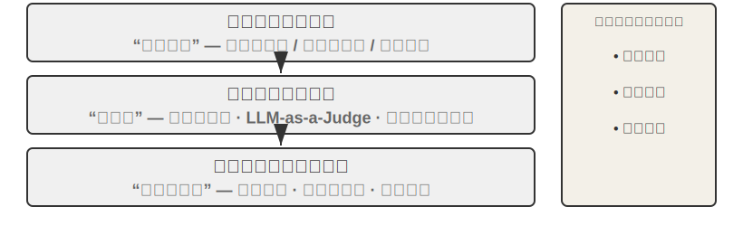
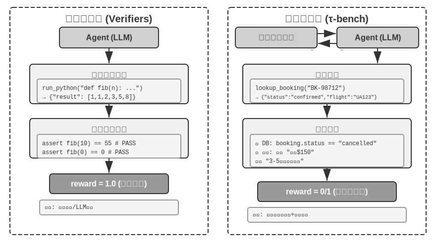
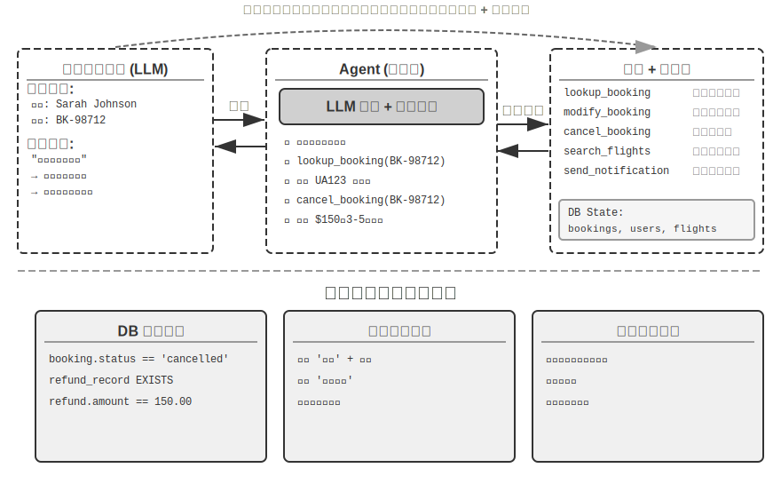
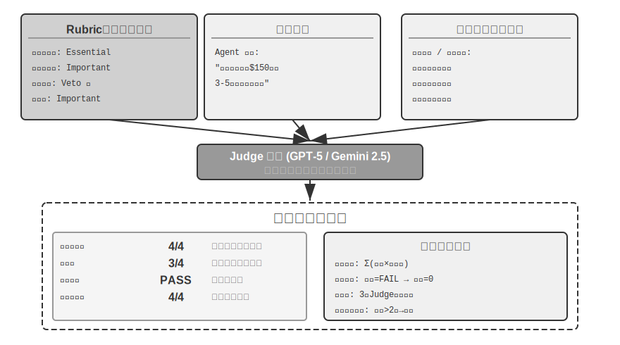
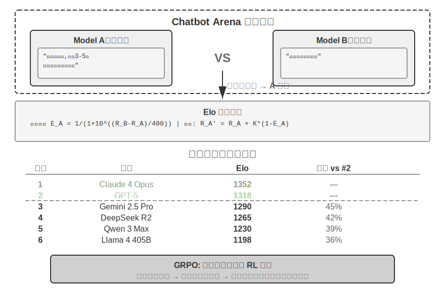
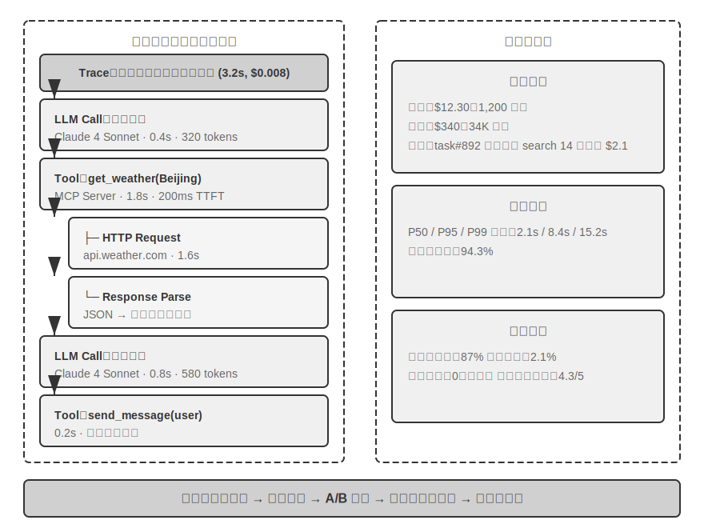
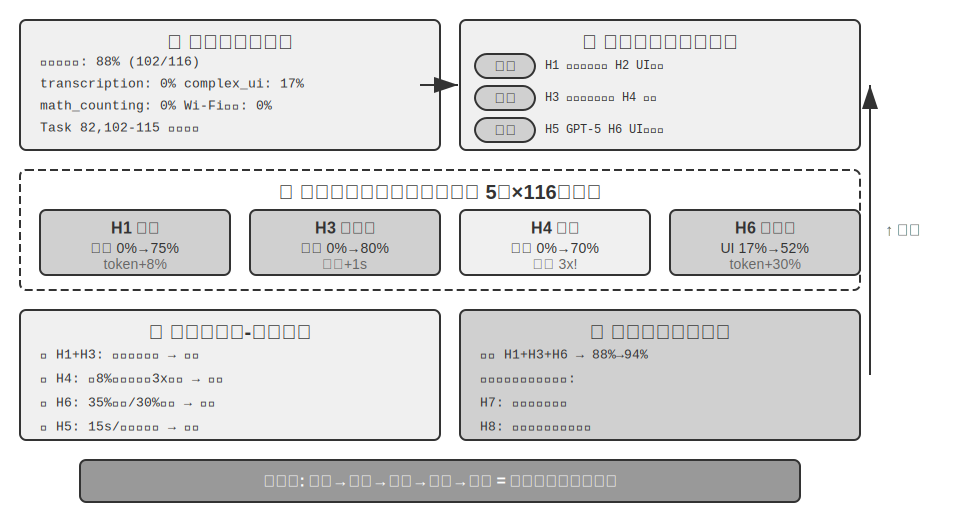
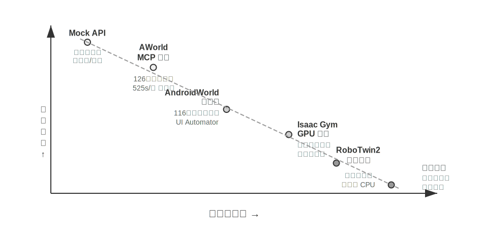
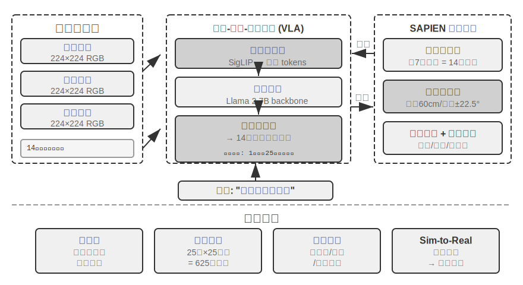

# Agent 的評估

建構 Agent 系統時，開發者面對大量設計選擇，而它們往往沒有顯而易見的正確答案：

- 用什麼模型？
- 讓模型能呼叫哪些工具？
- 知識庫該存什麼資料、以什麼結構來建構？
- 使用者記憶該怎麼做？
- 模型的提示詞和 Skills 該如何組織？
- Harness 中需要加上哪些約束？
- 這個 Agent 的自我進化和自迭代該怎麼做？

評估為我們提供了科學的決策依據：透過系統性的對比實驗（改變一個變數，觀察效果變化）和消融實驗（逐一關閉某個元件，觀察整體效能變化，從而判斷該元件的真實貢獻），區分真正的能力提升與表面的波動，避免「撿了芝麻，丟了西瓜」。正如軟體工程中「沒有度量就沒有改進」的說法，不建立可重複的評估體系，Agent 的迭代方向就只能靠直覺。

從第一章引入的 Harness 工程視角看，評估在 Harness 中扮演著「驗證」功能的核心角色。一個關鍵認識是：**評估的物件不應只是模型，而應是模型與 Harness 的組合體**。同一個模型在不同的 Harness 中可能表現差異懸殊——一些團隊僅透過最佳化 Harness 就顯著提升了同一模型在終端機類任務上的表現（詳見第五章）。這意味著，當 Agent 在評估中表現不佳時，改進方向可能不是換模型，而是最佳化 Harness 的某個元件（提示詞、工具設計、回饋迴圈）。完善的評估體系應能區分「模型能力不足」和「Harness 設計缺陷」這兩類本質不同的問題。**區分這兩類問題的常見手段是模型替換實驗（model swap）**——固定 Harness，只更換更強/更弱的模型，觀察分數變化幅度；如果換強模型分數不漲，說明瓶頸在 Harness；如果換弱模型分數大跌、分數隨模型能力大幅波動，最直接的解讀就是瓶頸在模型能力本身、當前表現主要由模型決定（至於這是因為任務本身就難、還是 Harness 過度依賴模型先驗，則需進一步分析）。注意這與前面提到的「消融實驗」是兩種不同的方法：消融是**關閉 Harness 的某個元件**看整體效能如何變化，模型替換則是**固定 Harness、只換模型**——前者定位 Harness 內部哪個部件重要，後者區分瓶頸在模型還是在 Harness。

評估體系的價值在模型快速演進的時代更加凸顯。模型能力仍在快速演進，但新模型在公開基準上表現更好，並不意味著在你的特定任務上也更好——反而可能出現效能退化（regression，即新版本在某些方面不如舊版本）。只有在自己的評估資料集上完整測試，才能做出資料驅動的升級決策。更進一步，完善的評估體系使得「為未來的模型開發產品」成為可行策略——即使當前模型不足以支撐商用，也可以先完成產品開發並建立評估集，持續追蹤新模型的表現，一旦達到門檻就立即上線。

> **本章導讀**
>
> 本章從三個層次建構完整的評估體系。第一層是**評估環境**（「在哪裡測」）：如何搭建自動化、可復現的測試環境，包括工具呼叫型和人機互動型兩種正規化。第二層是**評估方法**（「怎麼判」）：從資料集設計原則、評估指標體系（該測什麼），到 LLM-as-a-Judge（用大語言模型充當評委）自動化評判，再到配對比較與模型排名。第三層是**評估驅動的決策**（「測了幹什麼」）：將評估結果轉化為模型選型、架構最佳化和持續迭代的行動指南，並藉助統計顯著性判斷觀察到的分數差異是否真實可信。本章還會討論可觀測性與生產級 Agent 的內部評估基礎設施，並在章末介紹連線第七章後訓練的模擬環境。
>
> 貫穿全章的核心理念是：**評估體系的首要價值不是給當前系統打分，而是讓你能快速、可靠地跟上模型的演進**。當一個更強或更便宜的模型釋出時，擁有完善評估體系的團隊能在數小時內得出切換決策，而缺乏評估體系的團隊只能憑直覺或等待社群回饋——在競爭激烈的 Agent 市場中，這種速度差距可能決定成敗。



## 一個具體的評估示例

在深入方法之前，先透過一個完整的例子建立直覺。假設我們建構了一個客服 Agent，需要評估它處理退款請求的能力。

**測試用例**：使用者要求退掉 3 天前的訂單（訂單號 #12345，金額 ¥299）。公司政策：7 天內可全額退款。

**Agent 的軌跡**：

```
使用者：我想退掉 3 天前買的那個耳機，訂單號 12345。（今天是 2026-04-10）

Agent（思考）：使用者要退款，需要先查詢訂單資訊。
Agent → 呼叫工具 query_order(order_id="12345")
工具返回：{status: "delivered", amount: 299, date: "2026-04-07", item: "藍芽耳機"}

Agent（思考）：下單日 2026-04-07，距今天 2026-04-10 為 3 天，在 7 天退款期內，符合全額退款條件。
Agent → 呼叫工具 process_refund(order_id="12345", amount=299)
工具返回：{refund_id: "R-98765", status: "processing", eta: "3-5個工作日"}

Agent：已為您發起退款，訂單 #12345（藍芽耳機，¥299）的全額退款正在處理中，
      預計 3-5 個工作日到賬。退款編號 R-98765，可用來查詢進度。
```

**用 Rubric 評分**（四個維度，每維度 1-4 分）。表 6-1 給出了這個客服退款任務的評分示例，用來說明 Rubric 如何把一次 Agent 軌跡拆成可檢查的評價維度。

表 6-1 客服退款任務的 Rubric 評分示例

| 維度 | 標準 | 得分 | 理由 |
|--------------------|-----------------------------------|---------|-------------------------------|
| 操作正確性 | 退款金額、訂單號是否正確 | 4 | 正確查詢並行起 ¥299 全額退款 |
| 政策合規性 | 是否遵循 7 天退款政策 | 4 | 訂單在退款期內，符合政策 |
| 資訊完整性 | 是否告知金額、到賬時間、退款編號 | 4 | 三項關鍵資訊均已告知 |
| 幻覺偵測（否決項） | 是否編造不存在的資訊 | 透過 | 所有資訊均來自工具返回結果 |

幻覺之所以列為**否決項**而非分級評分維度，是因為它與質量是正交的——一個流暢、詳盡、禮貌的回答如果包含虛假事實，對使用者的傷害遠大於一個簡短但準確的回答。（否決機制的通用設計詳見後文「Rubric 四準則」。）

這個用例透過了。但好的評估不僅測成功場景，更要測邊界和陷阱——使用者要退 15 天前的訂單（超出退款期）時，Agent 能否正確拒絕？使用者聲稱「客服已經批准了退款」時，Agent 是否會在沒有系統記錄的情況下輕信？這些邊界場景才是區分 Agent 能力高低的關鍵。

上面這個流程——定義測試用例、執行 Agent、用 Rubric 評分、分析結果——就是評估的基本骨架。本章接下來會逐步展開每個環節的設計方法。

## 自動評估環境

Agent 評估需要一個可重複執行的自動化環境——能在開發階段快速測試變更的效果。搭建這樣的環境要回答三個問題：評什麼（任務定義和驗證標準）、對誰評（如何模擬 Agent 的互動物件）、用什麼標準打分。

### 評估環境的基本組成

評估環境包含五個要素——後續章節將重點展開其中的資料集設計和評分標準設計：

**資料集（Dataset）**定義任務集合，包含初始狀態、目標描述和可選的參考解決方案。

**環境狀態（Environment State）**維護任務執行中的可變資訊，需在真實性和可控性之間取得平衡。例如，在客服評估中，環境狀態包括資料庫中的訂單記錄和使用者帳戶餘額。Agent 呼叫 `process_refund` 後，訂單狀態從 'delivered' 變為 'refunded'、餘額增加——這些就是「可變資訊」。「真實性」要求狀態變化符合業務邏輯（退款不超過訂單金額），「可控性」要求每次測試可重置到相同初始狀態。

**工具介面（Tools）**定義 Agent 可執行的操作集合——工具不應提供過高層的抽象（如「解決使用者問題」），而應提供原子操作（如查詢訂單、修改預訂、傳送郵件），迫使 Agent 透過規劃和思考來組合這些操作。

**評分標準（Rubric，評分準則）**量化 Agent 的表現，可以是二元的（透過/不透過）、連續的（0 到 100 分）或多維的（分別給準確性、效率、安全性打分）。

**執行協定（Interaction Protocol）**規定互動模式和終止條件。



### 工具呼叫型評估環境

對於程式碼生成、資料分析等主要依賴工具使用的任務，Verifiers 框架展示了典型的設計模式。Agent 透過呼叫預定義工具完成任務，驗證基於可執行標準（測試是否透過、答案是否匹配），不依賴人類標註或模型評判。

Verifiers 引入了層次化的環境設計：`SingleTurnEnv` 適用於單輪任務（如簡單問答），`ToolEnv` 支援多輪工具呼叫的自主迴圈，`StatefulToolEnv` 和 `SandboxEnv` 支援有狀態工具和長期執行的沙盒環境（如程式碼執行）。例如，`SingleTurnEnv` 適用於問一道數學題後直接驗證答案；`ToolEnv` 適用於搜尋多個網頁後綜合回答再驗證最終結果；`StatefulToolEnv` 適用於修改資料庫記錄後驗證資料庫狀態變化；`SandboxEnv` 適用於在沙盒中執行程式碼後檢查輸出檔案。表 6-2 彙總了這些環境型別，便於讀者按任務狀態、工具呼叫和隔離需求選擇合適的評估環境。

表 6-2 Verifiers 環境型別對比

| 環境型別 | 狀態保持 | 工具呼叫 | 典型用例 |
|---|---|---|---|
| SingleTurnEnv | 無 | 無 | 單輪問答、數學題 |
| ToolEnv | 無 | 多輪 | 搜尋+資訊綜合 |
| StatefulToolEnv | 有 | 多輪 | 修改資料庫記錄 |
| SandboxEnv | 有+隔離 | 多輪 | 程式碼執行與測試 |

框架支援並行取樣和軌跡快取，每次評估的完整軌跡（觀察、行動、獎勵）都會被儲存，方便後續分析和重播。

環境還需處理操作的狀態依賴性——工具的執行效果取決於當前狀態，失敗時應提供清晰的錯誤資訊而非簡單的失敗標誌，讓 Agent 能從錯誤中學習並調整策略。

### 人機互動型評估環境

許多真實任務不僅涉及工具呼叫，還需要與人類使用者對話。客服 Agent 需要理解模糊表達、澄清需求、查詢後臺系統、向使用者確認資訊。這類任務的評估面臨一個根本性挑戰：如何在自動化環境中模擬真實使用者？

關鍵設計原則是**漸進式資訊透露（Progressive Information Disclosure）**，這是人機互動型評估與傳統基準測試（benchmark）的根本區別。大多數 benchmark 一開始就把完整需求全盤托出，但現實中使用者很少能一上來就清晰描述需求——他們往往只會說「我的航班好像有問題」、「網路連不上了」。Agent 需要透過主動提問來澄清需求，這個過程本身就是能力的重要體現。因此在評估中，**絕不能一開始就把模擬使用者的所有資訊暴露給 Agent**，資訊應按需、漸進地在對話中透露。

τ-bench 的解決方案是**使用者模擬（User Simulation）**：用另一個 LLM 扮演使用者角色，根據預定義的指令與 Agent 對話。模擬使用者接收任務指令（如「我需要取消明天的航班」），在對話中逐步向 Agent 透露必要資訊、回應詢問，任務完成後發出終止訊號。提示詞要求模擬使用者「不要拋棄式透露所有資訊，只提供當前步驟必要的內容」、「不要編造指令中未提供的資訊」。使用者模擬的設計需要在真實性和可控性之間權衡：行為應接近真實使用者（表達模糊、資訊不完整、偶爾情緒波動），同時遵循一定的劇本以確保可復現。

以下是漸進式資訊透露的多輪對話示例（使用者模擬器按固定指令碼行動）：

> **使用者**：「我的航班有個問題。」
> **Agent**：「請問是哪個航班？」
> **使用者**（按指令碼透露）：「Delta 123，明天早上從舊金山飛紐約。」
> **Agent**：「具體是什麼問題？」
> **使用者**（按指令碼透露）：「飛行時間太長了，我想改簽。」
> **Agent**：「對新航班有什麼偏好嗎？」
> **使用者**（按指令碼透露）：「下午的航班都行。」

使用者模擬器遵循一個固定的指令碼（已知資訊 + 透露規則），確保評估可復現，同時模擬真實使用者的漸進式表達方式。

τ-bench 是評測 Agent 在結構化業務流程（如航空客服、零售客服）中表現的基準測試。它的檢查是元件級、多維度的：一方面檢查資料庫最終狀態是否正確（如預訂記錄狀態變為「已取消」），另一方面驗證 Agent 在對話中是否輸出了必要的關鍵資訊（如退款金額和到賬時間，透過搜尋特定字串或模式來驗證）。這種雙重驗證同時考察操作準確性和溝通有效性。但在任務層面，這些檢查最終彙總為**零或一的二元獎勵**——所有檢查全部透過才得 1 分，任何一項不透過就是 0 分。二元獎勵便於統計 Pass^k 等可靠性指標（見後文「評估指標體系」），代價是「操作準確但漏掉某個非關鍵欄位」與「完全失敗」得到相同的分數。

改進版 **τ²-bench** 的核心增量不在評分粒度，而在兩點：一是**雙控環境（Dual-Control）**——不再只有 Agent 一方能呼叫工具，使用者模擬器也能操作同一個共享環境（如 Agent 指導使用者切換飛航模式，使用者的操作真正改變環境狀態），這更貼近技術支援等需要使用者動手配合的真實場景；二是**更精確的任務規範與組合式任務生成**——成功條件的歧義更少、具體任務例項可以引數化批次生成（詳細驗證維度見後文「可驗證性與客觀性保障」一節）。

> **實驗 6-1 ★：執行 τ²-bench 並對比 τ-bench 的演進**
>
> 本實驗透過執行 τ²-bench 評估框架，理解人機互動型評估環境的設計要點，並透過對比 τ-bench 與 τ²-bench 的差異，體會評估資料集是如何迭代改進的。
>
> 深入閱讀任務定義檔案：每個任務包含已知資訊（使用者的背景知識）、任務指令（指導如何漸進式透露資訊和響應策略）以及成功條件（資料庫目標狀態和對話中必須出現的確認資訊）。執行完整評估流程，觀察使用者模擬器與 Agent 的多輪對話，分析典型的失敗模式（政策違規、資訊遺漏、過度轉接人工等）。
>
>
> 
>
>
> 對比 τ-bench 與 τ²-bench 的設計差異：τ-bench 初始版本的使用者指令過於簡單（Agent 能猜對答案）、成功條件不夠精確（導致誤判）、使用者模擬器過於機械。τ²-bench 針對這些問題做了系統性改進：
>
> - **引入更詳細的任務指令**：包括「事實錨定要求」（Grounding），即必須基於環境真實狀態回答
> - **更精確的評估標準**：如「速度測試返回 excellent 才算解決」
> - **更真實的使用者模擬器行為規範**：漸進式資訊透露、自然的情緒波動
>
> 特別關注 τ²-bench 新增的 telecom 領域任務，理解其雙控環境設計（如前文所述，使用者與 Agent 共同操作同一共享環境）。
>

與工具呼叫型評估側重「是否完成了可觀測的狀態變更」不同，人機互動型評估關注「是否引導使用者完成了認知或決策上的變化」——前者考察 Agent 的行動正確性，後者考察其溝通策略的合理。

評估環境的建構還涉及模擬環境的設計——當評估環境需要支援大規模重複互動時就演化為模擬環境，本章末尾將簡要討論。

## 評估任務資料集的設計

評估環境是「舞臺」，資料集是「劇本」——劇本設計的好壞，往往比舞臺本身更能決定評估的價值。一個設計糟糕的資料集，即使跑在完美的環境裡，得到的也只是噪聲。本節從 GAIA、AndroidWorld、SWE-Bench Verified（Software Engineering Benchmark，軟體工程基準測試）、τ-bench 與 τ²-bench、Terminal-Bench、OSWorld 與 OSWorld-Verified 等基準的設計實踐中，提煉出幾條反覆被驗證的原則。

這份清單並未窮盡 Agent 評估的版圖。僅 Web/GUI 類就有多個各有側重的基準：WebArena 自建了一套可完全復現的網站（電商、論壇、程式碼託管等），把「真實網頁」的不可控性關進沙盒；Mind2Web 反其道而行，直接在上百個真實網站上測泛化能力；BrowseComp 則專攻深度檢索——答案藏得很深、需要多跳瀏覽與交叉驗證才能找到。工具呼叫維度還有 BFCL（Berkeley Function-Calling Leaderboard）這類專門的函式呼叫榜單。本章無意羅列所有基準，而是選取兩種核心環境正規化（工具呼叫型、人機互動型），加上貫穿資料集案例的 GUI 操作場景，深挖其設計取捨——理解了正規化，面對任何新基準都能快速判斷它測的是什麼、防洩漏做得如何、結論能外推到哪裡。

> **實驗 6-2 ★：人肉執行基準測試任務**
>
> 從 GAIA、AndroidWorld、SWE-Bench Verified、τ²-bench、Terminal-Bench、OSWorld-Verified 中各挑選任務親手完成。建議每個資料集完成簡單、中等、困難各一個——「困難」級別對人類也有挑戰。將執行結果與標準答案對比，分析差異來源。透過親身體驗理解：任務描述需要在明確性與開放性之間平衡，驗證標準必須客觀可執行，任務難度的層次化要能區分不同能力水平。
>
### 任務資料集設計的核心挑戰

**挑戰一：明確性與開放性的張力。** 任務描述必須足夠明確以確保評估可復現，又不能過於死板限制 Agent 的創造性。GAIA 提供了一個範例：任務「概念簡單」但實現路徑開放——例如要求找到 NASA 每日天文圖片中的太空人資訊，目標明確（找到特定太空人及其太空時間），但如何搜尋、篩選、驗證完全由 Agent 自主決策。

**挑戰二：真實性與可控性的平衡。** 真實任務包含不確定性和噪聲，能讓魯棒性得以顯現，但也威脅可復現性。SWE-Bench 初始版本直接取自 GitHub 真實 issue，確保了真實性，但也導致任務描述模糊、測試用例不完整、評估標準主觀。SWE-Bench Verified 引入人類專家進行系統性驗證，從中篩選出問題清晰、測試充分、方案明確的 500 個高質量任務，在保持真實性的同時顯著提升了可控性。

**挑戰三：多樣性與系統性的協調。** 有效的資料集需覆蓋典型情況、邊界條件和錯誤陷阱，同時要有系統性的組織方式，使評估結果能診斷出具體的能力短板。AndroidWorld 的 116 個任務橫跨 20 個真實應用，每個任務標註了所需的核心能力（多步規劃、視覺理解、時間推理），使評估結果不僅能給出整體成功率，還能揭示特定能力維度的強弱。更關鍵的是，透過引數化機制可以生成幾乎無限的任務變體。

**挑戰四：評估成本與覆蓋範圍。** 複雜 Agent 任務可能需要數分鐘甚至數小時才能完成，涉及大量 token 消耗。資料集的規模需要在全面性與經濟性之間平衡。GAIA 精選 466 題、分三級難度，既覆蓋多種能力維度又能在合理成本下完成評估。SWE-Bench Verified 從 2294 題篩選至 500 題（成本降低約五分之四，透過更嚴格的質量標準提升了訊雜比）。

**挑戰五：資料洩漏（Data Contamination）防範。** 在大語言模型時代，資料洩漏是評估面臨的嚴峻挑戰：當評估資料被納入訓練資料時，評估測的就是記憶力而非泛化能力，好比考試前把答案背下來了，成績再好也說明不了真實水平。各個基準採用了不同的防範策略：GAIA 依靠答案的獨特性，問題需要組合多個資訊源才能回答，且部分任務配有專門建立的附件檔案（網際網路上不存在的 PDF/音訊/圖片），單一網頁無法直接提供答案。SWE-Bench Verified 本身是 OpenAI 對原 SWE-Bench 做人工質量篩選得到的 500 題子集，並不含時間維度的防洩漏設計；真正靠時間新鮮度防洩漏的是 SWE-bench-Live 等後續工作，它們持續收錄模型訓練截止日期之後新建立的 issue，使評估始終領先於模型的訓練語料。τ²-bench 透過動態引數生成做防範，具體任務例項（使用者姓名、訂單號、日期等）每次隨機生成。AndroidWorld 的引數化任務生成天然具有抗洩漏能力，因為驗證基於最終 UI 狀態而非操作序列。Terminal-Bench 透過嵌入金絲雀識別符號（canary GUID，即全域性唯一識別符號，一種唯一追蹤標記）使洩漏可偵測：如果模型能輸出含該 GUID 的內容，說明基準資料已洩漏到訓練集中。

### 任務描述的精確性設計

GAIA 透過明確的資訊源約束、時間範圍、主題和查詢目標來確保答案的唯一性。例如 Level 3 任務要求從特定日期的 NASA 圖片出發，經視覺理解識別太空人、查詢所屬太空人組、計算太空停留時間並精確格式化輸出（「姓氏，分號分隔，千位分隔符」），每個細節都服務於自動驗證——只有格式和內容完全匹配才算透過。

τ²-bench 引入了情境化設計，每個任務包含多層資訊：表面問題（「行動資料無法工作」）、效能期望（「絕對想要出色速度」）、約束條件（「不接受其他速度」）以及隱含情緒。關鍵改進是將「已知資訊」與「任務指令」分離：已知資訊是使用者當前掌握的事實，任務指令指導模擬器如何漸進式透露資訊，其中包含「事實錨定要求」（Grounding Requirement，即必須根據工具呼叫的實際返回結果回答，不能編造）。

SWE-Bench Verified 包含問題描述、復現步驟、預期/實際行為等結構化欄位，標註者會驗證描述與測試用例的匹配性。Terminal-Bench 的任務描述中每個元素都可以機械化驗證：檔案路徑是否存在、權限數值是否正確、證書引數、日期格式等。例如「build-linux-kernel-qemu」要求從原始程式碼建構 Linux 核心 6.9、在 `start_kernel` 中新增自訂 printk、生成 initramfs 並在 QEMU 中執行，成功標準是啟動日誌中出現自訂訊息——Agent 無法透過偽造輸出矇混過關，必須真正完成整個流程。

AndroidWorld 採用**引數化範本**設計。一個任務不是靜態文字，而是可動態例項化的範本（如「將聯絡人 `[CONTACT_NAME]` 的電話改為 `[NEW_PHONE]`」），每次評估時隨機生成不同的引數值。好處有三個：

- **防止記憶**：引數值每次不同，無法重播固定的操作序列
- **增加資料多樣性**：一個範本可以生成幾乎無限的例項
- **支援對比實驗**：固定某些引數只變化其他引數，精確測量特定因素的影響

驗證基於最終 UI 狀態（如電話號碼欄位是否包含預期值）而非操作序列。

OSWorld 的任務往往不從「乾淨的」初始狀態開始，而是從精心配置的中間狀態啟動，更貼近真實使用場景。任務描述需要處理多解性（「將背景設為紫色」需提供具體顏色程式碼消除歧義，「拼接兩個 CSV」需接受保留單表頭/雙表頭等所有合理方式）和環境不確定性（網站反爬、應用 UI 演變、時序競爭——OSWorld-Verified 透過離線頁面快照、鎖定依賴版本、顯式等待條件等機制加以緩解）。

### 任務複雜度的層次化設計

GAIA 設計了三級難度：Level 1 只需 1-2 個工具（人類 93.9% vs GPT-4 30.3%），Level 2 需要多步思考（91.8% vs 9.7%），Level 3 需要複雜組合（87.3% vs 0%）。層次化設計的診斷價值在於：Level 1 失敗指向基礎工具使用問題，Level 2 指向多步規劃和資訊整合，Level 3 指向長序列思考和複雜性管理——每個層次對應不同的改進方向（提示工程 vs 規劃機制 vs 分層架構/後訓練）。

τ²-bench 透過業務複雜度分層：從簡單的資訊查詢，到多步流程（修改航班需要查詢、展示替代、確認、計算差價、支付），再到故障診斷（系統性檢查多個可能原因並驗證修復），最後到策略判斷（處理不符合政策的請求）。

Terminal-Bench 透過技術領域×操作複雜度雙維度分層，其任務登錄檔已收錄 200 餘個任務（不同版本的核心評測集規模不同，如 2.0 版從社群貢獻中精選了 89 個高質量任務），從簡單的 mlflow 模型註冊，到中等的 7z 密碼破解，到困難的 git 伺服器+webserver 多元件整合，到最困難的 FEAL 差分密碼分析（需密碼學知識+演算法最佳化滿足 30 秒時間約束）。

### 可驗證性與客觀性保障

GAIA 的答案簡潔明確，嚴格的格式規定使驗證可以透過精確的字串匹配來完成，二元結果（匹配或不匹配）確保客觀可復現。答案的稀有性也起到了防作弊作用——高度具體的事實不太可能以原樣出現在訓練資料中。

SWE-Bench Verified 基於程式碼的可執行性做驗證，區分 FAIL_TO_PASS（修復前失敗、修復後透過，證明問題被解決了）和 PASS_TO_PASS（修復前後都透過，證明沒有引入新的 bug），實現雙重驗證。Verified 版本還確保測試本身質量可靠、沒有時而透過時而失敗的不穩定測試（flaky tests）。

τ²-bench 的驗證體系包含多層檢查（各層檢查結果在任務層面仍彙總為二元獎勵，全部透過才算成功）：

- **資料庫狀態檢查**：預訂記錄狀態、退款記錄是否建立
- **對話內容關鍵詞搜尋**：是否向使用者確認退款金額和到賬時間
- **流程合規性**：工具呼叫序列分析，如修改訂單前是否獲得使用者的明確確認

τ²-bench 的雙控環境（見前文「人機互動型評估環境」）在驗證層面還多出一維：使用者模擬器實際改變環境狀態後，Agent 必須透過工具呼叫觀察到這一變化並據此繼續排查，驗證因此覆蓋了「Agent 是否真的讀到了使用者側的操作結果」。

OSWorld 配備了 134 個獨立評估函式，擁有完整的 OS 訪問權限，能深入檢查檔案系統結構、程序狀態、網路連線、應用內部狀態。例如在資料庫操作任務中，評估指令碼不僅驗證報告檔案是否存在，還會直接連線資料庫檢查 SQL 是否正確執行；在瀏覽器任務中會分析 DOM 樹、檢查 cookie/localStorage、向後端傳送驗證請求確認表單是否真正生效。這種深度檢查能發現“表面完成但實質錯誤”的情況——比如 Agent 點選了提交按鈕，但因為欄位填寫錯誤而被服務端拒絕。

Terminal-Bench 基於 Docker 容器標準化環境，結合檔案系統狀態檢查（路徑是否存在、權限數值、內容格式）和程式執行功能驗證（build-linux-kernel-qemu 中實際啟動 QEMU 並搜尋自訂 printk 訊息），canary GUID 使洩漏可追蹤。

### 任務分佈的系統性設計

任務分佈需要系統性地覆蓋能力維度、難度維度、場景維度和邊界情況。GAIA 追求通用性——大多數任務需要推理、多模態、瀏覽、工具使用的組合。τ²-bench 專門設計了「陷阱任務」——比如使用者聲稱「客服已批准取消」但實際並不符合政策，用以測試 Agent 在面對壓力和誤導時能否保持正確判斷。OSWorld 基於操作型別（檔案 IO / 桌面應用 / 網頁應用 / 跨應用流程）與應用領域的雙維度矩陣，跨三個作業系統（研究表明跨 OS 能力強相關，在一個系統上學到的能力可以遷移到其他系統）。Terminal-Bench 包含「跨技術棧組合任務」以測試系統思維（如融合資料處理 + 檔案操作 + Python 工程的重分片任務）。

### 資料質量控制與迭代改進

SWE-Bench Verified 是質量控制的典範。OpenAI 從原始 2294 個任務中隨機抽取 1699 個評估，招募了 93 名精通 Python 的開發者。標註者需完成多項檢查：問題描述是否清晰（能否理解要解決什麼）、測試用例是否完整（覆蓋所有方面和邊界條件）、測試是否穩定（有沒有因環境或隨機性導致的 flaky test）、patch 是否正確（是否引入了新錯誤）、難度是否合理。經過嚴格篩選，最終僅 500 個透過（29%）——這種高淘汰率是對評估質量的必要投資。他們還建立了標準化的標註指南，為每項檢查定義具體標準和示例，確保不同標註者之間的一致性。

τ²-bench 引入了「已知資訊」/“任務指令”分離（使模擬器行為更真實）和更嚴格的完成條件（如“只有 excellent 才算解決，poor/fair/good 都不接受「），防止」敷衍性修復「。

OSWorld-Verified 是迭代改進的典範。OSWorld 在 2024 年 4 月釋出後迅速成為多模態 Agent 評估的重要基準，但在 15 個月的廣泛使用中暴露出超過 300 個問題。這些問題分為四類：環境問題（網站反爬 / CAPTCHA / 動態內容變化）、任務描述問題（歧義表述）、驗證邏輯問題（過嚴或過鬆）、初始狀態問題（配置不完整）。香港大學團隊組建了約 10 人小組，與 MoonShot AI、OpenAI、ByteDance Seed TARS、Anthropic、Simular 等深度合作兩個月進行系統性修復。針對每類問題制定了修復策略：環境問題透過鎖定版本和離線備份解決，任務描述透過重寫歧義表述消除，驗證邏輯透過人工建立正確基線和調整條件來平衡，初始狀態透過增加完整性校驗來增強。

評估基礎設施也從本地 VM 遷移到 AWS 雲平臺，利用彈性伸縮實現了 50 倍並行加速（從 10 多小時縮短到幾分鐘），Google Drive 任務初始化成功率從 50% 提升到 95% 以上。所有官方評估軌跡資料公開在 HuggingFace 上，使社群能審查每個細節、復現結果、發現問題，形成持續改進的良性迴圈。

評估環境與後訓練環境往往同源：一套設計良好的評估環境，稍加改造就能變成訓練環境——SWE-Gym 就是基於 SWE-bench 建構訓練任務的代表，τ²-bench、AndroidWorld 的引數化範本則能批次生成海量訓練例項。但要劃清一條紅線：可以複用的是**環境的構造機制**，評估集本身的那些具體題目必須與訓練資料嚴格隔離——一旦評估題進了訓練集，測的就是記憶而非能力（詳見第七章）。

## 評估指標體系

確定了「在什麼任務上評估」之後，還要回答「該度量哪些維度」。本節把 Agent 評估常用的指標彙總成一部可查閱的「指標詞典」——從過程到結果、從質量到安全，逐一給出定義與適用場景。前文（如 τ-bench 一節）反覆提到的 Pass@k、Pass^k 等指標，其精確定義也在這裡給出。

**過程指標：從黑盒到白盒。**

僅關注最終結果是不夠的，Agent 達到結果的過程同樣重要。**行動合法率**測量操作中有效且合法的比例——無效操作包括呼叫不存在的工具、傳遞錯誤的引數型別；越權操作指超出權限範圍的行為。高合法率說明 Agent 對工具生態有清晰的理解。**工具呼叫正確率**進一步要求引數在語義上合理：搜尋工具的查詢詞應準確表達需求，檔案操作的路徑應指向正確目標。

**路徑效率**衡量完成任務的經濟性：步數（思考～行動～觀察迴圈次數）、冗餘動作（重複搜尋相同關鍵詞、反覆讀取同一檔案）、回退次數（意識到錯誤並糾正的頻率——偶爾回退很正常，但頻繁回退說明前瞻規劃不足）。需要建立人類專家或啟發式演算法的基線來定義「合理步數」。

**檢索覆蓋率**針對資訊收集類任務：Agent 是否充分探索了資訊空間？是否只看了搜尋結果第一頁就草率下結論？**成本與延遲**關注請求次數、Token 花費（需區分輸入/輸出成本，考慮 KV Cache 複用）、牆鍾時間（包括模型推理 + 工具執行 + 網路延遲），需要追蹤時間分佈來定位瓶頸。

**結果與質量指標。**

**任務成功率**是最直接的硬指標，可設計層次化標準（核心目標必須達成，次要目標影響質量評分）。在統計方式上需要區分兩個常被混淆的指標：

- **Pass@k**：k 次嘗試中**至少有一次**成功的機率，回答「Agent 能不能做到」
- **Pass^k**：k 次嘗試**全部成功**的機率，回答「Agent 是否穩定可靠」
- **Best@k**：k 次嘗試中**最好一次**的得分（而非是否成功），衡量「給足機會後的質量上限」，多用於有連續評分的開放任務

用一個具體數字感受差異：假設 Agent 的單次成功率是 60%（即 Pass@1 = 0.6），那麼跑 5 次的兩個指標分別是：Pass@5 = 1 - 0.4^5 ≈ 99%（幾乎肯定至少成功一次），Pass^5 = 0.6^5 ≈ 7.8%（全部成功的機率很低）。前者評估能力上限，後者評估穩定性，混用會導致誤判。表 6-3 歸納兩者的適用場景與誤用風險，幫助讀者在迴歸測試和探索性評估之間選擇正確指標。

表 6-3 Pass@k 與 Pass^k 的適用場景

| 評估目的 | 用什麼指標 | 誤用後果 |
|-----------------------------|-----------------|--------------------------------------------------|
| 驗證穩定性（迴歸測試） | Pass^k | 用 Pass@k 會掩蓋不穩定性——Agent 五次只成功一次也顯示「透過」 |
| 評估能力天花板（探索性任務） | Pass@k 或 Best@k | 用 Pass^k 會因偶發波動誤報——每次小改動都被判失敗 |

**安全與合規指標**在生產部署中至關重要：觸發敏感操作（刪除資料 / 修改權限 / 傳送對外通訊）、資料外洩（日誌中列印密碼 / 私密文件傳送到外部 API）、違規內容，都應遵循**零容忍原則**——與幻覺否決項同理（見後文「Rubric 四準則」），一次嚴重安全違規即否決整體評價，不因其他維度表現優秀而豁免。

**魯棒性**衡量面對不確定性時的穩定性：隨機種子敏感性（不同初始化下表現差異有多大）、頁面變化適應性（網站 UI 更新不應導致完全失效）、API 抖動容忍度（能否優雅處理臨時故障、超時、格式變化）、長時記憶干擾（上下文中積累的過時資訊是否會導致錯誤決策）。

**執行軌跡與最終結果的雙重覆蓋**。評測中容易忽視的一個區分是：Agent 在執行過程中「說了什麼、做了什麼」（即第一章定義的軌跡，trajectory）和「系統最終變成了什麼樣」（最終結果，outcome）是兩件事。Agent 說「訂票已完成」是軌跡層面的資訊，資料庫裡確實生成了一條訂單才是結果層面的驗證。只看軌跡會漏掉「說了但沒做到」的情況，只看結果又可能看不出中間步驟走歪了。Anthropic 曾舉過一個例子：一個機票預訂 Agent 在執行中發現了航空公司政策裡的漏洞，為使用者找到了更便宜的方案——如果只按預設執行路徑打分，這次執行會被判為失敗；但從最終結果看，使用者拿到了更好的方案。因此兩類評測都應覆蓋，以避免系統性盲區。

**人工抽檢和對抗式評審。**

即使自動評估在大多數情況下是可靠的，也需要定期人工抽檢：覆蓋不同任務型別、成功/失敗案例和邊界分數附近的模糊案例，不僅驗證結果，還要審查評分理由的合理性。人工抽檢可以進一步系統化為**評判者校準**：在放量使用 LLM 評判之前，先建構一個人工標註的金標集（如 100-200 個覆蓋各任務型別和難度的案例），在其上測量評判模型（即用 LLM 充當評委，其機制詳見下節 LLM-as-a-Judge）與人類標註的一致率（簡單一致率或 Cohen's kappa 等一致性係數，後者剔除了隨機猜中的成分），達到預設門檻（如 kappa 高於 0.7）後才將評判模型用於大規模評估；此後每當評判模型或 Rubric 更新，都應在金標集上重新校準。沒有這一步，LLM 評判的分數只是「另一個模型的意見」，而非人類判斷的可靠代理。**對抗式評審**透過紅隊（Red Teaming）主動構造挑戰性案例：表面完美但含隱蔽錯誤的回答、透過關鍵詞堆砌矇混過關的回答、利用評判模型已知偏見獲取不應得高分的回答。**多評委機制**使用多個獨立評判者分別評分，透過加權平均或一致性檢查確定最終結果——當評判者之間嚴重分歧時，標記為需進一步人工審查。

## 自動化評估方法

有了評估環境、資料集和明確的指標體系，接下來的核心問題是：怎麼打分？對於有明確正確答案的任務（如數學題、SQL 查詢），簡單的二元判定（對/錯）已經足夠；但對於開放式任務（如客服對話、報告撰寫），需要更精細的評估方法。

程式碼自動驗證只覆蓋有標準答案的場景，開放式任務的評分才是本節的主題。其中，獎勵訊號的密度設計（從二元獎勵到過程獎勵再到生成式獎勵）以及獎勵模型的訓練方法留待第七章後訓練部分系統討論；本節則回答一個更基礎的問題：如何用 LLM 自動化地評判開放式任務的輸出質量。

### LLM-as-a-Judge：自動化評估的核心



為什麼需要 LLM-as-a-Judge？對於開放式任務（如生成報告、處理客戶投訴、創意內容），沒有標準答案可以自動對比，人工評估成本高且難以規模化。LLM-as-a-Judge 透過讓語言模型根據專家定義的評分標準（Rubric）進行評判，在自動化規模和人類專業判斷之間取得了平衡。但這種方法也有已知的侷限：評判模型可能有自己的偏見（最典型的是**長度偏差**——傾向於給更長、更詳盡的回覆打高分，哪怕內容並不更正確），相同輸入多次評判也可能有波動。長度偏差尤其值得單獨防範，常用手段有三：在 Rubric 裡顯式懲罰冗長、對同類任務規定回答的長度上限；做配對比較時先把兩個候選的長度控制到相近再評；以及定期審計評分與回答長度的相關性——如果高分幾乎總是伴隨長回答，就說明評判已被長度帶偏，需要回爐修訂 Rubric。為了系統性地應對這些挑戰，Rubric 設計必須遵循以下準則：

**Rubric（評分標準）：LLM 評判的依據。**

**Rubric 四準則**（Scale AI，「Rubrics as Rewards」）：

（1）**基於專家指導**——必須反映領域知識，捕捉核心事實和推理步驟。比如醫療問答的 Rubric 需包含診斷標準和必須避免的醫學錯誤，缺乏專業基礎的 Rubric 只能捕捉語言流暢度等表面特徵。

（2）**全面覆蓋**——涵蓋事實準確性、邏輯連貫性、完整性、安全性，而且不僅定義正面標準，還要明確**陷阱（Pitfall）**——即高風險的常見錯誤，如醫療建議中推薦未經驗證的療法。

（3）**標準重要性權重**——分為必要項（Essential）、重要項、可選項、陷阱項。支援**一票否決機制（Veto）**：比如在客服場景中，幻覺（編造虛假資訊）是典型的否決維度——無論其他維度表現多優秀，只要出現虛假資訊就必須否決。這也有助於防範關鍵詞堆砌式的獎勵作弊。

（4）**自包含評估**——每個評價項獨立可操作，不依賴評價者的領域知識。要避免「回應展示了深刻理解」這種抽象標準，改為「引用了至少兩個權威理論並準確解釋如何支援結論」這種可驗證的標準。

關鍵實踐：為每個維度定義客觀可驗證的評分等級，提供具體示例和**邊界案例**幫助區分模糊情況。要主動防範**獎勵作弊（Reward Hacking）**——即 Agent 找到了獲取高分的「捷徑」卻沒有真正完成任務——明確懲罰幻覺、討好使用者、關鍵詞堆砌、迴避棘手問題。Rubric 是迭代產物——透過試用收集評價者分歧、逐步完善，逐漸從抽象準則演化為詳盡的判例集。

以使用者記憶 Agent 為例，展示一個符合四準則的完整 Rubric。測試問題：「我女兒的兒科醫生是誰？」（答案需要跨兩次對話關聯：第一次對話提到「女兒叫 Lily」，第二次提到「帶 Lily 去看了 Dr. Chen」）。

```yaml
rubric:
  dimensions:
    - name: 事實正確性
      weight: essential        # 必要項
      scoring:
        4_優秀: "準確回答 Dr. Chen，且關聯到女兒 Lily"
        3_良好: "準確回答 Dr. Chen，但未提及是 Lily 的醫生"
        2_及格: "給出了正確醫生但附帶不確定的額外資訊"
        1_不及格: "給出錯誤醫生名，或回答不知道"

    - name: 資訊完整性
      weight: important        # 重要項
      scoring:
        4_優秀: "主動補充相關資訊（如上次就診時間、診斷結果）"
        3_良好: "回答了核心問題，無遺漏"
        2_及格: "回答了核心問題，但遺漏了可用的關聯資訊"
        1_不及格: "關鍵資訊缺失"

    - name: 思考正確性
      weight: important
      scoring:
        4_優秀: "正確關聯'女兒=Lily'和'Lily的醫生=Dr. Chen'兩條跨會話資訊"
        3_良好: "關聯正確但思考路徑不夠清晰"
        2_及格: "部分關聯正確"
        1_不及格: "錯誤關聯（如把使用者自己的醫生當成女兒的醫生）"

    - name: 幻覺檢測
      weight: veto             # 否決項：一旦觸發，總分歸零
      scoring:
        pass: "所有資訊均可溯源到歷史對話記錄"
        fail: "編造了對話中不存在的資訊（如虛構就診日期、診斷結果）"

  edge_cases:
    - "如果使用者有多個女兒且分別看不同的醫生，應追問是哪個女兒"
    - "如果記憶中同時存在'Dr. Chen'和'陳醫生'，應識別為同一人"
```

**好的 Rubric vs 壞的 Rubric**：上面每個評分檔都給出了可驗證的具體行為（「準確回答 Dr. Chen」），而非「展示了對記憶的深刻理解」這類無法客觀判定的描述。否決項明確了底線：即使其他維度全部滿分，一旦出現幻覺就直接判零。

將這個 Rubric 和 Agent 的實際回答一起發給評判模型，評判模型會逐維度打分並給出理由。透過在幾十個測試用例上執行，就能系統性地發現 Agent 的能力短板——比如「跨會話關聯」維度的平均分只有 2.1，就明確指向記憶檢索或資訊關聯的不足。

> **實驗 6-3 ★★：建構基於 Rubric 的使用者記憶評估系統**
>
> **前置要求**：需完成第三章使用者記憶實驗（`ch3/user-memory-evaluation`）。
>
> 本實驗要求改造第三章的 `ch3/user-memory-evaluation` 框架，將當前基於簡單 LLM-as-a-Judge 的評分機制升級為結構化的多維度 Rubric 評估系統。現有系統使用單一 LLM 呼叫返回透過/失敗加評估理由，缺乏結構化的診斷能力。
>
> 設計統一的多維度 Rubric 框架，適用於所有三層任務。評價維度包括：事實正確性（Precision，精確率——在所有給出的資訊中，有多少是正確的）驗證數字/日期/名稱是否與記憶資訊一致；事實完整性（Recall，召回率——在所有應該給出的資訊中，有多少被提及了）驗證是否提供了所有相關資訊而非遺漏關鍵內容；思考正確性檢查是否正確理解了資訊間的關係和隱含邏輯；思考主動性評估是否在適當時候提供超出直接回答的建議或風險提醒；幻覺檢測確保未編造記憶中不存在的資訊。
>
> 四檔制評分（優秀/良好/及格/不及格），每檔配具體判定標準而非抽象描述。幻覺維度設為一票否決項。為每個維度提供示例和邊界案例。
>
> **實驗 6-4 ★★：Advanced JSON Cards 與 RAG 的對比評估**
>
> **前置要求**：需完成第三章使用者記憶與 RAG 實驗（`ch3/user-memory`、`ch3/agentic-rag-for-user-memory`）。
>
> **目標**：在同一套評估集上公平對比結構化記憶與非結構化檢索的優勢邊界。複用兩個第三章專案，在 `ch3/user-memory-evaluation` 的 60 個測試用例上對比三種配置——純 Advanced JSON Cards（結構化卡片常駐上下文、無需檢索）、純 RAG（對話分塊入向量庫、必須檢索）、混合系統（核心事實常駐 + 原始對話按需檢索）。
>
> **驗收**：在三層複雜度（基礎回憶 / 多會話消歧 / 跨會話隱藏關聯）上記錄成功率、平均步數、工具呼叫次數、延遲與成本，說清每種方案的失效邊界——結構化丟了什麼、檢索漏了什麼、混合是否真有協同。配置細節與測試用例見配套倉庫。
>

**同源模型問題與多源評判。**

當 Agent 與評判模型來自同一家族時，Agent 可能學會利用評判模型的偏好和盲點。

**這正是古德哈特定律（Goodhart's Law）所說的：當一個度量指標變成最佳化目標時，它就不再是好的度量指標。** Agent 越是在某個評分系統上訓練或調優，就越傾向於鑽這個系統的漏洞，而非真正提升能力。

更隱蔽的是，Agent 還會逐漸學會避開評判模型不擅長偵測的錯誤型別，讓評分系統看起來一切正常。

緩解策略是**多源異構評判**——使用不同模型家族的多個 LLM 分別評判（比如 Agent 用 Claude，評判就用 GPT-5 和 Gemini），不同家族的偏見往往是正交的，Agent 很難同時「欺騙」所有評判者。使用相同的 Rubric 確保大家評判的是同一目標，透過加權平均或一致性檢查聚合結果。部署階段可以用單一模型快速評估，但應定期用完整的多源評判進行質量審計。

多源評判解決的是「用什麼模型評判」的問題；接下來要解決「評判哪些模態」的問題——把 LLM-as-a-Judge 的能力從文字擴充套件到語音、影象、影片，是評估覆蓋度的另一維度。

**多模態 LLM-as-a-Judge。**

多模態評判將 LLM-as-a-Judge 擴充套件到語音、影象、影片領域，常見的四個方向如下。

- **TTS 評估**（TTS 即 Text-to-Speech，文字轉語音）：判斷準確性、自然度、音色一致度、情感表達。這些維度能發現傳統 WER（Word Error Rate，詞錯誤率）難以捕捉的韻律問題。
- **ASR 評估**（ASR 即 Automatic Speech Recognition，語音識別）：做語義影響判斷——「今天天氣」識別錯誤無傷大雅，但「轉賬一千」變成「一萬」就可能造成嚴重後果。
- **UI 評估**：採用**提議者～稽核者**（Proposer-Reviewer）機制，檢查文字溢位、顏色對比度、按鈕位置等問題。這裡的提議者～稽核者作為**評估方法**使用，與第五章中作為**生成系統元件**的用法不同，但核心機制相同——一個模型生成，另一個模型獨立審查。
- **影片剪輯評估**：透過關鍵幀驗證剪輯起止點和特效應用是否正確。

> **實驗 6-5 ★★：建構全自動 TTS 質量評估流水線**
>
> 本實驗要求從零設計並實現完整的多模態 LLM-as-a-Judge TTS 質量評估系統。
>
> 設計 TTS 多維度 Rubric：準確性維度驗證是否正確讀出所有文字（無遺漏/錯讀/新增），自然度維度評估語音是否流暢（有無機器感、不自然停頓，韻律是否符合人類習慣），情感表達維度檢查語氣是否符合文字情感色彩（疑問句升調、感嘆句強調、悲傷內容語速慢語調低），音色一致性維度在有參考語音時評估說話人相似程度（多模態模型同時接收參考語音與合成語音對比）。
>
> 建構多樣化測試語料庫：不同長度（單句→長段落）、文體（新聞/故事/對話）、情感（中性/興奮/悲傷）、特殊挑戰（數字/專有名詞/多音字/方言詞彙）。實現評估流水線：TTS 生成模組接入主流服務（OpenAI、ElevenLabs、Fish Audio、Minimax、豆包），多模態評判模組使用 Gemini 3.5 Flash 將合成語音、原始文字、參考語音和 Rubric 一起輸入，逐維度評分並給出詳細理由。分析評估結果的分佈，識別不同 TTS 模型在各維度上的優劣勢——某些模型可能準確性優秀但自然度不足，另一些自然度高但在特殊詞彙上容易出錯。
>

除了人工定義 Rubric，還可以訓練專門的**生成式獎勵模型**來自動化評判——這涉及獎勵模型的訓練方法，將在第七章詳細討論。

在實際的模型選型中，我們經常面對的問題是：「A 和 B 哪個更好？」配對比較提供了一種不依賴絕對分數的評估方式。

### 配對比較與模型排名



**Elo 評分**（一種最初用於西洋棋的排名系統）透過大量的兩兩對決來量化模型的相對能力：分差越大，強者的預期勝率越高。例如，模型 A 得分 1200、模型 B 得分 1000，Elo 系統會預測 A 的勝率約 76%。如果 B 意外獲勝，B 加分較多、A 減分較多——爆冷的結果會帶來更大的分數調整，這種機制讓排名快速收斂到真實水平。其背後的統計基礎是 **Bradley-Terry 模型**：將每個模型抽象為一個潛在的「實力分數」，兩對決勝負的機率由兩者分數差決定，Elo 即是該模型線上更新形式的工程實現。

Chatbot Arena 採用匿名隨機對決——使用者在不知道模型身份的情況下盲選更優回應，透過數百萬次投票得出排名。這種方法的優勢在於不需要定義「絕對標準」，只需要人類判斷「A 和 B 哪個更好」。但也有侷限：排名結果取決於使用者提了什麼問題——如果大量使用者恰好都問程式設計題，擅長程式設計的模型排名就會偏高，這未必反映它在其他任務上的真實水平。

當配對評判由 LLM 而非人類投票完成時，還要防範**位置偏差（Position Bias）**——評判模型會系統性地偏向出現在某個位置（通常是先出現）的候選，即使兩個候選的內容完全對調，判決也可能不變。標準的緩解方法是**交換順序各評一次**：A 在前評一次、B 在前再評一次，取兩次結果的平均；更嚴格的做法是隻有兩次判決一致時才計入，不一致則記為平局或送人工複核。Chatbot Arena 的做法本質相同——隨機化兩個回答的展示位置，讓位置偏差在大樣本下相互抵消。

**從評估到訓練：配對比較訊號的遷移**。配對比較不僅是評估手段，也是後訓練的重要訊號來源。第七章將介紹的 **GRPO**（Group Relative Policy Optimization，分組相對策略最佳化）演算法正是將「對比哪個更好」的評判方式引入了模型訓練——其核心思路是對同一問題取樣多個候選答案，用它們之間的相對優劣（而非絕對得分）來估計優勢，從而省去了 PPO 中額外訓練一個價值網路（critic，用於估計基線）的麻煩——注意 GRPO 省掉的是價值網路，而非獎勵訊號本身，它仍然依賴獎勵模型或可驗證的獎勵規則來評判每個候選的好壞。這裡只是埋下伏筆，完整的演算法推導、與 PPO/DPO 的對比、以及在 Agent 後訓練中的落地細節都留到第七章展開。

> **實驗 6-6 ★★：從配對比較資料建構模型排行榜**
>
> 本實驗透過從零實現 Elo rating 計算系統，深入理解 Bradley-Terry 模型如何從大量配對比較中提取出相對能力評分。使用 Chatbot Arena 開源的真實投票資料集（包含數百萬次使用者盲選投票）。
>
> 實現 Elo rating 迭代更新演算法：初始所有模型評分 1000 分，按時間順序處理投票記錄。對每場對決，根據兩個模型當前的評分差計算預期勝率，將實際結果與預期比較，按固定學習率調整——勝者加分、敗者減分，調整幅度與預期偏差成正比（爆冷失敗會導致更大的分數變化）。按最終評分降序排列並計算兩兩勝率矩陣，與官方榜單對比、驗證排名大體一致即可。不必苛求逐分對齊：Chatbot Arena 官方用的是 Bradley-Terry 極大似然擬合（對全部對局拋棄式求解，與投票的先後順序無關），而這裡實現的是線上增量更新的 Elo（結果受學習率 K 因子和處理順序影響），兩種演算法在總體排名上應當吻合，但具體分值不會精確一致。
>
> 實驗第二部分建立歷史排名演進動畫：將投票資料按時間切片（每週或每月），對每個時間點計算 Elo 評分快照。使用 D3.js 實現長條圖競賽動畫（水平條形長度=評分，縱向位置=排名，隨時間平滑變化）。透過觀察動畫識別技術突破時刻（某模型評分驟升）、競爭格局演變、模型生命週期。
>
## 評估驅動的模型選型

模型選擇不是簡單地「選最強的模型」，而是根據應用場景在多個維度之間做評估驅動的權衡。

### 選型的關鍵維度

**吞吐量**與**延遲**是兩組容易混淆的指標，理清它們只需知道大模型推理分兩個階段。**Prefill（預填充）**拋棄式讀入完整上下文，決定使用者按下Enter到第一個字出現的**首字延遲**（業內用 **TTFT**，Time To First Token 度量）——上下文越長 prefill 越慢、TTFT 越大。**Decode（解碼）**隨後逐 token 生成回答，決定後續出字速度（tokens/秒），也直接決定思考時長：一個 50 tokens/s 的模型生成 2000 個思考 token，光思考就要 40 秒。

圍繞這兩個階段，主要的吞吐與延遲指標如下：

- **輸入吞吐量 / 輸出吞吐量**：分別對應 Prefill 和 Decode 的速度。
- **TTFT**：等於排隊時間加上 Prefill 時間，是使用者感知的「反應快慢」。
- **思考延遲**：不同模型生成的思考 token 數差異可達數倍，且思考長度與任務效果不一定正相關——應在自己的工作負載上實測各模型的思考 token 用量和對應收益，而非僅憑公開榜單推斷。
- **p95 尾部延遲**：95% 的請求都不會超過的延遲。它比平均值更能反映真實使用者體驗——均值會被大量快速請求拉低，掩蓋少數使用者遭遇的嚴重卡頓。

**成本**：輸入/輸出/快取 token 的定價。成本不應孤立評估——一個便宜但成功率低的模型，因為需要頻繁重試，實際花費可能反而更高。需要計算每個任務的平均成本和成本～效能比。

**效能**：Pass@1、Pass^k、Pass@k、Best@k 四個指標的精確定義見前文「評估指標體系」，此處只說選型語境下怎麼取捨——日常場景看最常用的 Pass@1（單次平均成功率）；關鍵操作場景優先 Pass^k，盯的是「每次都別出錯」的穩定性；探索性任務優先 Pass@k 或 Best@k，看的是給足機會後的能力上限；開放式任務則用 Rubric 多維度評分。

**速率限制與可靠性**：RPM（每分鐘請求數）/ TPM（每分鐘 token 數）限制會影響並行能力，某些 API 在高峰期還會動態調整限額。魯棒性方面需關注分佈外資料、對抗性輸入、長時執行穩定性（是否出現模式崩潰、注意力分散等問題）。

實踐中可以採用多模型協同的策略：用輕量模型處理簡單請求以降低成本，用強大模型處理複雜任務以保證質量；或者使用專門的模型處理特定的子任務（如影象理解、程式碼生成），透過子 Agent 機制進行協作。這種異構的組合需要透過評估來驗證，確認整體效益是否超過了所增加的系統複雜度。

### Agent 系統的成本分析

成本是模型選型中容易被低估的維度。如果你的 Agent 已進入生產環境或準備進入生產環境，本節的成本分析不應跳過。

上一節將成本列為模型選型的關鍵維度之一，但 Agent 場景下的成本遠比簡單的 token 定價複雜——多輪推理、工具呼叫和上下文累積會使成本呈非線性增長。系統性的成本分析是評估體系不可或缺的一環，也是生產部署的必要前提。

**成本的構成要素。**

Agent 系統的成本可分解為三個層次：

**模型推理成本**是最直接的部分，由輸入 token 和輸出 token 的消耗決定。但 Agent 場景下有兩個常被忽視的放大因素。一是**上下文累積效應**：Agent 每輪呼叫 LLM 時，都會把之前所有的對話歷史和工具返回結果一起傳送（這樣模型才能理解上下文）。如果沒有利用好 KV Cache（即快取已處理過的上下文，避免重複計算），成本增長會非常快——第 1 輪傳送 1000 token，第 2 輪傳送 2000 token，第 3 輪傳送 3000 token，總量是 1000+2000+3000=6000 而非 3×1000=3000，輪次越多差距越大。二是**思考 token 成本**：支援思考的模型會生成大量思考 token，這些 token 雖然不展示給使用者，但同樣計入費用。

**工具呼叫成本**包括外部 API 費用（搜尋引擎按次計費、資料庫查詢消耗計算資源）、程式碼執行的沙盒資源，以及一個容易被忽視的間接成本：工具返回結果注入上下文後產生的 token 費用。一次網頁搜尋返回的內容可能就佔用 2000-5000 個 token，而且在後續每輪推理中都會作為輸入被反覆計費。

**基礎設施成本**涵蓋向量資料庫（用於 RAG 檢索）、訊息佇列、關係型資料庫、日誌與追蹤儲存（用於可觀測性）等維運開銷。

用一個具體例子說明成本的非線性增長。表 6-4 以本章開頭的客服退款 Agent 為例，使用一組示例性 token 價格引數拆解三輪呼叫成本，用於說明多輪上下文累積和快取命中對費用的影響。

表 6-4 客服退款 Agent 的三輪成本示例

| 輪次 | 操作 | 輸入 token | 輸出 token | 本輪成本 |
|--------|-----------------------------------|-------------------------------|----------|---------|
| 1 | 系統提示 + 使用者問題 → 決定查詢訂單 | 2,500（其中 2,000 為系統提示） | 150 | $0.0098 |
| 2 | 上輪全部 + 工具返回 → 決定發起退款 | 3,200（2,000 命中快取） | 120 | $0.0060 |
| 3 | 上輪全部 + 退款結果 → 回覆使用者 | 3,800（3,200 命中快取） | 200 | $0.0058 |
| **合計** | | **9,500** | **470** | **$0.022** |

注：按輸入 $3/百萬 token、輸出 $15/百萬 token 的示例價格計算，快取命中部分假設按輸入價的 10% 計費（各廠商折扣不同，例如 Anthropic 的快取寫入約為輸入價的 1.25 倍、讀取約為 0.1 倍，此處簡化為只計讀取折扣）。

三輪呼叫總共 $0.022——看似很便宜。如果完全沒有快取，三輪輸入成本約為 $0.029，加上輸出後合計約 $0.036——這個例子裡快取節省了近一半的輸入成本，與後文「KV Cache 可降低 30%-60% 輸入成本」的經驗區間一致。但注意幾個放大因素：如果啟用思考模式，每輪額外生成 500-2,000 個思考 token，成本可能翻 3-5 倍；如果某一輪工具返回了一個 5,000 token 的網頁內容，後續每輪都要為這些 token 付費；如果 Agent 走了彎路需要 10 輪才完成，上下文累積到 20,000+ token，成本會遠超上述簡單場景。因此，成本最佳化的核心不在於選便宜的模型，而在於控制輪次和上下文增長。

**成本最佳化策略。**

從量化視角看，作用於輸入側的三類槓桿最為有效：**KV Cache 複用**（保持字首穩定，讓重複的系統提示詞、工具定義和歷史輪次按快取價計費，可降低 30%-60% 的輸入 token 成本——上面的三輪示例中快取就省下了近一半輸入費用）、**上下文壓縮**（壓縮歷史軌跡、截斷冗餘的工具返回結果，直接控制上下文的增長速率，長任務中效果尤為顯著）、**模型分層路由**（簡單請求交給輕量模型，複雜思考交給強力模型）。這三類手段的具體實現——字首穩定性設計、壓縮時機與策略、路由機制——已在第二章詳細討論，此處不再展開。本章補充兩個評估與維運視角特有的手段。

**非同步批次處理**將非即時任務積攢起來批次處理，利用 API 提供商的批次定價折扣；在自部署場景下，也能提高波谷時段的 GPU 利用率。

**成本監控與預算控制。**

生產環境中應當建立即時的成本監控體系：按任務型別、模型、使用者等維度追蹤 token 消耗和 API 費用。同時設定每個任務的成本上限——當 Agent 陷入迴圈或探索過深時自動終止，防止單次任務產生異常高額的費用。

> **實驗 6-7 ★：Agent 任務的端到端成本分析**
>
> **實驗目標**：對典型 Agent 任務進行全鏈路成本拆解，建立成本基線並驗證最佳化策略的效果。
>
> **技術方案**：選擇幾個典型任務，使用 LangSmith 或自建追蹤系統記錄每次 LLM 呼叫的輸入/輸出 token 數、思考 token 數、工具呼叫次數和返回大小、端到端延遲。計算每類任務的平均成本、成本分佈（p50/p95/p99）和成本構成比例。
>
> **驗收標準**：生成成本拆解報告，識別主要成本驅動因素。對比啟用/禁用 KV Cache、啟用/禁用上下文壓縮的成本差異。
>
>
### 評估驅動的持續迭代

模型選擇不是拋棄式的決策，而是隨著模型演進需要動態調整的持續過程。本章開篇已經提出「擁有評估體系就能快速跟上模型演進」這一核心理念，下面用一個具體的模型切換案例，說明這套體系在真實決策中究竟如何運作。

假設你的 Agent 系統當前基於 Claude 建構，在工具呼叫和複雜編排上表現優異。某天 Gemini 釋出了一個新模型，公開基準顯示它在多項指標上超越 Claude，而且定價更低。此時你面臨的問題不是「Gemini 是否比 Claude 強」，而是「**在我的特定任務上，Gemini 是否比 Claude 好？好多少？切換成本是什麼？**」

擁有完善評估體系的團隊可以在數小時內給出答案：在自己的評估資料集上執行新模型，對比任務成功率、工具呼叫正確率、延遲和成本。你可能會發現新模型在簡單任務上確實更優且更便宜，但在涉及複雜多輪工具編排的核心場景中，成功率反而下降了 5%——在確認這一差異超出噪聲頻寬之後（見下文「評估結果的統計顯著性」），你的決策就變成了「簡單任務遷移到新模型以降低成本，複雜任務保留原模型以確保質量」的差異化策略，而非盲目的全量切換。這種精細化的資料驅動決策，只有在預先建構好評估體系的前提下才可能實現。

> **實驗 6-8 ★★：多維度模型效能基準測試**
>
> 對主流 LLM 及不同 API 提供商進行全面基準測試，建立多維度模型選型決策資料庫。
>
> 選擇測試範圍：GPT 系列、Claude 系列、Gemini 系列、Doubao 系列等閉源 SOTA 模型，以及 Qwen、Kimi、DeepSeek 等開源模型。對同一模型測試不同 API 提供商（如 DeepSeek 官方 vs Siliconflow），驗證第三方效能監測平臺（如 Artificial Analysis）的結果。
>
> 設計標準化測試工作負載：輸入吞吐量測試使用固定長度上下文（8K/32K/128K tokens），輸出吞吐量測試請求生成固定長度響應（512/2048 tokens）。延遲測試包含 TTFT（首個 token 生成時間）和端到端延遲，對支援思考的模型單獨測量思考長度與思考延遲。每個配置至少 100 次請求，計算標準差/p50/p95/p99——高延遲方差意味著使用者體驗不穩定。
>
> 評估 API 的可用性與穩定性：在一週內每小時探測一次，記錄成功率、錯誤型別和故障時長。計算故障率、MTTR（平均恢復時間）和最長連續可用時間。測試速率限制的實際閾值——透過逐步提升並行量來找到限流點，記錄 RPM/TPM 上限。計算綜合成本：收集定價資訊（輸入/輸出/快取 token 的單價），考慮 KV Cache 的影響，計算典型多輪 Agent 任務的平均成本。
>
> **實驗 6-9 ★★：使用者記憶系統的端到端選型評估**
>
> **前置要求**：需完成第三章上下文檢索或智慧體化 RAG 實驗。
>
> **目標**：對使用者記憶檢索 Agent 做全鏈路選型評估，看嵌入模型、reranker、Agent 主模型三個選擇點如何共同影響檢索質量、延遲與成本。複用 `ch3/contextual-retrieval-for-user-memory` 或 `ch3/agentic-rag-for-user-memory`，在 60 個測試用例上對比。
>
> **驗收**：分別掃過三個選擇點——嵌入模型（BGE-M3 / OpenAI / 豆包等，記 top-5 檢索準確率、延遲、成本）、reranker（含「不用 reranker」基線，量化其邊際價值）、主模型（相同檢索配置下比成功率與工具使用效率）。關鍵是讀出元件間的協同：更強的嵌入可能讓 reranker 變得多餘，更強的主模型可能彌補檢索的不足——選型是系統性權衡，不是逐個挑最強。配置細節見配套倉庫。
>
## 評估結果的統計顯著性

「數小時內得出切換決策」有一個隱含前提：觀察到的分數差異是真實的訊號，而不是抽樣噪聲。評估集規模有限、模型輸出又不確定，這個前提並不自動成立。

粗略估算噪聲頻寬的工具是**二項分佈的標準誤**（standard error，用來刻畫成功率因抽樣隨機而波動的幅度，值越大說明這個成功率越不可靠）。若在 n 個測試用例上測得成功率 p，標準誤約為 √(p(1-p)/n)。舉個具體例子：100 個用例、成功率 70%，標準誤 ≈ √(0.7×0.3/100) ≈ 4.6%。直覺上，95% 置信區間（真實成功率有約 95% 把握落在其中的範圍）約為 p ± 2 個標準誤，即 70% ± 9 個百分點。也就是說，「新模型 73% vs 舊模型 70%」這樣 3 個百分點的差異完全落在噪聲頻寬之內——把兩個成功率當作相互獨立來比較時，差值的標準誤約為單個的 √2 倍（這裡約 6.5%）。但要強調：這個 √2 是「兩次測量相互獨立」的演算法，而實戰中兩個配置通常跑在**同一批任務**上，樣本並不獨立——獨立假設只是偏保守的上界，用來快速判斷「這點差異值不值得當真」。按這個保守口徑，3% 的分差也遠小於 6.5% 的噪聲量級，據此切換模型與擲硬幣差別不大。

Agent 評估還有一層額外的非確定性：同一模型、同一資料集，兩次執行的結果也會漂移——溫度取樣、工具返回的波動、環境時序都會引入隨機性。因此單次執行的數字不應作為決策依據，而應**多次執行取均值**（如每個配置跑 3-5 次），同時報告均值與波動範圍。後文的假設案例中，每個配置都要「執行 5 次（使用不同的隨機種子）」，正是出於這個原因。

由此得到一條實用原則：**分差小於噪聲頻寬時，不做切換決策**。但「不切換」之前，應先換用更靈敏也更正確的分析方法。同一批任務上對比兩個配置，正確的預設做法是**配對分析**：逐題比較兩者的勝負，只看結果不同的那些用例（一個對一個錯），用 McNemar 檢驗之類的思路判斷差異是否顯著。配對分析扣除了「題目本身難易」這一共同噪聲源，因此在相同樣本量下比「兩個獨立成功率相減」靈敏得多——前面基於獨立假設的 √2 估算只是不必聯網、口算即可的保守篩子，用來快速排除明顯夠不著的分差。如果配對分析仍顯示差異不確定，再考慮擴大樣本：標準誤隨 √n 縮小，樣本從 100 擴到 400 噪聲頻寬才減半，擴樣成本很高。反過來看，如果一項改進的預期收益本身只有 2-3 個百分點，而評估集只有幾十個用例，這套評估根本分辨不出這項改進是否有效——此時優先要做的是擴充評估集，而不是繼續迭代 Agent。

還有一個容易被忽視的陷阱：**多重比較**。當你並行驗證一批假設時，「至少有一個結論是假陽性」的機率會隨假設數量迅速累積——哪怕每個單獨結論都用了 95% 置信度，6 個假設同時看，至少踩中一個假陽性的機率就是 1 − 0.95^6 ≈ 26%。並行跑的假設越多，「總有一個看起來顯著」的巧合越難避免。應對辦法有兩類：要麼對多假設場景收緊單個結論的置信門檻（如 Bonferroni 式地按假設數把顯著性閾值調嚴），要麼對跑出來的正向結論做一次獨立的驗證性復跑，只有復現了才採信。後文「從資料到假設」一節會並行驗證 H1–H4 這四個真正並行的假設（H5、H6 是條件化啟動的，不與前四者同時跑），正是這一陷阱的典型場景。

評估驅動的決策依賴於高質量的資料，而這些資料來自對 Agent 執行過程的系統性記錄——這就是可觀測性要解決的問題。

## Agent 的可觀測性

評估驅動的決策（無論是模型選型還是持續迭代）都依賴於高質量的執行資料。下面先介紹如何系統性地採集這些資料（可觀測性），然後討論如何將評估結果轉化為系統改進。



可觀測性（Observability）這個概念借自分散式系統領域：你沒法直接開啟系統內部看它在做什麼，只能透過它輸出的日誌、指標和追蹤資料來推斷髮生了什麼，就像醫生不能直接看到患者體內的情況，只能透過體溫、血壓、影像等外部訊號來診斷問題。Agent 系統把這件事變得更難：同樣的輸入可能產生不同的輸出，多輪推理和工具呼叫使執行路徑極其複雜，而模型的「思考」過程對外完全不透明。

可觀測性的價值首先在於**問題診斷**：完整的軌跡讓開發者能重播全過程，而非靠猜測。其次是**持續最佳化**的基礎——你能看到哪些任務需要多輪迭代、哪些工具成功率最低、哪些檢索查詢總是返回空結果。在**成本管理**上，Agent 執行成本在不同任務上可能差一兩個數量級，追蹤可以識別出異常高成本的案例。最後，積累的軌跡資料也為後續的系統最佳化和模型改進提供了基礎。

Agent 可觀測性的資料基礎是**追蹤（Trace）**，其資料結構直接沿用了分散式系統的 span 樹模型：一次任務執行對應一條 trace，其中每個 LLM 呼叫、每次工具呼叫、每次檢索都是 **span**（記錄輸入輸出、起止時間、token 消耗、錯誤資訊的執行單元），span 之間的父子關係構成一棵執行樹——比如「Agent 主迴圈」span 之下掛著若干「LLM 呼叫」和「工具呼叫」子 span。這一層已有標準化協定可用：**OpenTelemetry** 是通用的分散式追蹤標準，**OpenInference** 等規範則在其上定義了 LLM 應用特有的語義約定（如何記錄提示詞、模型引數、token 用量等）。採用標準協定的好處是採集與分析解耦——同一份追蹤資料可以對接不同的分析後端，避免被單一平臺鎖定。

LangSmith 是這一領域的代表性平臺之一（類似定位的還有 Langfuse、Arize Phoenix 等），將可觀測性、評估、最佳化整合為閉環。每次執行建立一個追蹤會話，其中的模型呼叫、工具使用、知識檢索被記錄為獨立的執行單元，透過因果關係連結形成一棵執行樹。每個單元記錄完整的輸入輸出、時間資訊、成本資料和錯誤資訊。平臺採用非同步批次資料採集，確保追蹤本身不影響 Agent 的響應延遲。

平臺還支援 A/B 測試（將一部分使用者的流量路由到新版本，自動對比各項指標，支援快速回滾或漸進擴量）、提示詞版本管理（每個版本都關聯著執行時的效能資料）、以及協作式開發（團隊成員可共享追蹤資料和問題案例）。生產環境中的海量真實資料是持續改進的金礦——能發現未曾預料的場景，識別最需要最佳化的功能點。

可觀測性資料最有價值的去向，是**迴流成評估資產**。一條實用的閉環是：從生產軌跡中篩選出失敗與可疑案例 → 脫敏處理（去除使用者隱私、金鑰等敏感欄位）→ 沉澱為評估集的新用例和迴歸測試。這樣評估集就不再是拋棄式構造的靜態集合，而是隨產品演化、持續貼近真實使用者分佈的活資產——今天線上暴露的失敗模式，明天就成為守住這條底線的迴歸用例。這正是可觀測性與本章評估主線的介面：可觀測性負責「看見」真實世界發生了什麼，評估負責把這些觀察固化為可反覆檢驗的標準。

可觀測性面臨幾類挑戰：

- **資料量與隱私的權衡**：高流量的系統每天會產生數 TB 的追蹤資料，同時需要遵守資料保護法規。
- **因果歸因的複雜性**：從軌跡中自動識別根本原因仍然需要更智慧的分析演算法，前沿研究在嘗試因果推理和反事實分析，但尚未成熟。
- **多 Agent 系統的追蹤難題**：跨多個 Agent 的執行流追蹤比微服務間的 API 呼叫更復雜、更語義化。
- **即時防護與事後分析的平衡**：高風險場景需要主動防護，但會帶來額外的延遲和誤報。

隨著 ML 技術深度整合到工具鏈中，未來的可觀測性平臺有望自動識別異常並定位根源。

有了完備的評估體系和資料集之後，關鍵在於將評估結果轉化為切實的系統改進。

## 從 Benchmark 報告到系統改進

**以下是示教性的假設案例**，用具體資料說明從 Benchmark 報告到系統改進的完整決策流程。資料為假設值，旨在演示方法而非報告真實實驗結果。



從 Harness 工程的視角看，這一節本質上講的是 Harness 迭代最佳化的方法——透過評估資料定位 Harness 中的薄弱環節（上下文不足？約束缺失？驗證不夠？回饋不及時？），有針對性地改進，再重新評估，形成 Harness 持續進化的閉環。

在開始分析 Benchmark 報告之前，有一條容易被忽視的原則：**看到 Agent 表現下降時，應先檢查解題系統本身，再動 Agent**。一個常見誤區是看到分數下降就立刻修改 Agent 程式碼，而忽略了解題系統本身可能先出了問題——基於失真的訊號調整方向，改的方向可能從一開始就是錯的。解題系統常見的錯誤來源包括：執行環境的資源不足導致程序被殺（表現為隨機性的失敗）、評分器本身有 bug 把正確答案判為失敗、測試用例與生產場景之間存在脫節。這些問題在結果數字上都跟模型退化一模一樣，只有審查完整的軌跡才能區分。

### 讀懂 Benchmark 報告：發現問題的藝術

以一個具體案例來說明如何讀 Benchmark 報告。假設我們在 AndroidWorld 上評估某個 Agent，得到兩張核心報告表：逐任務效能列表和按能力標籤劃分的效能矩陣。報告的價值不在於總體成功率這個單一數字，而在於它揭示的結構性短板。

逐任務表格顯示了清晰的模式：大部分常規任務的成功率接近 100%。這些成功的任務涵蓋錄音、拍照、聯絡人管理、筆記建立、檔案操作、系統設定等常見場景，平均需要十幾步操作，最複雜的可達數十步。Agent 能維持如此長的操作序列併成功完成，證明了它在標準場景下的規劃和執行能力。

失敗則高度集中在少數幾個區域：簡訊回覆、Wi-Fi 開關及狀態驗證、待辦事項查詢、Wi-Fi+藍芽組合操作、VLC 播放列表建立等。表面上看這些任務彼此無關，但能力標籤矩陣揭示了它們的共同特徵。

**能力標籤矩陣**是診斷的關鍵——它將所有任務按所需能力和難度交叉分類。報告中往往會出現幾個成功率極低的能力維度：transcription（從影象/影片中轉錄資訊，暴露視覺理解的缺陷）、math_counting（問題不在數學能力本身——現代 LLM 數學能力很強——而在於 Agent 能否識別出需要計算、從介面中提取數字、再將結果對映到操作序列）、complex_ui_understanding（嚴重依賴標準化 UI 模式，一遇到非標準佈局就崩潰）。

將兩張表結合起來分析，失敗原因就清晰了：待辦事項查詢失敗，指向該應用的非標準 UI 使 Agent 無法讀取任務列表並篩選；Wi-Fi 操作失敗，指向系統設定介面的控制元件層級超出了 Agent 的理解範圍；VLC 播放列表失敗，指向專業應用的複雜介面中 Agent 找不到建立入口。

### 從資料到假設：建構改進路線圖

**表層假設**（成本低、相互獨立，可並行驗證）：H1 為 Wi-Fi 操作增加系統設定導航提示（Agent 可能會操作開關，只是找不到入口頁面），預期解決設定類任務的集中失敗；H2 為待辦應用提供 UI 元素識別規則，預期解決待辦類任務的失敗。

**中層假設**（同樣獨立、可並行）：H3 修復多模態輸入管道——重播失敗軌跡發現圖片可能在管道中被丟棄或轉成文字描述，再強的多模態模型也無從轉錄；H4 全域性啟用思考以解決計數類失敗。

**深層假設**（驗證成本高，僅在表層和中層改進後 complex_ui 成功率仍低於 40% 時才啟動）：H5 更換視覺理解更強的模型（GPT-5），H6 在截圖之外增加 UI 元素樹資訊（UI Automator 提取的結構化 DOM 與截圖交叉驗證）。兩者可組成 2×2 對比實驗（Claude/GPT-5 × 僅截圖/截圖+元素樹），回答“模型能力和資訊豐富度哪個更關鍵、兩者是否有協同效應”。

每個配置在完整的 116 個任務集上執行 5 次（使用不同的隨機種子），記錄成功率、平均步數和執行時間。

### 從結果到決策：資料驅動的權衡

假設實驗資料顯示如下結果（**以下資料均為假設值**）：H1 將設定類任務從 0% 提升到 75%，輸入 token 增加 8%；H3 將轉錄從 0% 提升到 80%，vision token 增加 15%，每步延遲增加 1 秒；H4 將計數從 0% 提升到 70%，但每步延遲從 4 秒升到 12 秒，成本增至 3 倍；H6 將 complex_ui 從 17% 提升到 52%，token 增加 30%，每步延遲增加 2 秒；H5（GPT-5）將 complex_ui 從 17% 提升到 35%，但每步延遲從 4 秒升到 15 秒。

決策不是簡單採用所有有效改進：

**H1+H3 明確部署**：H1 成本低、收益高、無副作用；H3 雖增加 15% 的 vision token 成本和 1 秒延遲，但轉錄能力從無到有，且修復的是「輸入管道丟失多模態資訊」這一架構性缺陷，還可能順帶改善其他視覺理解任務。

**H4 全域性思考不可接受**：總體成功率雖從 88% 升到 91%，但能力標籤分佈顯示只有約 8% 的任務涉及計數——為少數任務讓全部任務承擔 3 倍的延遲和成本，是典型的「殺雞用牛刀」。不過 H4 證明了思考對計數任務有效，可作為下一輪條件化啟用的基礎。

**H6 優於 H5**：H5（GPT-5）每步延遲從 4 秒飆升到 15 秒，complex_ui 卻只提升到 35%，說明瓶頸不在模型的思考能力，而在輸入的資訊是否充分；H6（增加元素樹資訊）用 30% 的 token 增量和 2 秒延遲換來 35 個百分點的提升，價效比高得多。H5+H6 組合成績最高（68%），但任務時長在大規模部署中不可接受，只適合在關鍵的非同步任務（銀行轉賬、醫療預約）中選擇性啟用，普通場景使用 H6 即可。

**H2 面臨可擴充套件性問題**：為每個非標準應用編寫專門規則不可持續，只能作為臨時方案，長期應提升 Agent 的泛化能力。

### 持續迭代：從第一次改進到系統演化

實施 H1、H3、H6 三項改進後（H4 未部署），Agent 在 AndroidWorld 上的成功率從 88% 提升到了 94%。重新執行完整的 benchmark，新報告顯示出不同的失敗模式：轉錄、設定類和複雜 UI 任務均大幅改善，剩餘約 6% 的失敗集中在尚未解決的計數任務、仍有波動的 Wi-Fi 狀態驗證（從 0% 升到 60% 但不穩定），以及少量新出現的失敗——可能是提示詞變長或元素樹資訊過多導致模型注意力分散。

基於新報告和 H4 實驗的洞察，可以形成新的假設。H7：條件化啟用思考——任務開始前用一次快速的 LLM 呼叫（約 1-2 秒）分析任務描述，只對涉及計數或複雜推理的任務開啟思考模式，把延遲增加控制在真正需要的任務上。H8：擴充套件動作空間，支援複雜手勢（雙指縮放、長按拖動、多點觸控）——重播剩餘失敗軌跡可以發現，部分任務需要地圖縮放、圖片裁剪、列表長按選單等操作。

這種基於 benchmark 回饋的持續迭代，推動著 Agent 能力的螺旋上升。Benchmark 不是拋棄式的考試，而是持續的能力體檢。建立定期的評估機制（如每週跑一次完整測試），可以監測能力的演進曲線，及時發現退化（新功能引入了 bug）、驗證改進（最佳化確實有效）、積累知識（哪些型別的改進通常有效、哪些容易適得其反）。這種資料驅動、假設檢驗、持續迭代的方法，是將 Agent 工程從經驗驅動轉向科學工程的關鍵路徑。

> **實驗 6-10 ★★★：AndroidWorld 的評估和改進**
>
> 本實驗是一次完整的從評估報告到系統改進的閉環實踐。以 `ch6/android-world` 中的 AndroidWorld 評估報告為起點。
>
> 第一步：診斷。交叉分析逐任務表格和能力標籤矩陣，將表面的任務失敗對映到深層的能力缺陷。識別成功率低於預期的能力標籤和集中失敗的任務區域。
>
> 第二步：建構假設。按照三層框架（表層→中層→深層）形成改進假設，每個假設明確預期的成功率提升目標和驗證方法。
>
> 第三步：分階段實驗。設計對照實驗驗證假設。第一階段測試低成本的表層假設（提示詞最佳化、工具描述補充），第二階段測試中層能力假設（輸入管道修改、思考模式切換），重點觀察特定能力標籤下任務的改進幅度，同時測量副作用。
>
> 第四步：資料驅動決策。根據成本收益比做部署決策——不是簡單地採用所有有效的改進，而是需要權衡每項改進的適用範圍、延遲影響和成本開銷。低成本高收益的改進優先部署，高成本的改進限定在關鍵場景中使用。
>
> 第五步：迭代。完成改進後重新執行評估資料集，使用 LLM 分析評估結果生成新報告。新報告將顯示不同的失敗模式，成為下一輪迭代的起點。
>
## 從外部評估到內部評估：生產級 Agent 的評估基礎設施

前面幾節討論瞭如何從外部評估 Agent 系統——搭建評估環境、設計資料集、分析 Benchmark 報告。但最優秀的 Agent 產品不僅接受外部評估，還**內建了持續自我評估的基礎設施**。下面以第五章介紹的開源通用 Agent OpenClaw 為例，並結合頭部 Coding Agent 產品的公開技術分析與從業者分享，展示一套值得借鑑的內部評估體系——它將 ML 研究中的實驗方法論系統性地嵌入到了產品工程中。

### 消融基礎設施：理解每個特性的真實貢獻

ML 研究者長期使用消融實驗（Ablation Study）來理解模型的哪些元件真正重要——所謂消融，就是逐一「摘除」某個元件，看整體效能掉多少。OpenClaw 將這一方法引入了產品工程：系統內建了一個總開關，可以同時停用多個主要特性（思考模式、上下文壓縮、自動記憶、後臺任務等），創造一個「裸模型」基線。這使得團隊能回答一個關鍵問題：**某個特性是真的改善了使用者體驗，還是隻是感覺有用？**

將消融作為常規的工程實踐而非拋棄式的研究，有幾個實際意義。首先，消融開關必須在啟動路徑的極早期注入——在任何模組級常數捕獲配置值之前——這意味著消融基礎設施必須從一開始就設計進系統架構，而非事後加裝。其次，定期執行消融實驗（如每次大版本釋出前）可以發現「特性債務」——那些曾經有效但隨著模型進化已不再必要的特性。對於任何建構生產 Agent 的團隊，建議的實踐是：**每個主要特性都應是可獨立關閉的，團隊應定期驗證每個特性的實際貢獻**。

### AB 測試方法：區分機制與目標

成熟的 Agent 產品會對自身行為進行嚴格的 AB 測試（即把使用者隨機分成兩組，一組使用舊版本、一組使用新版本，透過對比兩組的實際資料來判斷改動是否有效）。一個設計精良的 Agent AB 測試案例展示了幾個關鍵的方法原則：

**多臂而非二元**。不僅對比 「有」 和 「沒有」，而是設計多個漸進式變體（例如測試不同強度的提示詞約束時，設定控制組和三個漸進更嚴格的實驗組）。這種設計能揭示劑量～效應關係，幫助找到最優點。

**區分機制指標和目標指標**。這是最容易犯的錯誤——把你正在改變的東西當作最佳化目標。例如，如果你在測試「縮短 Agent 的計畫檔案長度」，計畫長度是機制指標（你直接改變的東西），但它不是目標。真正的目標可能是「降低會話級成本」。縮短計畫檔案可能降低成本，但也可能因為計畫不夠詳細而導致更多的編輯～檢查～編輯迴圈，反而增加了總輸出量。始終問自己：**我改變的東西（機制）和我真正關心的東西（目標）是同一個嗎？**如果不是，以目標為準。

**設定護欄指標**。即使目標指標改善了，如果使用者滿意度下降、操作次數增加、或錯誤率上升，實驗也應該停止。護欄指標是 「不能變差的底線」。

**記錄基線統計**。包含樣本量、分佈百分位數、相關性分析（如 「拒絕率隨計畫大小單調遞增」），為實驗結果的解讀提供必要的上下文。沒有基線，你無法判斷實驗結果是否具有統計顯著性。

### 雙層特性開關係統

Agent 產品需要從第一天就設計特性開關（Feature Flag）基礎設施——所謂特性開關，就是可以遠端控制的開關，決定某項功能對使用者是開啟還是關閉，無需重新部署程式碼。它同時服務於三個目的：實驗、漸進發布和緊急熔斷。

**編譯時期開關**在建構階段就將相關程式碼從產物中物理移除。內部專用的特性在外部建構中根本不存在——即使逆向工程也無法發現被移除的功能。這也是一種乾淨的消融機制：關閉某個特性不是在執行時跳過邏輯，而是對應的程式碼在物理上就不存在。

**執行時開關**的配置由服務端下發，並在本地磁碟快取一份。設計上寧可讀取到稍舊的快取配置，也不能讓 Agent 因等待網路請求而阻塞啟動。具體的分組決策透過實驗平臺（如 GrowthBook）完成，用於分配 AB 測試組。一個關鍵的設計細節是：每個特性的曝光事件在每個會話中最多記錄一次，避免重複記錄汙染實驗資料。

對於 Agent 開發者的啟示：特性開關不是除錯工具，而是**一等公民級的架構元件**。

### 提示詞敏感性評估

系統提示是 Agent 行為的核心「程式碼」，但它往往缺少與普通程式碼同等的版本控制和迴歸測試。OpenClaw 的做法是提供一個專用工具，能在指定的 git 版本上提取完整渲染後的系統提示——包含所有動態條件展開後的最終文字。這使得團隊能精確回答：**哪個 commit 改變了提示詞？對評估集的影響是什麼？**

對於任何 Agent 團隊，建議的實踐是：(1) 系統提示應該是可確定性渲染的（給定相同的配置輸入，永遠產生相同的輸出）；(2) 建立提示詞的版本化快照機制；(3) 每次提示詞變更都應在評估集上執行迴歸測試——就像程式碼變更需要跑 CI 一樣。

### 隱私感知的分析作為評估基礎

評估依賴好的資料，但 Agent 產品處理的往往是使用者的敏感內容。OpenClaw 透過型別系統來解決這個矛盾：分析介面只接受經過特殊型別包裝的值，型別名本身就是審計線索——它直白地宣告「我已驗證這不是程式碼或檔案路徑」。這種設計將隱私約束從文件化的規範變成了編譯時期強制執行的型別檢查。

核心原則是：**從一開始就把隱私約束設計進去，而非事後加裝**。如果你的分析系統無法安全地收集資料，你就無法有效評估。隱私和評估並不對立——隱私感知的設計迫使你認真思考*真正需要度量什麼*，這反而會催生更精準的評估指標。

### 從外部到內部：評估思維的轉變

本節的核心資訊是：**前面幾節教你如何從外部評估 Agent，本節揭示的是最好的 Agent 產品如何從內部評估自己**。外部評估告訴你「Agent 有多好」，內部評估基礎設施告訴你「哪個改變讓它變好了」。消融實驗發現哪些特性真正重要，AB 測試量化每個改變的影響，特性開關提供實驗和回滾的基礎設施，提示詞敏感性評估將系統提示納入 CI 體系，隱私感知分析確保資料收集的合規性。這五個元件共同構成了評估驅動的產品工程——不是偶爾做一次評估，而是將評估嵌入到每一次產品決策中。

## 模擬環境：從評估到後訓練的橋樑

評估的終點不是打分，而是改進。本章已經展示了改進的兩條路徑：調整 Harness（從 Benchmark 報告到系統改進）和把評估嵌入產品工程（內部評估基礎設施）。而改進的最強形態是訓練——當目標從「評估現有能力」擴充套件到「養成新能力」時，特別是透過第七章討論的後訓練技術，評估環境就需要演化為**模擬環境**：一個能讓 Agent 反覆練習、自動打分的虛擬操場。模擬環境與評估環境的核心區別在於：互動頻率遠高（數百萬次 vs 數千次）、需要隨機化（防止死記硬背特定配置）、以及必須提供即時回饋。從應用領域看，模擬環境分為數字環境（資訊處理任務）與具身環境（物理世界感知與操作）兩大類。

這座橋樑的兩端是這樣接起來的。評估側已經積累的資產可以近乎地轉成訓練訊號：一套定義清晰的 Rubric 或驗證器，本質上就是**可驗證獎勵（RLVR，Reinforcement Learning with Verifiable Rewards）**的獎勵函式——判分指令碼直接就是獎勵指令碼，測試是否透過、狀態是否達標，既是評估的判據，也是強化學習的回報。但訓練會提出評估階段不必操心的新要求。其一是**可靠的 reset 語義**：訓練要跑數百萬個 episode（一個 episode 即一次從初始狀態到任務結束的完整互動回合），每個 episode 都必須能把環境重置到一個確定、乾淨的初始狀態，否則梯度訊號會被上一輪的殘留狀態汙染。其二是**遠高於評估的吞吐**：評估幾千次就夠出結論，訓練則要在可接受的牆鍾時間內餵給模型上百萬次互動，環境的並行度和單例項開銷直接決定訓練是否可行。這兩點——獎勵函式化的驗證器、面向訓練的 reset 與吞吐——都將在第七章展開。



**數字環境**方面，AWorld 框架為 GAIA 任務建構了可控的 MCP 伺服器沙盒，提供 26 個 MCP 伺服器、涵蓋 126 個工具函式，避免直接訪問真實 API 帶來的封鎖和不可控副作用。所有工具呼叫可重放、可審計。AWorld 的分散式架構將傳統序列執行的 7695 秒縮短到 525 秒（14.6 倍加速），環境的無狀態設計使每個例項完全獨立，支援高效並行。

**具身環境**方面，RoboTwin2 基於物理引擎建構雙臂操作任務，環境隨機化物體位置、朝向和外觀以提升泛化能力。觀測空間包括多相機視覺和關節狀態，透過**動作分塊（Action Chunking）**——模型一次規劃多個連續動作——實現即時控制（詳見第九章）。OSWorld 透過虛擬機器快照實現可重置性，AndroidWorld 聚焦行動應用自動化。無論數字環境還是具身環境，模擬環境同樣需要第四章討論的隔離執行環境與虛擬身份機制（VM/容器隔離、住宅代理、Human-in-the-Loop 認證、共享檔案系統），此處不再重複。

> **實驗 6-11 ★★：配置 OpenVLA 與 RoboTwin2 的具身智慧環境**
>
> 搭建機器人操作的模擬環境。閱讀 `ch7/SimpleVLA-RL` 和 OpenVLA 文件，理解視覺～語言～動作模型的架構（視覺編碼器 + 語言模型 + 動作解碼器端到端整合，影象和文字投影到共享語義空間）。配置 RoboTwin2 環境，理解觀測空間（三視角 RGB + 14 維關節狀態）和動作空間（14 維控制向量）。研究 move_can_pot 中的環境隨機化機制和空間約束邏輯。執行預訓練模型評估，記錄成功率、完成時間和失敗模式，重點關注動作分塊機制的影響。
>
>
> 
>
>
### 保真度權衡與領域隨機化

高保真環境能更好遷移到真實世界，但計算開銷大。保真度的另一維度是隨機化程度：適度隨機化能提升泛化能力，過度隨機化則會讓任務變得過於困難。**領域隨機化（Domain Randomization）**是縮小模擬與現實差距（sim-to-real gap）的關鍵技術：在物理引數、視覺外觀、感測器噪聲等方面引入大範圍隨機變化——好比在各種光照和角度下都練習過抓取，到了真實環境也不會因為光線變化就失手。在數字環境中，sim-to-real 表現為介面渲染、響應時間等方面的差異，可透過引入延遲和失敗的隨機化來緩解。

至此，評估環境完成了它的最後一次演化：從度量能力的考場，變成養成能力的訓練場。第七章將介紹 AWorld-train 如何把這類模擬環境改造為可訓練的場地，以及其中的工程挑戰——本章建立的評估體系與模擬環境，正是後訓練的兩塊基石。

## 本章小結

本章圍繞一個核心問題：怎麼判斷 Agent 真的變好了？從搭建可復現的測試環境，到設計經得起洩漏考驗的資料集，到讓 LLM 擔任評判者，最後到用評估結果驅動模型選型和迭代——這條鏈路的每個環節都會影響結論的可信度。生產級 Agent 的評估不是偶爾做一次的考試，而是嵌入到每個產品決策中的持續驗證。

核心方法：觀察→假設→實驗→驗證→新認識→新假設，使 Agent 工程從經驗驅動的 「鍊金術」 轉向資料驅動的科學工程。

本章介紹的評估體系形成一個完整閉環：**評估環境**提供自動化的測試基礎設施 → **評估資料集**定義測試用例 → **自動化評估方法**（LLM-as-a-Judge 與 Rubric）對 Agent 表現打分 → **Benchmark 分析**揭示改進方向 → **系統改進**修復問題 → 更新評估環境和資料集，開始新一輪迭代。

從第一章引入的 Harness 工程視角看，本章的評估方法是 Harness 中 「驗證」 功能的系統化實現，而 「從 Benchmark 報告到系統改進」 的閉環則是 Harness 迭代最佳化的核心機制——評估不僅度量 Agent 的當前能力，更指引 Harness 的持續進化方向。

本章建立的評估體系不僅服務於當前系統的最佳化，也為下一章的模型後訓練提供關鍵基礎——評估環境和資料集是後訓練的重要輸入，模擬環境則是後訓練的練習場。下一章將從評估轉向模型層面的改進，深入探討如何透過 SFT 和 RL 將互動策略寫入模型引數。

## 思考題

1. ★★ LLM-as-a-Judge 使用語言模型評估語言模型的輸出。這種 「自我評估」 是否存在系統性盲區——比如模型可能一致地給某種風格的回答打高分，而這種偏好與人類評判不一致？如何偵測和校正這種偏差？
2. ★★★ 評估資料集的 「防洩漏」 設計至關重要。但在開源生態中，benchmark 資料一旦公開，很快就會被納入訓練資料。這場 「貓鼠遊戲」 有終局嗎？設計一種從根本上抵抗資料洩漏的評估方法。
3. ★★ Scale AI 的四準則（基於專家指導、全面覆蓋、標準重要性權重、自包含評估）旨在消除評估的主觀性。但某些任務維度（如 「回答是否有幫助」「語氣是否恰當」）天然具有主觀性。如何為這些主觀維度設計可靠的 Rubric？
4. ★★ τ-bench 透過模擬真實使用者行為來評估 Agent。但模擬使用者本身也是 LLM——它可能系統性地低估某些邊緣場景（如情緒激動、表達不清的使用者）。如何驗證模擬使用者本身的質量？
5. ★★ 配對比較（Bradley-Terry 模型）假設偏好是傳遞的（如果 A > B 且 B > C，則 A > C）。但人類偏好經常違反傳遞性。在 Agent 評估中，非傳遞偏好可能出現在哪些場景？這如何影響排名的可靠性？
6. ★★ 本章提出 「觀察→假設→實驗→驗證」 的科學方法。但在實踐中，Agent 的行為空間巨大，驗證一個假設可能需要數百次評估執行。如何在有限計算預算下最大化評估的資訊量？
7. ★ 本章的假設案例中，全域性啟用思考（H4）雖然提升了總體成功率，卻因延遲和成本被否決，最終演化為條件化啟用（H7）。哪些訊號（任務描述特徵、歷史失敗模式、執行中的不確定性）適合作為「是否啟用思考模式」的路由依據？是否存在思考反而有害的 Agent 場景？
8. ★★ τ-bench 的使用者模擬採用了 「漸進式資訊透露」——不拋棄式提供所有資訊，而是根據 Agent 的提問逐步透露。這種設計如何影響評估結果？如果模擬使用者的資訊透露策略與真實使用者差異較大，評估結論還可靠嗎？
