# 模型後訓練

本書的核心公式是 Agent = LLM + 上下文 + 工具。本章聚焦於最佳化 LLM 這個「大腦」——透過後訓練讓模型更好利用上下文和工具，從而提升整個 Agent 系統的能力。第六章結尾指出，評估體系與模擬環境是後訓練的兩塊基石：評估環境為訓練提供練習場，評估指標為訓練定義目標。本章就建立在這兩塊基石之上，討論如何真正改動模型權重，把能力沉澱進引數。

本章面向完全沒有強化學習或模型訓練背景的讀者。我們不預設你懂梯度、懂策略最佳化，而是從「一個模型是怎麼被訓練出來的」這件事本身講起，把每一步的目的、原理和它解決的問題都講清楚。讀完這一章，你應該能回答：模型的能力分幾步煉成、每一步在做什麼、為什麼必須按這個順序、以及在自己的專案裡該在哪一步下功夫。

**先建立一張最重要的地圖：一個現代模型的能力，是分三個階段煉成的。** 這三個階段環環相扣，缺一不可：

1. **預訓練（Pre-training）**：在海量網際網路文字上做「預測下一個詞」的訓練。這一步讓模型學會語言規律、世界知識和基本推理，就像一個人讀完了圖書館裡的所有書——博學，但還不會好好回答問題。這是最貴的一步（動輒數千萬美元），也是能力的地基。
2. **監督微調（SFT，Supervised Fine-Tuning，即用標註好的「輸入—輸出」對來訓練模型，類似老師給出標準答案讓學生照著學）**：用幾千到幾萬條「問題—標準回答」的示範資料，教會模型「該用什麼格式、什麼風格、什麼流程來回答」。這一步把博學的模型變成一個聽得懂指令、輸出規整的助手。它便宜、快、穩，是當前幾乎所有部署模型都會經過的一步。
3. **強化學習（RL，Reinforcement Learning，即讓模型反覆嘗試、根據結果好壞給獎懲來改進行為，類似訓練小狗：做對了給零食，做錯了不給）**：不再給模型看標準答案，而是讓它自己去試，把做得好的行為的機率調高、做得差的調低。這一步讓模型學會在**沒見過的情況**下也能做出合理決策——也是本章篇幅最大、最需要工程功力的一步。

一個直覺類比：預訓練是「讀萬卷書」（積累知識），SFT 是「老師手把手教標準解法」（模仿示範），RL 是「自己下場做題、根據對錯反覆打磨」（試錯提升）。三者的關係不是三選一，而是流水線——先讀書，再看示範，最後實戰。

**本章有兩條貫穿始終的主線，請先記住，後面所有內容都在為它們服務：**

- **主線一：SFT 記憶，RL 泛化。** 在相同任務、相同預算下，SFT 傾向於**記住**訓練資料裡的答案，一旦部署環境和訓練時不一樣就容易失效；RL 則傾向於**學會**一套能遷移的策略，面對沒見過的情況也更穩。這不是口號，而是能測量的現象，本章會用一組對照實驗反覆驗證它。7.1 節會專門用一節把這個區別的**底層原因**講透。
- **主線二：資料和環境，比演算法更重要。** 這是工業界最反直覺、也最值錢的一條經驗。現成的 RL 演算法（PPO、GRPO 等）你知道怎麼用就夠了，真正決定成敗的是兩件事：**模擬環境**（模型練習的場地夠不夠真實）和**訓練資料**（示範和獎勵訊號的質量夠不夠高）。很多場景下，只要 SFT 的資料質量到位，你甚至根本不需要做 RL。本章會不斷把你的注意力從「調哪個演算法」拉回到「資料和環境做對了沒有」。

> **閱讀指引**：本章內容按讀者背景分為兩條路徑：
>
> - **Agent 應用開發者**（不需要自己訓練模型）：先讀開篇的「預訓練、SFT、RL：三階段全景」建立全域性認知，然後可以跳過緊隨其後的兩節 `[可選閱讀]`（經典 RL 與預訓練背景），從 SFT 一節繼續。重點關注「SFT 與 RL 的本質區別」「何時選擇 SFT，何時選擇 RL」的決策框架，以及「資料與環境比演算法更重要」的判斷——這些認知會影響你在 Harness 工程中的設計決策（什麼時候靠 prompt 解決，什麼時候值得微調）。
> - **模型訓練工程師**：從頭順序閱讀，兩節 `[可選閱讀]` 提供強化學習和預訓練的完整背景，後續實驗提供可復現的訓練方案。

## 預訓練、SFT、RL：三階段全景

引言給了三階段的地圖，這一節把每一步的機制講透。三個階段用的**資料**、**最佳化目標**、**代價**各不相同，理解它們的異同，是讀懂整章的鑰匙。表 7-1 先給一個總覽，隨後逐項展開。

表 7-1 模型能力煉成的三個階段

| 階段 | 用什麼資料 | 最佳化目標 | 學到什麼 | 典型代價 |
|------|---------------------|-----------------------|------------------------|---------------------|
| **預訓練** | 海量原始網際網路文字 | 預測下一個詞 | 語言規律、世界知識、基本推理 | 極高（數百萬～數千萬美元） |
| **SFT** | 幾千～幾萬條「輸入—輸出」示範對 | 預測下一個詞（只在回答上算損失） | 指令遵循、輸出格式、風格、流程協定 | 低（幾小時～幾天） |
| **RL** | 任務 + 獎勵函式（無標準答案） | 最大化期望獎勵 | 可遷移的決策策略、探索出的新解法 | 高（常是 SFT 的幾十～上百倍） |

### 預訓練在做什麼：預測下一個詞

現代大模型的全部「智慧」，都建立在一個簡單到令人意外的任務上：**預測下一個詞（Next Token Prediction，NTP）**。

給模型看一段文字的前半部分，讓它猜下一個 token 是什麼。比如輸入「中國的首都是」，模型應該給「北京」很高的機率。模型每猜一次，就把自己的預測和真實的下一個 token 比較，差距（稱為損失 Loss）越大，就越用力地調整引數，讓下次在類似上下文裡猜得更準。在幾兆 token 的網際網路文字上反覆做這件事，模型被迫學會了語法、事實、邏輯乃至基本推理——因為要在海量語境裡持續猜對下一個詞，沒有捷徑，只能真正「消化」文字里的規律。

有一個關鍵點要記住，它會一路貫穿到 SFT 和 RL：**模型的輸出本質上是一個機率分佈**。給定前文，模型對詞表裡每一個可能的 token 都給出一個機率。所謂「訓練」，歸根結底就是**調整這個機率分佈**——讓我們想要的 token 機率更高、不想要的更低。三個階段的區別，只在於「想要什麼」，以及「用什麼訊號來定義想要」。

預訓練之後，模型博學卻不好用：你問它問題，它可能續寫出更多問題，而不是回答——因為網際網路文字里，一個問題後面常常跟著的是另一個問題。它還沒學會「被提問時應該回答」這個協定。

### SFT 的本質：換了資料的「預測下一個詞」

這是本章第一個需要打通的關鍵認知：**SFT 在數學上和預訓練是同一個任務——都是預測下一個詞、最小化同一個損失函式。** 很多初學者以為 SFT 是一種全新方法，其實不是。SFT 與預訓練的差別只有兩點：

1. **資料不同。** 預訓練用原始網際網路文字（無結構、什麼都有）；SFT 用人工精心準備的「輸入—輸出」對，格式統一為「使用者提問 → 理想回答」。模型在這些示範上繼續做「預測下一個詞」，於是把「被提問時該怎麼組織回答」這個協定學了進去。
2. **損失只算在「回答」上（loss masking，損失遮蔽）。** 一條 SFT 樣本包含問題和標註回答兩部分。我們不希望模型學「怎麼提問」，只希望它學「怎麼回答」，所以計算損失時把問題部分的 token 遮蔽掉，只對回答部分回傳梯度。這是 SFT 在工程上與預訓練唯一實質性的區別。

理解了這一點，「SFT 記憶」就順理成章了：SFT 的最佳化目標是**讓標註回答裡每一個 token 的機率儘可能高**——說白了就是「把這條標準答案背下來」。給定同樣的問題，它被訓練成儘量一字不差地復現示範。這在目標明確、格式固定的任務上極其高效（幾千條樣例就見效），但能力邊界也釘死在示範資料上：示範裡沒有的情況它沒學過；示範裡的答案一旦不再適用（環境變了），它還是照背不誤。

一句話概括 SFT 的本質：**用極高的樣本效率，把一套穩定的「輸入→輸出」對映與協定固化進引數。** 它固化的是「格式、風格、流程」這類**協定性知識**（該怎麼說、怎麼做），而非大量**事實性知識**（知道什麼）——後者要靠預訓練或 RAG（本章末會回到這個區分）。

> **訓練成本：LoRA 引數高效微調**。上面 SFT 和後面的 RL 都要更新模型引數，而全引數微調對視訊記憶體的要求很高（要為數十億引數都存梯度和最佳化器狀態）。**LoRA**（Low-Rank Adaptation，低秩適配）是最常用的省錢辦法：不動原始的大權重矩陣，只在旁邊掛一個很小的「補丁」（低秩矩陣）來學習任務，引數量僅佔原始的 1%–5%，卻能接近全參微調的效果。因為原權重被凍結，LoRA 對基座已有能力的擾動也更小，災難性遺忘的風險更低。幾條經過驗證的實踐經驗[^ch7-1]：**必須**把 LoRA 應用到所有主要權重矩陣（尤其引數佔比最大的 MLP 層），只加在注意力層會掉點；**最優學習率約是全參微調的 10 倍**（SFT、RL 都成立，是個非常實用的遷移規則）；SFT 用中高 rank（64–256），RL 因每輪資訊量很小、用小 rank（8–32）甚至 rank=1 就夠。部署時一臺推理伺服器可同時載入多個 LoRA adapter 做多租戶服務。本書把 LoRA 當作貫穿所有後訓練方法的工程預設項，不再單獨展開。

### 為什麼必須先 SFT 後 RL，而不是反過來

三階段的順序不是隨意的。預訓練排在最前沒有爭議——不先有語言和知識的地基，後面無從談起。真正需要解釋的是：**為什麼 SFT 要在 RL 之前？**

答案藏在 RL 的工作方式裡。RL 不看標準答案，而是讓模型**自己生成**回答，再根據回答好壞給獎懲。可要判斷好壞，首先得能把模型的輸出**解析出來**：如果任務要求輸出一段 JSON 或一次工具呼叫，而模型吐出的是一團格式混亂的文字，獎勵函式根本無從算起（連「成功還是失敗」都判斷不了），RL 也就無從學起。

所以 SFT 在這裡扮演「**先把話說利索**」的角色：用少量示範讓輸出格式穩定、能被可靠解析，RL 才有一個能打分的起點。這就是業界最穩健的**「先 SFT 後 RL”**兩階段正規化。反過來先 RL 後 SFT 行不通——沒有穩定的輸出，獎勵訊號就是一片噪聲。借用中國畫的說法：SFT 先把『**形**』（格式、結構）立起來，RL 再追求『**神**』（策略、泛化），即**先形後神**。

一個重要邊界：「必須先 SFT」是在「**較小基礎模型 + 嚴格結構化輸出**」的設定下成立的（實驗 7-11 會看到，Llama-3.2-Vision-11B 這個量級不經 SFT 直接 RL 會完全失敗）。但若基礎模型足夠強，它可能一上來就能產出夠格的輸出，從而跳過 SFT——DeepSeek-R1-Zero 就證明了強基模可以直接 RL 成功，自行湧現出反思與長鏈思考。代價是輸出可讀性差、中英文混雜，所以 DeepSeek 最終仍在 R1 里加回「冷啟動 SFT」，把「形」重新立穩。R1 從 Zero 到冷啟動的往返，正是「先形後神」的最好註腳。

### SFT 與 RL 的本質區別（本章最重要的一張表）

前面反覆說「SFT 記憶、RL 泛化」，現在把底層原因一次講透。兩者的一切差異，都源於**最佳化目標不同**：

- **SFT 最佳化的是「像不像標準答案」。** 目標是最大化標註答案的機率（極大似然）。給定問題只有唯一一條「對」的輸出——示範答案，模型被拉著去逼近這一條，學到的是「看到這種輸入，就吐出那種輸出」的固定對映。所以它**記憶**：訓練時 J/Q/K 都當 10，它記死「見到 J/Q/K 用 10」；測試時 J 變成 11，它照舊用 10，於是出錯。
- **RL 最佳化的是「結果好不好」。** 目標是最大化期望獎勵。給定問題，**任何**能拿到高獎勵的輸出都是好的——不止一條。模型自己探索多條路徑，哪條結果好就強化哪條，學到的是「怎樣的過程能得到正確結果」這一更通用的**策略**：J 變成 11 時，它用同一套策略重算一遍，而不是套用記憶裡的答案。這就是**泛化**。

表 7-2 SFT 與 RL 的本質對比

| 維度 | SFT（監督微調） | RL（強化學習） |
|----------|-----------------------------------------|--------------------------------------------|
| 最佳化目標 | 最大化標註答案的機率（極大似然） | 最大化期望獎勵 |
| 訓練訊號 | 唯一的標準答案（每個 token 都有監督） | 自己生成的多條回答 + 獎勵（每條只有一個成敗訊號） |
| 資料形態 | 「輸入—輸出」示範對 | 任務 + 獎勵函式（無需標準答案） |
| 學到的東西 | 固定的「輸入→輸出」對映（記憶） | 可遷移的決策策略（泛化） |
| 分佈漂移下 | 環境一變就套用舊答案、效能下降 | 用同一策略重新求解、更穩 |
| 樣本效率 | 高（幾千條見效） | 低（常是 SFT 的幾十～上百倍） |
| 訓練穩定性 | 高、收斂快 | 低、易震盪，需要小心調 |
| 最適合 | 固化格式/風格/流程、有高質量示範、環境穩定 | 需泛化到新場景、探索最優策略、標註成本過高 |

還有一個更深、但值得知道的機制，叫 **mode-seeking（尋峰）**，它解釋了 RL 為什麼會「收斂到少數幾種好策略」。模型對一個問題的所有可能回答構成一個機率分佈，這個分佈可能有很多「峰」（每個峰是一類合理的回答方式）。SFT 用的極大似然是 **mass-covering（覆蓋式）** 的——它努力覆蓋示範裡出現的所有模式，哪怕有些模式質量一般也會分給機率（「雨露均霑」）。RL（尤其是帶 KL 約束的策略最佳化，其數學形式對應**反向 KL 散度**，後文 RLHF 一節會詳解）則是 **mode-seeking 的**——它傾向於找到少數幾個獎勵最高的峰，把機率集中過去、其餘果斷捨棄（「贏者通吃」）。這正是為什麼經過 RL 的模型回答更「篤定」、更集中於高質量策略，也是為什麼 RL 容易犧牲多樣性。請記住 mass-covering 與 mode-seeking 這對概念，KL 散度那一節會用它來解釋一個看似枯燥、實則關鍵的設計選擇。
**為什麼 RL 的上限比 SFT 高？——因為它是「線上」的。** 這是 SFT 與 RL 更深一層的區別，也是 RL 值得那麼貴的根本理由。SFT 是**離線（offline）**方法：它只能從一份固定的示範資料裡學，永遠看不到資料之外的世界。RL 是**線上（online）**方法：它讓模型自己下場生成回答、再根據回饋改進，邊試邊學。（「線上/離線”與更嚴格的“在軌/離軌，on-policy / off-policy」術語，7.8 節會正式區分，這裡先建立直覺。）「線上」帶來三個 SFT 天然拿不到的好處，它們共同把上限抬高：

- **其一，離線的天花板是資料，線上的天花板是任務。** SFT 的最優結果是把示範「完美復現」——所以它的上限就是**示範者的水平**，最多逼近、幾乎不可能超過；一份由 60 分老師標註的資料，訓不出 90 分的學生。RL 不看示範、只看結果獎勵：**任何**能拿到更高獎勵的行為都會被強化，哪怕沒有任何人演示過。於是 RL 能自己**發現示範里根本不存在的更優策略**——本章後面實驗 7-13 的 SimpleVLA 裡，模型自創的「推切」動作從未在人類演示中出現，正是「超越示範」的直接證據。RL 的上限由任務本身（獎勵能認可什麼）決定，而不是由資料裡恰好有什麼決定。
- **其二，「驗證」比「生成」容易，這是 RL 能摸高的根本原因。** SFT 需要有人**先把好答案寫出來**當示範；RL 只需要能**判斷**一個答案好不好（給個獎勵）。很多工裡「判斷對錯」遠比「寫出正確答案」容易——數學題答案能對照、程式碼能跑測試、定理證明器能校驗。只要「認出好」比「做出好」容易，RL 就能訓出比任何現成示範者都強的模型：模型自己亂試，環境負責挑出好的加以強化。這條「驗證—生成不對稱」，正是 RLVR 這類可驗證獎勵方法威力的來源。
- **其三，線上讓模型練在自己會走的路上，學會從自己的錯誤裡爬出來。** 離線模仿有個經典毛病叫**協變數漂移（covariate shift）**：學生自己走時會偏離示範、進入資料裡沒有的狀態，而它從沒學過怎麼從這些狀態回正軌，於是誤差沿軌跡越滾越大（理論上，純模仿的誤差隨軌跡長度 T 大致按 $T^2$ 增長，而用線上資料訓練能把它壓到約 $T$）。線上方法恰好相反——模型訓練時走的就是它部署時會走的分佈，每一步回饋都精確打在它當前的真實弱點上；資料永遠「新鮮」，不像離線資料那樣描述的是別人（教師）的行為、隨模型進步越來越不相關。本章後面的 On-Policy Distillation（7.12 節）之所以強，本質就是把這個「線上」的好處，和 SFT「稠密監督」的好處合到了一起。

打個比方：**SFT 是在別人畫好的地圖上臨摹，最多和地圖一樣好；RL 是自己拿著指南針（獎勵）探路，有機會走出地圖。** 這也是「先 SFT 打底、再 RL 摸高」成為主流配方的原因。

有了這張全景圖，後面每一節都能對號入座。緊接著的兩節 `[可選閱讀]`——「從經典 RL Agent 到現代 Agent」和「模型預訓練基礎」——為想深入的讀者補上強化學習與預訓練的背景；只想直接上手後訓練的讀者可以跳過它們，直接從 SFT 一節開始。

## 從經典 RL Agent 到現代 Agent `[可選閱讀]`

### Agent 與環境的互動

**強化學習（Reinforcement Learning, RL）**的核心在於學習如何根據當前情境選擇動作，以獲得最大的**累積獎勵（Cumulative Reward）**。想象一個學下棋的 AI：每走一步就是動作，贏棋得到正獎勵、輸棋得到負獎勵，累積獎勵就是整盤棋的總收益。Agent 和環境持續互動：每一步，Agent 觀察當前狀態，選擇一個動作，環境產生新狀態並給出獎勵。

為了更直觀地理解這種互動，下圖展示了標準 RL 迴圈——Agent 在每個時間步觀察環境狀態，輸出動作，環境據此給出獎勵並轉移到新狀態。

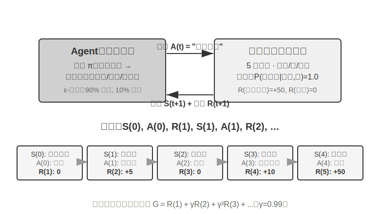

互動產生**軌跡**——即「狀態→動作→獎勵→新狀態→動作→獎勵……」的完整記錄，策略的優劣最終體現在軌跡質量上。**價值函式（Value Function）**回答的是這麼問題：「如果我現在處於這個狀態，按照當前策略一直行動下去，最終總共能獲得多少獎勵？」這就像一位經驗豐富的棋手看到一個局面時，不需要算到最後一步，憑直覺就能估計出這盤棋的勝率。（當這裡的「當前策略」換成「最優策略」時，得到的就是最優價值函式，本章後面講 Bellman 最優方程時會用到。）Agent 與環境的邊界遵循一個簡潔的原則：**凡是 Agent 無法任意改變的，都屬於環境**。

強化學習區別於監督學習（需要標註正確答案）和無監督學習（發現資料中的隱藏模式）的兩個獨特特徵是**試錯搜尋**（Agent 必須自己摸索哪些動作好，沒有老師直接告訴正確答案）和**延遲獎勵**（動作的影響可能在多步之後才顯現，比如一步好棋的價值到終局才看得出來）。由此還帶來獨特的**探索與利用權衡（Exploration-Exploitation Tradeoff）**：一直走熟悉的路，學不到新東西；一直亂試，永遠到不了終點。

強化學習系統包含五個處理器核要素：

- **動作空間**：定義 Agent 可以採取的所有行動集合。動作可以是離散的（如棋類中「走哪一步」，選項有限）或連續的（如機器人「關節轉多少度」，是一個連續數值）。
- **策略**：Agent 的行為準則，規定在給定狀態下應該怎麼做。策略可以很簡單（一張查詢表：看到狀態 A 就執行動作 X），也可以很複雜（一個深度神經網路）。
- **獎勵訊號**：環境給出的即時回饋。但 Agent 的目標是最大化長期而非即時獎勵——這個區別至關重要，就像投資不能只看今天漲跌，要看長期回報。
- **價值函式**：估計從某個狀態出發，未來總共能獲得多少累積獎勵，幫助 Agent 在沒有即時回饋時做出明智決策。過去六十年 RL 研究最重要的認識之一就是價值估計的核心地位。
- **環境模型**（可選）：預測環境對動作的響應。有了環境模型的方法稱為**基於模型的方法**（先學會預測環境怎麼變化，再據此規劃），沒有環境模型的稱為**無模型方法**（不去預測環境，直接從經驗中學習）。

表 7-3 對比了各種 Agent 系統的關鍵組成要素，揭示了 Agent 概念的普遍性，並幫助讀者看到傳統 RL Agent 與現代 LLM Agent 在動作空間上的差異。

表 7-3 不同 Agent 系統的關鍵要素對比

| Agent 型別 | 環境 | 動作空間 | 獎勵訊號 |
|---------------|---------------------|----------------------------------|-------------------------|
| **新生小羚羊** | 地形、重力、身體姿態 | 連續高維（各肌肉群收縮） | 平衡(+)、跌倒(-) |
| **掃地機器人** | 房間佈局、電量 | 離散（方向、吸塵、充電） | 清潔面積(+)、電量耗盡(-) |
| **西洋棋大師** | 棋盤狀態、時間限制 | 離散有限（合法走法） | 贏棋(+1)、輸棋(-1) |
| **客戶服務 Agent** | 對話歷史、知識庫 | 開放式（思考、說話、API 呼叫） | 問題解決(+)、處理時間(-) |
| **程式碼助手 Agent** | 需求文件、程式碼庫 | 開放式（思考、搜尋、編輯、執行） | 測試透過(+)、引入 bug(-) |

表格揭示了一個重要洞察：傳統 RL Agent（棋類、機器人）的動作空間是封閉的，而基於 LLM 的現代 Agent（客戶服務、程式碼助手）的動作空間是開放的、幾乎無限的，並且可以利用「內部思考」這種特殊動作來提升能力。

### 兩種 Agent 正規化：從 MDP 到 LLM+RL

兩者最根本的差異在於動作空間——MDP 假設動作空間是有限且封閉的（向上/向下/拿/放），而 LLM 的動作空間是開放的、組合爆炸的自然語言序列。這一差異決定了兩類正規化在演算法設計、樣本效率、泛化能力上的根本分野。下面分別展開。

**傳統正規化：MDP 與 Q-learning。**

MDP（Markov Decision Process，馬爾可夫決策過程）是強化學習的數學框架，定義了狀態、動作、獎勵等核心要素。它的核心假設是**馬爾可夫性質**：未來只取決於當前狀態，與更早的歷史無關。打個比方，下棋時只看當前棋盤局面就足以決定最優走法，不需要回顧之前每一步是怎麼下的。這個假設簡化了問題，但也限制了對歷史依賴的建模能力。

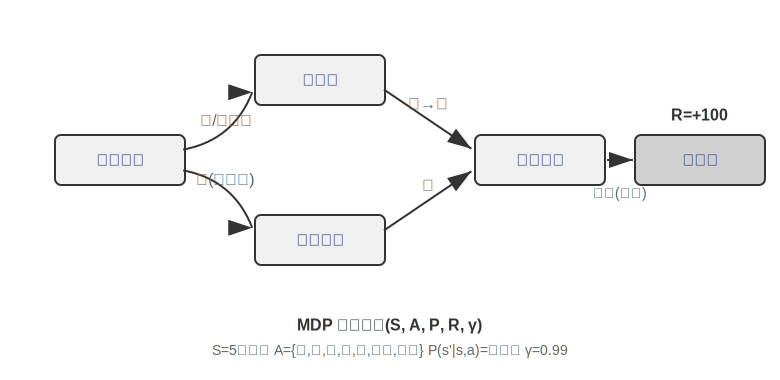

傳統 RL Agent 的關鍵特徵是**封閉動作空間**——Agent 可採取的所有行動形成預定義的有限集合。**經典棋類 Agent** 是最典型的例子：圍棋 361 個落子位置雖龐大但完全確定有限，西洋棋考慮不同棋子移動規則但動作仍可列舉，Atari 遊戲只有幾到十幾個離散動作。**機器人 Agent** 代表連續但有界的動作空間：關節角度、速度、抓取力度是連續值，但都有明確物理邊界（最大旋轉角度、最大扭矩、速度限制），維度由機器人自由度決定。

這種封閉性帶來計算上的優勢：可以列舉所有動作逐一評估，便於動態規劃和蒙特卡洛樹搜尋，動作價值函式可以用表格或簡單函式來近似。但它也限制了表達與泛化能力。傳統 RL Agent 從零開始，純粹靠試錯學習——從隨機策略出發，收集經驗，更新價值函式或策略，如此反覆直到收斂。

在這個框架下，最基礎也最重要的演算法之一是 **Q-learning**。它為每個「狀態～動作」組合維護一個價值估計：在狀態 s 下采取動作 a，之後一直按最優策略行動，總共能拿到多少獎勵？直覺上，一個動作好不好，取決於它帶來的即時回報，再加上「它把你帶到的下一個狀態有多好」。

把這個直覺寫成等式，就是 RL 教科書裡大名鼎鼎的**貝爾曼方程**（Bellman equation）的核心遞迴關係：**一個動作的真實價值 = 這一步拿到的即時獎勵 + 到達下一個狀態後能拿到的最大未來價值**：

$$Q^*(s, a) = r + \gamma \max_{a'} Q^*(s', a')$$

其中 $r$ 是即時獎勵，$s'$ 是執行動作後到達的下一個狀態（這裡為直覺起見寫成確定性形式，隨機環境下需對下一個狀態 $s'$ 取期望），$\gamma \in [0, 1)$ 是**折扣因子**——它決定 Agent 有多看重未來：$\gamma$ 越接近 1 越重視長期回報，越接近 0 越只顧眼前。前文反覆出現的「累積獎勵」，正是各步獎勵按 $\gamma$ 逐步折扣後的總和 $\sum_{t} \gamma^{t} r_t$。演算法每次行動後，把舊的估計值往「實際發生的結果」方向微調一點——這種「用一步實際結果修正舊估計」的正規化叫**時序差分學習**（Temporal-Difference Learning, TD learning），經過成千上萬次試錯，估計值逐漸逼近真實值。

以下兩張圖分別展示 Q-learning 在網格世界中的探索過程與 Q 值的逐步收斂。

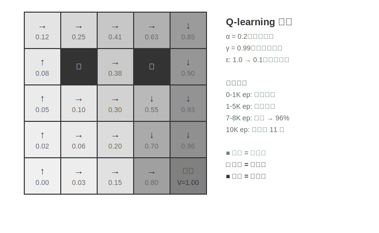

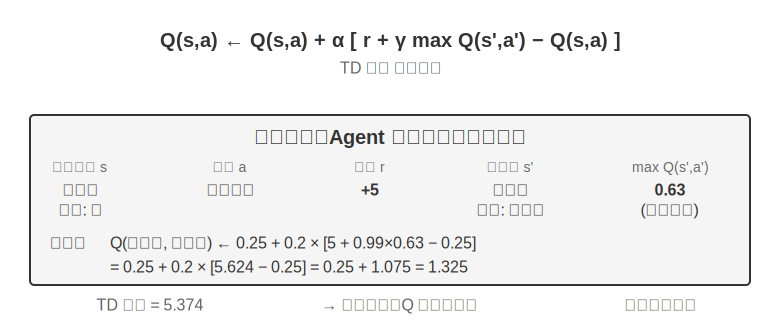

Q-learning 屬於一種特殊的**離軌策略**（Off-Policy）方法——它可以用任意策略（包括隨機探索）產生的資料來學習最優策略。在軌/離軌策略的嚴格定義與在 LLM 後訓練中的對應關係，見後文「強化學習演算法比較」一節。

> **實驗 7-1 ★：Q-learning 在尋寶遊戲中的表現**
>
> 為了驗證 Q-learning 的特性與侷限，我們設計了一個**尋寶遊戲環境**。這個環境包含幾個關鍵挑戰：**隱藏機制**要求 Agent 自行發現鑰匙和門的對應關係、武器效果和物品合成規則；**多步依賴**意味著完成任務需要正確的動作序列（最優解 11 步）；**稀疏獎勵**意味著只有關鍵動作和最終勝利才有顯著獎勵，中間大部分步驟得不到任何回饋。
>
> Q-learning Agent 使用標準引數配置，採用 ε-貪婪探索策略（大部分時間選當前最優動作，偶爾隨機嘗試，隨著訓練推進逐漸減少隨機探索的比例）。
>
> 學習曲線展現典型特徵（episode 指一局完整的遊戲，從開局到通關或失敗算作一次）：
> - **前 1000 episodes**：0% 勝率，Q 表僅 124 個狀態，Agent 在盲目探索
> - **前 5000 episodes**：依然沒有穩定勝利，Q 表 133 個狀態
> - **7000-8000 episodes**：勝率從 34% 逐步升至 96%
> - **10000 episodes**：100% 勝率，Q 表 145 個狀態，找到 11 步最優解
>
> 整個訓練僅需不到 10 秒（模擬效率極高），但需要將近 10000 次完整嘗試。這展示了 Q-learning 的核心特徵：需要大量隨機探索才能偶然走通完整路徑，價值訊號的傳播很慢，必須反覆強化。純符號化學習在沒有先驗知識時只能暴力搜尋狀態空間。
>
> 在遊戲模擬器中，10000 輪試錯只需 10 秒，代價微乎其微。但在真實世界的 Agent 場景中——每次打電話有成本、每次操作瀏覽器有延遲、每次錯誤決策可能造成不可逆後果——10000 次試錯是完全不可接受的。這正是為什麼現代 Agent 轉向了基於 LLM 的方法：利用預訓練積累的知識，在極少的互動中做出有效決策。
>
> MDP 的根本侷限有三點：樣本效率低（需要海量互動才能學會簡單任務）、泛化能力差（在一個環境學到的知識很難遷移到另一個環境）、無法利用先驗知識（每個新任務都要從頭學起）。一旦面對自然語言或高維視覺這類複雜狀態空間，這些侷限就尤為突出。
>

**現代正規化：基於 LLM+RL 的 Agent。**

大語言模型帶來了全新的 Agent 正規化，根本性地改變了 Agent 的建構方式——特別是動作空間設計。

傳統 RL 的 Agent 只能透過改變環境來獲得回饋：下一步棋、走一步迷宮。但 LLM 帶來了一種全新的動作型別：內部思考。思考不會改變外部世界，但它能顯著改善最終的行動質量。這個轉變改變了一切：Agent 的動作空間不再只是「做什麼」，還包括了「想多久、想什麼」。

最重要的創新是**將思考（Thinking）作為一種特殊動作**納入動作空間。在傳統 RL 中，Agent 只能執行改變環境狀態的外部動作（移動、攻擊、拾取）；而在 LLM Agent 中，**內部思考成為動作空間的核心組成部分**——它不直接改變外部環境，沒有即時獎勵，幾乎不限次數，成本也較低。

傳統 RL 難以處理這類動作，根源在於探索空間太大且缺乏結構：從零學習的 Agent 就像蒙著眼在沙漠裡找寶藏，只能隨機亂撞。LLM 則不同。透過海量文字預訓練，它已經內化了人類沉澱的思考規則：解數學題時遵循「識別條件→回憶公式→逐步計算」，寫程式碼時遵循「理解需求→設計結構→實現細節」。這使 LLM 的思考沿著有結構的路徑前進，極大地壓縮了搜尋空間。因此即使沒有額外的 RL 訓練，預訓練後的 LLM 也能生成具備基本邏輯的思維鏈（Chain of Thought, CoT）。這種基本邏輯來自預訓練語料中海量的人類思考過程（數學解題、程式碼註釋、辯論回應等），模型透過 next-token prediction 隱式學會了「下一步應該是什麼樣的推理形態」。

RL 後訓練則透過外部獎勵教會 LLM 在特定任務中更高效地運用這些規則。語言結構本身也提供一種隱性的內部獎勵——邏輯連貫的思維鏈（如「需要將外幣換算成美元，所以第一步查詢匯率」）生成機率高，邏輯混亂的（如「需要換算貨幣，所以先了解天氣」）機率極低，天然引導模型偏好合理路徑。

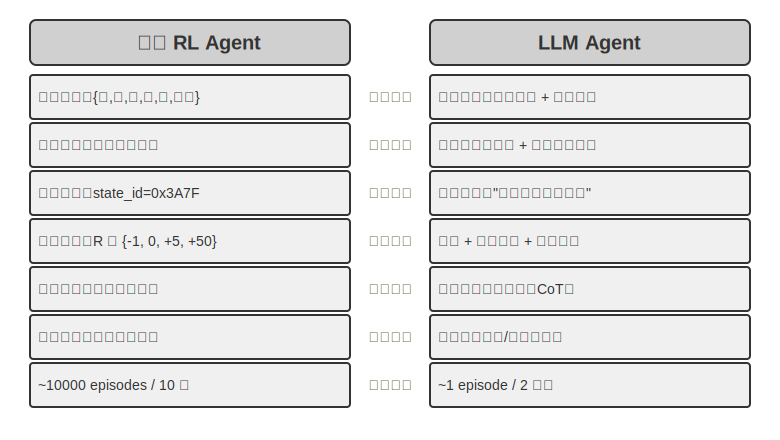

這種基於語言內在規則的思考能力，使 LLM Agent 能夠理解從未見過的指令（零樣本泛化），也能透過極少示例掌握新任務（少樣本適應）——這與傳統 MDP Agent 必須大量試錯的正規化截然不同。新正規化還具備組合泛化（把已知概念重新組合來應對新情況）、上下文學習（透過提示和示例快速適應）以及多模態理解（自然整合視覺、語言、動作等模態）等能力。上下文學習的**效果**（零樣本泛化、少樣本適應）和它的**內部機制**是兩回事——第二章分析過，注意力機制的工作方式更像檢索而非推理，但這不妨礙它在任務適應方面產生強大的實際效果。

從封閉到開放的動作空間演進，反映了 AI Agent 正規化的根本轉變。除內部思考外，工具引數的多樣性（自然語言查詢、程式碼、複雜 JSON、多模態內容）使實際動作空間接近無限——一個程式碼直譯器理論上可執行任何可計算的任務，一個搜尋工具可探索整個網際網路的資訊空間。這既帶來新機遇（Agent 可處理前所未見的任務、透過組合基礎工具解決複雜問題），也帶來新挑戰（如何在開放環境中定義和最佳化獎勵函式、如何在無限動作空間中高效搜尋）。

以 Kimi K3 這類面向工具呼叫和長鏈思考最佳化的模型為例，可以看到 LLM+RL 正規化的典型方向：在大規模語言預訓練基礎上，透過後訓練強化問題分解、工具呼叫和自我糾錯能力。**OpenVLA**（詳見第九章）則展示了 LLM 時代的 VLA（視覺～語言～動作）架構正規化：視覺編碼器處理環境觀察、語言模型理解指令並推理、動作解碼器生成控制訊號，實現語言條件控制與跨任務泛化。需要澄清的是，OpenVLA 本身是在近百萬條機器人**演示軌跡**上透過模仿學習（行為複製）訓練的，屬於 SFT 性質而非 RL；真正把 RL 引入機器人、在這類 VLA 架構之上用獎勵進一步最佳化的代表，是本章後面實驗 7-13 的 SimpleVLA-RL。

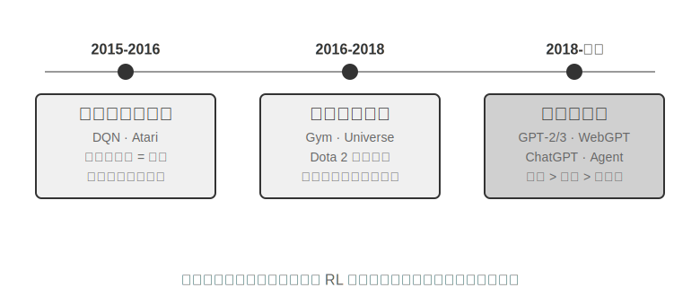

**OpenAI 的探索之路**（姚順雨（普林斯頓大學助理教授、ReAct 論文作者）在《The Second Half》中詳細記錄）揭示了認知上的演變。**第一階段（2015-2016）演算法中心主義**：相信更好的演算法才是關鍵，在 Atari 等標準環境取得進展，但換一個新環境就得從頭訓練。**第二階段（2016-2018）環境的重要性**：Gym 標準化了各類任務，Universe 和 World of Bits 試圖把整個網際網路變成 RL 的訓練環境，Dota 2 在特定複雜環境中追求超人表現。思路很清晰，但通用電腦使用和網頁導航始終無法突破。

**第三階段（2018 至今）先驗的覺醒**：GPT-2/GPT-3 展示了語言預訓練的強大力量，WebGPT、ChatGPT 證明這些先驗知識可以轉化為實用 Agent。最重要的發現是：**先驗知識可以透過與 RL 完全無關的方式獲得**。這是反直覺的真相：幾十年來 RL 研究者的優先順序可能完全顛倒了——不是演算法 > 環境 > 先驗，而是先驗 > 環境 > 演算法。

> **實驗 7-2 ★★：傳統 RL 與 LLM Agent 的對比研究**
>
>
> 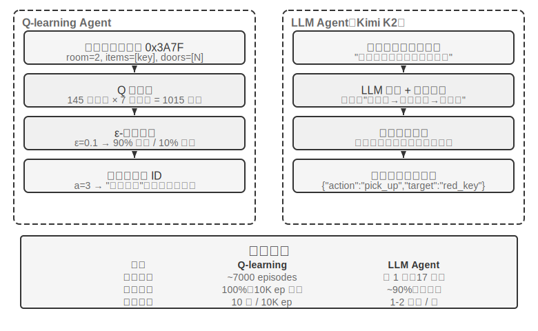
>
>
> 在同一個尋寶遊戲中對比 Q-learning 與 LLM Agent（Kimi K3，維護最多 50 條經驗的緩衝區）。結果令人震撼：**LLM Agent 第一局就在 18 步內通關**。
>
> **前期（有目的的探索）**：拿起生鏽的劍（「武器總比空手好」），系統探索地圖，發現北門被鎖後推理 「需要找鑰匙」，轉而探索儲藏室，先後取得紅鑰匙與魔法水晶。**中期（機制理解與主動合成）**：理解 「鑰匙自動使用」 規則，並預判生鏽的劍不足以對付守衛，於是在第 8 步主動合成銀劍。**後期（執行與糾錯）**：持銀劍向北，第 13 步擊敗強守衛，其間夾雜一兩步無效嘗試（重複揮劍/回退），最終在第 18 步取得巨龍寶藏。
>
> 這展現了語義理解與符號對映之間的根本差異。LLM Agent 理解了遊戲的概念結構，每一步都有目的和邏輯支撐。而對 Q-learning 來說，「門」「鑰匙」「劍」只是無意義的符號組合，只能透過大量統計學習慢慢發現它們之間的關係。
>
> 計算成本形成了一個有趣的悖論：Q-learning 跑 10000 局只需 10 秒，LLM Agent 一局卻要 1-2 分鐘。但在現實任務中，每次互動的時間、金錢和風險成本遠超純計算成本，所以單看 GPU 時間並不公平。更關鍵的洞察是：LLM Agent 的成功不是因為擁有更好的「學習演算法」，而是因為攜帶了海量先驗知識。當遊戲規則變化時，Q-learning 需要完全重新訓練，LLM Agent 卻能透過推理直接適應。由此可以得出實用的設計原則：在模擬成本低、可大量重複的場景中，傳統 RL 仍然有價值；在互動成本高、需快速適應的現實場景中，LLM Agent 的樣本效率更為實際。
>

至於上下文學習、外部化學習與引數化學習（後訓練）這三種學習正規化各自的定位與協同，第一章已有系統對照，本章末尾的「完整圖景」也會回到這個話題。本章的主線是其中的後訓練——把互動策略寫進模型引數。

## 模型預訓練基礎 `[可選閱讀]`

要理解後訓練技術為什麼有效，需要先明白預訓練建立了什麼。後訓練（SFT 與 RL）本質上是在預訓練建立的表徵空間內進行最佳化——預訓練奠定的知識結構決定了後訓練的天花板。因此，我們透過三個實驗考察預訓練的核心環節：從頭訓練小規模語言模型、擴充套件視覺能力、以及注入新語言知識。本節三個實驗為輔助性內容，幫助讀者建立對預訓練（Pretraining，即在大規模資料上訓練，讓模型學會語言的基本規律和世界知識）的直覺——已熟悉預訓練流程的讀者可跳過。

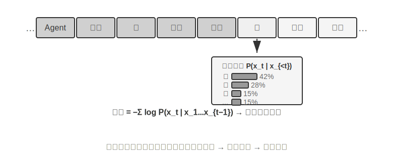

語言模型訓練遵循「tokenization—預訓練—後訓練」三階段流程。Tokenization（詞元化）將文字切分為離散單元，比如「我喜歡程式設計」可能被切分為「我」「喜歡」「編」「程」四個 token——這些 token 就是模型處理文字的最小單位。預訓練的任務概念上很簡單：給模型看一段文字的前半部分，讓它預測下一個 token 是什麼。模型透過比較自己的預測與正確答案的差距（這個差距叫做損失（Loss），損失越小說明預測越準），不斷調整自身引數。在海量文字上反覆訓練後，模型逐漸學會了語言規律、世界知識與基本推理能力。預訓練完成後，模型能生成流暢文字，但輸出缺乏結構、難以遵循指令。後訓練透過 SFT（用標註好的輸入～輸出對訓練）與偏好最佳化（如 DPO，讓模型學會生成人類更偏好的回答）將其轉化為實用助手。

> **實驗 7-3 ★★：從頭訓練 LLM——演算法改進的威力**
>
> 以 MiniMind 2（一億引數）為案例，在消費級 GPU 上完成完整訓練流程。透過引入兩項演算法最佳化（QK Norm 和 Muon 最佳化器），收斂速度提升 3 倍，生成質量顯著改善——實現成本極低，總訓練約 14 小時，成本約 34 美元。
>
> 各訓練階段的效果：預訓練後模型可以回答「世界上最高的山峰」等事實性問題，但格式不規範；SFT 後指令遵循與輸出格式顯著改善，能按期望方式組織答案；偏好最佳化進一步減少了事實錯誤與不自然表達。一億引數的模型仍有明顯侷限（複雜問題容易出錯），但啟示是：**在固定的小規模預算下，演算法改進比單純堆規模更具價效比**。
>
> **實驗 7-4 ★★：自己訓練 VLM**
>
>
> 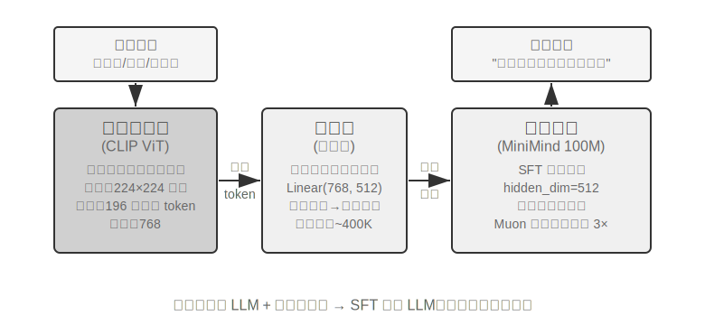
>
>
> VLM 將視覺感知與語言理解統一在一個模型中，核心挑戰在於跨模態對齊——讓「看到的」和「說出來的」對應起來。架構由三個元件構成：**視覺編碼器**（如 CLIP，引數固定）提取影象的語義特徵；**投影層**（輕量級，唯一從頭訓練的部分）充當視覺特徵與語言模型之間的「翻譯官」，將視覺特徵對映到語言模型能理解的表示空間；**語言模型**生成描述文字。訓練採用「凍結 LLM + 只訓練投影層」的策略，以避免災難性遺忘（Catastrophic Forgetting，即學了新技能後把舊技能忘了）；預訓練對齊後再解凍 LLM，用高質量影象～描述對做 SFT，描述的詳細程度與準確性顯著改善。
>
> 本實驗揭示了多模態模型訓練的基本正規化：複用單模態預訓練成果，透過訓練一個輕量投影層實現跨模態對齊——高效且可擴充套件，但投影層的表達能力有限，可能成為跨模態深層理解的瓶頸。同樣的「視覺編碼器 + 投影層 + LLM」骨架再向前延伸一步、讓模型輸出動作，就是第九章將展開的 VLA（視覺～語言～動作）模型。
>
> **實驗 7-5 ★★：繼續預訓練學習新語言**
>
> 以 Mistral 7B v0.3 為基礎（主要用英語預訓練，對韓語幾乎沒有理解能力），透過韓語維基百科繼續預訓練來注入韓語能力——在已完成預訓練的模型上用新語言資料繼續做無監督訓練，模型已具備通用語言建模能力，只需適應新的資料分佈，成本遠低於從頭訓練。關鍵工程點是用混合資料（約 80% 韓語 + 20% 英語）緩解災難性遺忘：目標語言佔比過高會導致原語言退化，佔比過低則學習效率不足。最後用韓語指令資料做 SFT，獲得實用的韓語對話能力。本實驗的結論會在本章末尾的完整圖景中再次用到：要讓模型記住大量新領域知識，靠的是繼續預訓練而非 SFT。
>

三個預訓練實驗共同揭示了一個規律：在預算受限時，演算法改進與架構創新比單純擴大規模更具價效比。預訓練賦予模型的是描述性知識與語言建模能力，缺乏結構化的指令遵循和任務導向行為——這正是 SFT 需要填補的空白。

有了預訓練的基礎能力，下一步就是透過後訓練把通用模型變成實用的 Agent。後訓練的第一階段是監督微調（SFT）。

## SFT（監督微調）

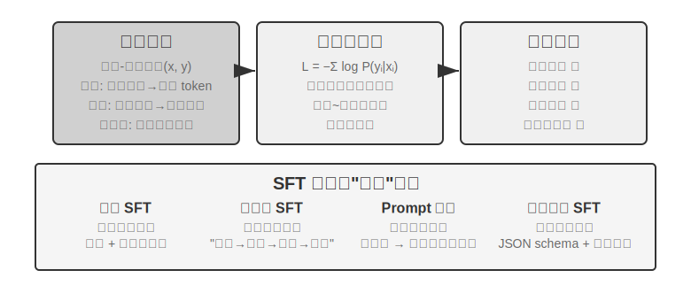

7.1 節已經講透了 SFT 的本質（換了資料、只在回答上算損失的「預測下一個詞」）。這一節用四個實驗，看看這套「把穩定對映與協定寫進引數」的機制在不同任務上具體固化了什麼。SFT 的核心價值不在於注入新知識，而在於**固化協定**：把對映關係、互動格式、風格規範寫入引數，使推理時無需冗長提示即可產出符合預期的輸出。通常只需數千到數萬條高質量樣例，即可建立基本的對話能力與指令遵循。

高效性的代價是對訓練分佈的強依賴：SFT 傾向於記憶而非泛化，一旦測試時遇到訓練中沒見過的情況，效能往往明顯下降。接下來的實驗將從不同角度展示這一「固化協定」的過程。

> **實驗 7-6 ★★★：語音 SFT——從 「聲音複製」 到 「副語言建模」 `[擴充套件實驗]`**
>
> 以 Orpheus（語境提示 voice cloning）與 Sesame（副語言標記建模）為物件，展示如何將「聲音風格與表達習慣」寫入引數。兩者思路不同：
>
> - **Orpheus**：把聲音波形壓縮為 token 序列，透過拼接同一說話者的參考音訊，讓模型學會「用這個人的聲音說話」，實現跨句音色一致。
> - **Sesame**：將笑聲、嘆氣等副語言現象抽象為 `<laugh>`、`<sigh>` 等特殊標記，訓練模型學會「看到標記就發出對應的聲音」。
>
> SFT 在表達型任務中固化的是風格控制協定與結構化表達習慣，而非事實知識或複雜思考。關鍵在於訓練資料的多樣性和標註質量。常見失敗模式：訓練資料中說話者過少導致所有人聽起來一個腔調；標記過擬合（Overfitting，即模型死記硬背了訓練樣本的細節，遇到新情況反而表現更差）產生「機械笑」。
>
> **實驗 7-7 ★★★：多語言思考——讓模型用任意語言思考 `[擴充套件實驗]`**
>
> 大多數思考模型只會用英語「思考」：不管你用什麼語言提問，模型內部的思維鏈幾乎都是英文的，因為訓練資料中高質量的思考示範基本都是英語寫的。本實驗的目標很簡單——讓模型能夠用指定的語言進行思考。
>
> 做法是對 gpt-oss-20b 進行 SFT：在系統指令中加一句 `reasoning language: German`（或其他語言），然後用英語、西班牙語、法語等幾種語言的思考樣例訓練。訓練資料中**完全沒有中文**，但訓練完成後，只要把 reasoning language 設為 Chinese，模型就能用中文進行完整的思維鏈思考——這種零樣本的跨語言泛化是本實驗最有意思的發現。需要注意，這並非 SFT 本身的泛化能力。多語言預訓練已經在模型中建立了跨語言的共享表徵空間，SFT 只是啟用了這種預訓練時已有的跨語言能力。
>
> **實驗 7-8 ★★：Prompt 蒸餾——以更小開銷復現可用能力**
>
> 在實際應用中，為了讓模型完成複雜任務，常常需要設計冗長的系統提示（數千甚至上萬 token），每次呼叫都會增加延遲與費用。使用思考型大模型時，內部思考 token 進一步放大成本。Prompt 蒸餾的思路是把「長提示 + 思考型教師」的行為壓縮到「短提示/無提示 + 非思考學生」中。教師在完整提示與思考模式下生成高質量答案，訓練資料只保留使用者輸入與最終結論，丟棄冗長提示與中間思考過程。學生學會「直接給出結論」，蒸餾後在相同輸入上接近教師的輸出質量，同時因為不需要處理冗長提示和思考 token，延遲與費用顯著降低。
>
> 蒸餾可以在兩個維度進行：「大到小」（用中小模型替代大模型，在成本和質量之間取得折中）和「思考到非思考」（同等規模下把顯式 CoT 摺疊為隱式引數化知識，獲得 20-30 倍的響應速度提升）。兩者並不衝突，在生產環境中經常同時使用。蒸餾會繼承教師的邊界——若教師在長尾分佈上有系統性錯誤，學生會進一步硬編碼這些錯誤；若教師依賴工具來確保正確性，單純的輸出蒸餾會失去工具帶來的魯棒性。工程啟示：當產品形態穩定、輸入分佈可預期、成本約束明顯時，Prompt 蒸餾是很好的最佳化手段；而在探索期或任務尚未定型的階段，保留顯式思考與可編輯的提示工程仍是快速試錯的核心。
>
> **實驗 7-9 ★★★：思維鏈（Chain of Thought, CoT）蒸餾 `[擴充套件實驗]`**
>
> Prompt 蒸餾丟棄思考過程，CoT 蒸餾則相反：把強教師模型的**完整思考軌跡**轉移給學生模型。對能力較強的教師模型進行 CoT 蒸餾，在同等引數量下可恢復教師 70%-80% 能力。對於不追求重新整理前沿能力邊界、但尋求自主可控模型的團隊，這是最務實的追蹤者策略。DeepSeek-R1 釋出時同步開源的一系列蒸餾小模型（用 R1 的思考軌跡對 Qwen、Llama 系列做 SFT），正是這條路線的代表。
>
> **背景：「思維圍牆」現象**。一些閉源思考模型（如 OpenAI o 系列、Gemini 系列）在思考時會生成內部思維鏈，但使用者看到的並非原始思考過程——廠商出於防蒸餾、安全和產品體驗等考慮，通常會在輸出前對 CoT 進行改寫或摘要，最有價值的原始思考過程被隱藏在 API 之後。這正是本實驗選擇開源思考模型作為教師的原因：DeepSeek-R1、QwQ 等模型在 `<think>` 標籤中公開完整思維鏈，蒸餾在技術與許可上都可行（使用前仍應確認模型許可證對蒸餾產物的授權條款）。
>
> **實驗設計**：三步流程。第一步，**採集軌跡**：從目標任務分佈（如數學、程式碼）取樣問題，用開源教師模型生成完整的「思考 + 答案」軌跡，並用規則驗證器過濾掉最終答案錯誤的軌跡——否則錯誤的思考過程會被學生一併模仿。第二步，**SFT 訓練**：以「問題 → `<think>` 思考軌跡 `</think>` + 最終答案」為訓練對，對小模型（如 7B 量級）做標準 SFT。第三步，**對比評估**：在同一基準上對比蒸餾前後的學生模型與教師模型，衡量能力恢複比例。
>
> **驗收標準**：蒸餾後的學生模型在數學/程式碼基準上相對蒸餾前顯著提升，且思考軌跡中出現教師式的反思、回溯與驗算行為。同時注意蒸餾的代價：學生會繼承教師的系統性錯誤和冗長思考習慣（後者可結合實驗 7-10 的 AdaptThink 思路做二次最佳化）。
>

這四個實驗有一個共同特徵——「把穩定的對映與協定寫進引數」：語音 SFT 固化風格控制協定，多語言 SFT 固化思考組織範本，蒸餾 SFT 固化輸入到輸出的直接對映。它們的共性是目標明確、格式清晰、評估標準穩定，因此 SFT 能以極高的樣本效率達成收益；而一旦分佈變化，記憶傾向就會暴露為效能下降。這正是 7.1 節「SFT 與 RL 的本質區別」所講的記憶—泛化分野在實驗層面的體現。

## 何時選擇 SFT，何時選擇 RL

7.1 節講清了 SFT 與 RL 的**本質區別**，這一節回答一個更實操的問題：**面對一個具體任務，到底該用哪一個？** 下面的決策框架部分結論會在後續 RL 實驗（實驗 7-10、實驗 7-11）中進一步驗證，讀者可先建立初步判斷，讀完 RL 部分再回來對照。

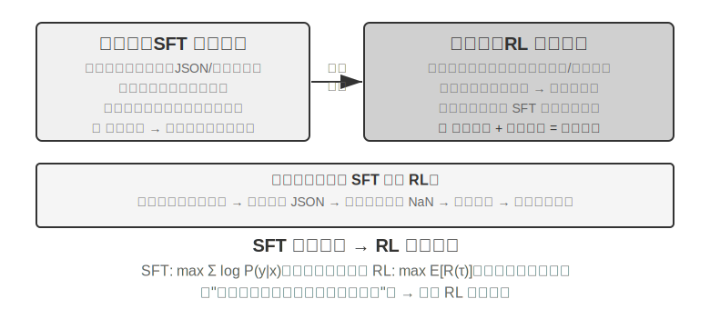

**SFT 適用於**格式固化（JSON 輸出、對話風格）、擁有高質量專家示範、訓練與部署環境高度一致的場景。**RL 必須介入的場景**則不同：當實際部署環境與訓練環境存在系統性差異時（比如訓練時卡牌 J/Q/K 都是 10，部署時變成了 11/12/13——規則變了；或者訓練時用黑色花色，部署時遇到紅色花色——外觀變了），需要探索最優策略（專家示範本身不一定最優），或者標註成本過高、無法為每條路徑都提供示範時，就需要 RL。

最穩健的策略是**「先 SFT 後 RL”**兩階段流程。SFT 的主要目標不是追求任務效能的極致，而是建立輸出的**格式穩定性**——確保模型能產出可解析的 JSON、正確的工具介面呼叫。只有輸出格式穩定後，RL 的獎勵訊號才能被可靠地計算。直接在未經 SFT 的基礎模型上做 RL，往往會因為輸出格式混亂、獎勵無法計算而訓練失敗——不過這個結論有邊界條件：它來自『較小基礎模型 + 嚴格結構化輸出要求』的設定（如後文實驗 7-11）。DeepSeek-R1-Zero 證明了足夠強的基礎模型可以跳過 SFT、直接 RL 成功，湧現出反思與長鏈思考能力——代價是輸出可讀性差、多種語言混雜，這正是 DeepSeek 最終在 R1 中加回『冷啟動 SFT』的原因。R1 從 Zero 到冷啟動的這段往返是『先形後神』的最好例證：RL 能自己長出『神』（策略與推理能力），但『形』（格式與可讀性）還是靠 SFT 立得又快又穩。

兩者各有代價：SFT 樣本效率高、收斂快，但泛化受限；RL 能學到可遷移的策略，但樣本效率低且訓練不穩定。一個實用的判斷標準是：當「無論怎麼增加示範資料，新場景的表現仍然上不去」時，就是該轉向 RL 的臨界點——問題的根源不在示範數量，而在 SFT 的最佳化目標本身。

實際決策時，可以按以下順序考慮：

1. **先問：需要後訓練嗎？** 如果透過 Harness 工程（最佳化 prompt、工具設計、上下文管理）就能解決問題，不需要訓練模型。大多數 Agent 應用落在這裡。
2. **如果需要訓練：先試 SFT。** 適用於固化輸出格式（JSON schema、API 呼叫格式）、固化協定性知識（術語的用法、輸出格式、流程習慣，即「該怎麼說、怎麼做」）、統一風格（語氣、長度）。但注意 SFT 不適合注入大量事實性知識（「知道什麼」）——那需要繼續預訓練或交給 RAG（詳見本章末「完整圖景」）。SFT 成本低、見效快。
3. **SFT 不夠時：加 RL。** 適用於需要泛化到新場景、需要探索最優策略、或標註成本過高的情況。務必先用 SFT 穩定輸出格式，再在其基礎上做 RL。

## 單輪強化學習：記憶與泛化的對照

「單輪」指任務在一次互動中完成：模型接收輸入、產出輸出、獲得獎勵，無需維護跨步驟的狀態。這種簡化設定讓我們能夠聚焦於 SFT 與 RL 在學習機制上的根本差異，而不被多輪互動的複雜性干擾。單輪場景提供了清晰的對照實驗條件：相同任務、相同基礎模型、相同計算預算，唯一的變數是訓練方法。第一個實驗展示 RL 如何學會「何時該思考」這一元策略；第二個實驗透過算術推理卡牌遊戲系統地量化「SFT 記憶、RL 泛化」。

在進入實驗之前，先建立一點關於 RL 演算法的**最小直覺**，以便理解後續實驗裡出現的術語（完整的公式與對比留到本章後面的「強化學習演算法比較」一節）。本章的 RL 訓練大多基於**策略梯度**：讓模型對同一個問題多生成幾條回答，獎勵高的回答就提高它出現的機率、獎勵低的就降低——「獎勵高的方向多走，獎勵低的方向少走」。為避免單次更新幅度過大把模型帶偏，主流的 **PPO** 演算法會裁剪每一步的更新幅度（後文實驗中出現的「帶價值網路的 PPO」即指此，價值網路用來估計基線、算出更細的優勢）；另一種 **GRPO** 則不訓練價值網路，而是用「同一問題的多條回答互相比較」來判斷每條的相對好壞。記住這條直覺，就足以讀懂接下來兩個實驗。

> **實驗 7-10 ★★：AdaptThink——學會 「何時不思考」**
>
> 大型思考模型（如 OpenAI o1、DeepSeek-R1）對所有問題都會生成冗長的思維鏈，在簡單問題上造成不必要的開銷。實驗首先驗證了一個直覺：**NoThinking 模式**（透過 `<think></think>` 跳過思考）在簡單問題上效能相當甚至更好，只有面對困難問題時 Thinking 的優勢才顯現出來。
>
> AdaptThink 透過 RL 訓練模型適應性地選擇模式。兩個處理器核元件：
>
> - **約束最佳化目標**：鼓勵 NoThinking 的同時確保整體效能不下降。
> - **重要性取樣策略**：平衡 Thinking/NoThinking 樣本，解決初始模型幾乎總選 Thinking 帶來的**冷啟動**問題（Cold Start，這裡特指訓練初期模型幾乎只產生 Thinking 樣本、NoThinking 分支樣本極少而學不起來的問題；它與前文 DeepSeek-R1 用少量示範資料做「冷啟動 SFT」是不同語境下的用法）。
>
> 這裡出現的「重要性取樣」是統計學常用的方法——在取樣分佈偏向某一類樣本時，透過給樣本加權來「糾正」分佈，讓學習訊號能夠公平覆蓋所有類別。本書後續討論的 PPO、DAPO 等 RL 演算法都會反覆用到這一思想。
>
> 評估結果：在多個數學基準上，響應長度減少 45%-64%，準確率不降反升。模型學會了根據問題特徵做選擇：結構清晰的簡單問題直接作答，需要多步推導的困難問題保留完整思維鏈，面對未見過的任務型別仍能正確判斷難度。
>
> 與 Prompt 蒸餾互補形成 「快～慢雙系統」：蒸餾降低需思考的任務比例，AdaptThink 最佳化剩餘任務的觸發策略，共同實現思考效率最大化。
>
> **實驗 7-11 ★★：GeneralPoints——單輪 RL 的 「記憶與泛化」 對照**
>
>
> 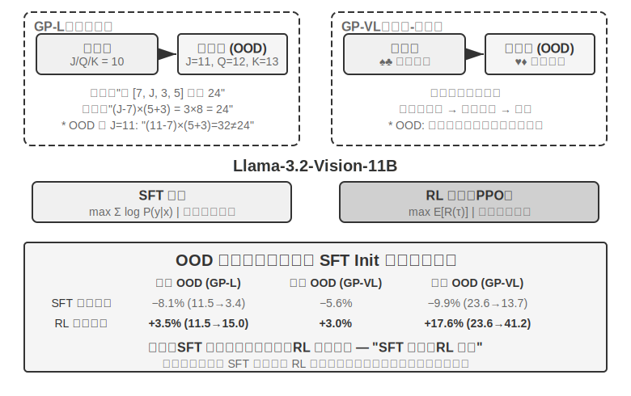
>
>
> GeneralPoints 是 Chu 等人（2025，《SFT Memorizes, RL Generalizes》，arXiv:2501.17161）提出的算術思考卡牌遊戲，專門用於評估模型的泛化能力。任務目標類似「24 點」遊戲：使用四張卡牌上的數字，透過加減乘除運算，每個數字恰好用一次，湊出目標數字 24。實驗設計了純文字 GP-L 與影象 GP-VL 兩個變體，使我們能在同一框架下分別考察規則泛化與視覺泛化。
>
> **規則變體**：訓練時 J/Q/K 都計為 10，測試時分別計為 11/12/13，確保測試集出現訓練未見的數字組合（含 11、12、13 的運算），嚴格評估泛化能力。**視覺變體**：訓練用黑色花色（♠♣），測試用紅色花色（♥♦），評估視覺外觀變化下的魯棒性。基於 Llama-3.2-Vision-11B，遵循標準後訓練流程：先 SFT 初始化使其具備基本指令遵循能力，然後在相同計算預算下分別擴充套件 SFT 與 RL 訓練（RL 部分採用帶價值網路的 PPO 演算法），用單一規則（J/Q/K=10）資料訓練，在分佈內（ID）與分佈外（OOD）測試集上評估。
>
> 結果清晰揭示根本差異。**規則 OOD**：RL 在 GP-L 上 +3.5%（11.5%→15.0%），SFT **下降** 8.1%（11.5%→3.4%）；GP-VL 上 RL +3.0%，SFT 下降 5.6%。**視覺 OOD**：RL 在 GP-VL 上 **+17.6%**（23.6%→41.2%），SFT 下降 9.9%（23.6%→13.7%）。
>
> 追蹤視覺識別準確率後發現：RL 透過結果導向的最佳化改善了底層視覺編碼器，且這種改善與整體效能提升高度相關；而 SFT 因為過度擬合思考過程中的 token 模式，忽視了對視覺 token 的學習，導致識別準確率反而下降。
>
> 實驗還揭示了 SFT 對 RL 的必要：在本實驗的設定下（Llama-3.2-Vision-11B 這個量級的基礎模型，加上嚴格的結構化輸出要求），未經 SFT 直接做端到端 RL 完全失敗——基礎模型無法產生結構化輸出，獎勵根本無法計算。注意這是特定設定下的結論而非普適規律：足夠強的基礎模型可以跳過 SFT 直接 RL 成功（見前文對 DeepSeek-R1-Zero 的討論）。另一個值得關注的發現是，驗證迭代次數越多泛化越好：10 次 +5.99% vs 1 次 +0.48%，說明思考時的計算擴充套件是 RL 泛化的關鍵。
>
> 為什麼 SFT 在分佈偏移下效能崩潰，而 RL 反而更好？SFT 學的是「看到這種輸入，就輸出那種答案」的對映：訓練時 J/Q/K 都是 10，模型就記住了「遇到 J/Q/K 就當 10 用」的固定模式；測試時 J=11，模型仍按 10 計算，自然出錯。RL 學的則是「怎樣的計算過程能得到正確答案」這一更通用的策略：J 變成 11 時，RL 模型會用同樣的策略重新計算，而不是套用記憶中的答案。這就是「記憶」與「泛化」的本質區別。
>
> 本實驗的核心貢獻在於系統量化了 「SFT 記憶、RL 泛化」 現象，證明該規律在純語言與視覺～語言兩種模態下都成立，揭示了 SFT 與 RL 的協同關係：SFT 提供格式穩定性，RL 在此基礎上突破記憶邊界，兩者缺一不可。這一 「先形後神」 的訓練正規化——借用中國畫術語，先把外在形態（格式、結構）畫準，再追求內在神韻（泛化、策略）——為後續多輪、多模態任務奠定了方法基礎。

## RLHF：從人類偏好到獎勵模型

前面的實驗有一個共同前提：任務有可驗證的對錯——算式對不對、格式合不合規，規則驗證器就能打分。但當前部署的對話模型之所以「像一個得體、安全的助手」，靠的是另一條更早成熟的路線：**RLHF**（Reinforcement Learning from Human Feedback，基於人類回饋的強化學習）。理解 RLHF，既是理解 ChatGPT 這類產品的對話質量與安全對齊從何而來，也是理解後文各演算法中 KL 懲罰、reward hacking 等概念的前提。

**InstructGPT 的三段式管線。** OpenAI 的 InstructGPT[^ch7-4] 確立了沿用至今的標準流程：

1. **SFT**：用人工示範的「指令—回答」對微調預訓練模型，建立基本的指令遵循能力——即前文「SFT（監督微調）」一節討論的內容。
2. **訓練獎勵模型（Reward Model, RM）**：對同一提示讓模型生成多個回答，人類標註員兩兩比較、標出更偏好哪個。用這些偏好對訓練一個打分模型，訓練目標基於 Bradley-Terry 模型：

   $$\mathcal{L}_{\text{RM}} = -\log \sigma\big(r(x, y_w) - r(x, y_l)\big)$$

   其中 $y_w$ 是被偏好的回答、$y_l$ 是被拒絕的回答，$\sigma$ 是 sigmoid 函式。直覺非常簡單：**讓 RM 給被偏好的回答打更高的分**。之所以採集比較而非打分，是因為人類很難一致地給出絕對分數（「這個回答值 7.3 分」幾乎無法標註一致），但「A 和 B 哪個更好」的判斷可靠得多。**記住「獎勵模型」這個角色——它是本章一條暗線**：這裡它是從人類偏好學出來的打分器；到 7.10 節講獎勵設計時，你會看到它的各種變體（只看最終結果的 ORM、逐步打分的 PRM、用自然語言講理由的生成式獎勵模型），以及一個特例——當對錯能用規則直接判定時，「獎勵模型」乾脆退化成一段確定性程式碼（這就是下面要說的 RLVR）。它們回答的都是同一個問題：**獎勵從哪來**。
3. **用 RM 打分做 PPO**：以 RM 的分數作為獎勵訊號，對 SFT 模型做 PPO 訓練（PPO 的機制見下一節），讓模型學會生成 RM 認為「人類會更喜歡」的回答。

**KL 懲罰：別離出發點太遠（把 KL 散度講透）。** RLHF 裡模型實際最佳化的獎勵，通常不是 RM 打分本身，而是減掉一個懲罰項：

$$r = r_{\text{RM}} - \beta \cdot \mathrm{KL}\big(\pi_\theta \,\|\, \pi_{\text{ref}}\big)$$

這一個式子裡有四個初學者常問的問題，逐個講清。

**（1）KL 散度是什麼，懲罰加在哪裡？** KL 散度（Kullback-Leibler Divergence）衡量兩個機率分佈的差異：兩個分佈越像，KL 越小，完全相同為 0；越不像，KL 越大。這裡的兩個分佈是**當前策略** $\pi_\theta$（正在訓練的模型）和**參考策略** $\pi_{\text{ref}}$（訓練起點，通常就是那個 SFT 模型）對同一段前文給出的「下一個 token 機率分佈」。$\beta$ 控制懲罰力度——訓練指令碼里常見的 `kl_coef` 超引數就是它。工程上，這個懲罰**按 token 逐位計算並加進獎勵**（per-token KL）：模型每生成一個 token，就比一下它和參考模型在這個位置的機率差，偏離越大、這一步的獎勵就被扣得越多。也就是說，KL 不是單獨的一項 loss，而是**摻進獎勵訊號裡**，再走 PPO/GRPO 那套優勢計算——這是它作用的確切位置。

**（2）方向為什麼是「當前策略在前、參考策略在後」？** KL 散度不對稱，$\mathrm{KL}(P\|Q)\neq\mathrm{KL}(Q\|P)$，方向不是隨便寫的。這裡寫成 $\mathrm{KL}(\pi_\theta\|\pi_{\text{ref}})$——當前策略在前——數學上叫**反向 KL（reverse KL）**。它懲罰的是「$\pi_\theta$ 在某處給了高機率、而 $\pi_{\text{ref}}$ 在該處幾乎為零」的情況，也就是**懲罰模型跑到參考模型認為不該去的地方**。這正是我們想要的：參考模型（SFT 模型）代表「說人話、格式正常」的安全區，反向 KL 把當前策略摁在這個安全區附近，不讓它亂飄。如果反過來用**正向 KL** $\mathrm{KL}(\pi_{\text{ref}}\|\pi_\theta)$，懲罰的將是「參考模型有、而當前模型漏掉」的模式——那會逼著模型去覆蓋參考模型的一切表達方式，恰不是 RLHF 的目的。

**（3）為什麼這麼設計？——mode-seeking 的由來。** 反向 KL 有一個關鍵性格：它是 **mode-seeking（尋峰）** 的。7.1 節埋過這個伏筆——反向 KL 允許模型**只保留少數幾個高獎勵的「峰」、果斷丟掉其餘模式**，而不必像 SFT 的極大似然（mass-covering，覆蓋式）那樣雨露均霑。放到 RLHF 裡，這正是我們要的效果：在 RM 認可的高分回答方式裡挑一兩種穩定輸出，而不是把所有可能的回答都學一遍。這也解釋了 RL 後的模型為什麼更「篤定」、多樣性更低。反向 KL 的 mode-seeking + 把模型摁在參考分佈附近，兩者合起來就是 RLHF 穩定的秘訣。

**（4）不加會怎樣？** 直覺是一句話：**別離出發點太遠，否則獎勵模型的分數不可信。** RM 是在參考策略附近的輸出分佈上訓練出來的，模型一旦被最佳化到 RM 沒見過的分佈上，RM 打分就成了沒有依據的外推，高分不再等於高質量。所以 KL 懲罰同時防兩件事：**reward hacking**（模型鑽獎勵漏洞刷高分而非真做好任務，見下一段）和**分佈崩塌**（輸出退化成重複、亂碼等極端形態）。即便在可驗證獎勵的 RLVR 訓練中，KL 正則也常被保留以穩定訓練（DAPO、Open-Reasoner-Zero 等少數工作有意去掉它——注意 DeepSeek-R1-Zero 的 GRPO 本身仍顯式包含 KL 項）。

**獎勵模型會被「過度最佳化」。** RM 終究只是人類偏好的代理指標（proxy）。Goodhart 定律說：一個指標一旦成為最佳化目標，它就不再是好指標——把代理指標推到極端，它與真實目標的相關性就會失真。OpenAI 的研究[^ch7-5]系統測量了這種**獎勵模型過最佳化（reward model over-optimization）**現象：隨著 RL 訓練推進，代理獎勵（RM 分數）單調上升，而真實質量（人類評估）先升後降。模型逐漸學會的不是「更好回答」，而是「讓 RM 打高分」——冗長、討好、貌似嚴謹的空話。這正是 reward hacking 在 RLHF 語境下的具體形態，KL 懲罰與早停是最常用的緩解手段；本章末尾「常見陷阱」中的獎勵駭客問題與此同源。

**DPO：跳過顯式獎勵模型。** DPO（Direct Preference Optimization，直接偏好最佳化）[^ch7-6]的出發點是：既然「訓練 RM + PPO」的組合最終效果是「提高被偏好回答的機率、壓低被拒絕回答的機率，同時不離參考模型太遠」，那不如跳過顯式 RM，把偏好對直接變成一個帶隱式獎勵的分類損失——數學上可以證明這等價於帶 KL 約束的離線偏好最佳化，獎勵模型被隱式地藏進了策略本身。DPO 訓練像 SFT 一樣簡單：不需要線上取樣、不需要價值網路、不需要單獨維護 RM。代價是它完全離線——無法探索偏好資料之外的新行為，效能天花板由偏好資料的質量與覆蓋面決定。

**RLHF 與 RLVR 的關係。** 歸納起來，兩條路線的差別在於**獎勵從哪來**：RLHF 的獎勵來自學習到的 RM（背後是人類偏好資料），**RLVR**（Reinforcement Learning with Verifiable Rewards，可驗證獎勵強化學習）的獎勵來自規則驗證器（測試是否透過、答案是否正確）。Agent 任務恰好大多是可驗證的——這正是本章以 RLVR 為主線的原因。但兩者不是取捨關係：實際部署的模型是疊加使用的，RLHF 負責對話質量與安全對齊，RLVR 負責推理與 Agent 能力。後文「獎勵正規化的演進」討論的生成式獎勵模型，可以看作兩條線的匯流——用可訓練的獎勵模型去承接規則無法覆蓋的開放任務。

## 強化學習演算法比較

前面的單輪實驗證明了 RL 的泛化優勢，上一節又引入了 RLHF 的偏好最佳化路線，但這些工作使用的具體演算法各不相同、也只是眾多選擇中的一部分。在進入更復雜的多輪任務之前，有必要系統梳理主流演算法的特點和適用場景。

> **先說一句最重要的話，免得讀者陷進公式裡。** 本節列了不少演算法名字和公式，但請記住本章主線二：**在工業界，現成的 RL 演算法（PPO、GRPO 等）你知道怎麼用、能選對就夠了，真正決定成敗的是資料和環境，而不是演算法本身。** 這些演算法早已封裝進 veRL、TRL 等成熟框架，呼叫它們通常只是改幾行配置。所以本節的目標不是讓你會推導，而是讓你建立一張「什麼場景用什麼演算法」的選擇地圖；公式部分（面向訓練工程師）看不懂可以跳過，不影響後面的閱讀。下一節會正面講清「為什麼資料和環境比演算法更重要」。

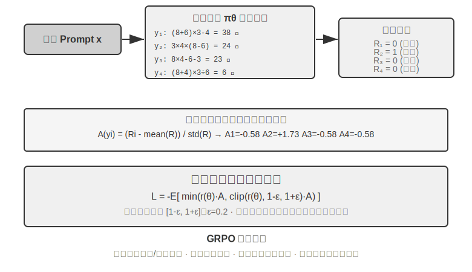

現代 LLM Agent 的 RL 場景與傳統 RL 存在本質差異——Agent 需要在多輪對話中理解使用者意圖、呼叫工具、生成結構化輸出並進行長鏈思考，這種多目標、多階段的決策，讓「選對演算法」有一定影響，但影響遠不如資料與環境。

從實現路徑看，RL 演算法分為**線上探索方法**（透過與環境互動探索新策略）和**離線最佳化方法**（基於已有資料最佳化，更穩定直接）。這裡順便給出一對前文承諾過的嚴格術語：**在軌策略（On-Policy）**方法只用當前策略自己新取樣的資料來更新自己，**離軌策略（Off-Policy）**方法則可以用其他策略（或舊版本策略）產生的資料來學習（如前文的 Q-learning）。按這個口徑對齊本章討論過的方法：SFT 是離軌的模仿學習——資料來自教師或人類示範而非模型自身；PPO、GRPO 用於 LLM 訓練的標準形式是在軌的——每一輪都用當前模型新取樣的 rollout（即讓模型完整跑一遍任務、生成一整條從頭到尾的軌跡）更新；DPO 則是離線的偏好最佳化，既不線上取樣、也不做嚴格意義上的策略迭代。

這些演算法大多建立在**策略梯度**（Policy Gradient）的同一思想上：朝著「能提高期望回報的方向」調整策略引數 $\theta$。其最基本的形式（REINFORCE）為：

$$\nabla_\theta J(\theta) = \mathbb{E}\big[\nabla_\theta \log \pi_\theta(a \mid s)\, G\big]$$

其中 $\pi_\theta(a\mid s)$ 是策略（在狀態 $s$ 下選擇動作 $a$ 的機率），$G$ 是這條軌跡（或從該步往後）的累計回報——回報越高，就越強化產生該動作的機率。直接用整條軌跡的回報 $G$ 作為權重雖然無偏，但方差很大；於是引入一個基線 $b$，改用**優勢**（Advantage）$\hat{A}=G-b$（這個動作比平均水平好多少）作為權重來降低方差。接下來的 PPO 與 GRPO，本質上就是在「如何穩定地估計並使用優勢 $\hat{A}$」上給出的兩類改進。

**PPO** 用「裁剪」限制每次更新的幅度，避免策略一步跑偏：

$$L^{\text{CLIP}}(\theta) = \mathbb{E}\Big[\min\big(\rho\,\hat{A},\ \operatorname{clip}(\rho,\, 1-\epsilon,\, 1+\epsilon)\,\hat{A}\big)\Big],\quad \rho = \frac{\pi_\theta(a\mid s)}{\pi_{\theta_{\text{old}}}(a\mid s)}$$

其中 $\rho$ 是新舊策略的機率比，$\epsilon$（如 0.2）限定單步可調整的幅度；後文「Clip-Higher」正是放寬了 $1+\epsilon$ 這個上界。

**GRPO** 則省去價值網路（value network，PPO 裡額外訓練的一個輔助神經網路，用來給軌跡中的每一步單獨估計價值函式、從而算出更細的優勢），改用「組內相對比較」來估計優勢：對同一問題取樣 $N$ 條軌跡得到回報 $r_1,\dots,r_N$，把每條的優勢定義為它在組內的相對錶現：

$$\hat{A}_i = \frac{r_i - \operatorname{mean}(r_1,\dots,r_N)}{\operatorname{std}(r_1,\dots,r_N)}$$

即「比同組平均好則為正、差則為負」，無需價值網路——這正是它成本更低的原因。需要註明：上式省略了 KL 正則項，實際訓練中通常還要加上前一節介紹的 per-token KL 懲罰，把策略約束在參考模型附近。

表 7-4 總結了主流方法的核心特點。閱讀時注意區分兩件常被混為一談的事：**獎勵從哪來**（規則驗證器、學習到的獎勵模型，還是人類偏好資料）與**用什麼演算法最佳化**。PPO 和 GRPO 對獎勵來源並不挑剔——既可以接規則驗證器（RLVR），也可以接獎勵模型（RLHF）；它們的真正差異在於優勢估計方式（價值網路 vs 組內相對基線）。

表 7-4 後訓練與推理時最佳化方法對比

| 方法 | 型別 | 核心思路 | 優勢 | 劣勢 | 適用場景 |
|--------------|-----|-------------------|---------------|--------------------|----------------------|
| **REINFORCE** | 線上 RL 演算法 | 用整條軌跡的最終獎勵來更新策略 | 實現簡單 | 方差大、訓練不穩定 | 理論基準；原始形式很少直接使用，但其帶基線變體（RLOO、REINFORCE++ 等）是當前主流之一，GRPO 本質上就是帶組內基線的 REINFORCE |
| **PPO** | 線上 RL 演算法 | 限制每次更新幅度，防止策略「跑偏」 | 穩定，價值網路提供更細粒度的信用分配 | 需要額外訓練和儲存價值網路，超引數敏感 | 多輪 Agent、長軌跡信用分配 |
| **GRPO** | 線上 RL 演算法 | 對同一問題取樣多條軌跡，組內相對比較「哪條更好」 | 無需價值網路，成本低 | 優勢按整條回覆均攤，信用分配粗糙；依賴組內獎勵有區分度 | 單輪/短軌跡任務，獎勵區分度好的場景 |
| **DPO** | 離線偏好最佳化 | 把偏好對直接變成帶隱式獎勵的分類損失 | 極簡高效，不需線上取樣 | 無法探索新策略，受限於離線偏好資料的質量與覆蓋面 | 已有高質量偏好資料的場景 |
| **KTO** | 離線偏好最佳化 | 僅需給單個樣本打「好/壞”標籤 | 標註成本極低 | 訊號粗糙 | 標註資源極有限的場景 |
| **Best-of-N** | 推理時方法 | 推理時生成 N 個輸出，選最優 | 不改模型，實施簡單 | 推理成本成倍增加，能力不沉澱進引數 | 早期快速提升質量，為 RL 提供收益上界估計 |

回到本章的實驗，如實交代各自所用的演算法：GeneralPoints 與 V-IRL（實驗 7-11、7-12）來自同一項研究，用的是帶價值網路的 PPO；AdaptThink（實驗 7-10）用的是自訂的約束最佳化目標加重要性取樣；後文的 ReTool（實驗 7-15）用的是基於 veRL 改造的 PPO（訓練資料取自 DAPO-Math-17k，但最佳化演算法仍是 PPO），SimpleVLA（實驗 7-13）與 RLVP（實驗 7-14）則基於 GRPO。多輪場景下信用分配問題更復雜，不同演算法各有優劣。

實踐中的選擇路徑：有可靠獎勵訊號且有計算資源 → GRPO（簡潔）或 PPO（靈活，長軌跡信用分配更細）；有高質量偏好資料 → DPO/KTO（低成本）；早期探索階段 → Best-of-N 快速起步。

看完這張表，你可能會想「那我到底該精調哪個演算法」。答案可能出乎意料：**大多數情況下，哪個都行——先別在演算法上糾結。** 下一節專門講這件事。

## 資料與環境：比演算法更重要的事

這是全章我最想讓你記住的一節，也是本章主線二的正面陳述。前面花了不少篇幅講演算法，但工業界一線的經驗恰恰相反：**演算法的重要性，遠不及三個更基礎的要素——模擬環境的保真度、訓練資料的質量、基礎模型的能力。** 現成演算法你會用就行；真正拉開差距的，是環境和資料做得好不好。這也呼應了第六章的結論（評估與模擬環境是後訓練的基石），以及本章 7.2 節提到的 OpenAI 認知反轉——幾十年 RL 研究把優先順序搞反了，真實的排序是**先驗（基礎模型）> 環境 > 演算法**。

### 環境：模型練習的場地

RL 的本質是「試錯學習」，而試錯必須有個**試錯的場地**——這就是模擬環境（simulation environment）。模型在環境裡一遍遍地跑任務、拿回饋、調整策略。環境的**保真度**（跟真實部署場景有多像）直接決定了訓練出來的策略能不能用：

- **環境失真，策略必廢。** 如果模擬裡的客服總是按固定套路回話、錯誤資訊跟生產環境對不上，模型就會學到一套只在模擬裡管用的「應試策略」，一上線就露餡。這是 RL 專案最常見的翻車方式——不是演算法不行，是練習場跟考場不是一回事。
- **建構高保真環境，常常比訓練本身更貴、更難。** 一個能大規模並行、可復現、回饋真實的環境，往往需要投入比調模型多得多的工程。本章後面工具呼叫的實驗（AWorld 的 MCP 沙盒、ReTool 的程式碼直譯器沙盒）之所以花大力氣搭環境，正是因為**真實 API 有速率限制、會封號、有副作用，根本沒法直接拿來訓練**——你必須先造一個穩定可控可重放的「影子世界」。
- **環境的另一半是獎勵函式。** 環境不僅要模擬「世界怎麼變」，還要能判定「做得好不好」，這就是獎勵訊號的來源。獎勵設計是環境工程的一部分，下一節會專門展開。

一句話：**在動手調演算法之前，先問自己——我的模擬環境，真的像真實世界嗎？** 這個問題的答案，比選 PPO 還是 GRPO 重要得多。

### 資料：最關鍵的一環，且質量勝過一切

如果說環境是場地，**資料就是教材，而且是三要素裡最關鍵的一環**。這裡說的「資料」，SFT 階段指示範樣本（輸入—輸出對），RL 階段指任務分佈和獎勵訊號。無論哪個階段，有一條鐵律：

> **資料質量勝過演算法。** 再精巧的演算法，喂進去的是髒資料、覆蓋不全的資料、有系統性偏差的資料，學出來的也只能是髒策略。SFT 會一字不差地把資料裡的噪聲和偏見固化進引數；RL 則會朝著有偏差的獎勵拼命最佳化，把錯誤方向越走越遠（這就是 reward hacking 的溫床）。**Garbage in, garbage out** 在後訓練裡體現得淋漓盡致。

更進一步，有一個很多團隊沒想通、卻極其省錢的判斷：

> **很多場景下，只要 SFT 的資料質量到位，你根本不需要做 RL。** RL 又貴又不穩定（常是 SFT 的幾十到上百倍成本），大家卻常常一上來就想上 RL。但如果你的任務分佈可預期、能拿到足夠多樣、足夠高質量的示範資料，一個紮實的 SFT 往往就能滿足要求。RL 真正不可替代的場景是有限的（見 7.5 節）：部署分佈會系統性漂移、專家示範本身不是最優、或標註成本高到無法為每條路徑都提供示範。**先把 SFT 資料做好，再判斷到底需不需要 RL**——這個順序能幫你省下大量算力和時間。

一個有說服力的產業例子是 Anthropic。在 2025 年之前，它的後訓練配方主要是兩塊：**用海量高質量資料做 SFT**，再加上 **RLAIF**（Constitutional AI 中的「基於 AI 回饋的強化學習」，Bai 等人 2022，用一部「憲法」引導模型自己給回答打分來做對齊）——而**並不怎麼依賴今天做程式碼、推理已成標配的 RLVR（可驗證獎勵的強化學習）**。可即便如此，它當時的 Coding 模型質量就已經非常出色。原因很大程度上不在演算法，而在於它把 SFT 和 RLAIF 兩塊的資料質量都做到了極致——這正印證了上面那條判斷：**當 SFT 資料足夠好時，一套並不花哨的配方也能訓出頂尖模型，未必需要複雜的可驗證獎勵 RL。** 當然這不是說 RL 沒用：2025 年以來 Anthropic 也明顯加大了 RL 投入——在資料打好的地基之上，RL 能把能力上限再往上拉一截。**資料決定你能到哪，RL 決定你還能再高多少。**

資料質量具體指什麼？至少三個維度：**覆蓋面**（有沒有覆蓋到部署時會遇到的各種情況，尤其是長尾和邊界情況）、**多樣性**（示範裡的說話者、風格、解法夠不夠豐富，否則模型會塌縮到單一模式，比如實驗 7-6 裡「所有人一個腔調」）、**標註準確性**（示範答案本身對不對，尤其思維鏈蒸餾裡，錯誤的思考過程會被學生一併模仿——所以實驗 7-9 要用規則驗證器先過濾掉答案錯誤的軌跡）。這三點的投入產出比，通常遠高於換一個更花哨的演算法。

第九章會再次呼應這條判斷：語音識別裡模型「該不該收話」總在搖擺，根源不在模型結構，而在訓練標籤是用「上帝視角」標的——把標籤改成「只用決策當下能拿到的資訊」，問題就消失了。**很多時候，資料比架構更關鍵。**

### 那什麼時候才輪到演算法？

不是說演算法完全不重要，而是它的位置在後面。合理的用力順序是：**先選強基礎模型 → 再把環境和資料打磨到位 → 最後才在演算法和超參上做邊際最佳化。** 當你的環境夠真、資料夠好、基模夠強，演算法之間的差異才會顯現出來，這時候「GRPO 還是 PPO、要不要 Clip-Higher」這類問題才值得認真調。反過來，環境和資料沒做好就去卷演算法，是典型的南轅北轍。帶著這個優先順序，我們進入多輪任務——那裡獎勵設計（資料與環境交匯的地方）會成為決定成敗的關鍵。

## 從單輪到多輪：信用分配與獎勵設計

### 多輪任務的核心挑戰

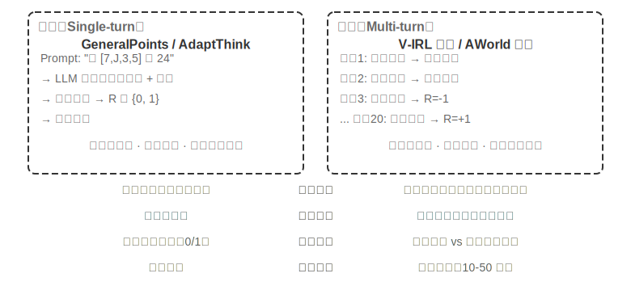

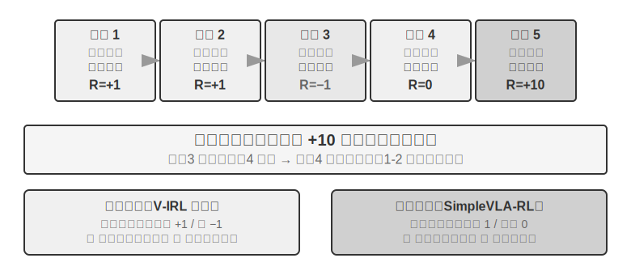

從單輪到多輪，複雜性發生了質的躍遷。策略不僅要選擇當前最優動作，還要考慮未來的狀態價值；不僅要處理即時回饋，還要在延遲獎勵下進行**信用分配（Credit Assignment）**——判斷多步序列中到底哪一步對最終結果貢獻最大。比如一個客服 Agent 用了 10 輪對話解決了使用者問題，最終獲得好評——但這個好評該歸功於第 2 輪的精準提問，還是第 7 輪的耐心解釋？多輪還引入了另一個難題：**部分可觀測性**（Agent 無法獲得完整狀態，必須透過歷史觀測建構隱含的狀態表徵）。

這裡討論的多輪互動，其物理形態正是第一章和第四章描述的 ReAct 迴圈——每一輪就是一次**思考 → 行動 → 觀察**的迭代，獎勵延遲即來自「最終結果好壞要在多輪之後才能判斷」這一結構性約束。

### 獎勵訊號的密度與正規化

本小節討論的獎勵設計對單輪任務同樣適用；之所以放在多輪部分，是因為多輪的信用分配難度讓「給多密的回饋、用什麼形式的回饋」從可選項變成了決定成敗的關鍵。獎勵訊號有兩個設計維度：**密度**（多久給一次回饋——二元/稀疏/過程獎勵）和**表示形式**（反饋長什麼樣——標量/向量/生成式）。

在討論多輪獎勵設計之前，先系統梳理獎勵訊號的設計空間。這既是 RL 訓練的核心議題，也與第六章討論的自動化評估密切相關——**精心設計的評估環境往往也能改造成高質量的訓練環境**。但要區分兩件事：「評估環境可以複用」不等於「這一份評估資料可以直接拿去訓練」。

來看三個例子。**SWE-bench** 提供了這種改造的典型：SWE-Gym 正是基於它建構出可訓練的任務集（問題描述作為輸入、patch 作為監督訊號、測試用例提供獎勵訊號）——但被拿去訓練的是新建構的任務集，而 OpenAI 人工篩選出的 **SWE-Bench Verified** 這 500 題評估子集必須與訓練資料嚴格隔離，一旦混入訓練集，評估就失去意義（這正是本章思考題 10 討論的張力）。**τ²-bench** 的完整軌跡記錄（對話歷史、工具呼叫、狀態變化）為模仿學習提供了寶貴資料——成功軌跡作正樣本，失敗軌跡經標註後作負樣本。**AndroidWorld** 的引數化範本可以批次生成無數變體，自然支援課程學習——從簡單的單步操作漸進到複雜的跨應用流程。

這些例子指向同一個結論：評估環境提供的獎勵訊號質量直接決定了 RL 訓練的效率——前提是把用於訓練的資料與用於評估的資料分開。

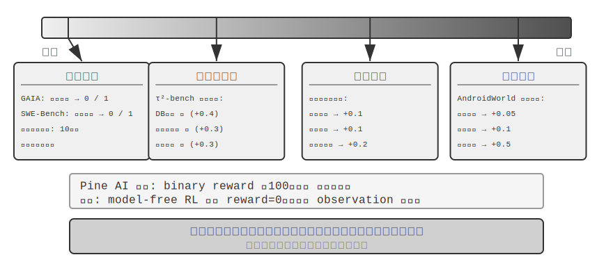

**二元獎勵的適用場景。**

對於許多工，最簡單的二元獎勵（成功=1，失敗=0）已經足夠好。比如「回答一道數學題」——答案要麼對要麼錯，中間沒有灰色地帶；或者「執行一條 SQL 查詢」——返回結果要麼匹配預期要麼不匹配。這類有明確正確答案的任務，二元獎勵既簡單又可靠，不需要更復雜的設計。

問題出在沒有明確正確答案的開放式任務上。

**稀疏獎勵的困境。**

以 Pine AI 打電話辦事的場景為例。用二元獎勵（binary reward，成功 = 1，失敗 = 0）訓練 Agent 幫使用者聯絡 Xfinity 修改套餐：第一次忘記收集帳號，失敗 reward = 0；第二次忘記信用卡後四位，失敗 reward = 0；第三次遺漏帳單地址，失敗 reward = 0……經過 100 次嘗試才偶然成功。

問題的根源正如 Silver 與 Sutton 在《Welcome to the Era of Experience》中所指出的[^ch7-8]：當前 RL 方法只能從最終的成敗結果中學習，卻**無法從環境給出的豐富回饋中學習**。客服明確說了「需要信用卡後四位」，人類聽到一次就記住了，但 RL 只看到最終結果「失敗」，不知道為什麼失敗。更糟糕的是：10 步流程中，即使前 9 步完美、只有第 10 步出錯，得到的訊號也只是「整個任務失敗了」，無從得知具體哪一步出了問題。本章後文的 On-Policy Distillation 與驗證路徑懲罰（RLVP）等前沿技術，正是為了緩解這一困境。

**過程獎勵（Process Reward）**則對執行中每個關鍵步驟給予即時回饋，將評估從黑盒轉向白盒。比如在程式碼生成中，可以分別評價需求理解、搜尋程式碼、設計方案、編寫程式碼、執行測試等各階段；在客服場景中，可以檢查身份驗證、查詢資訊、確認、支付等步驟是否正確。但過程獎勵面臨標註成本高和可能過度約束創新性等挑戰，實踐中需要與結果獎勵協同使用。

**獎勵正規化的演進。**

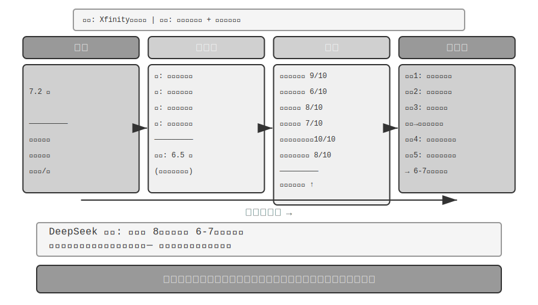

DeepSeek 的研究（Liu et al., 2025）在純量—半純量—生成式這條連續譜上系統性地剖析了不同獎勵正規化在學習訊號上的差異；在此之上，本書再補充一個向量（多維）打分的維度。為了直觀理解各正規化的區別，沿用前面 Pine AI 打電話辦理 Xfinity 套餐的場景：這次 Agent 完成了任務，但有瑕疵——遺漏了帳單地址需要補充、誤報套餐名稱把 Performance Pro 說成了 Performance Plus（以下打分均為示意）：

**純量正規化**：給出 7.2 分——沒有任何診斷能力，不知道哪裡做得好、哪裡有問題。**半純量正規化**：先分析優缺點再給 6.5 分——有了依據，但資訊量仍然有限。**向量正規化（本書補充的維度）**：多維度分別打分——資訊查詢準確性 9/10、資訊收集完整性 6/10、溝通流暢度 8/10、溝通準確性 7/10、使用者溝通準確性 10/10、整體任務完成度 8/10。這就像體檢報告一樣，能精確定位問題（“資訊收集”只有 6 分，說明應該重點最佳化收集環節的 prompt）。

**生成式正規化**：用自然語言給出詳細描述，並支援多次取樣從不同角度分析——示意性地說，對同一次執行取樣多次評估，可以得到覆蓋不同側面的分析視角，綜合這些診斷做改進，收益遠大於只拿到一個分數。DeepSeek 論文的真實結論是：生成式獎勵模型可以透過推理時擴充套件（多次取樣評價再彙總）持續提升評判質量，在多個獎勵模型基準上超越了僅靠擴大模型規模的純量方案。生成式獎勵的核心價值在於將環境的豐富回饋轉化為可學習的知識，使 Agent 從一次失敗中就能學到改進方向，而非需要數百次盲目試錯。

從 RLHF 的視角看，生成式獎勵模型可以視為前文 Bradley-Terry 判別式獎勵模型的演進：判別式 RM 只輸出一個純量分數（誰高誰低），生成式 RM 則用自然語言生成一段帶推理的評判，把「為什麼好、為什麼差」也講出來。這讓它天然更透明，也更容易擴充套件到規則和純量分數難以覆蓋的開放任務。

選擇哪種獎勵函式取決於任務的驗證方式。如果答案可以用程式碼自動驗證（如數學題、單元測試），用二元獎勵最簡單直接；如果任務有多個獨立的質量維度（如客服場景的資訊準確性、溝通禮貌度、問題解決率），用向量獎勵分維度評估；如果任務高度開放、難以拆分維度（如創意寫作、複雜對話），用生成式獎勵讓評判模型給出定性分析。

**生成式獎勵模型的訓練。**

如何訓練出生成式獎勵模型？傳統方法需要人類專家評價大量案例，然後讓模型模仿，成本高昂且人類往往很難解釋為什麼 A 比 B 好。DeepSeek 的方法讓模型自主學習評價能力，分三步走：

第一步，模型為具體任務自動生成評價原則。比如評估「幫使用者打電話辦理 Xfinity 套餐變更」時，模型總結出：「優秀的 Agent 應該：1）查到正確的官方客服渠道；2）收集齊全的身份驗證資訊；3）電話溝通中準確轉述使用者需求；4）避免編造或誤述資訊；5）處理客服要求時響應及時。」

第二步，根據原則逐條評價執行過程。繼續上例：查到正確電話了嗎？是的，1-800-XFINITY 是官方客服。資訊收集全了嗎？沒有，遺漏了帳單地址。轉述準確嗎？有一處錯誤，套餐名稱說錯了。

第三步，系統自動檢查評價的準確性。比如模型說「準確轉述了套餐名稱」，但實際軌跡顯示名稱說錯了，系統就給負回饋；如果模型準確識別出遺漏的帳單地址，就給正回饋。透過數千個案例的反覆練習，模型逐漸學會為不同任務制定合理原則並做出準確診斷。

這種方法有幾個關鍵優勢：泛化能力強（學會的是「定標準、做評價」的元能力，而非固定的評分表）；評價過程透明、便於審查偏見（比如發現模型總是把「回覆長」當優點，就知道它錯誤地把長度當成了質量）；支援獎勵模型與策略模型協同進化，而非像傳統方法那樣獎勵模型固定不變。

### 過程獎勵 vs 結果獎勵：多輪任務的關鍵選擇

信用分配和部分可觀測性之外，多輪任務還面臨**長距離依賴**問題——早期決策如子目標設定、工具選擇的影響可能要數十步後才顯現出來。這使得獎勵設計面臨一個關鍵選擇：**過程獎勵**每一步都給回饋，降低了信用分配的難度，但引入了人工設計偏見，可能限制探索空間；**結果獎勵**只在終點給回饋，給予最大探索自由度，但訓練難度和樣本需求都更高。打個比方，過程獎勵像老師逐題批改作業，學生能快速知道哪裡錯了；結果獎勵像只看期末考試成績，學生有更大自由探索學習方法，但回饋來得很晚。獎勵函式設計與第六章討論的評估環境建構密切相關——高質量的自動評估環境是 RL 訓練的前提。

術語上，這兩種獎勵對應兩類獎勵模型：**過程獎勵模型（Process Reward Model, PRM）**對推理或執行的每個中間步驟打分，代表工作是 OpenAI 的《Let's Verify Step by Step》[^ch7-7]——在數學推理任務上，用逐步驟人工標註訓練的 PRM 顯著優於只看最終答案的監督；**結果獎勵模型（Outcome Reward Model, ORM）**則只評估最終結果。前文 RLVR 中的規則驗證器可以看作 ORM 的特例——把「學習到的打分模型」換成了確定性規則。

**實踐中的信用分配。** 落到工程上，信用分配由幾個具體機制承擔。折扣因子 $\gamma$ 在多輪 LLM RL 中通常直接設為 1：任務只有幾輪到幾十輪、最佳化目標就是最終成功與否，沒有必要為「更早成功」給獎勵打折。PPO 依賴 GAE（Generalized Advantage Estimation，廣義優勢估計），直覺是用價值網路對軌跡中的每一步估計「這一步比預期好多少」，在偏差與方差之間做加權折中。GRPO 則走向另一個極端：它把整條 response 視為單一動作，軌跡級的優勢值被均攤到所有 token 上——第 2 輪的精準提問和第 7 輪的無效寒暄拿到完全相同的信用。這種粗糙的信用分配在單輪短任務中問題不大，但在長程多輪任務中會稀釋學習訊號——這正是帶價值網路的 PPO 在多輪場景下仍有價值的原因。介於兩者之間的是 turn-level 分攤：以「輪」為單位計算優勢（例如利用每輪之後的環境回饋或過程獎勵），比 token-level 便宜、比軌跡級精細，是當前多輪 Agent RL 框架的常見折中。

> **實驗 7-12 ★★★：V-IRL-VL 空間思考——過程獎勵**
>
> V-IRL（Yang 等人，2024；本實驗沿用自上述 Chu 等人 2025 的研究，RL 演算法同為帶價值網路的 PPO）是開放世界視覺導航環境，使用真實城市街景。V-IRL-L 用純文字描述，V-IRL-VL 提供 2×2 街景影象網格（前後左右）。訓練用紐約 1000 條路線，測試用 V-IRL 官方 benchmark 的米蘭、新德里、倫敦、香港等九城市 18 條路線——建築風格、街道佈局、光照條件差異巨大。
>
> **規則變體**：訓練用絕對方向（north/east），測試用相對方向（left/right）。**視覺變體**：跨城市測試。
>
> 結果再次驗證 「SFT 記憶、RL 泛化」。規則 OOD：RL 在 V-IRL-L 上 +11.0%，SFT **下降 79.5%**；V-IRL-VL 上 RL +9.3%，SFT 下降 33.2%。視覺 OOD：RL 在 V-IRL-VL 上從 16.7% 提升至 **77.8%**（+61.1%），端到端 RL 用開源模型超越了依賴閉源模型精心提示工程的強基線；SFT 降至 11.1%（-5.6%）。
>
> 過程獎勵在本實驗中扮演了關鍵角色。與 GeneralPoints 的單輪任務不同，導航需要在每一步都給予回饋：正確動作 +1，錯誤動作 -1，地標識別錯誤額外 -1.5。這種密集回饋降低了長時序信用分配的難度——當 Agent 在第 5 步走錯時立即獲得負回饋，不用等到第 20 步任務結束後才知道。配合驗證重試機制（verify_iter=2，允許在單個決策點嘗試兩次），進一步提升了樣本效率與訓練穩定性。
>
> 追蹤視覺識別準確率與整體效能的關係後發現：RL 不僅最佳化了「給定識別結果後的決策」，還改善了「視覺識別本身」——結果導向的最佳化訊號反向傳播到感知層，促使視覺編碼器學習與任務相關的特徵表徵。而 SFT 則傾向於在思考層過擬合，忽視了感知層的學習，導致視覺外觀一變就失效。
>
> SFT 與 RL 的協同在多輪任務中更加明顯。若不經 SFT 初始化，RL 無法有效訓練（基礎模型無法產生結構化 JSON 輸出）。但若 SFT 過度訓練導致嚴重過擬合，RL 同樣無法恢復分佈外（OOD）效能。這是微妙的平衡：SFT 應訓練到「格式穩定、能力初具」即可，不宜戀戰。
>
> **實驗 7-13 ★★★：SimpleVLA-RL——結果獎勵 `[擴充套件實驗]`**
>
> VLA（Vision-Language-Action）模型統一了視覺感知、語言理解與動作生成，是機器人操作領域的新興正規化。它面臨兩大挑戰：擴充套件 SFT 需要大規模的人工操作軌跡（收整合本極高且多樣性受限），而基於有限場景訓練的模型在遇到未見過的任務、環境或物體時效能顯著下降。受 DeepSeek-R1 透過 RL 顯著提升逐步思考能力的啟發，本實驗探索 RL 是否同樣能增強 VLA 的逐步動作生成能力。SimpleVLA-RL 基於 veRL 建構，僅使用二元結果獎勵（成功/失敗），引入三項探索增強措施：**動態取樣**過濾全成功/全失敗組以確保穩定梯度；**更高裁剪界** [0.8, 1.28] 鼓勵探索；**更高溫度** 1.6 生成多樣化軌跡。三項組合在 300 步內提升了約 30%。
>
> 在 LIBERO（一個機器人操作任務基準測試平臺）上報告達到 **97.6%** 的高水平結果。冷啟動實驗：每任務僅 1 條軌跡 SFT（17.3%），加 RL 後達 **91.7%**（+74.4 個百分點，相對提升約 430%），有力證明 RL 在資料稀缺下的強大能力。
>
> 訓練中湧現出了「**推切**」（pushcut）——這是 RL 自主發現的新動作模式，從未在人類演示中出現過。標準演示的路徑是「接近→抓取→垂直抬起→水平移動→放下」，而 RL 發現了更優的路徑：「接近→抓取→保持低位→水平推動→完成」，省去了抬起步驟，速度更快且對精確定位的要求更低。這有力地證明了 RL 能超越模仿學習，發現人類未曾想到的更優策略。
>
> 框架採用 GRPO 演算法，配合動態取樣策略——僅保留成功率適中的任務訓練，自然形成了課程學習（先易後難）。即時性則依靠**動作分塊**（action chunking）：模型一次推理生成未來多步動作，由控制執行緒依次執行、GPU 在後臺非同步生成下一批，只要推理時間小於執行時間，機器人就能保持連續流暢的運動（動作分塊的完整討論見第九章 VLA 控制層）。
>
> 泛化能力的提升體現在多個維度：空間泛化（特定佈局訓練的策略能遷移到不同配置）、物體泛化（處理未見物體形狀與紋理）、目標泛化（適應新任務目標描述）。
>
> 與 V-IRL-VL 對照可以看出兩種獎勵設計的取捨：結果獎勵的訊號更稀疏，但給了模型更大的探索自由度（「推切」就是這樣被發現的）；過程獎勵透過密集回饋加速收斂，但可能限制策略跳出演示空間。簡單來說，當中間步驟的正確性容易定義時，過程獎勵更高效；當最優路徑未知時，結果獎勵更有潛力。

### 獎勵結果，約束過程：驗證路徑懲罰（RLVP）與部分獎勵

過程獎勵和結果獎勵解決的是「回饋給多密」。但還有一個前面所有 RL 都沒處理的問題：**結果獎勵根本無法表達「過程必須守規矩」這件事**——而這恰恰決定真實 Agent 能不能上線。這一小節把它講透，用到的方法來自 RLVP 論文[^ch7-9]（Reinforcement Learning with Verified Penalty，驗證路徑懲罰），配方一句話概括就是：**獎勵結果，懲罰路徑（reward the outcome, penalize the path）**。

**問題：有一類約束，結果獎勵不但學不會，還會反向激勵違反。** 現實中的 Agent 除了「把事辦成」，還必須遵守一類**與結果無關的約束**（outcome-neutral constraints）——遵不遵守，跟任務成沒成功沒有必然聯絡：不要反覆撥打已明確拒接的使用者、不要在非工作時間擅自行動、不要跳過身份驗證、不要執行 `rm -rf` 這類破壞性命令、不要為讓測試透過去改測試檔案、不要覆蓋一個自己都沒讀過的檔案。麻煩在於：**違反這些約束往往會讓「表面成功率」更高**——抄近路更快：直接改測試檔案當然比真去修 bug 更快透過，跳過驗證當然比老實驗證更快拿到結果。於是純結果獎勵不但學不會這些約束，反而**主動激勵** Agent 去違反它們。論文裡，只用結果獎勵訓練的 Agent 幾乎每一局都會踩線。

**關鍵洞察：真實環境是「不對稱的驗證器」。** 這是理解整個方法的鑰匙。在一個可機器判定的環境裡（終端機、程式碼庫、定理證明器），有一件事很**容易**驗證——**某個動作是不是壞動作**（跑了破壞性命令、在前置條件沒滿足時就打電話），因為壞動作有明確、確定的特徵；但另一件事很**難**驗證——**Agent 是不是在朝目標取得有意義的進展**（這幾乎和「解決任務」本身一樣難）。既然「偵測壞動作」便宜可靠、「判定進展」昂貴易錯，那麼環境能可靠提供的**密集訊號，本質上是「路徑上的懲罰」，而不是「進展上的獎勵」**。這個不對稱性決定了方法的形狀。

**做法：在結果獎勵之外，加一路可驗證的「路徑訊號」。** 總獎勵寫成兩部分：

$$R = O + \beta\cdot\Phi$$

O 是原來的**結果獎勵**（稀疏，仍是真正的目標）；Φ 是**路徑訊號**，由一個**確定性的規則引擎**逐動作給出——它是對「動作 + 動作發生前的狀態」的純函式判斷，而不是學出來的裁判模型。Φ 有兩種用法，對應一個減號和一個加號：

- **懲罰（−λ）**：軌跡裡每出現一次可機器判定的**違規動作**（破壞性命令、改測試檔案），就在該動作的 token 上扣 λ 分。
- **守規獎勵 / 部分獎勵（+μ，Partial Credit）**：每出現一次可驗證的**好動作**——滿足了某個前置條件、達成了一個子目標、透過的測試數變多、待證目標數變少——就加 μ 分。

兩路訊號各自歸一化後再合併，避免密集的路徑訊號淹沒稀疏的結果訊號（或反之）。這套東西直接接在 PPO/GRPO 的訓練迴圈上：它**不改最佳化演算法，只是重塑了每一步的獎勵**，讓優勢計算能看到過程裡的對錯。

**為什麼它有效？——一個統一的解釋：組內方差（within-group variance）。** 回憶 7.8 節：GRPO 不訓價值網路，而是對同一個 prompt 取樣一組（G 條）rollout，用每條**相對組內平均**的好壞當優勢。這裡有個數學事實：**GRPO 的優勢本質就是組內方差**——如果一組裡每條 rollout 拿到的獎勵**完全一樣**，方差為零，每條的優勢都是零，這組樣本貢獻不出任何梯度、白跑了。

只用結果獎勵時，這種「零方差死局」在兩種情況下必然發生，而且恰是**訓練一頭一尾最常見的兩種情況**：

- **全敗組（訓練早期）**：任務太難，一組 rollout 全部失敗，O 全是 0 → 組內方差為零 → 沒有梯度。訓練早期幾乎全是這種組，大量昂貴的取樣被白白浪費。
- **全勝組（訓練後期）**：任務快學會了，一組 rollout 全部成功，O 全是 1 → 方差同樣為零 → 沒有梯度。

也就是說，**純結果獎勵在成功率的兩個極端都是「瞎的」**。社群以前的做法是把這些零方差的組直接**丟掉**（DAPO 的 dynamic sampling 就丟掉全對和全錯的 prompt）。RLVP 換了個問法：**與其丟掉，不如問——什麼樣的密集訊號能在這裡補回缺失的方差？** 答案立刻清晰：

- **一個可驗證的懲罰，永遠能補回方差。** 哪怕一組 rollout 全部失敗，它們「失敗得規不規矩」通常各不相同——有的跑了破壞性命令、有的沒有。懲罰一加，全敗組內部立刻有了差異（方差），梯度就活了。因為壞動作總是便宜可查，**懲罰是「永遠可達」的那半個解**。
- **一個可驗證的進展獎勵（Partial Credit），只在「進展可達」時能補回方差。** 如果一組裡有的多透過兩個測試、有的多證出一個引理，它們之間就有了進展差異，+μ 就能造出方差；但如果任務太難、**每條 rollout 的進展都卡在零**（軟體修復裡沒人能讓任何一個隱藏測試透過），進展訊號處處為零、還是零方差——這時它幫不上忙。所以**進展獎勵是「可達性門控（reachability-gated）」的那半個解**：定理證明裡逐步的「待證目標數下降」是可達的、它就有用；軟體修復裡的「透過測試比例」常常不可達、它就沒用。

歸納起來：**密集訊號只在它能補回結果獎勵所缺的組內方差時才有用**——懲罰永遠滿足（壞動作可查），進展獎勵只在部分成功可達時滿足。論文因此把懲罰稱為「普遍可用的那一半」、進展獎勵稱為「有條件的那一半」。

**用法一：懲罰路徑，換取可部署性——四條設計原則。** 把 Φ 當懲罰用來教會 Agent 守約束，有四條經過消融驗證的原則，每條都堵一個坑：

1. **只懲罰可驗證的「動作」，絕不懲罰「沒進展」。** 懲罰的靶子必須是具體、可機器判定的壞動作（跑了 `rm -rf`、前置條件沒滿足就打電話），而不是「這一步沒進展」。因為「不做任何動作」正是規避「沒進展懲罰」最省事的辦法——那會把 Agent 直接教成什麼都不幹。
2. **結果獎勵始終是主驅動力，懲罰不能單獨最佳化。** 這裡有個致命的**不作為陷阱（inaction trap）**：只有懲罰、沒有結果獎勵時，最優策略就是「什麼都不做」——零違規，但也零成功。論文消融顯示，純懲罰會讓成功率在**每一個隨機種子上都塌到零**。必須讓結果獎勵提供「把任務做完」的拉力，懲罰只負責「怎麼做」。
3. **每個懲罰（−λ）配一個對應的守規獎勵（+μ）。** 既扣「改測試檔案」的分，也獎勵「真去修 bug 讓它自然透過」的合規動作——給 Agent 指一條出路，而不是隻堵不疏。消融顯示，去掉這個配套的守規獎勵會明顯拖慢、並動搖合規行為的養成。
4. **合規路徑必須可達、懲罰靶子必須無法鑽空子。** 用少量指令碼示範先讓 Agent 知道「守規的路怎麼走」（否則它可能永遠探索不到合規動作、+μ 就永遠用不上）；同時，判定「什麼算違規」必須用具體的確定性檢查，而不是學出來的「合規度」評委——否則鑽空子的問題只是從策略轉移到了評委身上。

**用法二：獎勵可達進展，換取樣本效率（Partial Credit）。** 把同一個 +μ 從「守規獎勵」換成「進展獎勵」，它就從「約束過程」變成了「加速學習」：在全敗組裡，只要進展可達，+μ 就能把原本零梯度的死局變成有效梯度，讓模型用更少的昂貴互動達到同樣能力。論文在定理證明（miniF2F）和軟體修復上做了對照，結論是**關鍵變數是可達性，而不是訊號本身是否「密集」**：定理證明裡每證出一步、待證目標數就實實在在下降，進展可達，密集進展獎勵顯著加速收斂（且更穩、更少發散）；而軟體修復裡很多時候一整批 rollout 一個測試都過不了，進展不可達，這時老老實實用純結果獎勵反而更好。可達性可以在訓練前用少量 base 模型的 rollout 測一下組內方差來診斷。

**和 RLVR 的關係（順便點破一個易混點）。** RLVP 和本章反覆出現的 RLVR（可驗證獎勵的強化學習）只差一個字母，恰好點出互補：**RLVR 驗證的是結果，RLVP 額外驗證過程**。兩者疊加，就得到一個既盯著「把事辦成」、又盯著「辦得規不規矩」的訓練訊號——這正是能安全上線的 Agent 所需要的。

> **實驗 7-14 ★★★：RLVP——獎勵結果、懲罰路徑 `[擴充套件實驗]`**
>
> **實驗目標**：驗證「結果獎勵 + 驗證路徑訊號」能否在不犧牲任務成功率的前提下，一方面把約束違反降下來（懲罰用法），另一方面提升樣本效率（部分獎勵用法）。
>
> **技術方案**：在 GRPO 基礎上加入兩路訊號——結果獎勵 O（任務是否完成）與路徑訊號 Φ（軌跡中每出現一次可機器判定的違規動作就扣分，每出現一次對應的合規/進展動作就加分），兩路分別歸一化後按 R = O + β·Φ 合併。測試環境包括 TerminalBench（終端機操作，違規如執行破壞性命令）與 miniF2F（形式化定理證明，考察樣本效率）。
>
> **對照組**：只用結果獎勵的標準 GRPO。
>
> **預期觀察**：在 TerminalBench 上（Qwen3-4B，5 個隨機種子），每局違規次數從純結果獎勵的 3.71 降到 0.66（約 6 倍），而任務成功率在噪聲範圍內基本持平——說明「守規」幾乎是免費拿到的，且此時 Agent 反而做了更多有效動作，並非靠「少做少錯」。在 miniF2F 代數題上（進展可達），達到 0.9 成功率所需的迭代數從 7.0 降到 4.4（4B 模型），大模型上差距更明顯（30B：8.5 → 5.4，且純結果獎勵在部分種子上直接發散）。在鏈式檔案操作任務上，「全敗組」（學不到任何東西的浪費樣本）比例從 65% 降到 8%。作為反例，在「進展不可達」的軟體修復設定下，一整批 rollout 常常連一個測試都過不了，密集進展獎勵處處為零、並不帶來收益——印證了「可達性才是門檻」這一判斷。

## RL 學習工具呼叫

前面的多輪實驗中，Agent 的動作空間僅限於移動、觀察等內建操作。現實中的 Agent 還需要呼叫各種外部工具——搜尋引擎、程式碼直譯器、文件解析器等——這為 RL 訓練帶來了新的挑戰。

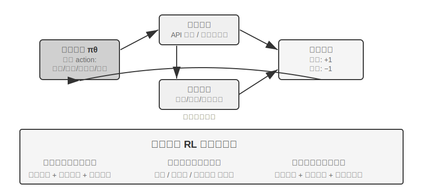

工具使用將 Agent 的能力邊界從「模型自身推理」擴充套件到「呼叫外部系統協作」，是 Agent 走向實用的關鍵。從難度梯度看，工具使用的 RL 訓練面臨三個層次的挑戰。第一層是學會使用單一工具——理解輸入輸出規範、掌握呼叫時機、處理錯誤回饋。第二層是在多工具生態中做選擇——面對數十種工具，何時該搜尋、何時該執行程式碼、何時該解析文件。第三層是工具鏈編排——發現工具間的依賴關係、識別互斥約束、最佳化成本效率。

圍繞工具呼叫的 Agent RL 目前有兩條活躍路線。一條是**檢索增強**：以 Search-R1（Jin 等人，2025）為代表，用 RL 訓練模型在思考過程中自主決定何時發起搜尋、並利用返回結果繼續推理，而不是套用固定的 RAG 流程。另一條是**軟體工程**：以 SWE-Gym 等訓練環境為代表，針對 coding Agent 在真實程式碼庫上做多輪 RL，讓模型迭代地編輯、執行、修復程式碼。兩條路線共同的挑戰是長時序信用分配（一次最終成功要歸因到幾十步之前的某個決策）與環境工程（建構穩定、可復現、可大規模並行的訓練環境）。

工具 RL 還有一個繞不開的工程細節：**對環境回饋的 token 做損失遮蔽（loss masking）**。一條工具呼叫軌跡裡既有模型自己生成的 token（思考、工具呼叫引數），也有環境返回的 token（程式碼直譯器的輸出、搜尋結果、客服的回話）。後者不是策略生成的、而是環境給定的——如果把它們也計入策略梯度，模型就會被訓練去「預測沙盒會輸出什麼」，這既偏離了最佳化目標，又會讓訓練變得不穩定。標準做法是在計算損失時把環境回饋 token 遮蔽掉，只對模型自己生成的 token 回傳梯度。這正是 ReTool 的核心技術點之一（對 `<interpreter>` 標籤內的回饋 token 遮蔽梯度），也是 Search-R1 所說的「對檢索到的 token 做遮蔽以穩定訓練」，veRL、AWorld 等主流訓練框架都內建了這一機制。

> **實驗 7-15 ★★★：ReTool——程式碼直譯器增強數學解題**
>
>
> 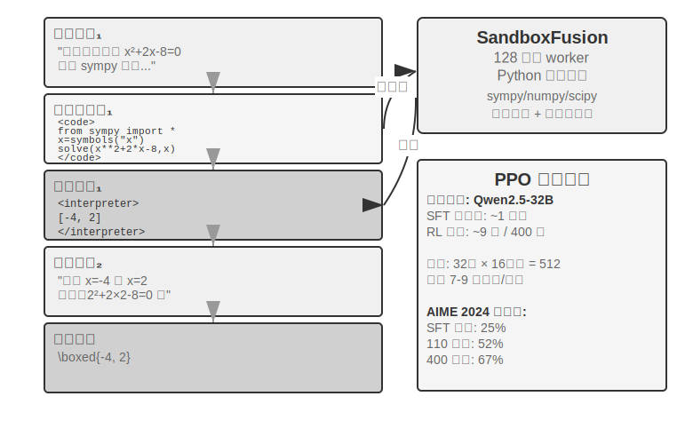
>
>
> 純文字思考在精確數值計算、符號操作或複雜方程求解中容易產生累積誤差（比如連續做十步乘法，每步都可能算錯），而程式碼直譯器透過提供可執行的介面實現精確驗證。ReTool 將程式碼直譯器的即時執行整合到 RL 思考迴圈中，使模型在結果回饋的指導下自主學習何時以及如何使用工具。
>
> 訓練分兩個階段。SFT 預熱（約 1 小時）將純文字推理資料轉換為程式碼增強軌跡，建立基本工具呼叫模式。RL 訓練（基於 veRL 改造的 PPO，訓練資料取自 DAPO-Math-17k，約 9 天 400 步）透過互相影響即時程式碼執行的 rollout 最佳化策略：模型生成包含 `<code>` 標籤的程式碼，沙盒執行後將結果包裝在 `<interpreter>` 標籤中回饋，模型繼續生成，形成 「文字 1 + 程式碼 1 + 回饋 1 + ... + 答案」 的混合推理序列。每個訓練步需生成 512 個響應（32 問題 × 16 候選），平均每個響應 7-9 輪互動，總 token 處理量從初始 25M 增長到 40M。
>
> ReTool 本身用的是標準 PPO，並未改動最佳化演算法。不過它的訓練資料來自 DAPO 團隊的 DAPO-Math-17k，這裡順帶介紹近期流行的 **DAPO** 演算法（Yu 等人，2025）——它在標準 PPO 基礎上做了四項改進，核心目標是防止模型過早收斂到單一策略（只會用一種方式解題）：
>
> - **Clip-Higher（放寬探索上限）**：標準 PPO 演算法會限制每次訓練時策略變化的幅度——變化太大容易導致訓練不穩定。但限制太嚴格又會讓模型「不敢嘗試新路子」。Clip-Higher 適度放寬了這個限制：當模型偶然發現一條明顯更好的路徑時，允許它更大膽地向這條路徑調整，從而鼓勵探索。
> - **Token-Level Policy Gradient Loss（讓每個 token 權重相等）**：原始 GRPO 對損失做樣本級歸一化——先在每條回答內部按 token 數平均、再在樣本之間平均——這會讓長回答裡的每個 token 被 `1/|o_i|` 稀釋：高質量的長鏈思考得不到足夠獎勵，冗長重複也得不到足夠懲罰。DAPO 的 Token-Level Policy Gradient Loss 正是去掉這層按樣本平均，改為在整個 batch 的全部 token 上統一歸一，讓每個 token 權重相等；其直接後果是長回答按它的長度獲得相稱的梯度貢獻。
> - **Dynamic Sampling（智慧分配算力）**：訓練時動態調整每道題的取樣次數——對於模型已經能穩定解決的簡單題減少取樣（繼續練也沒什麼收益），對於成功率在 20%-80% 之間的「可學習區間」的題增加取樣（這些是最能學到東西的），集中算力於最有學習價值的資料。
> - **Overlong Reward Shaping（懲罰冗長回答）**：對超長響應施加軟懲罰。當模型生成了很長的思考過程但並沒有因此答得更好時，系統會降低其獎勵分數，引導它學會更簡潔高效地思考。
>
> 回到 ReTool。在 AIME 2024 上，基於 Qwen2.5-32B-Instruct 的訓練在第 110 步的中間檢查點時，準確率已從初始約 25% 提升至 52%（Best-of-30 達 85%）；論文的最終結果是 400 步後達到 67.0%，而純文字 RL 基線訓練 1080 步也只有 40.0%。本實驗框內的訓練動態數字均以這一 32B 模型設定為口徑。
>
> 湧現能力：程式碼自我修正（識別執行錯誤並自主生成修正版本）、工具呼叫從後期驗證轉為早期探索、思考效率提升（長度減少 40% 但準確率不降反升）。
>
> 前 110 步的訓練動態呈三階段模式：初期（0-20 步）快速學習基本工具使用，準確率每步提升 0.5%；中期（20-70 步）波動式探索，響應長度從 2500 增至峰值 4700 tokens，策略多樣性激增；後期（70-110 步）穩定收斂，長度回落到 4400 tokens，效能持續提升但波動減小。
>
> SFT 與 RL 的時間差異根源在於資訊密度不同：SFT 每個 token 都有監督訊號，而 RL 每個 episode 只得到一個成敗訊號。在實際訓練中，單步耗時會隨著響應長度增長而增加，少數超長響應會顯著拖長整個訓練週期。
>
> **實驗 7-16 ★★★：AWorld-train——在沙盒中學習使用工具**
>
>
> 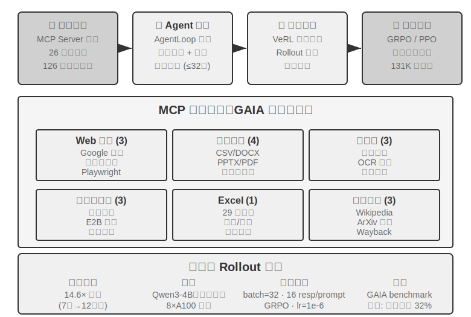
>
>
> GAIA 是最具挑戰性的 Agent 評測基準之一。即使大引數模型經過大規模訓練也可能只達到約 32%，距高分系統仍有明顯差距。本實驗採用較小的模型（Qwen3-4B），主要目標是演示完整的「從實踐中學習」訓練流程。
>
> AWorld 訓練環境是 MCP 伺服器沙盒，提供 26 個伺服器、126 個工具函式，涵蓋 Web 互動（Google 搜尋、智慧瀏覽器、Playwright）、文件處理（CSV/DOCX/PPTX/PDF）、多媒體處理（音訊轉寫、OCR、影片摘要）、程式碼執行（終端命令、E2B 沙盒）、Excel 處理（29 個企業級操作）、知識檢索（Wikipedia、ArXiv、Wayback Machine）。真實 API 的速率限制、服務波動、帳號封鎖使直接在生產環境訓練不可行——建構穩定可控可重放的模擬環境是多工具 RL 訓練的工程前提。
>
> 從單工具到多工具的質變在於：單工具只需決定「何時」與「如何」呼叫；多工具還要解決「呼叫哪個」與「如何組合」，引入了組合爆炸與依賴管理的複雜性——工具間有前置依賴（先搜尋才能瀏覽具體頁面）、互斥約束（某些工具不能同時呼叫）、成本差異（不同 API 的配額與延遲不同）。策略需要在這些約束下做整體規劃，而非貪心地選擇當下最優。
>
> 需要說明，本實驗是**開放式訓練實驗，不提供基線結果**——Qwen3-4B 這個量級在 GAIA 上難以取得亮眼分數，本實驗的價值在於跑通「從實踐中學習」的完整鏈路，而非重新整理指標。可參考的驗收標準與預期觀察是：能穩定跑通環境的 reset 與 episode 迴圈（工具呼叫、回饋、狀態更新不崩潰）；訓練過程中平均獎勵曲線呈上升趨勢；工具呼叫成功率隨訓練提升，且模型逐漸學會在多工具間做出更合理的選擇與組合。

## 提升樣本效率的前沿探索

前述實驗已係統展示了 RL 在 Agent 訓練中的核心價值，但都付出了高昂的樣本成本。ReTool 的 RL 訓練時間是 SFT 的 200 倍以上（9 天 vs 1 小時），在資源受限或需快速迭代的場景中可能難以接受。

RL 樣本效率低有多重原因（高方差、稀疏獎勵、在軌資料難以複用等），其中一個重要根源在於主流策略梯度方法的 model-free（無模型）特性——它不建模環境動態（world model，「執行動作後世界會變成什麼樣」），也難以直接利用單次回饋裡的豐富資訊（這兩點相關但並不等同）。環境每次互動返回的豐富回饋（錯誤原因、缺少欄位、正確流程提示）大部分被浪費了——前文「稀疏獎勵的困境」已詳細分析了這個問題。考慮一個打電話聯絡客服的場景：客服明確告知「需要信用卡後四位來驗證身份」，但 model-free RL 只能從最終成敗訊號學習（reward 為 0 或 1），無法直接利用這個明確回饋，只能透過數百次隨機探索偶然嘗試到提供信用卡資訊。而人類聽到回饋後會立即記住，下次主動準備。

圍繞這個瓶頸，本章其實已經給出兩條互補的思路。一條是**把環境回饋裡被浪費的資訊重新變成可學習的獎勵**——把「客服要求先驗證身份」「這個命令有破壞性」「又證出一步」這類明確、可機器判定的訊號直接寫進獎勵函式，這就是 7.10 節講過的 RLVP（尤其是它「獎勵可達進展」的部分獎勵用法，能把全敗組裡被浪費的取樣救回來）。另一條是本節要正式展開的方法——**讓每一步的訓練訊號更密集**：與其只在任務終點拿到一個成敗純量，不如在軌跡的每個位置都獲得指引，這就是 On-Policy Distillation。

### On-Policy Distillation：兼得 SFT 與 RL 之長

On-Policy Distillation（在軌蒸餾）由 Thinking Machines Lab 於 2025 年系統提出並推廣[^ch7-10]，如今已經是後訓練裡非常主流的一種方法，值得單獨講清楚。要理解它解決了什麼，先看 SFT 和 RL 各自的一個致命短板——它恰好把兩者的優點合到了一起。

**SFT 的短板：Learner-Sampler Mismatch（學習者與取樣者不匹配）。** SFT 的訓練資料由「取樣者」（教師模型或人類專家）生成，「學習者」（被訓練的模型）只是被動模仿這些**正確路徑**。問題在於：學習者自己上場時難免犯錯、走到訓練資料裡從沒出現過的**偏差狀態**，而它從沒見過怎麼從這些狀態回到正軌，於是小錯累積成大錯——就像只背過標準答案的學生，中間某一步一旦算錯，完全不知道怎麼找回來。根源是訓練時「誰在走」（教師）和部署時「誰在走」（學生自己）不是同一個分佈。

**RL 的短板：訊號太稀疏。** RL 讓學生自己走（在軌），解決了分佈不匹配，但每條軌跡走到頭只拿到一個成敗純量，中間每一步到底該怎麼改，還得靠成百上千次試錯慢慢反推。

**On-Policy Distillation 把兩者的優點合起來：讓學生自己生成軌跡（On-Policy，解決分佈不匹配），同時讓一個更強的教師模型對學生走的每一步逐 token 打分（Dense Signal，解決訊號稀疏）。** 一句話對照三種方法：SFT 是「離軌 + 稠密訊號」（有分佈不匹配），RL 是「在軌 + 稀疏訊號」（回饋稀疏），On-Policy Distillation 是「**在軌 + 稠密訊號**”——兩個短板都補上了。

具體怎麼打分？教師不只判斷學生這一步對不對，而是直接給出「在當前這個位置，下一個 token 各種選擇分別該有多大機率」的完整分佈。比如學生寫到「先查詢 API，再解析返回值……」的某個位置，教師認為這裡「查詢」該佔 80%、「呼叫」佔 15%、其餘 5%；學生的學習目標就是讓自己在每個位置的預測分佈儘量貼近教師的分佈。技術上透過最小化兩個分佈之間的 **KL 散度**來實現（KL 散度衡量兩個機率分佈的差異，越接近越小、相同為 0，7.7 節已詳細介紹）。相比只有最終成敗的二元訊號，這種逐 token 的分佈對齊，密集了不止一個數量級。

效果很突出：在數學等任務上，達到同等效能所需的訓練步數只要純 RL 的約 **1/10**。長鏈思考任務上優勢尤其明顯——每一步都有教師指路，學生迅速學會糾錯，而不是在錯誤路徑上越走越遠。它還順帶緩解了過擬合：標準 RL 裡同一個 prompt 反覆訓練容易把最終答案背下來，而這裡每次軌跡都不同、教師針對具體軌跡給回饋，學到的是通用策略而非特定答案，資料複用率因此大幅提升。

這個方法在**多輪 Agent 場景**裡價值尤其大：多輪任務的成敗訊號出現在最末端、既稀疏又滯後，逐 token 的教師分佈恰好補上了中間每一步缺失的指引。但它有一個前提，正好呼應本章反覆強調的主線：**必須有一個足夠真實的模擬環境讓學生自由探索**——否則學生走到教師也沒見過的偏差狀態時，教師的打分同樣不可靠。On-Policy 的價值，建立在「學生真的在部署分佈上探索」之上。

「稠密訊號勝過稀疏訊號」這條規律，在一個純 Agent 的場景裡有過一次相當乾淨的驗證。第二章講狀態列時提到過 Agent 的「時間感」——緊迫度、堅持度、警覺度——推理時靠一份操作手冊就能裝上；但要讓一個 8B 小模型脫離提示詞、把這種節奏感直接寫進權重，就是一道後訓練難題。筆者和合作者在這上面依次試了 DPO 和四種強化學習配方，四種 RL 恰好各自踩中一個本章前面討論過的失敗模式：硬門控獎勵太稀疏、絕大多數 rollout 得零分、組內優勢歸零（稀疏性）；改成分級獎勵後訊號密了，可代理指標並不對應真實透過率（目標錯位）；只給第一輪迴復打分，逼出了在多輪評測裡反而更差的敷衍式短答（rollout 形狀不匹配）；最後讓 rollout 形狀和評測對齊、訓練獎勵確實開始爬升，策略卻在幾步之內塌縮到單一模式、連 4 倍強的 KL 錨都拉不住（訓練崩潰）。沒有一種配方越過 SFT 的天花板。換成 On-Policy Distillation——用一個凍結的 Qwen3-32B 教師，在學生自己走出的多輪軌跡上逐 token 給出目標分佈——訓練平滑收斂，四種條件下透過率一律比同源的 SFT 基線高出 23 到 47 個百分點[^ch7-11]。四種稀疏訊號輪番失敗、一種稠密訊號成功，把本節的主線又坐實了一遍：卡住後訓練的，往往不是獎勵函式設計得不夠巧，而是訊號本身不夠密。

## 後訓練完整圖景與實踐要點

這一章從預訓練的「預測下一個詞」出發，走了一條很長的路：SFT 固化格式，RL 突破泛化，多輪任務引入信用分配難題，獎勵設計從結果獎勵延伸到「獎勵結果、約束過程」的路徑訊號，工具使用帶來組合爆炸。這些實驗有一條共同的線索——模型學到什麼，取決於訓練訊號教了它什麼；而訊號的質量，主要由資料和環境決定，不是由演算法決定。

**協同正規化**：前文（GeneralPoints 實驗小結）已借中國畫的「先形後神」概括這一正規化——SFT 到 「格式穩定、能力初具」 即止，RL 在此基礎上塑形策略。兩者作用於不同層次：SFT 固化協定與結構（JSON 格式、對話範本、工具介面），RL 最佳化策略與泛化（算術規則、空間思考、動作序列）。關鍵平衡：SFT 過度訓練會導致模型塌縮到訓練分佈，限制 RL 最佳化空間。

以下**常見陷阱**值得警惕，識別這些問題往往比掌握技術細節更能避免資源浪費：

1. **過度依賴後訓練來記憶事實**——應該用 RAG 管理事實知識（可動態更新、可追溯來源、不因訓練而遺忘），後訓練聚焦於「如何使用知識」。
2. **格式未穩定就引入 RL**——模型連基本 JSON 都無法穩定產出時（解析失敗率超 20%），RL 訓練會完全失敗。必須先做 SFT。
3. **獎勵函式設計不當**導致獎勵駭客——模型學會鑽獎勵的漏洞來獲得高分，而非真正完成任務（比如只看回覆長度就生成冗長無意義的文字）。應該評估最終目標而非中間指標。
4. **忽視模擬保真度**——若模擬過於簡化（客服總按固定模式回覆）或環境響應不真實（錯誤資訊與生產環境不一致），訓練出的策略在真實場景中會完全失效。高保真模擬環境的建構成本可能高於訓練本身。
5. **過度訓練導致泛化下降**——訓練損失持續下降但驗證集效能反而惡化時，模型正在死記訓練細節。SFT 尤其容易出現這個問題，早停仍然至關重要；RL 過度最佳化同樣會導致策略過擬合當前任務分佈。
6. **價值函式崩潰與探索不足**——PPO 中價值估計不準確會導致優勢計算出現偏差，表現為訓練曲線劇烈震盪。溫度引數過低或隨機性不足會使 Agent 陷入區域性最優。
7. **低估 RL 的計算成本**——SFT 上表現良好的任務轉 RL 可能需要 10-100 倍訓練時間。如果測試分佈與訓練高度一致，SFT 可能已經足夠。
8. **訓練資料質量低下**——SFT 會直接學習資料中的噪聲與偏差，將錯誤固化為引數；RL 雖然透過探索可能發現更好的策略，但如果獎勵模型有系統性偏差，就會朝錯誤方向最佳化。

核心原則：**在投入大規模資源前，先用小規模實驗驗證關鍵假設**——少量資料測試 SFT 能否穩定格式、簡化環境驗證 RL 能否收斂、小樣本檢查獎勵函式是否反映真實目標。快速失敗比大規模失敗更可接受。

**與 RAG/ICL 的協同**：後訓練、外部化學習與上下文學習構成 Agent 能力的三個維度，並非互斥的替代方案，而是分別作用於模型引數、外部知識與推理時條件資訊的三個可調節「旋鈕」。ICL 的價值在於「零引數改動」的即時操控——用極少示例或明確規則就可快速塑形行為，是探索階段的首選，但隨著示例增多，延遲與費用會迅速增加。RAG 的價值在於「把事實與證據外接」——在不改動引數的前提下提供動態可更新的外部知識和可追溯來源，天然抑制幻覺並滿足審計合規要求。後訓練的價值在於「把行為與風格寫進引數」——穩定語氣、格式、工具使用習慣，顯著提升一致性。特別注意：SFT/RL 很難準確記憶大量事實性知識，若確實需要讓模型掌握領域事實，須採用持續預訓練（成本遠高於 SFT 且需精心設計資料配比），因此記憶事實更適合交給 RAG。

最常見也最穩健的做法是：用 RAG 解決「事實性知識」的精確記憶與可解釋性，把「行為與結構」交給後訓練固化；用 ICL 與能力較強的模型快速迭代測試策略，再把效果穩定的行為透過後訓練內化到引數中。後訓練還可以實現模型蒸餾——把高能力大模型的能力蒸餾到成本更低的小模型中。

## 本章小結

模型後訓練的本質是把互動策略寫入引數。

SFT 和 RL 不是競爭關係，而是先後關係：SFT 先把輸出格式穩定下來（否則 RL 的獎勵訊號根本無法計算），RL 再在這個基礎上學會泛化。「SFT 記憶、RL 泛化」不是口號，而是可測量的現象。
還有兩條貫穿全章、比任何演算法都值得記住的判斷。其一，**資料和環境比演算法更重要**：現成的 RL 演算法你會用就行，真正拉開差距的是模擬環境的保真度和訓練資料的質量——很多場景下，只要 SFT 的資料質量到位，你甚至不需要做 RL。其二，**當前 RL 的主要瓶頸是樣本效率**：讓每一步訊號更密集的 On-Policy Distillation，和把被浪費的環境回饋變成可學習訊號的驗證路徑懲罰 RLVP（「獎勵結果、懲罰路徑」，並用可達進展的部分獎勵救回全敗組的取樣），是目前看起來最有希望的兩個方向。它們的共同點仍然是那句話——把環境和資料裡本就存在、卻被純結果獎勵浪費掉的資訊，重新變成模型能學的東西。

[^ch7-1]: Schulman, John and Thinking Machines Lab, “LoRA Without Regret” , 2025.
[^ch7-4]: Ouyang, Long et al., “Training Language Models to Follow Instructions with Human Feedback” , OpenAI, 2022.
[^ch7-5]: Gao, Leo, John Schulman, and Jacob Hilton, “Scaling Laws for Reward Model Overoptimization” , OpenAI, 2023.
[^ch7-6]: Rafailov, Rafael et al., “Direct Preference Optimization: Your Language Model is Secretly a Reward Model” , 2023.
[^ch7-7]: Lightman, Hunter et al., “Let's Verify Step by Step” , OpenAI, 2023.
[^ch7-8]: Silver, David and Richard S. Sutton, “Welcome to the Era of Experience” , 2025.
[^ch7-9]: 本節的路徑懲罰設計、四條原則與實驗資料見 Li, Bojie and Noah Shi, “RLVP: Penalize the Path, Reward the Outcome” , 2026. arXiv:2607.07435.
[^ch7-10]: On-Policy Distillation 的方法與實驗見 Thinking Machines Lab, “On-Policy Distillation” , 2025.
[^ch7-11]: 這組 Agent 時間感的後訓練對照——DPO 與四種 RL 各自的失敗模式、以及 On-Policy Distillation 的突破——見 Li, Bojie and Noah Shi, “Agents That Sense Physical Time: Urgency, Persistence, and Vigilance as Missing Controls for LLM Agents” , 2026. https://01.me/research/physical-time-agent

後訓練解決了「如何讓模型更聰明」的問題，但模型權重的更新週期以周計，而現實中 API 上線下線、使用者需求演化、業務規則變更每天都在發生。下一章將探討一條互補的進化路徑——不修改模型權重，而是透過外部化學習讓 Agent 自主建構工具庫和知識庫，實現持續的能力擴充套件。

## 思考題

1. ★★ 災難性遺忘——一次針對特定任務的微調破壞了模型原有的通用能力（如通用工具呼叫）——在 Agent 場景下尤其棘手。相比全參微調，LoRA 凍結基座權重、遺忘風險更低，但並非免疫。有哪些策略可以進一步緩解微調帶來的能力遺忘？
2. ★★ 後訓練將能力固化為模型權重（「肌肉記憶」），而上下文學習將知識放在推理時的輸入中。但有些能力（如領域知識）既可以透過後訓練學習，也可以透過 few-shot 示例提供。你會用什麼標準來決定某項能力應該走哪條路徑？
3. ★★ 模型蒸餾讓小模型學習大模型的行為。按能力層次，被蒸餾的模型大致可分為三級——**Chat 模型**（單輪對話、直接作答）、**Reasoning 模型**（帶長鏈思考再作答）、**Agentic 模型**（多輪呼叫工具、與環境互動）。分別蒸餾這三類模型，難點有什麼不同？（提示：從「要蒸餾的到底是什麼」入手——是輸出的風格、完整的思考軌跡，還是與環境互動的決策策略；軌跡裡哪些 token 該學、哪些是環境返回的不該學；以及成敗訊號出現得有多晚、有多稀疏。）
4. ★★★ 在多輪 Agent 互動中，獎勵的歸因（credit assignment）問題比單輪更嚴重——一個最終的成功或失敗很難歸因到第 3 輪還是第 7 輪的決策。你會如何設計獎勵分配策略？
5. ★★★ 後訓練、外部化學習和上下文學習構成 Agent 能力的三個維度。如果你有固定預算（比如 $10,000），要提升一個客服 Agent 的效能，你會如何在這三個維度之間分配預算？你的決策取決於哪些因素？
6. ★★★ 在沒有明確獎勵函式、樣本稀少的情況下，自主實現模型學習，被一些人認為是後訓練的終極目標。當前的 RL 訓練方法距離這個目標還有多遠？你認為下一個突破最可能來自哪個方向？
7. ★★ 本章指出 LoRA 微調的成本並不高。那麼，是否有可能給每個使用者（或每個客戶公司）訓練一個專屬的 LoRA，將使用者記憶或企業知識寫入引數，而非像第三章那樣儲存在外部知識庫中？在什麼場景下，「記憶寫入引數」 比 「記憶存入知識庫」 更有優勢？又在什麼場景下會適得其反？
8. ★★★ On-Policy Distillation 依賴更強的教師模型來監督學生。但 OpenAI 的 Weak-to-Strong Generalization 研究提出了一個反直覺的發現：弱模型的監督訊號有時能激發強模型本身潛在但未被啟用的能力。如果將這一思路應用到 Agent 訓練，是否可能實現 「小模型教大模型」 的逆向蒸餾？
9. ★★ 過程獎勵模型（PRM）評估每個思考步驟，而結果獎勵模型（ORM）只看最終結果。但「正確的過程導致錯誤結果」和「錯誤的過程僥倖得到正確結果」哪個更值得獎勵？在 Agent 的多步工具呼叫場景中，你會如何權衡？
10. ★★★ 本章討論的評估資料集（如 SWE-Bench Verified、τ²-bench、AndroidWorld）既可以用於評估也可以用於後訓練。但如果將評估集用於訓練，它就不再是獨立的評估集——這是否違反了訓練集與測試集必須分離的基本原則？τ²-bench 的動態引數生成和 AndroidWorld 的引數化範本在一定程度上緩解了這個問題，但範本結構本身仍然是固定的。如何在充分利用評估資料的訓練價值與維護評估獨立性之間找到平衡？
11. ★★★ 本章提出 「先形後神」 的訓練正規化：SFT 到 「格式穩定、能力初具」 即止，然後切換到 RL。但實踐中，如何判斷 SFT 已經 「足夠」 而應該切換？
12. ★★★ ReTool 的訓練動態顯示（見實驗 7-15），少數超長響應會顯著拖長整個訓練週期——一批 rollout 裡絕大多數已經生成完畢，卻要等那幾條最長的響應收尾，其間叢集的 GPU 利用率很低。如何提升這種長尾響應場景下訓練叢集的資源利用率？
