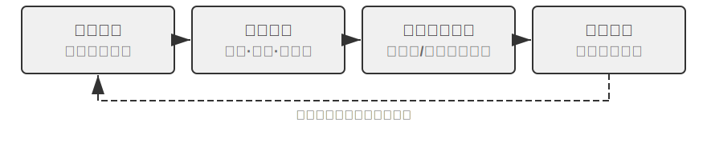
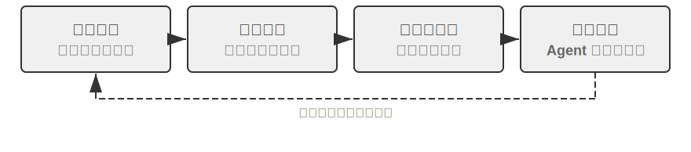
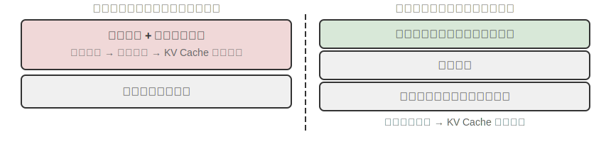
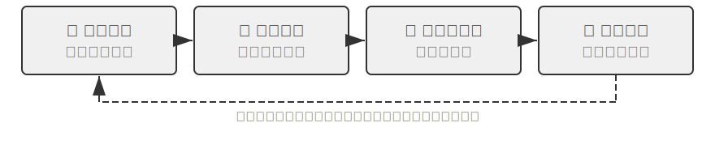

# Agent 的自我進化

前面幾章從不同維度建構了 Agent 的能力體系。第二章的上下文工程奠定了資訊管理基礎（包括 Skills 機制的按需載入）；第三章的知識庫與使用者記憶實現了跨會話的知識持久化；第五章展示了 Coding Agent 如何透過檔案系統沉澱經驗；第七章的強化學習後訓練則將策略固化到模型引數中。這些技術各有側重，但都指向同一個問題：**Agent 如何持續變強？**

即使是最前沿的模型，面對特定企業的退款流程、某個營運商的話術策略、或一個冷門 API 的呼叫方式時，仍然和剛入職的新員工一樣兩眼一黑。改模型權重需要大量資料和算力，更新週期動輒以周計；而現實中新的 API 上線、舊的服務下線、使用者需求不斷變化。Agent 需要一種更輕量、更即時的進化機制——不改動模型引數，卻能持續拓展自身的能力邊界。

本章探討的正是這種機制：**Agent 的自我進化（Self-Evolution）**。自我進化即外部化學習，包含兩個維度——從經驗中沉澱知識，以及主動發現和創造新工具。核心思想是將知識和流程從模型引數和臨時上下文中分離出來，外部化為可持久化、可檢索、可複用的外部資源——工具庫和知識庫。這不是後訓練的替代方案，而是互補：後訓練解決「如何讓模型更聰明」，自我進化解決「如何讓 Agent 更能幹」。

## 為什麼 Agent 不會自動學習

前面講的是現實需求。但還有一個更根本的問題：**如果上下文視窗可以無限長，把 Agent 經歷過的所有對話和工具呼叫結果都塞進去，它是不是就能自動學會一切？**

答案是否定的，原因藏在第二章討論過的注意力機制裡。這是本章的理論出發點，隔了幾章，值得簡單回顧。

第二章反覆強調：**上下文學習的內部機制更像檢索，而非推理**。注意力擅長「查詢」——「第 37 個籠子裡是什麼貓？」一步命中；卻不擅長在一次前向傳播裡「歸納統計」——“100 個籠子裡共有多少隻黑貓？「後者需要走訪全部記錄、維護計數狀態，本質是思考而非檢索。也就是說，把原始經驗一股腦堆進上下文，模型能」記得「，卻不會自動把它」提煉「成可複用的規律。哪怕上下文真的無限大，這道鴻溝依然存在：資訊就在那裡，卻沒人替模型完成從」具體記錄「到」一般模式「的那步壓縮。更何況，正如第二章」上下文腐化「所揭示的，上下文越長、噪聲越多，注意力被稀釋得越厲害，關鍵資訊反而越難被檢索到——無限上下文非但不帶來自動學習，還會讓檢索質量持續下滑。Karpathy 的洞察正可反過來讀：模型」記性差「是特性而非缺陷，它逼著我們主動、顯式地做知識提煉，而非指望模型自己從冗長歷史裡悟出規律。一句話：**學習不會自動發生，必須被顯式設計出來**——這正是本章存在的理由。

而「顯式設計的學習」並非到第八章才登場。前幾章已經埋下若干雛形，只是它們大多服務於**單次會話之內**或**緊鄰會話**的即時需求：第二章的**上下文壓縮**，用一次額外的 LLM 呼叫把臃腫的原始記錄「換」成算好的結論，替注意力補上欠缺的那半截「提煉」；第二章的 **Agent 狀態列**，由程式碼逐步把關鍵結論確定性地維護進上下文，是同一枚硬幣的另一面；第三章的**使用者記憶**，則已把「學習」推向跨會話——Agent 在一次次對話中攢下對使用者的瞭解，靠離線整理讓它越來越準。

第三章的使用者記憶本身就是一種學習，只不過沉澱的是「使用者是誰」的**資訊**（偏好、事實、習慣）。第八章要補的是另一半、也更長期的一半：把探索中總結出的解題策略、操作流程、失敗教訓乃至全新工具，沉澱為可持久、可檢索、可複用的**能力**，讓 Agent 不只是「記得更多」，而是「越來越能幹」。這類學習更長期、也更需要 Agent **主動**發起，因此值得單列一章展開——下面先從宏觀上為它定位。

## 三種學習正規化與自我進化的定位

第一章引入的三種正規化（圖 1-1）在此只作定位性對照。**後訓練**修改模型權重，透過 RL 將「經驗」固化為「肌肉記憶」，成功率高、延遲低，但更新成本高、週期長（第七章已詳述）；**上下文學習**（In-Context Learning, ICL）在提示詞中給出示範樣例做臨時適應，成本低、見效快但會隨會話結束而消失（詳見第一、二章）；**外部化學習**則是開發者最容易忽略的一條路徑——把知識沉澱到模型之外的檔案、知識庫和工具中，持久、可解釋、可隨時修正。三者協同而非競爭：事實性知識交給 RAG（詳見第三章）與外部化儲存，穩定的行為與格式交給後訓練固化，當下的臨時資訊交給上下文學習。

本章聚焦其中**不改模型權重**的路徑——外部化學習，它正對應章首所說的兩個維度：把經驗外部化為知識和 Skill，把能力外部化為工具。（這裡要與第五章「程式碼創造程式碼：Agent 自舉」區分：那裡講的是 Agent 建立與自身同類的系統，本章講的是不改權重的能力增長。第三章解決的是知識庫「怎麼存、怎麼查」，本章解決的是「誰來填充和更新」——Agent 如何主動積累經驗。）

為什麼需要它？先看一個反面場景。假設一個客服 Agent 第一次處理某銀行的退款流程：經過 15 分鐘的探索——打了 3 次電話、嘗試了 2 種話術——終於成功完成退款。如果它缺乏外部化學習能力，下次遇到完全相同的請求，只能從頭再花 15 分鐘走一遍同樣的探索，這次積累的經驗會隨會話結束而消失。關鍵在於「自主」二字：不是人類工程師為 Agent 準備文件，而是 Agent 在完成任務的過程中自己總結經驗、建構工具、更新知識庫——就像一位客服老手把散落的退款規則整理成一本隨時翻閱、並根據新情況自主更新的手冊。核心哲學是：與其期待模型記住一切，不如在任務完成後用額外算力把經驗總結、壓縮、結構化，再存入可持久化、可檢索的外部系統。相比引數學習，這種方式無需昂貴訓練即可快速沉澱可解釋、可驗證、可修正的知識；相比上下文學習，它透過主動提煉和結構化組織，避免了在海量原始資訊中低效檢索，實現了跨會話持久化。

外部化學習將 Agent 的學習能力從「記憶資訊」提升到了「建構能力」：它不僅能把經驗總結為概要性知識存入知識庫供後續檢索（第三章 RAG 部分介紹的 RAPTOR 樹形歸納同樣適用於經驗的逐層提煉——從具體操作記錄歸納為規則、再概括為原則），還能將重複性操作流程封裝為可精確執行的工具，形成不斷增長的技能庫。舉個例子：一位客服 Agent 在幫某位客戶處理退款時，可能學到三類不同性質的東西。第一類是一條特定規則——“A 公司退款必須驗證信用卡後四位「，這是事實性知識，存入知識庫即可；第二類是一段通用工具——」用 X API 自動查詢訂單狀態「，這是穩定可複用的操作序列，沉澱為程式碼工具最划算；第三類是一份崗位手冊——」退款流程的完整 Skill「，涉及策略判斷和經常變動的業務規則，更適合寫成 Skill 文件。表 8-1 總結了外部化學習沉澱的這三種產物。

表 8-1 外部化學習的三種產物

| 產物形態 | 承載內容 | 示例 | 使用方式 |
|-------------|----------------------|--------------------------------|---------------------------|
| 知識庫條目 | 事實和規則 | 「該銀行要求提供開戶行地址」 | 語義搜尋或 `grep` 精確檢索 |
| 專用程式碼工具 | 可重複的操作流程 | 「查詢帳戶餘額的 API 呼叫序列」 | 固化為程式碼、透過引數呼叫 |
| Skill 文件 | 複雜但常變的工作策略 | 「處理保險理賠的最佳實踐」 | 自然語言文件、按需載入 |

判斷該用哪種形態有一條簡單的經驗法則：**純粹是事實性資訊的存入知識庫，經常用且引數複雜的寫成程式碼（工具），經常變且涉及策略判斷的寫成文件（Skill）**。其中後兩種都屬於「工具生成」——外部化學習的更高階形式，不僅將「知識」外部化，更將「流程」外部化、程式碼化，從「每次重新思考」轉為「一次生成、多次複用」，就好比第一次手動部署伺服器後把步驟寫成自動化指令碼。第四章已詳細討論了專用工具與 Skill 的選擇框架。

第一章為苦澀的教訓給出的立場——**方向認同，節奏務實**——在外部化學習上體現得最為充分。不把所有知識壓縮到引數中，也不把流程寫死成 if-else 規則，而是讓 Agent 主動建構外部的知識與工具生態，把能力擴充套件的邏輯從模型內部（引數規模）延伸到外部世界（工具與知識庫的規模）。知識載體的選擇也遵循同一邏輯：本章討論的記憶與技能大多以 Markdown 加檔案系統的形式沉澱，而非依賴人工設計的知識圖譜——後者在專業領域更精確，但自然語言是模型最擅長處理的格式，再疊加 LLM 做壓縮與整理，才是一條不依賴人的先驗結構、能隨模型能力持續擴充套件的通用路徑。當然，外部化學習本身——用什麼格式儲存、如何組織索引、何時提煉——仍然需要工程設計，這正是「節奏務實」的體現。

## 為什麼 Agent 要從經驗中學習：從 「聰明」 到 「熟練」

前面那位把散落規則整理成手冊的「客服老手」，點出了從「聰明」到「熟練」的關鍵：差距往往不在於模型不夠聰明，而在於許多業務流程和領域知識是動態變化的、非公開的，僅靠提升基座模型的通用能力解決不了這類依賴「經驗」的問題。Agent 從經驗中學習，要學到的正是這類知識——某服務的退訂要填特定表單而非無效地打電話、總結出某優惠的適用條件（如退伍軍人或兩年以上的老客戶）、判斷某地某營運商的寬頻報價是否還有談判空間。同理，Coding Agent 不瞭解專案特有的程式碼規範和部署流程，瀏覽器 Agent 不知道某個網站的反爬策略和頁面佈局變化——這些都是預訓練資料中不包含的即時領域知識。

## 從經驗中學習

理解了「為什麼要學」之後，接下來的問題是「怎麼學」。外部化學習的工程實踐從「記錄和複用成功經驗」開始。以下兩個實驗展示了兩種互補的經驗積累方式：一種將高層策略提煉為可檢索的知識摘要（相當於「解題思路筆記」），另一種將具體操作序列固化為可重播的自動化工具（相當於「操作錄影」）。

表 8-2 將經驗學習機制按層面分類，用於幫助讀者理解知識提煉、知識組織、知識應用和工程支撐之間的關係。

表 8-2 Agent 經驗學習機制分層

| 層面 | 機制 | 解決什麼問題 |
|------|------|-------------|
| 知識提煉 | 策略摘要、工作流錄製、失敗反思 | 從成功與失敗經驗中提取可複用知識 |
| 知識組織 | Skills、睡眠整合 | 將知識結構化儲存和索引 |
| 知識應用 | 系統提示詞最佳化 | 將知識注入 Agent 的行為模式 |
| 工程支撐 | 跨會話續跑 | 讓長任務能持續執行 |

以上四個層面在後續內容中互相影響展開——策略摘要、工作流錄製和從失敗中學習（知識提煉）自然過渡到 Skills 與睡眠整合（知識組織），然後是系統提示詞最佳化（知識應用），最後以長任務的跨會話續跑收尾（工程支撐）。

> **實驗 8-1 ★★：從成功經驗中學習：策略摘要**
>
> `gaia-experience` 專案是「策略摘要」（Strategy Summary）思想的典型實現。所謂策略摘要，就是把一次成功的解題過程濃縮為一段結構化的經驗筆記——記錄「用了什麼方法、踩了什麼坑、關鍵步驟是什麼」，以便下次遇到類似問題時直接參考。
>
> 並非所有執行軌跡都值得提煉成經驗——判斷標準是**可遷移性**：當前任務中學到的教訓，是否能在未來類似任務裡複用？只對某次特定輸入有效的修正，不應進入長期記憶。
>
> 該實驗使用兩個關鍵基礎設施。**AWorld 框架**是專為 AI Agent 設計的開源執行與評估環境，提供標準化的工具集（瀏覽器、檔案系統、程式碼直譯器等）和自動評估管道，可以理解為 Agent 的「考試教室」。**GAIA** 是一套極具挑戰性的評測基準，透過需要人類智慧才能解決的多步驟複雜問題來評估通用 AI Agent 能力——比如「在某個網站上找到特定資訊，用程式碼處理後計算出答案」，往往需要綜合使用瀏覽器、檔案管理器、程式碼直譯器並進行復雜邏輯推理。
>
> 核心創新在於為 AWorld 框架中的 Agent 增加了完整的「學習～應用」閉環。在**學習模式（Learning Mode）**下，每當 Agent 成功完成一個 GAIA 任務，系統自動捕獲其完整行動軌跡，並利用 LLM 對其進行「反思」和「總結」，生成結構化的經驗摘要。這個摘要不僅包含最終答案，還提煉瞭解決問題的核心方法、關鍵洞察以及有效使用的工具序列。這些經驗被向量化後存入知識庫。在**應用模式（Apply Experience Mode）**下，當 Agent 接到新任務時，它會先在經驗知識庫中進行語義搜尋，找出歷史上最相似的成功案例，並將這些經驗作為「成功範例」注入系統提示詞，為決策提供指引。實驗證明這顯著提升瞭解決新問題的效率和成功率——Agent 解決的任務越多、積累的經驗越豐富、能力也就越強，形成了一個正向迴圈的自進化系統。
>
> **實驗 8-2 ★★：從重複任務中學習：工作流錄製與重播**
>
> `browser-use-rpa` 專案是「工作流錄製」（Workflow Recording）思想的絕佳範例。工作流錄製的思路類似於 Excel 的「宏錄製」功能：第一次手動操作時把步驟錄下來，以後只需點一下「重播」就能自動重複。這個專案要解決的問題很實際：許多在瀏覽器中進行的重複性操作（如傳送報告郵件、查詢特定網站資訊），雖然每次的具體引數不同（如收件人、查詢關鍵詞），但核心操作流程是固定的。讓 Agent 每次都從頭開始、用昂貴的多模態大模型來「重新發現」這個流程，是極大的資源浪費——本質上是隻依賴上下文學習，而沒有將成功經驗外部化為可複用的工具。專案核心是一場關於效率和成本的極致對比實驗。
>
> 在**學習階段（Learning Phase）**，Agent 首次執行任務時像人類一樣透過多模態 LLM 的觀察～思考～行動迴圈完成操作。每次 LLM 決定執行操作時，系統從 browser-use 框架的歷史記錄中提取被操作元素的精確定位資訊：網頁在瀏覽器中呈現為一棵 DOM 樹（Document Object Model，文件物件模型），每個按鈕、輸入框、連結都是樹上的一個節點；XPath（XML Path Language）則用類似檔案路徑 `/html/body/div[2]/button[1]` 的寫法指向特定節點。操作被錄製為結構化步驟：操作型別（點選、輸入等）、目標元素的 XPath、操作引數、以及執行後的驗證資訊（如頁面 URL 是否發生變化、預期元素是否出現）。任務成功後，LLM 生成語義標籤（如「傳送電子郵件」）和描述（「收件人欄位、主題欄位、內容欄位、傳送按鈕」），與步驟序列一起存入知識庫，形成引數化的「工作流」條目。
>
> 在**重播階段（Replay Phase）**，新任務到達時，系統結合語義相似度（嵌入向量）和關鍵要素檢查匹配已有工作流。匹配成功則按步驟高速執行：透過 Playwright（開源的瀏覽器自動化庫）的等待機制（`page.locator(xpath).wait_for(state='visible', timeout=15000)`）確保元素載入；引數化範本（如「在收件人欄位輸入 `{{email}}`」）透過輕量 LLM 呼叫從當前任務指令中提取實際引數值，無需完整的視覺思考。若某步失敗（找不到元素、等待超時），說明網頁結構可能已變化，此時標記該工作流「可能過時」，回退到學習模式重新透過 LLM 思考完成任務，並生成新工作流替換舊的。
>
> **驗收場景**：在 Gmail 網頁版中傳送郵件。
>
> - 首次執行（學習階段）：「給 test@example.com 傳送郵件，主題『測試郵件』，內容『這是一封測試郵件』」。觀察 Agent 如何透過多模態 LLM 識別「撰寫」按鈕、收件人輸入框、主題和內容輸入框、「傳送」按鈕。記錄操作步驟、耗時、LLM 呼叫次數。
> - 重複執行（重播階段）：「給 another@example.com 傳送郵件，主題『後續測試』，內容『第二封測試郵件』」。系統識別到匹配的工作流，提取新引數值，直接重播操作，無需 LLM 視覺思考。對比耗時和呼叫次數應顯著降低。
> - 知識更新：模擬網頁改版（修改 HTML 結構使某按鈕的 XPath 變化），驗證 Agent 能偵測到工作流失效並回退到學習模式，重新生成工作流更新知識庫。
>
> 預期可觀察到：重播階段任務執行速度顯著提升（數倍量級），LLM 呼叫成本大幅降低，成功率也更穩定。

工作流錄製並非孤立的工程技巧，它背後是一套更通用的方法。Voyager 是 NVIDIA 團隊提出的開放世界 Agent 架構（詳見後文），在 Minecraft 虛擬世界中將「探索～沉澱」迴圈系統化：**執行任務 → 驗證成功 → 將成功的操作序列存入技能庫 → 遇到類似任務時檢索複用**。實驗 8-2 正是這套思路在瀏覽器自動化場景的落地——學習階段對應「探索」，工作流知識庫對應「技能庫」，重播與失效回退對應「檢索複用」和持續改進。

實驗 8-2 也暴露了「錄製～重播」最脆弱的兩個環節，把它們處理乾淨，這套機制才真正可靠[^preact]。第一個環節是**什麼時候敢信重播**。更穩妥的做法是把一次成功的操作序列編譯成一個小小的**狀態機程式**：每個狀態都帶一個「驗證謂詞」（一段必須在當前真實螢幕上成立的介面模式），重播時**每一步動作之前先拿謂詞去核對即時螢幕**——「先看清、再動手」。一旦謂詞不成立或動作報錯，就交還給完整的 Agent 重新來過，並把這次的新軌跡重新編譯成程式。正因為重播時一次模型呼叫都不需要，命中快取的重複任務能快上 8.5–13 倍。第二個環節是**別把壞程式存進去**：編譯完成後立刻重置環境、從頭重播一遍，用基準自帶的評判器確認「這次是真的做成了」才准入庫——這道「存前驗證」能擋住那種「重播 100% 覆蓋、卻其實沒把事辦成」的程式（比如流程全走完、Save 也點了，但某個欄位其實是空的）。去掉這道關，程式庫會隨著有毛病的程式越攢越多而逐漸退化。歸結成一條幹淨的原則就是：**流程記憶也要有驗證閘門，自我改進的迴圈才不會腐壞**——這正是實驗 8-2 裡「偵測工作流失效、回退重學」的嚴格版。

[^preact]: 把成功軌跡編譯成帶驗證謂詞的狀態機程式、並設「存前驗證」閘門，完整機制見 Li, Bojie. *PreAct: Computer-Using Agents that Get Faster on Repeated Tasks.* arXiv:2606.17929, 2026.

### 從失敗中學習

策略摘要和工作流錄製都是從**成功軌跡**中提煉經驗——實驗 8-1 只在任務成功後才觸發反思和總結。但失敗經驗同樣值得沉澱，甚至資訊量更大：一次失敗明確排除了一條路徑，而成功往往只是眾多可行路徑中的一條。失敗經驗的典型沉澱形態有兩種：**錯誤模式庫**（記錄「什麼情況下用什麼方法會失敗、失敗的訊號是什麼」）和**負面規則**（「不要再用 X 方法做 Y”——例如」不要用打電話的方式辦理該營運商的退訂，電話渠道無權限處理「）。

這個方向的代表工作是 Reflexion（Shinn et al., 2023）[^reflexion-2023]：任務失敗後，Agent 用自然語言對失敗原因進行反思（如「我在第三步就應該先驗證身份，而不是直接提交表單」），並將反思文字存入情景記憶（episodic memory）；下次嘗試同類任務時，把這些反思作為額外上下文讀取，從而避免重蹈覆轍。整個過程不更新任何模型引數——Reflexion 正是「不改權重的進化」的經典範例；這種用語言承載的反思，資訊量遠比一個純量獎勵豐富，後文討論系統提示學習時會展開這一點。失敗經驗的另一個重要出口是系統提示詞：本章稍後討論的系統提示詞自動最佳化，正是把從失敗案例中提煉的負面規則（如「絕不因政策爭議而轉接人工」）寫入系統提示詞，使其成為對所有後續任務生效的行為約束。

[^reflexion-2023]: Shinn, N., et al. *Reflexion: Language Agents with Verbal Reinforcement Learning.* arXiv:2303.11366, 2023.

### Skills：將領域知識外部化為結構化能力

前面兩種機制分別沉澱了「怎麼想」和「怎麼做」的經驗。Skills 機制走的是第三條路——把領域操作知識系統性地提煉為結構化的、可按需載入的能力模組。可以把 Skill 理解為一份「崗位操作手冊」：新員工入職時不需要從頭摸索，讀完手冊就能上手幹活。第二章詳細討論了 Skills 的漸進式披露（Progressive Disclosure）機制（後設資料→核心流程→細則）和與 KV Cache 的相容性設計，本節關注 Skills 背後的知識外部化哲學及其自動化生成。

Skills 的核心價值在於用人類可讀的文字承載知識：更新快（不需重新訓練模型）、可審查（人類專家能直接修改完善）、可遷移（換模型或換系統都能用）。本質上，Skills 是把困在非結構化文件裡的領域知識轉化為 Agent 容易利用的結構化形式——讓 Agent 透過通用的搜尋和思考能力來利用知識，而不是把知識硬編碼到程式碼邏輯中。

更進一步，Anthropic 的 Skill Creator[^ch8-1] 是能創造其他 Skills 的元能力，它指導 Agent 透過觀察、學習和總結，將領域操作知識提煉為結構化 Skill。當被要求為某領域建立 Skill 時，Agent 首先透過與使用者對話理解具體使用場景，然後分析每個場景並識別可複用資源，最後建立包含標準目錄結構、scripts、references、assets 和 `SKILL.md` 主文件的完整 Skill 包。Skill Creator 使知識轉化過程本身也由 Agent 完成，實現了知識積累的自舉迴圈：Agent 不僅能用 Skill，還能造 Skill。

[^ch8-1]: Anthropic, “Skill Creator” , 2025. https://github.com/anthropics/skills/blob/main/skill-creator/SKILL.md

Claude Code 的 `CLAUDE.md` 機制展示了類似能力：首次接觸程式碼倉庫時主動通讀程式碼庫，生成包含架構設計、編碼規範、測試方式等核心資訊的專案指南，在後續開發中持續引用和更新。這種自動化的 Skill 生成機制使 Agent 的能力擴充套件不再受限於人類專家的可用時間和知識覆蓋範圍——當 Agent 進入新領域時，可透過自主探索學習建構操作指南並固化為 Skill，實現從「依賴預程式設計知識」到「在實踐中學習積累知識」的轉變。

從「經驗沉澱」的視角看，工具生成這條路徑的具體形態又可分為專用程式碼工具和 Skill + 通用執行器兩種。如何在兩者間取捨，前文已給出判別原則、第四章有完整框架，此處不再重複；落到本節的場景上：引數複雜、呼叫頻繁的操作沉澱為程式碼工具（如 Voyager 在 Minecraft 中沉澱的技能庫、瀏覽器工作流錄製生成的引數化指令碼），策略性、易變動的業務規則寫成 Skill 文件（如 Claude Code 的 `CLAUDE.md`）。實際系統往往混合使用兩種形態。

### 睡眠學習：使用者記憶的自主進化

前面討論的經驗學習機制——策略摘要、工作流錄製、Skills 生成——都發生在任務執行過程中或結束後的即時提煉。但人類學習還有一個重要環節：**睡眠期間的記憶整合**。第二章在討論上下文壓縮時曾用這個類比——大腦將白天的感官輸入加工為緊湊的長期記憶；這個類比不僅適用於單次會話內的上下文壓縮，更可以延伸到跨會話的經驗管理：白天獲取的零散經驗在睡眠中被重新組織、去冗餘、與已有知識網路融合，轉化為更緊湊、更易調取的長期記憶。

這種離線整合最典型的物件，是 Agent 關於**使用者本人**的記憶——你是誰、有什麼偏好、說過哪些事實。這裡要先釐清一個常見誤解：像 Claude Code 這樣的 Agent 在「睡眠」裡整理的，主要是**使用者記憶**而非共享知識庫。知識庫（第三章的 RAG）承載的是與具體使用者無關的領域文件，通常由離線管道批次灌入、少有變動；而使用者記憶是 Agent 在一次次對話中零散攢下、越來越懂你的模型——它才是需要反覆「睡眠整合」的那部分。本節接下來介紹的 Claude Code 與 Hermes，存的都是這類使用者記憶，重點看它們**如何自主進化**。

再明確本節與第三章的分工：第三章講過使用者記憶「怎麼存、怎麼查」，也介紹了記憶儲存層的整理**演算法**（聚類摘要、衝突版本化等），此處不再重複；本節關注的是**工程與進化問題**——何時整理、誰來整理、以什麼形式沉澱，才能讓記憶越用越準。

**Claude Code：用 Markdown 儲存使用者記憶。** Claude Code 把使用者記憶直接存成人類可讀的 Markdown 檔案：每條記憶是帶後設資料（frontmatter）的小檔案，只記錄一條事實，再由一個索引檔案（`MEMORY.md`）彙總導航。這種形式的好處一目瞭然——更新快（改檔案即可，無需重訓模型）、可審查（使用者能直接開啟修改）、可遷移（換模型或換系統都能用）。

但「記錄」之外還需要「整理」。Claude Code 將睡眠整合的認知隱喻工程化為一個在後臺週期性執行的記憶整合機制。（以下描述基於公開版本行為與社群分析整理，並非官方正式定義。）核心設計思想是：**經驗積累和記憶整合是兩個獨立的過程，不應在同一時間視窗內完成**——Agent 也需要專門的「複習時間」。具體而言，當滿足兩個門控條件（距上次整合超過一定時間間隔、且期間積累了足夠多的新會話）時，系統在後臺啟動一個獨立的子 Agent，執行四階段整合：**定向**（Orient，讀取現有記憶索引，瞭解知識全貌）、**採集新訊號**（Gather，從近期會話中搜尋值得持久化的新資訊，並偵測與現有記憶矛盾的事實）、**整合**（Consolidate，將新訊號合併進已有主題檔案而非新建近似重複條目，把相對日期轉成絕對日期，刪除已被證偽的舊事實）、**修剪與索引**（Prune & Index，控制索引大小、移除過時指標）。

這套機制最重要的設計決定是：記憶整合不在使用者互動時執行，而是非同步後臺完成，使用者完全感知不到。雙重門控和分散式鎖確保並行例項不會重複觸發整合，失敗時自動回退、下次重試；整合子 Agent 的權限也被嚴格限定在記憶目錄內，不會越界。從更宏觀的視角看，它代表了使用者記憶管理從「有記錄無整理」到「記錄—整合—修剪」完整生命週期的演進——沒有定期整合，記憶庫會退化為低訊雜比的資訊堆積，反而拖累檢索質量；定期的「睡眠整合」讓記憶庫保持緊湊、一致、易於導航，正如人類專家的知識不是事實的無限堆疊，而是經過反覆整理的結構化理解。

**Hermes：把自主學習做成常駐服務。** Nous Research 於 2026 年開源的 Hermes 把這套思路推得更徹底：它是常駐在使用者自己機器上的程序（daemon），跨會話持續積累記憶並自主進化。其記憶分為四層[^hermes]：**提示詞記憶**（`MEMORY.md` 與 `USER.md`，會話啟動時注入，刻意限制在幾千字元內，以「逼迫」Agent 主動取捨）、**會話檢索**（用 SQLite 全文索引 FTS5 存放歷史會話，檢索到的片段先經 LLM 摘要再注入，只帶進與當前任務相關的部分）、**技能庫**（過程性記憶，採用漸進式披露，預設只載入技能名與摘要）、以及可選的 **Honcho 使用者建模層**（在後臺被動追蹤偏好、溝通風格與領域知識，跨會話刻畫「使用者與 Agent 如何共同演化」）。當一次任務滿足特定條件（如工具呼叫超過五次、從錯誤中恢復、收到使用者糾正、或跑通了一個非顯然的工作流）時，Hermes 會自動把其中的經驗固化為一個可複用技能，並優先以打補丁（patch）的方式增量更新而非整篇重寫。Claude Code 與 Hermes 代表了當下使用者記憶自主進化的主流形態——都以人類可讀的 Markdown/文字為載體。

[^hermes]: Nous Research, *Hermes: A Self-Improving Personal Agent*, 2026. https://hermes-agent.nousresearch.com/docs/

### 系統提示詞的自動最佳化

回到系統提示詞這條主線：前面幾節的機制都把經驗和記憶沉澱在模型之外——知識庫、工作流、Skill 檔案、使用者記憶。但還有一種更直接的經驗載體——系統提示詞本身。

Andrej Karpathy 認為，當前 LLM 學習正規化中遺漏了一種重要的學習方式——「系統提示學習」（System Prompt Learning）。預訓練是為了獲取知識，微調是為了養成習慣性行為，這兩種方式都涉及模型引數改變。但人類的很多學習過程更像是「系統提示」的更新——遇到問題想通了某件事，會用明確的語言給自己記下來，比如「下次遇到這種型別的問題，應該先試這種方法」。

Karpathy 指出，LLM 就像電影《記憶碎片》的主角——每次醒來都不記得之前發生了什麼，而我們還沒給它們提供記錄本。他在閱讀 Claude 的系統提示詞（約 1.7 萬個單詞，具體隨版本變化）後發現其中包含大量通用問題解決策略，例如：「如果要求 Claude 計算單詞、字母和字元，它會在回答之前一步步思考，透過給每個字母分配數字來顯式計數。」這是為了解決「strawberry 中有幾個 r」之類的問題。

Karpathy 認為這類知識不應由人類手工編寫，而應來自系統提示學習。它與強化學習有相通之處——都靠失敗案例改進未來行為。但兩者的學習演算法不同：系統提示學習直接修改系統提示詞文字，強化學習則透過梯度下降調整模型引數。前者的資料效率顯著更高，原因是回饋通道的「維度」差異。這是 Karpathy 針對**結果獎勵型強化學習**的批評：一次只有一個純量的結果獎勵（如「對/錯”），資訊頻寬遠低於一整段自然語言描述的覆盤（“這裡應該先驗證身份證再走退款流程”）。正因如此，同樣一次失敗，系統提示學習能吸收的資訊遠多於“對/錯”一個位元。

筆者認為，系統提示學習的本質是透過邊界情況（edge cases）讓規則邊界更清晰。大多數規則在典型場景下運作良好，真正的挑戰在於灰色地帶——「在使用者請求超出能力範圍時轉接人工」聽起來很清晰，但「使用者不滿意政策」算不算超出範圍？使用者要求例外處理呢？這些邊界情況才定義了規則的真正含義。

相比強化學習需在海量資料上反覆試錯才能調整權重，系統提示學習可以從單個或少量邊界案例中快速學習。遇到一個失敗案例，就可以立即在系統提示中新增明確規則，不需要收集數千個類似樣本進行微調。這種學習不僅資料效率高，而且完全可解釋——每條規則都是明文寫出的，可以審查、修改、刪除。隨著邊界情況不斷積累，系統提示逐漸演化為一本詳盡的「問題處理手冊」，就像一位專家在工作中不斷完善自己的筆記。

如何自動實現？關鍵在於引入 Coding Agent。系統提示詞和工具描述本身就是文件和程式碼，分散在多個檔案中。發現邊界情況時，Coding Agent 可以：(1) 閱讀和理解現有系統提示，分析規則結構和失敗上下文；(2) 生成精確的程式碼級 diff，指明在哪個檔案的哪個位置做什麼修改；(3) 保持一致性，確保新規則不引入矛盾或冗餘。最終稽核權仍在人類專家手中，由他們審查這些 diff 判斷是否合理。

提示詞自動最佳化並非只有 Karpathy 的構想，學術界已有成體系的研究。DSPy[^dspy-2023] 把提示詞當作程式的可最佳化引數：開發者只宣告每個模組「輸入什麼、輸出什麼」，由框架在評估集上自動搜尋示例組合和指令措辭，將提示詞工程從手工除錯變成系統性最佳化。OPRO[^opro-2023] 則讓 LLM 自己充當最佳化器：把歷史提示詞及其得分作為上下文，讓模型迭代提出更好的改寫，在數學推理等任務上超過人工設計的提示詞。2025 年提出的 GEPA[^gepa-2025] 走得更遠：它對失敗軌跡做自然語言反思，據此進化提示詞，並在多個候選之間維護帕累託前沿（即一組各有所長、無法被彼此全面超越的候選解，而非只留單一「最優」解）以保留互補的最佳化方向——在多項任務上超過了 GRPO 微調（第七章介紹過該演算法），而所用的取樣次數少一到兩個數量級。GEPA 做的正是本節所說的「系統提示學習」，其實證結果也支撐了前文關於回饋資訊量的判斷。

[^dspy-2023]: Khattab, O., et al. *DSPy: Compiling Declarative Language Model Calls into Self-Improving Pipelines.* arXiv:2310.03714, 2023.

[^opro-2023]: Yang, C., et al. *Large Language Models as Optimizers.* arXiv:2309.03409, 2023.

[^gepa-2025]: Agrawal, L. A., et al. *GEPA: Reflective Prompt Evolution Can Outperform Reinforcement Learning.* arXiv:2507.19457, 2025.

這些自動化框架與上述「Coding Agent 生成 diff + 人工稽核」方案的差異體現在三點。其一是離線與線上：自動化框架通常在離線評估集上批次最佳化，而 diff 方案隨生產環境中的邊界案例逐條演進。其二是有無人工把關：自動化框架端到端自動改寫，效率高，但可能產出過擬合評估集的「怪異」措辭；diff 方案保留人類稽核，每條規則可解釋、可追責，更適合客服等高風險場景。其三是是否需要評估集：DSPy、OPRO、GEPA 都依賴帶評分的任務集來驅動搜尋，而 diff 方案只需要單個失敗案例加一段人類回饋。實踐中兩者可以互補：用自動化框架完成初始提示詞的批次最佳化，再用 diff 方案做上線後的持續演進。

> **實驗 8-3 ★★：系統提示詞的自動最佳化**
>
> **實驗目標**：實現基於人類回饋的自動化系統提示學習機制。
>
> **技術方案**：基於 tau-bench 航空客服場景設計系統提示學習流程。初始 Agent 的人工轉接規則為「僅當請求無法在你的行動範圍內處理時才轉接」。透過評估發現 Agent 過度轉接——一遇到政策爭議就轉給人工，而不是嘗試向使用者解釋政策。人類專家回饋指出，應透過耐心解釋政策來處理爭議，而非一轉了之。Coding Agent 讀取系統提示詞檔案，定位相關規則，生成精確修改：將轉接邊界明確為「使用者明確要求人工客服 + 緊急安全情況」，新增「絕不因政策爭議而轉接」的負面規則，並實施程式碼級修改。
>
> **對照組**：人工調優的系統提示詞（不經自動最佳化流程）。
>
> **預期觀察/驗收標準**：最佳化後的系統提示詞在原有保留任務集上表現不退化（不因新增規則而破壞既有正確行為），同時在觸發過度轉接的邊界案例集上正確率提升——即針對政策爭議不再一轉了之，而是先嚐試解釋政策。

### 長任務的跨會話續跑（工程支撐附論）

嚴格來說，本節討論的不是經驗提煉機制，而是自我進化的**工程支撐**（對應表 8-2 的「工程支撐」層）：把「外部化」的理念應用於**任務狀態管理**，讓「學到的」經驗和「幹到一半的活」都能跨會話存續。它與第五章的 Coding Agent 工作流一脈相承，放在本章是因為它依賴同一個處理器核手法——把狀態寫到模型之外。許多工（如從零搭建一個完整應用）的規模遠超單個會話的上下文視窗，即使啟用上下文壓縮，也擋不住兩類問題：在單個會話裡試圖做完整個應用，上下文先耗盡；只做完一部分，下一輪又無法準確恢復進度而過早判斷完成。

更穩定的做法是把長任務拆成 **Initializer Agent** 和 **Coding Agent** 兩個角色協作——類似於專案經理先拆分任務、寫好清單，然後工程師按清單逐項完成。Initializer Agent 只在第一輪執行一次，生成結構化的功能清單（如 `feature-list.json`）、初始化指令碼、初始 git commit 和進度檔案（如 `progress.json`），把任務變成可持久化的檔案系統狀態。後續會話由 Coding Agent 迴圈執行：每次從進度檔案和 git log 恢復現場，定位當前待實現的功能，實現並跑測試，更新進度檔案的 `passes` 欄位，提交程式碼後退出。關鍵約束是：進度放在檔案裡而非上下文裡；功能清單用 JSON 而非 Markdown（結構化格式更適合模型穩定讀寫）；所有功能都變成 `passes: true` 時任務才算完成。這樣即使中途崩潰，也能直接從檔案系統中的狀態繼續——任務一旦超過半小時，崩潰恢復就不是可選項而是必選項。

## 從工具使用者到工具創造者

第四章「主動工具發現」一節解決了「從已有工具中找到合適的」問題。本章接下來討論更進一步的能力：當需要的工具根本不存在時，Agent 如何自主發現和創造新工具。

### 預定義工具集的根本性侷限

當前 AI Agent 系統大多建立在一個隱含假設上：可以預先定義一個足夠完備的工具集來應對絕大多數任務。在封閉領域這或許成立——一個專門做客服的 Agent 可能只需十幾個工具。但如果想建構真正的通用型 Agent，這個假設就過於樂觀了。

根本困難在於：現實世界需要的工具數量幾乎無限，沒法預先列舉；即使工具庫裡有類似的，介面和引數也往往跟當前需求不完全匹配，用起來要麼低效要麼出錯；更不用說大量有用的服務根本不是以 Agent 友好的標準介面存在的，適配一個就需要一次人工開發。歸根到底，**預定義正規化將 Agent 的能力邊界鎖定在了人類工程師的預見和準備上**。

### 從預定義到自我進化

突破這一侷限需要根本性轉變：將 **Agent 從工具的使用者提升為工具的創造者**。Agent 不再被動等待人類準備工具，而是根據任務需求主動從開放世界中尋找、學習、適配和創造工具——這正是本章開頭所說的自我進化的第二個維度：從工具使用者變為工具創造者。

核心思想是：賦予 Agent 最小的基礎能力作為起點，透過與環境互動和對外部資源的利用，自主擴充套件能力邊界。正如 Alita 論文 [^alita-2025] 所提出的——「最小預定義，最大自我進化」：少量精心設計的基礎工具提供與世界互動的基本能力，自我進化機制在此基礎上賦予無限擴充套件潛力。

[^alita-2025]: Qiu, J., et al. *Alita: Generalist Agent Enabling Scalable Agentic Reasoning with Minimal Predefinition and Maximal Self-Evolution.* arXiv:2505.20286, 2025.

自我進化並非否定預定義工具的價值，而是建構了一個層次化的能力體系。

這種正規化轉變的關鍵在於把全球開源生態變成 Agent 可用的資源池——遇到新任務時不是等人類準備工具，而是直接去搜尋最貼近需求的庫，必要時寫膠水程式碼拼接。用過的工具積累下來，下次遇到相似任務直接呼叫，不必重新發明輪子。

### Agent 從網路上自主尋找並執行工具

MCP（Model Context Protocol，第四章詳細介紹）是 Agent 發現和呼叫工具的標準協定——可以理解為「工具市場的通訊規範」，Agent 透過它瀏覽可用工具、理解輸入輸出格式、並可靠地發起呼叫。以 Alita 系統為例，看一個具體的任務：「在 2018 年 3 月釋出的、由《指環王》中咕嚕的配音演員解說的 YouTube 360 VR 影片中，解說員在首次展示恐龍之後直接提到了什麼數字？」這個任務需要一種特定的領域能力——提取和分析影片內容。Agent 不會報告「無法完成」，而是啟動多階段自我進化流程：

1. **MCP 腦力激盪階段**：分析任務需求，識別出需要「YouTube 影片字幕爬取器」。具體實現是讓 LLM 分析任務需求後生成一組候選工具描述（如「需要一個能抓取 YouTube 字幕的工具」），然後在 MCP 伺服器登錄檔中搜尋匹配的現有伺服器，或標記為需要新建
2. **Web Agent 執行階段**：在開源倉庫中搜尋，找到 Python 庫 youtube-transcript-api（GitHub: jdepoix/youtube-transcript-api）
3. **Manager Agent 綜合階段**：訪問 GitHub 倉庫，閱讀 README 和程式碼示例，理解核心 API，推匯出環境配置和程式碼框架
4. **Manager Agent 執行階段**：將學習成果封裝為符合 MCP 協定的工具，提取目標影片字幕，分析內容找到答案「100000000」

新建立的工具被儲存到工具庫中，以後遇到類似的影片分析任務可以直接複用。

### Agent 編寫程式碼生成新工具

從開源生態整合現有工具是第一種模式，但並非所有需求都有現成方案。Agent 還需要展現第二種能力：**從頭編寫程式碼創造新工具**。

如本章開頭所定義，工具生成是外部化學習的更高階形式——這裡更進一步，把「流程」也外部化、程式碼化為可精確執行的工具。

這裡的關鍵差異在於**程式碼的去向**：傳統 Agent 系統中，程式碼執行只是拋棄式的——呼叫 Python 直譯器跑一段指令碼完成當前任務，然後程式碼就丟棄了。自我進化正規化下則不同，Agent 編寫程式碼的目的是**創造可複用的模組化工具**，持久化儲存在工具庫中，不再依賴模型的臨時上下文或引數記憶。這樣做有兩個好處：經驗不再隨會話結束而消失，而是永久積累；程式碼工具的行為確定、可測試，比每次重新讓模型思考可靠得多。

創造過程本身遵循軟體工程的常規節奏——從需求規約與介面設計，到演算法選擇與實現，再到測試驗證，最後生成符合 MCP 協定的 schema 並註冊到工具庫。與人類工程師相比，Agent 在需求理解、除錯直覺、邊界條件說明上更容易出錯，因此生產系統通常把最多的算力壓在測試驗證環節，用大量自動化測試彌補前幾步的不確定性。

### Voyager：在虛擬世界中持續學習的 Agent

前面討論了 Agent 如何自主發現和建立工具。Voyager 在 Minecraft 虛擬世界中將這一理念推向了極致：它不僅使用工具，還從成功經驗中建立可複用的技能庫，真正實現了「越用越熟練」的自我進化。

Voyager 是外部化學習在開放世界中的典型實踐。這個 Minecraft Agent 透過將每次成功經驗提煉並外部化為可執行程式碼工具，實現了持續學習和自我進化。

其架構體現了三個關鍵要素：

**自動課程生成器**根據 Agent 當前狀態、已掌握技能和周圍環境，自動提出下一個探索目標（如「尋找鐵礦」「製作鐵鎬」）。目標處於 Agent 的「最近發展區」——既不太簡單也不太困難，類似於遊戲中的關卡設計，循序漸進。

**技能庫**是核心機制。成功完成新任務後，動作序列被提煉為可執行程式碼並持久化儲存。技能是層次化、可組合的——比如「製作木鎬」會呼叫「砍樹」和「製作木板」等基礎技能。面對新任務時，檢索和組合已有技能即可快速解決，不需要每次都從頭讓 LLM 思考。

**迭代提示機制**負責技能的持續改進。失敗時收集回饋（環境觀察、錯誤訊息、自我驗證結果），整合到 LLM 提示中引導生成改行程式碼，反覆迭代直到穩定。

Voyager 在 Minecraft 中自主探索，技能庫持續增長：論文報告它能顯著更快地解鎖木、石、鐵、鑽石等關鍵科技樹里程碑，發現的獨特物品數量達到基線方法的 3.3 倍。這種持續學習能力的本質，正是透過外部化學習實現了從「臨時適應」到「永久積累」的跨越——每一次成功探索都轉化為可複用的程式碼工具。它證明了這種正規化的可行，為在現實世界建構自我進化 Agent 提供了完整的方法藍圖——下面的實驗就將它應用到現實世界的工具發現場景中。

> **實驗 8-4 ★★★：Agent 從網路上尋找工具，實現自我進化**
>
>
> 
>
>
> **基礎工具配置**：僅 `web_search`、`read_webpage`、`code_interpreter`、`create_tool`、`search_tools`。無任何特定領域預定義工具。
>
> **任務一：YouTube 影片內容理解**——「在 2018 年 3 月釋出的、由《指環王》中咕嚕的配音演員解說的 YouTube 360 VR 影片中，解說員在首次展示恐龍之後直接提到了什麼數字？」預期流程：Agent 分析任務，識別出需要提取 YouTube 字幕的能力；透過搜尋找到 youtube-transcript-api 庫及 GitHub 倉庫；閱讀 README 和文件理解安裝方法和介面；用程式碼直譯器測試該庫；編寫封裝程式碼將字幕提取功能包裝為標準工具；使用新工具提取目標影片字幕並分析內容。成功標準：輸出正確答案「100000000」。
>
> **任務二：即時金融資料查詢**——「截至今天，NVIDIA (NVDA) 的最新股價是多少？與一週前相比漲跌幅是多少？」預期流程：Agent 識別出需要即時股票資料能力；搜尋可用的金融資料 API（yfinance、Alpha Vantage 等）；評估多個方案的易用性、是否需要 API key、資料完整性；選擇最合適的方案並建立查詢工具。如果某個 API 需要註冊但無法自動完成，Agent 應能切換到備選方案，而非產生幻覺或直接放棄。
>
> 驗證工具複用：再次執行相同型別任務時，Agent 應直接從工具庫中檢索已建立的工具，而非重新經歷搜尋和建立過程。
>
> **挑戰與難點**：搜尋精度（可能找到不合適的庫或過時資訊）、文件理解（某些開源專案文件不完整，需從多個來源綜合）、環境配置（某些庫有複雜的依賴關係或系統要求）、錯誤恢復（第一次嘗試可能失敗，Agent 需要除錯修正）、幻覺控制（必須基於真實搜尋結果和文件工作，不能憑空假設某個庫存在或某個 API 的用法）。

### 三層能力的持續積累

持續學習體現在三個層面：

- **工具層面**：成功建立的工具儲存到工具庫，新工具可以基於已有工具建構，形成層次化體系。例如，先有了「獲取股票價格」工具，後續就能在此基礎上建構「投資組合分析」工具
- **知識層面**：每一次工具建立都伴隨著知識積累。Agent 逐漸瞭解到哪些開源庫適用於哪類任務、哪些 API 不需要申請 key 即可使用、哪些庫和系統環境之間經常有相容性問題。這些知識可被提取為啟發式規則或案例庫，沉澱到知識庫中（儲存與檢索機制見第三章），指導未來的工具建立
- **策略層面**：Agent 透過反覆實踐逐漸改進自我進化策略——最初可能選錯庫、寫出過於複雜的邏輯、遺漏關鍵邊界情況，但透過失敗和成功的回饋，逐步學會更準確地評估開源專案質量、更簡潔地實現功能、更全面地設計測試。這種元學習使 Agent 的自我進化能力本身也在進化。短期靠系統提示詞與 Skill 沉澱這類元經驗；長期穩定後可由強化學習固化到權重（見第七章）——後者已超出本章「不改權重」的範圍

前兩個層面都是外部化學習的直接應用——工具沉澱到工具庫（本章）、知識沉澱到知識庫（第三章）；策略層面則展示了外部化學習與後訓練的接力分工：先用可解釋、可修改的外部載體快速迭代，待策略穩定後再考慮引數（第七章）。

### 自我進化的安全邊界

自我進化賦予 Agent 強大的能力擴充套件潛力，但也帶來了獨特的安全風險。

**供應鏈攻擊（Supply Chain Attack）**是最直接的威脅：Agent 從網路上自主搜尋和安裝開源庫時，惡意的 PyPI 或 npm 包可能被自動下載和執行。這就好比讓一個新員工自由上網下載軟體——如果不加約束，很容易中招。緩解措施包括在沙盒環境中執行工具、對新建立的工具進行自動安全掃描等。

**能力漂移（Capability Drift）**是更隱蔽的風險：Agent 透過持續學習積累的策略和工具可能逐漸偏離設計者的原始意圖，尤其在缺乏人類監督的長期執行場景中。應對策略包括設定允許的工具型別白名單、限制工具庫的增長範圍，以及定期人工稽核新增工具。

**工具質量退化**同樣需要關注：自動生成的工具如果缺乏充分測試，可能在邊界情況下產生錯誤結果，而這些錯誤會透過工具複用傳播到後續任務中——一個有 bug 的工具被反覆呼叫，危害遠大於拋棄式的推理錯誤。

**記憶與經驗投毒（Memory Poisoning）**是自我寫入機制最內生的攻擊面。Agent 在任務執行中接觸的內容——網頁文字、工具輸出——可能包含惡意注入的指令（提示注入，詳見第二、四章）。如果這些內容未經審查就被當作「經驗」沉澱為長期記憶或 Skill，攻擊就從拋棄式變成了永續性：被汙染的條目跨會話持續生效，每次被檢索命中都會影響後續任務。與會話內的提示注入相比，這種攻擊更隱蔽也更難清除——受害的不是單次回答，而是 Agent 的「知識」本身。緩解手段有三層：**寫入前審查與來源標記**（記錄每條經驗來自哪個任務、哪個資訊源，對來自不可信來源的內容先做注入偵測再入庫）；**經驗與指令通道隔離**（檢索出的經驗以「參考資料」而非「命令」的身份注入上下文，明確告知模型經驗內容不具備指令效力）；**檢索時注入偵測**（對命中的經驗條目做輕量的注入模式掃描，發現可疑內容時降級使用或告警）。知識保鮮與投毒防禦是同一枚硬幣的兩面：保鮮對抗知識的自然過時，投毒防禦對抗知識的惡意汙染——兩者都要求經驗庫具備來源追溯與淘汰機制。（知識保鮮機制如何偵測和淘汰過時經驗，留作思考題 3 延伸。）

> **實驗 8-5 ★★★：為自我進化 Agent 設計評估資料集**
>
> 前面的實驗展示了 Agent 如何從經驗中學習、發現工具、創造工具。但如何評估這些自我進化能力？這需要特殊設計的評估資料集——既要測試工具發現與創造能力，又要避免簡單記憶固定的工具使用模式。
>
> 建構 20 個不同領域的工具需求任務（多媒體處理、金融資料、科學計算、地理資訊、社交媒體、IoT 裝置控制等），**任務描述只說明目標不暗示工具名稱**——如「獲取某 YouTube 影片的字幕」而非「使用 youtube-transcript-api」，「查詢加密貨幣即時價格趨勢」而非「使用 CoinGecko API”——確保 Agent 必須真正搜尋或創造工具。基礎工具集通常包括：網路搜尋、網頁閱讀、程式碼直譯器、工具建立與註冊。
>
> 設計四層分層驗證：
>
> 1. **任務正確性**：字幕內容準確、金融資料符合實際
> 2. **工具發現有效性**：分析搜尋關鍵詞、訪問的網頁、選擇的庫來判斷
> 3. **工具創造質量**：錯誤處理、引數驗證、文件完整性，使用 LLM-as-a-Judge 按 Rubric 評分
> 4. **工具複用能力**：第二次執行相似任務是否直接檢索已建立工具而非重複搜尋
>
> 為每個任務準備參考方案（推薦的開源庫列表和典型 API 示例）和已知陷阱（廢棄的庫、需付費註冊的 API 等）。

## 本章小結

本章系統探討了 Agent 在不修改模型權重的前提下持續拓展自身能力的方法——自我進化。

在第一章和第七章的基礎上，本章先明確了自我進化在三種學習正規化中的定位——後訓練固化引數（第七章已詳述，本章僅作對照）、上下文學習做臨時適應，本章聚焦的是不改模型權重的進化路徑：外部化學習及其延伸——然後展開其工程實踐。

本章圍繞自我進化的兩個維度展開。一個維度是從經驗中沉澱知識：策略摘要提煉決策智慧、工作流錄製固化操作流程、Reflexion 式反思沉澱失敗教訓、Skills 將領域知識結構化、系統提示詞最佳化從邊界案例中提煉規則——共同形成「越做越熟練」的積累機制；另一個維度是主動突破工具邊界：在第四章「主動工具發現」解決的「從已有工具中找到合適的」之上更進一步，從網路搜尋、整合現有庫，到從頭編寫新工具，Agent 從工具的使用者變成創造者，Voyager 提供了這種正規化在開放世界中的完整藍圖。

至此，我們完成了 Agent 核心能力體系的全部討論——從上下文工程、工具設計、程式碼生成、評估方法、模型後訓練到自我進化。接下來的兩章將視角轉向前沿應用。下一章將探討 Agent 如何從純文字輸入輸出走向多模態感知與即時互動：語音對話、Computer Use（GUI 自動化）和機器人操作。這些場景共享兩個處理器核挑戰——多模態和即時性——正是它們驅動著 Agent 架構從序列流水線向端到端模型的根本性演進。

## 思考題

1. ★★ Agent 自主搜尋和整合開源庫（自我進化）的能力極其強大，但也帶來供應鏈安全風險。一個惡意的 PyPI 包可能被 Agent 自動安裝和執行。你將如何緩解這個風險？
2. ★★ Voyager 式經驗學習讓 Agent 將成功的工具使用模式編碼為可複用的 Skill。但 Skill 庫不斷增長後，檢索正確的 Skill 本身變成了新的挑戰。這是否構成了一個遞迴問題——Agent 是否需要一個「Skill 檢索 Agent」來管理自己的 Skill？
3. ★★★ 外部化學習將成功經驗編碼為策略摘要或工作流指令碼。但「成功」的定義可能隨時間變化（比如業務規則更新）。過時的經驗不僅無用，還可能有害。你會設計怎樣的「知識保鮮」機制來偵測和淘汰過時經驗？
4. ★★★ 工作流錄製將成功操作序列轉化為可重放的自動化工具。但 API 會更新、UI 會改版，錄製的工作流可能隨時失效。如何讓工作流能在環境變化時自動修復，或者至少不在出錯的情況下幻覺認為任務已經完成？
5. ★★★ 三種學習正規化（後訓練、上下文學習、外部化學習）分別對應模型引數、上下文視窗和外部儲存三種知識載體。如果有一個急需上線的業務規則，應該用哪種方式？如果客服機器人回覆使用者的語言過於囉嗦，應該用哪種方式？如果希望讓生成的 PPT 風格與公司現有 PPT 風格儘量相符，應該用哪種方式？這些技術選型與目前使用的模型能力是否有關？
6. ★★ Agent 從網路上搜尋工具時，如何判斷一個開源庫是否「好用」？Agent 能否學會自己評估開源專案的質量？
7. ★★ 本章將 Agent 自我進化定位為「不改引數也能變強」的路徑。但第七章指出，策略層面的改進最終還是需要強化學習來固化。這兩種路徑的邊界在哪裡——什麼樣的能力提升適合外部化，什麼樣的適合寫入引數？
