# 多模態與即時互動

前面的章節探討了 Agent 在文字世界中的設計——透過上下文、工具和程式碼與數字系統互動。然而，Agent 的互動物件不僅僅是文字和 API。當 Agent 需要聽懂使用者的語音指令、在螢幕上找到並點選正確的按鈕、或控制機械臂精確抓取物體時，它進入了一個全新的領域：**多模態即時互動**——從純文字輸入輸出擴充套件到**多模態感知與即時響應**，這是 Agent 跳出「對話方塊」的關鍵一步。所謂「多模態」，就是同時處理多種資訊形式——文字、語音、影象、影片、動作——而不只是文字。

先劃定本章的邊界。靜態的影象與文件理解——看一張截圖、讀一幅圖表、解析一份 PDF——已經作為感知工具自然融入了前面各章的 Agent 實踐：對今天的多模態大模型來說，這類「一次輸入、一次理解」的任務已相對成熟，不需要專門的架構設計。本章聚焦的是另一類問題：**即時性把多模態問題變難**的三個場景——語音對話、GUI 操作、機器人控制。在這些場景中，輸入是持續流動的、輸出必須在嚴格的時間預算內給出，架構設計因此發生質變。至於連續視覺流（影片）的即時理解，截至寫作時對 Agent 而言仍是開放問題——本章 Computer Use 部分討論的逐幀截圖侷限和章末思考題會再回到這個話題。還要劃清另一條邊界：多模態**生成**（生圖、生影片）在本書框架中只是普通的工具呼叫（第五章多媒體生成已涉及），Agent 把它當作一個外部工具來使喚即可，並不涉及本章要解決的即時互動難題，因此不在本章主線之內。

語音互動、Computer Use 和機器人操作看上去跨越三個完全不同的領域，但做起來會發現卡住的地方高度相似：都要同時處理多種模態的資訊，都對延遲極度敏感。語音停頓超過兩秒就讓人焦躁，機器人控制的毫秒級抖動可能導致碰撞。這兩個約束共同把三個場景推向同一個架構方向：從**序列流水線**（像工廠流水線一樣，一個環節做完才能交給下一個）走向**端到端模型**（一個統一的模型直接從輸入到輸出，省去中間的交接環節）。

本章按以下脈絡展開：

1. 先用「語音架構的三種正規化」搭起座標系——級聯（VAD-ASR-LLM-TTS 流水線）、端到端全模態（Omni，單模型但仍輪流說話）、全雙工（Moshi、GPT-Live，邊聽邊說），並沿「如何擺脫 VAD 的輪次假設」這條軸依次拆解每一環的延遲與取捨；其中級聯一節還會講如何用流式語音感知替代 VAD + ASR。
2. 再看思考架構如何調和「即時響應」與「深度思考」的矛盾：從快慢簡單並行，到後臺推理模型當「軍師」的解耦路線（GPT-Live 委派、Pine AI 等），再到 Step-Audio R1 把思考「內化」進單一模型的「邊想邊說」。
3. 然後討論更像人的語音合成對執行層的最佳化。
4. 最後把視角擴充套件到 Computer Use（讓 AI 像人一樣操作電腦螢幕）和機器人操作，看同樣的延遲與多模態問題在這兩個場景中如何表現。

其中要特別提示兩處偏理論、可跨場景遷移的重點：**思考架構**（快、慢兩套思考如何協作）以及由它衍生出的**快慢介面**（Latent Bridge，快慢模型之間除了文字還能傳什麼）。它們雖然從語音場景講起，卻不只服務於語音——後面的 Computer Use 與機器人同樣會遇到「何時該請一個慢軍師」的問題，值得讀者格外留意。

## 語音：最自然的人機介面

在拆解語音 Agent 的架構之前，先退一步看語音本身的價值。在人與電腦的各種互動方式中，語音是頻寬最高、也最自然的一種：正常說話的速度約為打字的四倍，且無需佔用雙手與視線。正因如此，語音正從一種次要的輸入方式，逐漸變為不少人日常工作的主互動介面——從早到晚直接對 Agent 講，而非逐字敲鍵盤。

落到工具層面，這條路線上大致有兩類產品。一類是**語音輸入法**（如 Typeless）：把口述即時轉寫為文字，再送入任意應用，本質上是對鍵盤輸入的替換；另一類是**語音 Agent**（如 Pine、ChatGPT Voice）：使用者與之直接對話協作，語音既是輸入，也是互動本身。二者最典型的進階用法，是引言中提到的 **whisper coding**——以口述指揮程式設計或研究 Agent：開發者講出意圖、與 Agent 反覆討論，再由它執行編碼與實驗；本書作者團隊的十餘篇論文正是以這種方式完成的。

需要說明的是，本章接下來討論的語音架構同時服務於兩個方向：使用者對 Agent 說話（作為人機介面），以及 Agent 代替使用者對外部世界說話（如打電話協商）。兩者背後是同一套即時語音技術。下面就從語音架構的三種正規化說起。

## 語音架構的三種正規化

要理清語音 Agent 的技術演進，一個清晰的座標系是 OpenAI 在 2026 年釋出 GPT-Live 時給出的三分法[^ch9-12]——它恰好對應了 ChatGPT 語音自身走過的三代架構：

1. **級聯（Cascaded）**：把語音識別（ASR）、大語言模型（LLM）、語音合成（TTS）三個模型串成一條流水線，一棒接一棒。最早的 ChatGPT Voice 就是這樣，它第一次讓人能「對話」前沿模型，但資訊在模型間傳遞時會丟失，回應緩慢而生硬。
2. **端到端全模態（Omni）**：用單一模型直接「聽音訊、想回復、說出來」，把三段合一，延遲更低、韻律與情感等非文字資訊得以保留。但它仍然假設「輪流說話」——模型要等使用者停頓才開口，而輪次切換靠靜音來判斷，稍一停頓或有背景噪音就可能被誤判為「說完了」，在不該插話時插話。ChatGPT 的高階語音模式（Advanced Voice Mode）就屬於這一代；OpenAI 把它稱作「輪次式語音模型（turn-based）」，工業界更常按模型能力稱之為「全模態（Omni）」模型（如 Qwen3-Omni），兩個名字指的是同一類東西。
3. **全雙工 / 互動式（Full-Duplex / Interactive）**：模型邊聽邊說，同時處理輸入與輸出，每秒做許多次「該說、該聽、該停、該打斷、還是該呼叫工具」的決策，徹底取消了「輪流」這個假設。2024 年 Kyutai 的 Moshi 是研究先聲，2026 年 OpenAI 的 GPT-Live 把它帶到了 1.5 億使用者的規模。

貫穿這三代的其實是同一條主線：**如何擺脫「輪流說話」這個假設，擺脫 VAD（語音活動偵測）對輪次的猜測**。級聯和 Omni 都還依賴 VAD 劃分輪次，只有全雙工徹底消解了輪次本身。下面三節就沿這條軸依次展開。三種正規化並非簡單的新舊替代，而是不同延遲與成本約束下的設計取捨，在 2026 年的生產系統里長期並存。

GPT-Live 還帶來第二個結構性變化——把「即時互動」與「深度思考」解耦：遇到需要搜尋或複雜推理的問題時，互動模型把任務委派給後臺的前沿模型（釋出時用 GPT-5.5），自己繼續維持對話。這條「快慢分工」的線索會在後面「思考架構的取捨」一節專門展開。

[^ch9-12]: OpenAI. *Introducing GPT-Live.* 2026-07-08. https://openai.com/index/introducing-gpt-live/ 。本節「級聯 / 輪次式 / 全雙工」三分法即出自該文對 ChatGPT 語音三代演進的總結；文中「端到端全模態（Omni）」對應其「turn-based voice models」一類。

## 正規化一 · 級聯流水線（Cascading）

絕大多數商業語音助手——從智慧音箱到客服機器人——都基於序列流水線（圖 9-1）：語音活動偵測（VAD）判斷使用者何時說完 → 自動語音識別（ASR）把音訊轉成文字 → 大語言模型（LLM）理解意圖並生成回覆 → 文字到語音（TTS）把回覆念出來。就像接力賽一樣，每個環節必須等上一棒跑完才能起跑。


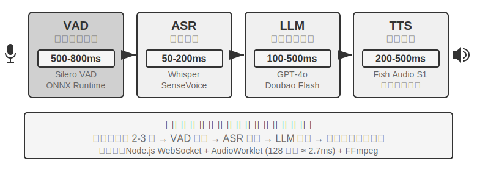


早期的語音助手採用這種四階段序列流水線，原因很簡單：沒有單一模型能同時處理語音識別、語言理解、思考和語音合成四個任務。模組化架構讓每個元件可以獨立開發和最佳化。但模組化的代價是延遲累積——每個階段都要等上一個階段完成才能開始。

**VAD** 是流水線的起點，持續監聽音訊流。最關鍵的設計是結束點偵測（End-of-Speech Detection）：通常設定 500-800ms 的連續靜音閾值——如果使用者停了半秒以上沒說話，VAD 就認為使用者說完了。這引入了第一層延遲，而且很難兩全：閾值設得太短，使用者只是思考時停頓一下就被誤判為說完，句子被截斷；設得太長，使用者說完後要乾等大半秒才有反應。

**ASR** 把音訊波形轉成文字。Whisper、SenseVoice 等模型轉錄 5 秒音訊，在 GPU 上部署中小規格模型時通常需要 50-200ms；更大規格的模型或資源受限的部署環境則會達到 200-500ms（實驗 9-3 中的對照組即屬後者）。更關鍵的問題在於：在整個 VAD 等待與 ASR 轉錄過程中，後面的 LLM 完全閒著，沒收到任何資訊，無法提前開始思考。

**LLM** 推理（inference）階段，即使最佳化得當，根據上下文長度不同，首 token 延遲（TTFT，即模型吐出第一個字的等待時間）往往需要 100-500ms，而輸出完第一句話又額外需要 100ms 左右。如果啟用 reasoning（思考），時間可能延長到 5-10 秒。在傳統架構中，TTS 必須等 LLM 輸出完整回覆文字才能開始工作。

**TTS** 把回覆文字轉成語音，合成通常需要 200-500ms。把每一環的延遲加起來（圖 9-2）：VAD（500-800ms）+ ASR（50-200ms）+ LLM（100-500ms）+ TTS（200-500ms），總計約 0.9-2 秒——這還是所有服務都閒置、沒人排隊的理想情況。


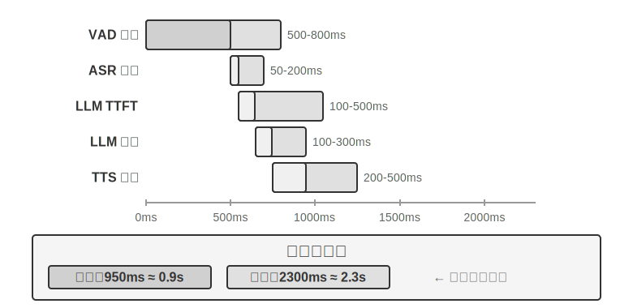


一旦投入生產，排隊延遲會讓情況雪上加霜。這和餐廳排隊的道理一樣：廚房越忙，等餐時間越長，而且不是線性增長而是急劇飆升（圖 9-3）。當伺服器沒有任何等待佇列時（即「空載」），處理一個請求的時間稱為空載延遲。但當多個請求同時到達時，後到的請求必須排隊等待。

直覺上，利用率越高，等待時間會非線性地飆升。具體的數學關係可由排隊論給出（此處僅作直覺理解，不需要嚴格推導）：總延遲 ≈ 空載延遲 × 1/(1-利用率)。利用率是指伺服器忙碌時間的比例，比如利用率 50% 意味著伺服器一半時間在處理請求、一半時間閒置。利用率 50% 時延遲變成空載的 2 倍，利用率 80% 時變成 5 倍——這就是為什麼伺服器不能長期在高負載下執行。


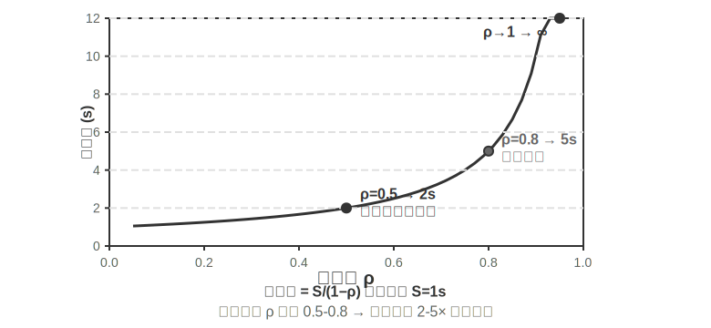


> **實驗 9-1 ★：建構傳統語音 Agent**
>
> 本實驗建構完整的即時語音對話系統，支援使用者透過麥克風與 AI 語音互動。系統採用前後端分離架構，透過 WebSocket 即時通訊。
>
> 核心流程遵循嚴格的序列模式：前端捕獲麥克風輸入，透過 WebSocket 即時傳送到後端。後端執行 Silero VAD 模型進行語音活動偵測，相比傳統的音量偵測方法準確率更高、抗噪能力更強，偵測到約 500ms 連續靜音後將音訊片段提取出來處理。
>
> ASR、LLM、TTS 各階段均支援多家提供商靈活切換，開發者可根據延遲、準確率和地區網路條件選擇最優組合。
>
> **實驗 9-2 ★：使用 PineClaw Voice API 建構電話 Agent**
>
> 實驗 9-1 建構了瀏覽器內的語音對話系統，但真實世界中許多 Agent 任務需要撥打真實電話——聯絡客服協商帳單、預約餐廳、確認訂單。第四章透過 PineClaw 的 Channel 機制展示了事件驅動架構如何將電話通知的響應延遲從分鐘級降到秒級；本實驗則聚焦於語音通話本身的建構。以 [PineClaw Voice API](https://pineclaw.com/)（作者團隊所開發）為例，這類生產級電話語音 API 通常封裝了撥號、IVR 導航（即「查詢請按 1，轉人工請按 0」這類電話選單）、對話和轉錄的全流程：Agent 提供電話號碼、目標和上下文資訊後，由語音 Agent 完成整段通話，返回結構化的通話記錄。
>
> **實驗目標**：建構一個能透過真實電話完成任務的 Agent，將 PineClaw Voice 作為工具整合到 ReAct 迴圈中。
>
> **技術方案**：使用 PineClaw Voice Python SDK（`pine-voice`），為 Agent 配備 `make_phone_call` 工具。Agent 接收使用者的任務描述（如 「幫我預約明天下午 3 點的牙科檢查」），透過 ReAct 思考決定：(1) 需要撥打哪個電話號碼；(2) 通話的目標和關鍵資訊；(3) 通話結束後如何向使用者彙報結果。
>
> Agent 的工作流程：使用者說 「幫我打電話給診所預約明天的檢查」 → Agent 思考需要哪些資訊（診所電話、預約時間、患者姓名）→ 如資訊不足則向使用者澄清 → 呼叫 `make_phone_call` 工具 → PineClaw 撥打電話、與對方對話、完成預約 → Agent 收到通話摘要和轉錄 → 向使用者彙報結果。
>
> **驗收標準**：成功撥打測試電話（可先撥打自己的手機驗證連通性）。Agent 能根據任務描述自主決定通話引數，通話結束後正確提取關鍵資訊（預約時間、確認號等）並向使用者彙報。對比直接使用 API 與透過 Agent ReAct 迴圈呼叫的差異——後者能處理資訊不完整的情況（如使用者未提供電話號碼時先搜尋）。
>
> 這個實驗展示了語音 Agent 的一個重要應用方向：**Agent 不僅能與使用者語音對話，還能代替使用者與外部世界進行電話互動**。PineClaw 的語音 Agent 經過專門訓練，能應付小時級的等待、電話選單導航和複雜協商——想象一下讓 AI 替你打營運商客服電話等候轉人工，這些正是傳統序列語音管線難以勝任的場景。

### 級聯流水線的全鏈路流式化

需要澄清一個常見誤解：上面 0.9-2 秒的延遲賬，算的是「每一環都跑完再交棒」的**完全序列**情形。但 2025 年的生產系統早已不這麼做了。主流做法不是拋棄模組化，而是保留 VAD-ASR-LLM-TTS 的分工，同時讓每一級都變成**流式**，讓相鄰環節在時間上重疊起來：

- **ASR 邊聽邊轉**：採用流式識別，使用者還在說，文字就在持續產出，不必等 VAD 判定整句結束再開始轉錄；
- **LLM 按句切分輸出**：模型一邊生成，一邊按標點或語義把回覆切成小句，第一句剛成形就往下游送，而不是等整段回覆寫完；
- **TTS 句級流式合成**：拿到第一小句就開始合成播放，後面的句子邊生成邊補上，使用者聽到第一個音節的時間大大提前。

這樣一來，ASR、LLM、TTS 三級不再是接力棒式的先後關係，而是像流水線上三個同時開工的工位。LiveKit Agents、Pipecat 這類開源框架，以及主流商用外呼系統，走的都是這條路線。全鏈路流式化之後，端到端延遲通常能壓到 600-800ms，明顯好於完全序列的 0.9-2 秒。

但流式化能壓縮的只是「轉錄、思考、合成」這三段可以重疊的計算，有一段延遲它壓不掉：**VAD 的靜默等待與輪次判斷本身**。系統仍然要靠 500-800ms 的靜音閾值來猜測「使用者到底說完沒有」，這段等待是流水線開工的前提，無法靠重疊來消除。要連這段延遲也一併壓縮，就不能再在「讓各級重疊」上著力，而須轉向最前端的感知環節本身。

### 流式語音感知：替代 VAD + ASR

這一感知前端由兩級構成——VAD 判斷使用者是否說完、ASR 將音訊轉寫為文字——二者共同決定了整條流水線何時啟動、又接收到怎樣的輸入。傳統的 VAD + ASR 級聯存在三個根本問題：

1. **延遲累積**：VAD 必須等 500-800ms 靜音才能確認使用者說完，因為它無法預知未來，只能靠「等一等」來區分「真的說完了」和「只是停頓想一想」
2. **資訊丟失**：VAD 只輸出「有聲/無聲”這樣的二值訊號，情緒變化、語氣起伏、猶豫停頓、背景環境等聲學細節全部丟失。誤判問題在複雜環境中尤為突出——使用者停頓稍長就被誤判為說完導致句子截斷，背景噪音誤觸發導致沒人說話時系統開始處理，使用者附和的一聲“嗯”也無法判斷到底是想打斷還是在表示認可
3. **準確率下降**：VAD 把連續音訊切成一段段獨立片段，各自送入 ASR 識別，破壞了上下文的連續性。需要前後文才能正確識別的內容（郵箱地址、品牌名、人名、專有名詞）錯誤率明顯上升——比如使用者報郵箱」john dot smith at gmail dot com「，如果」john「和」smith「被切到不同片段，」smith「可能因為缺少上下文被誤識別為」miss”

**流式語音感知模型**提供了根本性的解決方案。先澄清「流式」的技術含義：一個語音模型能否流式處理，關鍵在於**編碼器是否因果或分塊**（只依賴已經到達的音訊，而不需要看到整段錄音）以及**解碼是否增量**（每收到一小段音訊就輸出一部分結果）。Whisper 不能流式，並不是因為它的解碼方式——它的解碼本身就是自迴歸的——而是因為它的編碼器需要一個完整的音訊段（固定 30 秒、不足則填充）才能開始工作。還要說明的是，流式識別本身並不是新技術：以 RNN-T 和流式 Conformer 為代表的傳統流式 ASR 早已在工業界大規模部署——手機的即時字幕、輸入法的語音輸入用的都是這類模型——它們與 LLM 並無關係。

本節關注的是一條新路線：**基於 LLM 的流式聽覺感知**——以開源 LLM 為骨幹做後訓練，讓模型直接從連續音訊流中輸出語義級的響應，把「識別」和「理解」合併進同一個模型。它是對傳統流式 ASR 的升級，而非流式技術的發明：增量識別的延遲同樣保持在單步推理時間（幾十到一二百毫秒）的量級，但模型看到的不再是被 VAD 切碎的孤立片段，而是從對話開始到當前時刻的連續音訊流，可以基於完整上下文做上下文學習（In-Context Learning），對使用者的個人資訊、專業名詞、發音習慣的識別準確率顯著提升。

這條路線的另一個關鍵優勢是繼承了 LLM 的世界知識和常識推理能力——畢竟骨幹模型見過海量文字。比如模型知道「蘋果」後面跟「釋出會」大機率指 Apple 而非水果，這種知識增強使得對金額、地名、品牌名等高價值資訊的識別準確率遠超傳統 ASR。這條路線已有可落地的模型，如 Fixie 的 Ultravox——把音訊直接送入 LLM 骨幹、輸出文字與語義 token；本節實驗所用的 Qwen2-Audio、阿里的 Qwen2.5-Omni 也屬於同一類音訊原生模型。

不過，替代 VAD 不一定非得動用一個完整的音訊大模型。如果只想解決第一個問題——**判斷使用者到底說完沒有**，還有一條更輕的路子：把這個「輪次判斷」直接塞進識別器本身[^ch9-11]。做法是在一個很小的開源流式識別模型上加個 LoRA，讓它一邊轉寫、一邊**綜合語義和靜音**判斷「這句話是不是已經表達完一個完整的意思」——因為輪內停頓（報電話號碼時頓一下）常常比輪間間隔還長，光靠靜音閾值必然兩頭不討好。更有意思的結論是：模型總在「該不該收話」上搖擺，根源往往不在模型結構，而在**訓練標籤是用「上帝視角」標的**——標註時用到了決策點之後才出現的音訊，而線上的模型根本看不到未來；把每條標籤都改成「只用決策當下能拿到的資訊」來標，這種虛假的搖擺就消失了。這也呼應了第七章後訓練的一條判斷：很多時候，資料比架構更關鍵。這條更輕的路線也已有生產級實現：Deepgram 的 Flux、AssemblyAI 的 Universal-Streaming 把端點與輪次判斷直接嵌入流式識別模型、專為語音 Agent 設計；開源側則有 LiveKit、Pipecat 提供的語義輪次偵測模型。

[^ch9-11]: 把輪次判斷做進識別器、以及「標籤的上帝視角」這一診斷見 Li, Bojie and Noah Shi. *The Trade-off Was in the Labels: Causal Supervision for Turn-Aware Streaming ASR.* 2026（待發表）。

模型輸出的不僅是文字，還包括一系列**聲學事件的特殊標記**——它們是模型訓練時引入的專用 token，模型學會了在偵測到對應聲學事件時自動輸出。常見的幾類如下：

- `<speak_start/end>`：基於語義和聲學的綜合判斷來確定說話起止，而非簡單的靜音檢測
- `<interrupt>`：區分使用者是真的想打斷，還是只是在附和或受到背景噪音干擾
- `<emotion:happy/frustrated>`：情感標記
- `<laugh>` / `<sigh>`：笑聲、嘆氣等副語言訊號
- `<music>` / `<noise>`：環境聲

這些標記和文字 token 形成統一的事件流，一起送入思考層。

```
Input audio: "Um, actually I think... no wait, let me reconsider."
Model output stream:
  <speak_start> Um, <emotion:hesitant> actually I think...
  <silence:500ms> no wait, <emotion:confident> let me reconsider <speak_end>
```

注意模型輸出的不只是文字轉錄，還包括語音事件標記（開始/結束說話、情緒變化、沉默間隔）。Agent 框架可以利用這些標記實現更自然的互動——比如偵測到使用者猶豫時主動提供選項。

> **實驗 9-3 ★：使用 Qwen2-Audio 模擬流式語音感知**
>
> 需要先說明實驗設計：Qwen2-Audio 本身是整段輸入的非流式模型。本實驗採用**分塊輸入模擬流式處理**——把連續音訊流切成固定長度的小塊，每塊連同此前累積的音訊上下文一起送入模型，模型逐步生成文字和聲學事件 token（如笑聲、停頓等非語言訊號），並測量每個分塊從送入到產出文字的延遲。這裡有個關鍵代價：Qwen2-Audio 的編碼器不是增量式的，每處理一個新塊都要把此前累積的全部音訊從頭重新編碼一遍，因此對話越長、累積音訊越多，單塊的編碼延遲就越高——這正是「模擬流式」與「真流式」（採用增量或因果編碼器，只對新到達的一小段音訊做增量編碼）之間的本質差別。這一設計能演示「保留完整上下文的連續感知」帶來的準確率收益，但延遲數字只反映分塊粒度與推理速度，並不等於真正按流式設計的模型（如採用分塊編碼的 Qwen3-Omni）的首包延遲；感興趣的讀者可以換用後者重做本實驗。對比方案是傳統的 VAD + Whisper ASR 流水線。測試三類場景：正常對話、帶停頓的長句、含背景噪音的對話。
>
> 結果：分塊模擬方案的增量識別延遲可以控制在一二百毫秒的量級（具體取決於分塊長度與硬體），而傳統方案需要等 VAD 確認說完（600ms）再加上 Whisper 推理（本實驗配置下約 200-500ms），合計 800-1100ms。在帶停頓的場景中，VAD 在第一次長停頓處就誤判為說完，把句子截成了兩段分別識別，「大概兩點左右」因為缺少上下文被誤識別為「大概零點左右」；而分塊方案保持完整上下文，正確識別了整句。在背景噪音場景中，Qwen2-Audio 輸出 `<|noise|>` token 標記噪音存在但不中斷識別，傳統 VAD 則被噪音誤觸發，導致識別流程提前啟動。

## 正規化二 · 端到端全模態模型（Omni）

回顧整個級聯流水線：即便感知前端已替換為流式語音感知，它終究仍將「聽、想、說」三者分派給三個獨立的模型，彼此之間以一條離散的介面相連。這條介面再寬，也不過是若干語義 token 與零星的聲學標記——說話人當下的情緒、語氣、語調，以及背景中的環境聲與音樂，絕大部分在交接時損失殆盡；何況三段各自訓練、各自最佳化，彼此難以協同。端到端全模態模型（Omni）則另闢蹊徑——以單一模型直接「聽」音訊、「想」回覆、「說」出來，將三段合而為一（圖 9-4）。只要訓練資料充分，模型內部的隱空間（Latent Space）便能在文字之外將這些副語言資訊直接傳遞至生成端：延遲更低，韻律與情感也得以保留。取捨在於：**級聯流水線**模組清晰、每段可獨立調優、可解釋性好；**端到端模型**延遲更低、能保留非文字資訊，代價是訓練資料需求更大、可解釋性更差。

還需補充一個常被忽略的維度：端到端的優勢主要體現在**延遲**上，在**準確率**維度上並不必然佔優。一個值得對照的方案是**自級聯**（self-cascade）——由同一模型先將音訊轉錄為結構化文字，再基於該文字進行推理；與其拋棄式端到端作答相比，何者準確率更高取決於具體任務。其規律可概括為：當答案主要由語義內容（即「說了什麼」）決定、中間文字足以充分承載任務相關資訊時，自級聯的準確率與端到端相當乃至更優，這一優勢在感知能力較弱的模型上尤為顯著；反之，當答案高度依賴文字難以表徵的非語言線索（語調、情緒、環境聲）時，端到端方顯現出明顯優勢。二者的優劣**可依據任務性質事先判定**，而非簡單歸因於「端到端更為先進」。由此可進一步匯出一條設計原則：決定效能的關鍵往往不在於是否引入中間表示這一**瓶頸**，而在於該瓶頸所承載的資訊——若將中間文字由單純的轉錄提升為附帶副語言標記（情緒、語速、環境聲）的結構化表示，端到端原有的準確率優勢往往隨之收窄，這與前文〈流式語音感知〉所主張的「感知層不應僅輸出純文字」一脈相承[^ch9-13]。

但 Omni 無論多強，本質上也只是把三個模型合成了一個，**並未取消「輪流說話」這一假設**：它依然依賴 VAD 來劃分發言權——一旦偵測到使用者出聲便停下，使用者一靜音便隨即開口。於是那個熟悉的問題再度浮現：使用者報出一串數字、中途略作停頓，Omni 便判定對方已說完而強行插話。前文的流式語音感知能將輪次判斷從靜音時長升級到語義層面，大幅緩解這類誤判，但那終究只是在「輪次」框架內的區域性修補，並未取消輪流本身。要**從根本上**跳出這一困境，就不能再於「輪次」框架內修補，而須讓模型邊聽邊說、自主決定何時開口，不再存在「該誰說話」的硬性切換。

[^ch9-13]: 級聯與端到端在準確率上的優劣何時逆轉，以及如何依據任務性質（中間表示能否充分承載任務相關資訊）預測其方向，完整的跨模態測量見 Li, Bojie and Noah Shi. *The Cascade Gap: When and Why Self-Cascades Help Multimodal Agents.* 2026（待發表）。


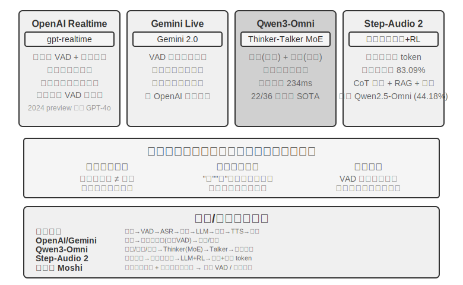


**OpenAI Realtime API** 在模型層面接近端到端（模型原生處理音訊），但在互動控制層面仍依賴傳統 VAD，屬於向完全端到端過渡的中間方案。它最初（2024 年 preview）跑在 GPT-4o 上，2025 年正式 GA 後改用獨立的語音專用模型 **gpt-realtime**（不再是 GPT-4o 的一個模式，而是為即時語音單獨最佳化的模型）。API 預設啟用服務端 VAD，自動判斷使用者何時開始與結束說話。支援對話中打斷——偵測到使用者開口時立即停止當前語音生成，就像兩個人面對面聊天時一方插話、另一方會自然停下來。gpt-realtime 還引入了非同步函式呼叫：模型可以一邊等工具返回結果，一邊繼續和使用者說話，把工具延遲藏在對話過程中。這些都改善了體驗，但本質仍在 VAD 框架下做最佳化。**Gemini Live API** 思路類似，支援 VAD 敏感度配置，打斷時保留已傳送的資訊以確保對話連貫。

**Qwen3-Omni** 採用 Thinker-Talker 架構：將思考（理解與推理）與表達（語音生成）分成兩個專門模組，統一了對文字、影象、音訊與影片的感知與生成。

為了在保持高能力的同時控制計算開銷，Qwen3-Omni 採用 MoE（Mixture of Experts，混合專家）架構——可以理解為「按需呼叫專家團隊」：內部包含多個小型專家網路，每次推理只啟用與當前任務最相關的少數幾個，其餘不參與計算。例如處理語音時主要啟用語音相關專家，處理影象時主要啟用視覺相關專家。這樣模型既能擁有很大的總引數量（保證能力上限），又能把單個 token 的實際計算量控制得很小，從而提升推理吞吐、降低高負載下的排隊延遲。

需要分清的是，MoE 解決的是「單位算力能服務多少請求」的吞吐問題，它並不直接決定「能不能儘早吐出第一個音訊包」——首包延遲取決於生成端的架構。Qwen3-Omni 的低首包來自 Talker 模組的設計：它以多碼本自迴歸的方式逐步生成音訊 token，配合因果（causal）codec 把這些 token 增量地解碼成波形，因此思考模組一產出文字，Talker 就能接著流式合成語音，無需等整段回覆生成完畢。據官方報告，其冷啟動理論首包延遲低至約 234ms，支援 19 種語言理解和 10 種語言生成，在 36 項音影片基準中 22 項領先。

**Step-Audio 2** 走了一條不同的路線：直接處理原始音訊輸入，輸出文字和音訊，實現真正的端到端語音對話。它不僅能理解說了什麼（語義資訊），還能感知怎麼說的——副語言資訊（Paralinguistic Information），比如說話人的情緒是高興還是憤怒、語速是急促還是遲疑、語調是上揚還是低沉——以及背景裡的環境聲和音樂。它透過思考與強化學習生成富有表現力的回覆，還整合了 RAG 機制和外部工具（網路搜尋、音訊搜尋）。據 Step-Audio 2 論文報告，在其提出的 StepEval-Audio-Paralinguistic 副語言理解基準上，Step-Audio 2 的準確率達 83.09%，領先同期開源全模態模型 Qwen2.5-Omni（44.18%），也高於 GPT-4o Audio（43.45%）和 Kimi-Audio（49.64%）。

Step-Audio R1 是 Step-Audio 系列的後續工作，在 Step-Audio 2 端到端語音對話架構的基礎上，進一步把思考能力直接內化到音訊模型中，兩者代表了同一技術路線的遞進演化。
## 正規化三 · 全雙工互動模型（Full-Duplex / Interactive）

正規化二把三個模型合成了一個，卻仍守著「輪流說話」的假設——要麼使用者說、要麼模型說，切換點靠 VAD 或語義來猜。可有些場景，本就容納不下「你一句我一句」的輪流。**同聲傳譯**便是一例：譯員並不等說話者說完整句才開口，而是邊聽邊在腦中組織，一個意群的意思大致完整便隨即譯出，聆聽與翻譯始終重疊進行。**合著音樂擊打鼓點**的節奏遊戲則更為極端——聽覺須持續追蹤不間斷的音樂流，雙手要踩準節拍即時敲擊，同時還需預判下一拍，此處甚至無所謂「一輪」，輸入是一條永不停歇的連續流。這類任務對 turn-by-turn 模式構成根本性挑戰：它們要求聆聽、思考、動作同時進行，而輪次模式的前提恰恰是將三者分置於先後不同的時間片段。全雙工模型正是把「擺脫 VAD」這條路走到邏輯終點——索性取消「輪流」這一假設，讓模型**同時持續地聽和說**。

研究上的先聲是 Kyutai 的 **Moshi**（2024）。它並行建模兩條音訊流（使用者的聲音和模型自己的聲音），再輔以一條「內心獨白」文字流來提升生成語音的語言質量。由於任一時刻都在收聽，重疊說話、隨時打斷都成了天然行為，不需要任何顯式的打斷偵測邏輯，端到端延遲約 200ms，接近人類對話的自然節奏。

2026 年，Mira Murati 創立的 **Thinking Machines Lab** 預覽了他們稱為**互動模型（Interaction Model）**的新範疇[^ch9-14]，並把全雙工背後的主張挑明：互動性不該以 VAD 之類的外掛 harness 環繞在模型之外，而應內建於模型自身——用其原話說，「要讓互動性隨智慧一同擴充套件，互動性就必須成為模型本身的一部分」。落到架構上便是**微輪次（micro-turn）**：模型不等一整輪說完，而是以約 200ms 為一段，持續地「讀入 200ms、生成 200ms」，讓音訊、影片、文字幾路流互相影響推進。這一粒度是刻意的折中——足夠細，使靜音、重疊、打斷都作為連續流保留在模型的上下文裡，不再有人為的輪次邊界需要遷就；又足夠粗，能把多路模態成塊地並行處理，把延遲壓在即時可感的範圍內。正因互動被納入模型內部，「邊聽邊說」「邊看邊插話」這些過去要靠專門 harness 才能拼出的行為，如今都成了模型的分內之事，並會隨模型一同變強：首個模型 TML-Interaction-Small 把三路流從零一同訓練，一旦察覺使用者正寫下一段含 bug 的程式碼、或有人步入畫面，都能主動開口。

它對「慢思考」的接法也頗具代表性。互動模型自身只負責讓對話保持線上，一旦遇到需要深度推理或工具呼叫的問題，便委派給後臺一個更強的推理模型——交出去的不是一句孤立的查詢，而是**整段對話的上下文**。後臺模型一邊推理，結果一邊流式回傳，互動模型再挑一個不打斷使用者的時機將其自然織入對話，其間它照常接話、答追問、守住話頭。如此便以「非思考模型的延遲」，兌現了「推理模型的規劃、工具與智慧體能力」。據官方報告，TML-Interaction-Small（276B 引數 MoE、啟用 12B）的輪次切換延遲低至約 0.40 秒（GPT-realtime-2.0 約 1.18 秒），在考察視覺主動性的基準上大幅領先於近乎零分的競品；截至寫作時仍處於研究預覽階段。

[^ch9-14]: Thinking Machines Lab, “Interaction Models: A Scalable Approach to Human-AI Collaboration,” 2026-05. https://thinkingmachines.ai/blog/interaction-models/

同年，OpenAI 的 **GPT-Live** 則把全雙工帶到了生產規模，作為 ChatGPT 語音的新預設模型向全球鋪開。它不再把對話看作一串分立的訊息輪次，而是**持續處理輸入的同時持續生成輸出**，因此每秒能做許多次互動決策：該開口說、繼續聽、停頓、打斷，還是去呼叫一個工具。表現出來就是：使用者思考時它會安靜等待而不是搶話，會用「嗯」「對」這樣的附和表示自己在聽，也能勝任即時翻譯這類必須邊聽邊說的任務。

GPT-Live 也走了同一條快慢分工的路——**把「即時互動」與「深度思考」解耦**：碰到需要搜尋、推理或更復雜的智慧體操作時，負責互動的 GPT-Live 把任務委派給後臺的前沿模型（釋出時是 GPT-5.5），自己繼續維持對話的流動，等後臺出結果再把它帶回對話裡。GPT-Live-1 與 mini 版本在後臺用 GPT-5.5 Instant，Medium、High 檔位則呼叫帶思考的 GPT-5.5，讓使用者按需在「快」與「深」之間取捨。這條「快慢分工」正是下一節「思考架構的取捨」要展開的主題。

回顧本章的「替代 VAD」敘事鏈：VAD 靠靜音閾值猜測發言權的切換，流式感知（見前文正規化一「流式語音感知」一節）把切換判斷升級到語義層，而全雙工模型徹底消解了「切換」本身——它一直在聽，「打斷」不再是需要專門處理的事件，barge-in 處理鏈也因此在架構上被省去了大部分環節。這是「替代 VAD」這條敘事線截至寫作時的終點。

## 思考架構的取捨：從分離到統一

真正要解決的是**即時響應與深度思考之間的矛盾**：使用者期待毫秒級的回應，而複雜問題需要秒級的思考時間，如何在保持低延遲的同時讓模型想得足夠深？這個矛盾並不專屬於端到端架構，級聯流水線同樣繞不開。

下面的三種方案並非線性的技術迭代——它們是針對不同約束條件的設計取捨，在實踐中並存，選擇哪種取決於應用場景對延遲和思考深度的要求。需要先點明三者的分野：方案一、方案二本質上是「兩個獨立模型並行」的快慢分工，並不依賴端到端，甚至可以套在級聯流水線之上；只有方案三才把思考真正內化進端到端模型。

到 2026 年，「快慢解耦」這條路已經成了前沿語音產品的主流選擇，並有了專門的名字。Thinking Machines Lab 把它稱作「互動模型（Interaction Models）」——一個即時互動模型耦合一個非同步的後臺推理模型；xAI 的 Grok Voice “Think Fast「、Pine AI 的語音 Agent、以及上一節 GPT-Live 的」委派「，走的都是同一條」快在前臺維持對話、慢在後臺深度推理「的路線。選擇解耦而非」訓練一個全能模型「，背後有一個務實的理由：前沿推理模型每隔幾個月就迭代一次，而即時互動能力需要專門的資料和訓練目標，把兩者塞進同一個模型，等於讓它去追一個不斷移動的靶子，還可能稀釋掉最推理能力[^ch9-8]。反過來，只要把最強的推理模型原封不動放在後臺、只訓練一個輕量的互動模型在前臺，就能始終用上當下最強的」大腦「——這正是 GPT-Live 強調」可持續換用最新前沿模型「的原因。下面按」協調機制由弱到強「的順序看三種方案。

### 方案一：快思考應付，慢思考回答

快慢思考並行執行（圖 9-5）：快思考在 500ms 內給出簡短的應付性回答（類似於人先說一句「讓我想想」），慢思考在後臺花 5-10 秒進行深度思考後給出完整回答。慢思考使用的技術叫「推理時計算擴充套件」（test-time scaling）——通俗地說，就是讓模型在回答問題時「多想一會兒」：不是一步給出答案，而是像人類解數學題一樣，先列出思路、逐步推導、檢查結果，用更多的計算步驟換取更高質量的回答。


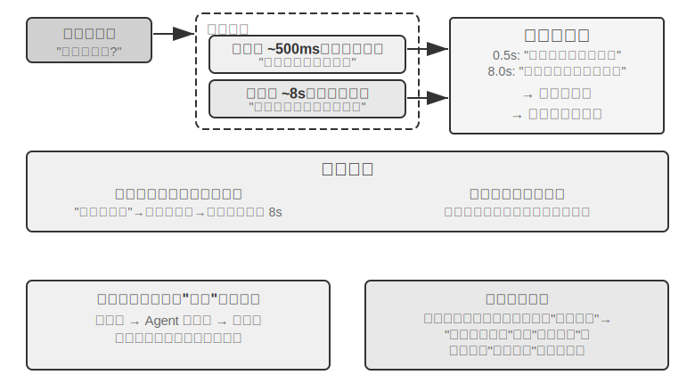


**問題一：簡單問題過度思考**。使用者問「今天星期幾」，快思考已在 500ms 內正確回答「星期三」，慢思考仍然跑完整 10 秒思考後又重複一遍「星期三」。這不僅浪費計算資源，更嚴重的是破壞對話節奏——使用者已經得到答案准備聊下一個話題了，卻被一個重複回答打斷。**問題二：快慢不一致**。兩者獨立並行，雖然看到的上下文相同，但思考路徑可能完全不同——快思考基於某個假設給出初步答案，慢思考卻發現這個假設不成立，得出了相反的結論。使用者在幾秒之內先後聽到自相矛盾的回答，信任感瞬間崩塌。根本原因在於：方案一把對話拆成兩個獨立的思考過程，而非一個連貫的認知活動，快慢之間缺乏協調機制。

```
<user>這個套餐適合我嗎?</user>
<!-- 快思考 0.5 秒後 -->
<assistant（快思考）>這個套餐價格很優惠，我建議您購買。</assistant>
<user>好的，那我...</user>
<!-- 慢思考 8 秒後完成 -->
<assistant（慢思考）>等一下，我發現這個套餐缺少您需要的國際漫遊功能，可能不太適合。</assistant>
<user>（憤怒） 你到底是建議我買還是不買?!</user>
```

### 方案二：快思考互動，慢思考提醒

方案二讓慢思考能看到快思考的輸出，透過 Agent 狀態列（第二章介紹的動態元資訊注入機制）向快思考提供建議，而不是直接對使用者說話。相比方案一改進了兩點：慢思考在後臺非同步執行，利用說話間隙持續思考；由於能看到快思考的輸出，不會直接衝突，而是退到幕後當「軍師」。前面提到的 GPT-Live 委派、Pine AI 語音 Agent 都是方案二在生產中的例項——後臺的推理模型把結論透過一條精簡的文字通道回傳給前臺的互動模型，由前臺決定何時、以何種措辭說給使用者聽。

但這個方案仍有本質侷限。**快思考可能不聽指揮**——兩個獨立的思考例項之間的溝通是間接且模糊的。快思考收到 Agent 狀態列 後可能理解偏了，比如把「價格需要重新確認」理解成「問使用者能否接受這個價格」而非「價格算錯了要重新計算」。**無法獲知中間思考結果**——慢思考 10 秒思考中已經產生了大量有價值的中間結論，快思考完全看不到，只能乾等最終 Agent 狀態列。如果使用者在慢思考完成前再次提問或打斷，快思考只能靠自己有限的理解回答。這就像兩個人合作解題卻只能透過遞紙條交流，看不到對方的草稿紙。

方案二還面臨一個根本性的理論問題：**無法實現「邊想邊說」**。人類面對複雜問題時，不是先在腦子裡想好完整答案再一口氣說出來，而是想一段說一段——「這個問題很有意思……（停頓思考）首先我們需要考慮……（繼續思考）其次……」。方案二中的快思考只能說些填充詞幹等慢思考出結果，無法將思考過程自然地穿插在對話中。

### 方案三：端到端思考與表達統一（以 Step-Audio R1 為例）

方案二雖然解決了慢思考的等待問題，但在架構上依然是「先想再說」——思考和表達仍是兩個分離的過程，不可能實現像人一樣邊想邊說。要突破這個根本限制，需要將思考能力直接內化到模型中。

Step-Audio R1 正是沿著這個方向提出了一個根本不同的方案：將思考能力直接內化到端音訊語言模型中，透過雙腦架構實現真正的「邊想邊說」。它其實由兩個互補的機制組成，分別解決兩個不同的問題：**模態錨定思考蒸餾（MGRD）**先解決「想得對不對」——讓模型真正基於聲學特徵而非文字轉錄來思考；**MPS 雙腦架構**再解決「說得及不及時」——讓思考與表達並行，實現低延遲的邊想邊說。前者是後者的前提：只有思考本身紮根於聲音，邊想邊說才真正有價值。下面依次展開。

**文字代理思考問題**。理想情況下，語音模型應該直接分析聲音特徵（如音高、節奏、語調）來理解說話人的情緒或意圖。但實際上很多模型走了捷徑：現有音訊語言模型存在一種反直覺現象，思考鏈越長，效能反而越差。Step-Audio R1 團隊發現根因是「文字代理思考」（Textual Surrogate Reasoning，即用文字資訊「代替」聲學資訊來分析）：模型在「思考」時，實際上是基於文字轉錄在做語義層面的思考，而不是真正在分析聲學特徵。舉個例子：讓模型判斷一首歌的情緒，它分析的是「歌詞裡提到了悲傷」，而不是「小調旋律加上下行音高輪廓傳遞出憂傷感」。這種模態錯位源於訓練資料：大多數音訊模型的 CoT（Chain-of-Thought，思維鏈）資料由文字模型生成，自然繼承了純文字的思考模式。

**模態錨定思考蒸餾**（MGRD, Modality-Grounded Reasoning Distillation）透過迭代自我改進來解決這一問題（圖 9-6）。名字雖然拗口，核心思路其實很直觀：篩選出「真正在聽聲音」的思考過程，用它們來訓練模型，讓模型學會像音樂老師一樣用耳朵分析，而不是像文字編輯一樣只看歌詞。具體分三步：

1. 讓當前模型對同一段音訊生成多條不同的思考過程，然後篩選出真正基於聲學特徵的那些。怎麼篩選？看思考內容裡有沒有提到具體的聲音引數。例如，對於一段憤怒的語音輸入，基於文字的思考是「使用者說了『太差了』這種負面詞彙，所以判斷是憤怒」——這只是在分析文字內容；而基於聲學特徵的思考是「語速比正常快了 40%、音量明顯升高、聲調變尖」——這才是在真正「聽」聲音。MGRD 篩選後者
2. 用這些高質量的思考資料重新訓練模型，強化其「用耳朵思考」的能力
3. 透過強化學習進一步最佳化，防止模型偷懶跳過思考直接猜答案

經過多輪迭代，思考的根基從文字抽象逐步遷移到聲學分析——模型開始關注「音高輪廓在 1.2 秒處急劇下降」而非籠統地說「說話者似乎不開心」。

**MPS 雙腦架構**（Mind-Paced Speaking，直譯為「追蹤思維節奏說話」）解決的是思考與語音輸出之間的延遲矛盾（圖 9-6）。它的靈感來自人腦的分工：人腦中負責思考的區域和負責組織語言的區域是分開的，可以並行工作——你在想下一句話的同時，嘴巴還在說上一句。MPS 用兩個模型模擬這種分工：**構思腦**（Formulation Brain）負責持續思考，產出一段段的思考結果；**表達腦**（Articulation Brain）每收到一段新的思考結果，就結合之前的思考和已有回覆，把它轉化為語音回覆。

兩者並行執行——構思腦不必想完全部內容，表達腦就已經開始說話了。例如，在 t=0ms 時構思腦開始分析使用者問題，在 t=200ms 時輸出第一段思考結果（文字 token 序列）；表達腦在 t=200ms 收到這段結果後，結合已生成的回覆上下文，在 t=350ms 開始輸出對應的語音 token——兩個模組以流水線方式並行運作，使用者在 t=350ms 就能聽到第一個音節。


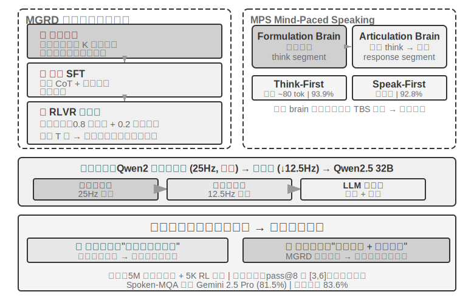


> **實驗 9-4 ★★★：使用 Step-Audio R1 實現端到端語音思考**
>
> 本實驗使用 Step-Audio R1 模型，對比不同配置在語音思考與對話任務上的表現。Step-Audio R1 由音訊編碼器、音訊介面卡和 Qwen2.5 32B 解碼器組成，需要多卡 GPU 部署。
>
> 本實驗在兩個任務上評估：**Spoken-MQA**（語音數學題）考察模型在聽到口述題目後能否進行多步數學推理；**URO-Bench**（中文口語對話基準）考察開放對話質量。
>
> 測試配置分為兩個維度。第一是**思考時機**：完整的 **TBS**（Think-Before-Speak，先想完再說，作為無延遲約束的對照基線）會先生成全部思考再開口；為了降低延遲，MPS 提供兩種「邊想邊說」的變體——**Speak-First**（也稱 spkfirst，零延遲，開口和思考同時啟動）與 **Think-First**（也稱 thkfirst，等思考腦產出第一段後才開口，延遲約 80 token）。第二是**架構**：MPS 雙腦並行 vs. 傳統單模型 TBS。
>
> 結果如表 9-1 所示，用於對比不同思考時機和架構配置在數學準確率與對話評分上的表現。
>
> 表 9-1 Step-Audio R1 不同語音思考配置對比
>
> | 配置 | Spoken-MQA | URO-Bench |
> |------|-----------|-----------|
> | 不思考直接回答（基線） | 70.6% | 77.4 |
> | MPS Speak-First（零延遲） | 92.8% | 82.5 |
> | MPS Think-First（~80 tok 延遲） | 93.9% | 84.8 |
> | 完整 TBS（無延遲約束） | 93.0% | — |
>
> 一個有趣的發現是：Speak-First 對思考任務影響極小（92.8% 接近完整 TBS 的 93.0%）。原因在於 **CoT**（Chain-of-Thought，思維鏈）的開頭通常只是在複述問題內容，還沒進入真正的推理，因此即便讓模型一開口就同時啟動思考，最終準確率也幾乎不受損失。另一個值得注意的細節是：Think-First（93.9%）甚至略高於無延遲約束的完整 TBS（93.0%）——一種可能的解釋是分段產出思考、逐段轉化為表達，起到了類似分步監督的正向作用；當然，兩者差距也在評測誤差範圍之內，不宜過度解讀。
>

方案三把思考「內化」進單一模型，最優雅地實現了「邊想邊說」，但代價正是本節開頭說的「移動靶子」：這一個模型既要當最強的推理者、又要當即時的說話者，而兩種能力都在快速演進，統一路線就得反覆重訓才跟得上。這也解釋了寫作時的產業分野——追求「可隨時換用最新大腦」的前沿產品（GPT-Live、Grok Voice、Pine AI）大多押注方案二的解耦路線，方案三則更適合追求極致自然度、且願意承擔專門訓練成本的場景。兩者不是誰取代誰，而是「可換的大腦」與「更緊的邊想邊說」之間的取捨。

### 快慢之間的介面：文字之外還能傳什麼

（提示：這是一段跨場景的介面討論，暫時離開語音主線。）回頭看方案二會發現一個被忽略的設計維度：慢思考給快思考「遞話」，用的是**文字**通道（透過狀態列傳一句建議）。文字好懂、好除錯，卻是慢思考腦子裡那點東西的一根細吸管——真正豐富的中間狀態，被壓成了幾句話。那麼，這條快慢之間的介面，能不用文字？

在即時遊戲這種對節拍最苛刻的場景裡，這條路是走得通的（可稱之為潛空間橋，Latent Bridge）[^ch9-8]：讓一個負責快速反應的小模型（每秒出十幾個動作）和一個負責推理的慢模型（每秒出一次思考）都**凍結不動**，只訓練它們之間一個幾千萬引數的小「橋」，把慢模型的隱層結論直接投影成幾個「潛 token」，像多模態模型塞視覺 token 那樣拼進快模型的輸入裡——繞開了「想法→文字→再理解」的往返。結果在多個 Atari 遊戲上，這條潛空間通道比傳統文字通道又高出一截（部分遊戲 +26% 到 +82%），而每步只多花約 5 毫秒，仍然跟得上即時的節拍。

它也給出一條誠實的邊界：**快慢協作到底有沒有用，取決於任務的瓶頸在「想不想得到」還是「來不來得及反應」**——當慢思考本來就比快反應強時，這座橋才幫得上忙（這條相關性跨遊戲高達 r≈0.9）；反過來，如果任務純拼反應速度，再好的橋也無濟於事。這個判斷不止對遊戲成立，它也預告了本章後面 Computer Use 會遇到的同一個問題：什麼時候值得請一個「慢軍師」，什麼時候那只是徒增延遲。

[^ch9-8]: 只訓練一座凍結雙模型之間的潛空間橋、以及「何時值得請慢軍師」的完整分析見 Li, Bojie and Noah Shi. *The Latent Bridge: A Continuous Slow-Fast Channel for Real-Time Game Agents.* arXiv:2606.24470, 2026.

無論端到端還是模組化，感知層和執行層各自的質量仍然至關重要。端到端模型解決了架構層面的延遲問題，但「聽得準」和「說得像」這兩個基本功並不會因為架構的變化而自動解決——「聽得準」對應的流式語音感知已在正規化一中討論過，這裡再看「說得像」的執行層：更像人的語音合成。

## 更像人的語音合成

傳統 TTS 的「完美」恰是問題所在：過於流暢、零停頓、沒有填充詞的語音讓人一聽就知道是機器。人類說話時的那些「不完美」並非缺陷——停頓、填充詞（「嗯」、「呃」、「那個」）、偶爾的重複——其實是思考過程的自然外化，向聽者傳遞「我正在想」「我不太確定」等重要訊號。但 AI 的思考速度遠快於語音播放，輸出天然流暢完整，直接合成出來就會暴露機器身份。

**解決方案**：把「在哪裡該停頓、該用什麼語氣」的決策權交給主 LLM。LLM 輸出的不僅是文字，還包括控制標記：`[THINKING]` 表示插入 1-2 秒的思考停頓和填充音（「嗯……」）；`[SEARCHING]` 生成較短停頓和搜尋性填充詞（「那個……”」怎麼說呢「）；`[EMO:happy]` 等調整語氣韻律；`[SPEED:0.8x]` 控制語速。只有 LLM 才知道當前是在回答複雜問題需要停頓一下、還是使用者已經不耐煩了應該加快語速、又或者是輕鬆閒聊該活潑些。

TTS 在這個方案中扮演多模態生成器的角色，輸入文字 + 控制標記，輸出音訊。遇到普通文字就正常合成語音，遇到控制標記就生成對應的非語言音訊：`[THINKING]` 生成「嗯……」拖長音，`[SIGH]` 生成嘆氣聲，`[LAUGH:small]` 生成輕笑，`[BREATH]` 生成吸氣聲。

實現路徑有兩條：一是自研 TTS 原生支援控制標記（彈性最高，但需要專業團隊）；二是利用 voice cloning（聲音複製），為同一個虛擬人準備數十條不同情緒、語速、風格的參考語音，根據控制標記選擇最匹配的參考語音去呼叫 TTS API（如 ElevenLabs、Fish Audio），幾周內就能完成部署。

> **實驗 9-5 ★★：基於 Fish Audio 的控制標記驅動 TTS**
>
> 使用 Fish Audio S1 的聲音複製能力（只需 3-10 秒參考語音就能零樣本複製出同一音色）。建構 24 條參考語音庫，覆蓋情緒（中性/高興/沮喪/思考）x 語速（正常/快/慢）x 風格（正式/輕鬆），每條約 5 秒。
>
> LLM 輸出示例：`[EMO:happy][SPEED:fast]太好了！您的訂單已確認。[THINKING]嗯，讓我查一下發貨時間...[EMO:neutral][SPEED:normal]預計明天下午送達。`
>
> 執行層解析標記並對映到對應的參考語音：`[EMO:happy][SPEED:fast]` 對應「高興+快速+輕鬆」參考音，`[THINKING]` 對應「思考+慢速+正式」參考音（帶停頓節奏和猶豫語氣），`[EMO:neutral][SPEED:normal]` 對應「中性+正常+正式」參考音。Fish Audio 會保證不同參考語音之間音色一致，只是韻律和情感有所變化。
>
> 對比三種配置：無控制標記（流暢但機械，一聽就是 AI）、單一參考語音（自然但情感單調）、多參考語音庫（確認資訊時歡快快速，解釋說明前有自然停頓，整體接近真人客服的表達方式）。

## Computer Use：GUI 自動化 Agent

讀到這裡也許會注意到，本章給語音的篇幅明顯多於後兩個場景——這是有意為之。在即時多模態這條演進線上，語音是走得最完整、最值得當作參考系的一個：從「序列流水線延遲太高」這個問題出發，經過端到端、全雙工、邊想邊說等一系列方案，一直走到今天相對成型的終局，問題→方案→終局的全程都已經跑通。因此我們把它講透，接下來的 Computer Use 和機器人兩個場景，都可以對照語音這條脈絡來看——它們各自走到了這條演進線的哪一段、卡在了哪裡。

這三個場景看似不同，卻面臨相同的核心挑戰：即時感知、低延遲決策、持續互動。接下來看這些技術主題如何在視覺互動（Computer Use）和物理互動（機器人）中重現——首先把視角從聽覺模態擴充套件到視覺模態：如果 Agent 不僅能理解語音，還能「看懂」螢幕並操作圖形介面呢？

Computer Use（也稱 GUI 自動化 Agent）讓 AI 像人類一樣透過觀察螢幕、操作滑鼠鍵盤來使用軟體——比如開啟瀏覽器搜尋資訊、在表格軟體中填寫資料、或在系統設定中調整配置。其核心是**感知～思考～行動**的迴圈（圖 9-7）：

1. Agent 對當前螢幕截圖
2. 多模態模型接收截圖和任務指令，輸出一段思考和一個具體動作
3. 執行層在真實環境中執行該動作（移動滑鼠、點選、輸入文字等）
4. 等待介面響應後再次截圖，進入下一輪迴圈


這個迴圈中有三個關鍵設計維度：**動作空間**（Agent 能執行哪些操作）、**視覺定位**（如何在截圖中找到目標元素）、以及**模型架構**（如何從截圖生成正確動作）。

### 動作空間設計

Anthropic 定義三類工具構成完整的互動能力（圖 9-8）：


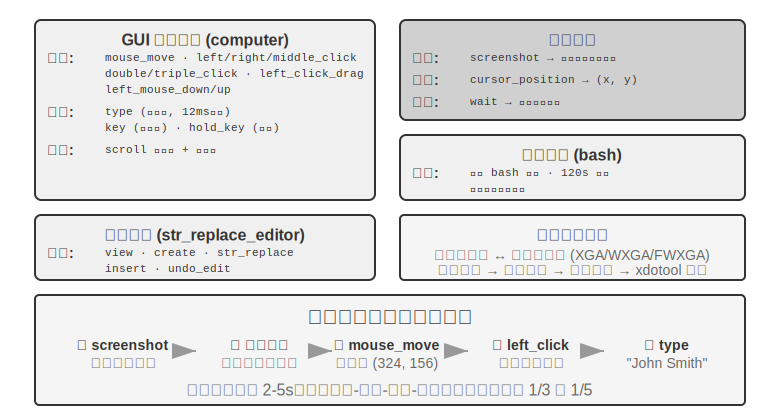


**GUI 操作工具**（computer tool）：滑鼠操作包括移動（mouse_move）、左/右/中鍵點選、雙擊/三擊、拖拽（left_click_drag），以及更精細的按下/鬆開（left_mouse_down/up）。滾動（scroll）支援四個方向並可配合修飾鍵。鍵盤操作包括逐字輸入（type，每個字元間隔 12ms 模擬真實打字）、組合鍵（key，如 Ctrl+C）、長按（hold_key）。感知動作：截圖（screenshot）、獲取游標位置（cursor_position）、等待（wait）。

**命令執行工具**（bash tool）：提供長久的 bash 終端機會話，120 秒超時，透過哨兵字串偵測命令是否執行完畢，多次呼叫之間保持環境狀態（比如 cd 到某個目錄後下次呼叫還在那個目錄）。

**檔案編輯工具**（str_replace_editor）：透過字串匹配實現安全編輯，支援檢視、建立、替換、插入和撤銷操作，比直接覆蓋整個檔案更精確，不容易誤改其他內容。

> **實驗 9-6 ★：執行 Anthropic Computer Use Demo**
>
> 容器打包了一個完整的 Ubuntu 桌面環境（含瀏覽器、終端機等常用工具）。前端接收任務指令，後端將指令與截圖傳送給 Claude，模型返回操作指令（移動滑鼠、點選、輸入文字等），執行層在虛擬桌面中執行。
>
> 關鍵觀察：每個動作間隔 2-5 秒（顯著慢於人類），但對常見任務展現良好規劃能力，能自主拆解為合理操作序列。
>

### 視覺定位（Grounding）

在迴圈的每一輪中，模型需要在截圖中準確定位目標元素——「搜尋框在哪裡？」「提交按鈕的座標是什麼？」這就是視覺定位（Grounding）問題。當前主要有**兩大思路**：一是把定位變成**選擇題**——先把介面元素標註好編號，模型只需從中選一個；二是**純座標預測**——讓模型像人一樣直接「看」著截圖報出座標。其中選擇題思路又有兩種實現方式：**純視覺標註**（原始的 Set-of-Mark，用分割模型在畫素上切出候選區域）和**結構化元素索引**（DOM/Accessibility Tree，直接讀取介面自帶的結構）。選擇題思路的共同優勢，是把開放式的「在截圖中找到按鈕並預測座標」轉化為封閉式的「從已標註好的元素中選一個」——就像考試中選擇題比填空題更容易答對一樣，模型只需說「點選 [123]」而不是「點選螢幕左上角偏右大約 200 畫素處的藍色按鈕」。

**Set-of-Mark：視覺標註法。**

原始的 Set-of-Mark（SoM）由微軟研究院於 2023 年提出，最初是為了釋放 GPT-4V 的視覺定位能力。它是**純視覺**方法：用影象分割模型（SAM、SEEM 等）在截圖上自動切出候選區域，為每個區域疊加編號標記，模型看到的是一張帶編號的圖，只需報出編號，由系統換算成對應區域的中心座標。整個過程不需要 DOM，也不需要任何介面內部結構，因此原生桌面軟體、遊戲介面同樣適用——只要分割模型能把候選區域切出來。

**結構化元素索引：SoM 思想在 Web 上的結構化實現。**

當介面本身能提供結構化資訊時，標註可以做得更精確。現代網頁在渲染之前就已經定義了完整的元素結構（DOM 樹）和語義角色（哪個是按鈕、哪個是輸入框），無障礙介面（Accessibility Tree）為許多桌面應用提供了類似的資訊。與其讓分割模型在畫素裡猜「哪個區域是按鈕」，不如直接問介面本身「你有哪些可以點選的元素？」。以 browser-use 專案為代表的 Web Agent 方案正是這樣做的：從 DOM 中列舉可互動元素並編號，可以看作 SoM 思想在 Web 上的結構化實現（圖 9-9）。流程分四步：

1. 透過瀏覽器除錯介面（CDP，Chrome DevTools Protocol）獲取網頁的結構化表示（DOM 樹）和無障礙資訊
2. 自動偵測哪些元素可以互動（按鈕、輸入框、連結等）
3. 為每個可互動元素標註唯一 ID 並在截圖上繪製邊界框
4. 同時生成文字列表描述每個 ID 對應的元素

```
Screenshot: [圖片中關鍵元素標註了 [1]、[2]、[3]、[4] 等 ID]

Elements:
[1] <input type="text" placeholder="Search" aria-label="Search" />
[2] <button id="submit-btn" aria-label="Submit form" />
[3] <input type="text" placeholder="Enter your name" value="" />
[4] <a href="/docs" aria-label="Documentation" />
```

模型只需要輸出一個 ID 號就行，系統自動用該元素的中心座標執行點選。這類方案不省 token（因為要把所有標註資訊都發給模型），但定位準確穩定，還免去了分割模型可能引入的漏檢和誤檢。


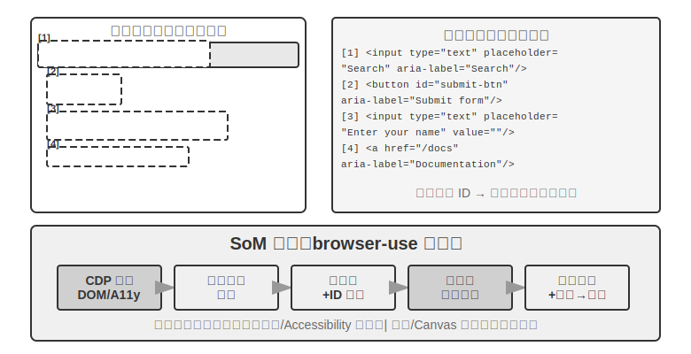

**純座標預測。**

第三條路線不做任何標註，直接讓模型輸出座標。以 **SeeClick** 和 Claude 的 computer use 為代表：在海量 GUI 截圖和元素位置的配對資料上訓練視覺模型，讓它學會將自然語言描述（如「點選提交按鈕」）直接對映到截圖中的精確座標——就像人類使用者一樣，純粹靠「看」來找到要點選的位置。

在座標預測方案中，模型對座標的理解高度依賴訓練時使用的解析度（圖 9-10）。Claude 訓練使用 XGA（1024x768）、WXGA（1280x800）、FWXGA（1366x768），如果輸入的截圖解析度不匹配，模型預測的座標就會系統性地偏移——就像在小地圖上量距離然後直接用到大地圖上一樣。因此，需要在工具層實現雙向座標縮放機制，而且要**按寬高比選目標解析度**，避免非等比拉伸把畫面壓變形、連帶把座標判斷也帶偏。例如，真實螢幕解析度為 2560×1440（16:9），就該在 Claude 支援的三檔裡挑一個寬高比同樣接近 16:9 的目標——FWXGA（1366×768）最匹配。截圖時把螢幕等比縮放到 1366×768 送入模型；模型輸出點選座標 (683, 384) 後，反向對映為真實座標 (683×2560/1366, 384×1440/768) ≈ (1280, 720)。反過來，若硬把 16:9 拉伸進 4:3 的 1024×768，畫面會被橫向壓扁，模型預測的座標就會系統性偏移。


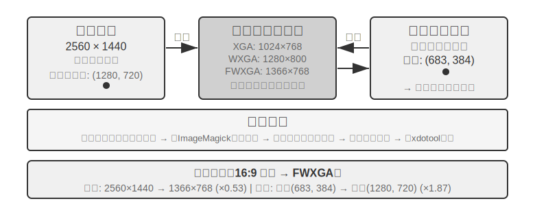


三條路線的選擇邏輯可以概括為：**結構化資訊可得時，優先用 DOM/Accessibility Tree 索引**，定位最精確穩定；**不可得時**（原生桌面軟體如 Photoshop、Canvas/WebGL 渲染的介面、遊戲），**既可以用視覺標註（原始 SoM 路線），也可以用座標預測**。視覺標註把定位變成選擇題，對未經專門訓練的通用模型更友好；座標預測省去標註步驟，對做過 GUI 定位訓練的模型更直接。兩者在小元素和密集介面上的精度都仍有差距。

> **實驗 9-7 ★：使用 browser-use 實現自動瀏覽器操作**
>
> 基於 Playwright 瀏覽器自動化框架（一個用程式碼控制瀏覽器的工具庫），結合多模態大模型實現自然語言驅動的瀏覽器操作。啟用 SoM 視覺化模式，每次決策前儲存帶標註框的截圖。
>
> 測試任務「開啟 Google 查詢舊金山天氣」：系統啟動後截圖顯示 Google 搜尋頁面，所有可互動元素被標註上紅色邊界框和 ID 號（位址列 `[1]`、搜尋框 `[2]`、搜尋按鈕 `[3]`、「手氣不錯」按鈕 `[4]` 等）→ 模型分析後點選 `[2]`（搜尋框）→ 搜尋框獲得焦點後輸入「San Francisco weather today”→ 點選 `[3]`（搜尋按鈕）→ 頁面跳轉到搜尋結果，新截圖示註天氣卡片內元素，模型識別並提取溫度、天氣狀況等資訊。全程 5 步操作，約 20 秒完成。

### 能看動畫、能聽聲音的 Computer Use Agent

到目前為止，Computer Use 的感知都建立在一個隱含假設上：**螢幕是靜止的**——截一張圖、想一步、點一下，再截下一張圖。可現實裡的螢幕會放影片、會彈出轉瞬即逝的通知、會播放會議裡的人聲。一個每 3–5 秒才睜一次眼、而且完全沒有耳朵的 Agent，對這些「兩幀之間發生的事」既看不見也聽不到。看錄屏、跟會議、聽語音提示、應付一閃而過的對話方塊——這一整類日常電腦操作，對今天的 Computer Use Agent 幾乎是禁區。

這裡真正該被重新設計的，不是「動作介面」，而是「**觀察介面**”[^ch9-9]。核心思想是把**觀察**（連續、適應性、多模態）從**動作**（離散）裡解耦出來，做成一層插在環境和任意現成 Computer Use 模型之間、無需重訓的感知中介軟體（可稱之為 Agent–電腦觀察介面，AOI）。它有三個」按需開閘「的部件：其一，**幀間關鍵幀捕獲**——先用一個極廉價的畫素門跳過幾乎沒變的畫面，再用一個小模型判斷畫面是否發生了有意義的變化，只在變化時才截一幀，靜止畫面下幾乎零成本；其二，**音量門控的語音轉寫**——有聲音時才呼叫語音識別，讓 Agent 第一次」長出耳朵「；其三，也是最關鍵的，**把畫面敘述成長久的文字**——讓模型把捕獲到的幀描述成一句話（」剛彈出的提示說釋出日期改到了 4 月 28 號「），並且**即使原圖之後被清理出上下文，這句文字仍留在記憶裡**，把動態資訊以文字形式帶著往下走。

一個反直覺的發現是：真正起作用的不是「選哪幾幀」，而是「**把幀敘述成能長期留存的文字**”——文字才是 LLM Agent 最擅長處理的模態。在從 7B 到前沿規模的八個模型上，這層中介軟體無需任何重訓就帶來 +17 到 +48 個百分點的提升，其中語音類任務的差距最懸殊：加了這層感知，Agent 能把原本」聽得見卻動不了「的語音任務都做出來。但它也不是一套包打天下的固定配置——在某些更新的模型上，塞太多影象 token 反而會擠佔推理、拖累表現，所以這些部件要**按模型逐個挑選**，而非一股腦全開。這與前面 Set-of-Mark 和座標預測的取捨是同一個道理：感知方案沒有銀彈，要順著模型的脾氣來配。

[^ch9-9]: 門控關鍵幀、按需轉寫、把幀敘述成持久文字這三個部件，完整機制與逐模型消融見 Li, Bojie and Noah Shi. *Agent-Computer Observation Interfaces Enable Dynamic Computer Use.* arXiv:2606.29472, 2026.

### 移動端：生態壁壘比技術更難

Computer Use 也在向移動端擴充套件。移動端與桌面在技術上確有差異：動作空間通常不再是「滑鼠座標 + 鍵盤」，而是接入系統的無障礙服務 API（如 Android 的 AccessibilityService）來讀取介面元素、下發點選與文字輸入；互動方式也從滑鼠指標變成觸控手勢，座標的語義隨之改變——同一個 (x, y) 到底是手指的單擊、長按，還是滑動手勢的起點，需要額外的手勢型別來界定。第六章介紹的 AndroidWorld 等移動端基準，正是在這樣的動作空間上評測 Agent 完成真實 App 任務的能力。

但真正卡住移動端的，往往不是這些技術差異，而是生態壁壘。曾有手機廠商嘗試在消費級手機中整合 AI 助手，讓它自動操作微信、淘寶、支付寶等日常應用，但很快遭遇平臺限制。

這揭示了 Computer Use 面臨的一個獨特挑戰：**生態壁壘**。封殺背後的根本原因是商業模式衝突。傳統網際網路應用的核心變現邏輯是**流量與注意力**：使用者刷資訊流時看到廣告，搜尋商品時追蹤推薦演算法的引導，瀏覽頁面時產生衝動消費。而當 Agent 代替使用者操作時，這條變現鏈路被徹底繞過：AI 不會關注廣告，也不會衝動消費，直奔目標完成任務就走。對於靠廣告和流量變現的平臺來說，Agent 的每一次操作都在侵蝕其商業模式的根基。

這意味著 Computer Use 面對的不僅是 CAPTCHA（驗證碼）等技術層面的對抗，更是**結構性的利益衝突**。這一矛盾在短期內難以調和，也讓 Computer Use 在消費級場景中的落地面臨比純技術問題更棘手的挑戰。

### 即時性：尚未解決的核心挑戰

**OSWorld**（第六章詳細介紹了其評估方法）是廣泛使用的 Computer Use 評估基準，在真實 Ubuntu/Windows/macOS 環境中測試 Agent 完成跨應用任務的能力。早期通用模型在該基準上的成功率只有兩成左右，後續專用模型和更強通用模型持續把準確率推高，截至寫作時已逐步接近人類水平。但準確率遠非終點——真正的瓶頸已經從「能不能做對」轉向了「能不能做快」。

**OSWorld-Human** 效率研究揭示了一個扎心的事實：即使任務最終成功，Agent 完成同樣任務需要的操作步驟仍明顯多於人類，而且每一步的推理延遲會隨著任務推進持續增長——上下文越長，模型決策越慢，後期步驟的耗時往往遠超前期。一個人類幾十秒就能完成的文件格式調整，Agent 可能要磨蹭數分鐘才能搞定。**準確率達到人類水平不等於實用——效率才是真正的瓶頸。**

效率問題的根源與語音場景類似：序列的「截圖～思考～點選」迴圈中，即使每個環節都最佳化到極致，一步步累積的延遲仍然難以接受。更深層的問題是：目前的 Computer Use 完全不會「提前想」。如果 Agent 能在執行當前動作的同時預測下一步該做什麼——比如在等頁面載入時就想好接下來要點哪裡——就可以把思考和執行的時間重疊起來，大幅降低總延遲（這正是本章前面語音場景裡「邊想邊說」、以及第四章「持續思考」式非同步 Agent 的同一訴求，只是這裡換成了「邊想邊操作」）。

與語音領域不同的是，Computer Use 自身的即時性——把「截圖～思考～點選」這個迴圈本身變快——目前還沒有系統性的解決方案，它仍停留在逐幀截圖的離散迴圈中。但有一條繞過它的思路已經跑通，用的正是本章反覆出現的快慢解耦：既然讓慢的電腦操作 Agent 變快很難，那就**別讓使用者去幹等它**。把「說話」和「操作電腦」拆成快慢兩套模型並行執行[^ch9-10]——一個小模型（快）負責即時語音對話，一個前沿 VLM（慢）在瀏覽器裡一步步操作，兩者之間只靠一份極簡的「純文字契約」溝通：慢 Agent 每次操作都附帶一句滾動更新的狀態摘要（「正在填表單，還需要你的出生日期」），快 Agent 據此即時回答使用者、並把使用者口頭給出的新資訊轉達給慢 Agent，而且**在狀態摘要確認完成之前，快 Agent 絕不許說「辦好了」**。這正是「一邊打電話說話、一邊讓電腦自己操作」的場景。實驗裡，這套解耦讓語音回應比「單模型邊操作邊說話」快了約 15 倍（中位延遲 0.58 秒 vs 8.64 秒），而任務成功率不降；一旦抽掉那條快慢之間的文字通道，成功率立刻塌到 0——因為使用者口頭給的關鍵資訊再也傳不到瀏覽器裡了。這和前面 Latent Bridge、以及語音場景裡「邊想邊說」是同一套思路：當一個環節天生慢，就讓另一個快的環節把使用者的等待填滿——只不過那份「純文字契約」，本質上就是本書從第二章講到現在的 Agent 狀態列。Computer Use 迴圈本身的提速或許仍是下一個重要的研究方向，但「用快慢解耦把『慢』藏起來」已經是可用的答案。

[^ch9-10]: 語音～操作快慢解耦與「純文字契約」的完整設計見 Li, Bojie and Noah Shi. *Talking While Acting: Real-Time Voice for Slow Computer-Use Agents.* 2026（待發表）。

## 機器人操作：從即時控制到訓練與泛化

> **閱讀提示**：本節討論機器人控制。實驗 9-10 展示從模擬到真實的遷移方法——其中的**模擬訓練部分（第 3-4 步）可以在純 GPU 伺服器上完成**，無需硬體；但要端到端復現整條流水線（含真實部署那幾步），則需要 SO100 機械臂等真實硬體。如果你對機器人領域暫時不感興趣，可以跳過本節，不影響其他章節的閱讀。

語音 Agent 在聽覺模態中面對延遲，Computer Use 在視覺模態中面對延遲，而當 Agent 需要控制物理世界的機器人時，延遲和多模態的挑戰被進一步放大——動作的後果是不可逆的，一次碰撞就可能損壞物體或機器人本身。本節先看機器人如何用雙層架構和動作分塊把即時控制問題壓下去，再順勢轉到它當下更硬的骨頭——訓練與泛化：資料怎麼來、模型怎樣跨任務跨平臺遷移。

### 硬體不是瓶頸，演算法才是

機器人在通用開放場景中還沒有得到廣泛應用，瓶頸到底在硬體還是演算法？XLeRobot 專案給出了一個有力的反證：成本不到 1000 美元的雙臂輪式機器人，在人類透過 VR 頭顯遠端操控（遙操作）時，已經能流暢完成大量家庭任務。更復雜的、需要靈巧手的家庭任務，宇樹的機器人在人類遙操作下也能流暢完成。遙操作延遲大約 100-200ms，已接近物理互動的響應要求。感測器解析度、執行器精度、控制頻率（機器人每秒更新動作指令的次數，頻率越低運動越不流暢、越容易出現抖動或偏離目標軌跡）在當前的低成本平臺上已經足以支撐實用任務。

需要給這個論斷劃清邊界：遙操作反證真正能說明的，是「現有低成本硬體加上人類的智慧，足以完成**這類以視覺回饋為主的家庭操作任務**」。它並不意味著硬體在所有維度都過關——觸覺感測的缺失、靈巧手的可靠性與成本，至今仍是公認的硬體短板；一旦任務重度依賴精細的力控與觸覺回饋，硬體就未必不是瓶頸。因此下面說的「硬體不是瓶頸」，都限定在本節討論的這類任務範圍內。

就這類任務而言，真正的鴻溝在演算法層，下面兩個小節分別展開。

> **實驗 9-8 ★：XLeRobot 遙操作體驗**
>
> XLeRobot 支援鍵盤、Xbox 手柄、Switch Joycon 和 VR 頭顯等多種遙操作方式。透過親手操控機器人完成取物、放置、擦拭等任務，觀察響應延遲、運動精度和任務完成質量，建立對硬體能力邊界的直觀認知——親身體驗後就會發現，人操控時機器人什麼都能幹，說明當前瓶頸確實是演算法而非硬體。[^ch9-1]
>
> [^ch9-1]: XLeRobot, “Teleop 文件「 . https://xlerobot.readthedocs.io/en/latest/software/getting_started/XLeRobot_teleop.html

### 雙層架構：規劃與控制的分離

機器人完成複雜家庭任務需要在兩個不同的時間尺度上做決策。第一層是較慢的**長程規劃**（long-horizon planning）：把「把廚房打掃乾淨」這樣的高層指令拆解為子目標序列（清理檯面、裝載洗碗機、擦拭表面），需要理解環境語義、推理任務依賴、規劃多步行動方案——就像人在動手之前先想想「先幹什麼後幹什麼」。第二層是較快的 **VLA 控制**（Vision-Language-Action，視覺～語言～動作模型）：執行每個具體操作（「走到水槽前」「拿起抹布」「擦拭檯面」），根據當前看到的畫面和語言指令持續輸出控制訊號，讓機器人的動作流暢連貫。

這種雙層架構將複雜度有效分離：長程規劃負責「做什麼」，VLA 控制負責「怎麼做」。這種「高層慢決策 + 底層快執行」的雙層架構，與前文語音場景中的「快慢思考」在結構上高度相似——都是將複雜思考與即時響應解耦到不同模組中。需要提醒的是，這裡的「規劃 / 控制」對應的是快慢思考裡「慢的深度思考 / 快的即時響應」這一維度的解耦，而不是方案三 MPS「構思腦 / 表達腦」那種「思考 / 表達」的解耦——後者拆的是「想」與「說」，前者拆的是「謀劃全域性」與「即時執行」，兩種「雙 X 架構」切分的維度並不相同。

不過即時性並沒有憑空消失，而是被下推到 VLA 控制層，靠**動作分塊**（Action Chunking，見下文「VLA 控制」一節）來攤薄：模型一次推理生成未來一小段動作序列，控制執行緒高頻重播，把單次推理的延遲攤進整段動作的執行時間裡。但這裡有個繞不開的權衡——分塊是拿反應性換平滑性：塊越長，每次推理的延遲被攤得越薄、運動越連貫，可模型在這段時間裡「看不到」新畫面，對突發變化（物體被挪走、有人伸手擋住）也就越遲鈍。即時性與平滑性之間的這道取捨，是雙層架構沒有消除、只是轉移了的部分。

這裡也需要交代本章主線的一個轉向：在機器人場景中，即時性矛盾已經被雙層解耦和動作分塊部分緩解，當前的主要矛盾轉移到了**訓練與泛化**——如何獲得足夠的演示資料、如何讓模型跨任務跨平臺泛化。接下來幾個小節正是圍繞這條新矛盾展開的，這也是第六章模擬環境與第七章強化學習的主題在物理世界的延伸。

而這條新矛盾主要壓在 VLA 控制層上。可以把 VLA 看作 「VLM + 動作輸出」：**VLM**（Vision-Language Model，視覺～語言模型——能同時理解影象與文字的大模型）負責「看懂」和「想清楚」，VLA 在此基礎上還要「動手」，真正的挑戰正在於「動手」這一層。當前 VLA 控制層主要透過模仿學習（行為複製）訓練——直接從大量人類演示中學習「看到什麼就做什麼」（OpenVLA、RT-2、π₀ 等均屬此類）；強化學習則是近年來在其之上的補充手段。用強化學習訓練的 VLA 雖然能在單個任務上表現很好，但往往泛化能力不足：即使如第七章 SimpleVLA-RL 在 LIBERO 上報告了很高的單任務結果，也是針對每個任務分別做 RL 訓練的，而非一個統一模型零樣本泛化到所有任務。這種「一個任務訓練一次」的模式意味著每遇到新任務，還得重新收集資料、重新訓練。

以下兩節分別深入討論長程規劃和 VLA 控制的具體技術方案。

### 長程規劃：從 VLM 到專用具身思考模型

通用 VLM 已經具備不錯的具身思考能力。Google DeepMind 的 **Gemini Robotics-ER 1.5** 專門針對具身思考（Embodied Reasoning，即理解物理世界中物體的位置、運動和因果關係）做了最佳化，在 15 個學術基準（Point-Bench、RefSpatial、RoboSpatial、BLINK 等）上平均 62.8%，超過 GPT-4o（60.6%）和 Gemini 2.5 Pro（59.3%）。核心優勢包括：高階空間理解與物體定位、時序推理（預測「如果推倒這個杯子會怎樣」這類動作因果）、任務編排（把高層指令分解為小步驟），並原生支援思考（thinking）機制和工具呼叫。[^ch9-2]

[^ch9-2]: Google DeepMind, “Gemini Robotics-ER 1.5” . https://deepmind.google/models/gemini-robotics/gemini-robotics-er/

> **實驗 9-9 ★★：使用 Gemini Robotics-ER 1.5 驅動 XLeRobot 自主導航**
>
> 透過 RoboCrew 庫將 Gemini Robotics-ER 1.5 作為長程規劃模型，攝影機影象疊加角度刻度標註。系統只提供三個簡單工具：前進、左轉、右轉。給定任務「找到廚房並走到那裡」後，模型以 0.5-1Hz 的頻率做決策：識別走廊、房門、傢俱等視覺特徵，判斷「廚房可能在左側」就執行左轉，看到「前方有冰箱」就繼續前進。還可以擴充套件為語音控制模式（用喚醒詞觸發新任務）。這個實驗揭示了 VLM 在長程規劃層的能力邊界：空間推理和任務分解已經做得不錯，但在複雜環境中的魯棒性和多步推理的一致性仍有提升空間。[^ch9-3]
>
> [^ch9-3]: XLeRobot, “LLM Agent 控制「 . https://xlerobot.readthedocs.io/en/latest/software/getting_started/LLM_agent.html

### VLA 控制：從演示資料到跨具身泛化

在雙層架構的執行層，RT-2、OpenVLA、π₀ 三個代表性模型都專注於 VLA 控制——即根據攝影機畫面和語言指令即時輸出機器人的動作（圖 9-11）。它們在動作表示上分屬兩條路線：離散動作 token 與連續軌跡生成。


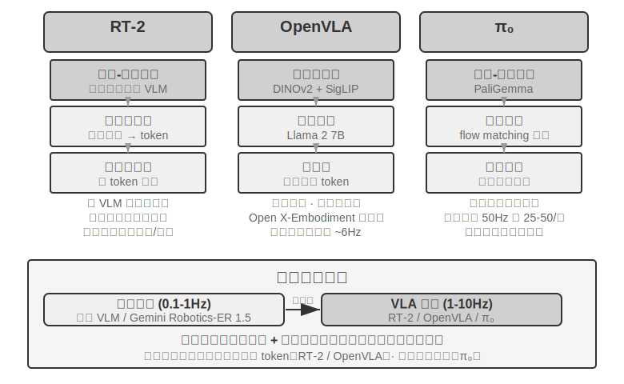


**RT-2 與 OpenVLA：離散動作 token 路線。**

**RT-2** 開創了這條路線：直接在大規模視覺～語言模型上微調，把機器人的連續動作離散化為 token，像生成文字一樣逐個自迴歸輸出，藉助預訓練模型的泛化能力提升對新物體和新指令的零樣本遷移效果。**OpenVLA** 沿襲了 RT-2 的動作表示方案，將語言模型和視覺編碼器統一在一個架構中，輸入影象和文字指令，輸出動作 token。訓練分兩階段：先在大規模跨平臺資料集 Open X-Embodiment（涵蓋 20 多種機器人平臺的真實操作演示）上做預訓練，學習通用的操作知識（「抓取」「放置」等動作模式在不同機器人之間是相通的），再針對特定平臺用少量資料微調。既然動作表示本質相同，兩者的真正差異就在開放性與工程選擇上：RT-2 及其訓練資料是 Google 內部的，OpenVLA 則完全開源——開源骨幹模型（Llama 2 加視覺編碼器）配公開資料集，讓整個社群第一次可以在其基礎上覆現和改進。

**動作分塊：VLA 領域通用的頻率補償技術。**

由於 LLM 推理有延遲，VLA 的控制頻率遠低於傳統機器人控制的要求（傳統機器人控制通常要求 50-1000Hz 的控制頻率，而 VLA 單次推理只有約 1-10Hz——差距可達兩個數量級）。原版 OpenVLA 正是這個問題的典型代表：它每次推理只輸出一個動作（約 6Hz 的單步自迴歸預測），動作卡頓恰恰是它被詬病的主要短板。**動作分塊**（Action Chunking）就是為彌補這個差距而生的通用技術——最早由 ACT（Zhao et al., 2023）提出，後被 π₀、OpenVLA-OFT 等廣泛採用：模型每次推理不是隻輸出一個動作，而是一口氣生成未來一小段時間的動作序列（以 π₀ 的典型配置為例，一次生成約 0.5-1 秒的動作塊，在 50Hz 控制頻率下即 25-50 個動作），控制執行緒按高頻依次執行，同時模型在後臺非同步生成下一批。只要模型的推理時間小於這批動作的執行時間，機器人就能保持連續流暢的運動——就像影片緩衝一樣，提前載入好後面的內容，播放就不會卡頓。

**π₀：連續軌跡生成路線。**

動作表示的真正分野，不在 RT-2 與 OpenVLA 之間，而在**離散 token 與連續軌跡生成**之間。**π₀** 代表後一條路線：不再逐個預測離散動作 token，而是用 flow matching（流匹配，一種與擴散模型同源的連續生成方法）從隨機噪聲出發、經多步迭代「去噪」，直接生成一段平滑連續的動作軌跡。這種表示天然與動作分塊結合，在靈巧操作等對動作精度和流暢度要求高的任務上表現更好。打個比方：離散 token 路線像從選單中逐步選擇「向左 5 度」「向前 3 釐米」，連續軌跡路線像畫家先勾出整條曲線、再逐筆修正成型。

### Sim2Real Transfer：從模擬到現實的鴻溝

第六章的模擬環境一節已經講清 sim-to-real gap（現實差距）的來源，以及領域隨機化（domain randomization）應對它的原理，這裡不再重複——一句話概括：模擬無法完全還原真實的物理、視覺與硬體特性，訓練時便把這些引數大範圍隨機打亂，逼策略學出一套對各種變化都穩的通用表徵（圖 9-12）。下面只看這套原理在真實機械臂上如何落地。


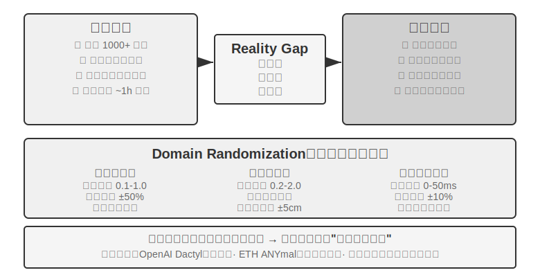


這條路線已有不少成功案例：OpenAI 的機械手靈巧操作（Dactyl 專案實現手內方塊重新導向，其後續工作又藉助自動域隨機化 ADR 實現了單手解魔方）和 ETH Zurich 的 ANYmal（四足機器人在雪地、碎石等複雜野外地形上魯棒行走）都屬此列。

本章真正要補的，是把領域隨機化落到真機時繞不開的兩個工程環節。其一是**隨機化範圍的標定**：範圍不能拍腦袋定，太窄覆蓋不了真實變化，太寬又會增大訓練難度、學出「什麼都能應付但什麼都不精」的次優策略。實踐中通常先從真實環境資料裡**實測標定**關鍵引數的分佈（如摩擦係數、電機響應延遲的真實分佈），在該範圍內取樣；若模擬訓練的策略在真機上明顯掉點，再逐步擴大隨機化範圍，直到 sim-to-real gap 收斂到可接受。其二是**視覺對齊**：精確校準模擬與真實的攝影機位姿（環境對齊），並把真實拍攝的背景隨機替換進模擬渲染（greenscreen 背景替換），讓模擬畫面儘量貼近真機所見——這兩步實驗 9-10 會具體演示。

> **實驗 9-10 ★★★：基於 RGB 的零樣本 Sim2Real 機械臂抓取**
>
> 使用 LeRobot + ManiSkill 模擬器，只用 RGB 攝影機影象（不依賴深度感測器或力感測器）訓練，然後零樣本（不做任何額外調整）直接部署到真實 SO100 機械臂。五步流程：
>
> 1. **環境對齊**：調整模擬和真實環境中的攝影機位置，透過視覺化疊加驗證兩邊的影象能對齊
> 2. **背景替換**（greenscreen）：把真實環境拍的背景圖隨機裁剪後疊加到模擬渲染中，讓模擬畫面的背景更接近真實
> 3. **Domain randomization**：隨機化機器人顏色、物體紋理、光照條件、攝影機視場角等引數
> 4. **RL 訓練**：使用 PPO 演算法在大規模並行模擬環境中訓練，直至模擬中成功率 >90%
> 5. **真實部署**：在真實機器人上零樣本直接成功完成抓取任務
>
> 成功的關鍵要素：精確的環境對齊 + 視覺域隨機化 + 物理引數隨機化，三者缺一不可。侷限性：當真實物體的形狀、大小或材質超出訓練分佈時，成功率會顯著下降。[^ch9-6]
>
> [^ch9-6]: LeRobot, “Sim2Real 教學「 . https://github.com/StoneT2000/lerobot-sim2real/blob/main/docs/zero_shot_rgb_sim2real.md
>
>
> 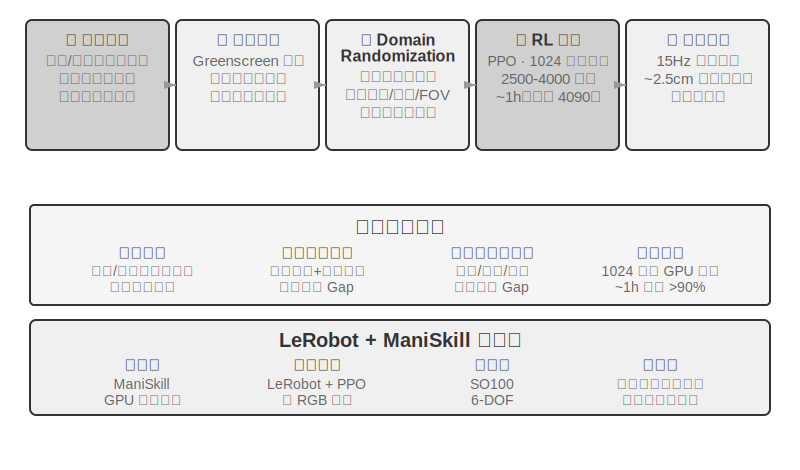
>

## 本章小結

三個場景表面差異懸殊，但延遲和多模態這兩道坎始終如影隨形。語音已走出了一條從序列流水線到端和全雙工、從分離的快慢思考到「邊想邊說」的演進路徑；Computer Use 在 OSWorld 等基準上的準確率已接近人類水平，但操作步驟明顯多於人類、步驟耗時隨任務推進不斷增長的效率差距還沒有系統性的解法；機器人在以視覺回饋為主的操作任務上，瓶頸已從硬體轉到 VLA 控制層的跨任務泛化能力（觸覺、靈巧手等仍是尚未攻克的硬體短板）。下一章會把視角拉到多個 Agent 之間的協作，那是另一個維度的挑戰。

## 思考題

1. ★★ 語音 Agent 的端到端模型將 ASR-LLM-TTS 合併為單一模型，降低了延遲卻失去了模組化。如果端到端模型在某個環節（如語音識別）出錯，除錯和修復比序列管道困難得多。你會如何設計端到端語音 Agent 的可觀測性（observability）系統？
2. ★ Step-Audio R1 透過 MPS 雙腦架構實現「邊想邊說」。但人類在「邊想邊說」時經常會說出未經深思熟慮的話、自我糾正、或使用填充詞。Agent 的「邊想邊說」應該模仿人類的這些特徵嗎？
3. ★★ SoM（Set-of-Mark）及其結構化變體（DOM 元素索引）將 Computer Use 的視覺定位從開放座標預測轉為封閉 ID 選擇，但都需要先偵測和標註介面元素——無論靠分割模型還是靠 DOM。如果介面包含非標準控制元件或動態變化的元素，標註就可能不完整或不準確。這種情況下應該回退到座標預測嗎？
4. ★★ XLeRobot 等千美元級機器人平臺讓遙運算元據收集變得廉價。但遙運算元據的質量高度依賴操作者的技能。一個不熟練的操作者提供的資料會如何影響 VLA 模型的訓練？如何在資料收集階段自動篩選低質量資料？
5. ★★★ 本章覆蓋了語音、Computer Use 和機器人三種互動形態。這三種形態的共同趨勢是從序列管道向端到端模型演進。如果這種趨勢繼續，五年後的 Agent 互動層會是什麼樣的？
6. ★★★ 當前 Computer Use 以「截圖 → 動作 → 截圖」的離散迴圈運作，每次觀察都是一張靜態幀。但人類對螢幕的感知是連續的——我們能看到動畫播放、觀察載入進度、理解影片內容。這意味著今天的 Computer Use 根本無法處理需要時序視覺理解的任務。如何重新設計感知層以支援連續的視覺流理解？
7. ★★ DOM/Accessibility Tree 元素索引在標準 Web 應用上效果顯著，但越來越多的軟體介面（Canvas/WebGL 渲染、跨平臺自繪控制元件）不提供可訪問的結構化資訊，只能依靠視覺標註或座標預測。你認為 Computer Use 應該押注純視覺路線，還是同時維護結構化和視覺兩條路徑？維護兩條路徑的成本和收益分別是什麼？
8. ★★ VLA 模型採用動作分塊（action chunking）——如正文所述，π₀ 的典型配置是一次生成 50Hz 頻率下 25-50 個未來動作——將推理延遲隱藏在執行時間裡。但如果執行過程中環境突變（如物體被移走），預生成的動作序列就會失效。如何在動作分塊的效率優勢和環境變化的響應速度之間取得平衡？
9. ★★★ 本章的三個場景（語音、Computer Use、機器人）都面臨「感知～思考～行動」迴圈的延遲問題，都朝著快慢思考並行化的方向演進。在語音場景中，這表現為「說錯了再糾正」；在 Computer Use 場景中，這表現為「先點再看」；在機器人場景中，這表現為「走一步看一步」。如何保證這些基於快思考的行動不會導致無法挽回的後果？
