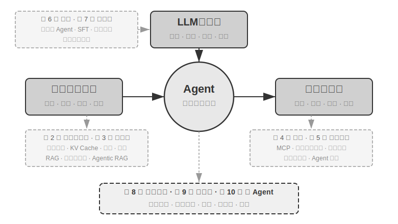
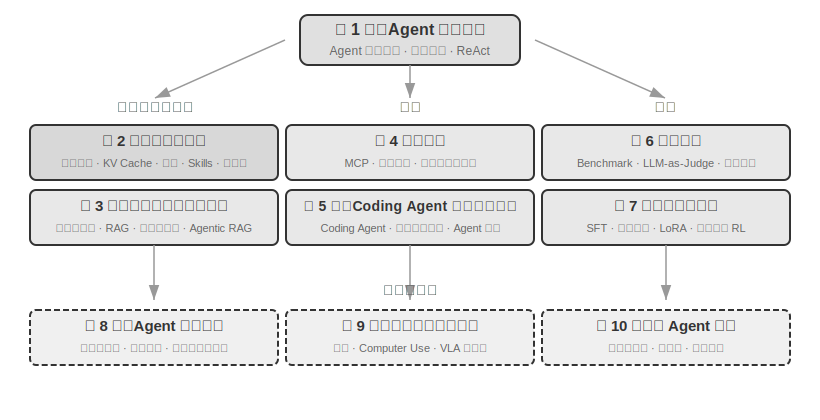

# 引言 {.unnumbered}

2025 年 8 月至 10 月，我在圖靈《AI Agent 實戰營》上進行了一系列技術講座。講座的初衷很簡單：把 AI Agent 的設計從 「感覺驅動」 變成 「原則驅動」：不只是教大家跑通一個 Demo，而是深入理解 Agent 為什麼要這樣設計，每一個架構決策背後的取捨是什麼。這本書正是從那些講座的講稿和實驗中整理、擴充套件而來的。

這本書從最初的想法到最終成書，本身就是用一種可以稱為 **whisper coding**（口述式協作）的方式做出來的——而我用來口述的，正是我們 Pine 自己的語音 Agent。每次準備講稿，我都會先向它口述一個大致的提綱，讓它去做調研（survey），再由它整理出一份初稿；講完課後，我再結合 AI Agent 實戰營裡同學們的回饋，與它反覆討論、打磨，如此迭代，最終把這些講稿擴寫、編排成了今天這本書。整個過程裡，我多數時候並不打字，而是把想法口述給它——語音的頻寬遠高於打字（正常說話的速度約為打字的四倍），「口述—調研—討論—修改」的迴圈因此轉得很快。某種意義上，這本書既是在講 Agent，也是一件由 Agent 參與做成的作品。

從 2025 年初 DeepSeek R1 釋出至今，AI 領域已經從單純的基座模型（即通用的大語言模型底座）演進，進入了工程落地的深水區。模型層的進展可以從兩個方向看到：一方面，模型透過在智慧體環境中的強化學習（Agentic Reinforcement Learning）把工具呼叫能力訓進了模型引數，使模型掌握了在程式設計（coding）、數學、圖形介面操作（computer use）等領域的通用能力。模型的迭代速度也越來越快，GPT-5.2 到 GPT-5.5、Claude Opus 4.5 到 4.8，都僅僅經過了半年。產品層則有 Manus、Claude Code、OpenClaw 等通用 Agent 重新定義了人機互動方式，把 「程式碼生成 + 檔案系統」 這一架構正規化推到了主流視野。

當我回頭審視近一年前在課程中總結的那些 Agent 架構設計原則時，有一個發現讓我既欣慰又驚訝：**這些原則非但沒有過時，反而變得越來越經典了。** 雖然 Agent 業界後來陸續出現了 Skill、harness、loop engineering 等新名詞，但真實的順序恰恰是反的：並不是 Anthropic 這些公司先發明瞭這些概念、眾多 Agent 才跟著用起來；相反，是大量 Agent 早就在這麼做了，Anthropic 才把它們提煉、總結成了架構設計原則。實踐在前，命名在後。

這些原則的底氣，來自把 Agent 真正推進長流程、高風險場景的實戰。作為 Pine AI 的首席科學家，我和團隊打造了 Pine。據我所知，它是第一個能夠自主與真人互動、並可靠地獨立處理涉及金錢的敏感、複雜、長程任務的通用 Agent：它替使用者打電話與營運商協商帳單、與商家交涉退款和投訴、取消訂閱，全程無需人工接管。這類任務動輒幾十輪交涉，任何一步出錯都會造成真金白銀的損失。正是這種對可靠性近乎苛刻的要求，把本書反覆強調的架構原則一條條倒逼了出來。下面幾個例子，就來自這段實踐。

- 早在 Skill 概念流行之前，我們就已經採用動態載入提示詞的方法解決提示詞無限膨脹的問題，採用命令列執行工具的方式解決工具列表無限膨脹的問題，採用系統狀態列技術解決 Agent 不感知執行環境和使用者時間、工作狀態等問題。
- 早在 harness 概念流行之前，我們就在採用類似 Claude Code 的方法解決模型工具呼叫的不穩定、幻覺、危險操作、越權操作、指令不遵循等問題。
- 早在 loop engineering 概念流行之前（這個名詞直到 2026 年年中才由業界提煉命名），我們就在使用本書稱為提議者～稽核者（proposer-reviewer）的方法解決模型過早認為任務完成的問題——既有一條路走不通就宣佈「辦不了」的過早放棄，也有閉環沒走完就宣稱「已辦妥」的假成功。方法的核心是讓 Agent 審閱自己輸出的交付件（artifact）並迭代改進，由驗證而不是模型自己的感覺決定任務何時結束。

而且這並不是我們的獨家發明，據我所知，大多數頭部模型和 Agent 公司都自己摸索出了類似的方法。這是我在 2025 年 8 月在圖靈開設《AI Agent 實戰營》課程和 2024-2026 年持續在國科大開設 AI Agent 實踐課程的原因。我選擇把這本書開源釋出，而不是封閉起來收版稅，也是希望這些知識能傳播給更多從業者。

**實踐在前，命名在後**，這個順序對企業級 Agent 開發有一個很實際的含義：**如果你每次都要等到業界開始流行某個 Agent 名詞才去實踐，就已經慢了一步。** 名詞流行的時候，頭部公司往往早已把對應的問題趟過一遍了。那麼，怎樣才能趕在名詞流行之前就知道該怎麼做？我認為最關鍵的有兩點。

**第一，擁有一個對 Agent 能力上限有極高要求的真實業務，並能持續獲得真實的業務回饋。** 以 Pine 為例，處理一件事往往耗時數小時甚至數週，過程中可能要跟多個利益相關方反覆溝通：其間可能要打好幾個小時的電話，在電腦上操作並填寫好幾頁複雜的表單，還要來回傳送數封郵件；全程既不能在任何數字上出錯，又要在溝通中時刻保持謹慎，維護使用者的利益。只有置身於這樣足夠複雜的場景，實踐才會自然地把你倒逼著去建構 harness，去解決那些模型本身當下還做不到、業務上卻必須完成的事。反過來，如果業務對能力上限的要求不高、模型稍一升級就夠用，你也就沒有動力去打磨這些架構原則。

**第二，必須建立評估（Evaluation）機制。** 這也是本書反覆強調的一點：沒有評估，就沒有進步。評估讓你能分辨一次改動究竟是真的變好了，還是隻是運氣，從而讓 Agent 的迭代方向不再依賴直覺。說到底，我們主張的是用科學的方法去做工程、去做 Agent，而評估正是這套方法的地基。第六章會專門展開這套方法。

不管底層模型如何升級，不管產品形態如何創新，幾乎所有成功的 Agent 系統都遵循著相同的架構模式。這並非巧合：**好的設計原則本就應該穿越模型的迭代週期**，因為它們描述的不是某個模型的用法，而是智慧系統與世界互動的基本模式。

圖靈獎得主、強化學習之父 Richard Sutton 曾說，宇宙演化經歷了從塵埃到恆星、從恆星到生命、從生命到智慧體（原文為設計實體，designed entities）的 4 個階段。生物進化是盲目的：隨機變異，自然選擇。大多數生物並不理解自己的工作原理，也無法自主設計和改造生物。而智慧體（Agent）是宇宙演化史上一種全新的存在：它能透過生成程式碼實現自舉（bootstrap）和自我進化，就像一個程式設計師編寫了另一個程式設計師，然後新的程式設計師又能繼續編寫下一個。也就是說，Agent 能夠理解自身的運作機制，並根據目標創造全新的智慧體，甚至改進自己。本書的使命，就是幫助你理解和掌握這種創造的原則。

本書的核心公式只有一句話：**Agent = LLM + 上下文 + 工具**。三者缺一不可。

更直觀地說，就是**大腦 + 眼睛 + 手腳**。大腦（LLM）負責思考和決策，眼睛（上下文）決定 Agent 能看到什麼資訊，手腳（工具）決定 Agent 能做什麼事情。（嚴格來說，「眼睛」只是粗略的類比：上下文不僅包含環境資訊和對話歷史，還包含工具定義等內容，也就是說 Agent 「看到」的資訊中也包括了「有哪些手腳可用」。這個隱喻旨在傳達核心直覺：上下文是模型能感知到的一切資訊。）

對熟悉強化學習的讀者，這三者也可以對映到 RL 的形式化語言。具體來說，LLM 對應 Policy（策略），上下文對應 Observation Space（觀察空間），工具對應 Action Space（動作空間）。三種說法對應同一個物件，只是表達層次不同。

但這三個詞各自的含義遠比字面意思豐富得多，第一章將從實踐出發逐一拆解，並建立從直覺理解到學術概念的完整對映。

## 全書結構 {.unnumbered}

本書共十章，分為三個部分（圖 0-1、圖 0-2）：第一章是基礎，建立對 Agent 的全域性認知；第二至七章依次展開三大支柱：上下文（第二至三章）、工具（第四至五章）與模型（第六至七章，評估與後訓練）；第八至十章是進階與應用，展示 Agent 的自我進化、多模態與即時互動，以及多 Agent 協作。

- **第一章（Agent 基礎知識）**以多個真實 Agent 產品為引，建立對 Agent 的直觀理解。深入解析 Agent 的核心公式：從實現層的 LLM + 上下文 + 工具，到直覺層的大腦 + 眼睛 + 手腳，再到學術層的策略（Policy）、觀察空間（Observation Space）與動作空間（Action Space）。同時透過實驗剖析 ReAct 迴圈的運作機制，也就是「思考→行動→觀察」的迭代過程，並介紹 Agent 的三種學習正規化：後訓練（Post-training）、上下文學習（In-Context Learning）與外部化學習（Externalized Learning）。最後討論從工作流到自主 Agent 的編排設計模式，為後續章節建立統一的概念框架。
- **第二章（上下文工程）**是全書最關鍵的一章，系統講解上下文，也就是 Agent 的「眼睛」。本章先從 API 訊息結構與 Agent 核心迴圈講起，建立「上下文就是訊息列表」的地基，再深入 KV Cache（大模型推理過程中複用歷史計算結果的機制）的底層原理，然後依次展開：提示工程（Prompt Engineering，包括流程化設計、工具描述、業務規則細化）與提示注入（Prompt Injection）攻防、Agent Skills 的按需載入機制、Agent 狀態列技術，以及上下文壓縮（Context Compression）策略。各術語的完整定義在正文首次出現處給出。
- **第三章（使用者記憶和知識庫）**將上下文管理延伸到跨會話的持久化知識體系，讓 Agent 不僅能記住當前對話的內容，還能在多次對話間積累和呼叫知識。涵蓋使用者記憶的四種漸進式策略、RAG（檢索增強生成，即先檢索相關文件再讓模型生成回答）的完整技術棧（包括不同的文字搜尋方法和搜尋結果排序最佳化）、多模態資訊提取、更高階的知識組織方法，以及智慧體化 RAG（Agentic RAG，即讓 Agent 自主決定何時檢索、檢索什麼）。
- **第四章（工具）**探討 Agent 與外部世界互動的橋樑：工具就像是 Agent 的「手腳」，讓它能夠搜尋網頁、呼叫 API、運算元據庫等。介紹 MCP 工具互操作標準和五類工具的設計原則（感知、執行、協作、事件觸發、使用者溝通），重點闡述執行工具的安全機制以及事件驅動的非同步 Agent 架構。
- **第五章（Coding Agent 與程式碼生成）**論證了 Coding Agent 加上檔案系統，是所有通用 Agent 最核心的技術基礎。以 OpenClaw 架構為主線，剖析 Coding Agent 的工作流程和實現技巧，並展示程式碼生成在程式設計之外的廣泛價值：從輔助思考、建構知識庫，到動態創造新工具和 Agent 自舉。
- **第六章（Agent 的評估）**建構一套科學的評估方法。覆蓋評估環境（工具呼叫型和人機互動型兩種核心正規化，以及章末單獨討論的模擬環境）、資料集的設計原則、LLM-as-a-Judge 自動化評判方法、評估驅動的模型選型，以及將評估結果轉化為系統改進的完整閉環。
- **第七章（模型後訓練）**深入 SFT（監督微調，即用標註資料教模型「照樣學樣」）與 RL（強化學習，即讓模型透過試錯和獎勵回饋自主提升）這兩種後訓練技術。以「SFT 記憶、RL 泛化」和「資料與環境比演算法更重要」為核心論點，涵蓋預訓練/SFT/RL 三階段全景、經典 RL 理論、獎勵訊號設計（從二元獎勵到過程獎勵、再到「獎勵結果、約束過程」的驗證路徑懲罰）、單輪與多輪強化學習演算法，以及樣本效率最佳化等前沿探索。
- **第八章（Agent 的自我進化）**探討在不修改模型權重的前提下，如何讓 Agent 持續變強。兩大進化路徑分別是：從經驗中學習（策略摘要、工作流錄製、系統提示詞自動最佳化、Skills 知識外部化），以及主動發現和創造工具（MCP-Zero、開源工具整合、用程式碼創造新工具）。
- **第九章（多模態與即時互動）**展望 Agent 從文字世界走向物理世界。覆蓋語音 Agent（從序列流水線到端模型）、Computer Use（讓 Agent 像人一樣操作圖形介面）和機器人操作（VLA（視覺～語言～動作模型）控制與 Sim2Real 遷移），揭示多模態和即時性帶來的共同架構挑戰。
- **第十章（多 Agent 協作）**討論 AI Agent 系統的終極形態：多個 Agent 如何分工合作。系統闡述多 Agent 協作的分類框架（上下文共享/獨立 × 對等/管理者/去中心化），透過翻譯 Agent、電話+電腦 Agent 等案例展示協作架構的設計方法，並展望 Agent 社會和 Agent 經濟的前沿方向。

## 如何閱讀本書 {.unnumbered}

本書的各章節相對獨立，你可以根據自己的需求選擇不同的閱讀路徑：

- **如果你是 Agent 開發者**，建議按順序通讀全書。第一至五章構成了核心知識體系，第六章的評估方法同樣不可跳過。第七章面向需要定製模型的讀者，第八至十章則展示進階方向。
- **如果你時間有限**，優先閱讀第一章（建立全域性認知）和第二章（掌握最關鍵的上下文工程）。第二章中 KV Cache 的底層原理較為技術化，初次閱讀可先跳過原理部分、只記住開頭給出的三條核心結論，不影響後續理解。
- **如果你關注模型訓練**，可以直接閱讀第七章（模型後訓練）；其中評估方法（第六章）是訓練的前提，建議一併閱讀，並先讀第一至二章以建立整體認知。

每章都包含大量的**實驗**和**思考題**，編號格式為「實驗 X-Y」（X 為章節號，Y 為章節內序號）。實驗和思考題的標題中用星級標註難度：★ 表示入門級，適合所有讀者；★★ 表示中等難度，需要一定的工程實踐基礎；★★★ 表示進階挑戰，通常涉及開放性問題或複雜的系統設計。大部分實驗配有完整的可執行程式碼，組織在配套的開源倉庫中：

> **配套程式碼倉庫**：[https://github.com/bojieli/ai-agent-book](https://github.com/bojieli/ai-agent-book)

倉庫中的專案名稱與書中的實驗一一對應，每個專案都包含完整的執行說明和依賴配置。我強烈建議你動手跑一遍這些實驗。AI Agent 是實踐性極強的領域，很多設計上的直覺需要在動手除錯的過程中才能真正建立起來。

**一個術語約定**：有些英文技術詞直譯成中文會產生歧義，本書對兩個高頻詞做了特別區分：把 reasoning（模型展開中間推導、「想」的過程）統一譯為「思考」，把 inference（模型的前向計算與部署執行）統一譯為「推理」。用兩個不同的中文詞，是為了避免「推理」一詞同時承載兩個概念、讓讀者無法區分。因此，凡是指模型思維鏈（Chain-of-Thought）、思考型模型（如 OpenAI o 系列、DeepSeek-R1，本書稱「思考模型」「思考者」）、思考 token、思考過程的地方，本書一律用「思考」；凡是指模型執行部署（推理時、推理成本、推理棧、推理時擴充套件等）的地方，用「推理」。一個例外是幾個已在中文裡固化的複合詞：**邏輯推理、多跳推理、空間推理、時序推理**，以及「推理遊戲」這類日常用法，本書沿用習慣譯法保留「推理」二字，請讀者根據語境理解，它們指的是演繹推斷的一般含義，而非上述 inference 的技術義。其他關鍵術語，正文會在首次出現處給出中英文對照。

## 前置知識 {.unnumbered}

本書面向有一定技術背景的讀者，但不要求你是某個特定領域的專家。以下按「必需」和「推薦」兩個層次列出前置知識，幫助你評估自己的準備程度。

**必需：閱讀全書的基礎**

- **Python 程式設計**：書中幾乎所有實驗都基於 Python。你需要熟悉 Python 的基本語法、常用的資料結構、包管理（pip）等基本概念。不要求精通，但應能讀懂和修改中等複雜度的 Python 程式碼。
- **LLM 的基本使用經驗**：你應該用過 ChatGPT、Claude 或類似的產品，理解「提示詞（Prompt）→ 模型回覆」的基本互動模式。
- **一款 AI 輔助程式設計工具**：強烈建議安裝並熟悉至少一款 AI 輔助程式設計工具，如 Claude Code、Codex、Cursor、Trae 等。一方面，這些工具能顯著提升實驗的開發效率，書中的實驗涉及大量的程式碼編寫和除錯。另一方面，這些程式設計工具本身就是成熟的 Coding Agent，你在使用它們的過程中，會直觀地體驗到 ReAct 迴圈、工具呼叫、上下文管理等書中反覆討論的核心機制，這種第一手的體驗對理解 Agent 的設計原則極有價值。
- **軟體工程常識**：熟悉命令列操作、Git 版本控制、JSON 資料格式、REST API 等基本概念。這些是執行實驗和理解 Agent 工具呼叫機制的基礎。

**推薦：提升特定章節的閱讀體驗**

- **機器學習基礎**（第七章）：瞭解訓練與推理、損失函式、梯度下降、過擬合等基本概念，有助於理解模型後訓練。
- **基礎數學**（第 2-3、7 章）：對線性代數有直覺性的理解（比如知道向量可以表示方向和大小、矩陣可以做批次運算）有助於理解嵌入和注意力機制；基本的機率統計知識有助於理解評估指標和強化學習中的期望獎勵。書中的數學不涉及複雜的推導，側重直覺性的解釋。
- **Web 開發基礎**（第 4、9 章）：瞭解 HTTP、WebSocket、前後端分離架構等概念，有助於理解事件驅動的非同步 Agent 架構和語音 Agent 的即時通訊實驗。
- **對 Transformer 架構的基本瞭解**（第 2、7 章）：Transformer 是當前幾乎所有大語言模型的底層架構。對於希望系統地補充大模型基礎知識的讀者，推薦閱讀《圖解大模型》（圖靈出版）。該書以直觀的圖解方式講解了 Transformer 架構、預訓練與微調等核心概念，與本書的 Agent 工程視角形成良好的互補。

如果你在某些前置知識上有所欠缺，不必因此卻步。本書的核心價值在於**架構設計原則和工程實踐的方法**，而非某個具體的演算法或技巧。除第七章後訓練以外，全書對數學和機器學習的要求很低，完全可以作為起點。

Agent 技術仍在快速演進，但**好的架構設計原則具有穿越時間的力量**。掌握了「為什麼要這樣設計」，你就能在技術浪潮的變化中保持清醒的判斷力。希望這本書能成為你建構 AI Agent 的可靠指南。

## 致謝 {.unnumbered}

感謝圖靈的夢鴿老師和劉美英老師的辛勤編輯，以及為組織圖靈《AI Agent 實戰營》課程付出的努力；感謝劉俊明老師在國科大開設 AI Agent 實戰課程。也要特別感謝圖靈《AI Agent 實戰營》的所有學員，以及國科大 AI Agent 實戰課程的所有同學——在我講授這些課程的過程中，大家給了我許多有價值的回饋與建議，也讓我對這些概念本身有了更清晰的理解。

感謝 Pine AI 的所有同事。如果沒有 Pine AI 這樣優秀的產品，以及它所帶來的種種挑戰，我不可能在 Agent 領域獲得如此深入的理解與實踐；在一次次思想碰撞中，同事們也貢獻了大量思想輸入。

也要感謝 AI 業界的許多朋友（在此不一一具名）。在各種產業討論中，大家對我的觀點給予了坦誠的回饋，糾正了我不少錯誤的判斷，提升了我對模型與 Agent 的認知。

最要感謝的，是我的家人，特別是我的太太孟佳穎。她始終支援我完成本書的寫作，還為本書提出了許多意見。
