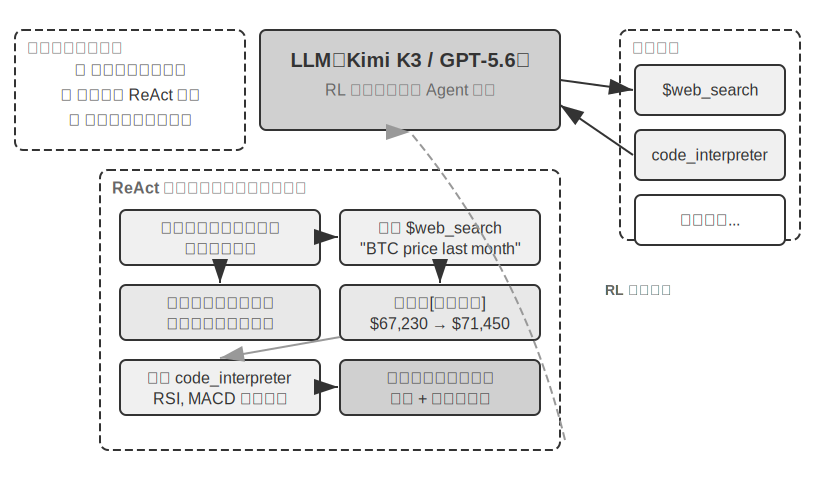

# AI Agent 入门

如果你用 Cursor 写过代码，看它搜索代码库、编辑多个文件、运行测试直到通过；用 Deep Research 调研过一个课题，看它反复搜索、阅读，总结出一份完整报告；用 Manus 操控浏览器帮你完成在线任务；让豆包手机助手帮你在手机上订票、发消息；或者让 Pine AI 替你打电话给运营商协商降低账单——你已经在使用 AI Agent 了。

这些产品的形态各异，但有一个共同点：它们不再是“你问一句、它答一句”的被动对话，而是能够自主规划执行步骤、调用各种工具完成任务，并根据结果不断调整策略的智能系统。AI Agent 正在成为我们与计算机交互的一种全新方式。

本章将带你从实践出发理解 AI Agent 的核心组成。我们将直接动手体验现代 Agent 的能力，理解其背后的架构原理，掌握构建 Agent 系统的设计模式与最佳实践。

> **阅读提示**：本章是全书的概念地图——它会快速引入 Agent 的核心公式、运行循环、工程框架和设计模式，为后续章节提供统一的术语和参照坐标。初次阅读时不必逐一记住所有概念，建议先建立整体印象；后续每一章都会展开讲解本章提到的某一个方面，届时可随时回来对照。

## 现代 Agent = LLM + 上下文 + 工具

现代 Agent 系统的本质可以用一个简洁的公式来表达：**Agent = LLM（大语言模型，Large Language Model）+ 上下文 + 工具**。这个公式简洁而实用，但其中每个词都需要做广义的理解：

- **LLM 是 Agent 的大脑**：它不只是一组模型参数，而是 Agent 的整个决策内核——理解意图、思考规划、做出判断。就像人类大脑不只是神经元的集合，还包括通过经验塑造的思维方式，LLM 的能力也来自两部分：**预训练**所积累的世界知识与语言能力，以及**后训练**所固化的决策策略——后者的具体技术（如监督微调与强化学习）将在第七章展开。
- **上下文是 Agent 的眼睛**：它不只是输入给模型的那段文本，而是 Agent 在每个决策点能看到的全部信息——环境信息、用户记忆、领域知识、自身状态和任务进展。就像人类做决定时需要看清当前的状况、回忆相关经验、翻阅参考资料，Agent 的上下文窗口就是它当下能看到的一切。
- **工具是 Agent 的手脚**：它不只是几个可调用的 API 函数，而是 Agent 能做的所有事情的集合——从预定义的工具调用到按需加载的专业技能（Skills），从动态生成代码创造新能力到委托子 Agent 协作，从主动与用户沟通到响应外部事件。

换一种更直观的说法：**Agent = 大脑 + 眼睛 + 手脚**。大脑负责思考和决策，眼睛提供思考所需的全部信息，手脚将决策转化为对现实世界的改变。

这三个组件恰好对应 RL（详见第七章）中的三个核心概念。下面这张表格是**可选阅读**——如果你没有 RL 背景，完全可以跳过，不影响后续理解；它只是帮助有 RL 背景的读者把已有知识和本书的术语对应起来：

| 直觉理解 | 实现组件 | 学术概念（可选） | 含义 |
|-----------|-----------|----------------------------|----------------------------------------------|
| **大脑** | LLM | **策略**（Policy） | Agent 决定“下一步做什么”的决策逻辑——面对当前看到的信息，从所有可选行动中挑出最合适的一个 |
| **眼睛** | 上下文 | **观察空间**（Observation Space） | Agent 能看到的所有信息——能看到什么、读到什么、记住什么、能访问哪些系统 |
| **手脚** | 工具 | **动作空间**（Action Space） | Agent 能做的所有事情的集合——有哪些“手段”可用，从发消息到执行代码再到操控界面 |

理解这三者的作用及其相互关系，是构建有效 Agent 系统的基础。我们从最具体的手脚（工具）开始介绍，逐步深入到大脑（LLM）和眼睛（上下文）。先来看看不同类型的 Agent 如何在这三个维度上展开：

| Agent 产品 | 眼睛（感知） | 手脚（行动） | 策略 |
|----------------|----------------------|----------------------------|------------------------------|
| **Cursor 等 Coding Agent** | 需求文档、代码库、终端环境 | 开放式（内部思考、代码搜索、文件读写、执行命令等） | 增量开发：理解需求→搜索相关代码→编辑代码→测试验证→调试修复 |
| **Deep Research 等搜索 Agent** | 网络资源、学术数据库、本地文件 | 开放式（内部思考、搜索查询、网页阅读、摘要生成） | 迭代深化：根据已有信息调整搜索方向，逐步综合出完整报告 |
| **Manus 等电脑操控 Agent** | 电脑屏幕、浏览器页面、文件系统 | 开放式（内部思考、点击、输入、滚动、截图、执行代码等） | 视觉感知+操作：观察屏幕→识别目标元素→执行操作→验证结果 |
| **豆包等手机助手 Agent** | 手机屏幕、已安装的 App | 开放式（内部思考、点击、滑动、输入、打开 App 等） | 意图理解+App 操控：理解用户需求→定位目标 App→执行操作→确认完成 |
| **Pine AI 等个人办事 Agent** | 用户账户信息、历史账单、服务商知识库 | 开放式（内部思考、打电话、发邮件、填表单、与用户确认） | 多步骤任务执行：收集信息→制定协商策略→联系服务商→谈判→汇报结果 |

这些 Agent 系统有几个共同特征：它们都使用**开放式的动作空间**——不是从有限的几个按钮中选择，而是能生成任意自然语言和代码；它们都能**内部思考**——在采取行动前先思考和规划；它们都能**持续交互**——根据环境反馈不断调整策略。这些能力正是来自大脑、眼睛和手脚——即 LLM、上下文和工具——的协同作用。

### 工具：Agent 的手脚

工具是 Agent 与外部世界交互的桥梁，就像人类的手脚一样，让 Agent 能够从被动的观察者变成主动的执行者。没有工具，Agent 只能 “纸上谈兵”；有了工具，它才能真正改变世界。

为了系统化地讨论工具，可以根据 Agent 与外界互动的方向把工具分为五类。下面先快速过一遍每一类的代表场景，建立整体印象，后续章节会逐一展开。

**感知工具**让 Agent 能访问信息：搜索引擎提供实时网络数据，文件系统读取本地文档，API 和数据库则对接外部服务和企业核心数据。

**执行工具**让 Agent 改变世界：代码执行、文件操作、系统命令、外部 API 调用——决策由此变成实际行动。

**协作工具**让 Agent 与其他 Agent 分工合作：委托子 Agent 完成专项任务，在关键决策点请求人类确认，或在多 Agent 系统中协调行动。

**事件触发工具**与前三类在调用方式上有本质的区别——它们不是 Agent 主动调用的，而是作为外部输入来驱动 Agent 开始执行任务。比如收到一封新邮件、到了某个预定时间点、或另一个系统发出了 Webhook 回调，这些事件会激活 Agent，让它开始后续的思考和行动。虽然事件触发不是 Agent 主动调用的，但它是 Agent 与外部世界交互的通道之一，因此归入广义的工具体系。

**用户沟通工具**是 Agent 主动与用户建立连接、传递信息的渠道。与执行工具改变外部世界不同，用户沟通工具专注于信息的传递和交互——通过文字消息、语音通话、邮件等方式，将 Agent 的执行进展或主动关怀传达给用户。

以上五类工具的完整分类体系和设计原则将在第四章展开讨论。工具设计的质量直接决定了 Agent 能走多远——接口定义不清晰，模型就会乱用工具；错误处理不到位，工具一旦失败就会变成 Agent 的死锁；权限控制太宽泛，Agent 一旦出错，后果就难以挽回。MCP（Model Context Protocol，模型上下文协议）标准的推广，正在让工具接入变得更像安装插件——生态在快速扩展，但设计原则不会过时。

**工具调用**（Tool Calling，也称 Function Calling）是现代 LLM Agent 的一项核心能力，它让模型能够通过结构化的方式调用外部工具。这种能力将 LLM 从一个纯粹的文本生成器转变为能够执行实际操作的智能系统。本书后续统一使用“工具调用”这一术语。

工具调用的流程分为四步：首先，在上下文里告诉模型有哪些工具可用（包括名称、用途和参数）；然后，模型自主判断要不要调用工具、调用哪个、传什么参数；接着，工具执行完毕后，结果被追加到上下文中；最后，模型据此决定下一步行动。这个循环就是后文要介绍的 ReAct 的基础。

以一个查天气的场景为例，四步流程在 API 层面的简化表示如下：

```
第一步：声明工具                    第二步：模型决定调用
tools: [{                          assistant: {
  name: "get_weather",               tool_calls: [{
  parameters: {                        function: "get_weather",
    city: "string"                     arguments: {city: "北京"}
  }                                  }]
}]                                 }

第三步：结果追加到上下文              第四步：模型基于结果回复
tool: {                            assistant: {
  tool_call_id: "call_1",            content: "北京今天 28°C，晴。"
  content: '{"temp":28,"sky":"晴"}'  }
}
```

开发者只需要定义工具和执行工具调用，模型自主完成“要不要调用、调哪个、传什么参数”的决策。第二章将详细展开这个 API 结构。

在为 Agent 设计工具时，应尽量保持工具的通用性，给 LLM 更大的发挥空间。例如，与其设计一个专用的计算器工具，不如提供一个 Python 代码解释器，并为 Agent 创建一个安全的沙盒执行环境。与其设计一个记录工作日志的工具，不如提供文件读写工具，并为 Agent 创建一个虚拟的文件系统。通用的工具让 Agent 能够通过组合基础能力来创造性地解决问题。

### LLM：Agent 的大脑

大语言模型（Large Language Model, LLM）是 Agent 的决策核心。收到用户的请求后，它需要先解析真实意图（用户说的往往不是他真正想要的），再将模糊或复杂的任务拆解成可执行的步骤。执行过程中它还要持续做出判断：下一步该做什么、要不要调用工具、调哪个工具、传什么参数。这种“理解-规划-执行”的能力来自预训练所积累的知识，是工作流和自主 Agent 都依赖的基础。

LLM Agent 的一个独特能力是**内部思考**——在采取实际行动之前，Agent 可以先进行规划与推演。这一过程不改变外部环境，却能显著提升后续行动的质量。LLM 之所以能够进行有效的内部推演，得益于预训练（Pre-training，即在海量互联网文本上进行初始训练，让模型学会语言规律和世界知识）阶段习得的能力——模型在推演时所遵循的是人类知识中已经沉淀下来的逻辑规则，包括数学定律、因果关系、问题分解策略等。因此 Agent 的推演不是盲目的随机探索，而是在结构化的知识体系上展开。

这种结构化推演的能力，让 LLM Agent 在面对全新任务时也能直接上手——下面通过零样本和少样本两个概念分别说明。这种能力的直接体现是**零样本泛化**（Zero-shot Generalization）：即使面对从未见过的任务，LLM Agent 也能通过组合已有知识来处理，无需任何示例。比如你从未教过它写一首关于量子物理的诗，但它能根据已有的语言和物理知识生成一首像样的作品。

更进一步，LLM Agent 还能通过极少的示例实现**少样本适应**（Few-shot Adaptation）——只需在提示中给出两三个示范例子，模型就能掌握一种新的任务模式。比如给它看几条“用户评论 -> 情感标签”的例子，它就能学会对新评论做情感分类。简单来说，零样本是“没有例子也能做”，少样本是“看几个例子就能学会”。

#### 模型即 Agent：当模型本身成为产品

“模型即 Agent”（Model as Agent）这一新范式代表了 AI Agent 发展的最新方向。先进模型通过后训练（特别是强化学习）将工具调用能力内化为原生能力：何时调用工具、调哪个、传什么参数，都由模型自己决定，无需人工编排。但这并不意味着框架层变得不重要了。恰恰相反，模型越强大，围绕模型构建的 Harness 就越关键。Harness 这个词原指马具，即套在马身上的缰绳与挽具，不是为了限制马的奔跑能力，而是把这种力量引导到正确的方向上。换到 Agent 语境里，模型是那匹强大但不可预测的马，Harness 则是把它的能力引导成可靠任务执行的工程外壳。你也可以把它想象成赛车手周围的整套保障系统：安全带、赛道护栏、进站维修团队。车手（模型）越快，这套系统越重要。在 Agent 中，Harness 包括上下文管理、工具接口、安全约束、验证与纠正等基础设施（详见本章末节）。

模型自主决策的空间越大，出错时的影响面也越大，因此需要更精细的约束、验证和纠正机制来确保可靠性。模型厂商的真正优势不是“让框架变薄”，而是能对模型与外围 Harness 进行协同优化，持续迭代。

但这里悬着一个更深的问题：如果模型持续变强，今天这些 Harness 会不会最终被模型“吃掉”？Rich Sutton 在《苦涩的教训》（The Bitter Lesson）中回顾了 AI 研究七十年间反复上演的一幕[^ch1-1]：研究者一次次把自己对领域的理解编码进系统，短期见效，长期却总是输给能随算力与数据规模持续扩展的通用方法——搜索与学习。以此衡量，Harness 里的约束、验证与纠正，有多少属于“人的先验”，注定会被模型内化？本书的立场是八个字：**方向认同，节奏务实**。方向上，本书不怀疑模型会持续吃掉 Harness——工具调用、长程规划都曾靠外部编排，如今已是模型的原生能力；但在节奏上，这个“吃”远比直觉慢：训练以月计，模型也无法一次内化真实业务中所有的约束与偏好，模型此刻的能力边界，就是 Harness 此刻的价值所在。因此 Harness 工程不是对苦涩的教训的抵抗，而是这一教训在工程时间尺度上的实践：模型还做不稳的，Harness 先补上；模型每内化一层，Harness 就卸下一层，转而兜底新的能力前沿。这条主线将贯穿全书——第二章从上下文工程的角度给出务实的回答，第八章讨论 Agent 如何自己去发现知识与能力的结构，后记再回到“模型会不会吃掉 Harness”的完整答案。

[^ch1-1]: Sutton, Rich. "The Bitter Lesson", 2019. http://www.incompletenessideas.net/IncIdeas/BitterLesson.html

#### Agent 的学习机制：后训练、上下文学习与外部化学习

前面讨论了模型如何通过强化学习将工具调用的决策策略内化为原生能力。但 Agent 的学习不只发生在训练阶段——一些读者一想到 Agent 从经验中学习，就认为一定要训练模型。事实上，后训练并不是 Agent 从经验中学习的唯一方法。Agent 的学习机制可以总结为三个互补的范式（图 1-1）：


- **后训练（Post-training）**：通过强化学习将经验固化到模型的参数中，提供最强的跨任务通用性，但更新成本高（详见第七章）。
- **上下文学习（In-Context Learning）**：通过注意力机制（Attention Mechanism，即模型在处理输入时决定“关注哪些信息”的机制）在上下文中进行模式检索式的快速适配。比如在提示词中给模型看几条客服对话的处理示例（如“用户投诉→安抚+补偿方案”），它就能用类似的方式处理新的客服对话——这就是上下文学习。能快速适应但临时性强，会话结束就消失了。需要说明的是，虽然名字叫“学习”，但它的内部机制更接近**模式匹配而非真正的学习**。打个比方：如果给你看三道相同类型的数学题和答案，然后给你第四道，你大概率能照葫芦画瓢做出来——这就是上下文学习在做的事。但如果第四道题需要一种全新的解题思路，光看前三道题的答案是不够的。换句话说，上下文学习让模型能**套用已见过的模式**，但不能**发现全新的规律**——这一点与后训练有本质区别（第二章将从注意力机制的角度详细展开这个论断）。
- **外部化学习（Externalized Learning）**：将知识和流程外部化为知识库与可执行的工具代码，兼具持久性和可解释性。

这三种范式在不同的时间尺度上互补：后训练提供基础能力，上下文学习实现快速适应，外部化学习确保可靠性和效率。第八章将系统地比较三种范式的协同关系。

打个比方：后训练像是系统性学习教科书——学完后能力永久提升，但学习成本高；上下文学习像是临场查阅参考资料——有资料就能做好，合上就忘；外部化学习像是整理个人笔记本——信息持久保存且随时可查，但需要专门整理。

### 上下文：Agent 的眼睛

上下文是 Agent 在每个决策点能看到的全部信息。就像一个人在做决策时需要看到桌上摊开的所有资料——任务说明、参考手册、之前的沟通记录、最新的数据——Agent 的上下文窗口就是它的“视野”。从 API 的视角看（详见第二章），每次调用 LLM 时的上下文由以下五个部分构成：

- **系统提示词**（System Prompt）：与用户每次输入的提示词不同，系统提示词由开发者编写，在整个对话过程中保持不变，相当于 Agent 的“岗位说明书”——定义它的身份、权限和行为准则。通过提示工程（Prompt Engineering）精心设计系统提示词，我们可以塑造 Agent 的工作方式。系统提示词中还会包含跨会话保存的**用户记忆**（用户偏好、历史行为、背景设定等个性化信息，详见第三章）和动态注入的环境状态。
- **工具定义**（Tool Definitions）：声明 Agent 可用工具的名称、功能描述和参数格式。没有工具定义，Agent 就无法识别和调用任何工具——消融实验（实验 1-1）将验证这一点。工具定义与系统提示词一起构成对话中保持不变的**静态前缀**（这是基础模式；2026 年以来，生产框架中工具的完整 schema 也可以按需动态加载到上下文末尾而不破坏前缀，详见第二章工具定义一节和第四章）。
- **用户消息**（User Messages）：来自用户的输入。用户消息中还可能包含通过 RAG（检索增强生成，Retrieval-Augmented Generation，详见第三章）动态检索引入的**外部知识**——覆盖训练数据截止后的信息或私有领域知识。
- **模型回复**（Assistant Messages）：模型之前生成的回复，最多包含三个部分——思考过程（`reasoning`，即内部思考链，保持思维连贯性和决策可解释性）、文本内容（`content`，即对用户的回复）和工具调用请求（`tool_calls`，即 Agent 采取行动的方式）。在一次具体的回复中，三者不一定同时出现：例如 Agent 决定调用工具时通常只有 `reasoning` + `tool_calls`，给出最终回答时通常只有 `reasoning` + `content`。
- **工具执行结果**（Tool Results）：Agent 框架执行工具后返回的结果。这些结果是 Agent 下一步思考的直接依据，也让它能够从执行结果中学习、避免重复犯错。

前两项（系统提示词 + 工具定义）是静态前缀，后三项（用户消息 + 模型回复 + 工具执行结果）是随交互不断增长的动态消息历史。这五个部分共同构成了 LLM 每次推理时的上下文。

要验证每个组件是否都不可或缺，最直接的方法是**消融实验**（Ablation Study）：就像医生诊断时逐一排除病因——先去掉 A 组件看系统是否还正常，再去掉 B 组件，以此类推，从而判断每个组件的贡献。实验 1-1 正是按这个思路对上述五个组件做了系统性测试，结果表明：去掉工具定义，Agent 完全丧失行动能力；缺少工具执行结果时，由于看不到上一步的反馈，Agent 会反复调用同一个工具，陷入无限循环；模型回复中的思考过程一旦被剥离，前后决策就开始互相矛盾；至于历史消息，没有它 Agent 等于失忆，于是从头开始整个任务流程，重复执行已完成的步骤。每个组件的作用都有实验证据支撑，而不只是理论推断。

### 实验 1-1 ★★：上下文的关键作用

通过系统性的**消融实验**（Ablation Study），我们探索了不同上下文组件对 Agent 行为的影响。实验从上述五个部分中选取了四个组件进行测试——系统提示词作为 Agent 的基本身份定义不参与消融，因为没有系统提示词，Agent 连基本的角色认知都没有，测试没有意义。如图 1-2 所示，五组对照实验包括：一组保留全部组件的完整基线，再加上四组各缺失一个组件的对照，以此观察每个组件对 Agent 性能的影响。


实验结果揭示了每个上下文组件不可替代的作用。**工具定义**（Tool Definitions，静态前缀的一部分）是 Agent 行动能力的基础，没有它，Agent 就无法识别和调用任何工具。**工具执行结果**（Tool Results）是闭环控制的关键，缺失它会导致 Agent“盲目”执行，陷入无限循环。**思考过程**（模型回复中的 reasoning 部分）保留了 Agent 做出之前决策的原因，使思维流程更加连贯，避免做出前后矛盾的决策。**历史消息**（之前轮次的用户消息、模型回复和工具执行结果）则防止了冗余操作，保持任务执行的连贯性，避免重复犯同样的错误。

这个实验的核心洞察是：**上下文决定了 Agent 能看到什么，而 Agent 只能基于它看到的信息做决策**。就像一个人蒙住眼睛就无法做出合理判断一样，缺失任何一个上下文组件，Agent 的决策能力都会严重退化——看不到工具定义就不知道有哪些工具可用，看不到之前的执行结果就不知道已经做过什么。

### ReAct 循环

了解了 Agent 的三大组件后，一个自然的问题是：它们如何协同工作？ReAct 循环就是将 LLM、上下文和工具串联起来的核心机制——让我们看看一个 Agent 是如何一步步思考和行动的。

Agent 执行任务的核心模式叫做 **ReAct**（Reasoning + Acting）。虽然名字只体现了思考（Reasoning）和行动（Acting）两个词，但实际循环包含三个环节：模型先**思考**当前应该做什么，然后调用工具**行动**，再**观察**工具返回的结果并继续思考下一步。这个“想→做→看→想→做→看”的循环不断重复，直到任务完成。

让我们通过一个多币种收入汇总的具体例子来理解 Agent 的**轨迹**（trajectory）。轨迹是 Agent 在执行任务过程中不断积累的消息历史——用户消息、模型回复（包括思考过程和工具调用）、工具执行结果。每一次调用 LLM 时，它接收的完整上下文由**静态前缀**（系统提示词 + 工具定义）和**轨迹**（动态消息历史）两部分组成（图 1-3）。这揭示了一个关键事实：**Agent 的上下文 = 静态前缀 + 轨迹**。具体地说，静态前缀对应前文五个组件中的前两项（系统提示词 + 工具定义），轨迹对应后三项（用户消息 + 模型回复 + 工具执行结果，随交互不断增长）。基于这个完整上下文，LLM 生成下一步的响应，然后这个响应又追加到轨迹中，供下一次调用使用。


让我们通过伪代码来理解 Agent 轨迹的结构：

```
轨迹 = [
  {role: “user” , content: “根据公司季度收入：Q1 2.5M 美元，Q2 2.1M 欧元，Q3 1.8M 英镑，Q4 380M 日元，计算公司年度总收入和季度平均收入” },
  
  # 第一次迭代 - LLM 看到上述轨迹，生成响应
  {role: “assistant” , 
   reasoning: “需要将所有货币转换为 USD...” ,
   content: “” ,  # 没有直接回复用户
   tool_calls: [
     {name: “convert_currency” , args: {amount: 2100000, from: “EUR” , to: “USD” }},
     {name: “convert_currency” , args: {amount: 1800000, from: “GBP” , to: “USD” }},
     {name: “convert_currency” , args: {amount: 380000000, from: “JPY” , to: “USD” }}
   ]},
  
  # Agent 框架执行工具，添加结果到轨迹
  {role: “tool” , content: “EUR->USD: 2282608.7” },
  {role: “tool” , content: “GBP->USD: 2278481.01” },
  {role: “tool” , content: “JPY->USD: 2541806.02” },
  
  # 第二次迭代 - LLM 看到完整轨迹，包括工具结果
  {role: “assistant” ,
   reasoning: “已获得转换结果，现在需要汇总计算...” ,
   content: “” ,
   tool_calls: [
     {name: “code_interpreter” , args: {code: “total = 2500000 + 2282608.7 + ...” }}
   ]},
  
  {role: “tool” , content: “Total: $9,602,895.73, Average: $2,400,723.93...” },
  
  # 第三次迭代 - LLM 看到完整轨迹，生成最终答案
  {role: “assistant” ,
   reasoning: “所有计算完成，总结结果...” ,
   content: “FINAL ANSWER: 总收入$9,602,895.73...” }
]
```

注意，轨迹中没有显示系统提示词和工具定义——它们作为静态前缀，在每次 LLM 调用时都会被自动拼接在轨迹前面。

在我们的实验中，这个循环展现得淋漓尽致。第一轮，Agent 分析任务后并行调用三个货币转换工具；第二轮，基于转换结果调用代码解释器进行复杂计算；第三轮，确认所有计算完成后生成最终答案。整个过程仅用了 3 次迭代、4 次工具调用就完成了复杂的多步骤任务。

这种设计的精妙之处在于**上下文的累积性**。每次 LLM 调用都能看到完整的轨迹，这让它能够理解当前处于任务的哪个阶段、之前尝试了什么、得到了什么结果。就像人类解决问题时会不断回顾和总结，Agent 通过轨迹保持着对整个任务的全局认知。同时，轨迹的结构化特性也让系统具有高度的可解释性和可调试性：用户消息、模型回复（思考过程 + 工具调用）和工具执行结果都被清晰地区分开来。

轨迹不仅是执行的记录，更是 Agent 能力的体现。通过分析大量的轨迹，我们可以发现 Agent 的行为模式、优化决策路径、改进工具设计。轨迹数据甚至可以总结到知识库中，或者通过强化学习来训练更好的 Agent 模型，实现从经验中学习的闭环优化。


理解了 Agent 的运行循环后，让我们通过两个实验来感受不同模型如何驱动这个循环。

#### 实验 1-2 ★：Kimi K3 原生 Agent 能力

这个实验展示了 **Kimi K3** 的原生 Agent 能力，体现了“模型即 Agent”的新范式。Kimi K3 由 Moonshot AI 于 2026 年发布，是一个约 2.8 万亿参数的混合专家（MoE, Mixture of Experts）模型——可以把 MoE 想象成一个专家团队：面对不同类型的问题，系统会自动选择最合适的几位专家来作答，而不需要所有专家同时上阵，这样既保证了能力又提高了效率。它拥有 100 万 token 的上下文窗口、原生的视觉理解能力，以及始终开启的“思考模式”（thinking mode）；模型通过强化学习训练，将工具调用的**决策策略**内化为原生能力——何时调用工具、调用哪个、传什么参数都由模型自主决定，从而能够自主完成网络搜索等任务。需要说明的是，被内化的是“何时调用、如何调用”的决策，而 `web_search`、`code_runner` 等工具本身仍作为 API 层面的内置工具在服务端执行（Kimi 通过名为 Formula 的服务端脚本引擎运行这些官方工具）。

关键观察包括：模型通过 RL 训练自然地学会了何时以及如何使用工具，客户端无需再人工编写工具调用的编排逻辑；模型自己决定何时搜索、搜索什么，展现了真正的自主性；它能根据搜索结果动态调整策略，自主判断信息是否充足。这里需要厘清一个常见的误解，关键在于分清两件事的归属。**强化学习赋予模型的是决策能力**——何时该调用工具、调用哪个、传入什么参数、拿到结果后是否继续、如何把几十上百次调用串联成连贯的推理，这些"用不用、怎么用"的判断被写进了模型参数。**而工具本身及其执行则由 Agent 框架（或 API 内置工具）提供**——`web_search`、`code_runner` 的真实实现、代码沙盒环境、调用的发起与结果回传，都在模型之外的基础设施里完成。RL 优化的是决策策略，而不是把搜索引擎或代码沙盒"装进"模型的权重。因此编排循环并没有消失，而是从客户端移到了服务端，同时决策权交给了模型[^ch1-2]。

[^ch1-2]: 感谢读者 asdlem 通过 GitHub Issue #30 指出并厘清了“RL 内化的是工具调用决策策略、而非工具执行机制”这一区分。参见 https://github.com/bojieli/ai-agent-book/issues/30

Kimi K3 在 Agent 任务中的一个突出优势是**长链工具调用的稳定性**——它能够连续执行 200～300 次工具调用而保持思考的一致性，远超多数模型在数十次调用后就开始退化的表现。K3 面向长周期编程与 Agent 工作负载优化，发布时提供 K3 Max（面向对话与 Agent 任务）与 K3 Swarm Max（面向大规模并行处理）两个规格。作为开源模型，它在软件工程和 Agent 基准测试中展现了可与顶尖闭源系统比肩的性能，证明了通过强化学习赋予模型原生 Agent 能力这条路线的有效性。

#### 实验 1-3 ★：GPT-5.6 原生 Deep Research 能力

第二个实验使用 **OpenAI GPT-5.6**，展示先进模型如何借助 API 内置工具，在服务端把 Deep Research 的“搜索—阅读—分析”编排循环闭环起来。GPT-5.6 提供了三种规格——Sol（旗舰前沿模型）、Terra（面向日常工作的均衡模型）和 Luna（快速经济的轻量模型），均把工具调用的决策交由模型原生完成，客户端无需自行搭建编排框架。一个便利的特性是**自由格式工具调用**（Freeform Tool Calling）——传统方式中，模型调用工具时必须把所有参数打包成严格的 JSON 格式（一种结构化的数据格式），这就像填表格一样有很多格式限制。自由格式工具调用（在 API 中通过 `type: "custom"` 的工具类型声明）允许模型直接向工具发送原始文本（比如一段 Python 代码、一条 SQL 查询），省去了 JSON 转义的麻烦。要说明的是，这是 API 参数格式的演进，而非模型架构的革新——客户端的工具调用循环（检测 `tool_calls` → 执行 → 回传结果）逻辑保持不变，改变的只是参数从 JSON 字符串变成了原始文本。GPT-5.6 还引入了 Verbosity 参数（控制输出的详略程度）和 Reasoning Effort 参数（调整思考的深度，Sol 新增了 max 档位以获得最充分的推理时间），使开发者能根据任务的复杂度精细控制模型行为。

GPT-5.6 配合 Responses API 的**网络搜索和代码解释器**内置工具——这正是 Deep Research 的核心：模型能够自主搜索网络获取实时信息，并编写代码进行深度分析，实现“搜索 -> 阅读 -> 分析 -> 再搜索”的迭代研究过程。例如，面对 “东盟 10 国首都之间，最近的一对首都距离多少” 这样的问题，GPT-5.6 会自动搜索各国首都的地理坐标，然后编写 Python 代码计算所有首都对之间的大圆距离，最终找出最近的一对。又如 “搜索最近一个月的比特币走势，做技术分析” 任务中，它能从多个金融数据源获取实时价格数据，运用专业的技术分析库计算移动平均线、RSI、MACD 等技术指标，生成可视化图表并给出交易建议。

更重要的是，GPT-5.6 将 **OpenAI Deep Research** 产品的设计理念内化到了模型层面，引入了**意图澄清过程**。当用户提出研究需求后，GPT-5.6 不会立即动手执行，而是首先通过一系列问题来澄清用户的真实意图。以“搜索最近一个月的比特币走势，做技术分析”为例，它会先问：“您偏好使用哪个数据源？需要分析哪些技术指标？”通过这种交互式的意图澄清，GPT-5.6 能够生成更精准、更符合用户需求的研究报告。

GPT-5.6 是“模型即 Agent”概念的一个成熟实例——网络搜索、代码解释器等作为 Responses API 的内置工具在服务端闭环执行，编排循环从客户端移到了 API 服务端，从而简化了客户端实现；模型仍然输出标准的工具调用，只是客户端不必再自行搭建“搜索—阅读—分析”的编排框架。其中最值得关注的是意图澄清机制：模型不会一收到任务就立即执行，而是先通过提问来确认用户的真实需求，再制定研究策略。这让“用户说了什么”和“用户真正想要什么”之间的差距，在任务执行之前就得到了弥合。

图 1-4 展示了“模型即 Agent”范式下原生工具调用的完整架构，以及 Kimi K3 / GPT-5.6 在实际任务中的 ReAct 执行过程。




## Harness 工程：模型之外的竞争力

到这里你已经理解了 Agent 的核心工作原理——LLM 通过 ReAct 循环，在上下文的辅助下使用工具完成任务。前面的实验证明了这套基本机制是有效的，但同时也暴露了明显的脆弱点：模型可能产生幻觉（编造不存在的工具或参数）、选错工具、或在遇到错误时无法自我恢复。一个能跑的 Demo 和一个可靠的产品之间还有巨大的鸿沟，而这些脆弱点正是 Harness 工程要解决的问题。本章前半部分回答了 Agent 是什么，下半部分回答 Agent 如何在生产环境中可靠运行。

前面几节建立了 **Agent = LLM + 上下文 + 工具** 的核心公式。这个公式描述了 Agent 的**内部组成**，即大脑、眼睛、手脚分别由什么承担。从 Harness 工程的视角看，还需要一个**工程实现**层面的视角：把 LLM 当作一个核心组件（Model），围绕它构建的所有支撑代码统称为 Harness。两个视角并非替代关系，而是不同抽象层次上对同一系统的描述。之所以换用更通用的 “Model” 一词，是因为 Harness 工程的原则适用于任何具备推理和工具调用能力的模型，不限于某种特定模型类型。Harness 的核心就是原公式中的“上下文 + 工具”，再加上三层保障机制：**约束**（限定 Agent 能做什么、不能做什么）、**验证**（检查 Agent 做得对不对）和**纠正**（做错了怎么补救）。

用方程展开生产形态下的完整组成：

> **Agent = LLM + [上下文 + 工具 + 约束 + 验证 + 纠正] = Model + Harness**

最小可工作的 Agent 只需要 LLM、上下文与工具就能跑起来；而要让它在生产环境中长期可靠运转，还需要补全约束、验证、纠正这三层工程外壳——约束防止越界、验证发现错误、纠正恢复异常。这三层机制不是新增的“独立模块”，而是围绕“上下文 + 工具”构建的保障层。换句话说，最小公式是 Demo 视角，扩展公式是生产视角；后者完全包含前者，并在外围加了一圈安全网。

举个例子帮助理解：上下文中嵌入退款政策是“上下文”的范畴，而校验退款金额不超过订单金额则属于“约束”；工具执行 API 调用是“工具”的范畴，而 API 超时后自动重试则属于“纠正”。模型提供基础的理解和推理能力，而 Harness 将这些能力引导、约束和放大为可靠的任务执行。设计和优化这套模型之外的基础设施的工程实践，就是 **Harness 工程**（Harness Engineering）。

用一个具体的例子来理解 Harness 的价值。假设你让一个 Agent 帮用户退掉 3 天前的订单。**没有 Harness 时**：模型看不到退款政策（缺上下文），不知道该调哪个 API（缺工具），直接编造一个退款结果回复用户（缺验证），用户发现退款根本没发生（缺纠正）。**有了 Harness 后**：系统提示词写明了 7 天退款政策（上下文），Agent 调用 `query_order` 和 `process_refund` 工具完成操作（工具），框架校验退款金额不超过订单金额（约束），校验数据库状态确认退款成功（验证），如果 API 调用超时则自动重试（纠正）。同一个模型，有无 Harness，结果天壤之别。

回到本章前面给出的马具隐喻：没有 Harness 的模型就像脱缰的野马，能力惊人，但无法可靠地完成任务。

更精确地说，模型之外的全部基础设施都属于 Harness。Harness 的核心是上下文与工具，围绕它们构建了三类工程化保障机制：

| 功能 | 一句话职责 | 与上下文/工具的关系 |
|--------------------|----------------------------------------|-----------------------------------|
| **Context（上下文）** | 为模型提供感知信息 | 核心能力 |
| **Tools（工具）** | 为模型提供行动手段 | 核心能力 |
| **Constrain（约束）** | 设定行为边界——能做什么、不能做什么 | 围绕上下文和工具构建的安全边界 |
| **Verify（验证）** | 自动判断操作结果的对错 | 围绕工具执行结果构建的检查机制 |
| **Correct（纠正）** | 发现问题时自动修正或回退 | 围绕工具调用失败构建的恢复机制 |

上下文与工具让 Agent “能做事”——理解任务并采取行动；约束、验证与纠正让 Agent “不做错事”——它们不是独立于上下文和工具之外的东西，而是确保上下文和工具在生产环境中可靠运转的工程实践。在 Agent 产品的成熟度曲线上，两者的重要性是不对称的。

早期的 Agent 框架主要关注上下文与工具：给模型工具、给模型上下文，让它“能做事”。而生产级 Agent 系统的重心已经转向约束、验证与纠正：确保工具调用是安全的、上下文是经过管理的、错误是可恢复的。

以 Claude Code 为例，它的 Harness 中绝大部分代码都是约束、验证与纠正，而非上下文与工具——工具本身（文件读写、命令执行、搜索）只是一小部分，而围绕这些工具构建的保障机制才是真正的核心。这些机制包括：

- **流程状态管理**：追踪 Agent 当前执行到哪一步
- **多层上下文压缩**：当信息太多时自动精简
- **权限分类**：控制哪些操作需要用户确认
- **熔断器**（Circuit Breaker）：当错误连续发生时自动“断电”停止重试——就像家里电路短路时保险丝会自动跳闸，防止整个系统崩溃
- **错误恢复机制**：捕获异常、回滚到上一稳定状态、重试或交还给人类

**行业正在从“能做事”向“可靠地做事”转变，Harness 工程因此成为 Agent 系统的核心竞争力。**

### 从提示工程到 Loop 工程：工程范式的演进

回顾 AI 应用工程的发展，可以看到一条清晰的演进弧线：

**软件工程**（Software Engineering）是基础——传统的系统设计、架构、测试和部署实践。**提示工程**（Prompt Engineering）是第一波创新——通过优化输入给模型的自然语言指令来提升输出质量。**上下文工程**（Context Engineering）是第二波——人们认识到单纯优化提示词还不够，需要系统性地管理模型能看到的所有信息（系统指令、工具定义、对话历史、外部知识）。**Harness 工程**是第三波——它将视野从“模型能看到什么”进一步扩展到“模型在什么样的系统中运行”，涵盖了约束机制、验证手段、反馈循环和错误恢复等模型之外的全部基础设施。最新的一波是 **Loop 工程**（Loop Engineering）——它把视野从单次运行再扩展到跨轮次的持续自主运转：谁来发现下一件该做的事、何时验证、何时才算真正完成（第十章将结合多 Agent 协作系统展开）。

这五个阶段不是替代关系，而是层层包含的：提示工程是上下文工程的子集，上下文工程是 Harness 工程的子集，Harness 工程是 Loop 工程的子集。每一层都在前一层的基础上扩展了工程师的关注范围和影响力。**当各家模型的能力越来越接近、不再是决定性的差异因素时，竞争优势就转移到了模型之外的工程实践**。这一判断在最近的工程实践中得到验证——LangChain 在 Terminal Bench 2.0（一个评估 Agent 在终端环境中完成复杂任务能力的基准测试）上的实践就是一个有力的例证：他们的 Coding Agent 从 52.8% 提升到 66.5%（从排行榜 30 名开外跃升至前 5），改变的不是模型，而是 Harness：让 Agent 自动检查自己的执行结果、检测是否陷入了重复循环、优化思考策略等工程手段。OpenAI 的工程团队也公开分享了类似的经验——3 名工程师用 5 个月完成了约百万行代码和近 1500 个 PR，达到传统开发速度的约 10 倍。这一效率的背后不是模型有多强，而是 Harness 做对了。

### Harness 五个功能的核心原则

上面的表格列出了 Harness 的五个功能。下表进一步展开每个功能的核心设计原则和在本书中的对应章节，帮助读者建立从概念到实践的映射：

| 功能 | 核心原则 | 实际例子 | 详见 |
|------|-----------------------------------------------|-----------------------------------|-------|
| **上下文** | 信息充分性：让 Agent 在每个决策点都基于足够的信息判断 | 系统提示词、知识库、Agent 状态栏、Sidecar 旁路查询 | 第二、三章 |
| **工具** | 接口清晰：工具命名直观、参数有例子、边界有说明 | MCP 工具、代码解释器、搜索工具 | 第四章 |
| **约束** | 故障安全默认值：所有能力默认关闭，必须显式开放（类似手机 App 权限管理） | Claude Code 中每个工具默认需要用户授权才能执行 | 第四章 |
| **验证** | 输入隔离：安全检查只看结构化数据（如工具返回的 JSON 字段），而不是模型自由生成的文本（因为攻击者可能通过提示注入操纵模型输出） | Linter 检查、类型系统、工具调用结果校验 | 第五、六章 |
| **纠正** | 在确认无法恢复之前，不暴露中间态（例如工具调用失败时先静默重试，不将半成品结果展示给用户） | 静默重试、接续生成、连续失败时回退到人工判断（熔断机制） | 第二、五章 |

五个功能构成一个闭环：上下文与工具支撑决策，约束预防错误，验证发现偏差，纠正闭合循环。缺少任何一个环节，系统都会出现可靠性缺口。在深入具体的编排模式和护栏设计之前，我们先明确构建 Agent 的核心原则和模型选择策略——它们是后续所有设计决策的基础。


### 构建有效 Agent 的核心原则

根据 Anthropic 的经验，成功的 Agent 系统遵循三个核心原则。

**保持简单**。从最简单的方案开始，只在确实必要时才增加复杂度。直接的 API 调用优于复杂的框架，清晰的代码优于聪明的抽象。因为每多一层抽象都会成为以后调试时新的盲区。

**保持透明**。明确显示 Agent 的规划步骤、执行日志和决策轨迹——这不只是为了调试方便，也是让用户建立信任的前提。因为黑箱里的错误一旦发生，外部观察者既无法定位也无法纠正。

**设计好工具接口（ACI，Agent-Computer Interface）**。ACI 强调的是从 Agent 视角设计接口（让 Agent 容易理解和使用），而非传统 API 从程序员视角设计接口。工具的命名和参数要直观，容易误用的地方要主动防呆，从设计上让错误无法发生——比如 USB 接口只能从一个方向插入，就避免了用户插反的错误。这种“用设计消除错误”的思路在制造业里有一个专门的术语，叫**防呆**（Poka-yoke），源自丰田生产体系。设计不好的工具会让再强的模型也频繁出错——因为模型与工具之间唯一的沟通通道就是接口本身，模糊的接口会被模型放大成系统性的错误。

以下三节展开 Harness 工程中三个独立但重要的主题：模型选型、编排模式、护栏与安全性。它们都不属于 Harness 五要素本身，但是工程实践中绕不开的决策。

### 如何选择模型

在讨论编排模式之前，先回答一个实操问题：应该选什么样的模型来驱动 Agent？

模型是 Agent 的智能基座，选对模型往往比优化提示词更有效。由于模型迭代极快，本节不推荐具体的模型版本，而是提供一些选择的方向。

**认识 “御三家”。** 目前 Agent 开发中最常用的三大闭源模型厂商是 OpenAI（GPT/o 系列）、Anthropic（Claude 系列）和 Google（Gemini 系列）。它们各有侧重：Claude 在复杂推理、编程和工具调用方面表现突出，是目前 Agent 开发的热门选择；Gemini 拥有超长上下文窗口和强大的多模态能力，适合长文本与图片、视频等多媒体场景；GPT/o 系列各方面能力均衡，用户数量最多。选模型时不要只看排行榜，**要在你自己的任务上做评估**（见第六章）。

**国内模型。** 如果你的应用部署在国内或有较严格的成本预算，国内模型是务实的选择。字节跳动的豆包系列国内延迟极低，适合实时交互；月之暗面的 Kimi 是国内 Agent 能力较强的模型；Qwen 和 DeepSeek 等开源模型则在成本和可定制性方面有优势。需要注意的是，不同模型在工具调用方面的能力差异很大，选型前务必在具体场景中测试。国内模型通常通过火山引擎（豆包）、硅基流动（开源模型）等平台的 API 访问，海外模型则可以通过 OpenRouter 统一访问。

**开源与闭源。** 闭源模型通常在能力上领先，但成本较高且受限于厂商的 API 策略。开源模型成本低、可私有化部署、支持微调定制，适合对成本敏感或有数据合规要求的场景。

**绝大多数 Agent 需要支持思考（Reasoning）的模型。** Agent 需要进行多步思考、工具选择等复杂决策，不带思考能力的模型在这些任务上表现往往很差。只有极少数场景例外——比如只执行单步简单任务、或 Computer Use 中仅需点击固定位置的简单 GUI 操作——此时不带思考的模型也能胜任。但只要涉及多步思考或动态决策，就一定要选择支持思考的模型。

**关注输出速度和多模态能力。** 除了成本，还有两个容易被忽视的维度。一是**输出 token 的速度**：Agent 往往需要多轮推理，每轮都要等待模型输出完成才能执行下一步，所以输出速度直接决定了端到端的响应延迟——如果一个 Agent 任务需要 20 轮推理，每轮慢 2 秒就意味着总共多等 40 秒。二是**多模态支持**：如果你的 Agent 需要理解图片、音频或视频，多模态能力就是硬性要求，不同模型在这方面的差异很大。


### 编排模式：工作流与自主

编排模式是 Harness 中“上下文与工具”层面的组织方式——它决定了上下文如何在 LLM 调用之间流动、工具如何被调度、以及 Agent 的执行路径是预先设定还是动态生成。Agent 系统的编排方式经历了从简单到复杂的演进过程，每种模式都有其适用的场景和需要权衡的取舍。根据 Anthropic 与数十个团队合作构建 LLM Agent 的经验，最成功的实现往往不是使用复杂的框架，而是采用简单、可组合的模式。

在构建 LLM 应用时，应遵循“从简单到复杂”的原则：首先考虑单个 LLM 调用——如果通过优化提示词和上下文示例就能解决问题，就不要引入 Agent 系统；当需要多步骤处理时，对于可以清晰分解为固定子任务的场景，考虑使用工作流；只有当需要动态决策和灵活的执行路径时，才使用自主 Agent。需要记住的是：Agent 系统通常会用延迟和成本换取更好的任务性能，应该谨慎权衡这种交换是否值得。

#### 工作流模式：确定性的编排

**工作流**（Workflow）是通过预定义的代码路径来编排 LLM 和工具的系统。它的执行路径是确定性的，由开发者预先设计好——每一步做什么、下一步去哪里，都是代码写死的，LLM 只在每个节点内部负责理解和生成。

以一个订机票 Agent 为例，工作流可以设计为四个固定节点：

1. **核实用户身份**——调用身份验证 API，确认用户是谁
2. **搜索可用航班**——根据用户需求查询航班数据库
3. **完成付款**——调用支付接口扣款
4. **确认预订**——调用预订 API 锁定座位，向用户发送确认信息

每个节点内部可以使用 LLM（例如用自然语言理解用户的出行需求），但节点之间的流转顺序是代码固定的——系统不会在付款完成之前去预订座位，也不会在身份核实之前开始搜索航班。

工作流模式有两个核心优势。第一是**严格的流程控制**：开发者可以确保关键步骤不被跳过或乱序执行，例如“付款前不能预订”这类业务规则通过代码强制执行，不依赖 LLM 的判断。第二是**安全性**：由于执行路径是确定的，提示注入或模型犯错最多只能影响当前节点内部的处理，无法让 Agent 跳到不该执行的分支——攻击面被限制在单个节点内。

工作流的主要局限是**缺乏变通性**。当出现预设流程未覆盖的情况时（例如用户在付款环节临时想改签、或航班突然取消需要推荐替代方案），固定的节点路径无法灵活应对，只能走预设的异常处理分支或将控制权交还给人类。

#### 自主 Agent：动态自主决策

当工作流的固定路径无法满足需求时，我们就需要**自主 Agent**（Autonomous Agent）。自主 Agent 与工作流的核心区别在于：执行路径不是预先定义的，而是 Agent 根据**环境反馈**实时决定的。

仍以订机票为例：自主 Agent 不需要预定义四个固定节点。用户说“帮我订下周三去上海的机票”，Agent 会自行决定先搜索航班、发现需要登录、于是先核实身份、再回来搜索、发现最便宜的航班需要转机、主动询问用户是否接受、用户说不要转机、Agent 调整搜索条件……

这意味着自主 Agent 需要具备自主规划的能力——自主决定执行步骤，还需要能识别失败、调整策略，而不只是在出错时停下来。但自主性不等于无限制——必须设计明确的**停止条件**（任务完成、达到最大迭代次数或遭遇不可恢复的错误），否则 Agent 容易陷入死循环或过度执行。

从实现角度看，自主 Agent 本质上就是在一个循环中使用工具的 LLM，通过持续获取环境反馈来推进任务——这正是前面介绍的 ReAct 循环。常见的退出条件包括：调用最终输出工具、模型返回没有任何工具调用的响应，或者遇到错误、达到最大轮次数。


自主 Agent 特别适用于开放式的问题——这类问题难以或不可能预测所需的步骤数量。典型的应用场景包括：Coding Agent 解决 SWE-bench（Software Engineering Benchmark，一个评估 Agent 自动修复真实 GitHub Issue 能力的基准测试）任务，“计算机使用”（Computer Use）Agent 像人类一样操作计算机界面，以及需要迭代搜索和分析的研究任务。

不过，自主性也带来了更高的成本和潜在的复合错误风险。因此在部署自主 Agent 时，必须在沙盒环境中进行充分的测试，设置适当的护栏和监控机制，并在关键决策点考虑加入人机协作的检查点。

#### 两种模式的选择与混合

实践中，工作流和自主 Agent 并非非此即彼——很多系统会混合使用两种模式：关键的、有严格合规要求的流程用工作流来确保可靠性，需要灵活决策的部分切换到自主模式。例如，n8n 是一个成熟的工作流自动化开源框架，开发者通过可视化界面拖拽功能组件来构建 Agent，可以在同一个系统中同时使用工作流节点和自主 Agent 节点。


#### 主流 Agent 框架简要对比

下表梳理了当前主流的 Agent 框架/平台，帮助读者根据场景快速定位：

| 框架/平台 | 核心定位 | 编排模式 | 开发方式 | 适用场景 |
|---------------|---------------|-------------------|---------------|--------------------------------|
| **OpenAI Agents SDK** | 轻量级 Agent 开发库 | 自主（工具循环） | 代码优先 | 快速原型、单 Agent 应用 |
| **Claude Agent SDK** | 生产级 Agent 开发框架 | 自主（工具循环 + 子 Agent） | 代码优先 | 复杂自主任务、Coding Agent |
| **LangChain / LangGraph** | 通用 LLM 应用框架 | 工作流 + 自主 | 代码优先 | 复杂链式思考、多步骤工作流 |
| **n8n** | 可视化工作流自动化 | 工作流 + 自主 | 低代码（可视化拖拽） | 业务自动化、非技术团队 |
| **Dify** | LLM 应用开发平台 | 工作流 + 对话式 | 低代码（可视化 + API） | 企业级 RAG、知识库应用 |
| **CrewAI** | 角色化多 Agent 编排 | Multi-Agent 协作 | 代码优先 | 团队式任务分解与执行 |
| **OpenClaw** | 开源全能个人 Agent | 自主 + 事件驱动 | 配置 + 代码（自托管） | 个人助理、Deep Research、Computer Use、多平台消息集成 |

随着“模型即 Agent”趋势的深化，框架的核心价值已经不再局限于“编排 LLM 调用”——模型越来越能自主决策，但围绕模型构建的上下文管理、工具生态、安全约束和错误恢复等 Harness 工程反而变得更加重要。选择框架时，关键考量不在于框架本身的复杂度，而在于它能否以最小的抽象层让你专注于业务逻辑。

前面讨论的编排模式解决了 Harness 中上下文与工具的组织问题——如何把 LLM 调用、工具和数据流串联起来。但光能做事还不够，还需要确保做得对、做得安全。接下来讨论围绕上下文和工具构建的约束、验证与纠正机制在实践中最核心的落地手段：护栏。

### 护栏与安全性

本节对护栏做高层次的概览，帮助读者建立整体认知；具体的实现细节和实践方法将在第二章（提示注入防护）、第四章（工具权限控制）和第五章（代码执行安全）中分别展开，初次阅读时无需深究每个细节。

护栏是 Harness 中“约束、验证与纠正”层面的核心实现手段——它们构成了保障 Agent 行为安全可控的分层防线。精心设计的**护栏**（Guardrails）有助于管理数据隐私风险（例如防止系统提示泄露）或声誉风险（例如确保模型行为与品牌形象一致）。你可以先针对已识别的风险设置护栏，然后在发现新漏洞时逐步添加新的护栏。

可以将护栏理解为分层防御机制。单个护栏不太可能提供足够的保护，但将多个专门的护栏组合使用，就能构建出更有韧性的 Agent 系统。

#### 护栏类型

按防护位置可以分为三类：输入侧、执行侧和输出侧。

**输入侧**护栏在请求到达 Agent 之前拦截，通常包含四种机制。**相关性分类器**标记偏离主题的查询，比如编程助手收到“帝国大厦有多高？”这类无关问题。**安全分类器**检测越狱（Jailbreak，即诱导模型绕过安全限制）和提示注入（Prompt Injection，即在输入中嵌入恶意指令），两者的关键区别在于：越狱是用户自己试图绕过模型的安全限制，提示注入则是攻击者通过外部数据（如网页内容、文档）间接操纵模型行为。**内容审核**标记有害或不当的输入，如暴力、歧视性内容。**基于规则的保护**则采用确定性措施，包括黑名单、输入长度限制、正则表达式过滤器，用以防范 SQL 注入等已知威胁。

**执行侧**护栏在工具调用时验证。其核心是**工具风险评级**：根据操作是否可逆、权限等级、财务影响，为每个工具标注风险等级（低/中/高），高风险操作需额外审查或人工确认。

**输出侧**护栏在响应返回用户之前检查。**PII 过滤器**审查输出中的个人身份信息（如身份证号、手机号），防止不必要暴露；**输出验证**则通过内容检查确保回复与品牌价值一致。

需要注意的是，某些机制（如基于规则的正则过滤）既可以用在输入侧也可以用在输出侧，上文按最常见的部署位置归类。

#### 人工干预

**人工干预**（Human in the loop，又称人在回路）是一个关键的保护措施，它让 Agent 能够在不损害用户体验的情况下提升实际性能。这在部署早期尤为重要，有助于识别失败模式、发现边缘情况并建立健壮的评估周期。

实施人工干预机制，可以让 Agent 在无法完成任务时优雅地转移控制权。在客户服务中，这意味着将问题升级到人工客服；对于 Coding Agent，这意味着将控制权交还给开发者。

通常有两种主要情况会触发人工干预：

**超过失败阈值**
为 Agent 的重试次数或操作次数设置上限。如果 Agent 超过了这些限制（例如多次尝试后仍未能理解客户意图），就应该升级到人工干预。

**高风险操作**
涉及敏感、不可逆或高风险的操作时，应触发人工监督，至少在团队对 Agent 可靠性建立起足够信心之前是如此。典型的例子包括取消用户订单、授权大额退款或付款等。

回到 Harness 五要素的主线——下面我们看看本书各章节如何在这个框架下展开。

### 本书作为 Harness 工程的实践指南

从 Harness 工程的视角重新审视本书的结构，可以发现每一章都在系统性地构建 Harness 的某个组件。同时，安全不是某一章的独立话题，而是贯穿全书的横切关注点（Cross-cutting Concern，即一个影响系统多个部分的问题，类似于软件工程中日志记录需要渗透到每个模块中一样）。下表将 Harness 功能、安全层面和对应章节统一呈现：

| Harness 重点 | 对应章节 | 核心内容 | 安全关注点 |
|---------------|-----------------|------------------------------------|---------------------------|
| 上下文设计 | 第二章（上下文工程） | 提示工程、Agent 状态栏、上下文压缩、Agent Skills | 提示注入与信息泄露 |
| 上下文扩展（知识持久化） | 第三章（知识库） | 用户记忆、RAG、结构化索引、智能体化 RAG | 敏感信息暴露、隐私保护 |
| 工具设计与安全约束 | 第四章（工具设计） | 工具分类、权限控制、MCP 标准、异步架构 | 误操作、未授权访问、不可逆操作 |
| 工具的验证与纠正 | 第五章（代码生成） | Coding Agent 的 Harness、测试驱动、代码化规则 | 身份冒用、责任归属 |
| 系统级验证 | 第六章（评估） | 评估环境、数据集、自动化评估、可观测性 | — |
| 模型层面的纠正 | 第七章（后训练） | SFT（监督微调）、强化学习——将 Harness 中积累的反馈信号写入模型参数，可看作 Harness 工程的延伸 | 目标偏离、对齐与鲁棒性 |
| 系统层面的纠正 | 第八章（自我进化） | 外部化学习、工具创造、经验积累 | — |
| 多模态上下文与工具 | 第九章（多模态与实时交互） | 语音 Agent、Computer Use、机器人操作 | 多模态输入的安全过滤、实时交互中的权限控制 |
| 多 Agent 间的约束与纠正 | 第十章（多 Agent 协作） | 协作架构、失败模式、Agent 社会 | Agent 间信任越界、共享资源冲突 |

Anthropic 在构建长时运行 Agent 时的实践展示了 Harness 设计如何解决模型本身无法解决的问题。他们将复杂任务分解为“初始化 Agent”（设置环境、分解任务列表）和“执行 Agent”（在每个会话中增量推进并留下清晰的交接制品），通过结构化的 Harness 解决了 Agent 在长任务中“上下文耗尽”和“过早声明完成”的问题。后续章节将逐一深入 Harness 的各个组件——第二章从最核心的上下文工程开始，第五章将专门展开 Harness 工程在 Coding Agent 中的完整实践。

## 本章小结

本章从实践出发，建立了理解和构建 AI Agent 的基础框架。

**Agent = 大脑 + 眼睛 + 手脚**：LLM 是大脑（决策核心），上下文是眼睛（决定它能看到什么），工具是手脚（决定它能做什么）。三者缺一不可。

**眼睛（上下文）是决定性的因素**：上下文由静态前缀（系统提示词 + 工具定义）和动态轨迹（消息历史）构成。消融实验表明，去掉任何一个组件都会导致系统显著退化。ReAct 循环的本质是通过不断追加轨迹来让模型持续推进任务。

**Harness 是竞争力所在**：模型能力正在商品化，真正的差异在于 Harness——围绕上下文和工具构建的约束、验证与纠正机制，确保 Agent “可靠地做事”。在生产级的 Agent 系统中，Harness 的绝大部分代码都在做这些保障机制，而不仅仅是上下文和工具本身。

**从工作流到自主 Agent**：先优化提示词，再考虑工作流，最后才引入自主 Agent——这是降低意外风险最实用的顺序。每种编排模式都有其适用场景，不存在通用最优解。

**安全是架构问题**：护栏、人工干预、对齐（alignment，即让模型的行为与人类意图保持一致）——安全问题从第一行代码就要考虑，而不是上线前打补丁。安全问题贯穿模型、上下文、工具、协作和社会五个层面。

下一章将深入探讨 Harness 中最核心的组件——上下文工程。关于 Agent 概念在强化学习中的学术渊源，以及传统 RL 与现代 LLM Agent 的深入对比，我们将在第七章系统展开。

以下思考题旨在帮助读者对本章核心概念进行更深入的探讨。

## 思考题

1. ★★ 如果你只能给一个 Agent 系统增加一项能力——更强的模型、更丰富的上下文、还是更多的工具——你会选哪个？在什么条件下你的选择会改变？
2. ★★★ ReAct 循环中，Agent 的每一次 LLM 调用都会看到完整的历史轨迹。随着轨迹增长，这种设计的成本是二次方增长的。有没有办法在不丢失关键信息的前提下打破这个二次方？
3. ★★ “模型即 Agent” 范式意味着模型在工具调用决策上越来越自主。但本章论证了 Harness 工程的重要性反而在增加。这两个趋势如何共存？Agent 框架未来的核心价值体现在哪些方面？
4. ★★ 消融实验中 “工具结果反馈” 的缺失导致 Agent 陷入无限循环。在生产环境中，除了工具结果缺失，还有哪些情况可能导致 Agent 无限循环？你会设计怎样的检测和终止机制？
5. ★ 本章用感知、行动、策略三个维度分析了五个 Agent 产品。请选择一个你日常使用的 AI 产品，用这三个维度进行分析，并思考它的架构设计是否合理。如果由你来设计这个 AI 产品，有哪些改进空间？
6. ★★ 如果你要设计一个专门处理航班订票的客服系统，你会选择工作流模式还是自主 Agent 模式？有没有可能在同一个系统中混合使用两种模式？
7. ★★★ 护栏部分提到了工具风险评级。如果一个工具在大多数情况下是低风险的，但在特定参数组合下变为高风险（如 `delete_file` 删除普通文件 vs 删除系统文件），你会如何设计动态风险评估？
8. ★★ 本章的 Agent 产品表格中，所有 Agent 的动作空间都是 “开放式” 的。一个受限的动作空间（比如只能从预定义选项中选择）在什么场景下反而优于开放式？
9. ★★ 人工干预机制要求 Agent 能 “优雅地移交控制”。但在实践中，用户可能不在线、响应很慢、或者给出模糊的指令。此时 Agent 应该怎么办？
10. ★★★ 引言指出 “好的设计原则应该穿越模型的迭代周期”。试举一个你认为可能会随模型进步而过时的当前 Agent 设计原则，并说明理由。
