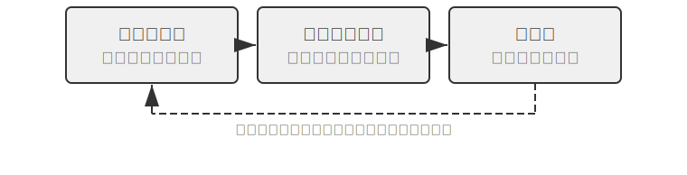

# Agent 的自我进化

前面几章从不同维度构建了 Agent 的能力体系。第二章的上下文工程奠定了信息管理基础（包括 Skills 机制的按需加载）；第三章的知识库与用户记忆实现了跨会话的知识持久化；第五章展示了 Coding Agent 如何通过文件系统沉淀经验；第七章的强化学习后训练则将策略固化到模型参数中。这些技术各有侧重，但都指向同一个问题：**Agent 如何持续变强？**

即使是最前沿的模型，面对特定企业的退款流程、某个运营商的话术策略、或一个冷门 API 的调用方式时，仍然和刚入职的新员工一样两眼一黑。改模型权重需要大量数据和算力，更新周期动辄以周计；而现实中新的 API 上线、旧的服务下线、用户需求不断变化。Agent 需要一种更轻量、更即时的进化机制——不改动模型参数，却能持续拓展自身的能力边界。

本章探讨的正是这种机制：**Agent 的自我进化（Self-Evolution）**。自我进化即外部化学习，包含两个维度——从经验中沉淀知识，以及主动发现和创造新工具。核心思想是将知识和流程从模型参数和临时上下文中分离出来，外部化为可持久化、可检索、可复用的外部资源——工具库和知识库。这不是后训练的替代方案，而是互补：后训练解决“如何让模型更聪明”，自我进化解决“如何让 Agent 更能干”。

## 为什么 Agent 不会自动学习

前面讲的是现实需求。但还有一个更根本的问题：**如果上下文窗口可以无限长，把 Agent 经历过的所有对话和工具调用结果都塞进去，它是不是就能自动学会一切？**

答案是否定的，原因藏在第二章讨论过的注意力机制里。这是本章的理论出发点，隔了几章，值得简单回顾。

第二章反复强调：**上下文学习的内部机制更像检索，而非推理**。注意力擅长“查找”——“第 37 个笼子里是什么猫？”一步命中；却不擅长在一次前向传播里“归纳统计”——“100 个笼子里共有多少只黑猫？”后者需要遍历全部记录、维护计数状态，本质是思考而非检索。也就是说，把原始经验一股脑堆进上下文，模型能“记得”，却不会自动把它“提炼”成可复用的规律。哪怕上下文真的无限大，这道鸿沟依然存在：信息就在那里，却没人替模型完成从“具体记录”到“一般模式”的那步压缩。更何况，正如第二章“上下文腐化”所揭示的，上下文越长、噪声越多，注意力被稀释得越厉害，关键信息反而越难被检索到——无限上下文非但不带来自动学习，还会让检索质量持续下滑。Karpathy 的洞察正可反过来读：模型“记性差”是特性而非缺陷，它逼着我们主动、显式地做知识提炼，而非指望模型自己从冗长历史里悟出规律。一句话：**学习不会自动发生，必须被显式设计出来**——这正是本章存在的理由。

而“显式设计的学习”并非到第八章才登场。前几章已经埋下若干雏形，只是它们大多服务于**单次会话之内**或**紧邻会话**的即时需求：第二章的**上下文压缩**，用一次额外的 LLM 调用把臃肿的原始记录“换”成算好的结论，替注意力补上欠缺的那半截“提炼”；第二章的 **Agent 状态栏**，由代码逐步把关键结论确定性地维护进上下文，是同一枚硬币的另一面；第三章的**用户记忆**，则已把“学习”推向跨会话——Agent 在一次次对话中攒下对用户的了解，靠离线整理让它越来越准。

第三章的用户记忆本身就是一种学习，只不过沉淀的是“用户是谁”的**信息**（偏好、事实、习惯）。第八章要补的是另一半、也更长期的一半：把探索中总结出的解题策略、操作流程、失败教训乃至全新工具，沉淀为可持久、可检索、可复用的**能力**，让 Agent 不只是“记得更多”，而是“越来越能干”。这类学习更长期、也更需要 Agent **主动**发起，因此值得单列一章展开——下面先从宏观上为它定位。

## 三种学习范式与自我进化的定位

第一章引入的三种范式（图1-1）在此只作定位性对照。**后训练**修改模型权重，通过 RL 将“经验”固化为“肌肉记忆”，成功率高、延迟低，但更新成本高、周期长（第七章已详述）；**上下文学习**（In-Context Learning, ICL）在提示词中给出示范样例做临时适应，成本低、见效快但会随会话结束而消失（详见第一、二章）；**外部化学习**则是开发者最容易忽略的一条路径——把知识沉淀到模型之外的文件、知识库和工具中，持久、可解释、可随时修正。三者协同而非竞争：事实性知识交给 RAG（详见第三章）与外部化存储，稳定的行为与格式交给后训练固化，当下的临时信息交给上下文学习。

本章聚焦其中**不改模型权重**的路径——外部化学习，它正对应章首所说的两个维度：把经验外部化为知识和 Skill，把能力外部化为工具。（这里要与第五章“代码创造代码：Agent 自举”区分：那里讲的是 Agent 创建与自身同类的系统，本章讲的是不改权重的能力增长。第三章解决的是知识库“怎么存、怎么查”，本章解决的是“谁来填充和更新”——Agent 如何主动积累经验。）

为什么需要它？先看一个反面场景。假设一个客服 Agent 第一次处理某银行的退款流程：经过 15 分钟的探索——打了 3 次电话、尝试了 2 种话术——终于成功完成退款。如果它缺乏外部化学习能力，下次遇到完全相同的请求，只能从头再花 15 分钟走一遍同样的探索，这次积累的经验会随会话结束而消失。关键在于“自主”二字：不是人类工程师为 Agent 准备文档，而是 Agent 在完成任务的过程中自己总结经验、构建工具、更新知识库——就像一位客服老手把散落的退款规则整理成一本随时翻阅、并根据新情况自主更新的手册。核心哲学是：与其期待模型记住一切，不如在任务完成后用额外算力把经验总结、压缩、结构化，再存入可持久化、可检索的外部系统。相比参数学习，这种方式无需昂贵训练即可快速沉淀可解释、可验证、可修正的知识；相比上下文学习，它通过主动提炼和结构化组织，避免了在海量原始信息中低效检索，实现了跨会话持久化。

更重要的是，外部化学习将 Agent 的学习能力从“记忆信息”提升到了“构建能力”：它不仅能把经验总结为概要性知识存入知识库供后续检索（第三章 RAG 部分介绍的 RAPTOR 树形归纳同样适用于经验的逐层提炼——从具体操作记录归纳为规则、再概括为原则），还能将重复性操作流程封装为可精确执行的工具，形成不断增长的技能库。举个例子：一位客服 Agent 在帮某位客户处理退款时，可能学到三类不同性质的东西。第一类是一条特定规则——“A 公司退款必须验证信用卡后四位”，这是事实性知识，存入知识库即可；第二类是一段通用工具——“用 X API 自动查询订单状态”，这是稳定可复用的操作序列，沉淀为代码工具最划算；第三类是一份岗位手册——“退款流程的完整 Skill”，涉及策略判断和经常变动的业务规则，更适合写成 Skill 文档。表8-1 总结了外部化学习沉淀的这三种产物。

表8-1 外部化学习的三种产物

| 产物形态 | 承载内容 | 示例 | 使用方式 |
|------|------|------|------|
| 知识库条目 | 事实和规则 | “该银行要求提供开户行地址” | 语义搜索或 `grep` 精确检索 |
| 专用代码工具 | 可重复的操作流程 | “查询账户余额的 API 调用序列” | 固化为代码、通过参数调用 |
| Skill 文档 | 复杂但常变的工作策略 | “处理保险理赔的最佳实践” | 自然语言文档、按需加载 |

判断该用哪种形态有一条简单的经验法则：**纯粹是事实性信息的存入知识库，经常用且参数复杂的写成代码（工具），经常变且涉及策略判断的写成文档（Skill）**。其中后两种都属于“工具生成”——外部化学习的更高阶形式，不仅将“知识”外部化，更将“流程”外部化、代码化，从“每次重新思考”转为“一次生成、多次复用”，就好比第一次手动部署服务器后把步骤写成自动化脚本。第四章已详细讨论了专用工具与 Skill 的选择框架。
## 为什么 Agent 要从经验中学习：从 “聪明” 到 “熟练”

前面那位把散落规则整理成手册的“客服老手”，点出了从“聪明”到“熟练”的关键：差距往往不在于模型不够聪明，而在于许多业务流程和领域知识是动态变化的、非公开的，仅靠提升基座模型的通用能力解决不了这类依赖“经验”的问题。Agent 从经验中学习，要学到的正是这类知识——某服务的退订要填特定表单而非无效地打电话、总结出某优惠的适用条件（如退伍军人或两年以上的老客户）、判断某地某运营商的宽带报价是否还有谈判空间。同理，Coding Agent 不了解项目特有的代码规范和部署流程，浏览器 Agent 不知道某个网站的反爬策略和页面布局变化——这些都是预训练数据中不包含的实时领域知识。

## 从经验中学习

理解了“为什么要学”之后，接下来的问题是“怎么学”。外部化学习的工程实践从“记录和复用成功经验”开始。以下两个实验展示了两种互补的经验积累方式：一种将高层策略提炼为可检索的知识摘要（相当于“解题思路笔记”），另一种将具体操作序列固化为可回放的自动化工具（相当于“操作录像”）。

表8-2 将经验学习机制按层面分类，用于帮助读者理解知识提炼、知识组织、知识应用和工程支撑之间的关系。

表8-2 Agent 经验学习机制分层

| 层面 | 机制 | 解决什么问题 |
|------|------|-------------|
| 知识提炼 | 策略摘要、工作流录制、失败反思 | 从成功与失败经验中提取可复用知识 |
| 知识组织 | Skills、睡眠整合 | 将知识结构化存储和索引 |
| 知识应用 | 系统提示词优化 | 将知识注入 Agent 的行为模式 |
| 工程支撑 | 跨会话续跑 | 让长任务能持续执行 |

以上四个层面在后续内容中交织展开——策略摘要、工作流录制和从失败中学习（知识提炼）自然过渡到 Skills 与睡眠整合（知识组织），然后是系统提示词优化（知识应用），最后以长任务的跨会话续跑收尾（工程支撑）。

> **实验 8-1 ★★：从成功经验中学习：策略摘要**
>
> `gaia-experience` 项目是“策略摘要”（Strategy Summary）思想的典型实现。所谓策略摘要，就是把一次成功的解题过程浓缩为一段结构化的经验笔记——记录“用了什么方法、踩了什么坑、关键步骤是什么”，以便下次遇到类似问题时直接参考。
>
> 并非所有运行轨迹都值得提炼成经验——判断标准是**可迁移性**：当前任务中学到的教训，是否能在未来类似任务里复用？只对某次特定输入有效的修正，不应进入长期记忆。
>
> 该实验使用两个关键基础设施。**AWorld 框架**是专为 AI Agent 设计的开源执行与评估环境，提供标准化的工具集（浏览器、文件系统、代码解释器等）和自动评估管道，可以理解为 Agent 的“考试教室”。**GAIA** 是一套极具挑战性的评测基准，通过需要人类智慧才能解决的多步骤复杂问题来评估通用 AI Agent 能力——比如“在某个网站上找到特定信息，用代码处理后计算出答案”，往往需要综合使用浏览器、文件管理器、代码解释器并进行复杂逻辑推理。
>
> 核心创新在于为 AWorld 框架中的 Agent 增加了完整的“学习-应用”闭环。在**学习模式（Learning Mode）**下，每当 Agent 成功完成一个 GAIA 任务，系统自动捕获其完整行动轨迹，并利用 LLM 对其进行“反思”和“总结”，生成结构化的经验摘要。这个摘要不仅包含最终答案，还提炼了解决问题的核心方法、关键洞察以及有效使用的工具序列。这些经验被向量化后存入知识库。在**应用模式（Apply Experience Mode）**下，当 Agent 接到新任务时，它会先在经验知识库中进行语义搜索，找出历史上最相似的成功案例，并将这些经验作为“成功范例”注入系统提示词，为决策提供指引。实验证明这显著提升了解决新问题的效率和成功率——Agent 解决的任务越多、积累的经验越丰富、能力也就越强，形成了一个正向循环的自进化系统。
>
> **实验 8-2 ★★：从重复任务中学习：工作流录制与回放**
>
> `browser-use-rpa` 项目是“工作流录制”（Workflow Recording）思想的绝佳范例。工作流录制的思路类似于 Excel 的“宏录制”功能：第一次手动操作时把步骤录下来，以后只需点一下“回放”就能自动重复。这个项目要解决的问题很实际：许多在浏览器中进行的重复性操作（如发送报告邮件、查询特定网站信息），虽然每次的具体参数不同（如收件人、查询关键词），但核心操作流程是固定的。让 Agent 每次都从头开始、用昂贵的多模态大模型来“重新发现”这个流程，是极大的资源浪费——本质上是只依赖上下文学习，而没有将成功经验外部化为可复用的工具。项目核心是一场关于效率和成本的极致对比实验。
>
> 在**学习阶段（Learning Phase）**，Agent 首次执行任务时像人类一样通过多模态 LLM 的观察-思考-行动循环完成操作。每次 LLM 决定执行操作时，系统从 browser-use 框架的历史记录中提取被操作元素的精确定位信息：网页在浏览器中呈现为一棵 DOM 树（Document Object Model，文档对象模型），每个按钮、输入框、链接都是树上的一个节点；XPath（XML Path Language）则用类似文件路径 `/html/body/div[2]/button[1]` 的写法指向特定节点。操作被录制为结构化步骤：操作类型（点击、输入等）、目标元素的 XPath、操作参数、以及执行后的验证信息（如页面 URL 是否发生变化、预期元素是否出现）。任务成功后，LLM 生成语义标签（如“发送电子邮件”）和描述（“收件人字段、主题字段、内容字段、发送按钮”），与步骤序列一起存入知识库，形成参数化的“工作流”条目。
>
> 在**回放阶段（Replay Phase）**，新任务到达时，系统结合语义相似度（嵌入向量）和关键要素检查匹配已有工作流。匹配成功则按步骤高速执行：通过 Playwright（开源的浏览器自动化库）的等待机制（`page.locator(xpath).wait_for(state='visible', timeout=15000)`）确保元素加载；参数化模板（如“在收件人字段输入 `{{email}}`”）通过轻量 LLM 调用从当前任务指令中提取实际参数值，无需完整的视觉思考。若某步失败（找不到元素、等待超时），说明网页结构可能已变化，此时标记该工作流“可能过时”，回退到学习模式重新通过 LLM 思考完成任务，并生成新工作流替换旧的。
>
> **验收场景**：在 Gmail 网页版中发送邮件。
>
> - 首次执行（学习阶段）：“给 test@example.com 发送邮件，主题‘测试邮件’，内容‘这是一封测试邮件’”。观察 Agent 如何通过多模态 LLM 识别“撰写”按钮、收件人输入框、主题和内容输入框、“发送”按钮。记录操作步骤、耗时、LLM 调用次数。
> - 重复执行（回放阶段）：“给 another@example.com 发送邮件，主题‘后续测试’，内容‘第二封测试邮件’”。系统识别到匹配的工作流，提取新参数值，直接回放操作，无需 LLM 视觉思考。对比耗时和调用次数应显著降低。
> - 知识更新：模拟网页改版（修改 HTML 结构使某按钮的 XPath 变化），验证 Agent 能检测到工作流失效并回退到学习模式，重新生成工作流更新知识库。
>
> 预期可观察到：回放阶段任务执行速度显著提升（数倍量级），LLM 调用成本大幅降低，成功率也更稳定。

工作流录制并非孤立的工程技巧，它背后是一套更通用的方法论。Voyager 是 NVIDIA 团队提出的开放世界 Agent 架构（详见后文），在 Minecraft 虚拟世界中将“探索-沉淀”循环系统化：**执行任务 → 验证成功 → 将成功的操作序列存入技能库 → 遇到类似任务时检索复用**。实验 8-2 正是这套思路在浏览器自动化场景的落地——学习阶段对应“探索”，工作流知识库对应“技能库”，回放与失效回退对应“检索复用”和持续改进。

实验 8-2 也暴露了“录制-回放”最脆弱的两个环节，把它们处理干净，这套机制才真正可靠[^preact]。第一个环节是**什么时候敢信回放**。更稳妥的做法是把一次成功的操作序列编译成一个小小的**状态机程序**：每个状态都带一个“验证谓词”（一段必须在当前真实屏幕上成立的界面模式），回放时**每一步动作之前先拿谓词去核对实时屏幕**——“先看清、再动手”。一旦谓词不成立或动作报错，就交还给完整的 Agent 重新来过，并把这次的新轨迹重新编译成程序。正因为回放时一次模型调用都不需要，命中缓存的重复任务能快上 8.5–13 倍。第二个环节是**别把坏程序存进去**：编译完成后立刻重置环境、从头回放一遍，用基准自带的评判器确认“这次是真的做成了”才准入库——这道“存前验证”能挡住那种“回放 100% 覆盖、却其实没把事办成”的程序（比如流程全走完、Save 也点了，但某个字段其实是空的）。去掉这道关，程序库会随着有毛病的程序越攒越多而逐渐退化。归结成一条干净的原则就是：**流程记忆也要有验证闸门，自我改进的循环才不会腐坏**——这正是实验 8-2 里“检测工作流失效、回退重学”的严格版。

[^preact]: 把成功轨迹编译成带验证谓词的状态机程序、并设“存前验证”闸门，完整机制见 Li, Bojie. *PreAct: Computer-Using Agents that Get Faster on Repeated Tasks.* arXiv:2606.17929, 2026.

### 从失败中学习

策略摘要和工作流录制都是从**成功轨迹**中提炼经验——实验 8-1 只在任务成功后才触发反思和总结。但失败经验同样值得沉淀，甚至信息量更大：一次失败明确排除了一条路径，而成功往往只是众多可行路径中的一条。失败经验的典型沉淀形态有两种：**错误模式库**（记录“什么情况下用什么方法会失败、失败的信号是什么”）和**负面规则**（“不要再用 X 方法做 Y”——例如“不要用打电话的方式办理该运营商的退订，电话渠道无权限处理”）。

这个方向的代表工作是 Reflexion（Shinn et al., 2023）[^reflexion-2023]：任务失败后，Agent 用自然语言对失败原因进行反思（如“我在第三步就应该先验证身份，而不是直接提交表单”），并将反思文本存入情景记忆（episodic memory）；下次尝试同类任务时，把这些反思作为额外上下文读取，从而避免重蹈覆辙。整个过程不更新任何模型参数——Reflexion 正是“不改权重的进化”的经典范例；这种用语言承载的反思，信息量远比一个标量奖励丰富，后文讨论系统提示学习时会展开这一点。失败经验的另一个重要出口是系统提示词：本章稍后讨论的系统提示词自动优化，正是把从失败案例中提炼的负面规则（如“绝不因政策争议而转接人工”）写入系统提示词，使其成为对所有后续任务生效的行为约束。

[^reflexion-2023]: Shinn, N., et al. *Reflexion: Language Agents with Verbal Reinforcement Learning.* arXiv:2303.11366, 2023.

### Skills：将领域知识外部化为结构化能力

前面两种机制分别沉淀了“怎么想”和“怎么做”的经验。Skills 机制走的是第三条路——把领域操作知识系统性地提炼为结构化的、可按需加载的能力模块。可以把 Skill 理解为一份“岗位操作手册”：新员工入职时不需要从头摸索，读完手册就能上手干活。第二章详细讨论了 Skills 的渐进式披露（Progressive Disclosure）机制（元数据→核心流程→细则）和与 KV Cache 的兼容性设计，本节关注 Skills 背后的知识外部化哲学及其自动化生成。

Skills 的核心价值在于用人类可读的文本承载知识：更新快（不需重新训练模型）、可审查（人类专家能直接修改完善）、可迁移（换模型或换系统都能用）。本质上，Skills 是把困在非结构化文档里的领域知识转化为 Agent 容易利用的结构化形式——让 Agent 通过通用的搜索和思考能力来利用知识，而不是把知识硬编码到代码逻辑中。

更进一步，Anthropic 的 Skill Creator[^ch8-1] 是一个能创造其他 Skills 的元能力，它指导 Agent 通过观察、学习和总结，将领域操作知识提炼为结构化 Skill。当被要求为某领域创建 Skill 时，Agent 首先通过与用户对话理解具体使用场景，然后分析每个场景并识别可复用资源，最后创建包含标准目录结构、scripts、references、assets 和 `SKILL.md` 主文档的完整 Skill 包。Skill Creator 使知识转化过程本身也由 Agent 完成，实现了知识积累的自举循环：Agent 不仅能用 Skill，还能造 Skill。

[^ch8-1]: Anthropic, “Skill Creator” , 2025. https://github.com/anthropics/skills/blob/main/skill-creator/SKILL.md

Claude Code 的 `CLAUDE.md` 机制展示了类似能力：首次接触代码仓库时主动通读代码库，生成包含架构设计、编码规范、测试方式等核心信息的项目指南，在后续开发中持续引用和更新。这种自动化的 Skill 生成机制使 Agent 的能力扩展不再受限于人类专家的可用时间和知识覆盖范围——当 Agent 进入新领域时，可通过自主探索学习构建操作指南并固化为 Skill，实现从“依赖预编程知识”到“在实践中学习积累知识”的转变。

从“经验沉淀”的视角看，工具生成这条路径的具体形态又可分为专用代码工具和 Skill + 通用执行器两种。如何在两者间取舍，前文已给出判别原则、第四章有完整框架，此处不再重复；落到本节的场景上：参数复杂、调用频繁的操作沉淀为代码工具（如 Voyager 在 Minecraft 中沉淀的技能库、浏览器工作流录制生成的参数化脚本），策略性、易变动的业务规则写成 Skill 文档（如 Claude Code 的 `CLAUDE.md`）。实际系统往往混合使用两种形态。

### 睡眠学习：用户记忆的自主进化

前面讨论的经验学习机制——策略摘要、工作流录制、Skills 生成——都发生在任务执行过程中或结束后的即时提炼。但人类学习还有一个重要环节：**睡眠期间的记忆整合**。第二章在讨论上下文压缩时曾用这个类比——大脑将白天的感官输入加工为紧凑的长期记忆；这个类比不仅适用于单次会话内的上下文压缩，更可以延伸到跨会话的经验管理：白天获取的零散经验在睡眠中被重新组织、去冗余、与已有知识网络融合，转化为更紧凑、更易调取的长期记忆。

这种离线整合最典型的对象，是 Agent 关于**用户本人**的记忆——你是谁、有什么偏好、说过哪些事实。这里要先厘清一个常见误解：像 Claude Code 这样的 Agent 在“睡眠”里整理的，主要是**用户记忆**而非共享知识库。知识库（第三章的 RAG）承载的是与具体用户无关的领域文档，通常由离线管道批量灌入、少有变动；而用户记忆是 Agent 在一次次对话中零散攒下、越来越懂你的模型——它才是需要反复“睡眠整合”的那部分。本节接下来介绍的 Claude Code 与 Hermes，存的都是这类用户记忆，重点看它们**如何自主进化**。

再明确本节与第三章的分工：第三章讲过用户记忆“怎么存、怎么查”，也介绍了记忆存储层的整理**算法**（聚类摘要、冲突版本化等），此处不再重复；本节关注的是**工程与进化问题**——何时整理、谁来整理、以什么形式沉淀，才能让记忆越用越准。

**Claude Code：用 Markdown 存储用户记忆。** Claude Code 把用户记忆直接存成人类可读的 Markdown 文件：每条记忆是一个带元数据（frontmatter）的小文件，只记录一条事实，再由一个索引文件（`MEMORY.md`）汇总导航。这种形式的好处一目了然——更新快（改文件即可，无需重训模型）、可审查（用户能直接打开修改）、可迁移（换模型或换系统都能用）。

但“记录”之外还需要“整理”。Claude Code 将睡眠整合的认知隐喻工程化为一个在后台周期性运行的记忆整合机制。（以下描述基于公开版本行为与社区分析整理，并非官方正式定义。）核心设计思想是：**经验积累和记忆整合是两个独立的过程，不应在同一时间窗口内完成**——Agent 也需要专门的“复习时间”。具体而言，当满足两个门控条件（距上次整合超过一定时间间隔、且期间积累了足够多的新会话）时，系统在后台启动一个独立的子 Agent，执行四阶段整合：**定向**（Orient，读取现有记忆索引，了解知识全貌）、**采集新信号**（Gather，从近期会话中搜索值得持久化的新信息，并检测与现有记忆矛盾的事实）、**整合**（Consolidate，将新信号合并进已有主题文件而非新建近似重复条目，把相对日期转成绝对日期，删除已被证伪的旧事实）、**修剪与索引**（Prune & Index，控制索引大小、移除过时指针）。

这套机制最重要的设计决定是：记忆整合不在用户交互时执行，而是异步后台完成，用户完全感知不到。双重门控和分布式锁确保并发实例不会重复触发整合，失败时自动回退、下次重试；整合子 Agent 的权限也被严格限定在记忆目录内，不会越界。从更宏观的视角看，它代表了用户记忆管理从“有记录无整理”到“记录—整合—修剪”完整生命周期的演进——没有定期整合，记忆库会退化为低信噪比的信息堆积，反而拖累检索质量；定期的“睡眠整合”让记忆库保持紧凑、一致、易于导航，正如人类专家的知识不是事实的无限堆叠，而是经过反复整理的结构化理解。

**Hermes：把自主学习做成常驻服务。** Nous Research 于 2026 年开源的 Hermes 把这套思路推得更彻底：它是一个常驻在用户自己机器上的进程（daemon），跨会话持续积累记忆并自主进化。其记忆分为四层[^hermes]：**提示词记忆**（`MEMORY.md` 与 `USER.md`，会话启动时注入，刻意限制在几千字符内，以“逼迫”Agent 主动取舍）、**会话检索**（用 SQLite 全文索引 FTS5 存放历史会话，检索到的片段先经 LLM 摘要再注入，只带进与当前任务相关的部分）、**技能库**（过程性记忆，采用渐进式披露，默认只加载技能名与摘要）、以及可选的 **Honcho 用户建模层**（在后台被动追踪偏好、沟通风格与领域知识，跨会话刻画“用户与 Agent 如何共同演化”）。当一次任务满足特定条件（如工具调用超过五次、从错误中恢复、收到用户纠正、或跑通了一个非显然的工作流）时，Hermes 会自动把其中的经验固化为一个可复用技能，并优先以打补丁（patch）的方式增量更新而非整篇重写。Claude Code 与 Hermes 代表了当下用户记忆自主进化的主流形态——都以人类可读的 Markdown/文本为载体。

[^hermes]: Nous Research, *Hermes: A Self-Improving Personal Agent*, 2026. https://hermes-agent.nousresearch.com/docs/

### 系统提示词的自动优化

回到系统提示词这条主线：前面几节的机制都把经验和记忆沉淀在模型之外——知识库、工作流、Skill 文件、用户记忆。但还有一种更直接的经验载体——系统提示词本身。

Andrej Karpathy 认为，当前 LLM 学习范式中遗漏了一种重要的学习方式——“系统提示学习”（System Prompt Learning）。预训练是为了获取知识，微调是为了培养习惯性行为，这两种方式都涉及模型参数改变。但人类的很多学习过程更像是“系统提示”的更新——遇到问题想通了某件事，会用明确的语言给自己记下来，比如“下次遇到这种类型的问题，应该先试这种方法”。

Karpathy 指出，LLM 就像电影《记忆碎片》的主角——每次醒来都不记得之前发生了什么，而我们还没给它们提供记录本。他在阅读 Claude 的系统提示词（约 1.7 万个单词，具体随版本变化）后发现其中包含大量通用问题解决策略，例如：“如果要求 Claude 计算单词、字母和字符，它会在回答之前一步步思考，通过给每个字母分配数字来显式计数。”这是为了解决“strawberry 中有几个 r”之类的问题。

Karpathy 认为这类知识不应由人类手工编写，而应来自系统提示学习。它与强化学习有相通之处——都靠失败案例改进未来行为。但两者的学习算法不同：系统提示学习直接修改系统提示词文本，强化学习则通过梯度下降调整模型参数。前者的数据效率显著更高，原因是反馈通道的“维度”差异。这是 Karpathy 针对**结果奖励型强化学习**的批评：一次只有一个标量的结果奖励（如“对/错”），信息带宽远低于一整段自然语言描述的复盘（“这里应该先验证身份证再走退款流程”）。正因如此，同样一次失败，系统提示学习能吸收的信息远多于“对/错”一个比特。

笔者认为，系统提示学习的本质是通过边界情况（edge cases）让规则边界更清晰。大多数规则在典型场景下运作良好，真正的挑战在于灰色地带——“在用户请求超出能力范围时转接人工”听起来很清晰，但“用户不满意政策”算不算超出范围？用户要求例外处理呢？这些边界情况才定义了规则的真正含义。

相比强化学习需在海量数据上反复试错才能调整权重，系统提示学习可以从单个或少量边界案例中快速学习。遇到一个失败案例，就可以立即在系统提示中添加明确规则，不需要收集数千个类似样本进行微调。这种学习不仅数据效率高，而且完全可解释——每条规则都是明文写出的，可以审查、修改、删除。随着边界情况不断积累，系统提示逐渐演化为一本详尽的“问题处理手册”，就像一位专家在工作中不断完善自己的笔记。

如何自动实现？关键在于引入 Coding Agent。系统提示词和工具描述本身就是文档和代码，分散在多个文件中。发现边界情况时，Coding Agent 可以：(1) 阅读和理解现有系统提示，分析规则结构和失败上下文；(2) 生成精确的代码级 diff，指明在哪个文件的哪个位置做什么修改；(3) 保持一致性，确保新规则不引入矛盾或冗余。最终审核权仍在人类专家手中，由他们审查这些 diff 判断是否合理。

提示词自动优化并非只有 Karpathy 的构想，学术界已有成体系的研究。DSPy[^dspy-2023] 把提示词当作程序的可优化参数：开发者只声明每个模块“输入什么、输出什么”，由框架在评估集上自动搜索示例组合和指令措辞，将提示词工程从手工调试变成系统性优化。OPRO[^opro-2023] 则让 LLM 自己充当优化器：把历史提示词及其得分作为上下文，让模型迭代提出更好的改写，在数学推理等任务上超过人工设计的提示词。2025 年提出的 GEPA[^gepa-2025] 走得更远：它对失败轨迹做自然语言反思，据此进化提示词，并在多个候选之间维护帕累托前沿（即一组各有所长、无法被彼此全面超越的候选解，而非只留单一“最优”解）以保留互补的优化方向——在多项任务上超过了 GRPO 微调（第七章介绍过该算法），而所用的采样次数少一到两个数量级。GEPA 做的正是本节所说的“系统提示学习”，其实证结果也支撑了前文关于反馈信息量的判断。

[^dspy-2023]: Khattab, O., et al. *DSPy: Compiling Declarative Language Model Calls into Self-Improving Pipelines.* arXiv:2310.03714, 2023.

[^opro-2023]: Yang, C., et al. *Large Language Models as Optimizers.* arXiv:2309.03409, 2023.

[^gepa-2025]: Agrawal, L. A., et al. *GEPA: Reflective Prompt Evolution Can Outperform Reinforcement Learning.* arXiv:2507.19457, 2025.

这些自动化框架与上述“Coding Agent 生成 diff + 人工审核”方案的差异体现在三点。其一是离线与在线：自动化框架通常在离线评估集上批量优化，而 diff 方案随生产环境中的边界案例逐条演进。其二是有无人工把关：自动化框架端到端自动改写，效率高，但可能产出过拟合评估集的“怪异”措辞；diff 方案保留人类审核，每条规则可解释、可追责，更适合客服等高风险场景。其三是是否需要评估集：DSPy、OPRO、GEPA 都依赖带评分的任务集来驱动搜索，而 diff 方案只需要单个失败案例加一段人类反馈。实践中两者可以互补：用自动化框架完成初始提示词的批量优化，再用 diff 方案做上线后的持续演进。

> **实验 8-3 ★★：系统提示词的自动优化**
>
> **实验目标**：实现基于人类反馈的自动化系统提示学习机制。
>
> **技术方案**：基于 tau-bench 航空客服场景设计系统提示学习流程。初始 Agent 的人工转接规则为“仅当请求无法在你的行动范围内处理时才转接”。通过评估发现 Agent 过度转接——一遇到政策争议就转给人工，而不是尝试向用户解释政策。人类专家反馈指出，应通过耐心解释政策来处理争议，而非一转了之。Coding Agent 读取系统提示词文件，定位相关规则，生成精确修改：将转接边界明确为“用户明确要求人工客服 + 紧急安全情况”，添加“绝不因政策争议而转接”的负面规则，并实施代码级修改。
>
> **对照组**：人工调优的系统提示词（不经自动优化流程）。
>
> **预期观察/验收标准**：优化后的系统提示词在原有保留任务集上表现不退化（不因新增规则而破坏既有正确行为），同时在触发过度转接的边界案例集上正确率提升——即针对政策争议不再一转了之，而是先尝试解释政策。

### 长任务的跨会话续跑（工程支撑附论）

严格来说，本节讨论的不是经验提炼机制，而是自我进化的**工程支撑**（对应表8-2的“工程支撑”层）：把“外部化”的理念应用于**任务状态管理**，让“学到的”经验和“干到一半的活”都能跨会话存续。它与第五章的 Coding Agent 工作流一脉相承，放在本章是因为它依赖同一个核心手法——把状态写到模型之外。许多任务（如从零搭建一个完整应用）的规模远超单个会话的上下文窗口，即使启用上下文压缩，也挡不住两类问题：在单个会话里试图做完整个应用，上下文先耗尽；只做完一部分，下一轮又无法准确恢复进度而过早判断完成。

更稳定的做法是把长任务拆成 **Initializer Agent** 和 **Coding Agent** 两个角色协作——类似于项目经理先拆分任务、写好清单，然后工程师按清单逐项完成。Initializer Agent 只在第一轮运行一次，生成结构化的功能清单（如 `feature-list.json`）、初始化脚本、初始 git commit 和进度文件（如 `progress.json`），把任务变成可持久化的文件系统状态。后续会话由 Coding Agent 循环执行：每次从进度文件和 git log 恢复现场，定位当前待实现的功能，实现并跑测试，更新进度文件的 `passes` 字段，提交代码后退出。关键约束是：进度放在文件里而非上下文里；功能清单用 JSON 而非 Markdown（结构化格式更适合模型稳定读写）；所有功能都变成 `passes: true` 时任务才算完成。这样即使中途崩溃，也能直接从文件系统中的状态继续——任务一旦超过半小时，崩溃恢复就不是可选项而是必选项。

## 主动工具发现

前面讨论了如何从成功经验中学习。但所有这些机制都有一个前提：Agent 要先有合适的工具才能完成任务。当可用工具从十几个增长到成百上千，新问题随之而来——如何从庞大的工具库中高效找到当前需要的那一个？本节先精简回顾现有的工具发现方法（检索预筛选、主动声明、层次化匹配），再介绍近来更流行、也更轻量的 Skills 渐进式披露思路。

### 现有工具发现方法

传统做法是把所有工具的 schema 一次性注入系统提示词，但当工具数量上千时它迅速失效：上下文被“工具说明书”塞满，模型的选择精度随之下降。第四章讨论过的检索式预筛选（按语义相似度先筛出一批候选工具）缓解了这个问题，但有一个内在局限——它按用户的初始查询做**一次性**匹配，而“Debug the file”这类看似简单的请求，实际可能牵出文件访问、代码分析、命令执行等多步骤、跨领域的工具链，任务开始时无法预见所有需求。

**从被动选择到主动发现。** 更进一步的思路，是让 Agent 从被动接受者变为主动发现者：在执行过程中意识到能力缺口时，主动用自然语言声明“我需要什么能力”，系统再动态匹配并注入。MCP-Zero[^mcp-zero-2025] 是代表工作——系统提示词中不预置任何工具 schema，Agent 在思考中生成结构化请求块（如“GitHub 服务器：搜索仓库并返回元数据”），系统通过服务器级→工具级的两层语义路由从数千候选中匹配注入，论文报告在约 2800 个工具上比全量注入节省约 98% 的 token。工程上更常见的等价方案，是在系统提示词里只保留少数基础工具（web search、code interpreter）外加一个“工具搜索工具”，Agent 用自然语言描述需求即可检索并加载——Anthropic 在 Claude API 中提供的 Tool Search Tool 即属此类。两者的共同点都是“Agent 声明缺口、系统按需注入”。

[^mcp-zero-2025]: Fei, X., et al. *MCP-Zero: Active Tool Discovery for Autonomous LLM Agents.* arXiv:2506.01056, 2025.

**层次化匹配与降级。** 高效匹配的关键在于工具组织本身具有层次结构：在 MCP 等协议中，工具按**服务器**分组（类似手机上的 App，每个 App 提供一组相关功能），于是匹配可分两层——先按能力描述定位相关服务器，再在服务器内匹配具体工具，把搜索空间从“数千个工具”缩小为“数十个服务器 × 每个服务器数十个工具”，既省算力也减少跨领域的语义混淆。工程上这依赖一个离线构建、支持增量更新的嵌入索引；若两层匹配的候选相似度都低于阈值，则应明确返回“未找到”，让 Agent 改写需求重试、用基础工具手工实现，或干脆创造一个新工具（见下一节）。

**动态加载与 KV Cache。** 主动发现有一个微妙的工程代价：动态加载工具会**破坏 KV Cache**——若把工具列表放进 system prompt，每加载一个新工具就使整段缓存失效。破解思路与第二章讨论 Skill 注入位置时一致：把会变动的部分（新工具的完整 schema）作为 user 消息追加到对话末尾，让 system prompt 前缀保持稳定、KV Cache 完全复用，只在 Agent 状态栏维护一份简短的工具名列表。但要注意一个前提：在主流 function-calling API 中，合法工具集由请求的 `tools` 参数决定，模型无法调用“只出现在对话文本里、却不在 `tools` 参数中”的工具，因此这套模式依赖框架或 API 的专门支持（如前述 Tool Search Tool）。此外，动态工具环境对模型能力要求也更高——能力较弱的模型既难以理解“工具定义出现在上下文中间”这种非标准位置，也容易生成非法的调用格式（如 JSON 括号不匹配、参数缺失），往往需要通过强化学习专门训练（详见第七章）。

不难看出，这一整套“主动声明—语义匹配—动态注入”的机制虽然有效，工程上却相当繁琐：要离线维护嵌入索引、要处理 KV Cache 失效、要依赖特定 API 支持、还要为弱模型做专门训练。它们共同的前提，是把每个工具都当成一份**面向模型的正式定义**，先注册、再检索、再注入。下一节的 Skills 机制换了一种更轻的思路。

> **实验 8-4 ★★★：主动工具发现**
>
> 本实验通过对比验证主动工具发现对小参数量模型的显著价值。使用 Qwen3-4B 模型访问前面构建的 MCP 服务器中的 120+ 工具。
>
> **实验设置**：准备一组需要跨领域工具协作的任务，例如：
> - “查询苹果公司最新股价，搜索相关新闻分析原因”（需 Yahoo Finance + Web Search）
> - “在 arXiv 上搜索关于 transformer 的最新论文，下载排名前三的论文”（需 arXiv Search + File Download）
> - “分析 GitHub 上某个仓库的贡献者统计，生成可视化报告”（需 GitHub + Code Interpreter）
>
> **对照组**：将所有 120+ 工具的完整 schema 一次性注入 system prompt（超 50K tokens）。4B 模型在这么长的上下文下指令遵循能力严重退化，出现典型问题：面对“查询股价”可能错选 Web Search 而非专门的 Yahoo Finance 工具，或者“忘记”工具列表中某些工具导致任务失败。
>
> **实验组**：实现前文所述的混合方案（MCP-Zero 的主动发现思想 + 工具搜索工具式实现）：(1) system prompt 仅保留 `web_search`、`code_interpreter` 和 `discover_tools` 元工具；(2) `discover_tools` 接受自然语言需求（如“我需要查询股票价格的能力”），通过嵌入向量相似度匹配返回 3-5 个候选工具及完整 schema；(3) 新工具定义追加到对话历史（作为 user message），Agent 状态栏更新工具名称列表；(4) 引导模型在遇到能力缺口时主动调用 `discover_tools`。
>
> **预期观察**：准确率和任务完成率显著提升。主动工具发现不仅帮助能力较强的大模型应对成千上万工具的场景，更让小参数量模型在上百工具的场景下保持可用。

### Skills：把工具发现变成“按需查阅”

近来更流行的一种思路来自 Skills 机制。第二章从上下文工程的角度介绍过 Skills 的**渐进式披露**（Progressive Disclosure）；这里换个角度，把它看作一种工具发现范式——它与上一节最大的不同，是不再需要那套“嵌入索引 + 语义匹配”的基础设施。

**不是一次性全暴露，而是一层层查。** 像 MCP 这样的协议倾向于把工具的完整 schema 一次性摆在模型面前（要么全量注入、要么靠检索预筛先选出一批），Skills 则相反：Agent 启动时只看到一份薄薄的目录——每个 skill 的 `name` 与 `description`（合计数百 token）。当**当前上下文**真的需要某种能力时，模型才去读取对应的 sub-skill，并顺着其中的引用再往下一层，读取具体的脚本或子文档。“发现”由模型在上下文里的实际需要驱动，而不是在任务开始时对初始查询做一次性预匹配。

**就像查工具书或维基百科。** 这更接近人使用参考资料的方式：没有人会把一本工具书或整个维基百科从第一页读到最后一页，而是顺着索引和目录，按当下的需要一个词条、一个词条地精确查阅。工具的详细定义不必全部常驻上下文，用到哪条查哪条。相比上一节，Agent 靠通用的文件阅读能力（`grep`、读取文件）翻阅 skill 目录即可，既不必维护向量索引，也不必把“发现工具”单独建模成一次特殊的语义检索——这是一种更现代、也更省心的工具发现思路。

**加载 Skills 之后，KV Cache 怎么办？** 上一节的 KV Cache 优化是针对“传统工具定义”的——把 schema 追加到对话末尾以保住 system 前缀不变。Skills 场景下问题类似：加载一个 sub-skill，本质上就是往上下文里插入一段内容，同样可以用第二章的“注入位置”方法把它放到末尾、复用前缀。但 Skills 有个新特点：同一批 skill 会被反复、且在不同位置加载（跨会话、跨用户），若每次都随对话历史从头 prefill，成本不小。第二章末尾介绍的“可编辑、可组合的 KV Cache”正是为此而生：把每个 skill 的 KV 表示**预编译并缓存一次**，之后用 RoPE 重定位把它“粘贴”到任意上下文位置，以 O(L) 而非 O(L²) 的代价拼接进来；skill 内容若有小改动（如某个字段更新），也能以“勘误笔记”的方式增量修正，而不必整段重算[^prog-kv]。这样，skill 就从“一段每次都要重新 prefill 的文本”升级为“一个可复用、可组合的缓存对象”——渐进式披露带来的反复加载，才不至于把省下的 token 又从延迟上赔回去。

[^prog-kv]: 把 skill、工具定义等升级为可复用、可组合缓存对象的完整方法，见 Li, Bojie. *Models Take Notes at Prefill: KV Cache Can Be Editable and Composable.* arXiv:2606.17107, 2026（第二章已作介绍）。

## 从工具使用者到工具创造者

主动工具发现解决了“从已有工具中找到合适的”问题。接下来讨论更进一步的能力：当需要的工具根本不存在时，Agent 如何自主发现和创造新工具。

### 预定义工具集的根本性局限

当前 AI Agent 系统大多建立在一个隐含假设上：可以预先定义一个足够完备的工具集来应对绝大多数任务。在封闭领域这或许成立——一个专门做客服的 Agent 可能只需十几个工具。但如果想构建真正的通用型 Agent，这个假设就过于乐观了。

根本困难在于：现实世界需要的工具数量几乎无限，没法预先枚举；即使工具库里有类似的，接口和参数也往往跟当前需求不完全匹配，用起来要么低效要么出错；更不用说大量有用的服务根本不是以 Agent 友好的标准接口存在的，适配一个就需要一次人工开发。归根到底，**预定义范式将 Agent 的能力边界锁定在了人类工程师的预见和准备上**。

### 从预定义到自我进化

突破这一局限需要根本性转变：将 **Agent 从工具的使用者提升为工具的创造者**。Agent 不再被动等待人类准备工具，而是根据任务需求主动从开放世界中寻找、学习、适配和创造工具——这正是本章开头所说的自我进化的第二个维度：从工具使用者变为工具创造者。

核心思想是：赋予 Agent 最小的基础能力作为起点，通过与环境交互和对外部资源的利用，自主扩展能力边界。正如 Alita 论文 [^alita-2025] 所提出的——“最小预定义，最大自我进化”：少量精心设计的基础工具提供与世界交互的基本能力，自我进化机制在此基础上赋予无限扩展潜力。

[^alita-2025]: Qiu, J., et al. *Alita: Generalist Agent Enabling Scalable Agentic Reasoning with Minimal Predefinition and Maximal Self-Evolution.* arXiv:2505.20286, 2025.

自我进化并非否定预定义工具的价值，而是构建了一个层次化的能力体系。

这种范式转变的关键在于把全球开源生态变成 Agent 可用的资源池——遇到新任务时不是等人类准备工具，而是直接去搜索最贴近需求的库，必要时写胶水代码拼接。用过的工具积累下来，下次遇到相似任务直接调用，不必重新发明轮子。

### Agent 从网络上自主寻找并执行工具

MCP（Model Context Protocol，第四章详细介绍）是 Agent 发现和调用工具的标准协议——可以理解为“工具市场的通信规范”，Agent 通过它浏览可用工具、理解输入输出格式、并可靠地发起调用。以 Alita 系统为例，看一个具体的任务：“在 2018 年 3 月发布的、由《指环王》中咕噜的配音演员解说的 YouTube 360 VR 视频中，解说员在首次展示恐龙之后直接提到了什么数字？”这个任务需要一种特定的领域能力——提取和分析视频内容。Agent 不会报告“无法完成”，而是启动多阶段自我进化流程：

1. **MCP 头脑风暴阶段**：分析任务需求，识别出需要“YouTube 视频字幕爬取器”。具体实现是让 LLM 分析任务需求后生成一组候选工具描述（如“需要一个能抓取 YouTube 字幕的工具”），然后在 MCP 服务器注册表中搜索匹配的现有服务器，或标记为需要新建
2. **Web Agent 执行阶段**：在开源仓库中搜索，找到 Python 库 youtube-transcript-api（GitHub: jdepoix/youtube-transcript-api）
3. **Manager Agent 综合阶段**：访问 GitHub 仓库，阅读 README 和代码示例，理解核心 API，推导出环境配置和代码框架
4. **Manager Agent 执行阶段**：将学习成果封装为符合 MCP 协议的工具，提取目标视频字幕，分析内容找到答案“100000000”

新创建的工具被保存到工具库中，以后遇到类似的视频分析任务可以直接复用。

### Agent 编写代码生成新工具

从开源生态集成现有工具是第一种模式，但并非所有需求都有现成方案。Agent 还需要展现第二种能力：**从头编写代码创造新工具**。

如本章开头所定义，工具生成是外部化学习的更高阶形式——这里更进一步，把“流程”也外部化、代码化为可精确执行的工具。

这里的关键差异在于**代码的去向**：传统 Agent 系统中，代码执行只是一次性的——调用 Python 解释器跑一段脚本完成当前任务，然后代码就丢弃了。自我进化范式下则不同，Agent 编写代码的目的是**创造可复用的模块化工具**，持久化保存在工具库中，不再依赖模型的临时上下文或参数记忆。这样做有两个好处：经验不再随会话结束而消失，而是永久积累；代码工具的行为确定、可测试，比每次重新让模型思考可靠得多。

创造过程本身遵循软件工程的常规节奏——从需求规约与接口设计，到算法选择与实现，再到测试验证，最后生成符合 MCP 协议的 schema 并注册到工具库。与人类工程师相比，Agent 在需求理解、调试直觉、边界条件说明上更容易出错，因此生产系统通常把最多的算力压在测试验证环节，用大量自动化测试弥补前几步的不确定性。

### Voyager：在虚拟世界中持续学习的 Agent

前面讨论了 Agent 如何自主发现和创建工具。Voyager 在 Minecraft 虚拟世界中将这一理念推向了极致：它不仅使用工具，还从成功经验中创建可复用的技能库，真正实现了“越用越熟练”的自我进化。

Voyager 是外部化学习在开放世界中的典型实践。这个 Minecraft Agent 通过将每次成功经验提炼并外部化为可执行代码工具，实现了持续学习和自我进化。

其架构体现了三个关键要素：

**自动课程生成器**根据 Agent 当前状态、已掌握技能和周围环境，自动提出下一个探索目标（如“寻找铁矿”“制作铁镐”）。目标处于 Agent 的“最近发展区”——既不太简单也不太困难，类似于游戏中的关卡设计，循序渐进。

**技能库**是核心机制。成功完成新任务后，动作序列被提炼为可执行代码并持久化存储。技能是层次化、可组合的——比如“制作木镐”会调用“砍树”和“制作木板”等基础技能。面对新任务时，检索和组合已有技能即可快速解决，不需要每次都从头让 LLM 思考。

**迭代提示机制**负责技能的持续改进。失败时收集反馈（环境观察、错误消息、自我验证结果），整合到 LLM 提示中引导生成改进代码，反复迭代直到稳定。

Voyager 在 Minecraft 中自主探索，技能库持续增长：论文报告它能显著更快地解锁木、石、铁、钻石等关键科技树里程碑，发现的独特物品数量达到基线方法的 3.3 倍。这种持续学习能力的本质，正是通过外部化学习实现了从“临时适应”到“永久积累”的跨越——每一次成功探索都转化为可复用的代码工具。它证明了这种范式的可行性，为在现实世界构建自我进化 Agent 提供了完整的方法论蓝图——下面的实验就将它应用到现实世界的工具发现场景中。

> **实验 8-5 ★★★：Agent 从网络上寻找工具，实现自我进化**
>
>
> 
>
>
> **基础工具配置**：仅 `web_search`、`read_webpage`、`code_interpreter`、`create_tool`、`search_tools`。无任何特定领域预定义工具。
>
> **任务一：YouTube 视频内容理解**——“在 2018 年 3 月发布的、由《指环王》中咕噜的配音演员解说的 YouTube 360 VR 视频中，解说员在首次展示恐龙之后直接提到了什么数字？”预期流程：Agent 分析任务，识别出需要提取 YouTube 字幕的能力；通过搜索找到 youtube-transcript-api 库及 GitHub 仓库；阅读 README 和文档理解安装方法和接口；用代码解释器测试该库；编写封装代码将字幕提取功能包装为标准工具；使用新工具提取目标视频字幕并分析内容。成功标准：输出正确答案“100000000”。
>
> **任务二：实时金融数据查询**——“截至今天，NVIDIA (NVDA) 的最新股价是多少？与一周前相比涨跌幅是多少？”预期流程：Agent 识别出需要实时股票数据能力；搜索可用的金融数据 API（yfinance、Alpha Vantage 等）；评估多个方案的易用性、是否需要 API key、数据完整性；选择最合适的方案并创建查询工具。如果某个 API 需要注册但无法自动完成，Agent 应能切换到备选方案，而非产生幻觉或直接放弃。
>
> 验证工具复用：再次执行相同类型任务时，Agent 应直接从工具库中检索已创建的工具，而非重新经历搜索和创建过程。
>
> **挑战与难点**：搜索精度（可能找到不合适的库或过时信息）、文档理解（某些开源项目文档不完整，需从多个来源综合）、环境配置（某些库有复杂的依赖关系或系统要求）、错误恢复（第一次尝试可能失败，Agent 需要调试修正）、幻觉控制（必须基于真实搜索结果和文档工作，不能凭空假设某个库存在或某个 API 的用法）。

### 三层能力的持续积累

持续学习体现在三个层面：

- **工具层面**：成功创建的工具保存到工具库，新工具可以基于已有工具构建，形成层次化体系。例如，先有了“获取股票价格”工具，后续就能在此基础上构建“投资组合分析”工具
- **知识层面**：每一次工具创建都伴随着知识积累。Agent 逐渐了解到哪些开源库适用于哪类任务、哪些 API 不需要申请 key 即可使用、哪些库和系统环境之间经常有兼容性问题。这些知识可被提取为启发式规则或案例库，沉淀到知识库中（存储与检索机制见第三章），指导未来的工具创建
- **策略层面**：Agent 通过反复实践逐渐改进自我进化策略——最初可能选错库、写出过于复杂的逻辑、遗漏关键边界情况，但通过失败和成功的反馈，逐步学会更准确地评估开源项目质量、更简洁地实现功能、更全面地设计测试。这种元学习使 Agent 的自我进化能力本身也在进化。短期靠系统提示词与 Skill 沉淀这类元经验；长期稳定后可由强化学习固化到权重（见第七章）——后者已超出本章“不改权重”的范围

前两个层面都是外部化学习的直接应用——工具沉淀到工具库（本章）、知识沉淀到知识库（第三章）；策略层面则展示了外部化学习与后训练的接力分工：先用可解释、可修改的外部载体快速迭代，待策略稳定后再考虑固化到参数（第七章）。

### 自我进化的安全边界

自我进化赋予 Agent 强大的能力扩展潜力，但也带来了独特的安全风险。

**供应链攻击（Supply Chain Attack）**是最直接的威胁：Agent 从网络上自主搜索和安装开源库时，恶意的 PyPI 或 npm 包可能被自动下载和执行。这就好比让一个新员工自由上网下载软件——如果不加约束，很容易中招。缓解措施包括在沙盒环境中运行工具、对新创建的工具进行自动安全扫描等。

**能力漂移（Capability Drift）**是更隐蔽的风险：Agent 通过持续学习积累的策略和工具可能逐渐偏离设计者的原始意图，尤其在缺乏人类监督的长期运行场景中。应对策略包括设定允许的工具类型白名单、限制工具库的增长范围，以及定期人工审核新增工具。

**工具质量退化**同样需要关注：自动生成的工具如果缺乏充分测试，可能在边界情况下产生错误结果，而这些错误会通过工具复用传播到后续任务中——一个有 bug 的工具被反复调用，危害远大于一次性的推理错误。

**记忆与经验投毒（Memory Poisoning）**是自我写入机制最内生的攻击面。Agent 在任务执行中接触的内容——网页文本、工具输出——可能包含恶意注入的指令（提示注入，详见第二、四章）。如果这些内容未经审查就被当作“经验”沉淀为长期记忆或 Skill，攻击就从一次性变成了持久性：被污染的条目跨会话持续生效，每次被检索命中都会影响后续任务。与会话内的提示注入相比，这种攻击更隐蔽也更难清除——受害的不是单次回答，而是 Agent 的“知识”本身。缓解手段有三层：**写入前审查与来源标记**（记录每条经验来自哪个任务、哪个信息源，对来自不可信来源的内容先做注入检测再入库）；**经验与指令通道隔离**（检索出的经验以“参考资料”而非“命令”的身份注入上下文，明确告知模型经验内容不具备指令效力）；**检索时注入检测**（对命中的经验条目做轻量的注入模式扫描，发现可疑内容时降级使用或告警）。知识保鲜与投毒防御是同一枚硬币的两面：保鲜对抗知识的自然过时，投毒防御对抗知识的恶意污染——两者都要求经验库具备来源追溯与淘汰机制。（知识保鲜机制如何检测和淘汰过时经验，留作思考题 4 延伸。）

> **实验 8-6 ★★★：为自我进化 Agent 设计评估数据集**
>
> 前面的实验展示了 Agent 如何从经验中学习、发现工具、创造工具。但如何评估这些自我进化能力？这需要特殊设计的评估数据集——既要测试工具发现与创造能力，又要避免简单记忆固定的工具使用模式。
>
> 构建 20 个不同领域的工具需求任务（多媒体处理、金融数据、科学计算、地理信息、社交媒体、IoT 设备控制等），**任务描述只说明目标不暗示工具名称**——如“获取某 YouTube 视频的字幕”而非“使用 youtube-transcript-api”，“查询加密货币实时价格趋势”而非“使用 CoinGecko API”——确保 Agent 必须真正搜索或创造工具。基础工具集通常包括：网络搜索、网页阅读、代码解释器、工具创建与注册。
>
> 设计四层分层验证：
>
> 1. **任务正确性**：字幕内容准确、金融数据符合实际
> 2. **工具发现有效性**：分析搜索关键词、访问的网页、选择的库来判断
> 3. **工具创造质量**：错误处理、参数验证、文档完整性，使用 LLM-as-a-Judge 按 Rubric 评分
> 4. **工具复用能力**：第二次执行相似任务是否直接检索已创建工具而非重复搜索
>
> 为每个任务准备参考方案（推荐的开源库列表和典型 API 示例）和已知陷阱（废弃的库、需付费注册的 API 等）。

## 本章小结

本章系统探讨了 Agent 在不修改模型权重的前提下持续拓展自身能力的方法论——自我进化。

在第一章和第七章的基础上，本章先明确了自我进化在三种学习范式中的定位——后训练固化参数（第七章已详述，本章仅作对照）、上下文学习做临时适应，本章聚焦的是不改模型权重的进化路径：外部化学习及其延伸——然后展开其工程实践。

本章围绕自我进化的两个维度展开。一个维度是从经验中沉淀知识：策略摘要提炼决策智慧、工作流录制固化操作流程、Reflexion 式反思沉淀失败教训、Skills 将领域知识结构化、系统提示词优化从边界案例中提炼规则——共同形成“越做越熟练”的积累机制；另一个维度是主动突破工具边界：从主动发现已有工具，到从网络搜索、集成现有库，再到从头编写新工具，Agent 从工具的使用者变成创造者，Voyager 提供了这种范式在开放世界中的完整蓝图。

至此，我们完成了 Agent 核心能力体系的全部讨论——从上下文工程、工具设计、代码生成、评估方法论、模型后训练到自我进化。接下来的两章将视角转向前沿应用。下一章将探讨 Agent 如何从纯文本输入输出走向多模态感知与实时交互：语音对话、Computer Use（GUI 自动化）和机器人操作。这些场景共享两个核心挑战——多模态和实时性——正是它们驱动着 Agent 架构从串行流水线向端到端模型的根本性演进。

## 思考题

1. ★★ Agent 自主搜索和集成开源库（自我进化）的能力极其强大，但也带来供应链安全风险。一个恶意的 PyPI 包可能被 Agent 自动安装和执行。你将如何缓解这个风险？
2. ★★ Voyager 式经验学习让 Agent 将成功的工具使用模式编码为可复用的 Skill。但 Skill 库不断增长后，检索正确的 Skill 本身变成了新的挑战。这是否构成了一个递归问题——Agent 是否需要一个“Skill 检索 Agent”来管理自己的 Skill？
3. ★★ 本章提出了“工具爆炸”问题——Agent 面对数千个工具时选择精度下降。除了主动工具发现，还有哪些方案？可以参考人类专家在面对大量可用工具时的策略。
4. ★★★ 外部化学习将成功经验编码为策略摘要或工作流脚本。但“成功”的定义可能随时间变化（比如业务规则更新）。过时的经验不仅无用，还可能有害。你会设计怎样的“知识保鲜”机制来检测和淘汰过时经验？
5. ★★★ 工作流录制将成功操作序列转化为可重放的自动化工具。但 API 会更新、UI 会改版，录制的工作流可能随时失效。如何让工作流能在环境变化时自动修复，或者至少不在出错的情况下幻觉认为任务已经完成？
6. ★★★ 三种学习范式（后训练、上下文学习、外部化学习）分别对应模型参数、上下文窗口和外部存储三种知识载体。如果有一个急需上线的业务规则，应该用哪种方式？如果客服机器人回复用户的语言过于啰嗦，应该用哪种方式？如果希望让生成的 PPT 风格与公司现有 PPT 风格尽量相符，应该用哪种方式？这些技术选型与目前使用的模型能力是否有关？
7. ★★ Agent 从网络上搜索工具时，如何判断一个开源库是否“好用”？Agent 能否学会自己评估开源项目的质量？
8. ★★ 本章将 Agent 自我进化定位为“不改参数也能变强”的路径。但第七章指出，策略层面的改进最终还是需要强化学习来固化。这两种路径的边界在哪里——什么样的能力提升适合外部化，什么样的适合写入参数？
