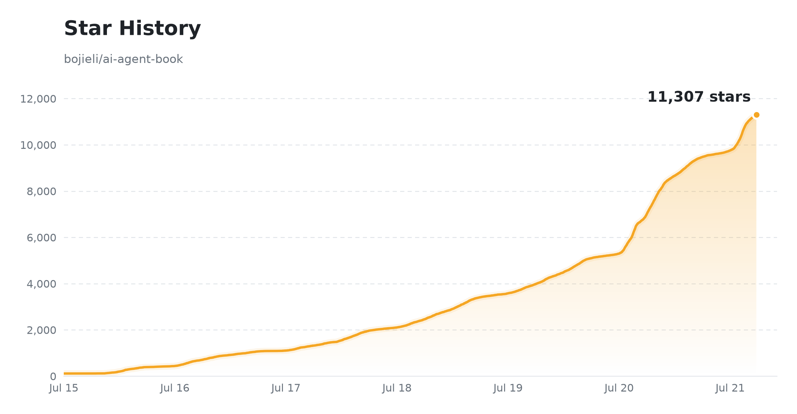

# 深入理解 AI Agent：設計原理與工程實踐

[](https://github.com/bojieli/ai-agent-book) [](../../LICENSE) [](#-電子書) [](#-電子書)

**[中文](../../README.md) · 台灣正體 ← 當前 · [English](../en/README.md) · [Tiếng Việt](../vi/README.md) · [தமிழ்](../ta/README.md)**

**Agent = LLM + 上下文 + 工具**——本書圍繞這個核心公式，用 10 章把 AI Agent 從原理講到工程實戰。全書正文、配圖、**88 個配套實驗**全部開源，歡迎親手把實驗跑一遍。

| 📚 **10 章** 正文，從基礎到生產 | 📂 **88 個** 配套專案（70+ 可獨立執行） | 🌐 **5 種** 語言：中 / 台灣正體 / 英 / 泰 / 越 |
| :---: | :---: | :---: |

## 📖 電子書

> 📥 **直接下載**（全書正文，開源免費）。以下連結始終指向 main 分支的最新建置；固定版本見 [Releases](https://github.com/bojieli/ai-agent-book/releases)：
> - **中文（原版）**：[PDF](https://github.com/bojieli/ai-agent-book/releases/download/latest/AI-Agents-in-Depth-zh-CN.pdf) · [EPUB](https://github.com/bojieli/ai-agent-book/releases/download/latest/AI-Agents-in-Depth-zh-CN.epub)
> - **台灣正體**（社群翻譯，by [@tigercosmos](https://github.com/tigercosmos)）：[PDF](https://github.com/bojieli/ai-agent-book/releases/download/latest/AI-Agents-in-Depth-zh-TW.pdf) · [EPUB](https://github.com/bojieli/ai-agent-book/releases/download/latest/AI-Agents-in-Depth-zh-TW.epub)
> - **英文**（社群翻譯，by [@nsdevaraj](https://github.com/nsdevaraj)）：[PDF](https://github.com/bojieli/ai-agent-book/releases/download/latest/AI-Agents-in-Depth-en.pdf) · [EPUB](https://github.com/bojieli/ai-agent-book/releases/download/latest/AI-Agents-in-Depth-en.epub)
> - **泰米爾語**（社群翻譯，by [@nsdevaraj](https://github.com/nsdevaraj)）：[PDF](https://github.com/bojieli/ai-agent-book/releases/download/latest/AI-Agents-in-Depth-ta.pdf) · [EPUB](https://github.com/bojieli/ai-agent-book/releases/download/latest/AI-Agents-in-Depth-ta.epub)
> - **越南語**（社群翻譯，by [@toanalien](https://github.com/toanalien)）：[PDF](https://github.com/bojieli/ai-agent-book/releases/download/latest/AI-Agents-in-Depth-vi.pdf) · [EPUB](https://github.com/bojieli/ai-agent-book/releases/download/latest/AI-Agents-in-Depth-vi.epub)

中文正文原始碼位於 [`book/`](../../book/)；台灣正體/英文/泰米爾/越南語版本為社群貢獻（可能滯後於中文原版），分別位於 [`book-zhtw/`](../../book-zhtw/)、[`book-en/`](../../book-en/)、[`book-ta/`](../../book-ta/)、[`book-vi/`](../../book-vi/)。

可使用統一的建置腳本產生中文、台灣正體、英文、泰米爾語和越南語 EPUB 3 電子書。請參閱 [EPUB 建置說明](../../EPUB.md)。

<details>
<summary><b>🔧 想自行編譯 PDF？</b>（需 pandoc / xelatex / ElegantBook）</summary>

- **正文原始碼**：`book/introduction.md`（引言）、`book/chapter1.md` ~ `book/chapter10.md`（第一至第十章）、`book/afterword.md`（後記）
- **編譯**：安裝 pandoc、xelatex、ElegantBook 文件類與相關字型後，執行

  ```bash
  cd book && bash build_pdf.sh
  ```

  圖表由 `book/gen_*_figs.py` 生成、存於 `book/images/`，排版細節見 `book/preamble.tex` 與 `book/*.lua`。

</details>

## 📑 內容速覽（第 1–10 章）

全書圍繞核心公式 **Agent = LLM + 上下文 + 工具** 展開，十章層層遞進：

| 章 | 主題 | 一句話核心 | 正文 | 程式碼 |
| :--: | --- | --- | :--: | :--: |
| 1 | 🚀 **Agent 基礎知識** | 「模型即 Agent」新典範 + **Agent = LLM + 上下文 + 工具**；Harness 工程才是競爭力 | [讀](../../book-zhtw/chapter1.zhtw.md) | [4](../../chapter1/README.zh-TW.md) |
| 2 | 🎯 **上下文工程** | 上下文決定能力上限：KV Cache、提示工程、Agent Skills、上下文壓縮 | [讀](../../book-zhtw/chapter2.zhtw.md) | [9](../../chapter2/README.zh-TW.md) |
| 3 | 📚 **使用者記憶和知識庫** | 跨會話記住使用者、接入外部知識：使用者記憶、RAG、結構化索引、知識圖譜 | [讀](../../book-zhtw/chapter3.zhtw.md) | [13](../../chapter3/README.zh-TW.md) |
| 4 | 🛠️ **工具** | 工具是 Agent 的雙手：MCP 協議、感知/執行/協作三類工具、事件驅動非同步 Agent、主動工具發現 | [讀](../../book-zhtw/chapter4.zhtw.md) | [7](../../chapter4/README.zh-TW.md) |
| 5 | 💻 **Coding Agent 與程式碼生成** | 程式碼是「能創造新工具的工具」，生產級 Coding Agent 全景 | [讀](../../book-zhtw/chapter5.zhtw.md) | [12](../../chapter5/README.zh-TW.md) |
| 6 | 🎯 **Agent 的評估** | 把表現變成可比較訊號：評估環境、指標、統計顯著性、評估驅動選型 | [讀](../../book-zhtw/chapter6.zhtw.md) | [10](../../chapter6/README.zh-TW.md) |
| 7 | 🧠 **模型後訓練** | 預訓練/SFT/RL 三階段：何時選 SFT、何時選 RL，工具呼叫內化、樣本效率 | [讀](../../book-zhtw/chapter7.zhtw.md) | [14](../../chapter7/README.zh-TW.md) |
| 8 | 🔄 **Agent 的自我進化** | 不改權重也能成長：經驗學習、從工具使用者到創造者 | [讀](../../book-zhtw/chapter8.zhtw.md) | [6](../../chapter8/README.zh-TW.md) |
| 9 | 🎙️ **多模態與即時互動** | 從文字擴充套件到語音、GUI、物理世界：語音三典範、Computer Use、機器人 | [讀](../../book-zhtw/chapter9.zhtw.md) | [7](../../chapter9/README.zh-TW.md) |
| 10 | 🤝 **多 Agent 協作** | 群體智慧高於個體：協作框架、上下文共享/隔離、湧現的「Agent 社會」 | [讀](../../book-zhtw/chapter10.zhtw.md) | [6](../../chapter10/README.zh-TW.md) |

> 💡 **讀** = 在 GitHub 網頁直接讀章節正文（markdown）；**N** = 該章配套專案數，點選檢視程式碼。專案型別說明（✅ 可執行 / 📖 復現 / 🚧 設計）見各章 README。
>
> 📚 如何高效閱讀本書？詳見 **[學習建議](LEARNING.md)**（核心理念、學習路徑、難度分級、實踐建議）。

## 🔑 API 金鑰

建議申請下面幾個平台的 API Key 方便學習。模型選型可參考 [這篇指南](https://01.me/2025/07/llm-api-setup/)。

| 平台 | 連結 | 特色 |
| --- | --- | --- |
| **Kimi**（月之暗面） | <https://platform.moonshot.cn/> | Kimi 系列，Coding、Agent 能力強 |
| **智譜 GLM** | <https://open.bigmodel.cn/> | GLM-5.2 等，Coding、Agent 能力強 |
| **Siliconflow** | <https://siliconflow.cn/> | 各種開源模型（DeepSeek、Qwen 等） |
| **火山引擎** | <https://www.volcengine.com/product/ark> | 位元組豆包閉源模型，國內訪問延遲低 |
| **OpenRouter** | <https://openrouter.ai/> | 一站式訪問 Gemini / Claude / GPT-5 等海外模型（官方 API 需海外 IP/支付方式，OpenAI 還需海外身份認證） |

## 📦 附錄 · 外部倉庫獲取

第 6、7、9、10 章的評測基準、訓練框架、機器人平台等 20 個外部倉庫**未內建**（出於體積與版權），需要自行克隆到對應目錄。

### 一鍵克隆指令碼

<details>
<summary><b>🔧 展開克隆命令</b>（共 20 個外部倉庫）</summary>

```bash
# 第 6 章 · 評測基準
git clone https://github.com/google-research/android_world.git         chapter6/android_world
git clone https://huggingface.co/datasets/gaia-benchmark/GAIA          chapter6/GAIA
git clone https://github.com/xlang-ai/OSWorld.git                      chapter6/OSWorld
git clone https://github.com/SWE-bench/SWE-bench.git                   chapter6/SWE-bench
git clone https://github.com/sierra-research/tau2-bench.git            chapter6/tau2-bench
git clone https://github.com/laude-institute/terminal-bench.git        chapter6/terminal-bench

# 第 7 章 · 訓練框架（bojieli/* 為本書適配的分支）
git clone https://github.com/bojieli/minimind.git                      chapter7/MiniMind-pretrain/minimind      # 實驗 7-3 從零訓 LLM
git clone https://github.com/bojieli/minimind-v.git                    chapter7/MiniMind-pretrain/minimind-v    # 實驗 7-4 從零訓 VLM（投影層）
git clone https://github.com/bojieli/AdaptThink.git                    chapter7/AdaptThink-original
git clone https://github.com/bojieli/AWorld.git                        chapter7/AWorld
git clone https://github.com/bojieli/SFTvsRL.git                       chapter7/SFTvsRL
git clone https://github.com/bojieli/verl.git                          chapter7/verl
git clone https://github.com/thinking-machines-lab/tinker-cookbook.git chapter7/tinker-cookbook
git clone https://github.com/bojieli/lighteval.git                     chapter7/Intuitor/lighteval
git clone https://github.com/19PINE-AI/rlvp.git                        chapter7/RLVP/rlvp                       # 實驗 7-14 RLVP 論文程式碼
git clone https://github.com/PRIME-RL/SimpleVLA-RL.git                 chapter7/SimpleVLA-RL/SimpleVLA-RL       # 實驗 7-13 視覺-語言-動作 RL

# 第 9 章 · 瀏覽器自動化與 Claude 示例
git clone https://github.com/browser-use/browser-use.git               chapter9/browser-use
git clone https://github.com/anthropics/claude-quickstarts.git         chapter9/claude-quickstarts

# 第 10 章 · 雙 Agent 架構（已獨立為 TalkAct 專案）+ 斯坦福 AI 小鎮
git clone https://github.com/19PINE-AI/TalkAct.git                     chapter10/use-computer-while-calling
git clone https://github.com/joonspk-research/generative_agents.git    chapter10/generative_agents             # 實驗 10-7 斯坦福 AI 小鎮
```

> 各專案 README 如標註了特定 commit，請按說明 `git checkout` 到對應版本以保證復現一致。第 10 章 `use-computer-while-calling` 已發展為獨立維護的 [19PINE-AI/TalkAct](https://github.com/19PINE-AI/TalkAct)，本倉庫只保留指向它的說明文件。

</details>

### 其它復現路徑

下面這些實驗無專屬 clone 命令，但有特定的復現方式：

| 實驗 | 型別 | 說明 |
| --- | :--: | --- |
| 6-2 / 6-3 / 6-4 / 6-9 | 📝 讀者練習 | 人肉基準、記憶評估、JSON Cards vs RAG、記憶選型——改造複用第 3 章 `user-memory` / `user-memory-evaluation` / `contextual-retrieval` |
| 5-12 | 📝 讀者練習 | 能創造 Agent 的 Agent——基於 `chapter5/coding-agent` 自舉擴充套件 |
| 7-8 | 📝 讀者練習 | Prompt 蒸餾——落地實現見 `chapter8/prompt-distillation`（跨章複用） |
| 7-9 | 📝 讀者練習 | CoT 蒸餾 `[擴充套件]`——書中給出實驗設計與驗收標準，無專屬程式碼 |
| 6-11 | 🤖 模擬評估 | OpenVLA + RoboTwin2——VLA 訓練/環境依賴見 `chapter7/SimpleVLA-RL` 的 README |
| 9-8 / 9-9 | 🔧 真實硬體 | XLeRobot 遙操作與 LLM Agent 控制——需 SO-100 機械臂，[Teleop](https://xlerobot.readthedocs.io/en/latest/software/getting_started/XLeRobot_teleop.html) · [LLM Agent](https://xlerobot.readthedocs.io/en/latest/software/getting_started/LLM_agent.html) |
| 9-10 | 🔧 真實硬體 | RGB 零樣本 Sim2Real 抓取——[`StoneT2000/lerobot-sim2real`](https://github.com/StoneT2000/lerobot-sim2real)（模擬可純 GPU，部署需 SO-100） |

## 🤝 貢獻

本書與配套程式碼全部開源，非常歡迎社群透過 Pull Request 參與共建：

| 型別 | 說明 |
| --- | --- |
| 📝 **書籍內容改進** | 勘誤、補充、更清晰的表述，或新增前沿進展（正文見 `book/chapter*.md`） |
| 🐛 **程式碼改進與 Bug 修復** | 讓配套專案更健壯、更易用、更貼近生產實踐 |
| 🧪 **新的實踐專案** | 為某個實驗補充/替換更好的實現，或貢獻全新的示例專案 |
| 🎨 **配圖設計改進** | 讓 `book/images/` 中的圖表更清晰美觀（配圖由 `book/gen_*_figs.py` 生成） |
| 🌐 **新語言翻譯** | 歡迎翻譯成更多語言，可參考台灣正體（`book-zhtw/`）、英文（`book-en/`）、泰米爾語（`book-ta/`）、越南語（`book-vi/`）的組織方式 |

提交前建議先把相關實驗親手跑一遍、確認可復現；也歡迎先提 issue 討論想法。

## 📄 許可證

本專案採用 [Apache License 2.0](../../LICENSE) 開源許可證，詳見 [`LICENSE`](../../LICENSE) 檔案。部分子專案可能包含各自的許可證資訊，請以子專案中的說明為準。

## ⭐ Star History

<a href="https://star-history.com/#bojieli/ai-agent-book&Date">
  <picture>
    <source media="(prefers-color-scheme: dark)" srcset="../../assets/star-history-dark.png" />
    <source media="(prefers-color-scheme: light)" srcset="../../assets/star-history-light.png" />
    
  </picture>
</a>

<sub>由 [`scripts/gen_star_history.py`](../../scripts/gen_star_history.py) 生成，[GitHub Actions](../../.github/workflows/star-history.yml) 每日自動更新 · 點選圖片檢視即時資料</sub>
